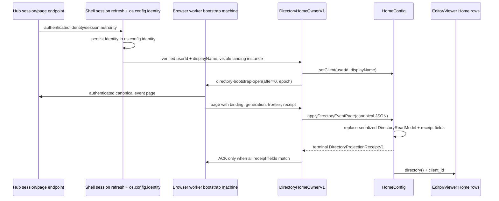

# Home Host Read-Model Owner Refresh

## Scope and evidence

This is a read-only source audit for the Home directory, signed-in client, and active-panel-tab ownership boundary. It refreshes the Home portions of `remaining-window-owner-audit.md`, `ownership-completion-checklist.md`, and `store-owner-capability-level-review.md` in this ticket.

I inspected the paths cited below. I did **not** run Bun, Nx, Cargo, native targets, browser tests, or a live Hub session. Therefore every finding labelled **source** is a code-path finding only; no statement below is runtime evidence. The authored tests listed later are test targets, not passing results.

## Decision from the current source

`DirectoryHomeOwnerV1` is a browser host orchestration owner, not a `DirectoryReadModel` owner. It opens or reuses a Home instance, invokes Home actions, and gates worker ACKs on Home's terminal receipt. The actual durable projection and the duplicated client identity still live in `HomeConfig`.

The OS already has authoritative session and identity owners, but it does **not** yet have an implemented host-to-guest directory read-model input. The existing guest boundary is an action bridge plus `ViewModel`; `ConfigView` exposes app config and an optional exact-window config only. A safe move therefore needs a narrow directory projection contract and host projection path first. It cannot be completed by moving existing Home fields into another plugin config or by treating the browser bootstrap owner as though it already stored the projection.

`HomeConfig.active_panel_tab` is not an exact Home window setting. On the browser host, the active panel belongs to the host-owned `ViewModel.panelJson` carriage; the host intercepts `setActivePanelTab` before normal guest dispatch. The WGPU shell sends the verb to the host controller without a window identity. Do not create a `WindowConfigOwner` for this field. The existing exact-window machinery is correct for a future actual `s-home-main` window preference, but it is not the current panel-tab boundary.

## Current ownership map — source evidence

| Value or operation | Current source owner | Current consumer / effect | Important limit |
| --- | --- | --- | --- |
| Directory structure and fold | `🧰️framework/🛍️products/💻️os/🔨️modules/📇️directory/🦀️.rs:1-9,58-66,83-90` | Home serializes/folds it; editor and viewer render its rows | This is a pure shared model and fold, not a persistent OS owner. |
| Page fetching, pending page, ACK frontier, live stream | Browser worker `…/🏪️store/👷️worker/🟦️.ts:4293-4474`; request union `…/💻️os/🟦️.ts:1192-1195` | Fetch → retained guest action → receipt-matched ACK → stream | `DirectoryEventPageBootstrapV1` stores an epoch, frontier, pending page, phase, and client; no `DirectoryReadModel`. |
| Verified session authority | `…/📇️directory/🧬️schema/🪪️session-authority-v1/🟦️.ts` and ShellHost session refresh at `…/🏛️ShellHost/🟦️.tsx:3274-3306` | The worker compares page binding/generation before presenting it | This is the authenticated authority; `HomeConfig` only stores a copied receipt/binding/generation. |
| Signed-in identity | Worker identity facet `…/🏪️store/👷️worker/🟦️.ts:2713-2735`; ShellHost opens/persists it at `…/🏛️ShellHost/🟦️.tsx:3231-3295` | Shell identity and `DirectoryHomeIdentityV1` | `identityActorConfig` binds `os.config.identity` under `${dataDir}/os` when available. |
| Home directory projection and receipt fields | `✏️s/🔌️plugins/🪐️space/🗿️artifacts/🏠️home/🏅️standards/🔖️1/🪆️subsets/✳️any/✏️editor/🎚️config/🦀️.rs:122-159,161-190,259-281,364-385` | Editor main decodes it at `…/🎭️modes/🔎️explore/🪟️windows/🏠️main/🦀️.rs:174-182`; viewer uses the same config | This is the current durable read-model copy. Validation checks shape/digests and page continuity; it does not consult the live host authority. |
| Home client id/name | Home `SetClient` at `…/🎮️commands/🪪️set-client/🦀️.rs:19-22` | Both main surfaces use `client_id`; `createStudio` makes `SpaceUser` from both fields at `…/🎮️commands/🏗️create-studio/🦀️.rs:37-65` | It duplicates `os.config.identity`; native folder creation falls back to a fabricated `local` owner if it is empty (`:20-28`). |
| Guest action bridge | `…/🏛️ShellHost/📇️directory-bootstrap/🟦️.tsx:96-108,112-184,216-256` | It calls `setClient`, then `applyDirectoryEventPage`, parses the exact receipt, and only then ACKs | Its `DirectoryHomeOwnerV1` record has plugin/app/instance/view state/identity/abort/pending fields (`:27-45`), not the read model. |
| Home editor/viewer extra event fold | Viewer `…/👁️viewer/🦀️.rs:84-95`; `HomeConfigMutation::FoldDirectoryEvent` `…/🎚️config/🦀️.rs:267-270,369-372` | Any parseable event is folded into Home config | This bypasses page authority, binding/generation, receipt, and page-frontier checks. It contradicts the nearby “only writer” documentation. |
| Browser active panel | `…/🏛️ShellHost/🟦️.tsx:5063-5071,6384-6389,8393-8399,9272-9275`; panel codec `…/🛠️ShellHelpers/📌️panel/🟦️.ts:19-60` | `SpacePanelState.activePanelTab` is encoded in the active session's `ViewModel.panelJson` | The helper describes itself as the host-owned panel carriage. The Home config field is a separate mirror. |
| Native active panel | WGPU shell `…/🐚️Shell/🎯️targets/🧊️wgpu/🦀️.rs:3105-3107,6710-6716,7036-7042,7300-7303` | Shell updates its own active tab, then dispatches `setActivePanelTab` to the host controller | The descriptor has `tabId`, no window instance id. This is source parity work still owed, not evidence of a tested native result. |

## End-to-end current dataflow — source evidence

The precise hop boundaries are:

1. `openDirectoryHomeOwnerV1` requires `setClient` and `applyDirectoryEventPage` to exist (`directory-bootstrap:125-130`). It either reuses the visible instance or creates one, builds a view state with the first Home window kind as `windowId`, and sends `setClient` over the exact address (`:140-182`). The address contains plugin, app, mode, window kind, window instance, action, and a duplicated `windowId` argument (`:96-108`). This identifies the invocation; it does not grant a host directory model view.
2. The browser worker fetches a canonical page, rejects it when the live binding/generation differs, retains one pending page, and emits it to the host (`…/🏪️store/👷️worker/🟦️.ts:4293-4494`). `DirectoryEventPageBootstrapV1` requires all four page receipt dimensions plus its epoch on ACK (`:4294-4349`).
3. Home parses the page, checks its stored continuity, folds each event, sets the cursor and copied authority/receipt, and returns `ReplaceDirectoryProjection` plus a receipt event (`HomeConfig:161-190`; page command `…/🎮️commands/📬️apply-directory-event-page/🦀️.rs:18-35`).
4. The host parses a closed receipt record and requires binding, authorization generation, cursor, and receipt digest to match before it posts the ACK (`directory-bootstrap:205-256`). A mismatch closes the owner; an action exception sends reject/retry.
5. The editor main reads `cfg.directory()` and `cfg.client_id` only; the viewer main takes the same `DirectoryReadModel` plus client id. Neither examined renderer reads Home's binding, generation, receipt, client name, or `active_panel_tab`.
6. Separately, the viewer's `FoldDirectoryEvents` creates individual `FoldDirectoryEvent` config mutations. That path is not fed through the authenticated page/receipt protocol.

## Exact active-panel-tab boundary

The source establishes a host panel selection, not a Home main-window selection.

- In the browser shell, an action whose controller is the host controller and whose verb is `setActivePanelTab` is intercepted. The handler rebuilds `SpacePanelState` and writes only `session.viewState.panelJson` (`ShellHost:6384-6389`; `updateSpacePanel:5063-5071`). Shell rendering reads that panel state's `activePanelTab` to select panel content (`:8393-8399,9272-9275`). It does not invoke `HomeConfigMutation::SetActivePanelTab` along this branch.
- The panel helper calls `panelJson` the host-to-guest panel carriage and explicitly keeps it separate from the app roster (`ShellHelpers/panel:19-60`). `ViewModel.panel_json` is also documented as host-owned in `🧰️framework/🔨️modules/🛂️manifest/🦀️.rs:4369-4386`.
- In the native WGPU shell, a right-panel hit sets native shell state and dispatches the same verb to `host_controller_id()` (`wgpu:6710-6716`); the search palette can similarly dispatch through the current session's controller (`:7295-7303`). The source action carries only `tabId`.
- Home still maps `setActivePanelTab` to `HomeConfigMutation::SetActivePanelTab` (`…/✏️editor/🦀️.rs:31-56,461-515`; `…/🎮️commands/⚙️set-active-panel-tab/🦀️.rs:9-17`). Its config test proves only mutation algebra in source, not that a host path uses its persisted value.

`WindowConfigOwner` is deliberately more specific: it captures the exact `ViewModel.window_id` or focused id from the current window-instance roster, partitions by `(kind, instance)`, and rejects emissions whose address differs (`…/🪟️window/🎚️config/🦀️.rs:12-23,222-237,523-542,590-595`). `ConfigView` can expose such a registered window snapshot (`…/🔌️plugin/🦀️.rs:8643-8654`). Home does not register one; `ArtifactApp`'s default is empty (`:11042-11050`). Moving the tab there would invent a window identity that neither current host action supplies.

## Stale or corrected prior findings

| Prior conclusion to revise | Refreshed conclusion | Source basis |
| --- | --- | --- |
| Home still needed a new host bootstrap boundary. | The browser already has `DirectoryHomeOwnerV1`, an exact action address, receipt-gated ACK, cancellation, and a worker bootstrap state machine. The missing piece is the actual OS projection owner and guest read-model input. | `directory-bootstrap:27-256`; worker `:4293-4494`. |
| The sole writer is the authenticated page fold. | Not true as written. `FoldDirectoryEvent` exists in the config mutation and the viewer exposes `FoldDirectoryEvents`; both lack page receipt/authority checks. | Home config `:259-281,364-385`; viewer `:84-95`. |
| `active_panel_tab` is the persisted preference of the exact Home main window. | False for the current source. Browser host panel state is session `panelJson`; native invocations have no window id; Home main rendering does not read the field. It must not be moved to a window owner. | ShellHost `:5063-5071,6384-6389`; WGPU `:6710-6716`; Home main `:174-182`. |
| “The Home main window” identifies one surface. | There are two Home surface kinds: editor `s-home-main` and viewer `s-home-view-main`. The latter makes the one-window premise incomplete even for future per-window work. | Editor main `…/✏️editor/🎭️modes/🔎️explore/🪟️windows/🏠️main/🦀️.rs:30-41`; viewer main `…/👁️viewer/🎭️modes/👁️view/🪟️windows/🏠️main/🦀️.rs:17-29`. |
| Home client fields are the client identity owner. | The OS identity facet is now the owner. Home fields are an operational copy that current rendering and studio creation still depend on. | identity worker `:2713-2735`; ShellHost `:3231-3295`; create studio `:37-65`. |

## Minimal schema-first execution slices

These are ordered implementation slices, not existing APIs. Names in this section describe required contracts; they must be designed in the established `📇️directory` taxonomy and mirrored across the native and TypeScript surfaces before code is written.

1. **Delete the panel-tab mirror without creating window config.** First establish a browser/WGPU parity law for `setActivePanelTab`: its source identity is host controller/session panel state; no Home config mutation and no window instance may be required. Then remove `active_panel_tab`, `SetActivePanelTab`, its generated schema field, command, action declaration, and source tests from Home in one coherent cut. Retain the shell's host panel carriage.
2. **Define one directory projection contract beside the existing OS directory model.** It must contain the projection, session binding digest, authorization generation, frontier, and receipt digest as one immutable read model. The contract must make an unbound initial state explicit and make authority changes require rebootstrap from zero. It is not an OS “mega-config” and it is not a Home-local serialization.
3. **Make the OS directory owner retain that contract.** Extend the current worker/bootstrap owner for browser and the analogous native directory client owner so the same owner that verifies pages and advances the ACK frontier owns the folded projection. Fold only an accepted canonical page; on authority change, close/clear/rebootstrap before exposing a new projection. Remove the viewer's direct-event fold route as part of this slice.
4. **Add a narrow host-to-guest read-only projection boundary.** There is no existing typed directory field in `ViewModel` or `ConfigView`; `ConfigView` is app config plus optional exact-window config, and `panelJson` is reserved for host panel state. Add a directory-specific read-only carrier at the framework host/guest boundary. Do not encode the projection in `panelJson`, duplicate it into a plugin config, or broaden `ConfigView` into an untyped host-data bag.
5. **Move Home consumers to the boundary.** Editor and viewer table rows consume the projected directory and client identity from that carrier. `createStudio` consumes the authoritative identity/capability supplied by the same host context, never `HomeConfig`; remove its `local` fallback. Only after the host and both surfaces use the new carrier can `directory_json`, session/generation/receipt, `client_id`, `client_name`, page action, `setClient`, and direct-fold mutation disappear together.

The framework's existing exact-window capability should remain unchanged in this work. If a later Home UI adds a real per-instance setting read by `s-home-main`, it should define a concrete owner for that kind and emit a `WindowConfigMutation::of` under the captured authority. That is a separate feature, with an actual consumer and a trusted window address.

## Acceptance laws and current target ledger

All of the following are proposed acceptance laws. None was executed in this audit.

### TypeScript/browser laws

| Law | Current or proposed target |
| --- | --- |
| A page is visible only after canonical parse and a live binding/generation match; it advances exactly once after the matching projection receipt; stale/cancelled owners cannot ACK. | Extend `🧰️framework/🛍️products/💻️os/🔨️modules/📺️renderer/🧑‍🎨engine/🧪️tests/📇️directory-home-bootstrap/🟦️.tsx` and the worker's in-source tests. |
| Authority changes clear the prior projection and require a page from `after = 0`; no old projection can render under the new identity. | Extend the directory session/worker test seam; session source target: `…/🧪️tests/📇️session-authority-notice/🟦️.tsx`. |
| Editor and viewer given the same OS projection produce the same Home rows and client-based capability result, without a `HomeConfig` directory/client copy. | New narrow boundary test beside the eventual host projection carrier plus existing Home renderer unit tests. |
| Host panel selection changes `ViewModel.panelJson`, is read back by the shell, and never dispatches/needs a Home config mutation or window id. | Add to the existing engine contract test group `…/🧪️tests/🔬️engine-contract/🟦️.ts`; retain the direct ShellHost assertion at `ShellHost:6384-6389`. |

### Native laws

| Law | Current target |
| --- | --- |
| Native directory bootstrap enforces canonical page order, exact receipt ACK fields, close/retry, and rebootstrap semantics while retaining the OS projection. | `🧰️framework/🛍️products/💻️os/🔨️modules/📇️directory/🔌️client/🧪️tests/🔬️unit/🦀️.rs`; runtime counterparts exist at `…/🧪️tests/🪪️runtime/🦀️.rs`, `…/🧪️tests/🔬️native-streaming/🦀️.rs`, and `…/🧪️tests/🔬️native-runtime-identity/🦀️.rs`. |
| Home no longer has a serializable directory/client/tab config field or mutation; both editor/viewer consume the host projection input. | Existing Home config unit target `…/✏️editor/🎚️config/🧪️tests/🔬️unit/🦀️.rs`; add focused renderer tests beside the two Home main windows. |
| The old `applyDirectoryEventPage`, `setClient`, and viewer `FoldDirectoryEvents` routes cannot reach a mutable Home projection after the coordinated cut. | Existing command unit targets `…/🎮️commands/📬️apply-directory-event-page/🧪️tests/🔬️unit/🦀️.rs` and `…/🎮️commands/⚙️set-active-panel-tab/🧪️tests/🔬️unit/🦀️.rs`, updated or removed with their commands; add a viewer command-negation test. |
| A shell panel action remains host/session scoped and receives no exact window-config address. | Add to the WGPU shell's existing test suite beside `…/🐚️Shell/🎯️targets/🧊️wgpu/🦀️.rs`; source anchors are `:6710-6716` and `:7036-7042`. |

`🧰️framework/🛍️products/💻️os/🔨️modules/🔌️plugin/🪟️window/🎚️config/🧪️tests/🪪️pack-identity/🦀️.rs` and `…/🧪️tests/🪟️retained-window-config/🦀️.rs` remain current framework targets, but they are not a Home tab migration target. Their existing work belongs to the retained framework/window validation lane.

## Proposed touched-file ledger

This is a review ledger, not a change list. No production file was modified by this audit.

| Area | Proposed paths | Change reason |
| --- | --- | --- |
| Directory contract and owners | Existing `🧰️framework/🛍️products/💻️os/🔨️modules/📇️directory/**`, browser worker `…/🏪️store/👷️worker/🟦️.ts`, native directory client `…/📇️directory/🔌️client/🦀️.rs` | Add the schema-first OS projection owner and its native/TS parity. |
| Host lifecycle and guest boundary | `…/📺️renderer/🧑‍🎨engine/🧱️elements/🏛️ShellHost/📇️directory-bootstrap/🟦️.tsx`, `…/🏛️ShellHost/🟦️.tsx`, framework plugin/view boundary under `…/🔌️plugin/**` | Replace action-mediated Home projection writes with a narrow read-only host projection carrier. |
| Home configuration and commands | Home editor config Rust/schema, `apply-directory-event-page`, `set-client`, `set-active-panel-tab`, viewer source | Remove the three mixed ownership records and the direct fold routes in one coordinated cut. |
| Home surfaces and creation | Editor/viewer Home main windows; `create-studio` | Read the host projection/identity; remove the `local` owner fallback. |
| Shell panel state | `ShellHost/🟦️.tsx`, `ShellHelpers/📌️panel/🟦️.ts`, WGPU shell tests | Preserve host panel ownership and prove browser/native command-source parity. |
| Tests | The source targets listed above | Add the acceptance laws before deleting the action/config compatibility paths. |

No `WindowConfigOwner` file belongs in this ledger unless a later feature first introduces an actual Home-window-local setting and render consumer.

## Runtime evidence status

There is no runtime evidence from this audit. I made no source edits, no Git mutations, and no Cargo/Bun/Nx/test invocation. In particular, the runtime status of browser bootstrap, native stream/identity, WGPU panel routing, and the authored Home tests remains unverified here.
