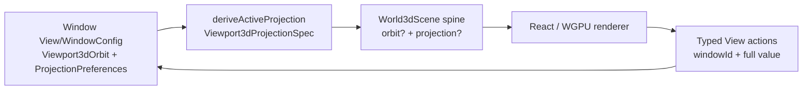

# World Scene Projection Ownership Audit

## Decision

`World3dScene.cameraJson` is an opaque, cross-runtime camera *transport* that currently mixes window navigation pose, selected rendering projection, and a parser/payload FOV that is distinct from the active renderer lens. It must become typed scene-spine fields. It must not become the persistent owner of any of those values.

The reusable first-party value owners are:

| Value | Correct owner | Mutable owner |
|---|---|---|
| `Viewport3dOrbit` (`position`, `target`, positive `zoom`, optional `up`) | neutral `ui/viewport/3d` schema package | exact application window's local/session View/WindowConfig state |
| `Viewport3dProjectionPreferences` (the complete editable preset bank) | same neutral schema package | exact application window's local/session View/WindowConfig state |
| `Viewport3dProjectionSpec` (one active mode plus orientation) | same neutral schema package; pure derivation from preferences | derived only; never independently persisted alongside preferences |
| `World3dScene.orbit?` and `World3dScene.projection?` | scene spine / Pack / JSON contract | ephemeral renderer input; neither document state nor OS-global preference |

There is no evidence for an OS-wide active camera or active projection preference. Puzzle and CAD explicitly model their camera as a per-window view value. Document-owned Shooting cameras are a separate authored capture domain. The scene is a renderer input and must not turn the per-window preferences into shared document state.



This division retains inactive edit values in the window and sends only a snapshot of the active renderer projection across the scene boundary.

## Verified Current Flow

`World3dScene` currently declares `cameraJson: string` in [`ui/scene/🟦️.ts`](/Users/ueli/Documents/semio/🧰️framework/🔨️modules/🖱️ui/🎬️scene/🟦️.ts:269). Its Rust scene spine stores, Packs, Value-encodes, and decodes the same required `camera_json: String` in [`scene/🎬️scenes/🦀️.rs`](/Users/ueli/Documents/semio/🧰️framework/🔨️modules/🖱️ui/🎬️scene/🎬️scenes/🦀️.rs:213), [`...:307`](/Users/ueli/Documents/semio/🧰️framework/🔨️modules/🖱️ui/🎬️scene/🎬️scenes/🦀️.rs:307), and [`...:379`](/Users/ueli/Documents/semio/🧰️framework/🔨️modules/🖱️ui/🎬️scene/🎬️scenes/🦀️.rs:379). It is deliberately a scene spine member rather than a retained lane.

The React world host parses it permissively in [`renderer/engine/elements/World3dHost:750`](/Users/ueli/Documents/semio/🧰️framework/🛍️products/💻️os/🔨️modules/📺️renderer/🧑‍🎨engine/🧱️elements/🌐️World3dHost/🟦️.tsx:750). A missing or malformed object falls back to position `[4,-4,3]`, target origin, zoom `1`, and FOV `45`; an absent `projection` gives `explicitProjection = false` ([`...:764`](/Users/ueli/Documents/semio/🧰️framework/🛍️products/💻️os/🔨️modules/📺️renderer/🧑‍🎨engine/🧱️elements/🌐️World3dHost/🟦️.tsx:764)). The host uses the literal presence of `"position"` in the raw JSON to decide whether to use that parsed camera or auto-fit instances ([`...:4928`](/Users/ueli/Documents/semio/🧰️framework/🛍️products/💻️os/🔨️modules/📺️renderer/🧑‍🎨engine/🧱️elements/🌐️World3dHost/🟦️.tsx:4928)). It also performs raw-string equality before approximate pose comparison for camera reattachment ([`...:875`](/Users/ueli/Documents/semio/🧰️framework/🛍️products/💻️os/🔨️modules/📺️renderer/🧑‍🎨engine/🧱️elements/🌐️World3dHost/🟦️.tsx:875)). Therefore whitespace and alternate coordinates can alter attach/fit work even when the physical pose is equivalent. These are verified parser/host data-flow facts, not inferred API naming.

The parser's `cameraState.fov = 45` is **not** the current effective Three lens for an absent spec. The host defaults `worldProjectionSpec` to three-point 50 ([`World3dHost:5982`](/Users/ueli/Documents/semio/🧰️framework/🛍️products/💻️os/🔨️modules/📺️renderer/🧑‍🎨engine/🧱️elements/🌐️World3dHost/🟦️.tsx:5982)), and `WorldProjectionRig` computes `worldProjectionPerspectiveFov(spec)` then mounts a `PerspectiveCamera` with that value ([`r3f:2861`](/Users/ueli/Documents/semio/🧰️framework/🛍️products/💻️os/🔨️modules/♾️infinite/🌍️world/🎨️r3f/🟦️.tsx:2861), [`...:2874`](/Users/ueli/Documents/semio/🧰️framework/🛍️products/💻️os/🔨️modules/♾️infinite/🌍️world/🎨️r3f/🟦️.tsx:2874)); the fallback calculation is 50 ([`...:2328`](/Users/ueli/Documents/semio/🧰️framework/🛍️products/💻️os/🔨️modules/♾️infinite/🌍️world/🎨️r3f/🟦️.tsx:2328)). `WorldCanvas` is passed 45 ([`World3dHost:6595`](/Users/ueli/Documents/semio/🧰️framework/🛍️products/💻️os/🔨️modules/📺️renderer/🧑‍🎨engine/🧱️elements/🌐️World3dHost/🟦️.tsx:6595)), but the rig's default Three camera is the active camera. Thus 45 is observed parser/helper data, while the absent-spec rig renders 50. It is not an active lens default to preserve in a neutral transport schema.

The WGPU world bridge independently digests the raw camera string and deserializes it into `World3dSceneCameraRecord`, which only recognizes position, target, up, and FOV. See [`infinite/world/🦀️.rs:9315`](/Users/ueli/Documents/semio/🧰️framework/🛍️products/💻️os/🔨️modules/♾️infinite/🌍️world/🦀️.rs:9315), [`...:9427`](/Users/ueli/Documents/semio/🧰️framework/🛍️products/💻️os/🔨️modules/♾️infinite/🌍️world/🦀️.rs:9427), and [`...:9499`](/Users/ueli/Documents/semio/🧰️framework/🛍️products/💻️os/🔨️modules/♾️infinite/🌍️world/🦀️.rs:9499). It loses zoom and the active projection already carried by many producers. The native math `Camera3d` and `OrbitCamera` are renderer/matrix values and retain near/far and an FOV; they must remain math values, not become the cross-runtime schema.

### Actual producers and consumers

| Route | Current payload | Migration role |
|---|---|---|
| `world3d_camera_json` and `world3d_default_camera` in the WGPU UI component layer | position, target, up, FOV; default `[4,-4,3]`, origin, `45`; no zoom or active spec | preserve the supplied FOV through an active perspective spec when the scene is activated; final framing/attach semantics belong to the separate scene activation contract |
| `world3d_camera_projection_json` in the plugin module | pose/zoom plus a derived active projection object | split into typed `orbit` and `projection: spec`; retain the editable config only in WindowConfig |
| CAD editor/viewer, Puzzle 3D editor, Block 3D editor/viewer and Block 5D viewer | use the full-projection helper | direct compile-time migration participants; no JSON intermediary |
| lowpoly, procedural/process 3D, and the stdio artifact editor/viewer family | use the plain helper | active perspective/FOV and final framing-contract migration participants |
| Shooting editor/viewer | hand-encode `ShootingCamera` to JSON | retain the authored Shooting camera; introduce a narrow, explicit boundary conversion only |
| React `World3dHost` and `WorldProjectionRig` | parse raw JSON, choose auto-fit, attach orbit control, construct Three cameras/matrices | consume typed transport and own only renderer-local initialization/Three objects |
| WGPU `infinite/world` bridge | raw digest and JSON parse into incomplete record | consume the shared typed values directly and hash/compare structural values |

`World3dScene::base` callers and existing scene/engine golden tests are additional codec migration participants. They currently prove only string retention (including `{}`), not camera semantics.

## Required Typed Scene Transport and Activation Contract Gap

The neutral migration establishes the two scene transport fields without encoding a historical parser boolean or a generic `implicitPerspective` projection taxonomy:

```text
World3dScene {
  orbit?: Viewport3dOrbit
  projection?: Viewport3dProjectionSpec
  ...existing world fields
}
```

`fov` lives only in selected perspective modes. `Viewport3dOrbit`, `World3dScene`, `Camera3d`, and a generic set-camera action have no top-level FOV. Orthographic/axonometric/oblique specs have no FOV; their view scale remains orbit zoom. Absence of a spec selects the renderer's explicit default active spec, currently three-point 50.

This is the scene shape to migrate, but it is deliberately not a complete activation policy. The final scene/renderer contract must independently state the initial framing behavior. That policy is a scene/renderer concern, not a reusable projection value: it distinguishes auto-fit when no orbit is supplied, preserving a supplied pose, and the current selected-projection content-fit-until-interaction behavior. It must not be represented by adding an `implicitPerspective` variant to `Viewport3dProjectionSpec`.

The semantic matrix to settle in that activation contract is:

| Typed input | First attach | Later external update | Current source counterpart |
|---|---|---|---|
| no `orbit`, no `projection` | renderer-local implicit initialization: auto-fit when instances exist, otherwise its fallback pose/lens | a later supplied orbit/projection becomes an external change; user interaction remains local until its View action arrives | `{}`, malformed JSON, or no `position` literal |
| `orbit`, no `projection` | supplied pose with the renderer's default active projection | pose updates must not manufacture a selected projection | a partial legacy camera object lacking `projection` |
| `orbit`, `projection: spec` | supplied pose, lens, and selected active mode; framing policy decides preserve-pose versus projection content-fit | renderer applies the selected mode; a fresh external spec reattaches/updates deterministically | full projection helper payload and any plain helper whose supplied FOV must remain effective |

Omission is meaningful. `null` must be rejected by the closed JSON/Pack schema, rather than silently treated as omission. Once this greenfield schema lands, malformed JSON, coordinate aliases (`x/y/z`), bare family strings, and raw-string `includes` behavior are not compatibility inputs; decode failures must reject the scene value. The renderer may still initialize when the **typed optional fields are absent**, never because a serialized camera failed to parse.

The host should delete `explicitProjection` rather than preserve it as schema state. Its only current consumer is `WorldOrbitGated`; when its projection prop is omitted, that component derives the same family from the active Three camera class. The actual behavior axes are typed orbit presence, typed active-spec presence, and a scene/renderer initial-framing policy. Today, spec presence also enables projection content fit; making a helper FOV effective by supplying a spec would otherwise change that behavior. Its attach comparison must compare typed fields, not raw serialization. Programmatic auto-fit remains renderer-local until a deliberate View action records the resulting orbit; user orbit/gizmo interactions continue to emit the same debounced View intent. Projection changes must be processed as window-config updates, so a mode selection and its derived pose change are atomic for that window.

## Projection Taxonomy and Defaults

The React renderer presently owns a useful active type in [`infinite/world/r3f/🟦️.tsx:2296`](/Users/ueli/Documents/semio/🧰️framework/🛍️products/💻️os/🔨️modules/♾️infinite/🌍️world/🎨️r3f/🟦️.tsx:2296). It must move unchanged in meaning into the neutral schema owner, with strict Rust and TypeScript codecs, then the renderer imports it.

| Active kind | Active values | Default active spec |
|---|---|---|
| `orthographic` | cardinal orientation: plan, top, bottom, front, back, left, right | cardinal `plan` |
| `axonometric` | isometric/dimetric/trimetric; `angleA`, `angleB`; corner quadrant NE/NW/SE/SW, upper/lower hemisphere | isometric `30/30`, NE upper |
| `oblique` | cabinet/cavalier/military; `angle`, `depthScale`; cardinal/free orientation | cavalier `45/1`, front |
| `onePoint` | `fov`; cardinal/free orientation | `50`, front |
| `twoPoint` | `fov`, `verticalShift`; cardinal/free orientation | `50`, shift `0`, free |
| `threePoint` | `fov`; cardinal/free orientation | `50`, free |
| `curvilinear` | `fov`, `strength`, fisheye/panini mapping; cardinal/free orientation | `120`, `1`, fisheye, free |

The existing native `WorldProjectionConfig` is a different value: a 15-field **full editable preset bank**. Its current default is `threePoint`, orthographic top, isometric, angles `15/12`, NE, cavalier `45/1`, one-point Y, shared FOV `50`, shift `0`, curvilinear `120/1/fisheye`. It keeps inactive values specifically so switching modes does not erase settings. It must become `Viewport3dProjectionPreferences`, with a closed discriminated schema instead of its string fields, and must remain a complete window value.

The pure `deriveActiveProjection(preferences)` law is:

* orthographic derives its selected cardinal view;
* axonometric derives isometric `30/30`, dimetric `A/A`, or trimetric `A/B`, plus the selected quadrant and upper hemisphere;
* oblique derives angle/depth and uses plan for military, front otherwise;
* one point derives FOV and X/ Y/ Z as left/front/top;
* two point, three point, and curvilinear derive their shown settings and free orientation.

The React active taxonomy permits lower-hemisphere corners, while the present native preferences neither store nor emit that value. This is a renderer type capability, not proof of a current native product preference. The initial neutral active schema should accept it to preserve the actual renderer contract, but no new lower-hemisphere preference/default should be invented without a product decision.

There are two source-level defaults which must remain distinguishable during migration:

* `world3d_default_camera` and plain helper callers serialize FOV **45**.
* a fresh full `WorldProjectionConfig` derives explicit three-point FOV **50**.

The host's current fallback active renderer spec is three-point 50 even when its parsed camera FOV is 45; the rig makes 50 the mounted Three camera's lens. This is verified from code paths but not runtime-tested here. Source inventory also shows plain helper callers with arbitrary configured FOVs in Generation3d preview, Lowpoly model, and Process3d. Those values cannot simply disappear when typed scene activation begins. The final activation contract must lower a supplied plain-helper FOV into an active perspective spec that owns the FOV, while separately preserving its intended initial framing behavior. It must not smuggle that distinction into a generic `implicitPerspective` math variant.

Source review also finds that native `world3d_projection_pose` reads axonometric angles at the active-spec root although the serializer nests them in `mode`; its fallback therefore appears to be 30/30. This is a code-inspection defect distinct from ownership, but the implementation must fix it in the same projection slice: configured dimetric/trimetric values govern the derived spec and native pose. The fixture must prove that law.

## Commands and Concrete State Owners

Each application window should store the following local/session value under its window identity:

```text
Viewport3dWindowViewConfig {
  orbit: Viewport3dOrbit
  projectionPreferences: Viewport3dProjectionPreferences
}
```

`Puzzle3dCamera` already documents this ownership and its window schema carries the full projection fields. CAD has the same intent but currently duplicates a projection DSL and copies its fields into the common config. FEM likewise treats camera/result display as WindowConfig. These become direct adopters of the neutral value; no application should use an artifact/document camera as a substitute for this state.

Replace stringly `setProjection { field, value }` and `setProjectionParam { param, value }` grammars with closed action payloads at the app command boundary:

```text
SetViewport3dOrbit { windowId, orbit: Viewport3dOrbit }
SetViewport3dProjectionPreferences {
  windowId,
  projectionPreferences: Viewport3dProjectionPreferences
}
```

They are View/WindowConfig events, not document edits and not OS preferences. An implementation may expose domain-specific UI commands, but reducers must lower them to these complete typed values. A selector change derives a snapped orbit and writes the updated projection preferences plus orbit as one window event. Parameter changes preserve the pose unless the established domain rule says otherwise. The active `Viewport3dProjectionSpec` is output-only: accepting it as a set-camera payload would discard all inactive presets.

`WorldOrbitProjectionSwitchPane` currently keeps a pending renderer spec locally because the old native handler cannot losslessly accept it. It must dispatch the typed full preferences command (or a product-specific command that produces it) after this migration; it must not send the renderer spec through an opaque adapter.

## Cameras That Must Stay Separate

| Value | Why it is not the new shared window/schema camera |
|---|---|
| native scene-math `Camera3d` / `OrbitCamera` | projection matrices, near/far, rays, and GPU math ownership |
| React basis `Camera` and external `ThreeCamera` | basis/orientation and external renderer object lifetime, neither a portable orbit value |
| `IconRenderCamera` | icon render request including lighting/output concerns |
| tutorial camera timeline | authored/tutorial runtime driver with its own timeline and FOV; it may drive a renderer locally but does not persist WindowConfig |
| `ShootingCamera` / `ShootingSavedCamera` | persisted, authored capture framing; its `projection?: String` is not a full world preset bank |

Shooting's editor/viewer manually serializes its capture camera (see [`viewer scene:59`](/Users/ueli/Documents/semio/✏️s/🔌️plugins/🎥️shooting/🗿️artifacts/🎥️shooting/🏅️standards/🔖️1/🪆️subsets/✳️any/👁️viewer/🎭️modes/👁️view/🪟️windows/🎥️scene/🦀️.rs:59) and [`editor scene:102`](/Users/ueli/Documents/semio/✏️s/🔌️plugins/🎥️shooting/🗿️artifacts/🎥️shooting/🏅️standards/🔖️1/🪆️subsets/✳️any/✏️editor/🎭️modes/✏️edit/🪟️windows/🎥️scene/🦀️.rs:102)). Its boundary should convert declared perspective/orthographic meanings into typed transport only after validating them. An unknown capture projection must not be guessed as a world preset, and none of Shooting's authored values belong in the window-local preferences.

## Schema-First Migration Slices

1. **Neutral values and fixtures.** Add JSON schema, strict Rust/TS value codecs, Pack codecs, finite/range checks, and one language-neutral fixture set for `Viewport3dOrbit`, `Viewport3dProjectionPreferences`, all seven active modes, all orientations, and the optional typed scene projection. Keep `Viewport3dOrbit`'s existing strict vector/positive zoom contract.
2. **Pure derivation.** Implement `deriveActiveProjection` in Rust and TypeScript from the same fixture corpus. A renderer-only implementation is insufficient. Validate the resulting active values with the current Three projection rig and native projection/math implementation, including orthographic, axonometric, oblique, each perspective mode, and curvilinear.
3. **Scene codecs atomically.** Change the TS scene type, Rust scene struct, Value conversion, serde JSON, Pack wire, scene builders, native bridge record, and all scene/golden fixtures in one compatibility-free slice. Delete camera JSON parsing/digesting. Structural scene equality/digest must have equal results for equal typed values independent of serialization ordering.
4. **Renderer attach semantics.** Replace raw JSON parsing, `includes`, and raw seed keys with a typed initialization state. Test initial auto-fit, implicit supplied pose, explicit selected projection, later external updates, and a user orbit action. Auto-fit must not emit a view action until intentional persistence occurs.
5. **Window configurations and actions.** Adopt the neutral full preferences value in Puzzle, CAD, FEM, Block, and other world windows; replace string field/parameter commands and CAD's hand-copied DSL. A command round trip must retain every inactive preference. Migrate the renderer pane only after the receiving action is lossless.
6. **Domain boundaries and activation.** Convert full-config producers to derived specs. For each plain helper, preserve its supplied FOV by lowering it into an active perspective spec under the final scene activation/framing contract; make Shooting's mapping explicit and validated. Keep tutorial, icon, basis, Three, and native math camera types independent.

## Minimum Executable Acceptance Fixtures

These fixtures are implementation requirements, not results of this read-only audit:

| Fixture | Required assertion |
|---|---|
| `plain-helper-fov-activation` | helper pose lowers to orbit `[4,-4,3]` / origin / zoom 1 / up `[0,0,1]`; 45 and non-default Generation3d/Lowpoly/Process3d FOVs survive in the selected active perspective spec, while the scene activation contract proves the intended initial framing |
| `explicit-config-50` | default full preferences preserve all inactive fields and derive explicit three-point/free/FOV 50 |
| `every-active-mode` | each seven-kind spec with its mode-only fields validates in Rust and TS; Three rig produces its matching camera/matrix/pass and native math consumes the intended applicable values |
| `inactive-retention` | edit curvilinear settings, switch to orthographic and back: the curvilinear fields are unchanged |
| `absence-is-not-null` | omitted `orbit`/`projection` round-trips and invokes initialization; explicit `null`, wrong tag, non-finite value, unknown property, bare family string, and coordinate aliases are rejected |
| `attach-and-autofit` | absent orbit auto-fits content; supplied orbit does not; supplied spec controls the projection constraints/content-frame path; later equal typed value does not reattach; changed orbit/spec does |
| `actions-window-scoped` | two windows retain independent orbit/preferences; changing one produces a View/WindowConfig event and does not mutate a document or the other window |
| `projection-action-roundtrip` | every selector and parameter update preserves inactive preferences and returns the same typed active spec after JSON/Pack/action replay |
| `shooting-boundary` | declared capture values map deliberately; unknown capture projection is rejected rather than coerced |
| `axono-angle-contract` | dimetric/trimetric configured angles produce the same declared active values and native pose behavior; resolves the inspected nesting mismatch deliberately |

The neutral fixtures must be consumed by the first-party Rust and TypeScript codecs. Renderer validation must exercise the existing Three camera/projection-rig path, while native validation must exercise the WGPU world/native math path. This supplies the requested third-party renderer and native checks without making either implementation the schema owner.

## Audit Limits

No source, configuration, tests, Cargo state, or git state was modified. Cargo/tests were not run under this bounded read-only assignment. The findings above are source-flow observations; the acceptance fixtures identify the runtime behavior that must be demonstrated by the implementation slice.
