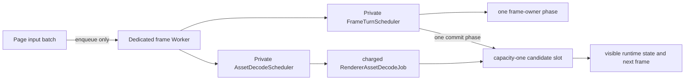

# Frame Transaction Worker Scheduling Packet

## Decision

Preserve boot throughput by moving work to explicit retained worker owners. Do not remove loops and revert to one decoder unit per page rAF.

1. Frame build: one retained phase advance per worker turn. Browser page ingress only enqueues input; a private scheduler in the dedicated frame Worker later runs that turn.
2. Decode: make the asset decoder its own retained worker job. It can consume multiple *charged* decoder units inside its own granted turn, then produces a capacity-one candidate for a single frame-side commit step.

No Cargo, policy command, browser drive, or runtime run was performed.

## Direct source evidence

| Current source | Why it exists | Live violation |
| --- | --- | --- |
| [frame job lines 397–429](../../../../../../🧰️framework/🛍️products/💻️os/🔨️modules/📺️renderer/🧑‍🎨engine/🎯️targets/🧊️wgpu/🧵️frame-job/🦀️.rs:397) | Its comment records that a one-advance browser build progressed one chrome child about every 32 ms and boot did not converge. | `ActiveFrameBuild::step` loops through many `advance` calls in one submitted job turn. |
| [frame job lines 588–686](../../../../../../🧰️framework/🛍️products/💻️os/🔨️modules/📺️renderer/🧑‍🎨engine/🎯️targets/🧊️wgpu/🧵️frame-job/🦀️.rs:588) | Wasm cannot send the frame owner with its `Rc<JsValue>` handles to the native process pool. The generic session has step, checkout, and resume phases. | The browser executes `try_step_on_caller` and repeats session phases until a deadline. It is a caller-drive path. |
| [renderer lines 12951–12960](../../../../../../🧰️framework/🛍️products/💻️os/🔨️modules/📺️renderer/🧑‍🎨engine/🎯️targets/🧊️wgpu/🧊️renderer/🦀️.rs:12951) | The comment records a real 55-unit/s stall for one 256-byte/vertex-like unit per rAF; the cited scene has 1,889 blocks and meshes around 7,000 vertices. | Only the first `pump_renderer_asset_decode_step` is charged. The following while loop is uncharged. |
| [renderer line 12836](../../../../../../🧰️framework/🛍️products/💻️os/🔨️modules/📺️renderer/🧑‍🎨engine/🎯️targets/🧊️wgpu/🧊️renderer/🦀️.rs:12836) | It establishes a half-frame decode deadline. | It uses `saturating_add` and must disappear with the transaction-local decode loop. |
| [frame worker lines 361–376](../../../../../../🧰️framework/🛍️products/💻️os/🔨️modules/📺️renderer/🧑‍🎨engine/🎯️targets/🧊️wgpu/🎞️frame-worker/🟦️.ts:361) | The page rAF transfers an input batch to the dedicated renderer Worker. | The incoming batch handler calls `enqueueBatch` and `tick` synchronously, so page cadence is still the renderer-work driver. |
| [interactive registry lines 225–285](../../../../../../🧰️framework/🛍️products/💻️os/🔨️modules/📺️renderer/🧑‍🎨engine/🎯️targets/🧊️wgpu/📇️interactive-job-registry/🟦️.ts:225) | It has the right browser scheduling shape: one scheduled worker callback chooses one slot and reschedules after that state action. | Do not reuse it unchanged: it is the public page-to-worker Diagram protocol and uses unrelated 6-ms/16,384 limits at [line 248](../../../../../../🧰️framework/🛍️products/💻️os/🔨️modules/📺️renderer/🧑‍🎨engine/🎯️targets/🧊️wgpu/📇️interactive-job-registry/🟦️.ts:248). Reuse its private scheduling pattern only. |

These are current deliberate implementations, not stale validator evidence.

## Required topology



The two schedulers execute only in the dedicated `semio-frame-worker`. They must not send renderer frames through `BrowserInteractiveJobPort`.

## 1. Frame owner

Keep `ActiveFrameBuild::advance` intact. Its mailbox-first early return is essential: pumping only at `ApplyPending` previously stranded `ResumeDispatch` behind a live build. The current rationale and path are at [frame job lines 261–280](../../../../../../🧰️framework/🛍️products/💻️os/🔨️modules/📺️renderer/🧑‍🎨engine/🎯️targets/🧊️wgpu/🧵️frame-job/🦀️.rs:261).

Replace the body of `ActiveFrameBuild::step` by exactly one `advance` attempt:

- check cancellation and yield preconditions;
- call `advance` once;
- charge exactly one fuel unit after that attempted retained unit, including a terminal advance;
- map the returned state to `Yield` or `Complete`.

There is no outer loop.

Native retains the existing worker-submission owner: `WorkerJobSession::try_submit_step(&renderer_worker_pool(), Lane::Interactive)` at [frame job lines 529–544](../../../../../../🧰️framework/🛍️products/💻️os/🔨️modules/📺️renderer/🧑‍🎨engine/🎯️targets/🧊️wgpu/🧵️frame-job/🦀️.rs:529). Its correction is the one-advance body.

Wasm requires a browser-local retained frame owner sharing the same state and close protocol, but it must not use `try_step_on_caller`. A private Worker callback invokes one explicit frame-owner turn after ingress. This is the no-caller-drive implementation for a target with no second native thread.

The page transport currently uses one `sequence` for both batch acknowledgement and outgoing frame ordering ([transport lines 586–607](../../../../../../🧰️framework/🛍️products/💻️os/🔨️modules/📺️renderer/🧑‍🎨engine/🎯️targets/🧊️wgpu/🚚️browser-frame-transport/🟦️.ts:586), [lines 940–959](../../../../../../🧰️framework/🛍️products/💻️os/🔨️modules/📺️renderer/🧑‍🎨engine/🎯️targets/🧊️wgpu/🚚️browser-frame-transport/🟦️.ts:940)). Reusing one input sequence for several scheduled turns would make later output disappear as stale. Split it:

- `batch-accepted { inputSequence, generation }` clears the inbound lease immediately after `enqueueBatch`.
- `frame { frameSequence, generation, ... }` has a separate, strictly increasing worker-owned result sequence.
- `frameSequence` must fail closed before safe-integer/u64 wrap; it must never saturate or reuse a value.
- Page rAF remains input coalescing and transfer. A returned `requestFrame` schedules the local Worker owner, not an empty page batch.

`BrowserRendererWorker::tick` already refuses a generation other than `latest_generation` at [browser worker lines 340–352](../../../../../../🧰️framework/🛍️products/💻️os/🔨️modules/📺️renderer/🧑‍🎨engine/🎯️targets/🧊️wgpu/🌐️browser-worker/🦀️.rs:340). A newer ingress batch therefore supersedes the old frame owner without renumbering host state.

## 2. Decode owner

Do **not** simply return `Pending` after one decoder call. That recreates the recorded 55-unit/s page-rAF stall.

Introduce `RendererAssetDecodeJob` and a fixed capacity-one candidate/commit handoff.

The job owns one `RendererAssetProbe` from admission to cancellation or terminal completion. Its turn may repeat decoder units, but only under the canonical job grant and only with this order:

1. reject cancellation;
2. stop on `StepContext::should_yield`;
3. perform one decoder unit;
4. immediately `consume_fuel(1)` for every successful unit;
5. return `Yield` at fuel/deadline, `Complete` at idle/candidate terminal.

The canonical interactive limits are 1,000 μs and 2,000,000 fuel ([job lines 383–389](../../../../../../🧰️framework/🔨️modules/🧵️job/🦀️.rs:383)). The decoder is now the one retained owner for the loop; the frame transaction never performs decoder work.

The present `bool` return from `pump_renderer_asset_decode_step` cannot support this scheduler because false conflates no work with a contended lock. Replace it with a closed result, for example:

```rust
enum RendererAssetDecodeUnit {
    Advanced,
    Blocked,
    Idle,
    Candidate(RendererAssetDecodeCandidate),
    Fault(&'static str),
}
```

`Blocked` yields without pretending terminal progress. `Idle` retires the decoder session. The candidate must preserve every existing destination: shared image/map bytes, terrain bytes, decoded reference raster, mesh lease, and the rejection witness.

The frame transaction consumes at most one candidate in a dedicated commit phase. It verifies the world token, applies/publishes, finishes the exact asset owner, and marks the scene changed only after a successful visible mutation. This separation is required before native pool submission: the existing `pump_renderer_asset_decode_step` mutates runtime state and tables directly, so moving it unchanged to another worker would race the presentation witness.

The scene revision increment must also fail closed. `RuntimePresentationAuthority::mark_scene_changed` currently performs `fetch_add` ([renderer lines 10450–10452](../../../../../../🧰️framework/🛍️products/💻️os/🔨️modules/📺️renderer/🧑‍🎨engine/🎯️targets/🧊️wgpu/🧊️renderer/🦀️.rs:10450)). At the new candidate commit boundary, overflow must terminate/refuse the commit; a stale or cancelled candidate must not increment it.

Native submits this decoder job separately to `renderer_worker_pool` with a distinct site such as `os_renderer_asset_decode`. Its `Send` status is not established by this audit and must be proven by the implementation/compile check. Browser Wasm runs the same decoder schema through the private Worker scheduler; it has no page caller and no `Send` claim.

## 3. Worker continuation and cancellation

Implement a private scheduler using the existing registry's safe shape, not its public protocol:

- one `scheduled` bit;
- fixed owners: frame build, decoder, then ordinary presentation work;
- round-robin owner selection;
- one owner turn per callback;
- reschedule only after the selected owner reports pending work;
- close clears scheduled intent, cancels both owners, then advances one close step per callback until terminal empty.

The existing request predicate must be retained but redirected. Browser `tick` already exposes outstanding text, world, asset, settle, apply, frame-build, presentation, deadline, and cursor work at [browser worker lines 374–387](../../../../../../🧰️framework/🛍️products/💻️os/🔨️modules/📺️renderer/🧑‍🎨engine/🎯️targets/🧊️wgpu/🌐️browser-worker/🦀️.rs:374). It currently requests another page frame. It should request another private Worker turn.

`scheduleAssetPump` is already a Worker-local asynchronous service ([frame worker lines 641–645](../../../../../../🧰️framework/🛍️products/💻️os/🔨️modules/📺️renderer/🧑‍🎨engine/🎯️targets/🧊️wgpu/🎞️frame-worker/🟦️.ts:641)). After a response seals/rejects, it should request the private decoder owner directly, rather than post `wake` merely to get an empty UI batch. Keep its exact cancellation checks and response page caps.

## Counter map

| Counter/measurement | Current authority | Repair requirement |
| --- | --- | --- |
| Host generation | `latest_requested_generation` / `last_submitted_generation` at [frame job lines 149–151](../../../../../../🧰️framework/🛍️products/💻️os/🔨️modules/📺️renderer/🧑‍🎨engine/🎯️targets/🧊️wgpu/🧵️frame-job/🦀️.rs:149) | Assign only from host ingress; the scheduler does not renumber it. |
| Worker output order | Current transport `sequence` | Add checked `frameSequence`. It is independent of ingress acknowledgement. |
| Preview order | `ActiveFrameBuild.preview_sequence` at [line 180](../../../../../../🧰️framework/🛍️products/💻️os/🔨️modules/📺️renderer/🧑‍🎨engine/🎯️targets/🧊️wgpu/🧵️frame-job/🦀️.rs:180) | Preserve the existing checked `StepContext::next_preview_sequence` increment ([job lines 1024–1027](../../../../../../🧰️framework/🔨️modules/🧵️job/🦀️.rs:1024)). |
| Frame effect budget | `effect_opportunities` at [renderer lines 13114–13124](../../../../../../🧰️framework/🛍️products/💻️os/🔨️modules/📺️renderer/🧑‍🎨engine/🎯️targets/🧊️wgpu/🧊️renderer/🦀️.rs:13114) | Already checked; retain it. It is not a decoder budget. |
| Scene revision | `RuntimePresentationAuthority` | Checked/fail-closed increment only at a successful visible candidate commit. |
| Decode ownership | `asset_probe` at [renderer line 10784](../../../../../../🧰️framework/🛍️products/💻️os/🔨️modules/📺️renderer/🧑‍🎨engine/🎯️targets/🧊️wgpu/🧊️renderer/🦀️.rs:10784) | Preserve capacity one across probe and candidate. Add turn/unit telemetry keyed by operation/generation; never make it a permissive budget. |
| Timing | Frame watchdogs at [frame job lines 247–258](../../../../../../🧰️framework/🛍️products/💻️os/🔨️modules/📺️renderer/🧑‍🎨engine/🎯️targets/🧊️wgpu/🧵️frame-job/🦀️.rs:247) and Worker `TurnLedger` | Retain current watchdogs and add `os_renderer.asset_decode`. JS timing observes the callback; Rust fuel/deadline governs decoder units. |

## Fail-first behavioral laws

1. **One frame advance.** A retained frame owner with two pending phases advances exactly one phase per Worker turn. Its first turn cannot observe phase two.
2. **No ingress execution.** A page batch yields `batch-accepted` after `enqueueBatch` and no `tick` or presentation runs in that handler. A later Worker callback produces the first frame result.
3. **Independent output order.** Two turns for one input generation emit two strictly increasing `frameSequence` values, both accepted by the transport. Exhaustion retires/quarantines rather than wraps.
4. **Decoder fuel accounting.** A large valid probe takes multiple decoder turns. Every unit is fuel-charged; no frame transaction calls `pump_renderer_asset_decode_step`; its final candidate reaches the real mesh publication/finish route.
5. **Commit serialization.** A ready decoder candidate does not visually mutate while a frame build is active. Exactly one later commit phase mutates state, changes the scene witness, and requests a new build. A stale token closes without revision change.
6. **Bounded cancellation.** Cancellation during parsing/materialization takes one probe close unit per turn, finishes/returns its exact owner once, emits no candidate, and ends both schedulers terminal-empty.
7. **Fairness.** With a boot frame and decode work both pending, two consecutive Worker callbacks select different owners; ingress remains admissible between them.
8. **Target parity.** One schema fixture covers valid response, cancellation, and stale token. Native pool and browser Worker paths yield the same candidate terminal class.

Use these existing test homes:

- [`wgpu-frame-job-unit/🦀️.rs`](../../../../../../🧰️framework/🛍️products/💻️os/🔨️modules/📺️renderer/🧑‍🎨engine/🧪️tests/🔬️wgpu-frame-job-unit/🦀️.rs) for retained owner and close lifecycle.
- [`wgpu-renderer-async-boundary/🦀️.rs`](../../../../../../🧰️framework/🛍️products/💻️os/🔨️modules/📺️renderer/🧑‍🎨engine/🧪️tests/🔬️wgpu-renderer-async-boundary/🦀️.rs) for a real probe and publication route. Its current test at lines 43–55 approves the decode slice loop and must be inverted.
- [`browser-frame-transport/🟦️.ts`](../../../../../../🧰️framework/🛍️products/💻️os/🔨️modules/📺️renderer/🧑‍🎨engine/🧪️tests/📨️browser-frame-transport/🟦️.ts) for batch acknowledgement and independent frame output ordering.
- [`wgpu-worker-step-budget/🟦️.ts`](../../../../../../🧰️framework/🛍️products/💻️os/🔨️modules/📺️renderer/🧑‍🎨engine/🧪️tests/⏱️wgpu-worker-step-budget/🟦️.ts) for one Worker callback and overrun observation.

The existing browser/React oracle must then exercise the real Worker transport and compare final painted mesh/reference output with its React counterpart. It must assert visible result plus scheduler terminal state, not a source string or raw decoder count.

## Confidence

High confidence: the current loops, their recorded stall rationale, input/output sequence coupling, scheduler shape, and the need to prevent decoder mutation from racing a frame witness are directly established by the cited active source.

Medium confidence: the final candidate shape and whether a newly separated native decoder satisfies `Send`. This audit did not compile; implementation must prove that condition before native pool submission.

