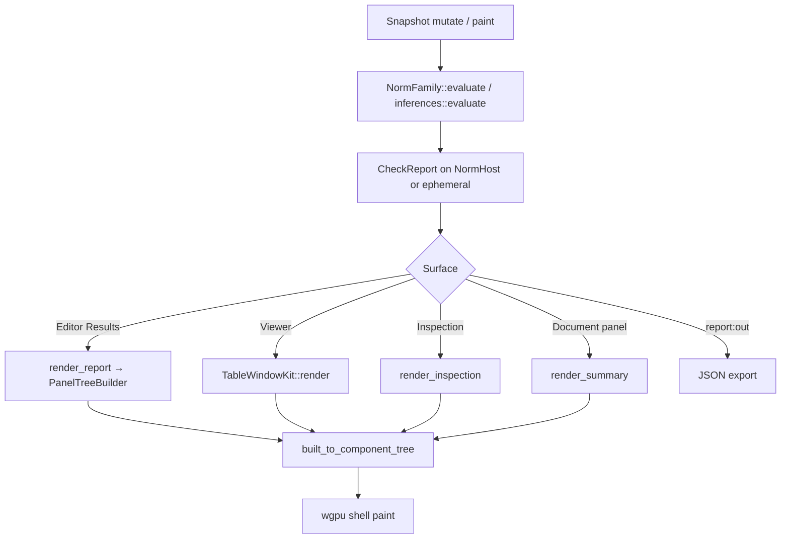

# Audit — Shared Compliance Report Model and UI

**Executive summary.** The norm fleet shares a minimal `CheckResult` / `CheckReport` in `✏️s/🔌️plugins/📕️norm/⚖️compliance/🦀️.rs` (lines 125–196): flat checks with monolingual `message: String`, no subject reference, no remediation, no part grouping, and no `Warning` status. Evaluation is pure Rust in each family's `🧬️schema/💡️inferences/🦀️.rs::evaluate`, cached on `NormHost.report` (lines 541–587). The user sees checks only through `🖥️app-surface/🦀️.rs` render helpers painted by the **wgpu** shell (`BuiltNode` → `ComponentTree`); the editor Results window is a virtualized tree list, the viewer uses `TableWindowKit`, and the Inspection panel shows four scalar fields per selected row. **Computed and limit quantities are never shown.** Report row text is English-hardcoded at check construction time and **not** resolved through `ViewModel.locale`. UI chrome (window titles, actions) correctly uses `LocalizedLabel::native(en, de)`. Wave B must extend the core schema (with `LocalizedText` for domain copy, `SubjectRef`, `Remedy`, grouped `CheckReportSummary`) and rework `app-surface` rendering before per-family remediation content can reach users in en + de.

---

## 1. Data flow: `evaluate()` → pixels

### 1.1 Core types and host lifecycle

| Stage | Location | Lines | What happens |
|-------|----------|-------|--------------|
| Model definition | `⚖️compliance/🦀️.rs` | 125–196 | `CheckStatus`, `CheckResult`, `CheckReport`, helpers `pass`/`fail`/`from_utilization`/`from_minimum` |
| Family contract | `⚖️compliance/🦀️.rs` | 532–538 | `NormFamily::evaluate(document) -> CheckReport` |
| Session cache | `⚖️compliance/🦀️.rs` | 541–587 | `NormHost { document, report }`; `from_artifact`, `apply`, `replace_document`, `evaluate` all refresh `report` |
| Registry re-export | `📇️registry/🧬️contract/🦀️.rs` | 12–40 | `document` module includes compliance + `app_surface` + `results_window_config` |

### 1.2 Evaluation entry (example: EN 1990)

```
En1990Snapshot
  → schema/💡️inferences/🦀️.rs::evaluate()          [L85–96]
      → schema/🦀️.rs helpers (append_combination_set, check_reliability_index, …)
  → CheckReport { checks: Vec<CheckResult> }
```

Family binding (editor crate root):

- `🗿️artifacts/⚖️en1990/.../✏️editor/🦀️.rs` `En1990Family::evaluate` → `inferences::evaluate` (L199–201)

On every document read in the editor:

- `render()` L137: `NormHost::<En1990Family>::from_artifact(doc.snapshot.clone())` — **re-evaluates on each paint**

### 1.3 UI surfaces (editor)

`✏️editor/🦀️.rs` `render()` dispatch (L136–147):

| `body_key` | Module | Render function | User sees |
|------------|--------|-----------------|-----------|
| `norm.en1990.play.inputs` | `📥️inputs/🦀️.rs` L19–20 | `render_document_json` | Pretty-printed snapshot JSON (not a form) |
| `norm.en1990.play.results` | `📊️results/🦀️.rs` L22–23 | `render_report` | Virtualized check list |
| Document panel | `🗿️artifact/🦀️.rs` | `render_summary` | One line: `"{family} — {n} checks, worst u={u:.2}, all pass={bool}"` |
| Inspection panel | `🔍️inspection/🦀️.rs` L19–20 | `render_inspection` | Clause, Status, Utilization, Message for selected index |
| Catalogue panel | placeholder headline | | |

Results window config (`selected_check_index`) lives in `🪟️results/🎚️config/🧬️schema/🦀️.rs` (L9–11), addressed via `results_window_config::current` / `addressed` (`🪟️results/🎚️config/🦀️.rs` L93–123). `setSelectedCheckIndex` publishes to the window-config lane (`🖥️app-surface/🦀️.rs` L548–552).

### 1.4 UI surfaces (viewer)

`👁️viewer/🦀️.rs` `render()` (L76–80) → `📊️report/🦀️.rs`:

- L31: `inferences::evaluate(document)` (no `NormHost`, still pure)
- L32: `TableWindowKit::render` with `report_table_columns()` / `report_table_rows()`

Viewer window kind: `TableWindowKit::KIND_ID` (`framework.window.table`) — read-only table, not the editor's virtualized tree.

### 1.5 Shared render implementation (`🖥️app-surface/🦀️.rs`)

| Function | Lines | Output shape | Example user-visible text |
|----------|-------|--------------|---------------------------|
| `report_table_columns` | 159–161 | `["Clause","Status","Utilization","Message"]` | English headers only |
| `report_table_rows` | 165–167 | 4 string columns per check | `"EN 1990 §6.4 §6.10"`, `"Pass"`, `"0.82"`, `"ULS design action"` |
| `render_report` | 204–217 | `PanelTreeBuilder` window section `norm-report.checks` | Row label: `"{i}. {clause} — {status:?} u={u:.2} — {message}"` |
| `render_summary` | 226–228 | single `text` node | `"EN 1990 — 12 checks, worst u=0.95, all pass=false"` |
| `render_inspection` | 238–253 | tree section `norm-inspection.check` | Keys: Clause / Status / Utilization / Message (English keys) |
| `export_media` (`report:out`) | 367–370 | JSON `CheckReport` | Workflow port, not painted |

**Renderer:** Plugin code builds `semio_framework_plugin::BuiltNode`, converted with `built_to_component_tree` (editor L146). The OS **wgpu** target (`🧰️framework/🔨️modules/🖱️ui/🎯️targets/🧊️wgpu/`) lays out and paints text/trees/tables. No norm-specific React/web renderer participates in check rows.

**Virtualization:** `render_report` uses `PanelTreeBuilder::window_section_or_placeholder` with `TreeWindows` viewport (tests L130–180 in `🖥️app-surface/🧪️tests/🔬️unit/🦀️.rs`): stamps full `total`, materializes only `[offset, offset+rows)`.

### 1.6 TypeScript packages

`📦️packages/🟦️typescript/🟦️.ts` re-exports per-family schema/snapshot/mutation facets — **no shared `CheckReport` TS type at package root**.

Per-family `✏️editor/.../📊️results/🟦️.ts` (e.g. EN 1990 L1–22) defines `En1990CheckRow` / `En1990ResultsViewModel` as a **documentation twin** of the Rust table; Rust `render_report` is authoritative. Fields `computed` and `limit` exist in the TS interface but are **omitted** from `report_table_rows`.

### 1.7 End-to-end diagram



---

## 2. `CheckResult` field consumers

### 2.1 Per-field usage

| Field | UI / export | Tests / evaluate | Notes |
|-------|-------------|------------------|-------|
| `clause` | `render_report` L213, `render_inspection` L246, `report_table_rows` L166 (`Display`) | Many compliance tests assert `.family`, `.part`, `.section` | Grouping key today is only implicit in `clause.part` string |
| `status` | `{:?}` Debug in L166, L213, L247 — shows `Pass`/`Fail`/`NotApplicable` | `CheckReport::all_pass` L190; compliance tests | Not localized; no `Warning` variant |
| `computed` | **Not rendered** | Compliance tests (numeric assertions) | TS view-model includes it; UI ignores it |
| `limit` | **Not rendered** | Compliance tests | User cannot see required bound |
| `utilization` | L166, L213, L248; `worst_utilization` L194 in summary | Compliance tests | Primary pass/fail signal in UI |
| `message` | L166, L213, L249 — raw string | Set at construction in each family's `schema/🦀️.rs` | English literals e.g. `"ULS design action"` (EN 1990 `🦀️.rs` L582, L606, L640) |
| `annex` | **Not rendered** | Passed into `CheckResult` constructors from `annex.choice()` | Stored but invisible |

### 2.2 Construction sites (`CheckResult {` struct literals)

`rg -c "CheckResult \{"` under `✏️s/🔌️plugins/📕️norm` (Rust):

| File | Count |
|------|------:|
| `⚖️compliance/🦀️.rs` | 2 |
| `🌬️din16798/.../🧬️schema/🦀️.rs` | 28 |
| `🏋️en1991/.../🧬️schema/🦀️.rs` | 13 |
| `🔩️en1993/.../🧬️schema/🦀️.rs` | 25 |
| `🏛️en1992/.../🧬️schema/🦀️.rs` | 19 |
| `🫨️en1998/.../🧬️schema/🦀️.rs` | 12 |
| `🪨️en1996/.../🧬️schema/🦀️.rs` | 9 |
| `🧩️en1994/.../🧬️schema/🦀️.rs` | 6 |
| `⚖️en1990/.../🧬️schema/🦀️.rs` | 5 |
| `🌍️en1997/.../🧬️schema/🦀️.rs` | 5 |
| `🧱️din4108/.../🧬️schema/🦀️.rs` | 8 |
| `🪵️en1995/.../🧬️schema/🦀️.rs` | 8 |
| `🪶️en1999/.../🧬️schema/🦀️.rs` | 8 |
| `🏭️vdi3805/.../🧬️schema/🦀️.rs` | 5 |
| `🏭️vdi3805/.../💡️inferences/🦀️.rs` | 5 |
| **Total** | **158** |

Factory methods (`CheckResult::pass|fail|from_utilization|from_minimum`): **181** call sites (broader churn surface for API changes).

### 2.3 `CheckReport` / aggregate consumers

- `NormHost.report`, `export_media`, all fifteen `results::render`, all fifteen `inspection::render`, all fifteen viewer `report::render`
- `🖥️app-surface` render/export helpers (section 1.5)
- Per-family `🧪️tests` (`compliance-report`, editor unit tests for `report:out`)
- **Not** in bridge (`🏭️bridge/🦀️.rs` is mutation-inventory only)

---

## 3. Canonical i18n mechanisms

The repo uses **two layers** (no Fluent files, no `de:`/`en:` YAML in norm):

### 3.1 UI chrome — `LocalizedLabel` (framework)

- Definition: `🧰️framework/🛍️products/💻️os/🔨️modules/🌐️locale/🏷️label/🦀️.rs` L89–134
- Pattern: `LocalizedLabel::native("English", "Deutsch")` → full locale×terminology matrix
- Resolution at paint time: `.resolve(terminology, locale)` using `ViewModel.locale` / `ViewModel.terminology` (`🧰️framework/🔨️modules/🛂️manifest/🦀️.rs` L4875–4878)
- Norm usage: all manifest strings — e.g. `create_en1990_app` actions L226–251, window `LocalizedLabel::native("Results", "Ergebnisse")` in `📊️results/🦀️.rs` L17

**Compile-time UI labels:** `Label` / `app_labels!` (same file L15–80) — norm plugin does not yet use `app_labels!` for report content.

### 3.2 Domain / artifact text — `LocalizedText` (norm core)

- Definition: `⚖️compliance/🦀️.rs` L100–122 — `{ locale: String, text: String }` with `DslRecord` + `ToValue`/`FromValue`
- Used for catalogue names in `iso16757`, `vdi3805` (`Vec<LocalizedText>`, `bilingual(de, en)` helper in `vdi3805/🦀️.rs` L36–41)
- **Not used** for `CheckResult.message` today

### 3.3 What report rendering does *not* do

`render_report`, `render_inspection`, `report_table_rows` take **no** `locale` argument and do not read `ViewModel` for translation. Check messages are fixed at `evaluate()` time as English `String`. Status uses `Debug` formatting, not `LocalizedLabel`.

**Canonical rule for Wave B:** Manifest/chrome → `LocalizedLabel::native`. Compliance domain copy embedded in reports → `Vec<LocalizedText>` or a dedicated bilingual struct with `pick(locale)` helper (same pattern as `vdi3805::text_in`). Runtime-formatted numbers stay `Label::data` / plain strings filled into `LabelText::fill` placeholders.

---

## 4. Proposed core model extension (schema-first)

Add to `⚖️compliance/🦀️.rs` (all types: `DslRecord` or `DslScalar` where appropriate, `ToValue`/`FromValue`, `serde` behind `compliance-testing`):

```rust
#[derive(Clone, Copy, Debug, PartialEq, Eq, dsl::DslScalar, ToValue, FromValue)]
pub enum CheckStatus {
    Pass,
    Fail,
    NotApplicable,
    Warning,  // advisory / borderline — does not fail all_pass unless configured
}

/// Stable pointer to the artifact entity this check concerns.
#[derive(Clone, Debug, PartialEq, Eq, Hash, DslRecord, ToValue, FromValue)]
pub struct SubjectRef {
    pub entity_id: String,       // stable id in snapshot DSL
    pub path: String,            // dotted/json-pointer field path, e.g. "layers[2].thickness_mm"
    pub kind: String,            // optional entity kind label, e.g. "envelope.layer"
}

/// Bilingual bundle — prefer two fixed entries (en, de) for norm checks.
#[derive(Clone, Debug, PartialEq, DslRecord, ToValue, FromValue)]
pub struct LocalizedCopy {
    pub en: String,
    pub de: String,
}

impl LocalizedCopy {
    pub fn pick(&self, locale: &str) -> &str {
        if locale == "de" { &self.de } else { &self.en }
    }
}

#[derive(Clone, Debug, PartialEq, DslRecord, ToValue, FromValue)]
pub struct Remedy {
    pub target_path: String,           // subject field to change
    pub current: Quantity,
    pub required: Quantity,              // bound or target value
    pub unit_display: String,            // optional override, else from QuantityKind
    pub action: LocalizedCopy,           // "Increase insulation thickness to ≥ 124 mm"
}

#[derive(Clone, Debug, PartialEq, DslRecord, ToValue, FromValue)]
pub struct CheckResult {
    pub clause: ClauseId,
    pub part: String,                    // explicit grouping key, e.g. "EN 1992-1-1"
    pub status: CheckStatus,
    pub subject: SubjectRef,
    pub title: LocalizedCopy,
    pub explanation: LocalizedCopy,
    pub computed: Quantity,
    pub limit: Quantity,
    pub utilization: f64,
    pub annex: AnnexChoice,
    pub remedies: Vec<Remedy>,
}

#[derive(Clone, Debug, PartialEq, DslRecord, ToValue, FromValue)]
pub struct PartVerdict {
    pub part: String,
    pub pass_count: u32,
    pub fail_count: u32,
    pub warning_count: u32,
    pub na_count: u32,
    pub worst_utilization: f64,
    pub complies: bool,
}

#[derive(Clone, Debug, PartialEq, DslRecord, ToValue, FromValue)]
pub struct CheckReportSummary {
    pub total: u32,
    pub pass_count: u32,
    pub fail_count: u32,
    pub warning_count: u32,
    pub na_count: u32,
    pub worst_utilization: f64,
    pub overall_complies: bool,
    pub by_part: Vec<PartVerdict>,
}

#[derive(Clone, Debug, Default, PartialEq, DslRecord, ToValue, FromValue)]
pub struct CheckReport {
    pub summary: CheckReportSummary,
    pub checks: Vec<CheckResult>,
}
```

**Factory helpers** (extend existing `pass`/`fail`/`from_utilization`):

- Accept `LocalizedCopy` for title/explanation instead of `message: String`
- Accept `SubjectRef` + `part`
- Add `with_remedies(...) -> Self` builder
- `CheckReport::push` recomputes `summary` incrementally (or `CheckReport::from_checks` once at end of `evaluate`)

**Migration:** Deprecate `message` by replacing with `title` + `explanation` in one breaking change (greenfield). `LocalizedText` vec form can convert to `LocalizedCopy` for exactly en+de.

**DSL / facets:** Generate `🟦️.ts`, `🔣️.json`, `🔗️.graphql`, `🛰️.proto` from new record specs under `⚖️compliance/` (new facet folder mirroring other schema families).

---

## 5. Results UI changes required

### 5.1 `🖥️app-surface/🦀️.rs`

| Area | Current | Target |
|------|---------|--------|
| `render_report` | Flat list, English `{:?}` status | Group by `part` (collapsible sections); row = localized `title` + status chip + utilization; expand row → `explanation`, computed vs limit, remedies list |
| `report_table_columns/rows` | 4 English columns, no computed/limit | Columns: Part, Clause, Status, Utilization, Title (locale); optional Remedy count; include formatted quantities |
| `render_inspection` | 4 fields, no remedies | Full check card: subject path (link target for future), bilingual explanation, quantity table, enumerated remedies with `action.pick(locale)` |
| `render_summary` | Single English sentence | Localized headline from `summary` (pass/fail/warning counts, worst u, overall complies) via `LocalizedLabel` templates |
| All render fns | No locale param | Add `locale: Locale` (from `ViewModel` in each `render()` dispatch) |

### 5.2 Status presentation

- Map `CheckStatus` → localized short labels (`LocalizedLabel::native("Pass","Bestanden")`, etc.) — not `Debug`
- Color/semantics: Pass green, Fail red, Warning amber, NA muted (wgpu tree/table styling)

### 5.3 Remediation UX

- Under each failing check: bullet list of `Remedy` — target path, current → required with unit, action sentence
- Optional future: `setSelectedCheckIndex` + click remedy → pre-fill mutation (out of scope for model-only wave; UI should reserve `tree_item` ids including remedy index)

### 5.4 Viewer `TableWindowKit`

- Same column policy as `report_table_rows` after upgrade
- Consider grouped sections (if `TableWindowKit` lacks grouping, viewer may switch to `render_report` tree for parity)

### 5.5 Per-family `📊️results/🟦️.ts`

- Replace duplicated `*CheckRow` with imports from shared generated `compliance/report/🟦️.ts`
- Align `*ResultsViewModel` with grouped summary + remedies

### 5.6 Inputs gap (coordination objective)

- Inputs window is JSON only (`render_document_json`) — subject editing is not form-based; family Wave C must add structured editors separately

---

## 6. Files to touch (Wave B core + UI)

### 6.1 Shared core (required)

- `✏️s/🔌️plugins/📕️norm/⚖️compliance/🦀️.rs` — model, helpers, summary recompute
- `✏️s/🔌️plugins/📕️norm/⚖️compliance/🧪️tests/🔬️unit/🦀️.rs` — new field round-trips
- New facet leaves under `✏️s/🔌️plugins/📕️norm/⚖️compliance/` (🟦️.ts, 🔣️.json, 🔗️.graphql, 🛰️.proto) for `CheckReport` export
- `✏️s/🔌️plugins/📕️norm/📇️registry/🧬️contract/🦀️.rs` — if new submodules
- `✏️s/🔌️plugins/📕️norm/🖥️app-surface/🦀️.rs` — all render + table helpers + `export_media` JSON shape
- `✏️s/🔌️plugins/📕️norm/🖥️app-surface/🧪️tests/🔬️unit/🦀️.rs` — virtualization + locale + grouping laws
- `✏️s/🔌️plugins/📕️norm/🖥️app-surface/🧪️tests/🖥️app-surface/🦀️.rs` — locale projection tests

### 6.2 Results window config (optional)

- `✏️s/🔌️plugins/📕️norm/🪟️results/🎚️config/🧬️schema/🦀️.rs` — e.g. `expanded_part_ids`, `expanded_check_id` for UI state

### 6.3 Fifteen families — mechanical churn (Wave B compile fix + Wave C content)

Each family (×15):

- `🧬️schema/🦀️.rs` — every `CheckResult` literal / factory call (~158 sites)
- `🧬️schema/💡️inferences/🦀️.rs` — `evaluate()` if report assembly changes
- `🧬️schema/🧪️tests/⚖️compliance/🦀️.rs` and `💡️inferences/🧪️tests/🔬️compliance-report/🦀️.rs`
- `✏️editor/🦀️.rs` — pass `view_state.locale` into render helpers
- `✏️editor/🎭️modes/✏️edit/🪟️windows/📊️results/🦀️.rs` — signature if locale threading added
- `✏️editor/🎭️modes/✏️edit/🪟️windows/📊️results/🟦️.ts` — view-model sync
- `👁️viewer/.../📊️report/🦀️.rs` — table columns / grouping
- `✏️editor/🧪️tests/🔬️unit/🦀️.rs` — `report:out` JSON assertions

### 6.4 TypeScript package

- `✏️s/🔌️plugins/📕️norm/📦️packages/🟦️typescript/🟦️.ts` — export shared compliance types

### 6.5 Not in scope for model/UI wave

- `🏭️bridge/🦀️.rs` — mutation inventory only
- Per-family subject schema expansion (Wave C)

---

## 7. Risks and open questions

1. **`Warning` vs `all_pass`:** Define whether warnings fail overall compliance or only failures do (`all_pass` currently ignores `NotApplicable` only).
2. **`LocalizedCopy` vs `Vec<LocalizedText>`:** Two-entry struct is simpler for en+de mandate; `Vec` matches iso16757 for >2 locales later.
3. **Viewer/editor parity:** Table vs tree — product decision before rewriting viewer.
4. **Performance:** `NormHost::from_artifact` on every `render()` re-runs full `evaluate` — caching/incremental inference may be needed once reports grow with remediation metadata.
5. **SubjectRef stability:** Must align with each family's snapshot id / path conventions (composed children, table slots).
6. **TS view-models:** Fifteen near-duplicate `🟦️.ts` files should collapse to one generated schema to avoid drift.

---

*Audit completed 2026-09-26. Read-only; no code changes.*
