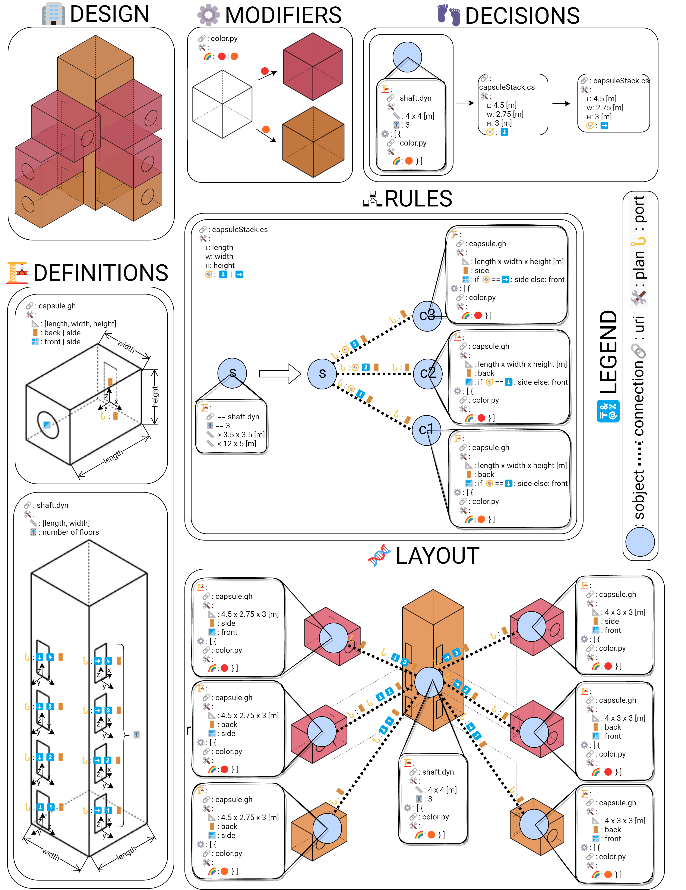

# semio

You want to design the next 🏛️🏘️🏢🏭🏫🏨⛪🕌? But 📐, 🔢 and 🗣️ takes all your time? Then try to capture the 🧬 and 💉 it into a new design. 🖇️ your elements and describe your drawing, simulation and other computations and let semio 🖧,🖩,✏️.

# Installtion

semio is an ecosystem of several components. There is a backend that can be extended on different platforms and different frontends for viewing and/or authoring designs.

All services can either run locally, with docker-compose or inside kubernetes.

## UIs

Currently there is one UI for Grasshopper.

## Extensions

Currently there is one extension for Grasshopper that makes it possible to define scripts.

# Contribution

If you want to contribute to the project, there are lot's of opportunities! Do you want to write an extension for a platform or contribute to the core?
If you are not sure what your contribution could exactly be, feel free to take a look under the [project site](https://github.com/users/usalu/projects/2) and see if find something.