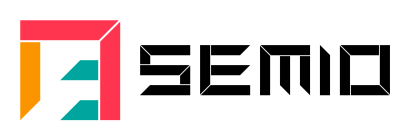
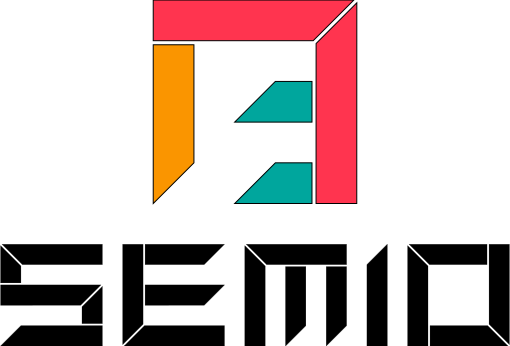
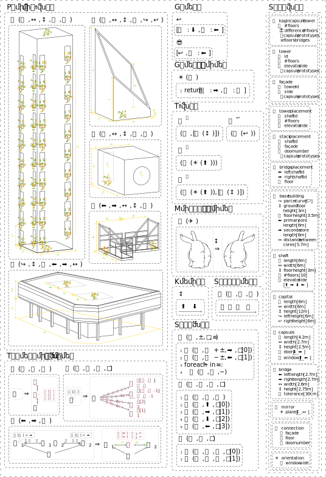
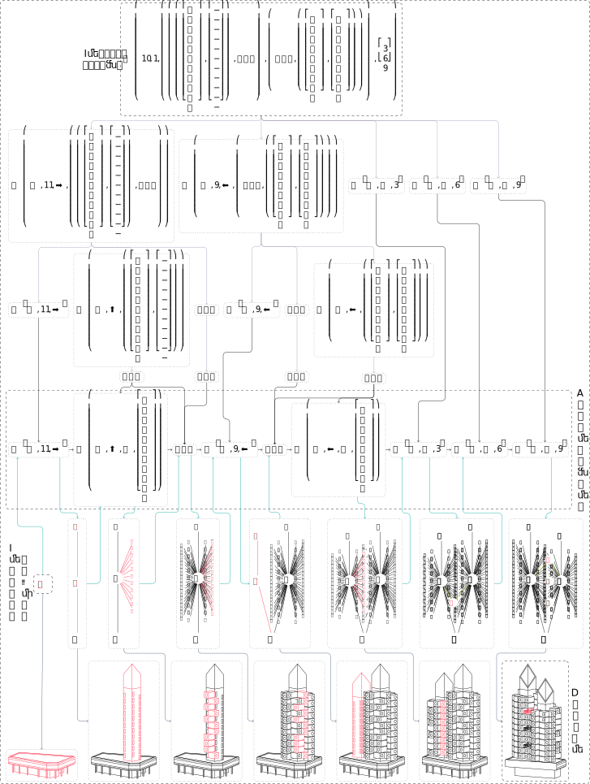
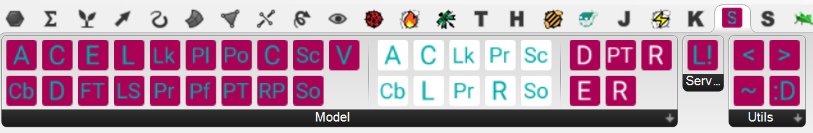
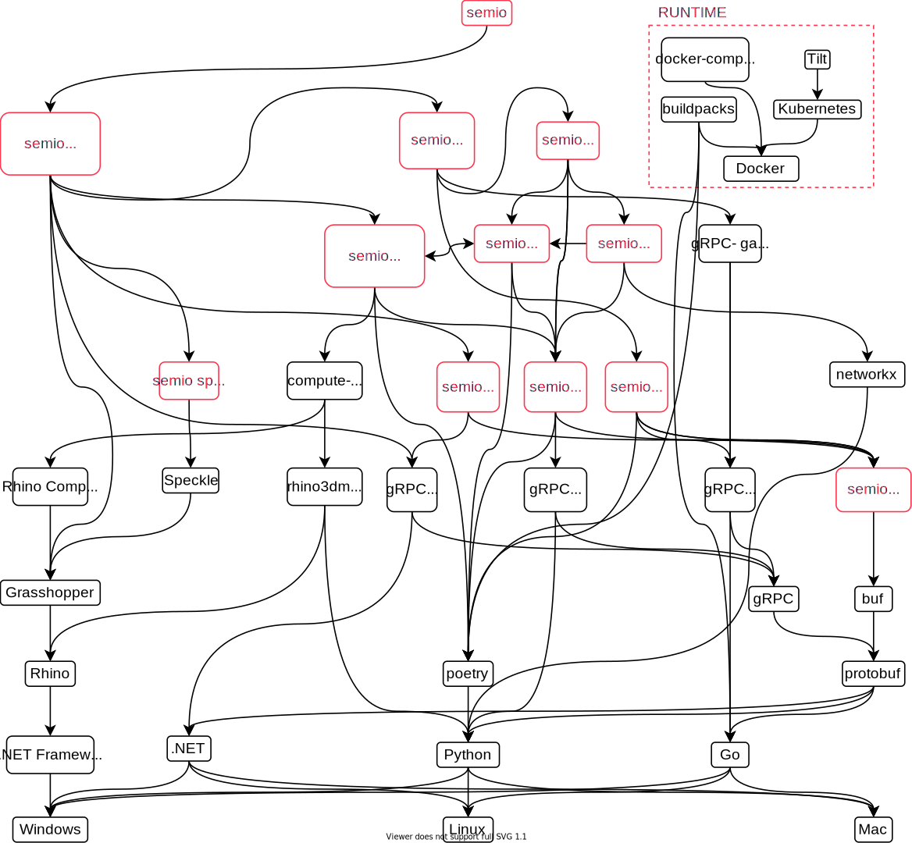

    

<!--  -->

You want to design the next 🏛️🏘️🏢🏭🏫🏨⛪🕌? But 📐, 🔢 and 🗣️ takes all your time? Then try to capture the 🧬 and 💉 it into a new design and let semio 🖧,🖩,✏️.

    

<!--  -->

    
    

<!-- 

 -->

semio is a framework that makes procedural modelling platforms interoperable. Any file when given to a platform (like Grasshopper, Dynamo, Python, Cadquery, ...) along with paremeters (numerical, textual or geometrical) that returns an output is a script. Depending on the type of inputs and outputs that the script accepts, it can be either a definition, transformation, scheme, modification, factory, stitching or generation.

# Overview

semio is an ecosystem of several components. There is a backend that can be extended on different platforms and different frontends for viewing and/or authoring designs.

All services can either run locally, with docker-compose, inside kubernetes or be simply called over an active server.

## UIs

Currently there is one UI for Grasshopper.

## Adapters

Currently there is one adapter for Grasshopper that makes it possible to turn Grasshopper scripts into semio scripts.

# Contribution

If you want to contribute to the project, there are lot's of opportunities! Do you want to write an apapter for a platform or contribute to the core?
If you are not sure what your contribution could exactly be, feel free to take a look under the [project site](https://github.com/users/usalu/projects/2) and see if find something.