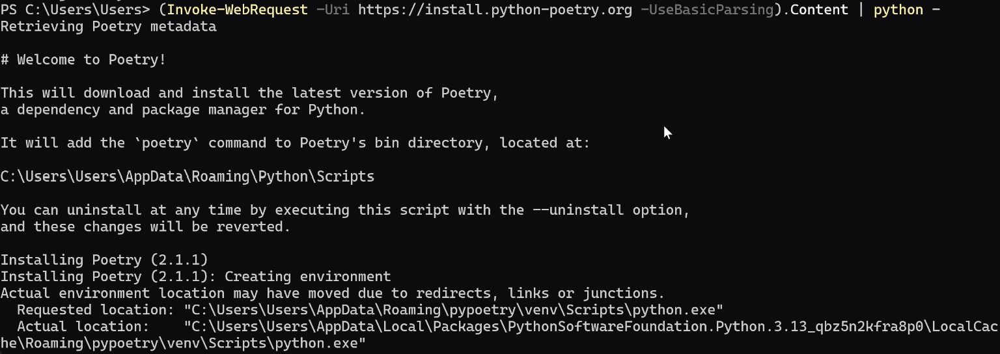
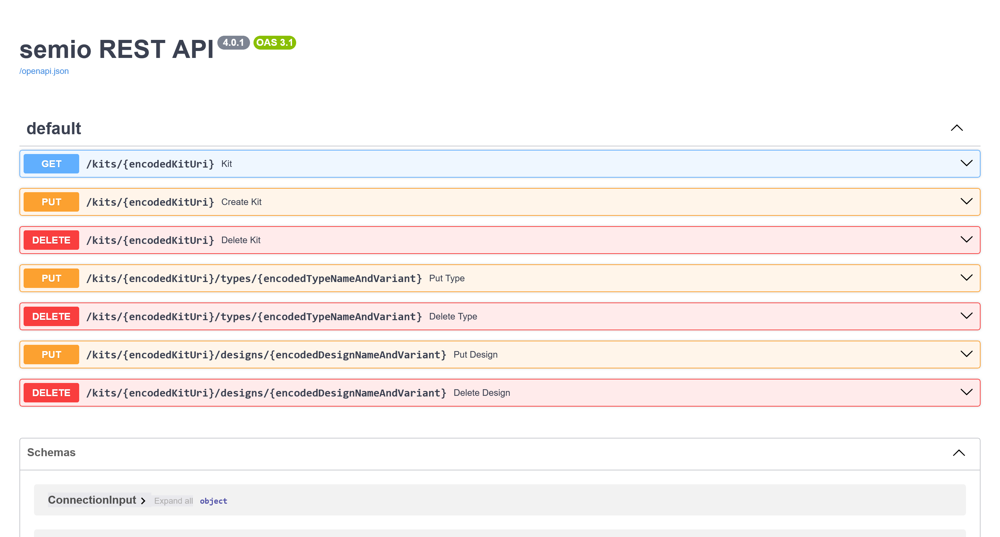
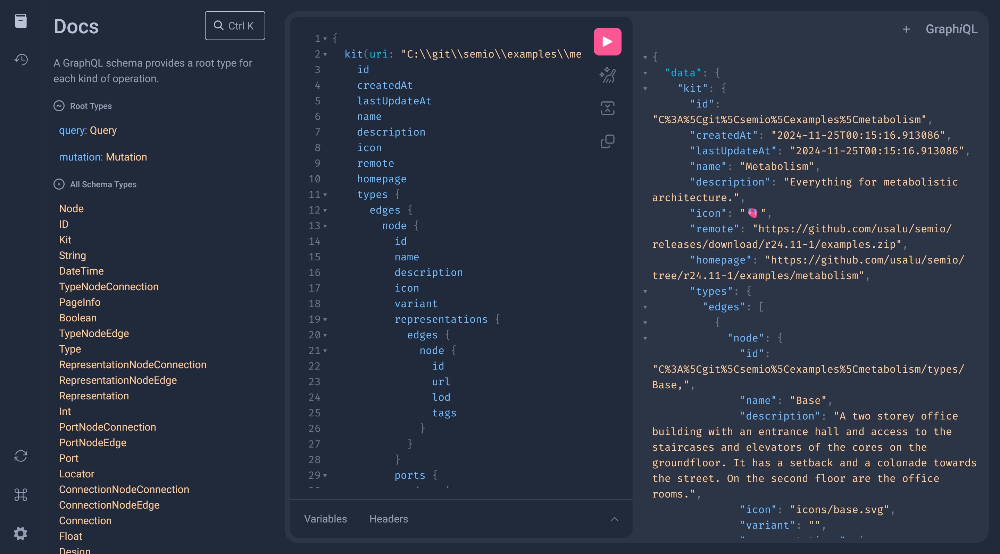
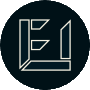

> 👀 Are you curious how we develop semio? Then you might want to check out our [Discord server](https://discord.gg/m6nnf6pQRc) 👥

<p align="center">
    <a href="https://docs.semio-tech.com">
      <picture>
          <source media="(prefers-color-scheme: dark)" srcset="assets/logo/semio_horizontal_dark.svg">
          <source media="(prefers-color-scheme: light)" srcset="assets/logo/semio_horizontal.svg">
          
      </picture>
    </a>
    <br/>
    <a href="https://play.semio-tech.com"></a>
    <a href="https://docs.semio-tech.com"></a>
    <a href="https://js.semio-tech.com"></a>
    <a href="https://discord.gg/m6nnf6pQRc"></a>
    <br/>
     <a href="https://github.com/usalu/semio"></a>
    <a href="https://doi.org/10.5281/zenodo.8419156"></a>
    <a href="https://choosealicense.com/licenses/agpl-3.0/"></a>
    <br/>
    <a href="https://eg-ice-25.semio-tech.com"></a>
    <a href="https://doi.org/10.17868/strath.00093288"></a>
    <a href="https://eg-ice-23.semio-tech.com"></a>
    <br/>
    <a href="https://play.semio-tech.com"></a>
    <a href="https://www.grasshopper3d.com/"></a>
    <a href="https://www.microsoft.com/windows/windows-11"></a>
    <a href="https://apple.com/macos"></a>
    <br/>
    <a href="https://www.typescriptlang.org/"></a>
    <a href="https://www.python.org/"></a>
    <a href="https://learn.microsoft.com/en-us/dotnet/csharp/"></a>
    <br/>
    <br/>
    <i>🧩 Design-Information-Modeling for Kit-of-Parts 🏘️ </i>
</p>
<br/>

You want to 🧩 the next 🏘️🏛️🏢🏭🏫🏨⛪🕌 with 🤖? But 📐🔢🗣️👥🖱️⌨️ takes all your ⌚? Then try to 🧠 the 🧬 and let semio 💉🖥️✒️🖨️🪄🚀

# 👋 Hello contributor

> [!NOTE]
> Are you a user or new to semio? Then you might want to first check out our [docs](https://docs.semio-tech.com) 📖

Glad to see you!

Let me walk you through 🚶

# 📑 Overview

1. [🛍️ Products](#%EF%B8%8F-products-)
   - [✏️ sketchpad](#%EF%B8%8F-sketchpad-)
   - [👥 studio](#-studio-)
   - [🤖 assistant](#-assistant-)
   - [🦗 semio.gh](#-semiogh-)
   - [🐝 semio.wasp](#-semiowasp-)
   - [🦌 semio.monoceros](#-semiomonoceros-)
   - [🐞 semio.ladybug](#-semioladybug-)
1. [📄 Specs](#-specs-)
   - [📦 Kit](#-kit-)
   - [🏘️ Design](#%EF%B8%8F-design-)
   - [🏠 Type](#-type-)
   - [🔗 Connection](#-connection-)
   - [⭕ Piece](#-piece-)
   - [⚓ Port](#-port-)
   - [💾 Representation](#-representation-)
   - [📏 Quality](#-quality-)
   - [🏷️ Tag](#%EF%B8%8F-tag-)
   - [◳ Plane](#-plane-)
   - [🔗 Url](#-url-)
1. [🦑 Repo](#-repo-)
   - [⚖️ Principles](#️-principles-)
   - [🔀 Git](#-git-)
     - [📢 Release](#-release-)
     - [🏷️ Tag](#%EF%B8%8F-tag--1)
     - [🌿 Branch](#-branch-)
     - [🗃️ Commit](#️%EF%B8%8F-commit-)
1. [🧑‍💻 Development](#-development-)
   - [🪄 AI](#-ai-)
     - [🖱️ Cursor](#%EF%B8%8F-cursor-)
     - [✈️ Copilot](#%EF%B8%8F-copilot-)
1. [♻️ Ecosystems](#%EF%B8%8F-ecosystems-)
   - [🟨 JavaScript](#-javascript-)
   - [🟪 .NET](#-net-)
   - [🐍 Python](#-python-)
1. [📦 Components](#-components-)
   - [🟨 @semio/js](#-semiojs-)
   - [✏️ @semio/sketchpad](#️-semiosketchpad-)
   - [📚 @semio/docs](#-semiodocs-)
   - [🎛️ @semio/playground](#%EF%B8%8F-semioplayground-)
   - [🤖 @semio/assistant](#-semioassistant-)
   - [⚙️ @semio/engine](#️-semioengine-)
   - [🟪 @semio/net](#-semionet-)
   - [🦗 @semio/grasshopper](#-semiograsshopper-)
     - [🪢 Scripting](#️-scripting-)
   - [🛍️ @semio/assets](#%EF%B8%8F-semioassets-)
     - [🏷️ Badges](#%EF%B8%8F-badges-)
     - [📄 Fonts](#-fonts-)
     - [👁️ Icons](#-icons-)
1. [🏘️ Examples](#%EF%B8%8F-examples-)
   - [🚀 Starter](#-starter-)
   - [👋 Hello semio](#-hello-semio-)
   - [🫀 Metabolism](#-metabolism-)
1. [💯 Brand](#-brand-)
   - [✍️ Concept](#%EF%B8%8F-concept-)
   - [🌈 Colors](#-colors-)
   - [📄 Typography](#-typography-)
   - [👀 Visual elements](#-visual-elements-)
1. [⚖️ License](#-license-)
1. [🔒Security](#-security-)
1. [✨ Contributors](#-contributors-)

# 🛍️ Products [↑](#-overview)

> Do you wonder how semio is interopable? The reason are shared [specification](#-specs-), [ecosystems](#%EF%B8%8F-ecosystems-) and [components](#-components-) 🪢

## ✏️ sketchpad [↑](#%EF%B8%8F-products-)

sketchpad is a simple-to-use, accessible and browser-based user interface for semio🖱️


## 👥 studio [↑](#%EF%B8%8F-products-)

A studio is a synchronous collaboriation environment for teams to work together in semio 🤝

<!--  -->

## ☁️ cloud [↑](#%EF%B8%8F-products-)

Use any file-hosting platform as an asynchronous Common-Data-Environment 📁


## 🤖 assistant [↑](#%EF%B8%8F-products-)

The assistant helps you on every step in the design process with semio ✍️


## 🦗 [semio.gh](https://docs.semio-tech.com/manuals/grasshopper) [↑](#%EF%B8%8F-products-)

A batteries-included [Grasshopper](https://www.grasshopper3d.com) plugin for semio ⚡


## 🦏 semio.3dm [↑](#%EF%B8%8F-products-)

A Grasshopper-based integration of [Rhino](https://www.rhino3d.com) and semio 🔀

## 🐝 semio.wasp [↑](#%EF%B8%8F-products-)

A Grasshopper-based integration of [Wasp](https://www.food4rhino.com/en/app/wasp) and semio 🔀


## 🦌 semio.monoceros [↑](#%EF%B8%8F-products-)

A Grasshopper-based integration of [Monoceros](https://monoceros.sub.digital) and semio 🔀


## 🐞 semio.ladybug [↑](#%EF%B8%8F-products-)

A Grasshopper-based integration of [Ladybug](https://www.ladybug.tools) and semio 🔀

# 📄 Specs [↑](#-overview)

## 📦 Kit [↑](#-specs-)

A [`kit`](#-kit-) is a collection of [`types`](#-type-) and [`designs`](#%EF%B8%8F-design-) 📦

A [`kit`](#-kit-) is either _static_ (a special `.zip` file) or _dynamic_ (bound to a runtime) 📦

A _static_ [`kit`](#-kit-) contains a reserved `.semio` folder that contains a `kit.db` sqlite file 💾

The SQL-schema of `kit.db` is found in [`./sqlite/schema.sql`](./sqlite/schema.sql) 📄

For Inter-Process-Communication (IPC) the JSON-schema in [`./jsonschema/kit.json`](./jsonschema/kit.json) is used 📄

## 🏘️ Design [↑](#-specs-)

A [`design`](#%EF%B8%8F-design-) is an undirected graph of [`pieces`](#-piece-) (nodes) and [`connections`](#-connection-) (edges) 📐

A _flat_ [`design`](#%EF%B8%8F-design-) has no [`connections`](#-connection-) and all [`pieces`](#-piece-) are _fixed_ ◳

The [`pieces`](#-piece-) are _placed_ _hierarchically_ ([breadth-first](https://en.wikipedia.org/wiki/Breadth-first_search)) for every _component_ 🌿

Additional [`connections`](#-connection-) which where not used in the _placement_ can be used to validate the computed [`planes`](#-plane-) 🛂

## 🏠 Type [↑](#-specs-)

A [`type`](#-type-) is a resuable component with different [**`representations`**](#-representation-) and[**`ports`**](#-port-) 🧱

## 🔗 Connection [↑](#-specs-)

A [`connection`](#-connection-) is a 3D-Link between two [`pieces`](#-piece-) with the _translation_ parameters **gap** (offset in y-direction), **shift** (offset in x-direction) and **rise** (offset in z-direction), and the _rotation_ parameters **rotation** (rotation around y-axis), **turn** (rotation around z-axis) and **tilt** (rotation around x-axis) 🪢

The _translation_ is applied first, then the _rotation_ 🥈

The two [`pieces`](#-piece-) are called **_connected_** and **_connecting_** but there is no difference between them 🔄

The _direction_ of a [`connection`](#-connection-) goes from the lower _hierarchy_ to the higher _hierarchy_ of the [`pieces`](#-piece-) ➡️

## ⭕ Piece [↑](#-specs-)

A [`piece`](#-piece-) is an instance of either a [`type`](#-type-) or a [`design`](#%EF%B8%8F-design-) 📐

A [`piece`](#-piece-) is either _fixed_ (with a [`plane`](#-plane-)) or _linked_ (with a [`connection`](#-connection-)) 📐

A group of _connected_ [`pieces`](#-piece-) is called a _component_ 🌿

The _hierachy_ of a [`piece`](#-piece-) is the length of the shortest path to the next _fixed_ [`piece`](#-piece-) 👣

## ⚓ Port [↑](#-specs-)

A [`port`](#-port-) is a conceptual connection **point** with an outwards **direction** 🤝

A [`port`](#-port-) can be marked as **mandatory** in which case it is required to be connected to a [`piece`](#-piece-) 💯

A [`port`](#-port-) can have a port **family** and a list of **compatible families** 👨‍👩‍👧‍👦

No **family** means the _default_ family and no **compatible families** means the port is compatible with all other ports 🔑

It is enough for one [`port`](#-port-) to be compatible with another [`port`](#-port-) to be compatible with each other ↔️

## 💾 Representation [↑](#-specs-)

A [`representation`](#-representation-) is a **[`tagged`](#%EF%B8%8F-tag-)** **[`url`](#-url-)** to a resource with an optional **description** 📄

No **[`tags`](#%EF%B8%8F-tag-)** means the _default_ representation 🔑

The similarity of [`representations`](#-representation-) is determined by the [jaccard index](https://en.wikipedia.org/wiki/Jaccard_index) of their **[`tags`](#%EF%B8%8F-tag-)** 🔄

## 📏 Quality [↑](#-specs-)

A [`quality`](#-quality-) is metadata with a unique **name**, an optional **value**, an optional **unit** and an optional **definition** ([`url`](#-url-) or text) 🔤

The **name** is[kebab-cased](https://en.wikipedia.org/wiki/Kebab_case) and with `.`-separated string similar to [toml keys](https://toml.io/en/v1.0.0#keys) 🔑

No **value** is equivalent to the boolean _true_ where the **name** is the category of the quality 🔑

The **unit** is a [unit identifier](https://en.wikipedia.org/wiki/Unit_of_measurement) 🔢

- `mm` for millimeter, `cm` for centimeter, `dm` for decimeter, `m` for meter, `km` for kilometer
- `m²` for square meter, `m³` for cubic meter, `m⁴` for quartic meter
- `°` for degree, `rad` for radian
- `N` for newton, `kN` for kilonewton, `MN` for meganewton
- `°C` for degree Celsius, `°F` for degree Fahrenheit
- `W` for watt, `kW` for kilowatt, `MW` for megawatt, `GW` for gigawatt
- `Wh` for watt-hour, `kWh` for kilowatt-hour, `MWh` for megawatt-hour, `GWh` for gigawatt-hour
- `J` for joule, `kJ` for kilojoule, `kcal` for kilocalorie
- `kWh/m²a` for kilowatt-hour per square meter per year
- `m/s` for meter per second, `m²/s` for square meter per second, `m³/s` for cubic meter per second
- `Pa` for pascal, `kPa` for kilopascal, `MPa` for megapascal
- …

A list of [qualities](#-quality-) is semantically equivalent to nested dictionaries where the key is the **name** and the value is the **value** ↔️

## 🏷️ Tag [↑](#-specs-)

A [`tag`](#%EF%B8%8F-tag-) is a [kebab-cased](https://en.wikipedia.org/wiki/Kebab_case) **name** 🔤

## ◳ Plane [↑](#-specs-)

A [`plane`](#-plane-) is a location (**origin**) and orientation (**x-axis**, **y-axis** and derived z-axis) in 3D space ✈️

The coordinate system is left-handed where the thumb points up into the direction of the z-axis, the index-finger forwards into the direction of the y-axis and the middle-finger points to the right into the direction of the x-axis 👈

## 🔗 Url [↑](#-specs-)

A [`url`](#-url-) is either _relative_ (to the root of the `.zip` file) or _remote_ (http, https, ftp, …) string🌐

A _relative_ [`url`](#-url-) is a `/`-normalized path to a file in the `.zip` file and is not prefixed with with `.`, `./`, `/`, …

# 🦑 [Repo](https://github.com/usalu/semio) [↑](#-overview)

This git repo has <strong>everything</strong> that exists in the open semio ecosystem 🤯

## ⚖️ Principles [↑](#-repo-)

Let's start with the rule of thumbs that this codebase was built with 🫰

<details>
<summary><strong>💾 If something can be written in a single file, then it probably should ✅</strong></summary>

I know, the urge to <strong>tidy</strong> up or <strong>separate</strong> things is big 🗃️

But try to withstand it 🫥

Out of my experience, it makes development slower, not faster 🐌

A single file is easier for humans and computers to understand 💡

You will be surprised

- by the awesome fill-in-the-middle suggestions of your copilot 🤖
- by the hassle-free context selection for your ai agent 🖱️
- by the smooth refactor experience by just going top-to-bottom ⬇️
- by the beautiful diff for your next code review 🔍
- by the clean git-history when you try to find a certain change 🔁

</details>

<details>
<summary><strong>🙃 Write and read code upside down ✅</strong></summary>

Whenever something is referenced it should be above in the source code ⬆️

This means that all the building blocks (functions, classes, components, …) are first defined and then used below ⬇️

If you have a cyclic depedency (really?!) then put the object with lower complexity first 🥇

This means that when you start with unknown code, it is probably best to start on the bottom and go upwards 🖱️

Why? LLMs, reflection, … , work best left-to-write 🤖

[But Fill-in-the-Middle training is for free!?](https://arxiv.org/abs/2207.14255)

Yeah, if you consider only FiM for code, then yes 🆗

But we want it all!

And is really so hard to start reading a from the bottom?

</details>

<details>
<summary><strong>📑 If a class, function, component, … is only used once, then don't create it ❌</strong></summary>

Probably, you learned to group code by classes, functions, components, … even if those definitions are only used once 🥇

It hides the actual complexity and makes it harder to navigate the code 🔍

</details>

<details>
<summary><strong>📺 Inline everything that bearly fits onto the screen ✅</strong></summary>

Smaller code, less tokens and easier diffs 🔍

Your [ai](#-ai-) bill will be lower and the completions will resolve faster 🚀

If you are not sure what the code does, you can ask [ai](#-ai-) 💬

</details>

<details>
<summary><strong>🗣️ Don't use comments or if you must, only tag code at the end of the line ❌</strong></summary>

Smaller code, less tokens and easier diffs 🔍

Your [ai](#-ai-) bill will be lower and the completions will resolve faster 🚀

If you are not sure what the code does, you can ask [ai](#-ai-) 💬

</details>

<details>
<summary><strong>📑 Use regions to structure your code ✅</strong></summary>

Because you are not using classes, functions, components, … and you are inlining everything, your code will become long 📃

To organize your code, you can use nested regions 📂

In general, our files follow this structure:

1. Header
2. TODOs
3. Imports
4. Constants
5. CODE

</details>

<details>
<summary><strong>📁 If a folder doesn't make your life dramatically easier, don't create it ❌</strong></summary>

We all know this `./src/**` folder that has made it into a lot of starters 🚀

Other than feeling cool about using hacky abbreviations, does it really help you to understand the project faster and work more efficient on it?

If your project contains hundreds of config file and other project folders at the root, maybe 🤔

But most likely not ❌

</details>

<details>
<summary><strong>📦 Parts that belong together should be close in the source code  ✅</strong></summary>

The default code organization is to group kind of structurally similar parts together 📂

All models next to each other, all controllers next to each other, all errors next to each other, …

While this pattern supports structural refactoring, it makes plain extensions harder because you have to search through all the files 🔍

Most changes are plain extensions and not structural refactors 🔄

Further it has the advantage that every LLM-agent only has to predict one big block of code instead of plenty of small ones 🤖

That's why frameworks like [React](https://react.dev/learn/thinking-in-react) exist or vendoring such as with [shadcn](https://ui.shadcn.com/docs) is more flexible than dependcenies such as with [bootstrap](https://getbootstrap.com/)

Cutting components vertically (a bit of logic with a bit of UI) instead of horizontally (all logic, all ui) requires more effort but enhances reusability 🔮

</details>

<details>
<summary><strong>📄 If multiple people work longterm on the same part, then one file for each part should be created ✅</strong></summary>

Trust me, it will make collaboration much easier 🔀

</details>

<details>
<summary><strong>🔮 If you don't need an interface because something is not likely to be extended soon, don't create it ❌</strong></summary>

The main question is the interface productive or not?

The pay-off of abstraction happens in the future 🛣️

Every extension profits from a clean interface 🚀

Most things are not extended 🪨

If you change your architecture, just design proper interfaces for something concrete not something potential and reactor it ✍️

</details>

<details>
<summary><strong>🤏 Repeating code is ok if it the repeated code is close in the source code ✅</strong></summary>

We are past the time where we copy code for no reason 📃

Actually repeated code can improve the quality of your copilots suggestion 🤯

The main question is how can your application grow?

If a change requires exponentially more duplication then you'll probably have to fix it 🛠️

If not, then you are probably good 👌

</details>

<details>
<summary><strong>🤨 Wait, no high-level advice and only plain numbers, files, folders or close line of codes?</strong></summary>

In our understanding, rule-of-thumbs are most useful when they are concrete 🔨

Besides that we are sure you know about <strong>KISS</strong> (Keep-It-Simple-Stupid), <strong>DRY</strong> (Dont-Repeat-Yourself) vs <strong>WET</strong> (Write-Every-Thing-Twice)/<strong>RUG</strong> (Repeat-Until-Good), <strong>YAGNI</strong> (You-Aren't-Gonna-Need-It), <strong>SoC</strong> (Separation-of-Concerns), <strong>Avoid Premature Optimization</strong>, <strong>Law of Demeter</strong>, <strong>LCHC</strong> (Low-Coupling-High-Cohesion), <strong>SOLID</strong> (<strong>SR</strong> (Single Responsibility), <strong>OC</strong> (Open/Closed), <strong>LS</strong> (Liskov's Substitution), <strong>IS</strong> (Interface Segregation), <strong>DI</strong> (Dependency Inversion)), …

But as always, the devil is in the details 😈

Even if 95% of the codebase follows those principles, there are good reasons for the other 5% ⚖️

</details>

**🚩 Don't worry, you'll figure out the possibilities and make the right choice for the specific problems ✅**

## 🔀 [Git](https://github.com/usalu/semio.git) [↑](#-repo-)

### 🦑 GitKraken [↑](#-git-)

> [!NOTE]  
> It is free for open-source projects like this one ❤️

We use [GitKraken Desktop](https://www.gitkraken.com/git-client) as our git client 🖱️

It is the only nice chronological graphical overview for **all** branches at the same time that we found 🔍

### 💬 Discord [↑](#-git-)

Most git events are synchronized with our [repo channel](https://discord.com/channels/1338232508264747130/1339164626658525246) 💬

It is perfect to find the latest activities and the history 🔍

### 📢 Release [↑](#-gitstyle-)

Every release contains a set of matching [specs](#-specs-), [components](#-components-), [examples](#-examples-) and [docs](#-docs-) 📦

The release notes follow this format:

```
SYMBOL TITLE

COMPONENT
- SYMBOL SUMMARY [CONTRIBUTOR]
…
```

**Title symbols:**

- 🏗️ Foundational work
- 🛠️ Heavy work
- 🪛 Minor work
- 🐛 Major Bug fix

**Description symbols:**

- 🌱 Started [not yet ready]
- ➕ Added [ready]
- ⬆️ Updated
- 🔄️ Renamed
- 🔁 Refactored
- 🐛 Bug fix

Before every [release](#-release-) the [repo](#-repo-) is archived and then all [branches](#-branch-) are merged and squashed into a single [commit](#️%EF%B8%8F-commit-) 📦

### 🏷️ Tag [↑](#-gitstyle-)

We have two different types of tags:

- `rYY.MM-V` for [releases](#-release-) (e.g `r21.06-1`,`r23.07-2`,`r24.12-1`, `r25.07-1`, …)
- `COMPONENT-vMAJOR.MINOR.PATCH` for [components](#-components-) which follow the [semver](https://semver.org/) versioning scheme (e.g [`engine-v4.0.2`](#️-semioengine-), [`sketchpad-v1.0.0`](#-semiosketchpad-), [`grasshopper-v5.4.0-beta`](#-semiograsshopper-), …)

### 🌿 Branch [↑](#-gitstyle-)

The `main` branch is the default archive branch 🔒

Every [contributor](#-contributor-) has their own `FIRSTNAME` general-purpose development branch 🛠️

In [GitKraken](#-gitkraken-) you will quickly find the latest development branch 👀

Other branches are created for [components](#-components-), [specific features](https://github.com/usalu/semio/labels/enhancement) or [bug fixes](https://github.com/usalu/semio/labels/bug) 🐛

Usually one person works on one feature at a time and hence the `-NAME` suffix 📛

### 🗃️ Commit [↑](#-gitstyle-)

<details>
<summary><strong>📦 Commit as much as you like ✅</strong></summary>

Are you worried about committing all those binary application files (`.zip`, `.gh`, `.blend`, `.glb`, `.3dm`, …) or the intermediate versions between your [ai](#ai) edits?

Well, normally you should be 💾

But as we archive and squash all commits on every [release](#-release-) nothing is lost or polluted 💯

</details>

<details>
<summary><strong>⌛ Push around once an hour ✅</strong></summary>

Pushing regularly keeps you extra safe from losing your work 🛟

There are a few services (like [Discord](https://discord.com/channels/1338232508264747130/1339164626658525246)) that are automatically updating to what happens in the [repo](#-repo-) 🔄️

To keep our inbox notifications low, we try to push not more than once an hour ⬆️

</details>

# 🧑‍💻 Development [↑](#-overview)

Different [ecosystems](#-ecosystems-) need different tools 🧰

For a complete setup you need:

- Windows 10 or 11
- [Visual Studio Code](https://code.visualstudio.com/sha/download?build=stable&os=win32-x64-user)
- [Visual Studio 2022 Community](https://visualstudio.microsoft.com/de/thank-you-downloading-visual-studio/?sku=Community&channel=Release&version=VS2022)
- [Rhino 8](https://www.rhino3d.com/download/rhino-for-windows/8/latest/)
- Python 3.13
- Poetry
- [Node](https://nodejs.org/dist/v22.14.0/node-v22.14.0-x64.msi)

If you do not have Python installed, I recommend to install it over the [Microsoft Store](<(https://www.microsoft.com/store/productId/9NCVDN91XZQP?ocid=pdpshare)>) 🏪

Afterwards you can install poetry with this Powershell command:

```powershell
(Invoke-WebRequest -Uri https://install.python-poetry.org -UseBasicParsing).Content | python -
```

In the console you will see a warning that the `poetry.exe` is not installed in the requested location 📁

Then copy the actual path `...\AppData\Local\Packages\PythonSoftwareFoundation...\Roaming\pypoetry\venv\Scripts` and add it to your environmental path variable ➕

Then you can `build.ps1` in the Powershell and add your full path `LOCAL_PATH\dotnet\Semio.Grasshopper\Debug\net48` to your GrasshopperDeveloperSettings ⚙️

If you have never executed local Powershell before then you have to first [Set-ExecutionPolicy](https://learn.microsoft.com/en-us/powershell/module/microsoft.powershell.security/set-executionpolicy) ⚠️
If you don't care just run:

```powershell
Set-ExecutionPolicy -ExecutionPolicy Unrestricted -Scope LocalMachine
```

### 🪄 AI [↑](#-development-)

Most of our [codebase](#-principles-) is heavily optimized for AI agents 🤖

### ✈️ [Copilot](.github/chatmodes) [↑](#-ai-)

<details>
<summary><strong>📚 Resources:</strong></summary>

- [Chat modes](https://code.visualstudio.com/docs/copilot/chat/chat-modes)

</details>

Copilot is the only request-based billing provider left and is hence much cheaper than the others 💳

We prepare good tickets for the agent, currently with [GPT-5](https://openai.com/gpt-5) and [Claude Sonnet 4](https://www.anthropic.com/claude/sonnet) 🚀

### 🖱️ [Cursor](.cursor) [↑](#-ai-)

<details>
<summary><strong>📚 Resources:</strong></summary>

- [Rules](https://docs.cursor.com/context/rules)

</details>

We use [Cursor](https://www.cursor.com) as general editor for typing code mostly with [Tab](https://docs.cursor.com/tab/overview) ➡️

For tasks that require updated docs we use the agent 💬

### ⌨️ [Claude Code](CLAUDE.md) [↑](#-ai-)

For tasks that require a lot of codebase context or tool usage we use [Claude Code]() 💬

### 🌐 Browser [↑](#-ai-)

For simple tasks that only affect one file (sorting, formatting, explaining, …) we use the free [ChatGPT](https://chatgpt.com), [Gemini](https://gemini.google.com) or [Groq](https://console.groq.com), … in the browser to not waste precious tokens 🐒

## 🔄 CI/CD [↑](#-development-)

<details>
<summary><strong>📺 Channels:</strong></summary>

- [TechWorld with Nana](https://www.youtube.com/@TechWorldwithNana) - `devops`

</details>

# ♻️ Ecosystems [↑](#-overview)

<details>
<summary><strong>📺 Channels:</strong></summary>

- [FreeCodeCamp](https://www.youtube.com/@FreeCodeCamp) - `full-projects`
- [Programming with Mosh](https://www.youtube.com/@programmingwithmosh) - `beginner`
- [Fireship](https://www.youtube.com/@Fireship) - `quaffable`
  - [… in 100 Seconds](https://www.youtube.com/watch?v=DC471a9qrU4&list=PL0vfts4VzfNiI1BsIK5u7LpPaIDKMJIDN) - `high-level`
- [Lex Fridman](https://www.youtube.com/@lexfridman) - `interviews`
- [Amigoscode](https://www.youtube.com/@amigoscode) - `java`
- [tsoding](https://www.youtube.com/@tsoding) - `haskell`

</details>

You might have noticed that the individual components can be closely related such as [sketchpad](#️-sketchpad-), [Grasshopper](#-semiogh-) and [engine](#️-engine-) but they are in totally different folders 📂

The reason for this is that the repo is not disected according content but according technology stack ✂️

This is less intuitive but more tool-friendly and everything that is easier for our tools is less pain to develop 🧑‍💻

## 🟨 [JavaScript](https://github.com/usalu/semio/tree/main/js) [↑](#%EF%B8%8F-ecosystems-)

<details>
<summary><strong>📚 Resources:</strong></summary>

- [JavaScript](https://developer.mozilla.org/docs/Web/JavaScript)
- [Node](https://nodejs.org/en/learn/getting-started/introduction-to-nodejs)
- [TypeScript](https://www.npmjs.com/package/typescript)
  - [Docs](https://www.typescriptlang.org/docs)
  - [Issues](https://github.com/microsoft/TypeScript/issues)
- [Wasm](https://developer.mozilla.org/docs/WebAssembly)
  - [C/C++](https://developer.mozilla.org/docs/WebAssembly/Guides/C_to_Wasm)
  - [Rust](https://developer.mozilla.org/docs/WebAssembly/Rust_to_Wasm)

</details>

<details>
<summary><strong>📺 Channels:</strong></summary>

- [WebDevSimplified](https://www.youtube.com/@WebDevSimplified) - `beginner`
- [Jack Herrington](https://www.youtube.com/@jherr) - `react`
- [The Net Ninja](https://www.youtube.com/@NetNinja) - `everything`
- [Fireship](https://www.youtube.com/@Fireship) - `quaffable`
- [Theo - t3.gg](https://www.youtube.com/@t3dotgg) - `opinionated`
- [The Primeagen](https://www.youtube.com/@ThePrimeagen) - `entertainment`

</details>

## 🟪 [.NET](https://github.com/usalu/semio/tree/main/dotnet) [↑](#%EF%B8%8F-ecosystems-)

<details>
<summary><strong>📚 Resources:</strong></summary>

- [.NET](https://dotnet.microsoft.com)
- [C#](https://learn.microsoft.com/dotnet/csharp)
- [NuGet](https://www.nuget.org)

</details>

<details>
<summary><strong>📺 Channels:</strong></summary>

- [IAmTimCorey](https://www.youtube.com/@IAmTimCorey)
- [Nick Chapsas](https://www.youtube.com/@NickChapsas)
</details>

A .NET core for semio 🥜

> [!WARNING]  
> [Rhino](#-semio.3dm-) still runs on .NET 7.0 7️⃣
> Be careful to not update packages to a higher version, that might break the compatibility 🚨

## 🐍 [Python](https://github.com/usalu/semio/tree/main/python) [↑](#%EF%B8%8F-ecosystems-)

<details>
<summary><strong>📚 Resources:</strong></summary>

- [Python](https://www.python.org)
- [Poetry](https://python-poetry.org)

</details>

<details>
<summary><strong>📺 Channels:</strong></summary>

- [mCoding](https://www.youtube.com/@mCoding) - `advanced`
- [Anthony writes code](https://www.youtube.com/@anthonywritescode) - `advanced`
  - [Anthony explains](https://www.youtube.com/playlist?list=PLWBKAf81pmOaP9naRiNAqug6EBnkPakvY) - `features`
- [Corey Schafer](https://www.youtube.com/@coreyms) - `everything`
- [ArjanCodes](https://www.youtube.com/@ArjanCodes) - `beginner`
- [Tech with Tim](https://www.youtube.com/@TechWithTim) - `beginner`

</details>

Currently only [engine](#️-semioengine-) but in the future it might grow and then the [`.venv`](https://docs.python.org/3/library/venv.html) will be centralized, …

# 📦 Components [↑](#-overview)

A component is a piece of software which is packaged independently 🏝️

## 🟨 [@semio/js](https://github.com/usalu/semio/tree/main/js) [↑](#-components-)

<details>
<summary><strong>📚 Resources:</strong></summary>

- [React](https://www.npmjs.com/package/react)
  - [Docs](https://react.dev)
  - [Issues](https://github.com/facebook/react/issues)
- [Vite](https://www.npmjs.com/package/vite)
  - [Docs](https://vitejs.dev/guide)
  - [Config](https://vitejs.dev/config)
  - [Issues](https://github.com/vitejs/vite/issues)
- [Tailwind CSS](https://tailwindcss.com)
  - [Docs](https://tailwindcss.com/docs)
  - [Issues](https://github.com/tailwindlabs/tailwindcss/issues)
- [Shadcn](https://ui.shadcn.com)
  - [Docs](https://ui.shadcn.com/docs)
  - [Issues](https://github.com/shadcn-ui/ui/issues)
- [Radix UI](https://www.radix-ui.com/)
  - [Docs](https://www.radix-ui.com/primitives/docs/overview/introduction)
  - [Issues](https://github.com/radix-ui/primitives/issues)
- [Lucide](https://www.npmjs.com/package/lucide-react)
  - [Docs](https://lucide.dev/docs/lucide-react)
  - [Icons](https://lucide.dev/icons/)
- [Storybook](https://www.npmjs.com/package/@storybook/react)
  - [Docs](https://storybook.js.org/docs)
  - [Issues](https://github.com/storybookjs/storybook/issues)
- [Three.js](https://www.npmjs.com/package/three)
  - [Docs](https://threejs.org/docs/)
  - [Examples](https://threejs.org/examples/)
- [React Three Fiber](https://www.npmjs.com/package/@react-three/fiber)
  - [Docs](https://docs.pmnd.rs/react-three-fiber)
  - [Issues](https://github.com/pmndrs/react-three-fiber/issues)
- [React Three Drei](https://www.npmjs.com/package/@react-three/drei)
  - [Docs](https://github.com/pmndrs/drei)
  - [Examples](https://drei.pmnd.rs/)
- [React Flow](https://www.npmjs.com/package/@xyflow/react)
  - [Docs](https://reactflow.dev/docs)
  - [Examples](https://reactflow.dev/examples)
- [Yjs](https://www.npmjs.com/package/yjs)
  - [Docs](https://docs.yjs.dev)
  - [API](https://github.com/yjs/yjs)
  - [Issues](https://github.com/yjs/yjs/issues)
- [sql.js](https://www.npmjs.com/package/sql.js)
  - [Docs](https://sql.js.org)
  - [API](https://sql.js.org/documentation)
  - [Issues](https://github.com/sql-js/sql.js/issues)
  - [Playground](https://sql.js.org/examples/GUI)
- [dnd kit](https://www.npmjs.com/package/@dnd-kit/core)
  - [Docs](https://docs.dndkit.com/)
  - [Examples](https://master--5fc05e08a4a65d0021ae0bf2.chromatic.com/)
- [Cytoscape](https://www.npmjs.com/package/cytoscape)
  - [Docs](https://js.cytoscape.org/)
  - [API](https://js.cytoscape.org/#core)
- [Markdoc](https://www.npmjs.com/package/@markdoc/markdoc)
  - [Docs](https://markdoc.dev/docs/getting-started)
  - [Issues](https://github.com/markdoc/markdoc/issues)
- [Motion](https://www.npmjs.com/package/motion)
  - [Docs](https://motion.dev/docs)
  - [Examples](https://motion.dev/examples)

</details>

<details>
<summary><strong>📼 Videos:</strong></summary>

- [React State Managment](https://www.youtube.com/watch?v=-bEzt5ISACA)

</details>

The core which is shared in the [semio JavaScript ecosystem](#-javascript-) 🥜

## ✏️ [@semio/sketchpad](https://github.com/usalu/semio/tree/main/js/sketchpad) [↑](#-components-)

<details>
<summary><strong>📚 Resources:</strong></summary>

- [Electron](https://www.npmjs.com/package/electron)
  - [Docs](https://www.electronjs.org/docs)
  - [API](https://www.electronjs.org/docs/latest/api/app)
  - [Issues](https://github.com/electron/electron/issues)
- [Electron Forge](https://www.npmjs.com/package/electron-forge)
  - [Docs](https://www.electronforge.io/docs)
  - [Issues](https://github.com/jclab/electron-forge/issues)

</details>
An electron-based desktop app primarly working for with local kits 💾

## 🤖 [@semio/assistant](https://github.com/usalu/semio/tree/main/js/assistant) [↑](#-components-)

<details>
<summary><strong>📚 Resources:</strong></summary>

- [Model Context Protocol](https://modelcontextprotocol.io)
- [OpenAI](https://platform.openai.com/docs)
- [Claude](https://docs.anthropic.com)
- [Gemini](https://ai.google.dev)
- [Groq](https://console.groq.com/docs)

</details>

Mostly a [Large Language Model](https://en.wikipedia.org/wiki/Large_language_model)-based assistant 🧰

## 📚 [@semio/docs](https://github.com/usalu/semio/tree/main/js/docs) [↑](#-components-)

<details>
<summary><strong>📚 Resources:</strong></summary>

- [Markdown](https://www.markdownguide.org)
- [MDX](https://mdxjs.com/docs)
- [Astro](https://astro.build/docs)
- [Starlight](https://starlight.astro.build)

</details>

<details>
<summary><strong>📺 Channels:</strong></summary>

- [Coding in Public](https://www.youtube.com/@CodinginPublic) - `astro`

</details>

## 🎛️ [@semio/playground](https://playground.semio-tech.com) [↑](#-components-)

A playground for [sketchpad](#%EF%B8%8F-sketchpad-) 🎮

## 🟪 [@semio/net](https://github.com/usalu/semio/tree/main/dotnet) [↑](#-components-)

<details>
<summary><strong>📚 Resources:</strong></summary>

- [Fluent Validation](https://www.nuget.org/packages/FluentValidation)
  - [Docs](https://docs.fluentvalidation.net)
  - [Issues](https://github.com/FluentValidation/FluentValidation/issues)
- [Refit](https://www.nuget.org/packages/Refit)
  - [Docs](https://github.com/reactiveui/refit)
  - [Issues](https://github.com/reactiveui/refit/issues)
- [QuickGraph](https://www.nuget.org/packages/QuickGraph)
  - [Docs](https://github.com/YaccConstructor/QuickGraph)
  - [Issues](https://github.com/YaccConstructor/QuickGraph/issues)
- [Newtonsoft.Json](https://www.nuget.org/packages/Newtonsoft.Json)
  - [Docs](https://www.newtonsoft.com/json/help)
  - [Issues](https://github.com/JamesNK/Newtonsoft.Json/issues)
- [UnitsNet](https://www.nuget.org/packages/UnitsNet)
  - [Docs](https://github.com/angularsen/UnitsNet)
  - [Issues](https://github.com/angularsen/UnitsNet/issues)
- [Humanizer](https://www.nuget.org/packages/Humanizer)
  - [Docs](https://github.com/Humanizr/Humanizer)
  - [Issues](https://github.com/Humanizr/Humanizer/issues)
- [SVG](https://www.nuget.org/packages/Svg)
  - [Docs](https://svg-net.github.io/SVG)
  - [API](https://svg-net.github.io/SVG/api)
  - [Issues](https://github.com/svg-net/svg/issues)
- [GrGen.NET](https://grgen.de)
  - [Docs](https://grgen.de/GrGenNET-Manual.pdf)
  - [API](https://grgen.de/doc/API_7.1)
  - [Issues](https://github.com/grgen-net/grgen-net/issues)

</details>

The core which is shared in the [semio .NET ecosystem](#-net-) 🥜

## 🦗 [@semio/grasshopper](https://github.com/usalu/semio/tree/main/dotnet/Semio.Grasshopper) [↑](#-components-)

<details>
<summary><strong>📚 Resources:</strong></summary>

- [Rhino](https://www.rhino3d.com)
  - [Rhino Developer](https://developer.rhino3d.com)
    - [Rhino Developer API](https://developer.rhino3d.com/api)
    - [RhinoCommon API](https://developer.rhino3d.com/api/rhinocommon)
  - [Grasshopper](https://www.grasshopper3d.com)
    - [Grasshopper SDK](https://mcneel.github.io/grasshopper-api-docs/api/grasshopper)
  - [Forum](https://discourse.mcneel.com)
  </details>

  <details>
  <summary><strong>📺 Channels:</strong></summary>
  - [Nono Martínez Alonso](https://www.youtube.com/c/NonoMart%C3%ADnezAlonso)

  </details>

A full-blown Grasshopper Plugin that has (almost) everything 💯

### 🪢 Scripting

Analogous to [our principles](#️-principles-) for text-based code, we follow a similar logic for script-based code 🔄

<details>
<summary><strong>💻 Optimize your definitions for rectangular space ✅</strong></summary>

Every inch of wasted screen space, means a loss of productivity because you need longer for navigation 🖱️

It is harder to understand something far away compared to something close 🔍

I know, the triangular layout where you place the next component always vertically in the middle of the inputs looks cleaner due to the better wire display 🧹

But you waste a lot of space for nothing 💸

</details>

<details>
<summary><strong>📛 Don't name things unless it is the output of a group or cluster ❌</strong></summary>

We know that there are [only two hard things in Computer Science](https://martinfowler.com/bliki/TwoHardThings.html): Cache invalidation and naming things 🥈

Visual programming languages solve the naming problem by using wires to overcome the neeed of names ⬆️

That is a big gain in productivity because you can focus on the logic instead of the names 🚀

Wait, but how I am supposed to understand what is happening in the code if I don't use names?

Most things in Grasshopper are visual and the green `Only draw preview of selected components` button on the top left is your best friend 🔍

</details>

<details>
<summary><strong>📦 If you don't absolutely need a cluster, don't create it ❌</strong></summary>

Clusters are a good way to make code reusable and hide complexity 🥸

But hiding complexity means a slower development speed because you have to navigate through more files 🐌

Did you know that Grasshopper behaves different inside a cluster when outside?

E.g. when you feed an empty branch into a cluster the input inside it its magically pruned and when you leave it is there again which makes debugging much harder 🐛

I don't have to tell you about open definition tabs, updating nested clusters, recompute, performance, … right?

</details>

<details>
<summary><strong>🤏 Minimize the amount of external parameters and take as much decisions as possible ✅</strong></summary>

Designing means making decisions 🪨

Fewer parameters makes your design more parameteric and not less 🤯

The price for a synergizing system is the loss of flexibility 🤷‍♂️

If you don't know the parameters in the first place, you shouldn't create the Grasshopper script in the first place 🥈

Grasshopper is an amazing tool if you know the system that you want to create but is terrible for prototyping because of its lack of abstraction ⬇️

</details>

## ⚙️ [@semio/engine](https://github.com/usalu/semio/tree/main/py/engine) [↑](#-components-)

<details>
<summary><strong>📚 Resources:</strong></summary>

- [Pydantic](https://pypi.org/project/pydantic)
  - [Docs](https://docs.pydantic.dev)
  - [Issues](https://github.com/pydantic/pydantic/issues)
- [SQLAlchemy](https://pypi.org/project/sqlalchemy)
  - [Docs](https://docs.sqlalchemy.org)
  - [Issues](https://github.com/sqlalchemy/sqlalchemy/issues)
- [SQLModel](https://pypi.org/project/sqlmodel)
  - [Docs](https://sqlmodel.tiangolo.com)
  - [Issues](https://github.com/tiangolo/sqlmodel/issues)
- [Uvicorn](https://pypi.org/project/uvicorn)
  - [Docs](https://www.uvicorn.org)
  - [Issues](https://github.com/encode/uvicorn/issues)
- [Starlette](https://pypi.org/project/starlette)
  - [Docs](https://www.starlette.io)
  - [Issues](https://github.com/encode/starlette/issues)
- [FastAPI](https://pypi.org/project/fastapi)
  - [Docs](https://fastapi.tiangolo.com)
  - [Issues](https://github.com/tiangolo/fastapi/issues)
- [Graphene](https://pypi.org/project/graphene)
  - [Docs](https://docs.graphene-python.org)
  - [Issues](https://github.com/graphql-python/graphene/issues)
- [starlette-graphene3](https://pypi.org/project/starlette-graphene3)
  - [Docs](https://github.com/ciscorn/starlette-graphene3)
  - [Issues](https://github.com/ciscorn/starlette-graphene3/issues)
- [Graphene Pydantic](https://pypi.org/project/graphene-pydantic)
  - [Docs](https://docs.graphene-python.org/projects/pydantic)
  - [Issues](https://github.com/graphql-python/graphene-pydantic/issues)
- [Graphene SQLAlchemy](https://pypi.org/project/graphene-sqlalchemy)
  - [Docs](https://docs.graphene-python.org/projects/sqlalchemy)
  - [Issues](https://github.com/graphql-python/graphene-sqlalchemy/issues)
- [NetworkX](https://pypi.org/project/networkx)
  - [Docs](https://networkx.org)
  - [Issues](https://github.com/networkx/networkx/issues)
- [Lark](https://pypi.org/project/lark-parser)
  - [Docs](https://lark-parser.readthedocs.io)
  - [Issues](https://github.com/lark-parser/lark/issues)
- [Numpy](https://pypi.org/project/numpy)
  - [Docs](https://numpy.org)
  - [Issues](https://github.com/numpy/numpy/issues)
- [Pint](https://pypi.org/project/Pint)
  - [Docs](https://pint.readthedocs.io)
  - [Issues](https://github.com/hgrecco/pint/issues)
- [pytransform3d](https://pypi.org/project/pytransform3d)
  - [Docs](https://dfki-ric.github.io/pytransform3d)
  - [Issues](https://github.com/dfki-ric/pytransform3d/issues)
- [Loguru](https://pypi.org/project/loguru)
  - [Docs](https://loguru.readthedocs.io)
  - [Issues](https://github.com/Delgan/loguru/issues)

</details>

A hidden fat-client which exposes shared functionality to other desktop uis 🤝

It takes care of:

- CRUDs (Create-Read-Update-Delete) for local kits 💾
- Client-Server communication ↔️

It offers two APIs to other clients:

- A simple REST OpenAPI 🥇
- A complex GraphQL Relay API 🥈

### {} [REST OpenAPI](https://github.com/usalu/semio/tree/main/py/engine/engine.py#L5529)

If you go to `http://127.0.0.1:2412/api/docs/` you find the Swagger UI:



### ⭕ [GraphQL Relay](https://github.com/usalu/semio/tree/main/py/engine/engine.py#L5095)

> Still a prototype ✏️

If you go to `http://127.0.0.1:2412/graphql/` you find the GraphiQL UI:



## 🛍️ [@semio/assets](https://github.com/usalu/semio/tree/main/assets) [↑](#-components-)

### 🏷️ [Badges](https://github.com/usalu/semio/tree/main/assets/badges) [↑](#-semio-assets-)

Each badge is created with [shields.io](https://shields.io) with style `flat-square` and [semio colors](#-colors-).

1. Copy the `*.shields` file of an existing badge 📄
1. Open and download the `*.svg` file ⬇️

### 📄 [Fonts](https://github.com/usalu/semio/tree/main/assets/fonts) [↑](#-semio-assets-)

1. Search font on [fontsource.org](https://fontsource.org) 🔍
1. Hit `Download` and extract zip file 📂
1. Use kebaberized font name as folder name and remove everything else (such as version numbers) ➖
1. Merge all types in one folder (`ttf`, `webfonts`, …) - they won't collide due to different extensions 🗃️
1. Remove all parts that repeat everywher (such as common name prefix, single weighted fonts, …) 💯

### 👁️ [Icons](https://github.com/usalu/semio/tree/main/assets/icons) [↑](#-semio-assets-)

1. Open [favicongenerator.net](https://www.favicongenerator.io) 🔍
1. Select `Circle` as `Background Shape` ⏺️
1. Select `Anta` as `Font Family` 📃
1. Enter the `Code` that you find in the [dictionary](https://github.com/usalu/semio/tree/main/meta/dictionary.csv)
1. Adjust the `Font Size` to the largest so that the space to the side is the same as the thickness of the stroke 🖊️
1. Toggle `Enable SVG` on 🔳
1. Hit `Generate Favicon` and download the zip file to `assets/icons/temp/NAME.zip` where `NAME` is the lowercase name and verb of the icon 📂
1. Repeat the process for all icons 🔁
1. Run `build icons` in the debugger of vscode 🔨

# 🏘️ [Examples](https://github.com/usalu/semio/tree/main/examples) [↑](#-overview)

## 🚀 [Starter](https://github.com/usalu/semio/tree/main/examples/starter) [↑](#%EF%B8%8F-examples-)

## 👋 [Hello semio](https://github.com/usalu/semio/tree/main/examples/hello-semio) [↑](#%EF%B8%8F-examples-)

## 🌈 [Geometry](https://github.com/usalu/semio/tree/main/examples/geometry) [↑](#%EF%B8%8F-examples-)

## 🫀 [Metabolism](https://github.com/usalu/metabolism) [↑](#%EF%B8%8F-examples-)

# 💯 Brand [↑](#-overview)

## ✍️ Concept [↑](#-brand-)

### ✅ Do [↑](#%EF%B8%8F-concept-)

- Visual is better than text 👀
- Compact ➡️ More information ➡️ Faster to understand 🚀

### ❌ Dont [↑](#%EF%B8%8F-concept-)

- Rounded corners ⬜
- Shadows 🌤️
- Multiple unicode directly after each other 🥇🥈🥉

## 🌈 Colors [↑](#-brand-)


| Name      | Hex     | RGB           | HSL              | HSV (or HSB)     | CMYK           | Color            |
| --------- | ------- | ------------- | ---------------- | ---------------- | -------------- | ---------------- |
| Primary   | #FF344F | 255, 52, 79   | 352, 100, 60.2   | 352, 79.6, 100   | 0, 80, 69, 0   | Folly            |
| Secondary | #00A69D | 0, 166, 157   | 176.7, 100, 32.5 | 176.7, 100, 65.1 | 100, 0, 5, 35  | Persian green    |
| Tertiary  | #FA9500 | 250, 149, 0   | 34.8, 100, 49    | 35.76, 1, 0.49   | 0, 40, 100, 2  | Princeton orange |
| Dark      | #000117 | 0, 1, 23      | 237.4, 100, 4.5  | 237.4, 100, 9    | 100, 96, 0, 91 | Rich black       |
| Light     | #F7F3E3 | 247, 243, 227 | 48, 55.6, 92.9   | 48, 8.1, 96.9    | 0, 2, 8, 3     | Cosmic latte     |
| Gray      | #7B827D | 123, 130, 125 | 137.1, 2.8, 49.6 | 137.1, 5.4, 51   | 5, 0, 4, 49    | Battleshiip gray |

<!-- TODO: Add gray with shades -->

### 🥇 Primary [↑](#-colors-)

Use the primary color for the most important elements of your design 🏆

We use it e.g. for:

- Highlighting interactive elements 🖱️
- Background for important elements 🟥

### 🥈 Secondary [↑](#-colors-)

### 🥉 Tertiary [↑](#-colors-)

### ⚫ Dark [↑](#-colors-)

### ⚪ Light [↑](#-colors-)

### 🩶 Gray [↑](#-colors-)

Are you curious how a 1, 2, 3, 4, 5, 6, 7, 8, 9, 10 and 11 colored gradient can come together for an invertible theme in a semantically meaningfull way? Well, here is how you achieve it with 33 colors 🤯


## 📄 Typography [↑](#-brand-)

> [!NOTE]
> Try to place notes either in the beginning or the end of a section ↕️
> A starting note should contain something important but not crucial to give the brain the right context 🧠
> The starting sentence of a note needs no symbol because every note type starts with a symbol 🥇

- Be consistent with your language ♻️
- When things are analogical use the same sentence structure for it 🔄
- One symbol after every sentance 💯
- One symbol at a time 🥇
- A symbol is preferably an emoji or otherwise unicode ⚖️
- 📝 One symbol to summarize a title
- 💡 One symbol to summarize a title description and one to think about in the end 🤔
- `.` are forbidden ⛔
- All components in `semio` (`sketchpad`,`studio`, …) start with a small letter 🔡
- Did you know that `…` is just one character?

> [!TIP]
> In the end of a section you can give the curious reader a summarizing question to think about the consequences and a link to more resources 🤔

### 🔡 [Typesetting](/assets/fonts/README.md) [↑](#-typography-)

- Sans serif: [Anta](https://fonts.google.com/specimen/Anta) 🖨️
- Serif: [Kelly Slab](https://fonts.google.com/specimen/Kelly+Slab) ✍️
- Monospaced: [Shart Tech Mono](https://fonts.google.com/specimen/Share+Tech+Mono) 🖥️
- Emoji: [Noto Emoji](https://fonts.google.com/noto/specimen/Noto+Emoji) ⚫

## 👀 Visual elements [↑](#-brand-)

- Sharp corners 📐
- Borders □
- Basic geometric shapes ⚪

# ⚖️ License

The files in this repository are licensed under the [GNU Affero General Public License](https://www.gnu.org/licenses/#AGPL) unless otherwise described. Most libraries, modules, extensions, objects or code herein are explicitly licensed. This is indicated in the root of the containing folder under a different license file, or in the configuration files of a project or in the respective file's header.

As a reference, different type of components have usually different licenses:

- software libraries: [LGPLv3 or later - GNU Lesser General Public License Version 3](https://www.gnu.org/licenses/lgpl-3.0.en.html)
- applications: [AGPLv3 or later - GNU Affero General Public License Version 3](https://www.gnu.org/licenses/agpl-3.0.en.html)
- examples: [MIT - The MIT License](https://mit-license.org)
- templates: [CC0 - No Rights Reserved](https://creativecommons.org/public-domain/cc0/)
- assets: [CC BY-ND 4.0 - Attribution-NoDerivatives 4.0 International](https://creativecommons.org/licenses/by-nd/4.0/)

If you have any questions, please don't hesitate to get in touch with [us over email](mail@semio-tech.com) 📧

# 🔒 Security

If you have any security vulnerabilities or concerns, please contact [us over email](security@semio-tech.com) and don't open an issue, discussion or write into our public discord server 🥷

# ✨ [Contributors](https://github.com/usalu/semio/pulse/monthly) [↑](#-overview)

<table style="border-collapse: collapse; border: none;">
  <tbody>
    <tr style="border: none;">
      <td align="center" valign="top" width="145px" style="border: none;"><a href="https://github.com/usalu">
        
        <br />
        <sub><b>Ueli Saluz</b></sub>
        <br />
        <a href="#-semiojs-" title="🟨@semio/js"><sub>🟨<sub></a>
        <a href="#-semionet-" title="🟪@semio/net"><sub>🟪<sub></a>
        <a href="#-python-" title="🐍Python"><sub>🐍<sub></a>
        <a href="#-semiograsshopper-" title="🦗@semio/grasshopper"><sub>🦗<sub></a>      
        <br />
        <a href="#-semiosketchpad-" title="✏️@semio/sketchpad"><sub>✏️<sub></a>
        <a href="#-semioengine-" title="⚙️@semio/engine"><sub>⚙️<sub></a>
        <a href="#-semioassistant-" title="🤖@semio/assistant"><sub>🤖<sub></a>
        <a href="#%EF%B8%8F-semioplayground-" title="🎛️@semio/playground"><sub>🎛️<sub></a>
        <br />
        <a href="#-semiodocs-" title="📚@semio/docs"><sub>📚<sub></a>
        <a href="#-semioassets-" title="🛍️@semio/assets"><sub>🛍️<sub></a>
        <a href="#-brand-" title="💯Brand"><sub>💯<sub></a>
        <br />
        <a href="#-semio.3dm-" title="🦏Rhino"><sub>🦏<sub></a>
        <a href="#-semiowasp-" title="🐝Wasp"><sub>🐝<sub></a>
        <a href="#-semiomonoceros-" title="🦌Monoceros"><sub>🦌<sub></a>
        <a href="#-semioladybug-" title="🐞Ladybug"><sub>🐞<sub></a>
        <br />
        <a href="#-metabolism-" title="🫀Metabolism"><sub>🫀<sub></a>
        <a href="#-hello-semio-" title="👋Hello semio"><sub>👋<sub></a>
        <a href="#-starters-" title="🚀Starters"><sub>🚀<sub></a>
      </td>
      <td align="center" valign="top" width="145px"><a href="https://github.com/kinansarak">
        
        <br />
        <sub><b>KinanSarak</b></sub></a>
        <br />
        <a href="#-semiodocs-" title="📚@semio/docs"><sub>📚<sub></a>
        <a href="#-hello-semio-" title="👋 Hello semio"><sub>👋<sub></a>
        <a href="#-semiograsshopper-" title="🦗@semio/grasshopper"><sub>🦗<sub></a> 
      </td>
      <td align="center" valign="top" width="145px"><a href="https://github.com/EinMysterium">
        
        <br />
        <sub><b>Christian Hödtke</b></sub></a>
        <br />
        <a href="#-semiograsshopper-" title="🦗@semio/grasshopper"><sub>🦗<sub></a>
      </td>
      <td align="center" valign="top" width="145px"><a href="https://github.com/AdrianoCelentano">
        
        <br />
        <sub><b>AdrianoCelentano</b></sub></a>
        <br />
        <a href="#-semiojs-" title="🟨@semio/js"><sub>🟨<sub></a>
      </td>
      <td align="center" valign="top" width="145px"><a href="https://github.com/drymuzzle">
        
        <br />
        <sub><b>drymuzzle</b></sub></a>
        <br />
        <a href="#-semiograsshopper-" title="🦗@semio/grasshopper"><sub>🦗<sub></a>
        <a href="#-semioladybug-" title="🐞ladybug"><sub>🐞<sub></a>
      </td>
      <td align="center" valign="top" width="145px"><a href="https://github.com/kaatzjo">
        
        <br />
        <sub><b>kaatzjo</b></sub></a>
        <br />
        <a href="#-semioengine-" title="⚙️@semio/engine"><sub>⚙️<sub></a> 
      </td>
      <td align="center" valign="top" width="145px"><a href="https://github.com/pizzadizza">
        
        <br />
        <sub><b>pizzadizza</b></sub></a>
        <br />
        <a href="#-semioassistant-" title="🤖@semio/assistant"><sub>🤖<sub></a> 
      </td>
    </tr>
</table>

# 📊 [Stats](https://stats.docs.semio-tech.com)

We use [Goatcounter](https://www.goatcounter.com) for gaining insights about our [docs](#-semiodocs-) 📈

<p align="center">
    <a href="https://github.com/usalu/semio"></a>
</p>


