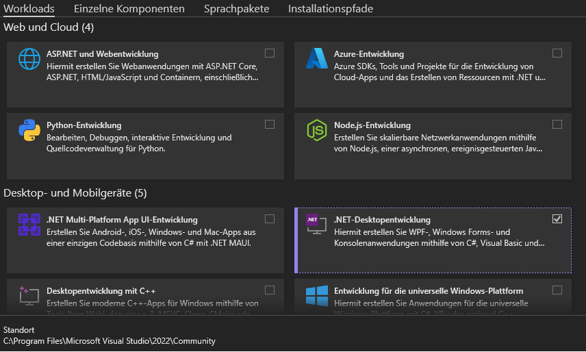
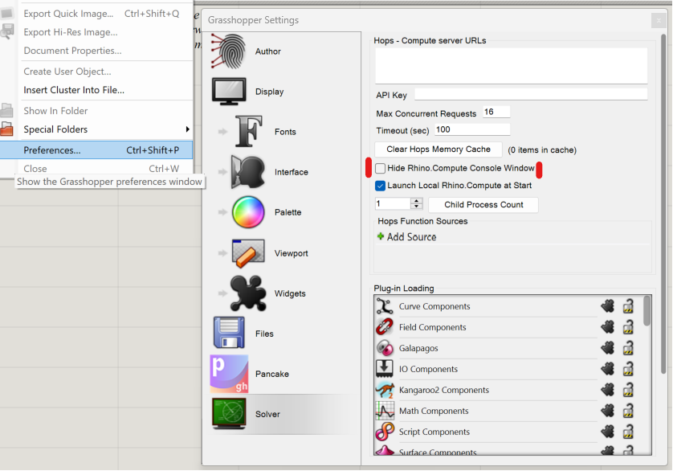
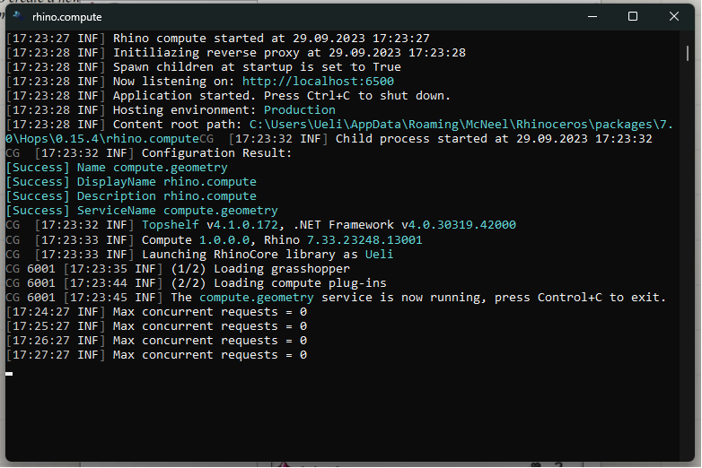
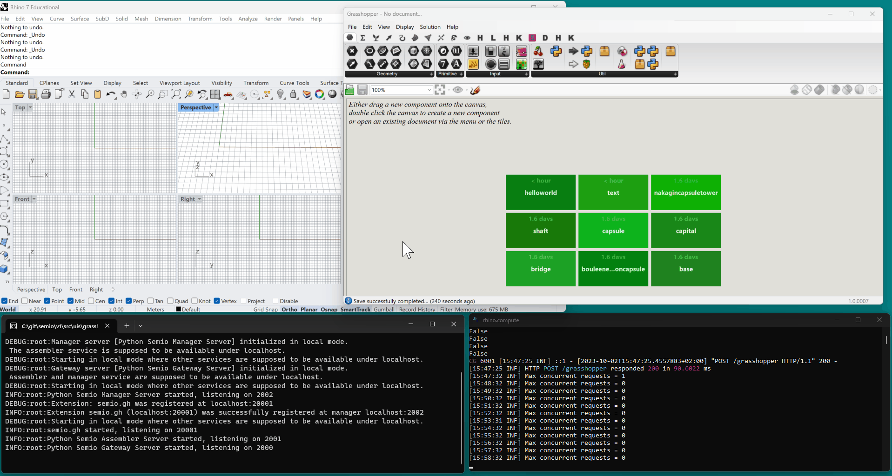

    <picture>
        <source media="(prefers-color-scheme: dark)" srcset="resources/logo/logo-horizontal-dark.svg">
        <source media="(prefers-color-scheme: light)" srcset="resources/logo/logo-horizontal.svg">
        
    </picture>
     
    
    
     
    
    
    
     
    
    <a href="<http://www.w3.org/2001/sw/wiki/RDF>"></a>
    
     
     
    <i>Collaborative, scalable and cross-platform designing.</i>

 

You want to <emoji>✏️</emoji> the next <emoji>🏛️🏘️🏢🏭🏫🏨⛪🕌</emoji>? But <emoji>📐🔢🗣️</emoji> takes all your <emoji>⌚</emoji>? Then try to capture the <emoji>🧬</emoji> and <emoji>💉</emoji>  it into a new design and let semio <emoji>🖥️✒️🖨️</emoji>.

    <picture>
        <source media="(prefers-color-scheme: dark)" srcset="docs/examples/capsuletower/artifacts-dark.svg">
        <source media="(prefers-color-scheme: light)" srcset="docs/examples/capsuletower/artifacts.svg">
        
    </picture>
    <picture>
        <source media="(prefers-color-scheme: dark)" srcset="docs/examples/capsuletower/computation-dark.svg">
        <source media="(prefers-color-scheme: light)" srcset="docs/examples/capsuletower/computation.svg">
        
    </picture>

## What is semio?

<picture>
    <source media="(prefers-color-scheme: dark)" srcset="docs/conceptual/analogies-dark.svg">
    <source media="(prefers-color-scheme: light)" srcset="docs/conceptual/analogies.svg">
    
</picture>

## Getting started

### Requirements
- Windows 11
- Rhino 7 with Grasshopper 1
- Hops from the Rhino Package Manger

> NOTE: Hops (in reality Rhino.Compute) needs certain runtimes which are not by default installed. The developers probably didn't notice because every one had Visual Studio already installed. You can fix this by installing [Visual Studio](https://visualstudio.microsoft.com/) and install .NET for desktop development.

To check if Hops is running correctly, you can uncheck the checkbox "Hide 
Compute.Compute Console Window". Make sure that "Launch Local Rhino.Compute at Start" checkbox is checked.

When you restart Rhino and start Grasshopper a window like this should appear for Rhino.Compute:

If Rhino.Compute still doesn't run, then try cloning the official [Rhino.Compute Git Repository](https://github.com/mcneel/compute.rhino3d) and open `src\compute.sln` in Visual Studio and agree on downloading the missing packages.

### Installation
1. Open Rhino Package Manger
1. Search for semio
1. Install the latest version

> WARNING: The first time you will use semio, the Windows Firewall will ask you to allow for internet access for
`restproxy.exe` and `semio.exe`. This is because the semio backend is a microservice architecture which communicates over several ports. semio will by default **<ins>not</ins>** access the internet because a local server will be started. You you want to host the backend somewhere else, you **<ins>can</ins>** but that requires a Rhino.Compute license and an active server.

### Hello World
Now you can layout your first design!

### Nakagin Capsule Tower
At least in semio, the iconic capsule tower(s) will keep on existing!

Ever wanted to change the capsules with one click?

## How does semio work?

semio is an ecosystem of several components. There is a backend that can be extended on different platforms and different frontends for viewing and/or authoring designs. All services including their depenencies are vendored into the platform extensions to run as a binary. Consider the rest as magic.

## UIs

Currently there is one UI for Grasshopper.

## Extensions

Currently there is one extension for Grasshopper that makes it possible to turn Grasshopper scripts into semio scripts.

## Contribution

If you want to contribute to the project, there are lot's of opportunities! Do you want to write an apapter for a platform or contribute to the core?
If you are not sure what your contribution could exactly be, feel free to take a look under the [project site](https://github.com/users/usalu/projects/2) and see if find something.