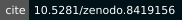
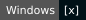
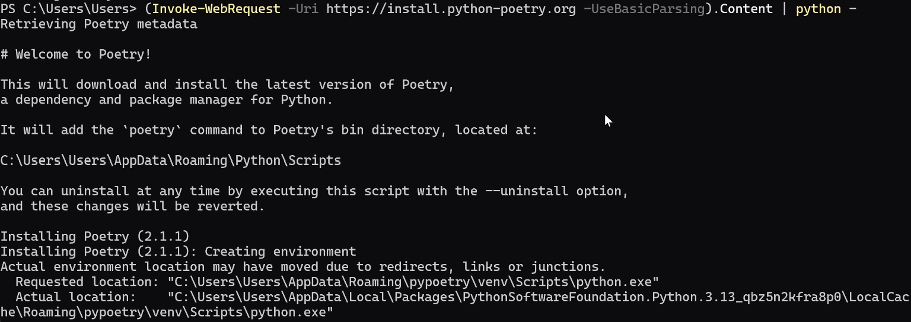
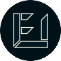

<p align="center">
    <a href="https://docs.semio-tech.com">
      <picture>
          <source media="(prefers-color-scheme: dark)" srcset="assets/logo/logo_dark.svg">
          <source media="(prefers-color-scheme: light)" srcset="assets/logo/logo.svg">
          
      </picture>
    </a>
    <br/>
    <a href="https://play.semio-tech.com"></a>
    <a href="https://docs.semio-tech.com"></a>
    <a href="https://js.semio-tech.com"></a>
    <a href="https://discord.gg/m6nnf6pQRc"></a>
    <br/>
     <a href="https://github.com/usalu/semio"></a>
    <a href="https://doi.org/10.5281/zenodo.8419156"></a>
    <a href="https://choosealicense.com/licenses/agpl-3.0/"></a>
    <br/>
    <a href="https://eg-ice-25.semio-tech.com"></a>
    <a href="https://doi.org/10.17868/strath.00093288"></a>
    <a href="https://eg-ice-23.semio-tech.com"></a>
    <br/>
    <a href="https://play.semio-tech.com"></a>
    <a href="https://www.grasshopper3d.com/"></a>
    <a href="https://www.microsoft.com/windows/windows-11"></a>
    <a href="https://apple.com/macos"></a>
    <br/>
    <a href="https://www.typescriptlang.org/"></a>
    <a href="https://www.python.org/"></a>
    <a href="https://learn.microsoft.com/en-us/dotnet/csharp/"></a>
    <br/>
    <br/>
    <i>🧩 Design-Information-Modeling for Kit-of-Parts 🏘️ </i>
</p>
<br/>

You want to 🧩 the next 🏘️🏛️🏢🏭🏫🏨⛪🕌 with 🤖? But 📐🔢🗣️👥🖱️⌨️ takes all your ⌚? Then try to 🧠 the 🧬 and let semio 💉🖥️✒️🖨️🪄🚀

# 👋 Hello contributor

> [!NOTE]
> Are you a user or new to semio? Then you might want to first check out our [docs](https://docs.semio-tech.com) 📖

Glad to see you!

Let me walk you through 🚶

# 📑 Overview

1. [🛍️ Products](#%EF%B8%8F-products-)
   - [✏️ sketchpad](#%EF%B8%8F-sketchpad-)
   - [👥 studio](#-studio-)
   - [☁️ cloud](#%EF%B8%8F-cloud-)
   - [🤖 assistant](#-assistant-)
   - [🦗 semio.gh](#-semiogh-)
   - [🦏 semio.3dm](#-semio3dm-)
   - [🐝 semio.wasp](#-semiowasp-)
   - [🦌 semio.monoceros](#-semiomonoceros-)
   - [🐞 semio.ladybug](#-semioladybug-)
1. [📄 Specs](#-specs-)
   - [📦 Kit](#-kit-)
   - [🏘️ Design](#%EF%B8%8F-design-)
   - [🏠 Type](#-type-)
   - [🔗 Connection](#-connection-)
   - [⭕ Piece](#-piece-)
   - [⚓ Port](#-port-)
   - [💾 Model](#-model-)
   - [🏷️ Attribute](#%EF%B8%8F-attribute-)
   - [🏷️ Tag](#%EF%B8%8F-tag-)
   - [◳ Plane](#-plane-)
   - [🔗 Url](#-url-)
   - [🔢 Quality](#-quality-)
   - [📊 Benchmark](#-benchmark-)
   - [🏷️ Concept](#%EF%B8%8F-concept-)
   - [👤 Author](#-author-)
   - [📋 Layer](#-layer-)
   - [👥 Group](#-group-)
   - [⚙️ Prop](#️-prop-)
   - [📈 Stat](#-stat-)
1. [🦑 Repo](#-repo-)
   - [⚖️ Principles](#️-principles-)
   - [🔀 Git](#-git-)
     - [🦑 GitKraken](#-gitkraken-)
     - [💬 Discord](#-discord-)
     - [📢 Release](#-release-)
     - [🏷️ Tag](#%EF%B8%8F-tag-)
     - [🌿 Branch](#-branch-)
     - [🗃️ Commit](#%EF%B8%8F-commit-)
1. [🧑‍💻 Development](#-development-)
   - [📒 Logs and reports](#-logs-and-reports)
   - [🪄 AI](#-ai-)
     - [🛠️ Uses-Cases](#-uses-cases-)
       - [⚖️ Decision Making](#-decision-making-)
       - [🔁 Refactoring](#-refactoring-)
       - [🐛 Bug Fixes](#-bug-fixes-)
     - [⌨️ Tools](#-tools-)
       - [🌐 Web-Chat](#-web-chat-)
         - [❄️ ChatGPT](#-chatgpt-)
         - [🌟 Gemini](#-gemini-)
         - [AI studio](#-ai-studio-)
       - [💻 Editor](#-editor-)
         - [✈️ Copilot](#-copilot-)
         - [🖱️ Cursor](#-cursor-)
       - [⌨️ CLI](#-cli-)
         - [⌨️ Claude Code](#-claude-code-)
       - [☁️ Cloud](#-cloud-)
         - [🦑 Jules](#-jules-)
       - [🔍 Agents](#-agents-)
         - [↕️ Reorderer](#-reorderer-)
         - [🔁 Formatter](#-formatter-)
       - [🤖 Models](#-models-)
         - [Claude Sonnet 4](#-claude-sonnet-4-)
         - [GPT-5](#-gpt-5-)
         - [Gemini 2.5 Pro](#-gemini-25-pro-)
         - [Groq](#-groq-)
     - [🔄 CI/CD](#-cicd-)
1. [♻️ Ecosystems](#%EF%B8%8F-ecosystems-)
   - [🟨 JavaScript](#-javascript-)
   - [🟪 .NET](#-net-)
   - [🐍 Python](#-python-)
1. [📦 Components](#-components-)
   - [🟨 @semio/js](#-semiojs-)
   - [✏️ @semio/desktop](#️-semiodesktop-)
   - [📚 @semio/docs](#-semiodocs-)
   - [🎛️ @semio/play](#%EF%B8%8F-semioplay-)
   - [🤖 @semio/assistant](#-semioassistant-)
   - [⚙️ @semio/engine](#️-semioengine-)
   - [🟪 @semio/net](#-semionet-)
   - [🦗 @semio/grasshopper](#-semiograsshopper-)
     - [🪢 Scripting](#️-scripting-)
   - [🛍️ @semio/assets](#%EF%B8%8F-semioassets-)
     - [🏷️ Badges](#%EF%B8%8F-badges-)
     - [📄 Fonts](#-fonts-)
     - [👁️ Icons](#%EF%B8%8F-icons-)
1. [🏘️ Examples](#%EF%B8%8F-examples-)
   - [🚀 Starter](#-starter-)
   - [👋 Hello semio](#-hello-semio-)
   - [🌈 Geometry](#-geometry-)
   - [🫀 Metabolism](#-metabolism-)
1. [💯 Brand](#-brand-)
   - [✍️ Concept](#%EF%B8%8F-concept-)
     - [✅ Do](#-do-)
     - [❌ Dont](#-dont-)
   - [🌈 Colors](#-colors-)
     - [🥇 Primary](#-primary-)
     - [🥈 Secondary](#-secondary-)
     - [🥉 Tertiary](#-tertiary-)
     - [⚫ Dark](#-dark-)
     - [⚪ Light](#-light-)
     - [🩶 Gray](#-gray-)
   - [📄 Typography](#-typography-)
     - [🔡 Typesetting](#-typesetting-)
   - [👀 Visual elements](#-visual-elements-)
1. [⚖️ License](#-license-)
1. [🔒Security](#-security-)
1. [✨ Contributors](#-contributors-)
1. [📊 Stats](#-stats-)

# 🛍️ Products [↑](#-overview)

> Do you wonder how semio is interopable? The reason are shared [specification](#-specs-), [ecosystems](#%EF%B8%8F-ecosystems-) and [components](#-components-) 🪢

## ✏️ sketchpad [↑](#%EF%B8%8F-products-)

sketchpad is a simple-to-use, accessible and browser-based user interface for semio🖱️


## 👥 studio [↑](#%EF%B8%8F-products-)

A studio is a synchronous collaboriation environment for teams to work together in semio 🤝

<!--  -->

## ☁️ cloud [↑](#%EF%B8%8F-products-)

Use any file-hosting platform as an asynchronous Common-Data-Environment 📁


## 🤖 assistant [↑](#%EF%B8%8F-products-)

The assistant helps you on every step in the design process with semio ✍️


## 🦗 [semio.gh](https://docs.semio-tech.com/manuals/grasshopper) [↑](#%EF%B8%8F-products-)

A batteries-included [Grasshopper](https://www.grasshopper3d.com) plugin for semio ⚡


## 🦏 semio.3dm [↑](#%EF%B8%8F-products-)

A Grasshopper-based integration of [Rhino](https://www.rhino3d.com) and semio 🔀

## 🐝 semio.wasp [↑](#%EF%B8%8F-products-)

A Grasshopper-based integration of [Wasp](https://www.food4rhino.com/en/app/wasp) and semio 🔀


## 🦌 semio.monoceros [↑](#%EF%B8%8F-products-)

A Grasshopper-based integration of [Monoceros](https://monoceros.sub.digital) and semio 🔀


## 🐞 semio.ladybug [↑](#%EF%B8%8F-products-)

A Grasshopper-based integration of [Ladybug](https://www.ladybug.tools) and semio 🔀

# 📄 Specs [↑](#-overview)

## 📦 Kit [↑](#-specs-)

A [`kit`](#-kit-) is a collection of [`types`](#-type-), [`designs`](#%EF%B8%8F-design-), [`authors`](#-author-), [`qualities`](#-quality-), [`attributes`](#%EF%B8%8F-attribute-), and [`concepts`](#%EF%B8%8F-concept-) 📦

A [`kit`](#-kit-) is either _static_ (a special `.zip` file) or _dynamic_ (bound to a runtime) 📦

A _static_ [`kit`](#-kit-) contains a reserved `.semio` folder that contains a `kit.db` sqlite file 💾

The SQL-schema of `kit.db` is found in [`./sqlite/schema.sql`](./sqlite/schema.sql) 📄

For Inter-Process-Communication (IPC) the JSON-schema in [`./jsonschema/kit.json`](./jsonschema/kit.json) is used 📄

## 🏘️ Design [↑](#-specs-)

A [`design`](#%EF%B8%8F-design-) is an undirected graph of [`pieces`](#-piece-) (nodes) and [`connections`](#-connection-) (edges) with organizational [`layers`](#-layer-), [`groups`](#-group-), [`stats`](#-stat-), [`attributes`](#%EF%B8%8F-attribute-), and [`concepts`](#%EF%B8%8F-concept-) 📐

A [`design`](#-design-) is _proto_ (a _protodesign_) when it has no _parent_.

_Children_ of a _parent_ are \_subdesigns.

A _flat_ [`design`](#%EF%B8%8F-design-) has no [`connections`](#-connection-) and all [`pieces`](#-piece-) are _fixed_ ◳

The [`pieces`](#-piece-) are _placed_ _hierarchically_ ([breadth-first](https://en.wikipedia.org/wiki/Breadth-first_search)) for every _component_ 🌿

Additional [`connections`](#-connection-) which where not used in the _placement_ can be used to validate the computed [`planes`](#-plane-) 🛂

## 🏠 Type [↑](#-specs-)

A [`type`](#-type-) is a reusable component with different [`models`](#-model-), [`ports`](#-port-), [`attributes`](#%EF%B8%8F-attribute-), [`concepts`](#%EF%B8%8F-concept-), and [`authors`](#-author-) 🧱

A [`type`](#-type-) is _proto_ (a _prototype_) when it has no _parent_.

_Children_ of a _parent_ are \_subtypes.

A [`type`](#-type-) can be **virtual** (intermediate type requiring other virtual types to form a physical type), **scalable**, and **mirrorable** with **stock** quantity, **unit**, and optional **location** 📍

## 🔗 Connection [↑](#-specs-)

A [`connection`](#-connection-) is a 3D-Link between two [`pieces`](#-piece-) with the _translation_ parameters **gap** (offset in y-direction), **shift** (offset in x-direction) and **rise** (offset in z-direction), and the _rotation_ parameters **rotation** (rotation around y-axis), **turn** (rotation around z-axis) and **tilt** (rotation around x-axis) 🪢

The _translation_ is applied first, then the _rotation_ 🥈

The two [`pieces`](#-piece-) are called **_connected_** and **_connecting_** but there is no difference between them 🔄

The _direction_ of a [`connection`](#-connection-) goes from the lower _hierarchy_ to the higher _hierarchy_ of the [`pieces`](#-piece-) ➡️

A [`connection`](#-connection-) can have [`attributes`](#%EF%B8%8F-attribute-) and diagram positioning with **x** and **y** offsets 📍

## ⭕ Piece [↑](#-specs-)

A [`piece`](#-piece-) is an instance of either a [`type`](#-type-) or a [`design`](#%EF%B8%8F-design-) with **id**, optional **description**, optional **plane**, **center** position, **scale**, optional **mirror plane**, **hidden** and **locked** states, **color**, and [`attributes`](#%EF%B8%8F-attribute-) 📐

A [`piece`](#-piece-) is either _fixed_ (with a [`plane`](#-plane-)) or _linked_ (with a [`connection`](#-connection-)) 📐

A group of _connected_ [`pieces`](#-piece-) is called a _component_ 🌿

The _hierarchy_ of a [`piece`](#-piece-) is the length of the shortest path to the next _fixed_ [`piece`](#-piece-) 👣

## ⚓ Port [↑](#-specs-)

A [`port`](#-port-) is a conceptual connection **point** with an outwards **direction**, **id**, optional **description**, and **t** value for diagram ring positioning 🤝

A [`port`](#-port-) can be marked as **mandatory** in which case it is required to be connected to a [`piece`](#-piece-) 💯

A [`port`](#-port-) can have a port **interface** and a list of **compatible interfaces** for explicit compatibility control 👨‍👩‍👧‍👦

No **interface** means the _default_ interface and no **compatible interfaces** means the port is compatible with all other ports 🔑

It is enough for one [`port`](#-port-) to be compatible with another [`port`](#-port-) to be compatible with each other ↔️

A [`port`](#-port-) can have [`props`](#️-prop-) that define measurable characteristics and [`attributes`](#%EF%B8%8F-attribute-) for additional metadata 📏

## 💾 Model [↑](#-specs-)

A [`model`](#-model-) is a **[`tagged`](#%EF%B8%8F-tag-)** **[`url`](#-url-)** to a resource with an optional **description** 📄

No **[`tags`](#%EF%B8%8F-tag-)** means the _default_ model 🔑

The similarity of [`models`](#-model-) is determined by the [jaccard index](https://en.wikipedia.org/wiki/Jaccard_index) of their **[`tags`](#%EF%B8%8F-tag-)** 🔄

## 🏷️ Attribute [↑](#-specs-)

A [`attribute`](#%EF%B8%8F-attribute-) is metadata with a unique **name**, an optional **value**, an optional **unit** and an optional **definition** ([`url`](#-url-) or text) 🔤

The **name** is[kebab-cased](https://en.wikipedia.org/wiki/Kebab_case) and with `.`-separated string similar to [toml keys](https://toml.io/en/v1.0.0#keys) 🔑

No **value** is equivalent to the boolean _true_ where the **name** is the category of the attribute 🔑

The **unit** is a [unit identifier](https://en.wikipedia.org/wiki/Unit_of_measurement) 🔢

- `mm` for millimeter, `cm` for centimeter, `dm` for decimeter, `m` for meter, `km` for kilometer
- `m²` for square meter, `m³` for cubic meter, `m⁴` for quartic meter
- `°` for degree, `rad` for radian
- `N` for newton, `kN` for kilonewton, `MN` for meganewton
- `°C` for degree Celsius, `°F` for degree Fahrenheit
- `W` for watt, `kW` for kilowatt, `MW` for megawatt, `GW` for gigawatt
- `Wh` for watt-hour, `kWh` for kilowatt-hour, `MWh` for megawatt-hour, `GWh` for gigawatt-hour
- `J` for joule, `kJ` for kilojoule, `kcal` for kilocalorie
- `kWh/m²a` for kilowatt-hour per square meter per year
- `m/s` for meter per second, `m²/s` for square meter per second, `m³/s` for cubic meter per second
- `Pa` for pascal, `kPa` for kilopascal, `MPa` for megapascal
- …

A list of [attributes](#%EF%B8%8F-attribute-) is semantically equivalent to nested dictionaries where the key is the **name** and the value is the **value** ↔️

## 🏷️ Tag [↑](#-specs-)

A [`tag`](#%EF%B8%8F-tag-) is a [kebab-cased](https://en.wikipedia.org/wiki/Kebab_case) **name** 🔤

## ◳ Plane [↑](#-specs-)

A [`plane`](#-plane-) is a location (**origin**) and orientation (**x-axis**, **y-axis** and derived z-axis) in 3D space ✈️

The coordinate system is left-handed where the thumb points up into the direction of the z-axis, the index-finger forwards into the direction of the y-axis and the middle-finger points to the right into the direction of the x-axis 👈

## 🔗 Url [↑](#-specs-)

A [`url`](#-url-) is either _relative_ (to the root of the `.zip` file) or _remote_ (http, https, ftp, …) string🌐

A _relative_ [`url`](#-url-) is a `/`-normalized path to a file in the `.zip` file and is not prefixed with with `.`, `./`, `/`, …

## 🔢 Quality [↑](#-specs-)

A [`quality`](#-quality-) is a measurement definition with a **key**, **name**, **description**, **kind** (General, Design, Type, Piece, Connection, Port), **unit information** (SI and Imperial), **range constraints** (min/max with exclusion flags), **default value**, and optional **formula** 📏

A [`quality`](#-quality-) can be **scalable** (adjusts with piece scaling) and have multiple **benchmarks** for performance evaluation 🎯

The **kind** determines which entities the quality can be applied to using a bitwise enum system 🔢

## 📊 Benchmark [↑](#-specs-)

A [`benchmark`](#-benchmark-) is a performance standard within a [`quality`](#-quality-) with a **name**, optional **icon**, and **range** (min/max with exclusion flags) 🏆

Benchmarks provide reference points for evaluating quality measurements against industry or design standards 📈

## 🏷️ Concept [↑](#-specs-)

A [`concept`](#%EF%B8%8F-concept-) is a **name** and **order** pair that provides semantic grouping for [`kits`](#-kit-), [`types`](#-type-), or [`designs`](#%EF%B8%8F-design-) 🧠

Concepts enable hierarchical organization and categorization of design elements beyond simple naming 📂

## 👤 Author [↑](#-specs-)

An [`author`](#-author-) has a **name** and **email** and can be associated with [`kits`](#-kit-), [`types`](#-type-), or [`designs`](#%EF%B8%8F-design-) with a **rank** indicating contribution level 👨‍💻

Authors provide attribution and contact information for design ownership and collaboration 🤝

## 📋 Layer [↑](#-specs-)

A [`layer`](#-layer-) is an organizational grouping within a [`design`](#%EF%B8%8F-design-) with a **name**, optional **description**, and **color** for visual organization 🎨

Layers provide a way to group and manage pieces logically within complex designs 📑

## 👥 Group [↑](#-specs-)

A [`group`](#-group-) is a collection of [`pieces`](#-piece-) within a [`design`](#%EF%B8%8F-design-) with optional **name**, **description**, **color**, and **attributes** 👥

Groups enable semantic clustering of pieces that belong together functionally or conceptually 🔗

## ⚙️ Prop [↑](#-specs-)

A [`prop`](#️-prop-) is a **key-value** pair on a [`port`](#-port-) that references a [`quality`](#-quality-) with a specific **value** and optional **unit** 🔧

Props define measurable characteristics of ports using the quality system for standardized measurement 📐

## 📈 Stat [↑](#-specs-)

A [`stat`](#-stat-) is a statistical measurement on a [`design`](#%EF%B8%8F-design-) that references a [`quality`](#-quality-) with **range** (min/max) and optional **unit** 📊

Stats provide computed or measured performance data for entire designs using the quality framework 📈

# 🦑 [Repo](https://github.com/usalu/semio) [↑](#-overview)

This git repo has <strong>everything</strong> that exists in the open semio ecosystem 🤯

## ⚖️ Principles [↑](#-repo-)

Let's start with the rule of thumbs that this codebase was built with 🫰

<details>
<summary><strong>💾 If something can be written in a single file, then it probably should ✅</strong></summary>

I know, the urge to <strong>tidy</strong> up or <strong>separate</strong> things is big 🗃️

But try to withstand it 🫥

Out of my experience, it makes development slower, not faster 🐌

A single file is easier for humans and computers to understand 💡

You will be surprised

- by the awesome [fill-in-the-middle suggestions](#-cursor-) of your copilot 🤖
- by the hassle-free [context selection](#-browser-) for your ai agent 🖱️
- by the smooth refactor experience by just going top-to-bottom ⬇️
- by the beautiful diff for your next code review 🔍
- by the clean git-history when you try to find a certain change 🔁

</details>

<details>
<summary><strong>🙃 Write and read code upside down ✅</strong></summary>

Whenever something is referenced it should be above in the source code ⬆️

This means that all the building blocks (functions, classes, components, …) are first defined and then used below ⬇️

If you have a cyclic depedency (really?!) then put the object with lower complexity first 🥇

This means that when you start with unknown code, it is probably best to start on the bottom and go upwards 🖱️

Why? LLMs, reflection, … , work best left-to-write 🤖

[But Fill-in-the-Middle training is for free!?](https://arxiv.org/abs/2207.14255)

Yeah, if you consider only FiM for code, then yes 🆗

But we want it all!

And is really so hard to start reading a from the bottom?

</details>

<details>
<summary><strong>📑 If a class, function, component, … is only used once, then don't create it ❌</strong></summary>

Probably, you learned to group code by classes, functions, components, … even if those definitions are only used once 🥇

It hides the actual complexity and makes it harder to navigate the code 🔍

</details>

<details>
<summary><strong>📺 Inline everything that bearly fits onto the screen ✅</strong></summary>

Smaller code, less tokens and easier diffs 🔍

Your [ai](#-ai-) bill will be lower and the completions will resolve faster 🚀

If you are not sure what the code does, you can ask [ai](#-ai-) 💬

</details>

<details>
<summary><strong>🗣️ Don't use comments or if you must, only tag code at the end of the line ❌</strong></summary>

Smaller code, less tokens and easier diffs 🔍

Your [ai](#-ai-) bill will be lower and the completions will resolve faster 🚀

If you are not sure what the code does, you can ask [ai](#-ai-) 💬

</details>

<details>
<summary><strong>📑 Use regions to structure your code ✅</strong></summary>

Because you are not using classes, functions, components, … and you are inlining everything, your code will become long 📃

To organize your code, you can use nested regions 📂

In general, our files follow this structure:

1. Header
2. TODOs
3. Imports
4. Constants
5. CODE

</details>

<details>
<summary><strong>📁 If a folder doesn't make your life dramatically easier, don't create it ❌</strong></summary>

We all know this `./src/**` folder that has made it into a lot of starters 🚀

Other than feeling cool about using hacky abbreviations, does it really help you to understand the project faster and work more efficient on it?

If your project contains hundreds of config file and other project folders at the root, maybe 🤔

But most likely not ❌

</details>

<details>
<summary><strong>📦 Parts that belong together should be close in the source code  ✅</strong></summary>

The default code organization is to group kind of structurally similar parts together 📂

All models next to each other, all controllers next to each other, all errors next to each other, …

While this pattern supports structural refactoring, it makes plain extensions harder because you have to search through all the files 🔍

Most changes are plain extensions and not structural refactors 🔄

Further it has the advantage that every LLM-agent only has to predict one big block of code instead of plenty of small ones 🤖

That's why frameworks like [React](https://react.dev/learn/thinking-in-react) exist or vendoring such as with [shadcn](https://ui.shadcn.com/docs) is more flexible than dependcenies such as with [bootstrap](https://getbootstrap.com/)

Cutting components vertically (a bit of logic with a bit of UI) instead of horizontally (all logic, all ui) requires more effort but enhances reusability 🔮

</details>

<details>
<summary><strong>📄 If multiple people work longterm on the same part, then one file for each part should be created ✅</strong></summary>

Trust me, it will make collaboration much easier 🔀

</details>

<details>
<summary><strong>🔮 If you don't need an interface because something is not likely to be extended soon, don't create it ❌</strong></summary>

The main question is the interface productive or not?

The pay-off of abstraction happens in the future 🛣️

Every extension profits from a clean interface 🚀

Most things are not extended 🪨

If you change your architecture, just design proper interfaces for something concrete not something potential and reactor it ✍️

</details>

<details>
<summary><strong>🤏 Repeating code is ok if it the repeated code is close in the source code ✅</strong></summary>

We are past the time where we copy code for no reason 📃

Actually repeated code can improve the attribute of your copilots suggestion 🤯

The main question is how can your application grow?

If a change requires exponentially more duplication then you'll probably have to fix it 🛠️

If not, then you are probably good 👌

</details>

<details>
<summary><strong>🤨 Wait, no high-level advice and only plain numbers, files, folders or close line of codes?</strong></summary>

In our understanding, rule-of-thumbs are most useful when they are concrete 🔨

Besides that we are sure you know about <strong>KISS</strong> (Keep-It-Simple-Stupid), <strong>DRY</strong> (Dont-Repeat-Yourself) vs <strong>WET</strong> (Write-Every-Thing-Twice)/<strong>RUG</strong> (Repeat-Until-Good), <strong>YAGNI</strong> (You-Aren't-Gonna-Need-It), <strong>SoC</strong> (Separation-of-Concerns), <strong>Avoid Premature Optimization</strong>, <strong>Law of Demeter</strong>, <strong>LCHC</strong> (Low-Coupling-High-Cohesion), <strong>SOLID</strong> (<strong>SR</strong> (Single Responsibility), <strong>OC</strong> (Open/Closed), <strong>LS</strong> (Liskov's Substitution), <strong>IS</strong> (Interface Segregation), <strong>DI</strong> (Dependency Inversion)), …

But as always, the devil is in the details 😈

Even if 95% of the codebase follows those principles, there are good reasons for the other 5% ⚖️

</details>

<details>
<summary><strong>🏷️ Never use `type` for naming enums, interfaces, or types. Always use `kind` instead ✅</strong></summary>

To avoid confusion with the native `type` concept in Semio, always use `kind` for naming enums, interfaces, or types that represent categories or classifications 🏷️

Examples: `ArtifactType` → `ArtifactKind`, `WindowType` → `WindowKind`, etc. 🔄

</details>

**🚩 Don't worry, you'll figure out the possibilities and make the right choice for the specific problems ✅**

## 🔀 [Git](https://github.com/usalu/semio.git) [↑](#-repo-)

### 🦑 GitKraken [↑](#-git-)

> [!NOTE]  
> It is free for open-source projects like this one ❤️

We use [GitKraken Desktop](https://www.gitkraken.com/git-client) as our git client 🖱️

It is the only nice chronological graphical overview for **all** branches at the same time that we found 🔍

### 💬 Discord [↑](#-git-)

Most git events are synchronized with our [repo channel](https://discord.com/channels/1338232508264747130/1339164626658525246) 💬

It is perfect to find the latest activities and the history 🔍

### 📢 Release [↑](#-gitstyle-)

Every release contains a set of matching [specs](#-specs-), [components](#-components-), [examples](#-examples-) and [docs](#-docs-) 📦

The release notes follow this format:

```
SYMBOL TITLE

COMPONENT
- SYMBOL SUMMARY [CONTRIBUTOR]
…
```

**Title symbols:**

- 🏗️ Foundational work
- 🛠️ Heavy work
- 🪛 Minor work
- 🐛 Major Bug fix

**Description symbols:**

- 🌱 Started [not yet ready]
- ➕ Added [ready]
- ⬆️ Updated
- 🔄️ Renamed
- 🔁 Refactored
- 🐛 Bug fix

Before every [release](#-release-) the [repo](#-repo-) is archived and then all [branches](#-branch-) are merged and squashed into a single [commit](#️%EF%B8%8F-commit-) 📦

### 🏷️ Tag [↑](#-gitstyle-)

We have two different types of tags:

- `rYY.MM-V` for [releases](#-release-) (e.g `r21.06-1`,`r23.07-2`,`r24.12-1`, `r25.07-1`, …)
- `COMPONENT-vMAJOR.MINOR.PATCH` for [components](#-components-) which follow the [semver](https://semver.org/) versioning scheme (e.g [`engine-v4.0.2`](#️-semioengine-), [`sketchpad-v1.0.0`](#-semiodesktop-), [`grasshopper-v5.4.0-beta`](#-semiograsshopper-), …)

### 🌿 Branch [↑](#-gitstyle-)

The `main` branch is the default archive branch 🔒

Every [contributor](#-contributor-) has their own `FIRSTNAME` general-purpose development branch 🛠️

In [GitKraken](#-gitkraken-) you will quickly find the latest development branch 👀

Other branches are created for [components](#-components-), [specific features](https://github.com/usalu/semio/labels/enhancement) or [bug fixes](https://github.com/usalu/semio/labels/bug) 🐛

Usually one person works on one feature at a time and hence the `-NAME` suffix 📛

### 🗃️ Commit [↑](#-gitstyle-)

<details>
<summary><strong>📦 Commit as much as you like ✅</strong></summary>

Are you worried about committing all those binary application files (`.zip`, `.gh`, `.blend`, `.glb`, `.3dm`, …) or the intermediate versions between your [ai](#ai) edits?

Well, normally you should be 💾

But as we archive and squash all commits on every [release](#-release-) nothing is lost or polluted 💯

</details>

<details>
<summary><strong>⌛ Push around once an hour ✅</strong></summary>

Pushing regularly keeps you extra safe from losing your work 🛟

There are a few services (like [Discord](https://discord.com/channels/1338232508264747130/1339164626658525246)) that are automatically updating to what happens in the [repo](#-repo-) 🔄️

To keep our inbox notifications low, we try to push not more than once an hour ⬆️

</details>

# 🧑‍💻 Development [↑](#-overview)

Different [ecosystems](#-ecosystems-) need different tools 🧰

For a complete setup you need:

- Windows 10 or 11
- [Visual Studio Code](https://code.visualstudio.com/sha/download?build=stable&os=win32-x64-user)
- [Visual Studio 2022 Community](https://visualstudio.microsoft.com/de/thank-you-downloading-visual-studio/?sku=Community&channel=Release&version=VS2022)
- [Rhino 8](https://www.rhino3d.com/download/rhino-for-windows/8/latest/)
- Python 3.13
- Poetry
- [Node](https://nodejs.org/dist/v22.14.0/node-v22.14.0-x64.msi)

If you do not have Python installed, I recommend to install it over the [Microsoft Store](<(https://www.microsoft.com/store/productId/9NCVDN91XZQP?ocid=pdpshare)>) 🏪

Afterwards you can install poetry with this command:

```bash
(Invoke-WebRequest -Uri https://install.python-poetry.org -UseBasicParsing).Content | python -
```

In the console you will see a warning that the `poetry.exe` is not installed in the requested location 📁

Then copy the actual path `...\AppData\Local\Packages\PythonSoftwareFoundation...\Roaming\pypoetry\venv\Scripts` and add it to your environmental path variable ➕

Then you can run `npm run build` from the root to build all packages, or run `tsx ./build.ts` in the Grasshopper directory and add your full path `LOCAL_PATH\dotnet\Semio.Grasshopper\Debug\net48` to your GrasshopperDeveloperSettings ⚙️

# 📒 Logs and reports

- Automation scripts now live in TypeScript; run them with `npx tsx <script>.ts` and keep shared helpers in `scripts/utils.ts`.
- Development logs live under `log/YEAR/MONTH/DAY/SLUG.md` with YAML frontmatter; create entries via `npx tsx scripts/log.ts create SLUG "Summary"`.
- Validation reports live in `reports/` and are generated by husky pre-commit hooks in JSON format; all reports are gitignored except `reports/README.md`.

## Pre-commit Hooks (Husky)

The repository uses husky for git hooks. Install with:

```bash
npm install  # Husky auto-installs via prepare script
```

**Formatters** (apply changes on commit):

- **Prettier** - JavaScript/TypeScript/JSON/YAML/Markdown formatting
- **Ruff Format** - Python code formatting
- **Ruff Fix** - Auto-fixable Python linting issues

**Linters** (generate JSON reports):

- **i18n Validation** - Translation completeness (`reports/i18n.json`)
- **TypeScript** - Type checking (`reports/typescript.json`)
- **ESLint** - JavaScript/TypeScript linting (`reports/eslint.json`)
- **Ruff Check** - Python code quality (`reports/ruff.json`)

Run hooks manually:

```bash
# Formatters
npx tsx hooks/prettier.ts
npx tsx hooks/ruff.ts

# Linters
npx tsx hooks/i18n.ts
npx tsx hooks/typescript.ts
npx tsx hooks/eslint.ts
```

# 🪄 [AI](AGENTS.md) [↑](#-development-)

Most of our [codebase](#-principles-) is heavily optimized for AI agents 🤖

Usually we work on two unrelated tickets at the same time and while one agent works on one task we prepare a new ticket for the other agent 🔀

We usually always start with the free quotas, then move to the hourly quotas, then to the request-based quotas, then to the token-based quotas 🔢

## 🛠️ Uses-Cases [↑](#-ai-)

Here some strategic advice for different uses-cases 🗺️

### ⚖️ Decision Making [↑](#-uses-cases-)

[Model](#-models-) will always tell you that your ideas, guesses, analysis, … are great 💯

This makes it really hard to use them for decision making because they tend to just reinforce your own bias 📢

Try to formulate everything as neutral, general and unbiased as possible 🕊️

### 🔁 Refactoring [↑](#-uses-cases-)

Most refactors are too big to be done in one go and [models](#-models-) are usually steered that if they think the problem is too big then they try to automate it with scripting 🤖

This is usually not possible and then they fail ❌

After all from a provider perspective those tasks are dangerous and hard to scale and we understand why they want the model to avoid doing it 🔥

The next problem is that when they take the wrong approach then, due to large context, they hardely remember how the original state was 🤔

For this reason, we usually create a new file which we name with the suffix`*.old` and this way in the prompt we can refer to the original state 📄

### 🐛 Bug Fixes [↑](#-uses-cases-)

Try to describe only how to the bug appears and **not** what you think caused it 😶

Experience what can be causes for bugs is increadibly valuable skill as a developer but the problem is that [models](#-models-) are really biased the way you ask questions 🏋️

Especially when your guess is wrong then the [model](#-models-) might have found the mistake but because of your bias it tries to take a different approach to fix it 🔀

Secondly, if the model can't find the bug then it will often try to remove functionality, add try catch blocks, add logging and other things that fastly turn your codebase into a mess 💣

Therefore, it is often a good idea that after you found the bug, reset your branch and create a new ticket where you define exactly how to fix the bug 🪛

## ⌨️ Tools [↑](#-ai-)

### 🌐 Web-Chat [↑](#-tools-)

For research, prompt preparation or [single file-related](#-principles-) operations (sorting, formatting, explaining, …) we use the free , [Gemini](https://gemini.google.com) or [Groq](https://console.groq.com), … in the browser to not waste precious tokens 🆓

#### [❄️ ChatGPT](https://chatgpt.com) [↑](#-web-chat-)

The free quota is very quickly reached but resets regularly and hence we just use it for questioning or prompt preparation 💬

#### [🌟 Gemini](https://gemini.google.com) [↑](#-web-chat-)

#### [AI studio](https://ai.google.com/studio) [↑](#-web-chat-)

Good for larger experiments due to more generous free quota 🧪

### 💻 Editor [↑](#-tools-)

#### ✈️ [Copilot](.github/chatmodes) [↑](#-ai-)

<details>
<summary><strong>📚 Resources:</strong></summary>

- [Chat modes](https://code.visualstudio.com/docs/copilot/chat/chat-modes)

</details>

Copilot is the only request-based billing provider left and is hence much cheaper than the others 💳

We use it over multiple open windows as soon we hit the 5h limit of [Claude Code](#-claude-code-), [Codex](#-codex-) or [Gemini CLI](#-gemini-cli-) 🕒

#### 🖱️ [Cursor](.cursor) [↑](#-ai-)

<details>
<summary><strong>📚 Resources:</strong></summary>

- [Rules](https://docs.cursor.com/context/rules)

</details>

We have the [Pro](https://www.anthropic.com/claude/pricing) plan 💳

We use [Cursor](https://www.cursor.com) as general editor for typing code mostly with [Tab](https://docs.cursor.com/tab/overview) ➡️

For tasks that require updated large docs that are too large to paste into the prompt, we use the agent 📚

But in general, we don't use the chat because it is way too expensive 💰

### ⌨️ CLI [↑](#-tools-)

#### ⌨️ [Claude Code](CLAUDE.md) [↑](#-ai-)

We have the [Pro](https://www.anthropic.com/claude/pricing) plan 💳

The goto tool for coding in the IDE until we hit the 5h limit 🕒

We don't recommend using it for two tasks at the same time because then both tasks abrubtly end and you hit the

Nice for tasks that require a lot of codebase context 👍

The MCP integration doesn't work as good as the

### ☁️ Cloud [↑](#-tools-)

#### 🦑 Jules [↑](#-tools-)

[!NOTE] Free plan includes 15 tasks per day, 3 concurrent tasks and powered by Gemini 2.5 Pro 🚀

Used on the phone when no IDE is available 📱

### 🔍 Agents [↑](#-ai-)

#### ↕️ Reorderer [↑](#-agents-)

Used to ensure consistent order of source code, docs, …

- [Claude Code Agent](.claude/agents/reorderer.md)
- [GitHub Copilot Chatmode](.github/chatmodes/Reorder.chatmode.md)

#### 🔁 Formatter [↑](#-agents-)

Used to ensure consistent formatting of source code, docs, …

- [Claude Code Agent](.claude/agents/formatter.md)
- [GitHub Copilot Chatmode](.github/chatmodes/Formatter.chatmode.md)

### 🤖 Models [↑](#-ai-)

In our experience, all [models](#-models-) achieve most tasks and if a task is too hard then all of them fail ⚖️

Never the less, here are our preferences:

1. [Claude Sonnet 4](#-claude-sonnet-4-)
2. [GPT-5](#-gpt-5-)
3. [Gemini 2.5 Pro](#-gemini-2.5-pro-)

#### [Claude Sonnet 4](https://www.anthropic.com/claude/sonnet) [↑](#-models-)

First model that works with micro-edits but [GPT-5](#-gpt-5-) also uses this approach now 🤏

This generally reduces the amount of accidental waste that is included in large edits such as by [Gemini 2.5 Pro](#-gemini-2.5-pro-) 🗑️

#### [GPT-5](https://openai.com/gpt-5) [↑](#-models-)

#### [Gemini 2.5 Pro](https://gemini.google.com) [↑](#-models-)

#### [Groq](https://console.groq.com) [↑](#-models-)

## 🔄 CI/CD [↑](#-development-)

<details>
<summary><strong>📺 Channels:</strong></summary>

- [TechWorld with Nana](https://www.youtube.com/@TechWorldwithNana) - `devops`

</details>

All automation, CI runs, and agent workflows are controlled through the six commands `dev`, `build`, `test`, `update`, `prepublish`, and `publish`. The root `package.json` forwards each command to `npx nx run-many -t <target>`, so every project executes the same target and inherits the dependency chain defined in `nx.json`. Only `dev` is allowed to stay live for watch mode, while the remaining commands must exit so CI and agents can finish reliably. `prepublish` stages a fresh build before a `publish`, and `publish` can wrap the project-specific delivery steps while still returning control. The `prepublish` step already pushes artifacts to the shared test registry used by our package managers so downstream targets can install against that snapshot before any final release.
Packages should keep the commands they already expose rather than inventing new ones.

# ♻️ Ecosystems [↑](#-overview)

<details>
<summary><strong>📺 Channels:</strong></summary>

- [FreeCodeCamp](https://www.youtube.com/@FreeCodeCamp) - `full-projects`
- [Programming with Mosh](https://www.youtube.com/@programmingwithmosh) - `beginner`
- [Fireship](https://www.youtube.com/@Fireship) - `quaffable`
  - [… in 100 Seconds](https://www.youtube.com/watch?v=DC471a9qrU4&list=PL0vfts4VzfNiI1BsIK5u7LpPaIDKMJIDN) - `high-level`
- [Lex Fridman](https://www.youtube.com/@lexfridman) - `interviews`
- [Amigoscode](https://www.youtube.com/@amigoscode) - `java`
- [tsoding](https://www.youtube.com/@tsoding) - `haskell`

</details>

You might have noticed that the individual components can be closely related such as [sketchpad](#️-sketchpad-), [Grasshopper](#-semiogh-) and [engine](#️-engine-) but they are in totally different folders 📂

The reason for this is that the repo is not disected according content but according technology stack ✂️

This is less intuitive but more tool-friendly and everything that is easier for our tools is less pain to develop 🧑‍💻

## 🟨 [JavaScript](https://github.com/usalu/semio/tree/main/js) [↑](#%EF%B8%8F-ecosystems-)

<details>
<summary><strong>📚 Resources:</strong></summary>

- [JavaScript](https://developer.mozilla.org/docs/Web/JavaScript) - `mdn`
- [Node](https://nodejs.org/en/learn/getting-started/introduction-to-nodejs) - `intro`
- [TypeScript](https://www.npmjs.com/package/typescript) - `npm`
  - [Docs](https://www.typescriptlang.org/docs) - `official`
  - [Issues](https://github.com/microsoft/TypeScript/issues) - `github`
- [Wasm](https://developer.mozilla.org/docs/WebAssembly) - `mdn`
  - [C/C++](https://developer.mozilla.org/docs/WebAssembly/Guides/C_to_Wasm) - `guide`
  - [Rust](https://developer.mozilla.org/docs/WebAssembly/Rust_to_Wasm) - `guide`

</details>

<details>
<summary><strong>📺 Channels:</strong></summary>

- [WebDevSimplified](https://www.youtube.com/@WebDevSimplified) - `beginner`
- [Jack Herrington](https://www.youtube.com/@jherr) - `react`
- [The Net Ninja](https://www.youtube.com/@NetNinja) - `everything`
- [Fireship](https://www.youtube.com/@Fireship) - `quaffable`
- [Theo - t3.gg](https://www.youtube.com/@t3dotgg) - `opinionated`
- [The Primeagen](https://www.youtube.com/@ThePrimeagen) - `entertainment`

</details>

## 🟪 [.NET](https://github.com/usalu/semio/tree/main/dotnet) [↑](#%EF%B8%8F-ecosystems-)

<details>
<summary><strong>📚 Resources:</strong></summary>

- [.NET](https://dotnet.microsoft.com) - `official`
- [C#](https://learn.microsoft.com/dotnet/csharp) - `official`
- [NuGet](https://www.nuget.org) - `official`

</details>

<details>
<summary><strong>📺 Channels:</strong></summary>

- [IAmTimCorey](https://www.youtube.com/@IAmTimCorey)
- [Nick Chapsas](https://www.youtube.com/@NickChapsas)
</details>

A .NET core for semio 🥜

> [!WARNING]  
> [Rhino](#-semio.3dm-) still runs on .NET 7.0 7️⃣
> Be careful to not update packages to a higher version, that might break the compatibility 🚨

## 🐍 [Python](https://github.com/usalu/semio/tree/main/python) [↑](#%EF%B8%8F-ecosystems-)

<details>
<summary><strong>📚 Resources:</strong></summary>

- [Python](https://www.python.org) - `official`
- [Poetry](https://python-poetry.org) - `official`

</details>

<details>
<summary><strong>📺 Channels:</strong></summary>

- [mCoding](https://www.youtube.com/@mCoding) - `advanced`
- [Anthony writes code](https://www.youtube.com/@anthonywritescode) - `advanced`
  - [Anthony explains](https://www.youtube.com/playlist?list=PLWBKAf81pmOaP9naRiNAqug6EBnkPakvY) - `features`
- [Corey Schafer](https://www.youtube.com/@coreyms) - `everything`
- [ArjanCodes](https://www.youtube.com/@ArjanCodes) - `beginner`
- [Tech with Tim](https://www.youtube.com/@TechWithTim) - `beginner`

</details>

Currently only [engine](#️-semioengine-) but in the future it might grow and then the [`.venv`](https://docs.python.org/3/library/venv.html) will be centralized, …

# 📦 Components [↑](#-overview)

A component is a piece of software which is packaged independently 🏝️

## ✅ Validation System [↑](#-components-)

Semio includes a **domain-pure validation system** built entirely in `semio.ts` with zero JSON dependencies. All validation logic works with `Kit` objects and produces `KitDiff`-based fixes.

**11 Validation Rules:**

1. **GUID Uniqueness** - All GUIDs must be unique globally
2. **Type Name Uniqueness** - Sibling types must have unique names
3. **Design Name Uniqueness** - Sibling designs must have unique names
4. **Piece Name Uniqueness** - Pieces in a design must have unique names
5. **Quality Name Uniqueness** - All qualities must have unique names
6. **Interface Name Uniqueness** - All interfaces must have unique names
7. **File Name Uniqueness** - All files must have unique names
8. **Folder Name Uniqueness** - Sibling folders must have unique names
9. **Port Name Uniqueness** - Ports in a type must have unique names
10. **Model Name Uniqueness** - Models in a type must have unique names
11. **Layer Path Uniqueness** - Layers in a design must have unique paths

**Platform Integrations:**

- **VS Code Extension** - JSON linter with Quick Fixes
- **Sketchpad UI** - In-app validation panel (planned)
- **CLI** - Command-line validation tool (planned)
- **Backend** - API validation endpoint (planned)

**Usage:**

```typescript
import { validateSemioKit, applyKitDiff } from "@semio/js/semio";

const result = validateSemioKit(kit);
if (result.issues.length > 0) {
  const fix = result.issues[0].fixes[0];
  const fixedKit = applyKitDiff(kit, fix.diff);
}
```

See [`AGENTS.md`](AGENTS.md#validation) for complete technical documentation.

## 🟨 [@semio/js](https://github.com/usalu/semio/tree/main/js) [↑](#-components-)

<details>
<summary><strong>📚 Resources:</strong></summary>

- [React](https://www.npmjs.com/package/react) - `npm`
  - [Docs](https://react.dev) - `official`
  - [Issues](https://github.com/facebook/react/issues) - `github`
- [Vite](https://www.npmjs.com/package/vite) - `npm`
  - [Docs](https://vitejs.dev/guide) - `official`
  - [Config](https://vitejs.dev/config) - `config`
  - [Issues](https://github.com/vitejs/vite/issues) - `github`
- [Tailwind CSS](https://tailwindcss.com) - `official`
  - [Docs](https://tailwindcss.com/docs) - `docs`
  - [Issues](https://github.com/tailwindlabs/tailwindcss/issues) - `github`
- [Shadcn](https://ui.shadcn.com) - `official`
  - [Docs](https://ui.shadcn.com/docs) - `docs`
  - [Issues](https://github.com/shadcn-ui/ui/issues) - `github`
- [Radix UI](https://www.radix-ui.com/) - `official`
  - [Docs](https://www.radix-ui.com/primitives/docs/overview/introduction) - `docs`
  - [Issues](https://github.com/radix-ui/primitives/issues) - `github`
- [Lucide](https://www.npmjs.com/package/lucide-react) - `npm`
  - [Docs](https://lucide.dev/docs/lucide-react) - `docs`
  - [Icons](https://lucide.dev/icons/) - `gallery`
- [Storybook](https://www.npmjs.com/package/@storybook/react) - `npm`
  - [Docs](https://storybook.js.org/docs) - `official`
  - [Issues](https://github.com/storybookjs/storybook/issues) - `github`
- [Three.js](https://www.npmjs.com/package/three) - `npm`
  - [Docs](https://threejs.org/docs/) - `official`
  - [Examples](https://threejs.org/examples/) - `gallery`
- [React Three Fiber](https://www.npmjs.com/package/@react-three/fiber) - `npm`
  - [Docs](https://docs.pmnd.rs/react-three-fiber) - `official`
  - [Issues](https://github.com/pmndrs/react-three-fiber/issues) - `github`
- [React Three Drei](https://www.npmjs.com/package/@react-three/drei) - `npm`
  - [Docs](https://github.com/pmndrs/drei) - `github`
  - [Examples](https://drei.pmnd.rs/) - `storybook`
- [React Flow](https://www.npmjs.com/package/@xyflow/react) - `npm`
  - [Docs](https://reactflow.dev/docs) - `official`
  - [Examples](https://reactflow.dev/examples) - `gallery`
- [Yjs](https://www.npmjs.com/package/yjs) - `npm`
  - [Docs](https://docs.yjs.dev) - `official`
  - [API](https://github.com/yjs/yjs) - `github`
  - [Issues](https://github.com/yjs/yjs/issues) - `github`
- [sql.js](https://www.npmjs.com/package/sql.js) - `npm`
  - [Docs](https://sql.js.org) - `official`
  - [API](https://sql.js.org/documentation) - `docs`
  - [Issues](https://github.com/sql-js/sql.js/issues) - `github`
  - [Playground](https://sql.js.org/examples/GUI) - `demo`
- [dnd kit](https://www.npmjs.com/package/@dnd-kit/core) - `npm`
  - [Docs](https://docs.dndkit.com/) - `official`
  - [Examples](https://master--5fc05e08a4a65d0021ae0bf2.chromatic.com/) - `storybook`
- [Cytoscape](https://www.npmjs.com/package/cytoscape) - `npm`
  - [Docs](https://js.cytoscape.org/) - `official`
  - [API](https://js.cytoscape.org/#core) - `reference`
- [Markdoc](https://www.npmjs.com/package/@markdoc/markdoc) - `npm`
  - [Docs](https://markdoc.dev/docs/getting-started) - `official`
  - [Issues](https://github.com/markdoc/markdoc/issues) - `github`
- [Motion](https://www.npmjs.com/package/motion) - `npm`
  - [Docs](https://motion.dev/docs) - `official`
  - [Examples](https://motion.dev/examples) - `gallery`

</details>

<details>
<summary><strong>📼 Videos:</strong></summary>

- [React State Managment](https://www.youtube.com/watch?v=-bEzt5ISACA)

</details>

The core which is shared in the [semio JavaScript ecosystem](#-javascript-) 🥜

### UI System

The UI uses a standardized unit-based sizing system for consistent spacing and sizing across all components. The system is derived from the `--spacing` CSS variable and uses Tailwind utility classes.

#### Size Constants

All size constants are defined in `js/js/globals.css` and derived from `--spacing`:

- **Single**: 1 unit (e.g. `gap-1`) - spacing between elements and between icon and element
- **Tiny**: 3 units (e.g. `h-3`, `w-3`) - height/width of icons within actions, small text size
- **Small**: 5 units (e.g. `h-5`, `w-5`) - height/width of actions, avatars, default text size
- **Medium**: 7 units (e.g. `h-7`) - height of tree items, height of buttons and simple toggles, height of input
- **Large**: 9 units (e.g. `h-9`) - height of navbar, height of table row, height of table header
- **Huge**: 11 units (e.g. `h-11`) - height of navigation buttons at bottom of docs pages
- **Mega**: 13 units (e.g. `w-13`) - width of toggles with actions (toggles with dropdown or action buttons)
- **Giga**: 15 units (e.g. `w-15`) - reserved for future use

#### Guidelines

- All spacing between elements uses Tailwind unit classes (e.g. `gap-1`, `p-1`, `m-1`)
- Icons within buttons/actions use `h-3 w-3` (tiny)
- Interactive elements (buttons, simple toggles) use `h-7` (medium height)
- Toggles with actions (dropdown or action button) use `h-7 w-13` (medium height, mega width)
- The navbar uses `h-9` (large)
- Table rows and headers use `h-9` (large)
- Large navigation elements use `h-11` (huge)

The unit system automatically adapts based on the `--spacing` mode (compact vs touch).

### Platform Compatibility

The code runs in different environments (different browsers, electron, mobile/desktop/tablet). Platform-specific functionality MUST be generalized and provided as props to Sketchpad. NEVER hardcode platform-specific behavior or APIs directly in components.

## ✏️ [@semio/desktop](https://github.com/usalu/semio/tree/main/js/sketchpad) [↑](#-components-)

<details>
<summary><strong>📚 Resources:</strong></summary>

- [Electron](https://www.npmjs.com/package/electron) - `npm`
  - [Docs](https://www.electronjs.org/docs) - `official`
  - [API](https://www.electronjs.org/docs/latest/api/app) - `reference`
  - [Issues](https://github.com/electron/electron/issues) - `github`
- [Electron Forge](https://www.npmjs.com/package/electron-forge) - `npm`
  - [Docs](https://www.electronforge.io/docs) - `official`
  - [Issues](https://github.com/jclab/electron-forge/issues) - `github`

</details>
An electron-based desktop app primarly working for with local kits 💾

## 🤖 [@semio/assistant](https://github.com/usalu/semio/tree/main/js/assistant) [↑](#-components-)

<details>
<summary><strong>📚 Resources:</strong></summary>

- [Model Context Protocol](https://modelcontextprotocol.io) - `official`
- [OpenAI](https://platform.openai.com/docs) - `official`
- [Claude](https://docs.anthropic.com) - `official`
- [Gemini](https://ai.google.dev) - `official`
- [Groq](https://console.groq.com/docs) - `official`

</details>

Mostly a [Large Language Model](https://en.wikipedia.org/wiki/Large_language_model)-based assistant 🧰

## 📚 [@semio/docs](https://github.com/usalu/semio/tree/main/js/docs) [↑](#-components-)

<details>
<summary><strong>📚 Resources:</strong></summary>

- [Markdown](https://www.markdownguide.org) - `guide`
- [MDX](https://mdxjs.com/docs) - `official`
- [Astro](https://astro.build/docs) - `official`
- [Starlight](https://starlight.astro.build) - `official`

</details>

<details>
<summary><strong>📺 Channels:</strong></summary>

- [Coding in Public](https://www.youtube.com/@CodinginPublic) - `astro`

</details>

## 🎛️ [@semio/play](https://play.semio-tech.com) [↑](#-components-)

A playground for [sketchpad](#%EF%B8%8F-sketchpad-) 🎮

## 🟪 [@semio/net](https://github.com/usalu/semio/tree/main/dotnet) [↑](#-components-)

<details>
<summary><strong>📚 Resources:</strong></summary>

- [Fluent Validation](https://www.nuget.org/packages/FluentValidation) - `nuget`
  - [Docs](https://docs.fluentvalidation.net) - `official`
  - [Issues](https://github.com/FluentValidation/FluentValidation/issues) - `github`
- [Refit](https://www.nuget.org/packages/Refit) - `nuget`
  - [Docs](https://github.com/reactiveui/refit) - `github`
  - [Issues](https://github.com/reactiveui/refit/issues) - `github`
- [QuickGraph](https://www.nuget.org/packages/QuickGraph) - `nuget`
  - [Docs](https://github.com/YaccConstructor/QuickGraph) - `github`
  - [Issues](https://github.com/YaccConstructor/QuickGraph/issues) - `github`
- [Newtonsoft.Json](https://www.nuget.org/packages/Newtonsoft.Json) - `nuget`
  - [Docs](https://www.newtonsoft.com/json/help) - `official`
  - [Issues](https://github.com/JamesNK/Newtonsoft.Json/issues) - `github`
- [UnitsNet](https://www.nuget.org/packages/UnitsNet) - `nuget`
  - [Docs](https://github.com/angularsen/UnitsNet) - `github`
  - [Issues](https://github.com/angularsen/UnitsNet/issues) - `github`
- [Humanizer](https://www.nuget.org/packages/Humanizer) - `nuget`
  - [Docs](https://github.com/Humanizr/Humanizer) - `github`
  - [Issues](https://github.com/Humanizr/Humanizer/issues) - `github`
- [SVG](https://www.nuget.org/packages/Svg) - `nuget`
  - [Docs](https://svg-net.github.io/SVG) - `official`
  - [API](https://svg-net.github.io/SVG/api) - `reference`
  - [Issues](https://github.com/svg-net/svg/issues) - `github`
- [GrGen.NET](https://grgen.de) - `official`
  - [Docs](https://grgen.de/GrGenNET-Manual.pdf) - `manual`
  - [API](https://grgen.de/doc/API_7.1) - `reference`
  - [Issues](https://github.com/grgen-net/grgen-net/issues) - `github`

</details>

The core which is shared in the [semio .NET ecosystem](#-net-) 🥜

## 🦗 [@semio/grasshopper](https://github.com/usalu/semio/tree/main/dotnet/Semio.Grasshopper) [↑](#-components-)

<details>
<summary><strong>📚 Resources:</strong></summary>

- [Rhino](https://www.rhino3d.com) - `official`
  - [Rhino Developer](https://developer.rhino3d.com) - `dev`
    - [Rhino Developer API](https://developer.rhino3d.com/api) - `reference`
    - [RhinoCommon API](https://developer.rhino3d.com/api/rhinocommon) - `reference`
  - [Grasshopper](https://www.grasshopper3d.com) - `official`
    - [Grasshopper SDK](https://mcneel.github.io/grasshopper-api-docs/api/grasshopper) - `reference`
  - [Forum](https://discourse.mcneel.com) - `forum`
  </details>

  <details>
  <summary><strong>📺 Channels:</strong></summary>
  - [Nono Martínez Alonso](https://www.youtube.com/c/NonoMart%C3%ADnezAlonso)

  </details>

A full-blown Grasshopper Plugin that has (almost) everything 💯

### 🪢 Scripting

Analogous to [our principles](#️-principles-) for text-based code, we follow a similar logic for script-based code 🔄

<details>
<summary><strong>💻 Optimize your definitions for rectangular space ✅</strong></summary>

Every inch of wasted screen space, means a loss of productivity because you need longer for navigation 🖱️

It is harder to understand something far away compared to something close 🔍

I know, the triangular layout where you place the next component always vertically in the middle of the inputs looks cleaner due to the better wire display 🧹

But you waste a lot of space for nothing 💸

</details>

<details>
<summary><strong>📛 Don't name things unless it is the output of a group or cluster ❌</strong></summary>

We know that there are [only two hard things in Computer Science](https://martinfowler.com/bliki/TwoHardThings.html): Cache invalidation and naming things 🥈

Visual programming languages solve the naming problem by using wires to overcome the neeed of names ⬆️

That is a big gain in productivity because you can focus on the logic instead of the names 🚀

Wait, but how I am supposed to understand what is happening in the code if I don't use names?

Most things in Grasshopper are visual and the green `Only draw preview of selected components` button on the top left is your best friend 🔍

</details>

<details>
<summary><strong>📦 If you don't absolutely need a cluster, don't create it ❌</strong></summary>

Clusters are a good way to make code reusable and hide complexity 🥸

But hiding complexity means a slower development speed because you have to navigate through more files 🐌

Did you know that Grasshopper behaves different inside a cluster when outside?

E.g. when you feed an empty branch into a cluster the input inside it its magically pruned and when you leave it is there again which makes debugging much harder 🐛

I don't have to tell you about open definition tabs, updating nested clusters, recompute, performance, … right?

</details>

<details>
<summary><strong>🤏 Minimize the amount of external parameters and take as much decisions as possible ✅</strong></summary>

Designing means making decisions 🪨

Fewer parameters makes your design more parameteric and not less 🤯

The price for a synergizing system is the loss of flexibility 🤷‍♂️

If you don't know the parameters in the first place, you shouldn't create the Grasshopper script in the first place 🥈

Grasshopper is an amazing tool if you know the system that you want to create but is terrible for prototyping because of its lack of abstraction ⬇️

</details>

## ⚙️ [@semio/engine](https://github.com/usalu/semio/tree/main/py/engine) [↑](#-components-)

<details>
<summary><strong>📚 Resources:</strong></summary>

- [Pydantic](https://pypi.org/project/pydantic) - `pypi`
  - [Docs](https://docs.pydantic.dev) - `official`
  - [Issues](https://github.com/pydantic/pydantic/issues) - `github`
- [SQLAlchemy](https://pypi.org/project/sqlalchemy) - `pypi`
  - [Docs](https://docs.sqlalchemy.org) - `official`
  - [Issues](https://github.com/sqlalchemy/sqlalchemy/issues) - `github`
- [SQLModel](https://pypi.org/project/sqlmodel) - `pypi`
  - [Docs](https://sqlmodel.tiangolo.com) - `official`
  - [Issues](https://github.com/tiangolo/sqlmodel/issues) - `github`
- [Uvicorn](https://pypi.org/project/uvicorn) - `pypi`
  - [Docs](https://www.uvicorn.org) - `official`
  - [Issues](https://github.com/encode/uvicorn/issues) - `github`
- [Starlette](https://pypi.org/project/starlette) - `pypi`
  - [Docs](https://www.starlette.io) - `official`
  - [Issues](https://github.com/encode/starlette/issues) - `github`
- [FastAPI](https://pypi.org/project/fastapi) - `pypi`
  - [Docs](https://fastapi.tiangolo.com) - `official`
  - [Issues](https://github.com/tiangolo/fastapi/issues) - `github`
- [Graphene](https://pypi.org/project/graphene) - `pypi`
  - [Docs](https://docs.graphene-python.org) - `official`
  - [Issues](https://github.com/graphql-python/graphene/issues) - `github`
- [starlette-graphene3](https://pypi.org/project/starlette-graphene3) - `pypi`
  - [Docs](https://github.com/ciscorn/starlette-graphene3) - `github`
  - [Issues](https://github.com/ciscorn/starlette-graphene3/issues) - `github`
- [Graphene Pydantic](https://pypi.org/project/graphene-pydantic) - `pypi`
  - [Docs](https://docs.graphene-python.org/projects/pydantic) - `official`
  - [Issues](https://github.com/graphql-python/graphene-pydantic/issues) - `github`
- [Graphene SQLAlchemy](https://pypi.org/project/graphene-sqlalchemy) - `pypi`
  - [Docs](https://docs.graphene-python.org/projects/sqlalchemy) - `official`
  - [Issues](https://github.com/graphql-python/graphene-sqlalchemy/issues) - `github`
- [NetworkX](https://pypi.org/project/networkx) - `pypi`
  - [Docs](https://networkx.org) - `official`
  - [Issues](https://github.com/networkx/networkx/issues) - `github`
- [Lark](https://pypi.org/project/lark-parser) - `pypi`
  - [Docs](https://lark-parser.readthedocs.io) - `official`
  - [Issues](https://github.com/lark-parser/lark/issues) - `github`
- [Numpy](https://pypi.org/project/numpy) - `pypi`
  - [Docs](https://numpy.org) - `official`
  - [Issues](https://github.com/numpy/numpy/issues) - `github`
- [Pint](https://pypi.org/project/Pint) - `pypi`
  - [Docs](https://pint.readthedocs.io) - `official`
  - [Issues](https://github.com/hgrecco/pint/issues) - `github`
- [pytransform3d](https://pypi.org/project/pytransform3d) - `pypi`
  - [Docs](https://dfki-ric.github.io/pytransform3d) - `official`
  - [Issues](https://github.com/dfki-ric/pytransform3d/issues) - `github`
- [Loguru](https://pypi.org/project/loguru) - `pypi`
  - [Docs](https://loguru.readthedocs.io) - `official`
  - [Issues](https://github.com/Delgan/loguru/issues) - `github`

</details>

A hidden fat-client which exposes shared functionality to other desktop uis 🤝

It takes care of:

- CRUDs (Create-Read-Update-Delete) for local kits 💾
- Client-Server communication ↔️

It offers two APIs to other clients:

- A simple REST OpenAPI 🥇
- A complex GraphQL Relay API 🥈

### {} [REST OpenAPI](https://github.com/usalu/semio/tree/main/py/engine/engine.py#L5529)

If you go to `http://127.0.0.1:2412/api/docs/` you find the Swagger UI:


### ⭕ [GraphQL Relay](https://github.com/usalu/semio/tree/main/py/engine/engine.py#L5095)

> Still a prototype ✏️

If you go to `http://127.0.0.1:2412/graphql/` you find the GraphiQL UI:


## 🛍️ [@semio/assets](https://github.com/usalu/semio/tree/main/assets) [↑](#-components-)

### 🏷️ [Badges](https://github.com/usalu/semio/tree/main/assets/badges) [↑](#-semio-assets-)

Each badge is created with [shields.io](https://shields.io) with style `flat-square` and [semio colors](#-colors-).

1. Copy the `*.shields` file of an existing badge 📄
1. Open and download the `*.svg` file ⬇️

### 📄 [Fonts](https://github.com/usalu/semio/tree/main/assets/fonts) [↑](#-semio-assets-)

1. Search font on [fontsource.org](https://fontsource.org) 🔍
1. Hit `Download` and extract zip file 📂
1. Use kebaberized font name as folder name and remove everything else (such as version numbers) ➖
1. Merge all types in one folder (`ttf`, `webfonts`, …) - they won't collide due to different extensions 🗃️
1. Remove all parts that repeat everywher (such as common name prefix, single weighted fonts, …) 💯

### 👁️ [Icons](https://github.com/usalu/semio/tree/main/assets/icons) [↑](#-semio-assets-)

1. Open [favicongenerator.net](https://www.favicongenerator.io) 🔍
1. Select `Circle` as `Background Shape` ⏺️
1. Select `Anta` as `Font Family` 📃
1. Enter the `Code` that you find in the [dictionary](https://github.com/usalu/semio/tree/main/meta/dictionary.csv)
1. Adjust the `Font Size` to the largest so that the space to the side is the same as the thickness of the stroke 🖊️
1. Toggle `Enable SVG` on 🔳
1. Hit `Generate Favicon` and download the zip file to `assets/icons/temp/NAME.zip` where `NAME` is the lowercase name and verb of the icon 📂
1. Repeat the process for all icons 🔁
1. Run `build icons` in the debugger of vscode 🔨

# 🏘️ [Examples](https://github.com/usalu/semio/tree/main/examples) [↑](#-overview)

## 🚀 [Starter](https://github.com/usalu/semio/tree/main/examples/starter) [↑](#%EF%B8%8F-examples-)

## 👋 [Hello semio](https://github.com/usalu/semio/tree/main/examples/hello-semio) [↑](#%EF%B8%8F-examples-)

## 🌈 [Geometry](https://github.com/usalu/semio/tree/main/examples/geometry) [↑](#%EF%B8%8F-examples-)

## 🫀 [Metabolism](https://github.com/usalu/metabolism) [↑](#%EF%B8%8F-examples-)

# 💯 Brand [↑](#-overview)

## ✍️ Concept [↑](#-brand-)

### ✅ Do [↑](#%EF%B8%8F-concept-)

- Visual is better than text 👀
- Compact ➡️ More information ➡️ Faster to understand 🚀

### ❌ Dont [↑](#%EF%B8%8F-concept-)

- Rounded corners ⬜
- Shadows 🌤️
- Multiple unicode directly after each other 🥇🥈🥉

## 🌈 Colors [↑](#-brand-)


| Name                                   | Hex     | RGB         | HSL              | HSV (or HSB)     | CMYK          | Color            |
| -------------------------------------- | ------- | ----------- | ---------------- | ---------------- | ------------- | ---------------- |
| Primary                                | #FF344F | 255, 52, 79 | 352, 100, 60.2   | 352, 79.6, 100   | 0, 80, 69, 0  | Folly            |
| Secondary                              | #00A69D | 0, 166, 157 | 176.7, 100, 32.5 | 176.7, 100, 65.1 | 100, 0, 5, 35 | Persian green    |
| Tertiary                               | #FA9500 | 250, 149, 0 | 34.8, 100, 49    | 35.76, 1, 0.49   | 0, 40, 100, 2 | Princeton orange |
| Dark (= 0)                             | #001117 |             |                  |                  |               |                  |
| Grey 100 (= 0.1 = 1/10)                | #06171C |             |                  |                  |               |                  |
| Dark 8-9 (= 0.1̅ = 1/9)                 | #07181D |             |                  |                  |               |                  |
| Dark-Dark-Dark-Grey (= 0.125 = 1/8)    | #091A1F |             |                  |                  |               |                  |
| Dark 6-7 (= 0.142857 = 1/7)            | #0C1C21 |             |                  |                  |               |                  |
| Dark-Dark-Grey (= 0.166667 = 1/6)      | #112025 |             |                  |                  |               |                  |
| Grey 200 (= 0.2 = 1/5)                 | #18272A |             |                  |                  |               |                  |
| Dark 7-9 (= 0.2̅ = 2/9)                 | #1D2B2F |             |                  |                  |               |                  |
| Dark Grey (= 0.25 = 1/4)               | #243235 |             |                  |                  |               |                  |
| Dark 5-7 (= 0.285714 = 2/7)            | #2E3C3D |             |                  |                  |               |                  |
| Grey 300 (= 0.3 = 3/10)                | #334041 |             |                  |                  |               |                  |
| Dark-Dark-Grey (= 0.3̅ = 1/3)           | #3E494A |             |                  |                  |               |                  |
| Dark-Grey-Grey-Grey (= 0.375 = 3/8)    | #4C5756 |             |                  |                  |               |                  |
| Grey 400 (= 0.4 = 2/5)                 | #555F5D |             |                  |                  |               |                  |
| Dark 4-7 (= 0.428571 = 3/7)            | #606966 |             |                  |                  |               |                  |
| Dark 5-9 (= 0.4̅ = 4/9)                 | #666E6B |             |                  |                  |               |                  |
| Grey (= 0.5 = 1/2)                     | #7B827D |             |                  |                  |               |                  |
| Light 5-9 (= 0.5̅ = 5/9)                | #91968F |             |                  |                  |               |                  |
| Light 4-7 (= 0.571429 = 4/7)           | #979B94 |             |                  |                  |               |                  |
| Grey 600 (= 0.6 = 3/5)                 | #A2A59D |             |                  |                  |               |                  |
| Light-Grey-Grey-Grey (= 0.625 = 5/8)   | #ABADA4 |             |                  |                  |               |                  |
| Light-Grey-Grey (= 0.6̅ = 2/3)          | #B9BBB0 |             |                  |                  |               |                  |
| Grey 700 (= 0.7 = 7/10)                | #C4C4B9 |             |                  |                  |               |                  |
| Light 5-7 (= 0.714286 = 5/7)           | #C9C8BD |             |                  |                  |               |                  |
| Light Grey (= 0.75 = 3/4)              | #D3D2C5 |             |                  |                  |               |                  |
| Light 7-9 (= 0.7̅ = 7/9)                | #DAD9CB |             |                  |                  |               |                  |
| Grey 800 (= 0.8 = 4/5)                 | #DFDDD0 |             |                  |                  |               |                  |
| Light-Light-Grey (= 0.8̅ = 5/6)         | #E6E4D5 |             |                  |                  |               |                  |
| Light 6-7 (= 0.857143 = 6/7)           | #EBE8D9 |             |                  |                  |               |                  |
| Light-Light-Light-Grey (= 0.875 = 7/8) | #EEEADB |             |                  |                  |               |                  |
| Light 8-9 (= 0.8̅ = 8/9)                | #F0ECDD |             |                  |                  |               |                  |
| Grey 900 (= 0.9 = 9/10)                | #F1EDDE |             |                  |                  |               |                  |
| Light (= 1)                            | #F7F3E3 |             |                  |                  |               |                  |

### 🥇 Primary [↑](#-colors-)

Use the primary color for the most important elements of your design 🏆

We use it e.g. for:

- Highlighting interactive elements 🖱️
- Background for important elements 🟥

### 🥈 Secondary [↑](#-colors-)

### 🥉 Tertiary [↑](#-colors-)

### ⚫ Dark [↑](#-colors-)

### ⚪ Light [↑](#-colors-)

### 🩶 Gray [↑](#-colors-)

Are you curious how a 1, 2, 3, 4, 5, 6, 7, 8, 9, 10 and 11 colored gradient can come together for an invertible theme in a semantically meaningfull way? Well, here is how you achieve it with 33 colors 🤯


## 📄 Typography [↑](#-brand-)

> [!NOTE]
> Try to place notes either in the beginning or the end of a section ↕️
> A starting note should contain something important but not crucial to give the brain the right context 🧠
> The starting sentence of a note needs no symbol because every note type starts with a symbol 🥇

- Be consistent with your language ♻️
- When things are analogical use the same sentence structure for it 🔄
- One symbol after every sentance 💯
- One symbol at a time 🥇
- A symbol is preferably an emoji or otherwise unicode ⚖️
- 📝 One symbol to summarize a title
- 💡 One symbol to summarize a title description and one to think about in the end 🤔
- `.` are forbidden ⛔
- All components in `semio` (`sketchpad`,`studio`, …) start with a small letter 🔡
- Did you know that `…` is just one character?

> [!TIP]
> In the end of a section you can give the curious reader a summarizing question to think about the consequences and a link to more resources 🤔

### 🔡 [Typesetting](/assets/fonts/README.md) [↑](#-typography-)

- Sans serif: [Anta](https://fonts.google.com/specimen/Anta) 🖨️
- Serif: [Kelly Slab](https://fonts.google.com/specimen/Kelly+Slab) ✍️
- Monospaced: [Shart Tech Mono](https://fonts.google.com/specimen/Share+Tech+Mono) 🖥️
- Emoji: [Noto Emoji](https://fonts.google.com/noto/specimen/Noto+Emoji) ⚫

## 👀 Visual elements [↑](#-brand-)

- Sharp corners 📐
- Borders □
- Basic geometric shapes ⚪

# ⚖️ License

The files in this repository are licensed under the [GNU Affero General Public License](https://www.gnu.org/licenses/#AGPL) unless otherwise described. Most libraries, modules, extensions, objects or code herein are explicitly licensed. This is indicated in the root of the containing folder under a different license file, or in the configuration files of a project or in the respective file's header.

As a reference, different type of components have usually different licenses:

- software libraries: [LGPLv3 or later - GNU Lesser General Public License Version 3](https://www.gnu.org/licenses/lgpl-3.0.en.html)
- applications: [AGPLv3 or later - GNU Affero General Public License Version 3](https://www.gnu.org/licenses/agpl-3.0.en.html)
- examples: [MIT - The MIT License](https://mit-license.org)
- templates: [CC0 - No Rights Reserved](https://creativecommons.org/public-domain/cc0/)
- assets: [CC BY-ND 4.0 - Attribution-NoDerivatives 4.0 International](https://creativecommons.org/licenses/by-nd/4.0/)

If you have any questions, please don't hesitate to get in touch with [us over email](mail@semio-tech.com) 📧

# 🔒 Security

If you have any security vulnerabilities or concerns, please contact [us over email](security@semio-tech.com) and don't open an issue, discussion or write into our public discord server 🥷

# ✨ [Contributors](https://github.com/usalu/semio/pulse/monthly) [↑](#-overview)

<table style="border-collapse: collapse; border: none;">
  <tbody>
    <tr style="border: none;">
      <td align="center" valign="top" width="145px" style="border: none;"><a href="https://github.com/usalu">
        
        <br />
        <sub><b>Ueli Saluz</b></sub>
        <br />
        <a href="#-semiojs-" title="🟨@semio/js"><sub>🟨<sub></a>
        <a href="#-semionet-" title="🟪@semio/net"><sub>🟪<sub></a>
        <a href="#-python-" title="🐍Python"><sub>🐍<sub></a>
        <a href="#-semiograsshopper-" title="🦗@semio/grasshopper"><sub>🦗<sub></a>      
        <br />
        <a href="#-semiodesktop-" title="✏️@semio/desktop"><sub>✏️<sub></a>
        <a href="#-semioengine-" title="⚙️@semio/engine"><sub>⚙️<sub></a>
        <a href="#-semioassistant-" title="🤖@semio/assistant"><sub>🤖<sub></a>
        <a href="#%EF%B8%8F-semioplay-" title="🎛️@semio/play"><sub>🎛️<sub></a>
        <br />
        <a href="#-semiodocs-" title="📚@semio/docs"><sub>📚<sub></a>
        <a href="#-semioassets-" title="🛍️@semio/assets"><sub>🛍️<sub></a>
        <a href="#-brand-" title="💯Brand"><sub>💯<sub></a>
        <br />
        <a href="#-semio.3dm-" title="🦏Rhino"><sub>🦏<sub></a>
        <a href="#-semiowasp-" title="🐝Wasp"><sub>🐝<sub></a>
        <a href="#-semiomonoceros-" title="🦌Monoceros"><sub>🦌<sub></a>
        <a href="#-semioladybug-" title="🐞Ladybug"><sub>🐞<sub></a>
        <br />
        <a href="#-metabolism-" title="🫀Metabolism"><sub>🫀<sub></a>
        <a href="#-hello-semio-" title="👋Hello semio"><sub>👋<sub></a>
        <a href="#-starters-" title="🚀Starters"><sub>🚀<sub></a>
      </td>
      <td align="center" valign="top" width="145px"><a href="https://github.com/kinansarak">
        
        <br />
        <sub><b>KinanSarak</b></sub></a>
        <br />
        <a href="#-semiodocs-" title="📚@semio/docs"><sub>📚<sub></a>
        <a href="#-hello-semio-" title="👋 Hello semio"><sub>👋<sub></a>
        <a href="#-semiograsshopper-" title="🦗@semio/grasshopper"><sub>🦗<sub></a> 
      </td>
      <td align="center" valign="top" width="145px"><a href="https://github.com/EinMysterium">
        
        <br />
        <sub><b>Christian Hödtke</b></sub></a>
        <br />
        <a href="#-semiograsshopper-" title="🦗@semio/grasshopper"><sub>🦗<sub></a>
      </td>
      <td align="center" valign="top" width="145px"><a href="https://github.com/AdrianoCelentano">
        
        <br />
        <sub><b>AdrianoCelentano</b></sub></a>
        <br />
        <a href="#-semiojs-" title="🟨@semio/js"><sub>🟨<sub></a>
      </td>
      <td align="center" valign="top" width="145px"><a href="https://github.com/drymuzzle">
        
        <br />
        <sub><b>drymuzzle</b></sub></a>
        <br />
        <a href="#-semiograsshopper-" title="🦗@semio/grasshopper"><sub>🦗<sub></a>
        <a href="#-semioladybug-" title="🐞ladybug"><sub>🐞<sub></a>
      </td>
      <td align="center" valign="top" width="145px"><a href="https://github.com/kaatzjo">
        
        <br />
        <sub><b>kaatzjo</b></sub></a>
        <br />
        <a href="#-semioengine-" title="⚙️@semio/engine"><sub>⚙️<sub></a> 
      </td>
      <td align="center" valign="top" width="145px"><a href="https://github.com/pizzadizza">
        
        <br />
        <sub><b>pizzadizza</b></sub></a>
        <br />
        <a href="#-semioassistant-" title="🤖@semio/assistant"><sub>🤖<sub></a> 
      </td>
    </tr>
</table>

# 📊 [Stats](https://stats.docs.semio-tech.com)

We use [Goatcounter](https://www.goatcounter.com) for gaining insights about our [docs](#-semiodocs-) 📈

<p align="center">
    <a href="https://github.com/usalu/semio"></a>
</p>


