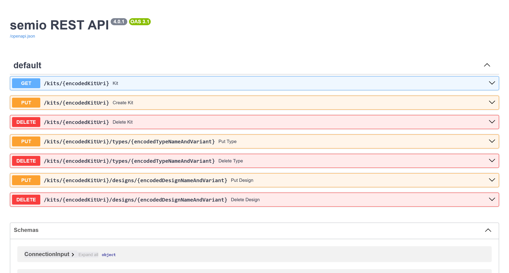
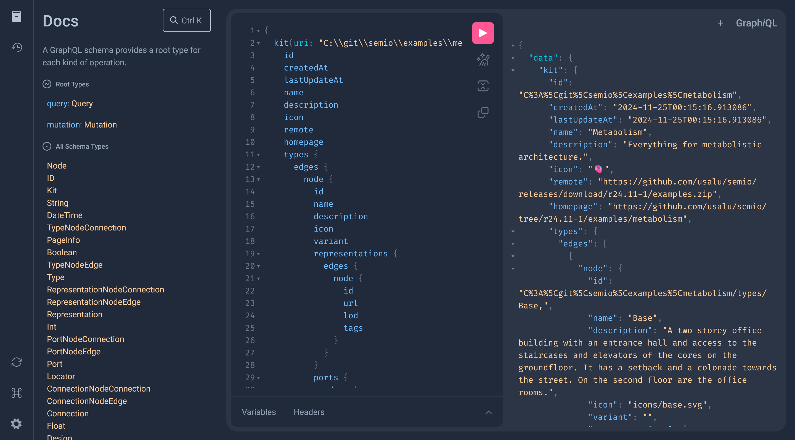

<p align="center">
    <a href="https://docs.semio-tech.com">
      <picture>
          <source media="(prefers-color-scheme: dark)" srcset="semio/assets/logo/logo_dark.svg">
          <source media="(prefers-color-scheme: light)" srcset="semio/assets/logo/logo.svg">
          
      </picture>
    </a>
    <br/>
    <a href="https://play.semio-tech.com"></a>
    <a href="https://docs.semio-tech.com"></a>
    <a href="https://js.semio-tech.com"></a>
    <a href="https://discord.gg/m6nnf6pQRc"></a>
    <br/>
     <a href="https://github.com/usalu/semio"></a>
    <a href="https://doi.org/10.5281/zenodo.8419156"></a>
    <a href="https://choosealicense.com/licenses/agpl-3.0/"></a>
    <br/>
    <a href="https://eg-ice-25.semio-tech.com"></a>
    <a href="https://doi.org/10.17868/strath.00093288"></a>
    <a href="https://eg-ice-23.semio-tech.com"></a>
    <br/>
    <a href="https://play.semio-tech.com"></a>
    <a href="https://www.grasshopper3d.com/"></a>
    <a href="https://www.microsoft.com/windows/windows-11"></a>
    <a href="https://apple.com/macos"></a>
    <br/>
    <a href="https://www.typescriptlang.org/"></a>
    <a href="https://www.python.org/"></a>
    <a href="https://learn.microsoft.com/en-us/dotnet/csharp/"></a>
    <br/>
    <br/>
    <i>🧩 Design-Information-Modeling for Kit-of-Parts 🏘 </i>
</p>
<br/>

You want to 🧩 the next 🏘🏛🏢🏭🏫🏨⛪🕌 with 🤖? But 📐🔢🗣👥🖱⌨ takes all your ⌚? Then try to 🧠 the 🧬 and let semio 💉🖥✒🖨🪄🚀

# 👋 Hello contributor

> [!NOTE]
> Are you a user or new to semio? Then you might want to first check out our [docs](https://docs.semio-tech.com) 📖

Glad to see you!

Let me walk you through 🚶

# 📑 Overview

1. [🛍 Products](#%EF%B8%8F-products-)
   - [✏ sketchpad](#%EF%B8%8F-sketchpad-)
   - [👥 studio](#-studio-)
   - [☁ cloud](#%EF%B8%8F-cloud-)
   - [🤖 assistant](#-assistant-)
   - [VS Code Extension](#vs-code-extension-)
   - [🦗 semio.gh](#-semiogh-)
   - [🦏 semio.3dm](#-semio3dm-)
   - [🐝 semio.wasp](#-semiowasp-)
   - [🦌 semio.monoceros](#-semiomonoceros-)
   - [🐞 semio.ladybug](#-semioladybug-)
1. [📄 Specs](#-specs-)
   - [📦 Kit](#-kit-)
   - [🏘 Design](#%EF%B8%8F-design-)
   - [🏠 Type](#-type-)
   - [🔗 Connection](#-connection-)
   - [⭕ Piece](#-piece-)
   - [⚓ Connector](#-port-)
   - [💾 Model](#-model-)
   - [🏷 Attribute](#%EF%B8%8F-attribute-)
   - [🏷 Tag](#%EF%B8%8F-tag-)
   - [◳ Plane](#-plane-)
   - [🔗 Url](#-url-)
   - [🔢 Quality](#-quality-)
   - [📊 Benchmark](#-benchmark-)
   - [🏷 Concept](#%EF%B8%8F-concept-)
   - [👤 Author](#-author-)
   - [📋 Layer](#-layer-)
   - [👥 Group](#-group-)
   - [⚙ Prop](#-prop-)
   - [📈 Stat](#-stat-)
1. [🦑 Repo](#-repo-)
   - [⚖ Principles](#-principles-)
   - [🔀 Git](#-git-)
     - [🦑 GitKraken](#-gitkraken-)
     - [💬 Discord](#-discord-)
     - [📢 Release](#-release-)
     - [🏷 Tag](#%EF%B8%8F-tag-)
     - [🌿 Branch](#-branch-)
     - [🗃 Commit](#%EF%B8%8F-commit-)
1. [🧑‍💻 Development](#-development-)
   - [🔌 Connector Numbers](#-port-numbers-)
   - [📒 Tickets and reports](#-tickets-and-reports)
   - [🪄 AI](#-ai-)
     - [🛠 Uses-Cases](#-uses-cases-)
       - [⚖ Decision Making](#-decision-making-)
       - [🔁 Refactoring](#-refactoring-)
       - [🐛 Bug Fixes](#-bug-fixes-)
     - [⌨ Tools](#-tools-)
       - [🌐 Web-Chat](#-web-chat-)
         - [❄ ChatGPT](#-chatgpt-)
         - [🌟 Gemini](#-gemini-)
         - [AI studio](#-ai-studio-)
       - [💻 Editor](#-editor-)
         - [✈ Copilot](#-copilot-)
         - [🖱 Cursor](#-cursor-)
         - [🌊 Windsurf](#-windsurf-)
       - [⌨ CLI](#-cli-)
         - [⌨ Claude Code](#-claude-code-)
         - [🧾 Codex](#-codex-)
       - [☁ Cloud](#-cloud-)
         - [🦑 Jules](#-jules-)
       - [🔍 Agents](#-agents-)
         - [↕ Reorderer](#-reorderer-)
         - [🔁 Formatter](#-formatter-)
       - [🤖 Models](#-models-)
         - [Claude Opus 4.5](#-opus-45-)
         - [GPT-5.2 Codex](#-gpt-52-codex-)
         - [GPT-5.3 Codex](#-gpt-53-codex-)
     - [🔄 CI/CD](#-cicd-)
1. [♻ Ecosystems](#%EF%B8%8F-ecosystems-)
   - [🟨 JavaScript](#-javascript-)
   - [🟪 .NET](#-net-)
   - [🐍 Python](#-python-)
1. [📦 Bundles](#-bundles-)
   - [🟨 semio/js](#-semiojs-)
   - [✏ semio/desktop](#-semiodesktop-)
   - [📚 semio/docs](#-semiodocs-)
   - [🎛 semio/play](#%EF%B8%8F-semioplay-)
   - [🤖 semio/assistant](#-semioassistant-)
   - [⚙ semio/engine](#-semioengine-)
   - [🟪 semio/net](#-semionet-)
   - [🦗 semio/grasshopper](#-semiograsshopper-)
     - [🪢 Scripting](#-scripting-)
   - [🛍 semio/assets](#%EF%B8%8F-semioassets-)
     - [🏷 Badges](#%EF%B8%8F-badges-)
     - [📄 Fonts](#-fonts-)
     - [👁 Icons](#%EF%B8%8F-icons-)
1. [🏘 Examples](#%EF%B8%8F-examples-)
   - [🚀 Starter](#-starter-)
   - [👋 Hello semio](#-hello-semio-)
   - [🌈 Geometry](#-geometry-)
   - [🫀 Metabolism](#-metabolism-)
1. [💯 Brand](#-brand-)
   - [✍ Concept](#%EF%B8%8F-concept-)
     - [✅ Do](#-do-)
     - [❌ Dont](#-dont-)
   - [🌈 Colors](#-colors-)
     - [🥇 Primary](#-primary-)
     - [🥈 Secondary](#-secondary-)
     - [🥉 Tertiary](#-tertiary-)
     - [⚫ Dark](#-dark-)
     - [⚪ Light](#-light-)
     - [🩶 Gray](#-gray-)
   - [📄 Typography](#-typography-)
     - [🔡 Typesetting](#-typesetting-)
   - [👀 Visual elements](#-visual-elements-)
1. [⚖ License](#-license-)
1. [🔒Security](#-security-)
1. [✨ Contributors](#-contributors-)
1. [📊 Stats](#-stats-)

# 🛍 Products [↑](#-overview)

> Do you wonder how semio is interopable? The reason are shared [specification](#-specs-), [ecosystems](#%EF%B8%8F-ecosystems-) and [bundles](#-bundles-) 🪢

Work-in-progress artifacts stay bundled with the active ticket workspace so teams can trace temporary data without hunting global temp locations.
The engine offers a dev/debug startup mode that waits for a debugger to attach before it runs.
The engine can also run as a pure stdio MCP server for tool integrations.

## ✏ sketchpad [↑](#%EF%B8%8F-products-)

[sketchpad](#%EF%B8%8F-sketchpad-) is a simple-to-use, accessible and browser-based user interface for semio🖱

It is the digital pencil for sketching plans and digital scalpel for building models in semio ✍

Sketchpad uses semantic borders to communicate interactive element edges and window boundaries. Windows are separated from the canvas edge and from each other by a single spacing unit, and each window is outlined by a continuous border.

Each window has a consistent set of icon actions (open in new window, maximize/minimize, close) that stays in the same position across window kinds.

Sketchpad uses background levels to visually distinguish the base canvas from windows, panels, and transient UI surfaces.

Sketchpad is a multi-window workspace: each app defines which window kinds it supports and window layouts persist so users can restore their preferred arrangement.

In a multi-window workspace, exactly one window is active and its surface uses the active background color; table views follow the active window surface background.

Hover and selection cues stay consistent across Home, Kit, Design, Type, Quality, Docs, and Feedback so focus follows your pointer and selection across the workspace.


## 👥 studio [↑](#%EF%B8%8F-products-)

A studio is a synchronous collaboriation environment for teams to work together in semio 🤝

<!--  -->

## ☁ cloud [↑](#%EF%B8%8F-products-)

Use any file-hosting platform as an asynchronous Common-Data-Environment 📁


## 🤖 assistant [↑](#%EF%B8%8F-products-)

The assistant helps you on every step in the design process with semio ✍


## VS Code Extension [↑](#%EF%B8%8F-products-)

The VS Code extension keeps tickets close to daily work with inline close or reopen actions that act on the selected ticket, commit visibility, and concise hover descriptions for quick scanning.
Automation tooling rejects invalid arguments and non-file paths so MCP-driven workflows surface mistakes immediately.
Ticket creation MUST require a Goal ID and interaction starts ALWAYS request a description, while file lists can be added later when needed.
Ticket interaction and finish actions attach git-derived file lists and line totals scoped to the ticket files so progress and impact are visible from the ticket view.
Code hygiene diagnostics ignore comment markers inside string literals so snippets and URLs stay clean of false comment warnings.
Code hygiene diagnostics flag orphan definitions outside named sections so the file structure stays consistent.
The command browser mirrors the repo command and subcommand hierarchy so discovery follows the same structure as the CLI.
Problem list entries open in dedicated editor tabs so edits are immediately saveable.
Contributor views merge ticket activity and file header credits into a per-person breakdown with line totals, grouped tickets, commits, bundles, and file navigation for quick context.
The built-in Explorer adds a Sections panel that lists the current file structure (including JSON object keys), lets you jump to a section on click, supports F2 rename, and provides inline create-child, rename, delete, and drag-move actions.
The `semio-repo: Navigate` command (`semio.navigate`) accepts any `semiorepo://` URI or plain artifact ID and opens the corresponding resource: files open in the editor, folders and bundles reveal in the Explorer, tickets open their `ticket.md`, goals open their `goal.json`, contributors and commits open GitHub in the browser, and sections and definitions jump to the correct line.
The `semio-repo: Navigate to...` command (`semio.navigateTo`) opens a quick pick listing all tree nodes from the repo.
Clicking any tree item in the Monorepo view navigates to its resource, including goals which open their `goal.json`.
A URI handler registered for the `semiorepo` scheme means clicking `semiorepo://` links from terminals, markdown previews, or external applications triggers navigation within VS Code.

## 🦗 [semio.gh](https://docs.semio-tech.com/manuals/grasshopper) [↑](#%EF%B8%8F-products-)

A batteries-included [Grasshopper](https://www.grasshopper3d.com) plugin for semio ⚡


## 🦏 semio.3dm [↑](#%EF%B8%8F-products-)

A Grasshopper-based integration of [Rhino](https://www.rhino3d.com) and semio 🔀

## 🐝 semio.wasp [↑](#%EF%B8%8F-products-)

A Grasshopper-based integration of [Wasp](https://www.food4rhino.com/en/app/wasp) and semio 🔀


## 🦌 semio.monoceros [↑](#%EF%B8%8F-products-)

A Grasshopper-based integration of [Monoceros](https://monoceros.sub.digital) and semio 🔀


## 🐞 semio.ladybug [↑](#%EF%B8%8F-products-)

A Grasshopper-based integration of [Ladybug](https://www.ladybug.tools) and semio 🔀

# 📄 Specs [↑](#-overview)

## 📦 Kit [↑](#-specs-)

A [`kit`](#-kit-) is a collection of [`types`](#-type-), [`designs`](#%EF%B8%8F-design-), [`authors`](#-author-), [`qualities`](#-quality-), [`attributes`](#%EF%B8%8F-attribute-), and [`concepts`](#%EF%B8%8F-concept-) 📦

A [`kit`](#-kit-) is either _static_ (a special `.zip` file) or _dynamic_ (bound to a runtime) 📦

A _static_ [`kit`](#-kit-) contains a reserved `.semio` folder that contains a `kit.db` sqlite file 💾

The SQL-schema of `kit.db` is found in [`./sqlite/schema.sql`](./sqlite/schema.sql) 📄

For Inter-Process-Communication (IPC) the JSON-schema in [`./jsonschema/kit.json`](./jsonschema/kit.json) is used 📄

## 🏘 Design [↑](#-specs-)

A [`design`](#%EF%B8%8F-design-) is an undirected graph of [`pieces`](#-piece-) (nodes) and [`connections`](#-connection-) (edges) with organizational [`layers`](#-layer-), [`groups`](#-group-), [`stats`](#-stat-), [`attributes`](#%EF%B8%8F-attribute-), and [`concepts`](#%EF%B8%8F-concept-) 📐

A [`design`](#-design-) is _proto_ (a _protodesign_) when it has no _parent_.

_Children_ of a _parent_ are \_subdesigns.

A _flat_ [`design`](#%EF%B8%8F-design-) has no [`connections`](#-connection-) and all [`pieces`](#-piece-) are _fixed_ ◳

The [`pieces`](#-piece-) are _placed_ _hierarchically_ ([breadth-first](https://en.wikipedia.org/wiki/Breadth-first_search)) for every _component_ 🌿

Additional [`connections`](#-connection-) which where not used in the _placement_ can be used to validate the computed [`planes`](#-plane-) 🛂

## 🏠 Type [↑](#-specs-)

A [`type`](#-type-) is a reusable component with different [`models`](#-model-), [`connectors`](#-port-), [`attributes`](#%EF%B8%8F-attribute-), [`concepts`](#%EF%B8%8F-concept-), and [`authors`](#-author-) 🧱

A [`type`](#-type-) is _proto_ (a _prototype_) when it has no _parent_.

_Children_ of a _parent_ are \_subtypes.

A [`type`](#-type-) can be **virtual** (intermediate type requiring other virtual types to form a physical type), **scalable**, and **mirrorable** with **stock** quantity, **unit**, and optional **location** 📍

## 🔗 Connection [↑](#-specs-)

A [`connection`](#-connection-) is a 3D-Link between two [`pieces`](#-piece-) with the _translation_ parameters **gap** (offset in y-direction), **shift** (offset in x-direction) and **rise** (offset in z-direction), and the _rotation_ parameters **rotation** (rotation around y-axis), **turn** (rotation around z-axis) and **tilt** (rotation around x-axis) 🪢

The _translation_ is applied first, then the _rotation_ 🥈

The two [`pieces`](#-piece-) are called **_connected_** and **_connecting_** but there is no difference between them 🔄

The _direction_ of a [`connection`](#-connection-) goes from the lower _hierarchy_ to the higher _hierarchy_ of the [`pieces`](#-piece-) ➡

A [`connection`](#-connection-) can have [`attributes`](#%EF%B8%8F-attribute-) and diagram positioning with **x** and **y** offsets 📍

## ⭕ Piece [↑](#-specs-)

A [`piece`](#-piece-) is an instance of either a [`type`](#-type-) or a [`design`](#%EF%B8%8F-design-) with **id**, optional **description**, optional **plane**, **center** position, **scale**, optional **mirror plane**, **hidden** and **locked** states, **color**, and [`attributes`](#%EF%B8%8F-attribute-) 📐

A [`piece`](#-piece-) is either _fixed_ (with a [`plane`](#-plane-)) or _linked_ (with a [`connection`](#-connection-)) 📐

A group of _connected_ [`pieces`](#-piece-) is called a _component_ 🌿

The _hierarchy_ of a [`piece`](#-piece-) is the length of the shortest path to the next _fixed_ [`piece`](#-piece-) 👣

## ⚓ Connector [↑](#-specs-)

A [`connector`](#-port-) is a conceptual connection **point** with an outwards **direction**, **id**, optional **description**, and **t** value for diagram ring positioning 🤝

A [`connector`](#-port-) can be marked as **mandatory** in which case it is required to be connected to a [`piece`](#-piece-) 💯

A [`connector`](#-port-) can have a connector **port** and a list of **compatible ports** for explicit compatibility control 👨‍👩‍👧‍👦

No **port** means the _default_ port and no **compatible ports** means the connector is compatible with all other connectors 🔑

It is enough for one [`connector`](#-port-) to be compatible with another [`connector`](#-port-) to be compatible with each other ↔

A [`connector`](#-port-) can have [`props`](#-prop-) that define measurable characteristics and [`attributes`](#%EF%B8%8F-attribute-) for additional metadata 📏

## 💾 Model [↑](#-specs-)

A [`model`](#-model-) is a **[`tagged`](#%EF%B8%8F-tag-)** **[`url`](#-url-)** to a resource with an optional **description** 📄

No **[`tags`](#%EF%B8%8F-tag-)** means the _default_ model 🔑

The similarity of [`models`](#-model-) is determined by the [jaccard index](https://en.wikipedia.org/wiki/Jaccard_index) of their **[`tags`](#%EF%B8%8F-tag-)** 🔄

## 🏷 Attribute [↑](#-specs-)

A [`attribute`](#%EF%B8%8F-attribute-) is metadata with a unique **name**, an optional **value**, an optional **unit** and an optional **definition** ([`url`](#-url-) or text) 🔤

The **name** is[kebab-cased](https://en.wikipedia.org/wiki/Kebab_case) and with `.`-separated string similar to [toml keys](https://toml.io/en/v1.0.0#keys) 🔑

No **value** is equivalent to the boolean _true_ where the **name** is the category of the attribute 🔑

The **unit** is a [unit identifier](https://en.wikipedia.org/wiki/Unit_of_measurement) 🔢

- `mm` for millimeter, `cm` for centimeter, `dm` for decimeter, `m` for meter, `km` for kilometer
- `m²` for square meter, `m³` for cubic meter, `m⁴` for quartic meter
- `°` for degree, `rad` for radian
- `N` for newton, `kN` for kilonewton, `MN` for meganewton
- `°C` for degree Celsius, `°F` for degree Fahrenheit
- `W` for watt, `kW` for kilowatt, `MW` for megawatt, `GW` for gigawatt
- `Wh` for watt-hour, `kWh` for kilowatt-hour, `MWh` for megawatt-hour, `GWh` for gigawatt-hour
- `J` for joule, `kJ` for kilojoule, `kcal` for kilocalorie
- `kWh/m²a` for kilowatt-hour per square meter per year
- `m/s` for meter per second, `m²/s` for square meter per second, `m³/s` for cubic meter per second
- `Pa` for pascal, `kPa` for kilopascal, `MPa` for megapascal
- …

A list of [attributes](#%EF%B8%8F-attribute-) is semantically equivalent to nested dictionaries where the key is the **name** and the value is the **value** ↔

## 🏷 Tag [↑](#-specs-)

A [`tag`](#%EF%B8%8F-tag-) is a [kebab-cased](https://en.wikipedia.org/wiki/Kebab_case) **name** 🔤

## ◳ Plane [↑](#-specs-)

A [`plane`](#-plane-) is a location (**origin**) and orientation (**x-axis**, **y-axis** and derived z-axis) in 3D space ✈

The coordinate system is left-handed where the thumb points up into the direction of the z-axis, the index-finger forwards into the direction of the y-axis and the middle-finger points to the right into the direction of the x-axis 👈

## 🔗 Url [↑](#-specs-)

A [`url`](#-url-) is either _relative_ (to the root of the `.zip` file) or _remote_ (http, https, ftp, …) string🌐

A _relative_ [`url`](#-url-) is a `/`-normalized path to a file in the `.zip` file and is not prefixed with with `.`, `./`, `/`, …

## 🔢 Quality [↑](#-specs-)

A [`quality`](#-quality-) is a measurement definition with a **key**, **name**, **description**, **kind** (General, Design, Type, Piece, Connection, Connector), **unit information** (SI and Imperial), **range constraints** (min/max with exclusion flags), **default value**, and optional **formula** 📏

A [`quality`](#-quality-) can be **scalable** (adjusts with piece scaling) and have multiple **benchmarks** for performance evaluation 🎯

The **kind** determines which entities the quality can be applied to using a bitwise enum system 🔢

## 📊 Benchmark [↑](#-specs-)

A [`benchmark`](#-benchmark-) is a performance standard within a [`quality`](#-quality-) with a **name**, optional **icon**, and **range** (min/max with exclusion flags) 🏆

Benchmarks provide reference points for evaluating quality measurements against industry or design standards 📈

## 🏷 Concept [↑](#-specs-)

A [`concept`](#%EF%B8%8F-concept-) is a **name** and **order** pair that provides semantic grouping for [`kits`](#-kit-), [`types`](#-type-), or [`designs`](#%EF%B8%8F-design-) 🧠

Concepts enable hierarchical organization and categorization of design elements beyond simple naming 📂

## 👤 Author [↑](#-specs-)

An [`author`](#-author-) has a **name** and **email** and can be associated with [`kits`](#-kit-), [`types`](#-type-), or [`designs`](#%EF%B8%8F-design-) with a **rank** indicating contribution level 👨‍💻

Authors provide attribution and contact information for design ownership and collaboration 🤝

## 📋 Layer [↑](#-specs-)

A [`layer`](#-layer-) is an organizational grouping within a [`design`](#%EF%B8%8F-design-) with a **name**, optional **description**, and **color** for visual organization 🎨

Layers provide a way to group and manage pieces logically within complex designs 📑

## 👥 Group [↑](#-specs-)

A [`group`](#-group-) is a collection of [`pieces`](#-piece-) within a [`design`](#%EF%B8%8F-design-) with optional **name**, **description**, **color**, and **attributes** 👥

Groups enable semantic clustering of pieces that belong together functionally or conceptually 🔗

## ⚙ Prop [↑](#-specs-)

A [`prop`](#-prop-) is a **key-value** pair on a [`connector`](#-port-) that references a [`quality`](#-quality-) with a specific **value** and optional **unit** 🔧

Props define measurable characteristics of connectors using the quality system for standardized measurement 📐

## 📈 Stat [↑](#-specs-)

A [`stat`](#-stat-) is a statistical measurement on a [`design`](#%EF%B8%8F-design-) that references a [`quality`](#-quality-) with **range** (min/max) and optional **unit** 📊

Stats provide computed or measured performance data for entire designs using the quality framework 📈

# 🦑 [Repo](https://github.com/usalu/semio) [↑](#-overview)

This git repo has <strong>everything</strong> that exists in the open semio ecosystem 🤯

## ⚖ Principles [↑](#-repo-)

Let's start with the rules of thumbs that this codebase was built with 🫰

<details>
<summary><strong>💾 If something can be written in a single file, then it probably should ✅</strong></summary>

I know, the urge to <strong>tidy</strong> up or <strong>separate</strong> things is big 🗃

But try to withstand it 🫥

Out of my experience, it makes development slower, not faster 🐌

A single file is easier for humans and computers to understand 💡

You will be surprised

- by the awesome [fill-in-the-middle suggestions](#-cursor-) of your copilot 🤖
- by the hassle-free [context selection](#-browser-) for your ai agent 🖱
- by the smooth refactor experience by just going top-to-bottom ⬇
- by the beautiful diff for your next code review 🔍
- by the clean git-history when you try to find a certain change 🔁

</details>

<details>
<summary><strong>🙃 Write and read code upside down ✅</strong></summary>

Whenever something is referenced it should be above in the source code ⬆

This means that all the building blocks (functions, classes, components, …) are first defined and then used below ⬇

If you have a cyclic depedency (really?!) then put the object with lower complexity first 🥇

This means that when you start with unknown code, it is probably best to start on the bottom and go upwards 🖱

Why? LLMs, reflection, … , work best left-to-write 🤖

[But Fill-in-the-Middle training is for free!?](https://arxiv.org/abs/2207.14255)

Yeah, if you consider only FiM for code, then yes 🆗

But we want it all!

And is really so hard to start reading a from the bottom?

</details>

<details>
<summary><strong>📑 If a class, function, component, … is only used once, then don't create it ❌</strong></summary>

Probably, you learned to group code by classes, functions, components, … even if those definitions are only used once 🥇

It hides the actual complexity and makes it harder to navigate the code 🔍

</details>

<details>
<summary><strong>📺 Inline everything that bearly fits onto the screen ✅</strong></summary>

Smaller code, less tokens and easier diffs 🔍

Your [ai](#-ai-) bill will be lower and the completions will resolve faster 🚀

If you are not sure what the code does, you can ask [ai](#-ai-) 💬

</details>

<details>
<summary><strong>🗣 Don't use comments or if you must, only tag code at the end of the line ❌</strong></summary>

Smaller code, less tokens and easier diffs 🔍

Your [ai](#-ai-) bill will be lower and the completions will resolve faster 🚀

If you are not sure what the code does, you can ask [ai](#-ai-) 💬

</details>

<details>
<summary><strong>📑 Use regions to structure your code ✅</strong></summary>

Because you are not using classes, functions, components, … and you are inlining everything, your code will become long 📃

To organize your code, you can use nested regions 📂

In general, our files follow this structure:

1. Header
2. TODOs
3. Imports
4. Constants
5. CODE

</details>

<details>
<summary><strong>📁 If a folder doesn't make your life dramatically easier, don't create it ❌</strong></summary>

We all know this `./src/**` folder that has made it into a lot of starters 🚀

Other than feeling cool about using hacky abbreviations, does it really help you to understand the bundle faster and work more efficient on it?

If your bundle contains hundreds of config file and other bundle folders at the root, maybe 🤔

But most likely not ❌

</details>

<details>
<summary><strong>📦 Parts that belong together should be close in the source code  ✅</strong></summary>

The default code organization is to group kind of structurally similar parts together 📂

All models next to each other, all controllers next to each other, all errors next to each other, …

While this pattern supports structural refactoring, it makes plain extensions harder because you have to search through all the files 🔍

Most changes are plain extensions and not structural refactors 🔄

Further it has the advantage that every LLM-agent only has to predict one big block of code instead of plenty of small ones 🤖

That's why frameworks like [React](https://react.dev/learn/thinking-in-react) exist or vendoring such as with [shadcn](https://ui.shadcn.com/docs) is more flexible than dependcenies such as with [bootstrap](https://getbootstrap.com/)

Cutting components vertically (a bit of logic with a bit of UI) instead of horizontally (all logic, all ui) requires more effort but enhances reusability 🔮

</details>

<details>
<summary><strong>📄 If multiple people work longterm on the same part, then one file for each part should be created ✅</strong></summary>

Trust me, it will make collaboration much easier 🔀

</details>

<details>
<summary><strong>🔮 If you don't need an port because something is not likely to be extended soon, don't create it ❌</strong></summary>

The main question is the port productive or not?

The pay-off of abstraction happens in the future 🛣

Every extension profits from a clean port 🚀

Most things are not extended 🪨

If you change your architecture, just design proper ports for something concrete not something potential and reactor it ✍

</details>

<details>
<summary><strong>🤏 Repeating code is ok if it the repeated code is close in the source code ✅</strong></summary>

We are past the time where we copy code for no reason 📃

Actually repeated code can improve the attribute of your copilots suggestion 🤯

The main question is how can your application grow?

If a change requires exponentially more duplication then you'll probably have to fix it 🛠

If not, then you are probably good 👌

</details>

<details>
<summary><strong>🏷 Never use `type` for naming enums, ports, or types. Always use `kind` instead ✅</strong></summary>

To avoid confusion with the native `type` concept in Semio, always use `kind` for naming enums, ports, or types that represent categories or classifications 🏷

Examples: `ArtifactType` → `ArtifactKind`, `WindowType` → `WindowKind`, etc. 🔄

</details>

<details>
<summary><strong>🤨 Wait, no high-level advice and only plain numbers, files, folders or close line of codes?</strong></summary>

In our understanding, policy-of-thumbs are most useful when they are concrete 🔨

Besides that we are sure you know about <strong>KISS</strong> (Keep-It-Simple-Stupid), <strong>DRY</strong> (Dont-Repeat-Yourself) vs <strong>WET</strong> (Write-Every-Thing-Twice)/<strong>RUG</strong> (Repeat-Until-Good), <strong>YAGNI</strong> (You-Aren't-Gonna-Need-It), <strong>SoC</strong> (Separation-of-Concerns), <strong>Avoid Premature Optimization</strong>, <strong>Law of Demeter</strong>, <strong>LCHC</strong> (Low-Coupling-High-Cohesion), <strong>SOLID</strong> (<strong>SR</strong> (Single Responsibility), <strong>OC</strong> (Open/Closed), <strong>LS</strong> (Liskov's Substitution), <strong>IS</strong> (Port Segregation), <strong>DI</strong> (Dependency Inversion)), …

But as always, the devil is in the details 😈

Even if 95% of the codebase follows those principles, there are good reasons for the other 5% ⚖

</details>

**🚩 Don't worry, you'll figure out the possibilities and make the right choice for the specific problems ✅**

## 🔀 [Git](https://github.com/usalu/semio.git) [↑](#-repo-)

### 🦑 GitKraken [↑](#-git-)

> [!NOTE]  
> It is free for open-source bundles like this one ❤

We use [GitKraken Desktop](https://www.gitkraken.com/git-client) as our git client 🖱

It is the only nice chronological graphical overview for **all** branches at the same time that we found 🔍

### 💬 Discord [↑](#-git-)

Most git events are synchronized with our [repo channel](https://discord.com/channels/1338232508264747130/1339164626658525246) 💬

It is perfect to find the latest activities and the history 🔍

### 📢 Release [↑](#-gitstyle-)

Every release contains a set of matching [specs](#-specs-), [bundles](#-bundles-), [examples](#-examples-) and [docs](#-docs-) 📦

The release notes follow this format:

```
SYMBOL TITLE

COMPONENT
- SYMBOL SUMMARY [CONTRIBUTOR]
…
```

**Title symbols:**

- 🏗 Foundational work
- 🛠 Heavy work
- 🪛 Minor work
- 🐛 Major Bug fix

**Description symbols:**

- 🌱 Started [not yet ready]
- ➕ Added [ready]
- ⬆ Updated
- 🔄 Renamed
- 🔁 Refactored
- 🐛 Bug fix

Before every [release](#-release-) the [repo](#-repo-) is archived 📦

### 🏷 Tag [↑](#-gitstyle-)

We have two different types of tags:

- `rYY.MM-V` for [releases](#-release-) (e.g `r21.06-1`,`r23.07-2`,`r24.12-1`, `r25.07-1`, …)
- `COMPONENT-vMAJOR.MINOR.PATCH` for [bundles](#-bundles-) which follow the [semver](https://semver.org/) versioning scheme (e.g [`engine-v4.0.2`](#-semioengine-), [`sketchpad-v1.0.0`](#-semiodesktop-), [`grasshopper-v5.4.0-beta`](#-semiograsshopper-), …)

### 🌿 Branch [↑](#-gitstyle-)

The `main` branch is compressed (squashed history) and acts as the canonical integration branch 🗜

If a release receives updates after `main` already progressed, create a parallel `release/rYY.MM-V` branch for that release and keep it compressed as well 🧵

Every [contributor](#-contributor-) has their own `FIRSTNAME` general-purpose development branch 🛠

In [GitKraken](#-gitkraken-) you will quickly find the latest development branch 👀

Other branches are created for [bundles](#-bundles-), [specific features](https://github.com/usalu/semio/labels/enhancement) or [bug fixes](https://github.com/usalu/semio/labels/bug) 🐛

Usually one person works on one feature at a time and hence the `-NAME` suffix 📛

### 🗃 Commit [↑](#-gitstyle-)

Commit messages follow this format:

```
MAIN-TASK-SYMBOL SUMMARY WORK-SYMBOL
```

The first symbol encodes the main task of the commit and the last symbol encodes the amount of work (`🪛` < `🔨` < `🛠` < `🏗`) 🧰

<details>
<summary><strong>📦 Commit as much as you like ✅</strong></summary>

Are you worried about committing all those binary application files (`.zip`, `.gh`, `.blend`, `.glb`, `.3dm`, …) or the intermediate versions between your [ai](#ai) edits?

Well, normally you should be 💾

But as we archive and squash all commits on every [release](#-release-) nothing is lost or polluted 💯

</details>

<details>
<summary><strong>⌛ Push around once an hour ✅</strong></summary>

Pushing regularly keeps you extra safe from losing your work 🛟

There are a few services (like [Discord](https://discord.com/channels/1338232508264747130/1339164626658525246)) that are automatically updating to what happens in the [repo](#-repo-) 🔄

To keep our inbox notifications low, we try to push not more than once an hour ⬆

</details>

# 🧑‍💻 Development [↑](#-overview)

Different [ecosystems](#-ecosystems-) need different tools 🧰

## 🐳 Devcontainer (Recommended) [↑](#-development)

The recommended way to develop is using the devcontainer which provides a consistent cross-platform environment.

**Prerequisites:**

- [Docker Desktop](https://www.docker.com/products/docker-desktop/) or compatible container runtime
- [VS Code](https://code.visualstudio.com/) with [Dev Containers extension](https://marketplace.visualstudio.com/items?itemName=ms-vscode-remote.remote-containers)

**Getting Started:**

1. Clone the repository
2. Open in VS Code
3. Click "Reopen in Container" when prompted (or run "Dev Containers: Reopen in Container" from command palette)
4. Wait for container build and setup to complete

The devcontainer includes:

- Node.js 22.x, Go 1.24, Python 3.13, .NET SDK 7.0/8.0, Rust
- All required VS Code extensions
- Pre-configured development environment
- Port forwarding for all dev servers (3000, 4000, 4321, 5678, 6006, 2507)

## 🪟 Windows Setup (Legacy) [↑](#-development)

For a complete setup you need:

- Windows 10 or 11
- [Visual Studio Code](https://code.visualstudio.com/sha/download?build=stable&os=win32-x64-user)
- [Visual Studio 2022 Community](https://visualstudio.microsoft.com/de/thank-you-downloading-visual-studio/?sku=Community&channel=Release&version=VS2022)
- [Rhino 8](https://www.rhino3d.com/download/rhino-for-windows/8/latest/)
- Python 3.14
- [uv](https://docs.astral.sh/uv/)
- [Node](https://nodejs.org/dist/v22.14.0/node-v22.14.0-x64.msi)

If you do not have Python installed, I recommend to install it over the [Microsoft Store](<(https://www.microsoft.com/store/productId/9NCVDN91XZQP?ocid=pdpshare)>) 🏪

Afterwards you can install uv with this command:

```bash
irm https://astral.sh/uv/install.ps1 | iex
```

Then you can run `semio-repo/cli/cli preflight build` from the root to build all packages, or run `tsx ./build.ts` in the Grasshopper directory and add your full path `LOCAL_PATH\net\Semio.Grasshopper\Debug\net48` to your GrasshopperDeveloperSettings ⚙

## 🎫 Tickets [↑](#-development)

Contributor workflows use tickets to track each task across interactions.
A ticket interaction records a prompt, author, and is bounded by `{started, finished}` timestamps.
Ticket workflows record file touch lists and per-file line diffs so work is auditable and easy to continue.
Each ticket workspace keeps a single `ticket.md` with todos, changes, log, and summary sections so all task context stays in one place, and an `important.md` file for compulsory actions that must be completed before the ticket can be finished.

## 🧰 Violations [↑](#-development)

Contributor workflows include an automated code-quality report that highlights inline and multi-line comments (including JSDoc blocks), missing license headers, malformed region blocks, and empty regions before changes are shared.
Comment scanning works uniformly across all supported languages (TypeScript, Go, Python, C#, Shell, Rust) through a single generic implementation in `BaseLanguage.ScanComments`. Each language declares its own string literal flavors (template literals for JS/TS, raw backtick strings for Go, triple-quoted strings for Python, verbatim `@""` strings for C#) so the scanner correctly ignores comment markers inside string contexts. Each language also declares its own skip directives (e.g. `eslint-`/`@ts-` for TypeScript, `nolint` for Go, `noqa`/`type: ignore` for Python, `pragma` for C#) which are excluded from comment violations alongside the built-in `TODO` and `semio-ignore-` directives.
It also enforces module boundaries and domain-neutral terminology for shared UI building blocks.
Each reported problem includes a short reason and solution so contributors can resolve violations quickly.

The `fix` command applies autofixes for all autofixable violation kinds: it replaces wrong file header artifact IDs with the correct emoji-prefixed path (e.g. `💻 semio/js/src/index.ts`), removes empty sections (including one surrounding blank line, preferring the preceding one), resolves missing section end names by walking backward through nested sections to find the matching start, corrects mismatched section end names, removes contiguous inline comment blocks (including intervening blank lines), and removes block and JSDoc comments.
After removing lines, a post-processing step collapses consecutive blank lines so the output stays clean.
Non-autofixable violations (missing header regions, unnamed region starts, orphan definitions) are reported but left for manual resolution.

## 🔌 Port Numbers [↑](#-development-)

Overview of all connectors used during development and in final packages:

| Service    | Port   | Command / Package      | Notes                                                                           |
| ---------- | ------ | ---------------------- | ------------------------------------------------------------------------------- |
| Sketchpad  | `3000` | `dev js js sketchpad`  | Vite dev server for Sketchpad                                                   |
| Play       | `4000` | `dev play`             | Vite dev server for Play                                                        |
| Docs       | `4321` | `dev docs`             | Astro dev server (default)                                                      |
| Storybook  | `6006` | `dev js js storybook`  | Storybook dev server (default)                                                  |
| Playwright | `5173` | `npm test` (js)        | Test server for Playwright E2E tests                                            |
| Engine     | `YYMM` | `semio/engine` package | Connector derived from release: `rYY.MM-V` → `YYMM` (e.g., `r25.07-1` → `2507`) |

#### Running Tasks

Press `Ctrl+Shift+P` (or `Cmd+Shift+P` on macOS) → "Tasks: Run Task" and select from:

**Root-level commands:**

- `build` - Build all packages
- `test` - Run all tests
- `fix` - Run auto-fixes/formatters
- `analyze` - Run non-mutating checks
- `preflight` - Run all preflight checks (default build task)
- `update` - Update dependencies
- `publish:test` - Publish to test servers
- `publish` - Publish packages
- `dev` - Start all dev servers
- `dev js js storybook` - Start `semio/js` Storybook
- `dev js js sketchpad` - Start `semio/js` Vite Sketchpad (connector `3000`)

**Workspace-specific commands:**

- `build [workspace]` - e.g., `build js`, `build engine`, `build vscode`
- `test [workspace]` - e.g., `test js`, `test engine`, `test vscode`
- `preflight [workspace]` - e.g., `preflight js`, `preflight engine`
- `dev [workspace]` - e.g., `dev js`, `dev engine`, `dev play`, `dev docs`

#### Launch Configurations

Press `F5` or use the Run and Debug panel to launch:

**Development:**

- `dev` - Start all services with Python debugger attached
- `dev engine` / `dev js` / `dev play` / `dev docs` / `dev vscode` - Individual services
- `dev js js storybook` / `dev js js sketchpad` - `semio/js` specialized dev entrypoints

**Testing:**

- `test` - Run all tests
- `test js` / `test engine` / `test vscode` - Individual test suites

**Fix / Analyze:**

- `fix` - Run auto-fixes/formatters
- `analyze` - Run non-mutating checks

**Preflight:**

- `preflight` - Run all preflight checks
- `preflight js` / `preflight engine` / `preflight vscode` - Individual checks

**Building:**

- `build assets` / `build icons` / `build engine` / `build js` / `build docs` - Individual builds

**Publishing:**

- `update` / `publish:test` / `publish` - Root-level publishing commands

# 🪄 [AI](AGENTS.md) [↑](#-development-)

Most of our [codebase](#-principles-) is heavily optimized for AI agents 🤖

We pick tools based on billing model (request-based vs token-based), required context size, and whether a workflow needs MCP (e.g. Playwright) 🧰

## 🛠 Uses-Cases [↑](#-ai-)

Here some strategic advice for different uses-cases 🗺

### ⚖ Decision Making [↑](#-uses-cases-)

[Model](#-models-) will always tell you that your ideas, guesses, analysis, … are great 💯

This makes it really hard to use them for decision making because they tend to just reinforce your own bias 📢

Try to formulate everything as neutral, general and unbiased as possible 🕊

### 🔁 Refactoring [↑](#-uses-cases-)

Most refactors are too big to be done in one go and [models](#-models-) are usually steered that if they think the problem is too big then they try to automate it with scripting 🤖

This is usually not possible and then they fail ❌

After all from a provider perspective those tasks are dangerous and hard to scale and we understand why they want the model to avoid doing it 🔥

The next problem is that when they take the wrong approach then, due to large context, they hardely remember how the original state was 🤔

For this reason, we usually create a new file which we name with the suffix`*.old` and this way in the prompt we can refer to the original state 📄

### 🐛 Bug Fixes [↑](#-uses-cases-)

Try to describe only how to the bug appears and **not** what you think caused it 😶

Experience what can be causes for bugs is increadibly valuable skill as a developer but the problem is that [models](#-models-) are really biased the way you ask questions 🏋

Especially when your guess is wrong then the [model](#-models-) might have found the mistake but because of your bias it tries to take a different approach to fix it 🔀

Secondly, if the model can't find the bug then it will often try to remove functionality, add try catch blocks, add logging and other things that fastly turn your codebase into a mess 💣

Therefore, it is often a good idea that after you found the bug, reset your branch and create a new ticket where you define exactly how to fix the bug 🪛

## ⌨ Tools [↑](#-ai-)

### 🌐 Web-Chat [↑](#-tools-)

For research, prompt preparation or [single file-related](#-principles-) operations (sorting, formatting, explaining, …) we use the free , [Gemini](https://gemini.google.com) or [Groq](https://console.groq.com), … in the browser to not waste precious tokens 🆓

#### [❄ ChatGPT](https://chatgpt.com) [↑](#-web-chat-)

The free quota is very quickly reached but resets regularly and hence we just use it for questioning or prompt preparation 💬

#### [🌟 Gemini](https://gemini.google.com) [↑](#-web-chat-)

#### [AI studio](https://ai.google.com/studio) [↑](#-web-chat-)

Good for larger experiments due to more generous free quota 🧪

### 💻 Editor [↑](#-tools-)

#### ✈ [Copilot](.github/chatmodes) [↑](#-ai-)

<details>
<summary><strong>📚 Resources:</strong></summary>

- [Chat modes](https://code.visualstudio.com/docs/copilot/chat/chat-modes)

</details>

Copilot is our default for most tickets because request-based billing makes fast interaction cheap 💳

#### 🖱 [Cursor](.cursor) [↑](#-ai-)

<details>
<summary><strong>📚 Resources:</strong></summary>

- [Rules](https://docs.cursor.com/context/rules)

</details>

We have the [Pro](https://www.anthropic.com/claude/pricing) plan 💳

We use [Cursor](https://www.cursor.com) as our main editor for typing code mostly with [Tab](https://docs.cursor.com/tab/overview) ➡

For tasks that require updated large docs that are too large to paste into the prompt, we use the agent 📚

But in general, we don't use the chat because it is way too expensive 💰

#### 🌊 Windsurf [↑](#-editor-)

Used for token-heavy test-driven-development workflows with MCP (especially Playwright) 🧪

### ⌨ CLI [↑](#-tools-)

#### ⌨ [Claude Code](CLAUDE.md) [↑](#-ai-)

We have the [Pro](https://www.anthropic.com/claude/pricing) plan 💳

Used for small bugs and focused fixes with strong repo context 🧠

#### 🧾 Codex [↑](#-cli-)

Used for simple tasks (small edits, small refactors, small doc updates) 🧩

### ☁ Cloud [↑](#-tools-)

#### 🦑 Jules [↑](#-tools-)

[!NOTE] Free plan includes 15 tasks per day, 3 concurrent tasks and powered by Gemini 2.5 Pro 🚀

Used on the phone when no IDE is available 📱

### 🔍 Agents [↑](#-ai-)

#### ↕ Reorderer [↑](#-agents-)

Used to ensure consistent order of source code, docs, …

- [Claude Code Agent](.claude/agents/reorderer.md)
- [GitHub Copilot Chatmode](.github/chatmodes/Reorder.chatmode.md)

#### 🔁 Formatter [↑](#-agents-)

Used to ensure consistent formatting of source code, docs, …

- [Claude Code Agent](.claude/agents/formatter.md)
- [GitHub Copilot Chatmode](.github/chatmodes/Formatter.chatmode.md)

### 🤖 Models [↑](#-ai-)

The default model for agent work is **Claude Opus 4.5**, with **GPT-5.2 Codex** and **GPT-5.3 Codex** as alternatives 🧠

#### Claude Opus 4.5 [↑](#-models-)

#### GPT-5.2 Codex [↑](#-models-)

#### GPT-5.3 Codex [↑](#-models-)

## 🔄 CI/CD [↑](#-development-)

<details>
<summary><strong>📺 Channels:</strong></summary>

- [TechWorld with Nana](https://www.youtube.com/@TechWorldwithNana) - `devops`

</details>

All automation, CI runs, and agent workflows are controlled through the canonical root commands `dev`, `fix`, `analyze`, `preflight`, `test`, `build`, `update`, `publish:test`, and `publish`. Only `dev` is allowed to stay live for watch mode, while the remaining commands must exit so CI and agents can finish reliably. `publish:test` and `publish` always run a full `build` first.
The root `package.json` uses `preflight.ts` to orchestrate the command pipeline, and delegates bundle builds/tests/publishing to Nx (`npx nx run-many -t <target>`).

# ♻ Ecosystems [↑](#-overview)

<details>
<summary><strong>📺 Channels:</strong></summary>

- [FreeCodeCamp](https://www.youtube.com/@FreeCodeCamp) - `full-bundles`
- [Programming with Mosh](https://www.youtube.com/@programmingwithmosh) - `beginner`
- [Fireship](https://www.youtube.com/@Fireship) - `quaffable`
  - [… in 100 Seconds](https://www.youtube.com/watch?v=DC471a9qrU4&list=PL0vfts4VzfNiI1BsIK5u7LpPaIDKMJIDN) - `high-level`
- [Lex Fridman](https://www.youtube.com/@lexfridman) - `interviews`
- [Amigoscode](https://www.youtube.com/@amigoscode) - `java`
- [tsoding](https://www.youtube.com/@tsoding) - `haskell`

</details>

You might have noticed that the individual components can be closely related such as [sketchpad](#-sketchpad-), [Grasshopper](#-semiogh-) and [engine](#-engine-) but they are in totally different folders 📂

The reason for this is that the repo is not disected according content but according technology stack ✂

This is less intuitive but more tool-friendly and everything that is easier for our tools is less pain to develop 🧑‍💻

## 🟨 [JavaScript](https://github.com/usalu/semio/tree/main/js) [↑](#%EF%B8%8F-ecosystems-)

<details>
<summary><strong>📚 Resources:</strong></summary>

- [JavaScript](https://developer.mozilla.org/docs/Web/JavaScript) - `mdn`
- [Node](https://nodejs.org/en/learn/getting-started/introduction-to-nodejs) - `intro`
- [TypeScript](https://www.npmjs.com/package/typescript) - `npm`
  - [Docs](https://www.typescriptlang.org/docs) - `official`
  - [Issues](https://github.com/microsoft/TypeScript/issues) - `github`
- [Wasm](https://developer.mozilla.org/docs/WebAssembly) - `mdn`
  - [C/C++](https://developer.mozilla.org/docs/WebAssembly/Guides/C_to_Wasm) - `guide`
  - [Rust](https://developer.mozilla.org/docs/WebAssembly/Rust_to_Wasm) - `guide`

</details>

### Workspaces

- `semio/js` - Shared TypeScript/React codebase (Sketchpad UI, components, libs).
- `semio/desktop` - Electron desktop shell.
- `js/sketchpad` - Standalone Sketchpad web app shell.
- `semio/docs` - Documentation site.
- `semio/play` - Playground.
- `semio-repo/vscode` - VS Code extension.

### Preflight

```bash
cd semio/js && npm run preflight
```

<details>
<summary><strong>📺 Channels:</strong></summary>

- [WebDevSimplified](https://www.youtube.com/@WebDevSimplified) - `beginner`
- [Jack Herrington](https://www.youtube.com/@jherr) - `react`
- [The Net Ninja](https://www.youtube.com/@NetNinja) - `everything`
- [Fireship](https://www.youtube.com/@Fireship) - `quaffable`
- [Theo - t3.gg](https://www.youtube.com/@t3dotgg) - `opinionated`
- [The Primeagen](https://www.youtube.com/@ThePrimeagen) - `entertainment`

</details>

## 🟪 [.NET](https://github.com/usalu/semio/tree/main/net) [↑](#%EF%B8%8F-ecosystems-)

<details>
<summary><strong>📚 Resources:</strong></summary>

- [.NET](https://dotnet.microsoft.com) - `official`
- [C#](https://learn.microsoft.com/dotnet/csharp) - `official`
- [NuGet](https://www.nuget.org) - `official`

</details>

<details>
<summary><strong>📺 Channels:</strong></summary>

- [IAmTimCorey](https://www.youtube.com/@IAmTimCorey)
- [Nick Chapsas](https://www.youtube.com/@NickChapsas)
</details>

A .NET core for semio 🥜

### Workspace

- `semio/net/Semio.sln` - .NET solution.
- `semio/semio/grasshopper/Semio.Grasshopper` - Grasshopper plugin.

> [!WARNING]  
> [Rhino](#-semio.3dm-) still runs on .NET 7.0 7⃣
> Be careful to not update packages to a higher version, that might break the compatibility 🚨

## 🐍 [Python](https://github.com/usalu/semio/tree/main/py) [↑](#%EF%B8%8F-ecosystems-)

<details>
<summary><strong>📚 Resources:</strong></summary>

- [Python](https://www.python.org) - `official`
- [Poetry](https://python-poetry.org) - `official`

</details>

<details>
<summary><strong>📺 Channels:</strong></summary>

- [mCoding](https://www.youtube.com/@mCoding) - `advanced`
- [Anthony writes code](https://www.youtube.com/@anthonywritescode) - `advanced`
  - [Anthony explains](https://www.youtube.com/playlist?list=PLWBKAf81pmOaP9naRiNAqug6EBnkPakvY) - `features`
- [Corey Schafer](https://www.youtube.com/@coreyms) - `everything`
- [ArjanCodes](https://www.youtube.com/@ArjanCodes) - `beginner`
- [Tech with Tim](https://www.youtube.com/@TechWithTim) - `beginner`

</details>

The monorepo uses a centralized Python environment managed by `uv` at the repository root. A single `.venv` is shared between `semio/py` and `semio/engine`.

### Workspace

- `semio/py` - Python library (domain models, validation).
- `semio/engine` - Python engine (serialization, APIs, MCP server).

### Preflight

```bash
uv sync # at the root
```

# 📦 Bundles [↑](#-overview)

A component is a piece of software which is packaged independently 🏝

## 🧼 Code Hygiene Hooks [↑](#-bundles-)

The code hygiene hook enforces comment, license, region, and file header policies before changes are shared.
File headers must contain the correct artifact ID (emoji-prefixed path like `💻semio/js/src/index.ts` or `📜semio/engine/build.ts` for shebang scripts) instead of plain file paths; the `fix` command replaces wrong IDs automatically.
It helps keep the codebase clean by removing obsolete inline or block comments, while respecting TODOs and active contiguous comment blocks following them.
Comment scanning is language-agnostic: every language uses the same `BaseLanguage.ScanComments` implementation configured with language-specific primitives (comment prefix, block comment delimiters, string literal flavors, JSDoc support, skip directives). This means adding comment scanning for a new language only requires setting the right fields in its constructor.
It treats empty regions as invalid structure and removes them automatically in fix mode so region blocks stay meaningful and concise.
It ignores configuration files to avoid breaking structured data with comment prefix injections.
All code must sit inside named regions; orphan definitions outside any section are reported as code:section:orphan-definition so you can relocate them as full definition blocks.
Inline and block comment fixes are precise: they only remove the comment portion of a line when code is present, preserving the logic integrity.

## 🧩 Repo Tooling Sync [↑](#-bundles-)

The repo CLI is the single source of truth for ticket workflows and the GraphQL schema that powers tooling.
The VS Code extension uses the schema mirror to generate typed documents and forwards queries through the CLI so the UI and CLI stay in lockstep.
The repo CLI streams command execution as JSONL events and three rendering adapters decide output format: `NDJSONRenderer` (json) emits raw data lines, `HumanRenderer` (text) renders colored terminal output, and `MarkdownRenderer` (md, default) produces pure markdown links.
Markdown output uses the format `[<id>](<uri>) - <prop1> - <prop2>` for single entities, `- [<id>](<uri>) - <prop1> - <prop2>` for list items, and nested `- ` indentation for tree views. There are no JSON code-block or dump fallback paths — all output resolves to entity-kind-specific renderers.
The `inferEntityKind(key)` function maps GraphQL operation names (e.g. `ticketOpen`, `goalCreate`) to entity kinds via prefix matching, enabling generic dispatch for mutation results without per-operation switch cases. `renderEntityMarkdownLink(kind, data)` produces the base markdown link format, and `renderEntityMarkdown(kind, data)` wraps it with the `- ` list prefix. Streaming list detection (`" list"` / `" tree"` command suffixes) ensures streamed single-entity events get the correct `- ` prefix in markdown mode.
When `--json` is active, each stdout line is pure domain data (one JSON object per line) without event wrappers or `{"data": ...}` GraphQL envelopes; errors are written to stderr only, and stdout stays empty on failure so downstream consumers can pipe output directly into `jq` or similar tools without filtering boilerplate.
Ticket and goal interaction decoding accepts both legacy object-form and current string-form `author` payloads so historical workspaces remain queryable through GraphQL, CLI trees, and the VS Code extension.
Human-readable CLI IDs normalize emoji to text presentation (U+FE0E), replacing emoji presentation selectors and appending the text variant when missing, so monospace terminals reserve stable width before adjacent symbols like `@`.
The codebase uses a dual identification system: emoji-prefixed artifact IDs (primary, for GraphQL/logs/messages/UI) and `semiorepo://` URIs (secondary, for MCP resources and clickable links). `GetArtifactID` and `GetArtifactURI` generate these from kind+data, while `IdToUri` and `UriToId` convert between the two systems. Section and definition URIs encode hierarchy separators (`#`, `§`) as `/`-delimited UPPERCASE-SLUG path segments so URIs remain valid without fragment identifiers. Collection types (projects, bundles, folders, files, sections, definitions, tickets, goals, drafts, todos, policies, violationKinds, contributors, commits) each have dedicated ID and URI formats. The `navigate` MCP tool and `semio.navigate` VS Code command accept either an ID or URI and resolve to the target resource.

## 🏷 Artifact Kind Derivation [↑](#-bundles-)

Every artifact in the repo tree (bundles, folders, files, definitions) carries a **kind** that determines its emoji icon, GraphQL enum value, and filter behavior. Kinds are derived from source metadata rather than hardcoded per bundle name.

**Bundle kind** is read from the `bundleKind` field in the bundle root's `package.json` or `project.json`. If neither file exists or the field is missing, the bundle defaults to `library`. Valid values: `library`, `schema`, `binary`, `ui`, `site`, `assets`. This means adding a new bundle only requires setting `"bundleKind": "schema"` (or whichever kind) in its manifest.

**Folder kind** is derived from the folder name. Folders starting with `.` (dotfiles like `.github`, `.vscode`) are `required` because they contain configuration that must be present. Folders containing package manifests (`package.json`, `pyproject.toml`, `go.mod`, `Cargo.toml`, `*.csproj`, `*.sln`) are also `required`. Everything else is `organization`.

**File kind** uses pattern matching on the file name and extension. Test files (`*.test.*`, `_test.*`, `test_*`, `*.spec.*`, `*.stories.*`, `*.benchmark.*`) are detected first. Then config files (JSON, YAML, TOML, XML, INI, and named files like `Dockerfile`, `Makefile`), docs (`.md`, `.txt`, `.rst`), resources (images, fonts, media, archives, binaries), code (a comprehensive list of ~60+ programming language extensions), scripts (`.sh`, `.bash`, `.bat`, `.ps1`), and license files (names containing `license`/`licence`). When generating file header IDs, code files whose first line is a shebang (`#!`) are reclassified as scripts so `#!/usr/bin/env tsx` correctly produces a `📜` header instead of `💻`.

**Definition kind** is derived from the keyword that introduces the definition in source code. The `extractDefinitionKeyword` function inspects the regex match text, finds the word directly preceding the definition name (skipping access modifiers like `public`, `private`, `export`, `pub`), and returns it. `DeriveDefinitionKind` then classifies: interface-like keywords (`interface`, `type`, `trait`, `abstract`, `delegate`, `record`, `union`, `scalar`, `extend *`) → `interface`; constant-like keywords (`const`, `enum`, `var`, `let`, `static`) → `constant`; everything else (`function`, `class`, `struct`, `def`, `func`, `fn`) → `implementation`. A post-processing step `refineDefinitionKind` reclassifies `const`/`let`/`var` declarations as `implementation` when the initializer is an arrow function (`=>`), function expression, or class expression — so `const handler = () => {}` correctly maps to implementation rather than constant.

The repo CLI formats timestamps (RFC3339 tickets, YYYY-MM-DD goals) into relative dates (e.g., "1 week ago", "3 weeks from now") in text and markdown outputs so you can track schedules and progress with human-readable context.
The repo binary is consolidated into a single `semio-repo/cli/cli.go` entrypoint that embeds the engine, CLI command wiring, MCP server mode, and renderers in one place.
Go tests for repo tooling are consolidated into a single `semio-repo/cli/cli_test.go` so CLI behavior, tool helpers, and output format expectations live in one test suite.
Legacy adapter packages are removed so every command is dispatched through the same engine event stream and GraphQL executor.
The streaming core uses a command registry with an emitter that surfaces progress, errors, items, logs, and a terminal done payload so CLI, MCP, and VS Code share one execution model.
Registry invocation accepts JSON inputs and emits item metadata alongside data payloads so tooling can page through large result sets without rehydrating full responses.
The MCP adapter forwards commands through the same streaming registry and supports cursor plus limit paging over item events for list-style tools. MCP tool handlers call `Tool*` functions directly instead of issuing GraphQL mutations, ensuring identical output between MCP and CLI for all operations (contributor, project, folder, file, section, definition, ticket, goal, draft, analyze, fix, policy). MCP resource handlers use validated GraphQL queries matching the actual schema field names.
Project detection scans all non-hidden top-level directories (excluding `node_modules`) as potential projects, treating their subdirectories as bundles. This supports both `@`-prefixed (npm workspace convention) and non-prefixed project directories.
Benchmark, preflight, and dependency update workflows are implemented inside the same single-file entrypoint so operational commands share the unified event pipeline.
The CLI exposes an export command that emits a SQLite snapshot of bundles, folders, files, sections, contributors, tickets, policies, and violations.
Go repo-tooling tests are organized into a fast lane and a slow lane: fast checks cover the same command families with lightweight assertions for tight feedback, while heavy graph/tree/lifecycle/e2e checks run as explicit slow shards in parallel jobs. This keeps the full behavior surface tested while reducing wall-clock time for day-to-day development.
The `sync github` command reconciles local tickets/goals with GitHub using a three-tier hierarchy: root goals (depth 0) map to milestones, first-generation child goals (depth 1) map to issues with the `goal` label linked to the root milestone, and deeper goals (depth 2+) map to sub-issues of their parent goal's issue without milestone linkage. It actively repairs existing goal issues so depth 1 issues always carry the root milestone, depth 2+ issues always have a parent sub-issue link and no milestone, and missing `goal` labels are reattached. Goals are processed in depth order so parents exist before children. The command also migrates child goals from legacy milestones to issues, closes issues for closed tickets, resolves root goal milestones by title via the GitHub API before applying them to ticket issues, synchronizes the GitHub repository label catalog for all valid project and bundle `@` labels (creating missing and deleting invalid), updates stored milestone URLs, and removes invalid `@` labels from both ticket-linked issues and repository issues discovered during a global GitHub issue sweep.
Section management includes `integrate`, `extract`, and `move` commands. `integrate` merges a source file into a target section. `extract` pulls a section out of a file into a new file. `move` is a general dispatcher that accepts emoji-prefixed artifact IDs (📁 folder, 💻/📄 file, 🔖 section) and routes to the appropriate operation — including cross-kind moves like file→section (integrate then delete) and section→file (extract). All file and folder moves automatically update `AGENTS.md` codebase headers to keep documentation in sync.
GraphQL ticket UI inputs accept normalized enum tokens (copilot_chat, claude_code, codex, etc.) so CLI and tooling inputs map cleanly to schema enums.
Section and definition ranges expose line/column start/end positions so editors can locate code precisely.
Range selections always request start/end line/column subfields so Position objects satisfy schema selection requirements in CLI, MCP, and VS Code queries.
Section list queries fetch nested children alongside ranges so tree views can render full section hierarchies.
Repo tool definitions are top-level only (anchored at the start of the line); definitions inside classes, functions, or indents are ignored to keep the scope flat and manageable.
Ticket listing reads from the active `.semio-repo/tickets` workspace and falls back to legacy root `tickets/` directories when needed.
Repo `tree` commands support a `--md` flag that renders the structure as a Markdown nested bullet list with links.
The top-level `repo tree` command defaults to Markdown output; `--text` renders ASCII connectors and `--json` returns the raw tree object.
Project tool listing is sourced from project records (`LoadProjects`) so project outputs and tool return types stay aligned on `Project` entities.
VS Code consumes the JSONL stream, extracts the final `result` payload, and returns the GraphQL response to keep extension data aligned with the CLI engine.
Devcontainer attach uninstalls any existing semio-repo extension across IDE IPC hook CLIs and extensions directories, clears stale VS Code and Cursor caches, installs the freshly packaged VSIX, verifies via list-extensions, and falls back to direct installation into IDE extensions directories with extensions.json updates (including the `$mid` location key) when CLIs report WSL-only usage.
The semio-repo extension targets a VS Code engine range compatible with Cursor (1.105.x) so Cursor can load the bundled extension without version rejections.
VS Code extension packaging requires an unscoped extension name in `semio-repo/vscode/package.json` so `vsce package` can build the local `.vsix`.
VS Code extension sidebar views are consolidated into exactly two views: `Monorepo` (the repo tree) and `Filter` (the global filter state).
The Filter view is not a second tree of options; it is a compact state panel where each filter-kind is represented by one item and the available options are exposed as menu actions on that item.
Filter items render with emoji plus a name for clarity, while filter option menu actions use emoji-only labels with no codeicons; tooltips explain the filter purpose and current search state without crowding the tree.
The Filter view updates the shared filter state, and the Monorepo view consumes that state to hide non-matching items across all branches.
This keeps the UI predictable: expanding nodes always shows structure, while filtering always happens in one place.
VS Code extension tests run through `@vscode/test-cli` and require a display server on Linux; in headless environments the test script wraps `vscode-test` with `xvfb-run` so Electron can boot without a real `DISPLAY`.
Electron launch arguments for stable CI/headless execution are configured in `semio-repo/vscode/.vscode-test.mjs` so local runs and CI share the same test host configuration.
Repo operational artifacts (tickets, contributors, reports) live in `.semio-repo/` so workflow state stays centralized and out of product bundles.
Repo analyze only inspects considered files by honoring `.gitignore`, excluding `.semio-repo/`, and skipping `assets/repo/` fixtures.
Repo file/folder listing and diagnostics apply `.gitignore` patterns directly (including tracked matches) alongside repo metadata exclusions, and CLI analyze/fix commands accept scope arguments so tooling stays consistent across entrypoints.
GraphQL Relay `node(id:)` resolves the canonical IDs emitted by the schema (`semio/...` and `semio-repo/...`) so clients can round-trip IDs without constructing custom `kind:id` strings.
Ticket close derives semantic diffs from a file list after applying the same repo exclusions and `.gitignore` filters, so tooling and tests must pass at least one considered (non-gitignored) path.

## 🧱 Devcontainer Persistence [↑](#-bundles-)

Devcontainer rebuilds keep AI tooling state by mounting named volumes for CLI auth folders (`~/.claude`, `~/.codex`, `~/.config/openai`) and editor servers (`~/.vscode-server`, `~/.windsurf-server`).
Claude Code persists its auth files by storing `~/.claude.json` inside the mounted Claude volume and linking it back into `$HOME` on start.
Post-start ownership fixes keep the mounted volumes writable so chat history and tokens survive container replacement.
Post-attach uninstalls any existing semio-repo extension across IDE IPC hook CLIs and extensions directories, clears stale VS Code and Cursor caches, installs the fresh VSIX, validates installs by checking list-extensions output, and falls back to direct extensions directory installs plus extensions.json registration (with `$mid` location keys) when CLIs report WSL-only usage.
Post-attach also writes Windsurf's MCP config at `~/.codeium/windsurf/mcp_config.json` so the semio-repo MCP server is ready after rebuilds without manual setup.
Engine compatibility for the local extension is aligned to the lowest supported editor build so Cursor and VS Code accept the same VSIX.

## 🛰 Repo Dev Server [↑](#-bundles-)

The repo dev server is a stateful Go service that persists ticket state, semantic scopes, claims, and warnings so collaboration stays consistent even when the CLI is stateless.
The CLI sends unified diffs or file snapshots; the server parses them, reindexes affected files, updates claims, and emits conflict warnings and precommit blockers.
HTTP endpoints cover ticket lifecycle commands, diff ingestion, precommit checks, indexing, and read-only queries for warnings, violations, and scopes.
Webhook receivers enrich GitHub issue events, and Discord notifications format prompt/summary headings to match ticket workflow conventions.

## 🎟 Ticket Workflow Signals [↑](#-bundles-)

Ticket creation always captures both the LLM and the UI surface (copilot-chat, antigravity, cursor, claude-code, codex, droid) so every interaction records the toolchain context. Parsing is forgiving; for example, `claude-opus-4-5-20251101` resolves to `opus-4-5` and `gpt-5-3-codex-test` resolves to `gpt-5-3-codex` by finding them as substrings of the slugified input.
Ticket issue bodies always start with a `# 🤖 Prompt` heading, and reopen actions add a prompt comment with the same heading so each interaction is surfaced in GitHub.
Ticket closing derives bundle labels from every touched path, adds `semio-repo` when a file falls outside bundles, and posts a semantic change list for bundles, folders, files, sections, and definitions using status icons plus `-removed`/`+added` counts.
Ticket summary comments prepend a `# 🔍 Summary` heading so the close summary is visually consistent in GitHub issues.
Ticket line metrics report full line counts for added and deleted scopes, and diff-based added/removed counts for modified scopes.
Ticket close ignores files inside the active ticket workspace (`ticket.md`) so ticket artifacts never appear in change lists.
Prompt and summary headings are formatted through shared ticket helpers to keep create, reopen, and close flows consistent.
Ticket title updates rename the ticket folder to the new slug so ticket paths stay aligned with their titles.
Ticket GitHub issues are automatically linked to the usalu project 2 during create and reopen flows.
Ticket open respects the `CONTINUE` keyword to resume the latest ticket and the `NOTICKET` keyword to skip ticket creation while still running the task.
These signals keep GitHub issues, metrics, and bundle ownership consistent across CLI, GraphQL, and the VS Code extension.
Ticket bundle labels come from semantic bundle diffs so README/AGENTS changes do not force `semio-repo` labels.
Each ticket interaction stores its own semantic diff payload; tickets no longer keep a top-level diff snapshot.

Semantic ticket diffs are computed against a full codebase snapshot exported to `.semio-repo/reports/codebase.json` when `repo analyze` runs without a scope, keeping bundle/folder/file/section/definition changes grounded in the same snapshot structure.

## ✅ Validation System [↑](#-bundles-)

semio includes a **domain-pure validation system** built entirely in `semio.ts` with zero JSON dependencies. All validation logic works with `Kit` objects and produces `KitDiff`-based fixes.

**11 Validation Constraints:**

1. **GUID Uniqueness** - All GUIDs must be unique globally
2. **Type Name Uniqueness** - Sibling types must have unique names
3. **Design Name Uniqueness** - Sibling designs must have unique names
4. **Piece Name Uniqueness** - Pieces in a design must have unique names
5. **Quality Name Uniqueness** - All qualities must have unique names
6. **Port Name Uniqueness** - All ports must have unique names
7. **File Name Uniqueness** - All files must have unique names
8. **Folder Name Uniqueness** - Sibling folders must have unique names
9. **Connector Name Uniqueness** - Connectors in a type must have unique names
10. **Model Name Uniqueness** - Models in a type must have unique names
11. **Layer Path Uniqueness** - Layers in a design must have unique paths

**Platform Integrations:**

- **VS Code Extension** - Kit validation with Quick Fixes, violation diagnostics with auto-refresh on save
- **Sketchpad UI** - In-app validation panel (planned)
- **CLI** - Command-line validation tool (planned)
- **Backend** - API validation endpoint (planned)

**Usage:**

```typescript
import { validateSemioKit, applyKitDiff } from "semio/js";

const result = validateSemioKit(kit);
if (result.problems.length > 0) {
  const fix = result.problems[0].fixes[0];
  const fixedKit = applyKitDiff(kit, fix.diff);
}
```

See [`AGENTS.md`](AGENTS.md#validation) for complete technical documentation.

## 🧾 Code Report [↑](#-bundles-)

The repository emits a machine-readable report (`reports/code.json`) that enforces a comment-free codebase (including multi-line and JSDoc blocks, with explicit exemptions), flags temporary `[DEBUG]` logs, auto-adds missing SPDX license headers in `npm run fix`, validates properly nested named regions, checks that `semio/js` files do not import outside the workspace unless they are the shared `elements.tsx`, flags domain-specific terminology inside those shared elements, and includes reason/solution text for each problem to make remediation explicit.
Inline comment violations are grouped per contiguous inline-comment block while comment detection skips markers inside string literals and template literal text.

## 🧩 Devcontainer Extension Install [↑](#-bundles-)

The devcontainer packages the workspace VS Code extension during setup, uninstalls any existing semio-repo extension on attach, and installs the generated `.vsix` across supported IDEs so the extension is ready without manual "Install Extension From Location..." steps.
This keeps the active editor clean of stale versions while aligning installation with a running IDE server, avoiding failures during container creation and preserving automatic delivery.

## 🎭 Playwright Browser Cache [↑](#-bundles-)

Playwright browser downloads live under the workspace `node_modules` volume so the binaries persist across container restarts and editor reloads.
The devcontainer sets `PLAYWRIGHT_BROWSERS_PATH` to the shared cache location, and the provisioning script installs Chromium into that path so `npx playwright install` is a no-op once cached.

## 🌳 Monorepo Tree [↑](#-bundles-)

The `tree` command renders the complete monorepo as a hierarchical tree covering projects, bundles, folders, files, sections, definitions, goals, tickets, drafts, policies, contributors, and commits.
An optional positional query argument performs fuzzy full-text search via bleve against all node attributes (id, label, description, status, contributor, etc.), preserving the parent chain of matched items while pruning unmatched branches.
Kind-level filtering uses `--only-<kind>` and `--no-<kind>` flags (e.g., `--only-bundle`, `--no-folder`) to include or exclude entire node types. When a kind is excluded, its children are promoted to the parent level (e.g., `--no-folder` makes files appear directly under bundles).
Sub-kind filtering narrows within a kind (e.g., `--only-library` for library bundles, `--no-required` for required folders, `--only-code` for code files, `--only-implementation` for implementation definitions).
Date filtering supports `--only-year`, `--no-year`, `--only-month`, `--no-month`, `--only-day`, `--no-day` for tickets and commits.
Status filtering uses `--only-open`, `--only-closed`, `--open`, `--closed` for goals and tickets.
Contributor filtering uses `--only-contributor-name` and `--no-contributor-name`.
Section and definition parsing is opt-in: sections are only loaded when `--only-section`, `--only-definition`, or a search query is active, keeping the default tree fast.
Data loading uses a single concurrent filesystem walk for folders and files, with parallel streaming of goals, tickets, drafts, policies, contributors, and commits, so the full tree builds in one pass.
The `policy tree` command renders policies with their violation kinds as nested children, so each policy node lists all its violation kind IDs indented underneath. This matches the hierarchical structure visible in the main monorepo tree and the VS Code extension sidebar.

## 🧭 Section Tree [↑](#-bundles-)

File sections are modeled as a nested tree derived from language-specific section markers and JSON key paths so tooling can reason about structure instead of raw line ranges.
The repo CLI and VS Code extension request the active file's section tree and use the resolved ranges to jump to sections, rename/move nodes, and create or delete child sections with consistent paths across tools.
The `integrate` command allows wrapping a source file's content into a section marker and inserting it into a target file, either at the end or nested within an existing parent section.

## 🐚 Shell Language Support [↑](#-bundles-)

The repo CLI treats `.sh` files as shell language sources so section trees, headers, and comment policies apply to scripts alongside other languages.
Shell files follow the same `# region` and `# endregion` markers as other hash-comment languages, allowing consistent section navigation and ticket line attribution.

## 🎫 Ticket System [↑](#-bundles-)

Development work is tracked as tickets composed of interactions. Ticket creation does not create an interaction; interactions are explicitly started and finished, require file lists (`updated`, `created`, `removed`), and interaction finish derives the per-file lists and line stats from git diffs between the last interaction commit (or ticket base) and the current commit. Ticket finish aggregates all interaction files and recomputes total line stats from git against the ticket base commit.
Ticket entry points require prompt text for ticket creation and interaction start, while file arrays can be omitted at entry and still enforced by interaction rules.
Each ticket workspace stores a single `ticket.md` that holds todos, changes, log, and summary sections; closing a ticket writes the summary into the `ticket.md` summary block.
Line totals only include the files declared in the ticket interactions so unrelated diffs stay out of ticket reports.
Section line metrics map added lines using current file sections, map removed lines using base-commit section ranges, and determine affected definitions from added lines only so edits stay attributed to the right sections.
Ticket section ranges are stored as line-only start/end integers with no column data so tooling treats them as line spans.
Temporary scripts, fixtures, and data stay inside the active ticket folder so work-in-progress artifacts remain scoped to the task.

## ?? MCP Tool Gateway [↑](#-bundles-)

The MCP server validates tool argument types and required fields before invoking the CLI so errors are surfaced at the tool boundary instead of silently proceeding.
File and folder arguments are checked for path correctness so directory paths cannot be passed where files are required.

## 👥 Contributors [↑](#-bundles-)

Contributor activity is derived from ticket frontmatter and source file headers, so authorship and ownership stay aligned with the artifacts people actually touch.
Each contributor aggregates tickets, commits, bundles, files, and line totals, and the list is ordered by ticket volume so the most active contributors surface first.

## 🧭 Command Tree [↑](#-bundles-)

The command browser groups actions by command families and subcommands, using the same command breakdown as the CLI so users learn one structure across tools.
Search matches either command labels or group names, and matching a group keeps its full subtree visible for quick discovery.

## 🧩 Sections Explorer [↑](#-bundles-)

The VS Code extension adds a Sections view to the built-in Explorer that lists nested regions for the active file via the repo section list.
Selecting a section navigates to its start, F2 triggers rename, drag-and-drop moves sections, and inline actions use repo commands to create child sections, rename sections, or delete them.
The view refreshes on editor focus and text changes so the tree stays aligned with the current file structure.
JSON files surface object keys as section entries so structured config files are navigable in the same tree.

## 🟨 [semio/js](https://github.com/usalu/semio/tree/main/semio/js) [↑](#-bundles-)

### Borders

UI borders are semantic kinds so the same component can be restyled without rewriting class lists:

- `border-element` is the default UI element border kind and matches the hover color.
- `border-window` is the window border kind and matches the normal border color.

GoldenLayout stack windows render the window frame as an inset 1px stroke (overlay frame) so all four edges stay visible even when containers clip their contents.

### Background levels

- The base canvas, windows, panels, and temporary surfaces use different background levels.
- In a multi-window layout, exactly one window is active; its surface uses an active background tint and embedded table views inherit that surface background.

Use them with normal Tailwind border utilities like `border`, `border-t`, `border-l`, and `divide-*`.

<details>
<summary><strong>📚 Resources:</strong></summary>

- [React](https://www.npmjs.com/package/react) - `npm`
  - [Docs](https://react.dev) - `official`
  - [Issues](https://github.com/facebook/react/issues) - `github`
- [Vite](https://www.npmjs.com/package/vite) - `npm`
  - [Docs](https://vitejs.dev/guide) - `official`
  - [Config](https://vitejs.dev/config) - `config`
  - [Issues](https://github.com/vitejs/vite/issues) - `github`
- [Tailwind CSS](https://tailwindcss.com) - `official`
  - [Docs](https://tailwindcss.com/docs) - `docs`
  - [Issues](https://github.com/tailwindlabs/tailwindcss/issues) - `github`
- [Shadcn](https://ui.shadcn.com) - `official`
  - [Docs](https://ui.shadcn.com/docs) - `docs`
  - [Issues](https://github.com/shadcn-ui/ui/issues) - `github`
- [Radix UI](https://www.radix-ui.com/) - `official`
  - [Docs](https://www.radix-ui.com/primitives/docs/overview/introduction) - `docs`
  - [Issues](https://github.com/radix-ui/primitives/issues) - `github`
- [Lucide](https://www.npmjs.com/package/lucide-react) - `npm`
  - [Docs](https://lucide.dev/docs/lucide-react) - `docs`
  - [Icons](https://lucide.dev/icons/) - `gallery`
- [Storybook](https://www.npmjs.com/package/@storybook/react) - `npm`
  - [Docs](https://storybook.js.org/docs) - `official`
  - [Issues](https://github.com/storybookjs/storybook/issues) - `github`
- [Three.js](https://www.npmjs.com/package/three) - `npm`
  - [Docs](https://threejs.org/docs/) - `official`
  - [Examples](https://threejs.org/examples/) - `gallery`
- [React Three Fiber](https://www.npmjs.com/package/@react-three/fiber) - `npm`
  - [Docs](https://docs.pmnd.rs/react-three-fiber) - `official`
  - [Issues](https://github.com/pmndrs/react-three-fiber/issues) - `github`
- [React Three Drei](https://www.npmjs.com/package/@react-three/drei) - `npm`
  - [Docs](https://github.com/pmndrs/drei) - `github`
  - [Examples](https://drei.pmnd.rs/) - `storybook`
- [React Flow](https://www.npmjs.com/package/@xyflow/react) - `npm`
  - [Docs](https://reactflow.dev/docs) - `official`
  - [Examples](https://reactflow.dev/examples) - `gallery`
- [Yjs](https://www.npmjs.com/package/yjs) - `npm`
  - [Docs](https://docs.yjs.dev) - `official`
  - [API](https://github.com/yjs/yjs) - `github`
  - [Issues](https://github.com/yjs/yjs/issues) - `github`
- [sql.js](https://www.npmjs.com/package/sql.js) - `npm`
  - [Docs](https://sql.js.org) - `official`
  - [API](https://sql.js.org/documentation) - `docs`
  - [Issues](https://github.com/sql-js/sql.js/issues) - `github`
  - [Playground](https://sql.js.org/examples/GUI) - `demo`
- [dnd kit](https://www.npmjs.com/package/@dnd-kit/core) - `npm`
  - [Docs](https://docs.dndkit.com/) - `official`
  - [Examples](https://master--5fc05e08a4a65d0021ae0bf2.chromatic.com/) - `storybook`
- [Cytoscape](https://www.npmjs.com/package/cytoscape) - `npm`
  - [Docs](https://js.cytoscape.org/) - `official`
  - [API](https://js.cytoscape.org/#core) - `reference`
- [Markdoc](https://www.npmjs.com/package/@markdoc/markdoc) - `npm`
  - [Docs](https://markdoc.dev/docs/getting-started) - `official`
  - [Issues](https://github.com/markdoc/markdoc/issues) - `github`
- [Motion](https://www.npmjs.com/package/motion) - `npm`
  - [Docs](https://motion.dev/docs) - `official`
  - [Examples](https://motion.dev/examples) - `gallery`

</details>

<details>
<summary><strong>📼 Videos:</strong></summary>

- [React State Managment](https://www.youtube.com/watch?v=-bEzt5ISACA)

</details>

The core which is shared in the [semio JavaScript ecosystem](#-javascript-) 🥜

### Sketchpad

#### Sketchpad transactions

- `semio/js/sketchpad/elements.tsx` provides `TransactionProvider` and `useTransaction()` for UI-scoped transactions.
- Sketchpad elements (`Input`, `Textarea`, `Select`, `Slider`, `Stepper`, `Combobox`, ...) use `useTransaction()` internally and do not accept a `transaction` prop.
- Apps wrap their UI subtree with `TransactionProvider` using the appropriate transaction hook so all descendant elements participate in undo/redo consistently.

#### Sketchpad selection + hover visuals

- `semio/js/sketchpad/elements.tsx` `Geometry` renders selection/hover colors even when a base `color` is provided (it is treated as the non-interactive default).
- Hover and selection state for Home/Kit/Design/Type/Quality/Docs/Feedback is stored in the Sketchpad state machine; UI rows and diagram nodes dispatch hover events and visuals read from machine state.
- `semio/js/sketchpad/elements.tsx` `Table` exposes row hover callbacks so apps can forward row enter/leave events into their state machine commands.
- `semio/js/sketchpad/Design.tsx` diagram nodes use `ring-*` (not `ring-inset`) so hover/selection rings remain visible with `AvatarFallback` backgrounds.

#### Sketchpad windows

- Window spacing uses the shared unit sizing system: a single unit gap between windows and a single unit margin between windows and the canvas edge.
- `semio/js/sketchpad/Sketchpad.tsx` `Canvas` applies `p-single` (1 unit) and window containers (`HorizontalWindows` / `VerticalWindows`) apply `gap-single` (1 unit).
- GoldenLayout window gaps use splitters sized to 1 unit and window borders are applied to the stack container via an inset 1px stroke; `Window` uses `kind="layout"` inside GoldenLayout to avoid nested borders.
- Window chrome controls are rendered as Action UI elements and forwarded to the underlying layout system when needed.
- Window surfaces paint the only filled background surface; surrounding UI and overlays remain transparent and rely on borders/blur.
- Each app registers its supported window kinds and provides a default layout; per-app `windowLayout` is persisted as a JSON string.

#### Kit app artifact creation

- `semio/js/sketchpad/Kit.tsx` create actions for `ports`, `tags`, `concepts`, and `folders` set the `kind` filter and selection to the newly created entity so the details panel opens immediately.
- Default names are resolved via i18n labels: `semio.sketchpad.app.port.defaultName`, `semio.sketchpad.app.tag.defaultName`, `semio.sketchpad.app.concept.defaultName`.
- `semio/js/sketchpad/Kit.tsx` details panel sections are registered dynamically; remove all possible section ids (including conditional variants) before adding the active one and mirror removals in the effect cleanup.
- `semio/js/sketchpad/Kit.tsx` details panel section content that uses `useKit()` is wrapped in `KitScopeProvider` so read-only detail sections can resolve kit data consistently.
- `semio/js/sketchpad/Kit.tsx` read-only artifact detail fields reuse the same `id` values as the corresponding app details (Type/Design) so i18n/tooltips stay centralized.

#### Sketchpad state

- `semio/js/sketchpad/Sketchpad.tsx` exposes a single `sketchpadMachine` actor that owns all Sketchpad UI state (`SketchpadState` + app slices like Home/Kit/Design/Type/Quality/Tutorial).
- Y.js is reserved for Kit data synchronization (per-kit `KitStore` documents).
- Sketchpad UI state is persisted locally via `localStorage` key `semio.sketchpad.state.<id>` (no Y.js dependency for settings/navigation/panel sizes).
- Global interaction mode is stored as `SketchpadState.device` and controlled via `useDevice()` / `SET_DEVICE` with i18n IDs `semio.sketchpad.settings.device.*`.
- `layout` naming is reserved for window layout configs (GoldenLayout) and the `Layout` component in `semio/js/sketchpad/elements.tsx`.

KitStore keeps kit concepts in the `yConcepts` array as `ConceptStore` entries so snapshots expose full concept data (name, description, icon, attributes) and persistence rehydrates from that array instead of guid placeholders.

### UI System

The UI uses a standardized unit-based sizing system for consistent spacing and sizing across all components. The system is derived from the `--spacing` CSS variable and uses Tailwind utility classes.

#### UI Levels

The UI consists of five hierarchical levels, each with its own z-index and background styling:

1. **Base** - The foundation layer for the main canvas and background
2. **Window** - Container level for windows within the canvas
3. **Panel** - Floating panels and sidebars
4. **Overlay** - Transparent layer (only affects z-index, not background)
5. **Temporary** - Tooltips, dropdowns, modals, and transient UI

Each level (except overlay) has a background surface. Components use the `LevelProvider` context and `useLevel()` hook to access the current level, with helper functions for consistent styling:

The global Sketchpad shell is wrapped in `LevelProvider level="base"` so top-level chrome (Navbar/Footer) always resolves `bg-base`.

Panels are rendered under `LevelProvider level="panel"` so panel chrome and content consistently resolves `bg-panel`.

- `getLevelBgClass(level)` - Returns background class (e.g., `bg-base`, `bg-window`, `bg-panel`, `bg-temporary`)
- `getLevelHoverClass(level)` - Returns hover background class (e.g., `hover:bg-hover-base`)
- `getLevelZClass(level)` - Returns z-index class (e.g., `z-base`, `z-window`, `z-panel`, `z-overlay`, `z-temporary`)
- `getLevelActiveHoverClass(level)` - Returns active state hover class (e.g., `data-[state=active]:bg-hover-base`)

#### Size Constants

All size constants are defined in `semio/js/globals.css` and derived from `--spacing`:

- **Single**: 1 unit (e.g. `gap-1`) - spacing between elements and between icon and element
- **Tiny**: 3 units (e.g. `h-tiny`, `w-tiny`, `text-tiny`) - icon size in actions, action text size
- **Small**: 5 units (e.g. `h-small`, `w-small`) - actions, avatars, Strip items
- **Medium**: 7 units (e.g. `h-medium`, `w-medium`) - buttons, toggles, inputs, sliders, steppers, Footer, table rows, Strip
- **Large**: 9 units (e.g. `h-large`, `w-large`) - Band, Navbar
- **Huge**: 11 units (e.g. `h-11`) - height of navigation buttons at bottom of docs pages
- **Mega**: 13 units (e.g. `w-mega`) - width of toggles with actions (toggles with dropdown or action buttons)
- **Giga**: 15 units (e.g. `w-giga`) - reserved for future use

#### Guidelines

- All spacing between elements uses Tailwind unit classes (e.g. `gap-1`, `p-1`, `m-1`)
- Icons within actions use `h-tiny w-tiny` and action labels use `text-tiny`
- Interactive elements (buttons, toggles, inputs) use `h-medium`
- Toggles with actions (dropdown or action button) use `h-medium w-mega`
- Bands and navbars use `h-large`
- Strips, footers, and table rows use `h-medium`
- Table body cells use `px-single py-0` and center their content so `h-medium` row height stays fixed even when cells contain `h-medium` controls (toggles/inputs)
- Table headers use `h-large`
- Large navigation elements use `h-11` (huge)
- Navbar panel toggles list panels in the fixed order Details, Chat, Settings across all apps

The unit system automatically adapts based on the `--spacing` mode (compact vs touch).

### Platform Compatibility

The code runs in different environments (different browsers, electron, mobile/desktop/tablet). Platform-specific functionality MUST be generalized and provided as props to Sketchpad. NEVER hardcode platform-specific behavior or APIs directly in bundles.

## ✏ [semio/desktop](https://github.com/usalu/semio/tree/main/semio/desktop) [↑](#-bundles-)

<details>
<summary><strong>📚 Resources:</strong></summary>

- [Electron](https://www.npmjs.com/package/electron) - `npm`
  - [Docs](https://www.electronjs.org/docs) - `official`
  - [API](https://www.electronjs.org/docs/latest/api/app) - `reference`
  - [Issues](https://github.com/electron/electron/issues) - `github`
- [Electron Forge](https://www.npmjs.com/package/electron-forge) - `npm`
  - [Docs](https://www.electronforge.io/docs) - `official`
  - [Issues](https://github.com/jclab/electron-forge/issues) - `github`

</details>
An electron-based desktop app primarly working for with local kits 💾

## 🤖 semio/assistant [↑](#-bundles-)

<details>
<summary><strong>📚 Resources:</strong></summary>

- [Model Context Protocol](https://modelcontextprotocol.io) - `official`
- [OpenAI](https://platform.openai.com/docs) - `official`
- [Claude](https://docs.anthropic.com) - `official`
- [Gemini](https://ai.google.dev) - `official`
- [Groq](https://console.groq.com/docs) - `official`

</details>

Currently not implemented in this repo (planned component) 🧩

## 📚 [semio/docs](https://github.com/usalu/semio/tree/main/semio/docs) [↑](#-bundles-)

<details>
<summary><strong>📚 Resources:</strong></summary>

- [Markdown](https://www.markdownguide.org) - `guide`
- [MDX](https://mdxjs.com/docs) - `official`
- [Astro](https://astro.build/docs) - `official`
- [Starlight](https://starlight.astro.build) - `official`

</details>

<details>
<summary><strong>📺 Channels:</strong></summary>

- [Coding in Public](https://www.youtube.com/@CodinginPublic) - `astro`

</details>

## 🎛 [semio/play](https://github.com/usalu/semio/tree/main/semio/play) [↑](#-bundles-)

A playground for [sketchpad](#%EF%B8%8F-sketchpad-) 🎮

## 💻 [semio/vscode](https://github.com/usalu/semio/tree/main/semio-repo/vscode) [↑](#-bundles-)

VS Code extension providing real-time violation diagnostics for semio development. Compatible with VS Code and Windsurf (VSCode OSS 1.106.0+).

### Violation Diagnostics

Shows policy violations as diagnostics for all supported file types (TypeScript, JavaScript, JSON, Python, C#, Go):

- Loads cached violations on file open for immediate feedback
- Re-runs `repo analyze` on file save and updates diagnostics
- Quick Fix actions to apply automated fixes via `repo fix`
- Promotes preview editors opened from the Problems list into regular tabs for save-ready edits

### Kit Validation

Real-time validation for kit JSON files with Quick Fix code actions that apply `KitDiff`-based fixes.

### Sidebar

Tree views for tickets, policies, contributors, and commands with search and filter support.
Section tree expansion in the Monorepo view treats GraphQL section children as mixed interface nodes and only renders nodes identified as sections (`__typename: Section` or `section:` IDs), preventing definition entries from appearing twice.

### Tickets

Ticket tree items expose inline close or reopen actions that apply to the clicked ticket, list commit entries derived from ticket and interaction commits, and keep hover tooltips limited to the ticket description.

## 🟪 [semio/net](https://github.com/usalu/semio/tree/main/net) [↑](#-bundles-)

<details>
<summary><strong>📚 Resources:</strong></summary>

- [Fluent Validation](https://www.nuget.org/packages/FluentValidation) - `nuget`
  - [Docs](https://docs.fluentvalidation.net) - `official`
  - [Issues](https://github.com/FluentValidation/FluentValidation/issues) - `github`
- [Refit](https://www.nuget.org/packages/Refit) - `nuget`
  - [Docs](https://github.com/reactiveui/refit) - `github`
  - [Issues](https://github.com/reactiveui/refit/issues) - `github`
- [QuickGraph](https://www.nuget.org/packages/QuickGraph) - `nuget`
  - [Docs](https://github.com/YaccConstructor/QuickGraph) - `github`
  - [Issues](https://github.com/YaccConstructor/QuickGraph/issues) - `github`
- [Newtonsoft.Json](https://www.nuget.org/packages/Newtonsoft.Json) - `nuget`
  - [Docs](https://www.newtonsoft.com/json/help) - `official`
  - [Issues](https://github.com/JamesNK/Newtonsoft.Json/issues) - `github`
- [UnitsNet](https://www.nuget.org/packages/UnitsNet) - `nuget`
  - [Docs](https://github.com/angularsen/UnitsNet) - `github`
  - [Issues](https://github.com/angularsen/UnitsNet/issues) - `github`
- [Humanizer](https://www.nuget.org/packages/Humanizer) - `nuget`
  - [Docs](https://github.com/Humanizr/Humanizer) - `github`
  - [Issues](https://github.com/Humanizr/Humanizer/issues) - `github`
- [SVG](https://www.nuget.org/packages/Svg) - `nuget`
  - [Docs](https://svg-net.github.io/SVG) - `official`
  - [API](https://svg-net.github.io/SVG/api) - `reference`
  - [Issues](https://github.com/svg-net/svg/issues) - `github`
- [GrGen.NET](https://grgen.de) - `official`
  - [Docs](https://grgen.de/GrGenNET-Manual.pdf) - `manual`
  - [API](https://grgen.de/doc/API_7.1) - `reference`
  - [Issues](https://github.com/grgen-net/grgen-net/issues) - `github`

</details>

The core which is shared in the [semio .NET ecosystem](#-net-) 🥜

## 🦗 [semio/grasshopper](https://github.com/usalu/semio/tree/main/semio/semio/grasshopper/Semio.Grasshopper) [↑](#-bundles-)

<details>
<summary><strong>📚 Resources:</strong></summary>

- [Rhino](https://www.rhino3d.com) - `official`
  - [Rhino Developer](https://developer.rhino3d.com) - `dev`
    - [Rhino Developer API](https://developer.rhino3d.com/api) - `reference`
    - [RhinoCommon API](https://developer.rhino3d.com/api/rhinocommon) - `reference`
  - [Grasshopper](https://www.grasshopper3d.com) - `official`
    - [Grasshopper SDK](https://mcneel.github.io/grasshopper-api-docs/api/grasshopper) - `reference`
  - [Forum](https://discourse.mcneel.com) - `forum`
  </details>

  <details>
  <summary><strong>📺 Channels:</strong></summary>
  - [Nono Martínez Alonso](https://www.youtube.com/c/NonoMart%C3%ADnezAlonso)

  </details>

A full-blown Grasshopper Plugin that has (almost) everything 💯

### 🪢 Scripting

Analogous to [our principles](#-principles-) for text-based code, we follow a similar logic for script-based code 🔄

<details>
<summary><strong>💻 Optimize your definitions for rectangular space ✅</strong></summary>

Every inch of wasted screen space, means a loss of productivity because you need longer for navigation 🖱

It is harder to understand something far away compared to something close 🔍

I know, the triangular layout where you place the next component always vertically in the middle of the inputs looks cleaner due to the better wire display 🧹

But you waste a lot of space for nothing 💸

</details>

<details>
<summary><strong>📛 Don't name things unless it is the output of a group or cluster ❌</strong></summary>

We know that there are [only two hard things in Computer Science](https://martinfowler.com/bliki/TwoHardThings.html): Cache invalidation and naming things 🥈

Visual programming languages solve the naming problem by using wires to overcome the neeed of names ⬆

That is a big gain in productivity because you can focus on the logic instead of the names 🚀

Wait, but how I am supposed to understand what is happening in the code if I don't use names?

Most things in Grasshopper are visual and the green `Only draw preview of selected components` button on the top left is your best friend 🔍

</details>

<details>
<summary><strong>📦 If you don't absolutely need a cluster, don't create it ❌</strong></summary>

Clusters are a good way to make code reusable and hide complexity 🥸

But hiding complexity means a slower development speed because you have to navigate through more files 🐌

Did you know that Grasshopper behaves different inside a cluster when outside?

E.g. when you feed an empty branch into a cluster the input inside it its magically pruned and when you leave it is there again which makes debugging much harder 🐛

I don't have to tell you about open definition tabs, updating nested clusters, recompute, performance, … right?

</details>

<details>
<summary><strong>🤏 Minimize the amount of external parameters and take as much decisions as possible ✅</strong></summary>

Designing means making decisions 🪨

Fewer parameters makes your design more parameteric and not less 🤯

The price for a synergizing system is the loss of flexibility 🤷‍♂

If you don't know the parameters in the first place, you shouldn't create the Grasshopper script in the first place 🥈

Grasshopper is an amazing tool if you know the system that you want to create but is terrible for prototyping because of its lack of abstraction ⬇

</details>

## ⚙ [semio/engine](https://github.com/usalu/semio/tree/main/semio/engine) [↑](#-bundles-)

<details>
<summary><strong>📚 Resources:</strong></summary>

- [Pydantic](https://pypi.org/project/pydantic) - `pypi`
  - [Docs](https://docs.pydantic.dev) - `official`
  - [Issues](https://github.com/pydantic/pydantic/issues) - `github`
- [SQLAlchemy](https://pypi.org/project/sqlalchemy) - `pypi`
  - [Docs](https://docs.sqlalchemy.org) - `official`
  - [Issues](https://github.com/sqlalchemy/sqlalchemy/issues) - `github`
- [SQLModel](https://pypi.org/project/sqlmodel) - `pypi`
  - [Docs](https://sqlmodel.tiangolo.com) - `official`
  - [Issues](https://github.com/tiangolo/sqlmodel/issues) - `github`
- [Uvicorn](https://pypi.org/project/uvicorn) - `pypi`
  - [Docs](https://www.uvicorn.org) - `official`
  - [Issues](https://github.com/encode/uvicorn/issues) - `github`
- [Starlette](https://pypi.org/project/starlette) - `pypi`
  - [Docs](https://www.starlette.io) - `official`
  - [Issues](https://github.com/encode/starlette/issues) - `github`
- [FastAPI](https://pypi.org/project/fastapi) - `pypi`
  - [Docs](https://fastapi.tiangolo.com) - `official`
  - [Issues](https://github.com/tiangolo/fastapi/issues) - `github`
- [Graphene](https://pypi.org/project/graphene) - `pypi`
  - [Docs](https://docs.graphene-python.org) - `official`
  - [Issues](https://github.com/graphql-python/graphene/issues) - `github`
- [starlette-graphene3](https://pypi.org/project/starlette-graphene3) - `pypi`
  - [Docs](https://github.com/ciscorn/starlette-graphene3) - `github`
  - [Issues](https://github.com/ciscorn/starlette-graphene3/issues) - `github`
- [Graphene Pydantic](https://pypi.org/project/graphene-pydantic) - `pypi`
  - [Docs](https://docs.graphene-python.org/projects/pydantic) - `official`
  - [Issues](https://github.com/graphql-python/graphene-pydantic/issues) - `github`
- [Graphene SQLAlchemy](https://pypi.org/project/graphene-sqlalchemy) - `pypi`
  - [Docs](https://docs.graphene-python.org/projects/sqlalchemy) - `official`
  - [Issues](https://github.com/graphql-python/graphene-sqlalchemy/issues) - `github`
- [NetworkX](https://pypi.org/project/networkx) - `pypi`
  - [Docs](https://networkx.org) - `official`
  - [Issues](https://github.com/networkx/networkx/issues) - `github`
- [Lark](https://pypi.org/project/lark-parser) - `pypi`
  - [Docs](https://lark-parser.readthedocs.io) - `official`
  - [Issues](https://github.com/lark-parser/lark/issues) - `github`
- [Numpy](https://pypi.org/project/numpy) - `pypi`
  - [Docs](https://numpy.org) - `official`
  - [Issues](https://github.com/numpy/numpy/issues) - `github`
- [Pint](https://pypi.org/project/Pint) - `pypi`
  - [Docs](https://pint.readthedocs.io) - `official`
  - [Issues](https://github.com/hgrecco/pint/issues) - `github`
- [pytransform3d](https://pypi.org/project/pytransform3d) - `pypi`
  - [Docs](https://dfki-ric.github.io/pytransform3d) - `official`
  - [Issues](https://github.com/dfki-ric/pytransform3d/issues) - `github`
- [Loguru](https://pypi.org/project/loguru) - `pypi`
  - [Docs](https://loguru.readthedocs.io) - `official`
  - [Issues](https://github.com/Delgan/loguru/issues) - `github`

</details>

A hidden fat-client which exposes shared functionality to other desktop uis 🤝

It takes care of:

- CRUDs (Create-Read-Update-Delete) for local kits 💾
- Client-Server communication ↔

The engine supports a dev/debug startup flag that waits for a debugger to attach before the runtime begins.
The engine can start as a pure stdio MCP server for integrations that speak MCP over stdin/stdout.

It offers two APIs to other clients:

- A simple REST OpenAPI 🥇
- A complex GraphQL Relay API 🥈

### {} [REST OpenAPI](https://github.com/usalu/semio/tree/main/semio/engine/engine.py#L5529)

If you go to `http://127.0.0.1:2412/api/docs/` you find the Swagger UI:



### ⭕ [GraphQL Relay](https://github.com/usalu/semio/tree/main/semio/engine/engine.py#L5095)

> Still a prototype ✏

If you go to `http://127.0.0.1:2412/graphql/` you find the GraphiQL UI:



## 🛍 [semio/assets](https://github.com/usalu/semio/tree/main/assets) [↑](#-bundles-)

### 🏷 [Badges](https://github.com/usalu/semio/tree/main/assets/badges) [↑](#-semio-assets-)

Each badge is created with [shields.io](https://shields.io) with style `flat-square` and [semio colors](#-colors-).

1. Copy the `*.shields` file of an existing badge 📄
1. Open and download the `*.svg` file ⬇

### 📄 [Fonts](https://github.com/usalu/semio/tree/main/assets/fonts) [↑](#-semio-assets-)

1. Search font on [fontsource.org](https://fontsource.org) 🔍
1. Hit `Download` and extract zip file 📂
1. Use kebaberized font name as folder name and remove everything else (such as version numbers) ➖
1. Merge all types in one folder (`ttf`, `webfonts`, …) - they won't collide due to different extensions 🗃
1. Remove all parts that repeat everywher (such as common name prefix, single weighted fonts, …) 💯

### 👁 [Icons](https://github.com/usalu/semio/tree/main/assets/icons) [↑](#-semio-assets-)

1. Open [favicongenerator.net](https://www.favicongenerator.io) 🔍
1. Select `Circle` as `Background Shape` ⏺
1. Select `Anta` as `Font Family` 📃
1. Enter the `Code` that you find in the [dictionary](https://github.com/usalu/semio/tree/main/meta/dictionary.csv)
1. Adjust the `Font Size` to the largest so that the space to the side is the same as the thickness of the stroke 🖊
1. Toggle `Enable SVG` on 🔳
1. Hit `Generate Favicon` and download the zip file to `assets/icons/temp/NAME.zip` where `NAME` is the lowercase name and verb of the icon 📂
1. Repeat the process for all icons 🔁
1. Run `build icons` in the debugger of vscode 🔨

### 🧱 Kits

`assets/index.ts` is the shared entry point for `semio/assets`. It re-exports the icon layer plus the Metabolism kit fixtures and helper constants. The kit fixtures are available as `MetabolismKit`, `MetabolismKitDiff`, `MetabolismKitDiffed`, `MetabolismKitDiffInverted`, `InvalidKit`, and `InvalidKitValidation`, while each kit entity list is exposed through `MetabolismKitTypes`, `MetabolismKitDesigns`, `MetabolismKitPorts`, `MetabolismKitQualities`, `MetabolismKitFiles`, `MetabolismKitFolders`, `MetabolismKitAuthors`, `MetabolismKitTags`, `MetabolismKitConcepts`, `MetabolismKitAttributes`, and the dedicated `MetabolismKitNakaginCapsuleTowerDesigns`.

Lookup tables `MetabolismKitTypesByGuid`, `MetabolismKitTypesByName`, `MetabolismKitDesignsByGuid`, `MetabolismKitDesignsByName`, `MetabolismKitPortsByGuid`, and `MetabolismKitPortsByName` provide direct access to every type, design, and port without filtering.

# 🏘 [Examples](https://github.com/usalu/semio/tree/main/examples) [↑](#-overview)

## 🚀 [Starter](https://github.com/usalu/semio/tree/main/examples/starter) [↑](#%EF%B8%8F-examples-)

## 👋 [Hello semio](https://github.com/usalu/semio/tree/main/examples/hello-semio) [↑](#%EF%B8%8F-examples-)

## 🌈 [Geometry](https://github.com/usalu/semio/tree/main/examples/geometry) [↑](#%EF%B8%8F-examples-)

## 🫀 [Metabolism](https://github.com/usalu/metabolism) [↑](#%EF%B8%8F-examples-)

# 💯 Brand [↑](#-overview)

## ✍ Concept [↑](#-brand-)

### ✅ Do [↑](#%EF%B8%8F-concept-)

- Visual is better than text 👀
- Compact ➡ More information ➡ Faster to understand 🚀

### ❌ Dont [↑](#%EF%B8%8F-concept-)

- Rounded corners ⬜
- Shadows 🌤
- Multiple unicode directly after each other 🥇🥈🥉

## 🌈 Colors [↑](#-brand-)


| Name                                   | Hex     | RGB         | HSL              | HSV (or HSB)     | CMYK          | Color            |
| -------------------------------------- | ------- | ----------- | ---------------- | ---------------- | ------------- | ---------------- |
| Primary                                | #FF344F | 255, 52, 79 | 352, 100, 60.2   | 352, 79.6, 100   | 0, 80, 69, 0  | Folly            |
| Secondary                              | #00A69D | 0, 166, 157 | 176.7, 100, 32.5 | 176.7, 100, 65.1 | 100, 0, 5, 35 | Persian green    |
| Tertiary                               | #FA9500 | 250, 149, 0 | 34.8, 100, 49    | 35.76, 1, 0.49   | 0, 40, 100, 2 | Princeton orange |
| Dark (= 0)                             | #001117 |             |                  |                  |               |                  |
| Grey 100 (= 0.1 = 1/10)                | #06171C |             |                  |                  |               |                  |
| Dark 8-9 (= 0.1̅ = 1/9)                 | #07181D |             |                  |                  |               |                  |
| Dark-Dark-Dark-Grey (= 0.125 = 1/8)    | #091A1F |             |                  |                  |               |                  |
| Dark 6-7 (= 0.142857 = 1/7)            | #0C1C21 |             |                  |                  |               |                  |
| Dark-Dark-Grey (= 0.166667 = 1/6)      | #112025 |             |                  |                  |               |                  |
| Grey 200 (= 0.2 = 1/5)                 | #18272A |             |                  |                  |               |                  |
| Dark 7-9 (= 0.2̅ = 2/9)                 | #1D2B2F |             |                  |                  |               |                  |
| Dark Grey (= 0.25 = 1/4)               | #243235 |             |                  |                  |               |                  |
| Dark 5-7 (= 0.285714 = 2/7)            | #2E3C3D |             |                  |                  |               |                  |
| Grey 300 (= 0.3 = 3/10)                | #334041 |             |                  |                  |               |                  |
| Dark-Dark-Grey (= 0.3̅ = 1/3)           | #3E494A |             |                  |                  |               |                  |
| Dark-Grey-Grey-Grey (= 0.375 = 3/8)    | #4C5756 |             |                  |                  |               |                  |
| Grey 400 (= 0.4 = 2/5)                 | #555F5D |             |                  |                  |               |                  |
| Dark 4-7 (= 0.428571 = 3/7)            | #606966 |             |                  |                  |               |                  |
| Dark 5-9 (= 0.4̅ = 4/9)                 | #666E6B |             |                  |                  |               |                  |
| Grey (= 0.5 = 1/2)                     | #7B827D |             |                  |                  |               |                  |
| Light 5-9 (= 0.5̅ = 5/9)                | #91968F |             |                  |                  |               |                  |
| Light 4-7 (= 0.571429 = 4/7)           | #979B94 |             |                  |                  |               |                  |
| Grey 600 (= 0.6 = 3/5)                 | #A2A59D |             |                  |                  |               |                  |
| Light-Grey-Grey-Grey (= 0.625 = 5/8)   | #ABADA4 |             |                  |                  |               |                  |
| Light-Grey-Grey (= 0.6̅ = 2/3)          | #B9BBB0 |             |                  |                  |               |                  |
| Grey 700 (= 0.7 = 7/10)                | #C4C4B9 |             |                  |                  |               |                  |
| Light 5-7 (= 0.714286 = 5/7)           | #C9C8BD |             |                  |                  |               |                  |
| Light Grey (= 0.75 = 3/4)              | #D3D2C5 |             |                  |                  |               |                  |
| Light 7-9 (= 0.7̅ = 7/9)                | #DAD9CB |             |                  |                  |               |                  |
| Grey 800 (= 0.8 = 4/5)                 | #DFDDD0 |             |                  |                  |               |                  |
| Light-Light-Grey (= 0.8̅ = 5/6)         | #E6E4D5 |             |                  |                  |               |                  |
| Light 6-7 (= 0.857143 = 6/7)           | #EBE8D9 |             |                  |                  |               |                  |
| Light-Light-Light-Grey (= 0.875 = 7/8) | #EEEADB |             |                  |                  |               |                  |
| Light 8-9 (= 0.8̅ = 8/9)                | #F0ECDD |             |                  |                  |               |                  |
| Grey 900 (= 0.9 = 9/10)                | #F1EDDE |             |                  |                  |               |                  |
| Light (= 1)                            | #F7F3E3 |             |                  |                  |               |                  |

### 🥇 Primary [↑](#-colors-)

Use the primary color for the most important elements of your design 🏆

We use it e.g. for:

- Highlighting interactive elements 🖱
- Background for important elements 🟥

### 🥈 Secondary [↑](#-colors-)

### 🥉 Tertiary [↑](#-colors-)

### ⚫ Dark [↑](#-colors-)

### ⚪ Light [↑](#-colors-)

### 🩶 Gray [↑](#-colors-)

Are you curious how a 1, 2, 3, 4, 5, 6, 7, 8, 9, 10 and 11 colored gradient can come together for an invertible theme in a semantically meaningfull way? Well, here is how you achieve it with 33 colors 🤯


## 📄 Typography [↑](#-brand-)

> [!NOTE]
> Try to place notes either in the beginning or the end of a section ↕
> A starting note should contain something important but not crucial to give the brain the right context 🧠
> The starting sentence of a note needs no symbol because every note type starts with a symbol 🥇

- Be consistent with your language ♻
- When things are analogical use the same sentence structure for it 🔄
- One symbol after every sentance 💯
- One symbol at a time 🥇
- A symbol is preferably an emoji or otherwise unicode ⚖
- 📝 One symbol to summarize a title
- 💡 One symbol to summarize a title description and one to think about in the end 🤔
- `.` are forbidden ⛔
- All components in `semio` (`sketchpad`,`studio`, …) start with a small letter 🔡
- Did you know that `…` is just one character?

> [!TIP]
> In the end of a section you can give the curious reader a summarizing question to think about the consequences and a link to more resources 🤔

### 🔡 [Typesetting](/assets/fonts/README.md) [↑](#-typography-)

- Sans serif: [Anta](https://fonts.google.com/specimen/Anta) 🖨
- Serif: [Kelly Slab](https://fonts.google.com/specimen/Kelly+Slab) ✍
- Monospaced: [Shart Tech Mono](https://fonts.google.com/specimen/Share+Tech+Mono) 🖥
- Emoji: [Noto Emoji](https://fonts.google.com/noto/specimen/Noto+Emoji) ⚫

## 👀 Visual elements [↑](#-brand-)

- Sharp corners 📐
- Borders □
- Basic geometric shapes ⚪

# ⚖ License

The files in this repository are licensed under the [GNU Affero General Public License](https://www.gnu.org/licenses/#AGPL) unless otherwise described. Most libraries, modules, extensions, objects or code herein are explicitly licensed. This is indicated in the root of the containing folder under a different license file, or in the configuration files of a bundle or in the respective file's header.

As a reference, different type of components have usually different licenses:

- software libraries: [LGPLv3 or later - GNU Lesser General Public License Version 3](https://www.gnu.org/licenses/lgpl-3.0.en.html)
- applications: [AGPLv3 or later - GNU Affero General Public License Version 3](https://www.gnu.org/licenses/agpl-3.0.en.html)
- examples: [MIT - The MIT License](https://mit-license.org)
- templates: [CC0 - No Rights Reserved](https://creativecommons.org/public-domain/cc0/)
- assets: [CC BY-ND 4.0 - Attribution-NoDerivatives 4.0 International](https://creativecommons.org/licenses/by-nd/4.0/)

If you have any questions, please don't hesitate to get in touch with [us over email](mail@semio-tech.com) 📧

# 🔒 Security

If you have any security vulnerabilities or concerns, please contact [us over email](security@semio-tech.com) and don't open an issue, discussion or write into our public discord server 🥷

# ✨ [Contributors](https://github.com/usalu/semio/pulse/monthly) [↑](#-overview)

<table style="border-collapse: collapse; border: none;">
  <tbody>
    <tr style="border: none;">
      <td align="center" valign="top" width="145px" style="border: none;"><a href="https://github.com/usalu">
        
        <br />
        <sub><b>Ueli Saluz</b></sub>
        <br />
        <a href="#-semiojs-" title="🟨semio/js"><sub>🟨<sub></a>
        <a href="#-semionet-" title="🟪semio/net"><sub>🟪<sub></a>
        <a href="#-python-" title="🐍Python"><sub>🐍<sub></a>
        <a href="#-semiograsshopper-" title="🦗semio/grasshopper"><sub>🦗<sub></a>      
        <br />
        <a href="#-semiodesktop-" title="✏semio/desktop"><sub>✏<sub></a>
        <a href="#-semioengine-" title="⚙semio/engine"><sub>⚙<sub></a>
        <a href="#-semioassistant-" title="🤖semio/assistant"><sub>🤖<sub></a>
        <a href="#%EF%B8%8F-semioplay-" title="🎛semio/play"><sub>🎛<sub></a>
        <br />
        <a href="#-semiodocs-" title="📚semio/docs"><sub>📚<sub></a>
        <a href="#-semioassets-" title="🛍semio/assets"><sub>🛍<sub></a>
        <a href="#-brand-" title="💯Brand"><sub>💯<sub></a>
        <br />
        <a href="#-semio.3dm-" title="🦏Rhino"><sub>🦏<sub></a>
        <a href="#-semiowasp-" title="🐝Wasp"><sub>🐝<sub></a>
        <a href="#-semiomonoceros-" title="🦌Monoceros"><sub>🦌<sub></a>
        <a href="#-semioladybug-" title="🐞Ladybug"><sub>🐞<sub></a>
        <br />
        <a href="#-metabolism-" title="🫀Metabolism"><sub>🫀<sub></a>
        <a href="#-hello-semio-" title="👋Hello semio"><sub>👋<sub></a>
        <a href="#-starters-" title="🚀Starters"><sub>🚀<sub></a>
      </td>
      <td align="center" valign="top" width="145px"><a href="https://github.com/kinansarak">
        
        <br />
        <sub><b>KinanSarak</b></sub></a>
        <br />
        <a href="#-semiodocs-" title="📚semio/docs"><sub>📚<sub></a>
        <a href="#-hello-semio-" title="👋 Hello semio"><sub>👋<sub></a>
        <a href="#-semiograsshopper-" title="🦗semio/grasshopper"><sub>🦗<sub></a> 
      </td>
      <td align="center" valign="top" width="145px"><a href="https://github.com/EinMysterium">
        
        <br />
        <sub><b>Christian Hödtke</b></sub></a>
        <br />
        <a href="#-semiograsshopper-" title="🦗semio/grasshopper"><sub>🦗<sub></a>
      </td>
      <td align="center" valign="top" width="145px"><a href="https://github.com/AdrianoCelentano">
        
        <br />
        <sub><b>AdrianoCelentano</b></sub></a>
        <br />
        <a href="#-semiojs-" title="🟨semio/js"><sub>🟨<sub></a>
      </td>
      <td align="center" valign="top" width="145px"><a href="https://github.com/ellumpine">
        
        <br />
        <sub><b>ellumpine</b></sub></a>
        <br />
        <a href="#-semiograsshopper-" title="🦗semio/grasshopper"><sub>🦗<sub></a>
        <a href="#-semioladybug-" title="🐞ladybug"><sub>🐞<sub></a>
      </td>
      <td align="center" valign="top" width="145px"><a href="https://github.com/kaatzjo">
        
        <br />
        <sub><b>kaatzjo</b></sub></a>
        <br />
        <a href="#-semioengine-" title="⚙semio/engine"><sub>⚙<sub></a> 
      </td>
      <td align="center" valign="top" width="145px"><a href="https://github.com/pizzadizza">
        
        <br />
        <sub><b>pizzadizza</b></sub></a>
        <br />
        <a href="#-semioassistant-" title="🤖semio/assistant"><sub>🤖<sub></a> 
      </td>
    </tr>
</table>

# 📊 [Stats](https://stats.docs.semio-tech.com)

We use [Goatcounter](https://www.goatcounter.com) for gaining insights about our [docs](#-semiodocs-) 📈

<p align="center">
    <a href="https://github.com/usalu/semio"></a>
</p>


