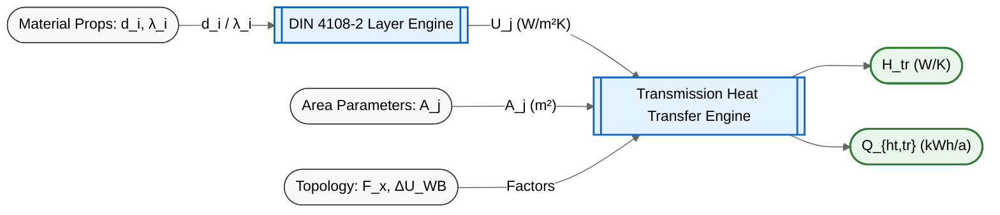
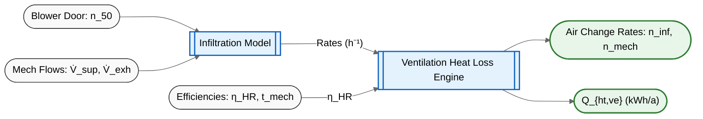
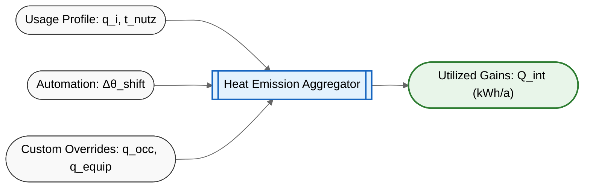
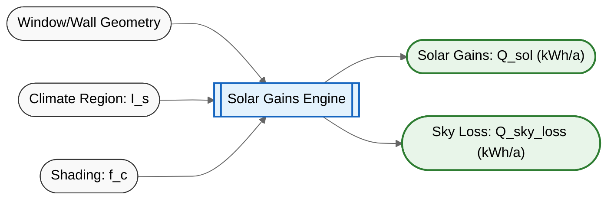
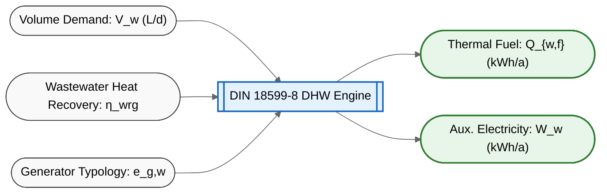
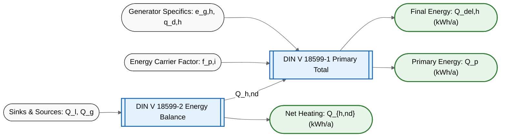

# Energy Calculation Documentation

This document outlines the energy calculation logic based on the `calculate_energy` function found in `sketchpad-rs/src/lib.rs` and the geometric mapping logic in `main_mcp.js`. It breaks down the formulas used and maps the variables to their source locations within the application state and external databases.

## 1. Building Geometry & Surface Areas

**Concept & Formula:**
The physical envelope of the building determines the surface areas exposed to the environment. The calculations compute the gross and net areas for the walls, roof, floor, and windows.

* **Total Window Area:**
  $$
  A_{window} = \sum A_{window\_orientations} \quad \text{(North, East, South, West, Horizontal)}
  $$
* **Net Wall Area:**
  $$
  A_{net\_wall} = A_{gross\_wall} - A_{vertical\_windows}
  $$

**Source Mapping:**

* **Areas:** Extracted directly from `state.geometry` (e.g., `geometry.total_floor_area`, `geometry.total_roof_area`, `geometry.envelope_data`).

### 1.1 Detailed Orientation Calculation (Windows & Walls)

The orientation of walls and windows is calculated dynamically in the front-end (`main_mcp.js`) by analyzing the 2D floor plan polygons.

1. **Polygon Edges:** The system iterates over the perimeter edges of the building's union polygon. For each edge from point $P_1$ to $P_2$, it calculates $\Delta x = P_{2x} - P_{1x}$ and $\Delta y = P_{2y} - P_{1y}$.
2. **Building Rotation:** The edge vectors are rotated by the global building rotation angle ($\theta_{rot}$):

   $$
   \Delta x_{rot} = \Delta x \cdot \cos(-\theta_{rot}) - \Delta y \cdot \sin(-\theta_{rot})
   $$

   $$
   \Delta y_{rot} = \Delta x \cdot \sin(-\theta_{rot}) + \Delta y \cdot \cos(-\theta_{rot})
   $$
3. **Surface Normal Vector:** The 2D normal vector pointing outwards from the wall is computed:

   $$
   N_x = \Delta y_{rot}
   $$

   $$
   N_y = -\Delta x_{rot}
   $$
4. **Cardinal Direction:** The angle of the normal is found using $\text{atan2}(N_x, N_y)$ and converted to degrees ($0^\circ$ to $360^\circ$). The wall and its windows are binned into cardinal directions:

   * **North (N):** $[315^\circ, 360^\circ)$ or $[0^\circ, 45^\circ)$
   * **East (E):** $[45^\circ, 135^\circ)$
   * **South (S):** $[135^\circ, 225^\circ)$
   * **West (W):** $[225^\circ, 315^\circ)$
5. **Window Matching:** It checks the unrotated original zones to find windows placed on these edges and assigns their areas to the corresponding rotated cardinal bin in `envelope_data`.

## 2. Thermal Transmittance & Components (U-Values)

**Concept & Formula:**
The U-value measures the rate of heat transfer through a structure. Base U-values are modeled via layered components in the Rust `transmission` module according to DIN V 18599-2.

### 2.1 Opaque Components (`BuildingComponent` & Custom Thickness)

Opaque components (walls, roofs, floors) are modeled as a series of material layers. If the user wants to add custom insulation, they can push a new `Layer` to the component with a specific thickness.

* **Struct `Material`:** Defines `lambda` ($\lambda$, thermal conductivity in $W/(m\cdot K)$).
* **Struct `Layer`:** Defines `thickness` ($d$ in meters) and its `Material`.
* **Thermal Resistance ($R_T$):**

  $$
  R_T = R_{si} + \sum \left( \frac{d_i}{\lambda_i} \right) + R_{se}
  $$

  * $d_i$: The user-defined thickness of the layer in meters.
  * $\lambda_i$: The material's thermal conductivity.
  * $R_{si}$ (Inner surface resistance): Standard $0.13 \text{ m}^2K/W$.
  * $R_{se}$ (Outer surface resistance): Standard $0.04 \text{ m}^2K/W$ (or $0.13$ if internal).
* **U-Value Calculation (`calculate_u_value`):**

  $$
  U = \frac{1}{R_T}
  $$

  This formula is dynamically re-calculated in `lib.rs` every time a user adds a layer or changes its thickness.

### 2.2 Transparent Components (`WindowComponent`)

Windows account for shading control systems when calculating their effective heat loss.

* **Struct `WindowComponent`:** Defines base U-value ($U_w$) and shutter U-value ($U_{w,sh}$).
* **Effective U-Value (`calculate_u_w_eff`):**
  $$
  U_{w,eff} = U_w \cdot (1 - f_{sh}) + U_{w,sh} \cdot f_{sh}
  $$

**Source Mapping:**

* **Base Components:** `TABULA_DB` fallback or customized via `state.params.custom_wall_insulation`.
* **Shutter Usage Fraction ($f_{sh}$):** Handled by `get_shutter_fraction(month, building_type, control_type)` based on `ShutterControl::Manual` or `Automated`.
  * *Manual + Non-Residential:* $f_{sh} = 0.0$
  * *Automated (All):* Ranges from $0.64$ in Dec/Jan to $0.23$ in June.
  * *Manual + Residential:* Ranges from $0.45$ in Dec/Jan to $0.16$ in June.

## 3. Transmission Heat Transfer Coefficient ($H_{tr}$)

**Concept & Formula:**
The overall transmission heat transfer coefficient ($H_T$ or $H_{tr}$) represents the total heat lost through the building envelope via transmission. It sums up the "leakiness" of the entire building by aggregating direct losses, losses to unheated spaces/ground, and thermal bridges.

* **Overall Transmission ($H_T$):**

  $$
  H_T = H_{T,D} + H_{T,iu,eff} + H_{T,WB}
  $$
* **1. Direct Transmission (`calculate_h_t_d`):**
  Heat lost directly to the exterior environment ($F_x \approx 1.0$).

  $$
  H_{T,D} = \sum \left( A_j \cdot U_j \cdot f_{neig,j} \right)
  $$

  *Where $f_{neig,j}$ is an inclination factor derived from `WindowGlazingType` and `WindowInclinationAngle` (Table 7):*

  * **$0^\circ$ (Horizontal):** Single: $1.25$, Double: $1.21$, Triple: $1.20$
  * **$45^\circ$:** Single: $1.21$, Double: $1.15$, Triple: $1.07$
  * **$90^\circ$ (Vertical):** $1.00$ for all glazing types.
* **2. Transmission to Unheated Zones/Ground (`calculate_h_t_iu`):**
  Heat lost through surfaces not directly exposed to the outside ($F_x \neq 1.0$).

  $$
  H_{T,iu,eff} = \sum \left( A_j \cdot U_j \cdot F_{x,j} \right)
  $$
* **3. Thermal Bridges (`calculate_h_t_wb_simplified` / `calculate_detailed_h_t_wb`):**
  Simplified method adds a penalty for structural heat leaks over the entire envelope.

  $$
  H_{T,WB} = \Delta U_{WB} \cdot \sum A_{envelope}
  $$

  Detailed method: $H_{T,WB} = \sum (l_j \cdot \Psi_j \cdot f_{x,j})$
* **4. Specific Heat Transfer Coefficient (`calculate_h_t_specific`):**

  $$
  H'_T = \frac{H_T}{\sum A_{envelope}}
  $$

**Source Mapping:**

* **Temperature Adjustment Factor ($F_x$):**
  * **Enum `UnheatedSpaceType`:**
    * `Attic`, `Sunspace`, `CrawlSpaceVentilated` $\implies 0.8$
    * `AdjacentUnheatedRoom`, `UnheatedBasement`, `StaircaseExterior`, `CrawlSpaceUnventilated` $\implies 0.5$
    * `StaircaseInterior` $\implies 0.35$
  * **Enum `GroundContactType`:**
    * `GroundwaterContact` $\implies 1.0$
    * `FloorSlabOnGround`, `BasementWallShallow`, `BasementWallDeep`, `HeatedBasementFloor` $\implies 0.5$
* **Thermal Bridge Penalty ($\Delta U_{WB}$):**
  * **Enum `ThermalBridgeCategory`:**
    * `InternalInsulationIssues` $\implies 0.15$
    * `StandardDefault` $\implies 0.10$
    * `GoodPlanning` (Category A) $\implies 0.05$
    * `ExcellentPlanning` (Category B) $\implies 0.03$

## 4. Ventilation Heat Transfer Coefficient ($H_{ve}$)

**Concept & Formula:**
The standard requires resolving the baseline air requirements before calculating how much heat is lost through infiltration, windows, and mechanical systems. The core physical formula shared by all air exchange components is:

$$
H_v = n \cdot V \cdot 0.34
$$

*(where $0.34$ represents air heat capacity $c_{p,a} \cdot \rho_a$ in $Wh/(m^3K)$)*

**Total Ventilation Heat Transfer ($H_{ve}$)**
At the highest level, the total ventilation heat transfer coefficient ($H_{ve}$) is the sum of three separate components:

$$
H_{ve} = H_{V,inf} + H_{V,win} + H_{V,mech} + H_{V,ue}
$$

### 4.1 Infiltration Heat Transfer ($H_{V,inf}$)

Heat lost through unintentional leaks. The infiltration air change rate ($n_{inf}$) is calculated dynamically via `calculate_n_inf` based on whether mechanical ventilation is running ($t_{v,mech} > 0$):

* **Without Mechanical Ventilation:**

  $$
  n_{inf} = n_{50} \cdot e \cdot f_{atd}
  $$
* **With Mechanical Ventilation:**

  $$
  n_{inf} = n_{50} \cdot e \cdot f_{atd} \cdot \left(1 + (f_e - 1) \cdot \frac{t_{v,mech}}{24}\right)
  $$
* **$n_{50}$ (Air Tightness at 50 Pa):** Resolved based on building volume and `TightnessCategory` using `BuildingAirData::resolve_n50()`:

  * *If Volume $\le 1500 \text{m}^3$:* `CategoryI` (Tested): user value (default 3.0), `CategoryII` (New): 4.0, `CategoryIII`: 6.0, `CategoryIV` (Leaky): 10.0.
  * *If Volume $> 1500 \text{m}^3$:* $n_{50} = \frac{q_{50} \cdot A_{envelope}}{V}$, where $q_{50}$ is `CategoryI`: user (default 3.0), `CategoryII`: 6.0, `CategoryIII`: 9.0, `CategoryIV`: 15.0.
* **$e$ (Wind Exposure):** Hardcoded `DEFAULT_E = 0.07`.
* **$f_{atd}$ (Air Tightness Device Factor):** `calculate_f_atd()` returns $1.0$ (no ATD) or $\min\left(16.0, \frac{n_{50} + 1.5}{n_{50}}\right)$ (with ATD).
* **$f_e$ (Mechanical Imbalance Factor):** `calculate_f_e()` returns $1.0$ if perfectly balanced. If unbalanced: $f_e = \frac{1}{1 + 15.0 \cdot 0.07 \cdot \left(\frac{n_{sup} - n_{eta}}{n_{50} \cdot f_{atd}}\right)^2}$

### 4.2 Required Fresh Air ($n_{nutz}$)

The baseline fresh air requirement via `calculate_n_nutz()`:

$$
n_{nutz} = \frac{\dot{V}_A \cdot A_{NGF}}{V_e}
$$

*Where $\dot{V}_A$ is the minimum fresh air volume flow per square meter:*

* Residential: Flat $0.5 \text{ h}^{-1}$ fallback.
* Storage/Logistics: $0.5 \text{ m}^3/(\text{h}\cdot\text{m}^2)$
* Default/Average: $1.5 \text{ m}^3/(\text{h}\cdot\text{m}^2)$
* Single Office: $2.0 \text{ m}^3/(\text{h}\cdot\text{m}^2)$
* Group/Open Office, Retail, Hospital Room: $3.0 \text{ m}^3/(\text{h}\cdot\text{m}^2)$
* Gymnasium: $3.5 \text{ m}^3/(\text{h}\cdot\text{m}^2)$
* Meeting Room, Classroom: $5.0 \text{ m}^3/(\text{h}\cdot\text{m}^2)$
* Restaurant: $7.0 \text{ m}^3/(\text{h}\cdot\text{m}^2)$

### 4.3 Window Airing ($H_{V,win}$)

Calculates window airing by figuring out how much fresh air is required ($n_{nutz}$) versus how much is already provided via `WindowAiringParams`.

* **Without Mech Vent (`delta_n_win`):** Deficit $\Delta n_{win} = \max[0; n_{nutz} - (n_{nutz} - 0.2) \cdot n_{inf} - 0.1]$
* **With Mech Vent (`delta_n_win_mech`):** Complex deficit calculation comparing $n_{sup}$ and $n_{eta}$ against total infiltration and mechanical supply.
* **Final Rate (`calculate_n_win_daily`):** Interpolates between these states using $t_{v,mech}$ and building usage hours $t_{nutz}$.
  $$
  H_{V,win} = n_{win} \cdot V \cdot 0.34
  $$

### 4.4 Mechanical Ventilation ($H_{V,mech}$)

Heat loss specifically driven by the mechanical supply air system via struct `MechanicalSystem`.

* **Supply Air Rate:** $n_{mech,SUP} = \frac{\dot{V}_{mech,b}}{V}$
* **Daily Average Rate:** $n_{mech} = n_{mech,SUP} \cdot \frac{t_{v,mech}}{24}$
* **Heat Transfer:** $H_{V,mech} = n_{mech} \cdot V \cdot 0.34$

## 5. Heating/Cooling Profiles & Parameters

**Concept & Formula:**
The internal setpoint temperatures and operation hours are derived dynamically from standard profiles, affecting the final heat loss and gain calculations.

**Source Mapping:**

* **Usage Profile (`UsageProfile` enum):**
  * *Usage Days ($d_{nutz}$):* 365 (Residential, Hospital, DataCenter), 300 (Retail, Library), 250 (Office, School), 200 (Stage/Exhibition).
  * *Heating Hours ($t_{nutz}$):* 24h (Hospital/DataCenter), 17h (Residential), 13h (Office/Lab), 12h (Retail/Classroom), 10h (Stage).
  * *Heating Setpoints:* $20.0^\circ\text{C}$ (Residential), $21.0^\circ\text{C}$ (Office), $22.0^\circ\text{C}$ (Hospital), $15.0^\circ\text{C}$ (Heavy Industry).
  * *Cooling Setpoints:* $25.0^\circ\text{C}$ (Residential), $24.0^\circ\text{C}$ (Office), $28.0^\circ\text{C}$ (Heavy Industry).
* **Automation Class (`AutomationClass` enum):** Determines temperature shift:
  * *Class C/D:* $0.0\text{ K}$ (Except Residential C: $-0.5\text{ K}$).
  * *Class B:* $-1.5\text{ K}$ (Retail/Restaurant), $-1.0\text{ K}$ (Office).
  * *Class A:* $-2.0\text{ K}$ (Retail/Restaurant), $-1.5\text{ K}$ (Office).
* **Climate Region (`ClimateRegion` enum):**
  * Monthly External Temperatures ($\theta_e$) array depending on region (e.g. `Potsdam`, `Bremerhaven`, `Hamburg`).

## 6. Base Energy Losses ($Q_{ht}$)

**Concept & Formula:**
The total sensible heat lost over the heating period. The formulas use a conversion factor of $0.024$ to convert W to kWh/day.

* **Transmission Loss ($Q_{ht,tr}$):**

  $$
  Q_{ht,tr} = 0.024 \cdot H_{tr} \cdot (\theta_{int} - \theta_e) \cdot d_{hs,loss}
  $$
* **Ventilation Loss ($Q_{ht,ve}$):**

  $$
  Q_{ht,ve} = 0.024 \cdot H_{ve} \cdot (\theta_{int} - \theta_e) \cdot d_{hs,loss}
  $$
* **Internal Setpoint ($\theta_{int}$):**

  $$
  \theta_{int} = \max(10.0,\; \text{heating\_setpoint} + \text{temperature\_shift})
  $$
* **Heating Period ($d_{hs,loss}$):** Fixed at $185.0$ days for the winter heating season.

## 7. Energy Gains ($Q_{gn}$)

**Concept & Formula:**
Heat gained from the sun and internal sources that offset the heating demand.

$$
Q_{gn} = Q_{sol} + Q_{int}
$$

### 7.1 Internal Gains ($Q_{int}$)

Heat introduced into the building by occupants, equipment, lighting, and processes. The calculation is managed by the `internal_gains::InternalGainsEngine`.

$$
Q_{int} = \frac{\text{net\_daily\_gain\_wh} \cdot d_{hs,gain}}{1000}
$$

*(Where $d_{hs,gain} = d_{nutz} \cdot \frac{185.0}{365.0}$ is the active heating duration)*

The engine computes `net_daily_gain_wh` by balancing sources and sinks based on two main calculation methods: `Standard` and `Custom`.

**1. Standard Profile Calculation:**
Uses `StandardGainProfile` values derived from DIN V 18599-10 ($q_{i,combined}, q_{i,p}, q_{i,app}, q_{i,sink,app}$):

* **Residential:** Uses a flat combined heat rate ($q_{i,combined} = 3.75 \text{ W/m}^2$).

  $$
  \text{gain}_{res} = (q_{i,combined} \cdot A_{ngf}) \cdot t_{nutz}
  $$
* **Non-Residential (Split):** Separates humans and appliances.

  $$
  \text{gain}_{non\_res} = (q_{i,p} \cdot A_{ngf} \cdot t_{nutz}) + (q_{i,app} \cdot A_{ngf} \cdot t_{nutz})
  $$

  $$
  \text{sink}_{app} = q_{i,sink,app} \cdot A_{ngf} \cdot t_{nutz}
  $$

**2. Custom Profile Calculation:**
Calculates precise sensible heat output from a specific `CustomInventoryProfile`.

$$
\text{gain}_{custom} = \Big( (\text{num\_people} \cdot \text{metabolic\_rate}) + \text{equipment\_watts\_active} \Big) \cdot t_{nutz}
$$

**Additional Sources and Sinks:**

* **Lighting Heat Gain:** Based on the room load factor ($\mu_L$), which is determined by the `LightingExhaustType`:

  * `Standard` $\implies \mu_L = 1.0$
  * `CeilingCavity` $\implies \mu_L = 0.75$
  * `AirDucts` $\implies \mu_L = 0.65$

  $$
  \text{gain}_{light} = \mu_L \cdot q_{l,f,daily}
  $$
* **Material Transport (`MaterialTransport`):** Heat dumped or absorbed by goods entering/leaving. Uses 24h as the daily standard time $t$.

  $$
  \text{gain/sink}_{mat} = c_p \cdot \dot{m} \cdot |\theta_{in} - \theta_{out}| \cdot t
  $$

  * If $\theta_{in} > \theta_{out}$ it acts as a heat source.
  * If $\theta_{in} < \theta_{out}$ it acts as a heat sink.

### 7.2 Solar Gains & Sky Loss

Computed via the `solar_gains::SolarGainsEngine`. This module splits the calculations into Transparent (windows) and Opaque (walls/roofs) components.

* **Solar Gains ($Q_{sol}$):** Positive heat entering through transparent and opaque surfaces.
  $$
  Q_{sol} = \frac{Q_{sol\_sources\_wh}}{1000}
  $$
* **Sky Loss ($Q_{sky\_loss}$):** Heat lost by thermal radiation from opaque surfaces to the cold night sky. It is added to transmission losses ($Q_{ht,tr}$) rather than subtracted from gains.
  $$
  Q_{sky\_loss} = \frac{Q_{sol\_sinks\_wh}}{1000}
  $$

#### 7.2.1 Transparent Components (Windows)

Windows act purely as solar gain sources.

1. **Effective Collecting Area ($A_{eff}$):**

   $$
   A_{eff} = A_w \cdot (1 - F_F) \cdot F_w \cdot g \cdot f_c \cdot f_s
   $$

   * **$F_F$ (Frame Fraction):** `Standard` = 0.30, `VeryLarge` = 0.20, `SmallDivided` = 0.40
   * **$F_w$ (Non-perpendicular Radiation):** Standard $0.90$
   * **$g$ (Glazing Transmittance):** `Single` = 0.85, `DoubleStandard` = 0.75, `TripleLowE` = 0.50, `SolarControl` = 0.35
   * **$f_c$ (Shading Reduction):** `None` = 1.0, `InteriorLight` = 0.80, `ExteriorBlinds` = 0.25, `ExteriorAwnings` = 0.40
   * **$f_s$ (Surroundings Shading):** Usually ~0.90
2. **Gain Calculation:**

   $$
   Q_{gain,transparent} = I_s \cdot A_{eff}
   $$

   *(where $I_s$ is the seasonal irradiation in Wh/m²)*

#### 7.2.2 Opaque Components (Walls & Roofs)

Opaque surfaces absorb solar radiation but also constantly radiate heat to the cold sky ($\Delta\theta_{ER} = 11.0 \text{ K}$).

1. **Absorbed Solar Radiation:**

   $$
   Q_{abs} = \alpha \cdot I_s
   $$

   * **$\alpha$ (Solar Absorptance):** `Light` = 0.30, `Medium` = 0.60, `Dark` = 0.90
2. **Sky Radiation Loss:**

   $$
   Q_{sky} = f_{sky} \cdot h_{r} \cdot \Delta\theta_{ER} \cdot t_{hours}
   $$

   * **$f_{sky}$ (Sky View Factor):** $1.0$ for Roofs, $0.5$ for Walls
   * **$h_{r}$ (Radiative Transfer):** Standard $5.0 \text{ W/m}^2\text{K}$
3. **Net Heat Transfer into Building:**

   $$
   Q_{net,opaque} = A_{op} \cdot U_{value} \cdot R_{se} \cdot (Q_{abs} - Q_{sky})
   $$

   * **$R_{se}$ (External Resistance):** Standard $0.04 \text{ m}^2\text{K/W}$
   * If $Q_{net} > 0$, it acts as a solar source ($Q_{sol\_sources\_wh}$). If $Q_{net} < 0$, it acts as a sky sink ($Q_{sol\_sinks\_wh}$).

### 6.1 Code Variable Walkthrough (Aggregation)

When the engine calculates the final balance, it uses specific variables to aggregate these systems:

* **`HotMetalLarge` / `material_transport`**: For extremely heavy industrial usage profiles, the system calculates the massive amount of heat that raw materials dump into a room. The `HotMetalLarge` example assumes a mass flow of $2000 \text{ kg/h}$ cooling from $200^\circ\text{C}$ to $20^\circ\text{C}$ inside the building. This is fed into the internal gains engine.
* **`q_sol_sources_wh` and `q_sol_sinks_wh`**: The solar engine returns both the positive heat gained from the sun (sources) and the heat lost to the cold sky via thermal radiation (sinks) in Watt-hours ($Wh$).
* **`q_sol` and `q_sky_loss`**: The code divides those Watt-hour values by $1000.0$ to convert them into standard $kWh$.
* **`q_ht_tr_total`**: The `q_sky_loss` (heat radiating out into the cold sky) is added to the **Total Transmission Losses ($Q_{ht,tr}$)**, instead of being subtracted from the gains.
* **`q_int`**: The internal gains engine outputs a net daily gain in $Wh$, which is multiplied by the number of heating days ($d_{hs,gain}$) and divided by $1000.0$ to get the final internal gains in $kWh$.
* **`q_gn`**: Finally, the total Solar Gains ($Q_{sol}$) and Internal Gains ($Q_{int}$) are summed together to get the total $Q_{gn}$.

## 7. Final Heating Demand ($Q_{h,nd}$)

**Concept & Formula:**
The absolute net thermal energy required to maintain the setpoint temperature, factoring in the utilization of heat gains. This is calculated using the Master Equation inside the `EnergyBalanceEngine`:

$$
Q_{h,nd} = \max\Big(0.0,\; Q_l - (\eta \cdot Q_g)\Big)
$$

Here is exactly how the Rust engine (`energy_balance::EnergyBalanceEngine::calculate_final_heating_demand`) computes this step-by-step:

**1. Initialize the Engine (`EnergyBalanceEngine::new`)**
The engine is instantiated with the `conditioned_volume` ($V_e$) and a thermal inertia profile based on the `ConstructionWeight` enum:

* `ConstructionWeight::Heavy`: Used for Residential buildings (`SFH`, `MFH`). Simulates thick masonry that stores heat for longer periods.
* `ConstructionWeight::Light`: Used for Non-Residential buildings (e.g., Offices). Simulates lighter constructions that lose/gain heat rapidly.
* `CalculationPeriod::Seasonal`: Defines the bounds for the formulas.

**2. Aggregate Sinks and Sources**
The engine adds up all the heat the building loses, and all the heat it generates using the exact parameter mappings:

* **$Q_l$ (Total Losses)** = `q_ht_tr_total * 1000.0` (includes $Q_{sky\_loss}$) + `q_ht_ve * 1000.0`
* **$Q_g$ (Total Gains)** = `q_int * 1000.0` + `q_sol_sources_wh` (only the positive solar entering)

**3. Calculate Thermal Inertia ($\tau$)**
The engine calculates how long the building can "store" heat before it escapes. This is determined by dividing the building's effective heat capacity (mapped by `ConstructionWeight`) by the total heat transfer coefficients (`h_tr`, `h_ve`).

**4. Calculate Gain Utilization Factor ($\eta$)**
Not all gains are useful (e.g., if the sun heats the room to 25°C when the setpoint is 20°C, the extra 5°C is "wasted"). The engine calculates an efficiency factor ($\eta$) based on the ratio of gains to losses and the thermal inertia.

**5. Final Balance**
The final heating demand is equal to the total heat lost ($Q_l$), minus the portion of the free heat ($\eta \cdot Q_g$) that the building was actually able to trap and use.

## 8. Final Cooling Demand ($Q_{c,nd}$)

**Concept & Formula:**
The absolute net thermal energy required to remove heat and maintain the summer setpoint temperature (typically $25^\circ\text{C}$). This is calculated using the Master Cooling Equation inside the `EnergyBalanceEngine`:

$$
Q_{c,nd} = \max\Big(0.0,\; Q_{g,c} - (\eta_c \cdot Q_{l,c})\Big)
$$

Here is exactly how the Rust engine (`energy_balance::EnergyBalanceEngine::calculate_final_cooling_demand`) computes this step-by-step:

**1. Aggregate Sinks and Sources (The Flipped Balance)**
Unlike heating, the engine must dynamically route transmission and ventilation based on whether the outside air is hotter or cooler than the cooling setpoint:

* **$Q_{l,c}$ (Total Sinks)** = Transmission/Ventilation leaving the building (when outside is cooler than the setpoint).
* **$Q_{g,c}$ (Total Sources)** = Internal Gains ($Q_{int}$) + Solar Gains ($Q_{sol\_sources}$) + Transmission/Ventilation entering the building (when outside is hotter).

**2. Calculate Thermal Inertia ($\tau_c$)**
The engine calculates how long the building stores heat, using the exact same `ConstructionWeight` parameters as for heating, divided by the total heat transfer coefficients.

**3. Calculate Loss Utilization Factor ($\eta_c$)**
Not all natural cooling (like a cold night sky) is useful against a midday sun. The engine (`calculate_loss_utilization_factor`) computes exactly how much of the sinks can be utilized to offset the gains using the strict DIN V 18599-2 / ISO 13790 formulas:

* **Gain/Loss Ratio ($\gamma_c$):** The ratio of Sinks divided by Sources (the inverse of heating).

  $$
  \gamma_c = \frac{Q_{l,c}}{Q_{g,c}}
  $$
* **Curve Parameter ($a_c$):** Uses the same base constants as heating, but applied to the cooling time constant ($a_{c,0} = 1.0$, $\tau_{c,0} = 15.0 \text{ h}$).

  $$
  a_c = a_{c,0} + \frac{\tau_c}{\tau_{c,0}}
  $$
* **Final Utilization Factor ($\eta_c$):**

  $$
  \text{If } \gamma_c = 1: \quad \eta_c = \frac{a_c}{a_c + 1}
  $$

  $$
  \text{If } \gamma_c \neq 1: \quad \eta_c = \frac{1 - \gamma_c^{a_c}}{1 - \gamma_c^{a_c + 1}}
  $$

**4. Final Balance**
The final cooling demand is equal to the total heat sources ($Q_{g,c}$), minus the portion of the natural cooling sinks ($\eta_c \cdot Q_{l,c}$) that the building was actually able to utilize.

## 9. Heating System Engine (Anlagentechnik) & Final Energy Demand ($Q_{h,f}$)

**Concept & Formula:**
This module calculates the Final Energy Demand for Heating ($Q_{h,f}$) and the Auxiliary Electrical Energy ($W_h$) by working backward through the thermal chain of mechanical subsystems according to DIN V 18599-5:2018-09.

### 9.1 Subsystem 1: Emission (Wärmeübergabe)

Adds stratification, control, and wall proximity losses to the building's Net Heating Demand ($Q_{h,nd}$):

$$
Q_{h,in,ce} = Q_{h,nd} + Q_{h,ce}
$$

Where emission losses are calculated as:

$$
Q_{h,ce} = Q_{h,nd} \cdot \left[ \frac{\Delta\theta_{ce}}{\theta_{i,h} - \theta_e} \right]
$$

$$
W_{h,ce} = w_{h,ce} \cdot A_{NGF}
$$

* **Total Temperature Variation ($\Delta\theta_{ce}$):**
  $$
  \Delta\theta_{ce} = \Delta\theta_{str} + \Delta\theta_{ctr} + \Delta\theta_{emb} + \Delta\theta_{hydr} + \Delta\theta_{roomaut}
  $$
* **Stratification ($\Delta\theta_{str}$):**
  * `EmissionType::Radiator` + `TempLevel::High70_55` $\implies 1.2\text{ K}$
  * `EmissionType::Radiator` + `TempLevel::Medium55_45` $\implies 0.7\text{ K}$
  * `EmissionType::Radiator` + `TempLevel::Low35_28` $\implies 0.5\text{ K}$
  * `EmissionType::UnderfloorHeating` $\implies 0.0\text{ K}$
* **Control Deviation ($\Delta\theta_{ctr}$):**
  * `EmissionType::Radiator` + `EmissionControl::Mechanical2K` $\implies 1.2\text{ K}$
  * `EmissionType::Radiator` + `EmissionControl::Mechanical1K` $\implies 0.7\text{ K}$
  * `EmissionType::Radiator` + `EmissionControl::ElectronicPI` $\implies 0.5\text{ K}$
  * `EmissionType::UnderfloorHeating` + `EmissionControl::Mechanical2K`/`Mechanical1K` $\implies 1.2\text{ K}$
  * `EmissionType::UnderfloorHeating` + `EmissionControl::ElectronicPI` $\implies 0.9\text{ K}$
* **Adjacent Proximity Loss ($\Delta\theta_{emb}$):**
  * `AdjacentLoss::InteriorWall` $\implies 0.0\text{ K}$
  * `AdjacentLoss::SolidExteriorWall` $\implies 0.3\text{ K}$
  * `AdjacentLoss::GlassExteriorWall` $\implies 1.7\text{ K}$
* **Balancing Variation ($\Delta\theta_{hydr}$):**
  * `EmissionBalancing::NoBalancing` $\implies 0.6\text{ K}$
  * `EmissionBalancing::StaticBalancing` $\implies 0.3\text{ K}$
  * `EmissionBalancing::DynamicBalancing` $\implies 0.0\text{ K}$
* **Auxiliary Power Coefficient ($w_{h,ce}$):**
  * `EmissionControl::Mechanical2K` / `Mechanical1K` $\implies 0.0\text{ kWh/m²a}$
  * `EmissionControl::ElectronicPI` $\implies 0.6\text{ kWh/m²a}$

---

### 9.2 Subsystem 2: Distribution (Wärmeverteilung)

Calculates linear pipe losses using estimated pipe lengths and average circuit temperatures ($\theta_{HK,av}$):

$$
Q_{h,in,d} = Q_{h,in,ce} + Q_{h,d}
$$

$$
Q_{h,d} = \frac{1}{1000} \cdot U_L \cdot (\theta_{HK,av} - \theta_{amb,d}) \cdot L_{total} \cdot t_h
$$

$$
W_{h,d} = \frac{P_{Pu,d} \cdot t_h \cdot e_d}{1000}
$$

* **Average Heating Circuit Temperature ($\theta_{HK,av}$):**

  $$
  \theta_{HK,av} = 0.5 \cdot (\theta_{VL,av} + \theta_{RL,av})
  $$

  $$
  \theta_{VL,av} = (\theta_{VA} - \theta_{i,h}) \cdot \beta_{d}^{1/n} + \theta_{i,h}
  $$

  $$
  \theta_{RL,av} = (\theta_{RA} - \theta_{i,h}) \cdot \beta_{d}^{1/n} + \theta_{i,h}
  $$

  * Clamped load factor $\beta_d = \frac{Q_{h,nd} + Q_{h,ce}}{\Phi_{h,max} \cdot t_h} \cdot f_{hydr}$ (clamped to $[0, 1]$).
  * Exponent $n = 1.3$ for `Radiator` and $1.1$ for `UnderfloorHeating`.
* **Pipe Lengths ($L_{total}$):**

  $$
  L_{total} = L_A + L_S + L_V = (0.28 + 0.08 + 0.05) \cdot A_{NGF} = 0.41 \cdot A_{NGF}
  $$
* **Linear Transmittance ($U_L$):**

  * `PipeInsulation::Uninsulated` $\implies 2.20\text{ W/mK}$
  * `PipeInsulation::EnEV50` $\implies 0.40\text{ W/mK}$
  * `PipeInsulation::EnEV100` $\implies 0.25\text{ W/mK}$
* **Ambient Pipe Temperature ($\theta_{amb,d}$):**

  * `in_unheated_basement: true` $\implies 13.0^\circ\text{C}$
  * `in_unheated_basement: false` $\implies \theta_{i,h}$
* **Circulation Pump Power ($P_{Pu,d}$):**

  * $$
    P_{Pu,d} = \text{base} + \text{HE\_factor} \cdot A_{NGF}
    $$
  * `PumpControl::Uncontrolled` $\implies 20.0 + 0.15 \cdot A_{NGF}$
  * `PumpControl::RegulatedDeltaPV` $\implies 15.0 + 0.10 \cdot A_{NGF}$
  * `PumpControl::RegulatedDeltaPC` $\implies 5.0 + 0.05 \cdot A_{NGF}$
* **Pump Correction Factor ($e_d$):**

  * `PumpControl::Uncontrolled` $\implies 1.0$
  * `PumpControl::RegulatedDeltaPV` $\implies 0.4$
  * `PumpControl::RegulatedDeltaPC` $\implies 0.6$

---

### 9.3 Subsystem 3: Storage (Wärmespeicherung)

Accounts for buffer storage tank heat loss based on insulation quality:

$$
Q_{h,in,s} = Q_{h,in,d} + Q_{h,s}
$$

$$
Q_{h,s} = \frac{1}{1000} \cdot H_{s,st} \cdot (\theta_{s,av} - \theta_{amb,s}) \cdot t_h
$$

$$
W_{h,s} = w_{h,s} \cdot A_{NGF}
$$

* **Loss Coefficient ($H_{s,st}$):**
  * `BufferTank::None` $\implies 0.0\text{ W/K}$
  * `BufferTank::StandardUnheated` $\implies 0.16 \cdot \sqrt{V_s}$
  * `BufferTank::HighEffUnheated` $\implies 0.10 \cdot \sqrt{V_s}$
  * `BufferTank::HighEffHeated` $\implies 0.08 \cdot \sqrt{V_s}$
* **Storage Temperature ($\theta_{s,av}$):**
  * `BufferConnection::Series` $\implies \theta_{RL,av} + 2.0\text{ K}$ (using $\beta_s = \frac{(Q_{h,nd} + Q_{h,ce}) \cdot f_{hydr} + Q_{h,d}}{\Phi_{h,max} \cdot t_h}$)
  * `BufferConnection::Parallel` $\implies \theta_{VL,av} + 2.0\text{ K}$
* **Ambient Storage Temperature ($\theta_{amb,s}$):**
  * `inside_heated_envelope: true` $\implies 20.0^\circ\text{C}$
  * `inside_heated_envelope: false` $\implies 13.0^\circ\text{C}$
* **Storage Pump electricity ($w_{h,s}$):**
  * `BufferTank::None` $\implies 0.0\text{ kWh/m²a}$
  * Others $\implies 0.4\text{ kWh/m²a}$

---

### 9.4 Subsystem 4: Generation (Wärmeerzeugung)

Calculates final energy demand by dividing accumulated heat demand by the efficiency factor ($e_{g,h}$ or reciprocal of COP) and applying pump management correction ($f_{gen,PM}$):

$$
Q_{h,f} = Q_{h,outg} \cdot e_{g,h} \cdot f_{gen,PM}
$$

$$
Q_{h,outg} = Q_{h,nd} + Q_{h,ce} + Q_{h,d} + Q_{h,s}
$$

$$
W_{h,gen} = w_{h,g} \cdot A_{NGF}
$$

* **Expenditure / Efficiency Factor ($e_{g,h}$):**
  * `GeneratorType::OldGasBoiler` / `CondensingGasBoiler`:
    * Interpolates boiler performance based on nominal power $P_n$ ($10\text{ kW}$ to $400\text{ kW}$ logarithmic scaling):
      $$
      p_{factor} = \max\left(0.0,\; \frac{\ln(P_n / 10.0)}{\ln(40.0)}\right)
      $$
    * `OldGasBoiler` $\implies \eta_{100} = 84.0 + 4.0 \cdot p_{factor}$, $\eta_{30} = 79.0 + 6.0 \cdot p_{factor}$.
    * `CondensingGasBoiler` $\implies \eta_{100} = 96.0 + 1.0 \cdot p_{factor}$, $\eta_{30} = 103.0 + 2.0 \cdot p_{factor}$.
    * $\eta_{avg} = 0.3 \cdot \eta_{30} + 0.7 \cdot \eta_{100}$.
    * $$
      e_{g,h} = \frac{1}{\eta_{avg} / 100.0}
      $$
  * `GeneratorType::PelletBoiler` $\implies e_{g,h} = \frac{1}{0.85}$
  * `GeneratorType::AirSourceHeatPump`:
    * $$
      e_{g,h} = \frac{1}{COP} \quad \text{where} \quad COP = 0.45 \cdot \frac{\theta_{sink} + 273.15}{\theta_{sink} - \theta_{source}}
      $$
    * $\theta_{sink} = \theta_{HK,av}$ (using $\beta_{gen}$), $\theta_{source} = \theta_e$.
  * `GeneratorType::GroundSourceHeatPump`:
    * $$
      e_{g,h} = \frac{1}{COP} \quad \text{where} \quad COP = 0.52 \cdot \frac{\theta_{sink} + 273.15}{\theta_{sink} - \theta_{source}}
      $$
    * $\theta_{sink} = \theta_{HK,av}$, $\theta_{source} = 0.0^\circ\text{C}$ (Brine sole).
  * `GeneratorType::DirectElectric` $\implies e_{g,h} = 1.0$
* **Pump Management Factor ($f_{gen,PM}$):**
  * `PumpManagement::None` $\implies 1.00$
  * `PumpManagement::OutdoorGuided` $\implies 1.03$
  * `PumpManagement::RoomGuided` $\implies 1.06$
* **Generator Aux Power ($w_{h,g}$):**
  * `GeneratorType::OldGasBoiler` $\implies 0.5\text{ kWh/m²a}$
  * `GeneratorType::CondensingGasBoiler` $\implies 1.2\text{ kWh/m²a}$
  * `GeneratorType::PelletBoiler` $\implies 2.5\text{ kWh/m²a}$
  * Others $\implies 0.0$

### 9.5 Total Auxiliary & Final Energy Sums

* **Auxiliary electricity:**
  $$
  W_{h,total} = W_{h,ce} + W_{h,d} + W_{h,s} + W_{h,gen}
  $$
* **Total electricity:**
  * If generator consumes electricity (heat pump, direct electric):
    $$
    \text{Total Electricity} = Q_{h,f} + W_{h,total}
    $$
  * If generator is combustion-based:
    $$
    \text{Total Electricity} = W_{h,total}
    $$

## 10. Lighting Energy ($Q_{l,f}$)

**Concept & Formula:**
Calculates the final annual electrical energy demand for artificial lighting according to **DIN V 18599-10**.

The engine uses categorical inputs to derive precise physical properties such as required illuminance ($E_m$), luminous efficacy ($k_L$), and presence control factors ($C_{pra}$).

**Source Mapping (`calculate_energy`):**

The engine dynamically calculates the installed electrical power and daily energy demand by mapping user-friendly strings to the specific `lighting` module enums.

### 10.1 Room Geometry & Daylight Zones

The `RoomGeometry` struct evaluates the physical space.

* **Daylight Quotient ($D_{Rb}$):** Estimated using window area ($A_{window}$), lintel height ($h_{sturz}$), and working plane height ($h_{nutz}$).
* **Daylight Zone Split:** The engine calculates the maximum depth of daylight penetration:

  $$
  A_{TL,max} = 2.5 \cdot (h_{sturz} - h_{nutz}) \cdot \text{width}
  $$

  The floor area is divided into $A_{TL}$ (Daylight Zone) and $A_{kTL}$ (Artificial Only Zone).

### 10.2 Installed Power Density ($p_j$)

Calculated dynamically in W/m² using the standard approximation:

$$
p_j = 0.03 \cdot E_m \cdot k_L
$$

* **Required Lux ($E_m$) via `lighting_room_usage`:** Maps to the `RoomUsage` enum based on DIN V 18599-10 standard room profiles.
  * `Office` $\implies$ `lighting::RoomUsage::WritingTypingReadingDataProc` ($E_m = 500 \text{ lx}$)
  * `Classroom` $\implies$ `lighting::RoomUsage::ClassroomsTutorialRooms` ($E_m = 300 \text{ lx}$)
  * `Corridor` $\implies$ `lighting::RoomUsage::CirculationAreasAndCorridors` ($E_m = 100 \text{ lx}$)
  * `Warehouse` $\implies$ `lighting::RoomUsage::StoreAndStockroomsManned` ($E_m = 200 \text{ lx}$)
  * `Residential` $\implies$ `lighting::RoomUsage::LoungesWaitingAreas` ($E_m = 200 \text{ lx}$)
* **Lamp Technology Factor ($k_L$) via `lighting_lamp_technology`:** Maps to the `LampTechnology` enum.
  * `LED` $\implies$ `lighting::LampTechnology::LEDLuminaire` ($0.49$)
  * `Fluorescent` $\implies$ `lighting::LampTechnology::FluorescentEVG` ($1.0$)
  * `Halogen` $\implies$ `lighting::LampTechnology::Halogen` ($5.0$)
  * `Incandescent` $\implies$ `lighting::LampTechnology::Incandescent` ($6.0$)

### 10.3 Control Factors

* **Presence Factor ($c_{pra,kon}$) via `lighting_control`:** Maps to the `PresenceControl` enum.
  * `Manual` $\implies$ `lighting::PresenceControl::Manual` ($0.50$)
  * `MotionDetector` $\implies$ `lighting::PresenceControl::MotionDetector` ($0.95$)
* **Daylight Factor ($F_{TL}$):** Determines how much artificial light is saved by natural daylight, depending on `DaylightControl`.

### 10.4 Final Annual Demand

The daily energy demand ($Q_{l,f,daily}$) is then computed using standardized operational hours (e.g. 12 hours) and the presence control factor:

$$
Q_{l,f,daily} = p_j \cdot A_{NGF} \cdot 12.0 \cdot c_{pra,kon} \text{ / 1000.0 [kWh/day]}
$$

### 10.4 Final Annual Demand

The engine combines the effective lighting hours during the day ($t_{day}$) and night ($t_{night}$) across both daylight zones.

$$
Q_{l,f} = \frac{p_j}{1000} \cdot \Big(A_{TL} \cdot (t_{eff,day,TL} + t_{eff,night}) + A_{kTL} \cdot (t_{eff,day,kTL} + t_{eff,night})\Big)
$$

## 11. Domestic Hot Water (DHW) Engine

**Concept & Formula:**
This module calculates the Final Energy Demand for Domestic Hot Water ($Q_{w,f}$) and the Auxiliary Electrical Energy ($W_w$) according to DIN V 18599-8. It follows the thermal chain from base demand through distribution, storage, and generation.

### 11.1 Base Demand & Heat Recovery

The required hot water demand ($q_{w,b}$) is determined by mapping a user-friendly **Consumption Profile** to physical values based on **DIN EN 12831-3**.

**Source Mapping (`dhw_system::DHWEngine::calculate_final_energy`):**

* **Consumption Profile (`dhw_consumption_profile`):**
  * `Eco` $\implies 25.0 \text{ L/person/day}$
  * `Standard` $\implies 40.0 \text{ L/person/day}$
  * `Comfort` $\implies 60.0 \text{ L/person/day}$
* **Base Thermal Demand:** The daily liters are multiplied by an estimated occupant count ($A_{NGF} / 35.0$).
  $$
  Q_{w,b\_annual} = \text{daily\_liters} \cdot 365 \cdot 0.058 \text{ kWh/L}
  $$
* **Shower Demand:** Estimated as $60\%$ of total demand.
  $$
  q_{w,shower} = q_{w,b} \cdot 0.60
  $$
* **Wastewater Heat Recovery (WRG) (`dhw_wrg_technology`):**
  Based on **Passivhaus Institut (PHI)** component certifications:
  * `None` $\implies 0\%$ recovery
  * `ModernDrain` $\implies 30\%$ recovery
  * `ActiveHighTech` $\implies 50\%$ recovery

  $$
  q_{w,wrg} = q_{w,shower} \cdot \text{WRG\_efficiency}
  $$
* **Reduced Demand:**
  $$
  q_{w,b,reduced} = \max(0.0,\; q_{w,b} - q_{w,wrg})
  $$

### 11.2 Subsystem 1: Distribution (Verteilung)

Calculates pipe losses for tapping lines and circulation loops.

**Formulas (`DHWEngine::calculate_final_energy`):**

$$
Q_{w,d} = Q_{w,d,tap} + Q_{w,d,c}
$$

$$
Q_{w,d,tap} = \frac{1}{1000} \cdot U_{l,tap} \cdot L_{w,tap} \cdot (\theta_{w,t} - \theta_{amb}) \cdot t_{tap}
$$

$$
Q_{w,d,c} = \frac{1}{1000} \cdot U_{l,c} \cdot L_{w,c} \cdot (\theta_{w,c,av} - \theta_{amb}) \cdot t_{circ}
$$

**Source Mappings:**

* **Temperatures:** $\theta_{w,t} = 60.0^\circ\text{C}$, $\theta_{w,c,av} = 57.5^\circ\text{C}$, $\theta_{amb} = 20.0^\circ\text{C}$, $t_{tap} = 30.0\text{ h/a}$.
* **Lengths ($L_{w,tap}$, $L_{w,c}$):**
  * `DHWSystemType::Centralized` $\implies L_{w,tap} = 0.05 \cdot A_{NGF}$
  * `DHWSystemType::Decentralized` $\implies L_{w,tap} = 0.015 \cdot A_{NGF}$
  * `has_circulation == true` $\implies L_{w,c} = 0.06 \cdot A_{NGF}$ (otherwise 0).
* **Linear Transmittances ($U_{l,tap}$, $U_{l,c}$):**
  * `PipeInsulationDHW::Uninsulated` $\implies U_{l,tap} = 1.80$, $U_{l,c} = 2.20$
  * `PipeInsulationDHW::Insulated50Percent` $\implies U_{l,tap} = 0.35$, $U_{l,c} = 0.40$
  * `PipeInsulationDHW::Insulated100Percent` $\implies U_{l,tap} = 0.22$, $U_{l,c} = 0.25$
* **Circulation Hours ($t_{circ}$):**
  * `Residential1_2Family` / `OfficesCommercial` $\implies 420.0\text{ h/month}$
  * `ResidentialMultiFamily` / `HospitalsHotels` $\implies 744.0\text{ h/month}$

### 11.3 Subsystem 2: Storage (Speicherung)

Tank sizes are mapped categorically based on **DIN 4708** (Standard NL / capacity calculations for building scales):

* **System Scale (`dhw_system_scale`):**
  * `PointOfUse` $\implies 0.0\text{ Liters}$
  * `Apartment` $\implies 80.0\text{ Liters}$
  * `StandardSFH` $\implies 200.0\text{ Liters}$
  * `LargeMFH` $\implies 500.0\text{ Liters}$

Accounts for hot water tank heat loss based on insulation quality.

**Formulas:**

$$
Q_{w,s} = \frac{1}{1000} \cdot H_{w,st} \cdot (\theta_{w,s,av} - \theta_{amb}) \cdot t_{mth}
$$

**Source Mappings:**

* **Loss Coefficient ($H_{w,st}$):**
  * `TankInsulationDHW::VeryGoodClassA` $\implies 1.10 + (V_s - 100.0) \cdot 0.001$
  * `TankInsulationDHW::StandardClassC` $\implies 1.60 + (V_s - 100.0) \cdot 0.003$
  * `TankInsulationDHW::PoorOld` $\implies 2.50 + (V_s - 100.0) \cdot 0.005$
  * `TankInsulationDHW::None` $\implies 0.0$
* **Temperatures:** $\theta_{w,s,av} = 60.0^\circ\text{C}$, $\theta_{amb} = 20.0^\circ\text{C}$.

### 11.4 Subsystem 3: Generation (Wärmeerzeugung)

Calculates the final energy demand by applying the expenditure factor ($e_{g,w}$) to the total required heat output.

**Formulas:**

$$
Q_{w,outg} = q_{w,b,reduced} + Q_{w,d} + Q_{w,s}
$$

$$
Q_{w,outg,req} = \max(0.0,\; Q_{w,outg} - Q_{solar\_thermal})
$$

$$
Q_{w,f} = Q_{w,outg,req} \cdot e_{g,w}
$$

**Source Mappings ($e_{g,w}$):**

* `ElectricInstantaneous` $\implies 1.00$
* `ElectricSmallStorage` $\implies 1.02$
* `ElectricStandardStorage` $\implies 1.05$
* `GasInstantaneousNew` $\implies 1.15$
* `GasStorageNew` $\implies 1.25$
* `CombinedGasBoilerCondensing` $\implies$ Summer: $2.50$, Winter: $1.10$
* `DistrictHeating` $\implies 1.02$
* `HeatPumpAirWater` $\implies$ Calculates COP using $\eta_{carnot} = 0.38$, $\theta_{source} = 5.0^\circ\text{C}$, $\theta_{sink} = 55.0^\circ\text{C}$. $e_{g,w} = 1 / \text{COP}$.

### 11.5 Auxiliary Electricity ($W_w$)

Sum of electricity required for pumps and generation controls.

$$
W_w = W_{w,d,c} + W_{w,s} + W_{w,gen}
$$

* **Circulation Pump:** $W_{w,d,c} = (35.0 \text{ W} \cdot t_{circ}) / 1000.0$
* **Storage Pump:** $W_{w,s} = (45.0 \text{ W} \cdot t_{load}) / 1000.0$
* **Generator Standby/Active:** $W_{w,gen} = (60.0 \cdot t_{load} + 10.0 \cdot (t_{mth} - t_{load})) / 1000.0$

If the generator is electrically driven (e.g. Heat Pump, Electric Instantaneous), the Final Electricity Demand is $Q_{w,f} + W_w$. Otherwise, Fuel Demand is $Q_{w,f}$ and Electricity Demand is just $W_w$.

## 12. Primary Calculation: Final Heating Demand (`q_final_heating`)

**Concept & Formula:**
In the primary energy calculation flow within `lib.rs` (around the `calculate_energy` function), the final delivered energy for heating (`q_final_heating`) and auxiliary electricity (`w_final_heating`) are now computed exactly using the detailed physical **Heating System Engine** described in Sections 8 and 9 (based on **DIN V 18599-5**). 

The old simplified **TABULA** estimation is still calculated in parallel as a reference value, allowing users to compare the exact physical results with the European statistical average.

**Source Mappings (`lib.rs` variables):**

* **Exact Calculation (`HeatingSystemEngine`):**
  The `Parameters` struct injects granular physical configurations into the engine:
  * `heating_emission_type` (e.g. `Radiator`, `UnderfloorHeating`)
  * `heating_emission_control` (e.g. `ElectronicPI`)
  * `heating_pipe_insulation` (e.g. `EnEV100`)
  * `heating_pump_control` (e.g. `RegulatedDeltaPV`)
  * `heating_buffer_tank` (e.g. `HighEffHeated`)
  * `heating_system` (Generator, e.g. `Gas Condensing Boiler`, `Air Source Heat Pump`)

  The engine returns `heating_res.q_del_h` (assigned to `q_final_heating`) and `heating_res.w_h_total` (assigned to `w_final_heating`).

* **TABULA Reference Estimate:**
  The engine continues to run the simplified TABULA Equation 20 in the background for comparison:
  * `"Gas Condensing Boiler"` $\implies e_{g,h} = 1.05, q_{d,h,spec} = 15.0, q_{s,h,spec} = 0.0$
  * `"Gas Non-Condensing Boiler"` $\implies e_{g,h} = 1.18, q_{d,h,spec} = 15.0, q_{s,h,spec} = 5.0$
  * `"Air Source Heat Pump"` $\implies e_{g,h} = 0.35, q_{d,h,spec} = 10.0, q_{s,h,spec} = 5.0$
  * `"Biomass Pellet Boiler"` $\implies e_{g,h} = 1.25, q_{d,h,spec} = 15.0, q_{s,h,spec} = 10.0$
  * `"Direct Electric Heating"` $\implies e_{g,h} = 1.00, q_{d,h,spec} = 0.0, q_{s,h,spec} = 0.0$
  * *Default Fallback* $\implies e_{g,h} = 1.10, q_{d,h,spec} = 15.0, q_{s,h,spec} = 0.0$
  
  This produces `q_final_heating_tabula_estimate`, which is appended to the final JSON output but is **not** passed into the Primary Energy balancing.

## 13. Primary Energy & Consumption Balancing (DIN V 18599-1)

**Concept & Formula:**
This module calculates the Total Primary Energy Demand ($Q_p$) of the building by aggregating final energy demands across all systems (Heating, Cooling, DHW, Ventilation, Lighting) and multiplying them by specific Primary Energy Factors ($f_{p,i}$) for each energy carrier. It also includes methods for consumption balancing against measured utility bills (Beiblatt 1).

**Source Mapping (`primary_energy::PrimaryEnergyEngine`):**
The `EnergyCarrier` enum models all fuel sources (e.g., `GridElectricity`, `NaturalGas`, `DistrictHeating`).

### 13.1 Primary Energy Calculation

* **Formula (`calculate_primary_energy`):**

  $$
  Q_p = \sum \left( (Q_{f,i} + W_{f,i}) \cdot f_{p,i} \right)
  $$

  * **$Q_p$**: Total Primary Energy Demand of the building (kWh).
  * **$Q_{f,i}$**: Final thermal energy demand for system $i$ (e.g., Space Heating, DHW, Cooling) (kWh). This is the actual fuel or electricity delivered to the building to produce heat.
  * **$W_{f,i}$**: Final electrical auxiliary energy demand for system $i$ (kWh). This is the electricity consumed by supporting mechanical equipment.
  * **$f_{p,i}$**: Primary Energy Factor (non-renewable or total) corresponding to the specific energy carrier of system $i$.
  * The engine evaluates either the Non-Renewable factor ($f_{p,nren}$) or the Total factor ($f_{p,tot}$) based on the `non_renewable` flag.

**Actual Implementation in `lib.rs`:**
In the main `calculate_energy` function, the total primary energy is computed by constructing a vector of `primary_energy::EnergyDemand` structs and passing it to `PrimaryEnergyEngine::calculate_primary_energy`. Currently, two primary systems are aggregated:

1. **Space Heating Demand:**

   * **`q_f`**: Mapped directly from `q_final_heating` (the delivered energy calculated via TABULA Equation 20).
   * **`w_f`**: Currently hardcoded to `0.0` in the top-level aggregation (`// Auxiliary electricity for heating to be added`).
   * **`carrier`**: Derived from `state.params.heating_system` (e.g., `"OldGasBoiler"` maps to `NaturalGas`, `"AirSourceHeatPump"` maps to `GridElectricity`).
2. **Domestic Hot Water (DHW) Demand:**

   * **`q_f`**: Mapped from `dhw_res.fuel_demand_kwh` returned by the `DHWEngine`.
   * **`w_f`**: Mapped from `dhw_res.total_electricity_kwh` returned by the `DHWEngine`.
   * **`carrier`**: Derived from the selected `dhw_generator` (e.g., `ElectricInstantaneous` maps to `GridElectricity`, `GasStorageNew` maps to `NaturalGas`).

*Note: While the theoretical modules for Lighting and complex Auxiliary Electricity exist in the codebase, they are not yet fully aggregated into the `energy_demands` vector in the top-level `lib.rs` function.*

* **Exact Values Implemented in `EnergyCarrier`:**

| Energy Carrier               | Non-Renewable Factor ($f_{p,nren}$) | Total Factor ($f_{p,tot}$) |
| :--------------------------- | :------------------------------------ | :--------------------------- |
| `GridElectricity`          | 1.80                                  | 2.80                         |
| `NaturalGas`               | 1.10                                  | 1.10                         |
| `Biogas`                   | 0.50                                  | 1.50                         |
| `LiquidGas`                | 1.10                                  | 1.10                         |
| `FuelOil`                  | 1.10                                  | 1.10                         |
| `BioOil`                   | 0.50                                  | 1.50                         |
| `HardCoal`                 | 1.10                                  | 1.10                         |
| `Lignite`                  | 1.20                                  | 1.20                         |
| `WoodPellets`              | 0.20                                  | 1.20                         |
| `LogWood`                  | 0.20                                  | 1.20                         |
| `DistrictHeatingFossil`    | 0.70                                  | 0.70                         |
| `DistrictHeatingRenewable` | 0.00                                  | 1.00                         |
| `EnvironmentalEnergy`      | 0.00                                  | 1.00                         |

## 14. Input-to-Output Data Flow Summary (`lib.rs`)

Based strictly on the data structures handled in `lib.rs`, the following diagrams detail the exact mathematical transformations from raw user inputs to physical outputs for each building module according to the DIN V 18599 standard.

### 15.1 Geometry & Envelope (Transmission)

**Required `state.params` Fields & Allowed Values:**

* **`building_type`**: `"SFH"`, `"MFH"`, `"TH"`, `"AB"`
* **`year_class`**: `"...1859"`, `"1860-1918"`, `"1919-1948"`, `"1949-1957"`, `"1958-1968"`, `"1969-1978"`, `"1979-1983"`, `"1984-1994"`, `"1995-2001"`, `"2002-2009"`, `"2010-2015"`, `"2016-..."`, `"2016+"`
* **`scenario`**: `"Existing State"`, `"Usual Refurbishment"`, `"Advanced Refurbishment"`
* **`thermal_bridge_category`**: `"Standard Default"`, `"Internal Insulation Issues"`, `"Good Planning"`, `"Excellent Planning"`
* **`ground_contact_type`**: `"Unheated Basement"`, `"Floor Slab On Ground"`, `"Heated Basement"`, `"Ventilated Crawl Space"`, `"Groundwater Contact"`
* **`shutter_control`**: `"Manual"`, `"Automated"`, `"None"`

### 15.2 Ventilation System

**Required `state.params` Fields & Allowed Values:**

* **`air_tightness`**: `"CategoryI"`, `"CategoryII"` (Default), `"CategoryIII"`, `"CategoryIV"`
* **`has_atd`**: `true`, `false` (Presence of Air Tightness Devices)
* **`mech_supply`** / **`mech_exhaust`**: *Float* (Flow rates in m³/h)
* **`heat_recovery`**: *Float* (Efficiency factor, e.g., 0.80 for 80%)
* **`mech_hours`**: *Float* (Daily mechanical operation hours)

### 15.3 Internal Gains

**Required `state.params` Fields & Allowed Values:**

* **`usage_profile`**: `"Residential"` (Default), `"SingleOffice"`, `"GroupOffice"`, `"OpenPlanOffice"`, `"RetailStore"`, `"RetailFood"`, `"MedicalPractice"`, `"ExaminationRoom"`, `"HospitalRoom"`, `"Restaurant"`, `"Gymnasium"`, `"MeetingRoom"`, `"Classroom"`, `"StorageArchive"`, `"LogisticsHall"`, `"IndustrialHeavy"`
* **`automation_class`**: `"A"`, `"B"`, `"C"`, `"D"`
* **`lighting_exhaust`**: `"Standard"`, `"CeilingCavity"`, `"AirDucts"`
* **`material_transport`**: `"None"`, `"ColdGoodsSmall"`, `"ColdGoodsLarge"`, `"HotMetalSmall"`, `"HotMetalLarge"`
* **`custom_occupants`**: *Float* (Manual power overrides for people in W/m²)
* **`custom_equipment`**: *Float* (Manual power overrides for appliances in W/m²)

### 15.4 Solar Gains

**Required `state.params` Fields & Allowed Values:**

* **`shutter_control`**: `"Manual"`, `"Automated"`, `"None"`
* **`window_to_wall_ratio`**: *Float* (e.g., 0.15 for 15%)
* **`building_rotation_deg`**: *Float* (e.g., 45.0 for 45 degrees)
* **`climate_region`**: `"Potsdam"`, `"Hamburg"`, `"Bremerhaven"`, `"Rostock"`, `"Essen"`, `"Kassel"`, `"Chemnitz"`, `"Mannheim"`, `"Passau"`, etc.

### 15.5 Domestic Hot Water (DHW)

**Required `state.params` Fields & Allowed Values:**

* **`dhw_base_volume_liters_per_day`**: *Float* (Required volume of water per day)
* **`dhw_wastewater_heat_recovery`**: *Float* (Efficiency of shower drain recovery)
* **`dhw_generator_type`**: `"HeatPumpAirWater"` (Default), `"ElectricInstantaneous"`, `"ElectricSmallStorage"`, `"ElectricStandardStorage"`, `"GasInstantaneousNew"`, `"GasStorageNew"`, `"CombinedGasBoilerCondensing"`, `"DistrictHeating"`

### 15.6 Final Heating Engine & Primary Energy

**Required `state.params` Fields & Allowed Values:**

* **`heating_system`**: `"CondensingGasBoiler"`, `"OldGasBoiler"`, `"PelletBoiler"`, `"DirectElectric"`, `"HeatPumpAirWater"`, `"GroundSourceHeatPump"`, `"DistrictHeating"`
