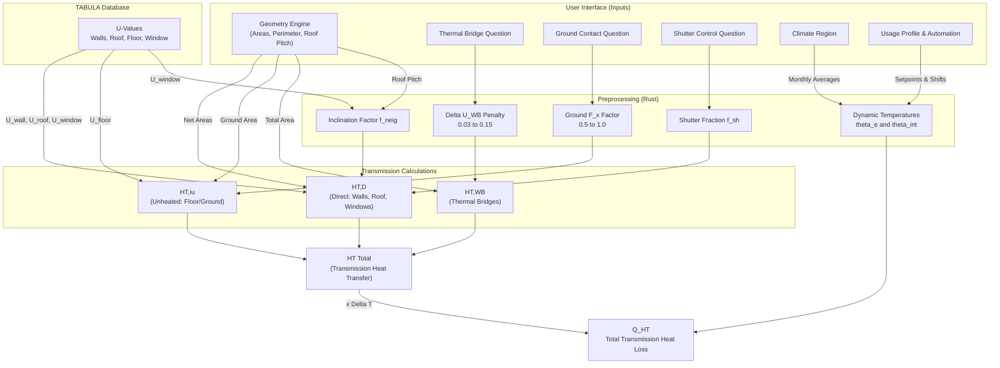

# Source: Internal Heat Gains.md


# Internal Heat Gains Calculation Engine

This document explains the physics and logic used in the Rust calculation engine (`lib.rs` / `internal_gains` module) to compute the building's internal heat gains ($Q_I$) and sinks according to DIN/TS 18599-2:2025-10 (Section 6.5) and DIN V 18599-10.

## 1. Data Flow & Architecture

The internal gains engine calculates the "free" heat generated inside the building (sources) and the heat actively removed by specific equipment (sinks). The engine supports two parallel pathways:

1. **The Standardized Method (DIN 18599-2 / 6.5):** Uses generic flat rates ($W/m^2$) based on usage profiles, handles material transport mass flows, and adjusts for exhaust-air lighting systems. Required for official Energy Certificates.
2. **The Detailed Custom Method:** Allows users to define the exact number of people and specific electrical equipment in a room for precise load sizing.

```
flowchart TD
    %% UI Inputs
    subgraph UI ["User Interface (Inputs)"]
        G["Geometry Engine\n(A_NGF)"]
        Q1[Usage Profile\n(Standard Method)]
        Q2[Custom Inventory\n(Detailed Method)]
        Q3[Material Transport\n(Mass Flow, Temp)]
        Q4[Lighting System\n(Standard vs Exhaust)]
    end

    %% Database / Norms
    subgraph DB ["DIN 18599-10 & Physics"]
        Q_RES["Residential: q_I"]
        Q_NRES["Non-Res: q_I,p & q_I,app"]
        Q_SINK["Heat Sinks: q_I,sink,app"]
        MU_L["Room Load Factor (mu_l)"]
        C_MAT["Specific Heat Capacity (c)"]
    end

    %% Detailed Calculations
    subgraph Calc ["Energy Balances (Daily Q_I)"]
        Q_G["Q_I,source,G (Residential Combined)"]
        Q_P["Q_I,source,p (People)"]
        Q_APP["Q_I,source,app (Equipment Sources)"]
        Q_SINK_APP["Q_I,sink,app (Equipment Sinks)"]
        Q_GOODS["Q_I,source/sink,goods (Material)"]
        Q_L["Q_I,source,l (Lighting)"]
    end

    %% Final Output
    QI["Q_I Total\nTotal Net Internal Heat Gain"]

    Q1 --> Q_RES
    Q1 --> Q_NRES
    Q1 --> Q_SINK
    Q3 --> C_MAT
    Q4 --> MU_L

    G --> Q_G
    G --> Q_P
    G --> Q_APP
    G --> Q_SINK_APP

    Q_RES --> Q_G
    Q_NRES --> Q_P
    Q_NRES --> Q_APP
    Q_SINK --> Q_SINK_APP
    C_MAT --> Q_GOODS
    MU_L --> Q_L

    Q_G --> QI
    Q_P --> QI
    Q_APP --> QI
    Q_L --> QI
    Q_GOODS --> QI
    Q_SINK_APP --> |Subtract| QI
```

## 2. Inputs Required from the UI

### A. Automated Geometry

* `a_ngf`: Net floor area / Nettogrundfläche ($A_{NGF}$ in $m^2$).

### B. User Questions (Parameters)

| Mode               | UI Prompts                                               | Available Options                                                          | How Rust uses it                                                                        |
| ------------------ | -------------------------------------------------------- | -------------------------------------------------------------------------- | --------------------------------------------------------------------------------------- |
| **Standard** | "What is the primary usage?"                             | Residential, Office, Retail, etc.                                          | Fetches$q_{I,p}$,$q_{I,app}$, and$q_{I,sink,app}$from DIN 18599-10.               |
| **Standard** | "What kind of lighting fixtures are installed?"          | - Standard (No Exhaust)- Exhaust via Ceiling Cavity- Exhaust via Air Ducts | Maps to the$\mu_l$room load factor (1.0, 0.75, or 0.65) to reduce lighting heat gain. |
| **Material Transport** | "Are large amounts of cold or hot materials regularly brought into this space?" | Type (e.g., Frozen Goods, Metal) & Volume (None / Pallets / Truckloads) | Infers mass flow ($\dot{m}$) and $\Delta T$ based on typical material properties and volume. |
| **Detailed** | "How many people are usually in this room?"              | Number input                                                               | Multiplies count by standard metabolic heat (e.g., 80W).                                |
| **Detailed** | "Add electrical equipment"                               | Add item (Name, Watts, Duty Cycle)                                         | Multiplies item count by wattage and duty-cycle.                                        |

## 3. Core Calculations (DIN/TS 18599-2 Section 6.5)

### 3.1 Residential Buildings (Wohngebäude)

For residential buildings, heat from persons, equipment, and lighting must be bundled into a single generalized value ($q_I$). Cooling sinks are neglected.
**Formula (Eq. 126):**
$Q_{I,source,G} = q_I \cdot A_{NGF}$

### 3.2 Non-Residential Persons & Equipment (Arbeitshilfen)

For non-residential zones, heat sources are split.

* **Persons (Eq. 127):** $Q_{I,source,p} = q_{I,p} \cdot A_{NGF}$
* **Equipment Sources (Eq. 128):** $Q_{I,source,app} = q_{I,app} \cdot A_{NGF}$

 **Equipment Sinks (** $Q_{I,sink,app}$**):**
Equipment that generates cold internally but exhausts its heat *outside* the zone (e.g., supermarket refrigerated displays with external compressors) acts as a thermal sink.

* **Equipment Sinks (Eq. 129):** $Q_{I,sink,app} = q_{I,sink,app} \cdot A_{NGF}$

### 3.3 Material Transport (Stofftransport)

If materials/goods are brought into the zone at a temperature significantly different from the room temperature, they absorb or release heat.

* $\dot{m}$: Mass flow rate ($\dot{m} = m_{24} / 24$).
* $c$: Specific heat capacity of the material.
* **Source (Hot goods enter,** $\theta_{in} > \theta_{out}$**):** $Q_{I,source,goods} = c \cdot \dot{m} \cdot (\theta_{in} - \theta_{out}) \cdot t$ (Eq. 130)
* **Sink (Cold goods enter,** $\theta_{in} < \theta_{out}$**):** $Q_{I,sink,goods} = c \cdot \dot{m} \cdot (\theta_{out} - \theta_{in}) \cdot t$ (Eq. 131)

### 3.4 Artificial Lighting (Künstliche Beleuchtung)

The heat from lighting depends on the electrical energy demand ($Q_{l,f}$) from DIN 18599-4. If the building uses exhaust air luminaires ( *Abluftleuchten* ), a portion of the heat is immediately removed via the ventilation system, reducing the room load factor ($\mu_l$).

* **Lighting Heat (Eq. 132):** $Q_{I,source,l} = \mu_l \cdot Q_{l,f}$
  *(Without exhaust luminaires,* $\mu_l = 1.0$*)*

### 3.5 Custom Inventory Calculation (Detailed Method)

If the user defines exact items, we bypass the $q_I \cdot A_{NGF}$ calculation and calculate total Wattage ($\Phi_I$) directly.

* **Persons:** $\Phi_{I,p} = N_{people} \cdot \dot{Q}_{person}$ (e.g., 80W per person).
* **Equipment:** $\Phi_{I,eq} = \sum (N_{item} \cdot P_{item} \cdot f_{duty})$

## 4. Reference Data & Standard Values

### Table A: Standardized Heat Loads (DIN 18599-10)

This table extracts the precise values specified by DIN V 18599-10 for generating official and legally binding heating and cooling load profiles.

| Lfd. Nr. | Usage Profile (Nutzung)              | $q_{I,p}$ $[W/m^2]$ | $q_{I,app}$ $[W/m^2]$ | $q_{I,sink,app}$ $[W/m^2]$ | $t_{nutz}$ $[h/d]$ | $d_{nutz}$ $[d/a]$ |
| -------- | ------------------------------------ | ----------------------- | ------------------------- | ------------------------------ | ---------------------- | ---------------------- |
| -        | **Residential (Wohngebäude)** | *Combined 3.75*       | -                         | `0.0`                        | `24`                 | `365`                |
| 1        | Einzelbüro (Single Office)          | `4.50`                | `7.00`                  | `0.0`                        | `13`                 | `250`                |
| 2        | Gruppenbüro (Group Office)          | `5.00`                | `7.00`                  | `0.0`                        | `13`                 | `250`                |
| 3        | Großraumbüro (Open Plan Office)    | `6.00`                | `9.00`                  | `0.0`                        | `13`                 | `250`                |
| 4        | Besprechung, Seminar (Meeting)       | `15.00`               | `2.00`                  | `0.0`                        | `13`                 | `250`                |
| 6        | Einzelhandel/Kaufhaus (Retail)       | `7.00`                | `2.00`                  | `0.0`                        | `12`                 | `300`                |
| 7        | Einzelhandel (Lebensmittel/Kühl)    | `7.00`                | `2.00`                  | `10.0`                       | `12`                 | `300`                |
| 8        | Klassenzimmer (Classroom)            | `15.00`               | `2.00`                  | `0.0`                        | `12`                 | `250`                |
| 10       | Bettenzimmer (Hospital Room)         | `4.00`                | `2.00`                  | `0.0`                        | `24`                 | `365`                |
| 11       | Hotelzimmer (Hotel Room)             | `3.00`                | `2.00`                  | `0.0`                        | `24`                 | `365`                |
| 13       | Restaurant                           | `12.00`               | `5.00`                  | `0.0`                        | `14`                 | `365`                |
| 14       | Küchen (Commercial Kitchen)         | `5.00`                | `20.00`                 | `0.0`                        | `14`                 | `365`                |
| 21       | Rechenzentrum (Data Center)          | `1.00`                | `150.00`                | `0.0`                        | `24`                 | `365`                |
| 33       | Turnhalle (Gymnasium)                | `10.00`               | `0.00`                  | `0.0`                        | `14`                 | `300`                |
| 43       | Lagerhallen (Warehouse)              | `1.00`                | `1.00`                  | `0.0`                        | `14`                 | `250`                |

### Table B: Room Load Factor for Lighting ($\mu_l$)

| Lighting Exhaust Type                       | Room Load Factor$\mu_l$      |
| ------------------------------------------- | ------------------------------ |
| Standard Luminaires (No Exhaust)            | `1.0`                        |
| Abluftleuchten (Exhaust via Ceiling Cavity) | `0.75`(Average of 0.7 - 0.8) |
| Abluftleuchten (Exhaust via Air Ducts)      | `0.65`(Average of 0.6 - 0.7) |

## 5. Detailed Rust Implementation

This Rust architecture supports the strict separation required by DIN 18599-2, handling both sources, sinks, material flows, and explicitly categorized exhaust lighting.

```
// --- DATA MODELS ---

/// Represents the standard usage profile data derived strictly from DIN V 18599-10.
#[derive(Debug, Clone, Copy)]
pub struct StandardGainProfile {
    pub is_residential: bool,
    pub q_i_combined: f64, // Used only if residential (Eq. 126)
    pub q_i_p: f64,        // Heat from persons (W/m²)
    pub q_i_app: f64,      // Heat from equipment/work aids (W/m²)
    pub q_i_sink_app: f64, // Sinks from equipment (W/m²)
    pub t_nutz: f64,       // Daily usage hours (h/d)
    pub d_nutz: f64,       // Annual usage days (d/a)
}

impl StandardGainProfile {
    /// Factory method to load standard DIN 18599-10 profiles
    pub fn from_profile_id(id: u32) -> Self {
        match id {
            0 => Self { // 0 = Residential fallback
                is_residential: true,
                q_i_combined: 3.75,
                q_i_p: 0.0, q_i_app: 0.0, q_i_sink_app: 0.0,
                t_nutz: 24.0, d_nutz: 365.0,
            },
            1 => Self { // Einzelbüro
                is_residential: false, q_i_combined: 0.0,
                q_i_p: 4.50, q_i_app: 7.00, q_i_sink_app: 0.0,
                t_nutz: 13.0, d_nutz: 250.0,
            },
            3 => Self { // Großraumbüro
                is_residential: false, q_i_combined: 0.0,
                q_i_p: 6.00, q_i_app: 9.00, q_i_sink_app: 0.0,
                t_nutz: 13.0, d_nutz: 250.0,
            },
            4 => Self { // Besprechung
                is_residential: false, q_i_combined: 0.0,
                q_i_p: 15.00, q_i_app: 2.00, q_i_sink_app: 0.0,
                t_nutz: 13.0, d_nutz: 250.0,
            },
            7 => Self { // Einzelhandel (Kühl)
                is_residential: false, q_i_combined: 0.0,
                q_i_p: 7.00, q_i_app: 2.00, q_i_sink_app: 10.0,
                t_nutz: 12.0, d_nutz: 300.0,
            },
            8 => Self { // Klassenzimmer
                is_residential: false, q_i_combined: 0.0,
                q_i_p: 15.00, q_i_app: 2.00, q_i_sink_app: 0.0,
                t_nutz: 12.0, d_nutz: 250.0,
            },
            14 => Self { // Küchen (Gewerblich)
                is_residential: false, q_i_combined: 0.0,
                q_i_p: 5.00, q_i_app: 20.00, q_i_sink_app: 0.0,
                t_nutz: 14.0, d_nutz: 365.0,
            },
            21 => Self { // Rechenzentrum
                is_residential: false, q_i_combined: 0.0,
                q_i_p: 1.00, q_i_app: 150.00, q_i_sink_app: 0.0,
                t_nutz: 24.0, d_nutz: 365.0,
            },
            43 => Self { // Lagerhallen
                is_residential: false, q_i_combined: 0.0,
                q_i_p: 1.00, q_i_app: 1.00, q_i_sink_app: 0.0,
                t_nutz: 14.0, d_nutz: 250.0,
            },
            // Default generic non-residential fallback
            _ => Self {
                is_residential: false, q_i_combined: 0.0,
                q_i_p: 3.0, q_i_app: 3.0, q_i_sink_app: 0.0,
                t_nutz: 12.0, d_nutz: 250.0,
            }
        }
    }
}

/// Represents the transport of physical goods/materials in and out of the zone.
#[derive(Debug, Clone, Copy)]
pub struct MaterialTransport {
    pub c_specific_heat: f64, // c in Wh/(kg*K)
    pub m_dot: f64,           // mass flow rate (kg/h)
    pub theta_in: f64,        // Temperature of goods entering
    pub theta_out: f64,       // Temperature of goods leaving (usually room temp)
}

/// Categorizes the type of lighting exhaust based on DIN 18599-2 Table 13.
#[derive(Debug, Clone, Copy)]
pub enum LightingExhaustType {
    Standard,      // No exhaust, standard luminaires
    CeilingCavity, // Abluftleuchten über Deckenhohlraum
    AirDucts,      // Abluftleuchten über Luftleitung
}

impl LightingExhaustType {
    /// Returns the room load factor (mu_l) associated with the exhaust type.
    pub fn room_load_factor(&self) -> f64 {
        match self {
            Self::Standard => 1.0,
            Self::CeilingCavity => 0.75, // Average range (0.7 - 0.8)
            Self::AirDucts => 0.65,      // Average range (0.6 - 0.7)
        }
    }
}

/// Represents the artificial lighting system.
#[derive(Debug, Clone, Copy)]
pub struct LightingSystem {
    pub q_l_f_daily: f64,                 // Daily electrical energy demand for lighting (Wh)
    pub exhaust_type: LightingExhaustType, // Simplifies user input to specific categories
}

impl LightingSystem {
    /// Calculates the effective room load factor based on the system type.
    pub fn mu_l(&self) -> f64 {
        self.exhaust_type.room_load_factor()
    }
}

/// Represents the custom detailed inventory of a room.
#[derive(Debug, Clone)]
pub struct CustomInventoryProfile {
    pub num_people: u32,
    pub metabolic_rate_watts: f64,
    pub equipment_watts_active: f64, // Sum of (Count * Power * DutyCycle)
    pub t_nutz: f64,
}

// --- ENGINE ---

pub enum GainCalculationMethod {
    Standard(StandardGainProfile),
    Custom(CustomInventoryProfile),
}

/// The core engine struct to calculate total internal gains
pub struct InternalGainsEngine {
    pub a_ngf: f64, // Net floor area (m²)
    pub method: GainCalculationMethod,
    pub material_transport: Option<MaterialTransport>,
    pub lighting: LightingSystem,
}

impl InternalGainsEngine {
    pub fn new(
        a_ngf: f64, 
        method: GainCalculationMethod, 
        material_transport: Option<MaterialTransport>,
        lighting: LightingSystem
    ) -> Self {
        Self { a_ngf, method, material_transport, lighting }
    }

    /// Calculates the daily internal energy gains and sinks (Wh/day).
    pub fn daily_energy_balance_wh(&self) -> (f64, f64) {
        let mut total_sources_wh = 0.0;
        let mut total_sinks_wh = 0.0;

        match &self.method {
            GainCalculationMethod::Standard(profile) => {
                if profile.is_residential {
                    // Eq. 126: Combined residential source
                    total_sources_wh += (profile.q_i_combined * self.a_ngf) * profile.t_nutz;
                } else {
                    // Eq. 127 & 128: Split non-residential sources
                    total_sources_wh += (profile.q_i_p * self.a_ngf) * profile.t_nutz;
                    total_sources_wh += (profile.q_i_app * self.a_ngf) * profile.t_nutz;
                    // Eq. 129: Equipment sinks
                    total_sinks_wh += (profile.q_i_sink_app * self.a_ngf) * profile.t_nutz;
                }
            },
            GainCalculationMethod::Custom(inventory) => {
                // Custom wattage * hours
                let person_heat = (inventory.num_people as f64) * inventory.metabolic_rate_watts;
                total_sources_wh += (person_heat + inventory.equipment_watts_active) * inventory.t_nutz;
            }
        }

        // Eq. 132: Artificial Lighting (adjusted dynamically by mu_l)
        total_sources_wh += self.lighting.mu_l() * self.lighting.q_l_f_daily;

        // Eq. 130 & 131: Material Transport (Stofftransport)
        if let Some(mat) = &self.material_transport {
            // t = 24h as per the mass flow definition in standard
            let t = 24.0; 
            if mat.theta_in > mat.theta_out {
                // Eq. 130: Source
                total_sources_wh += mat.c_specific_heat * mat.m_dot * (mat.theta_in - mat.theta_out) * t;
            } else if mat.theta_in < mat.theta_out {
                // Eq. 131: Sink
                total_sinks_wh += mat.c_specific_heat * mat.m_dot * (mat.theta_out - mat.theta_in) * t;
            }
        }

        (total_sources_wh, total_sinks_wh)
    }

    /// Returns the net daily internal gain (Sources - Sinks)
    pub fn net_daily_gain_wh(&self) -> f64 {
        let (sources, sinks) = self.daily_energy_balance_wh();
        // Prevent negative gains from overturning the balance completely, 
        // though strictly DIN tracks them separately for heating vs cooling balances.
        f64::max(0.0, sources - sinks)
    }
}

## Simplified UI Data Mapping (The Daily Rhythm)

By asking chronological and physical questions, the user's brain can "walk through" their building, keeping the frontend conversational while the backend remains strictly DIN-compliant.

**Usage Profile & Automation Class**
Instead of asking for a specific DIN 18599-10 profile directly, we ask:
*   "What is the primary use of this space?" -> This maps to the usage profile (e.g., Residential, Office). This unlocks heating setpoints, usage hours, and internal heat gains.
*   "How do you control the heating in this space?" -> Maps to the Automation Class. For example, "Manual radiator knobs" translates to Class C, while "Smart Home system" translates to Class A or B, lowering the heating setpoint automatically in the engine.
```


# Source: Solar Heat Gains.md

# Solar Heat Gains Calculation Engine

This document explains the physics and logic used in the Rust calculation engine (`lib.rs` / `solar_gains` module) to compute the building's solar heat gains ($Q_S$) according to DIN/TS 18599-2:2025-10 (Section 6.4).

## 1. Data Flow & Architecture

The solar gains engine calculates how much solar energy enters the building. This is split into two distinct physical phenomena:

1. **Transparent Gains (** $Q_{s,w}$**):** Solar radiation passing directly through windows to heat the interior. This is heavily reduced by frames, dirty glass, angle of incidence, and shading devices.
2. **Opaque Gains & Sky Losses (** $Q_{s,op}$**):** Solar radiation warming the exterior walls/roofs, heavily offset by thermal radiation emitted from the building out into the cold night sky.

```
flowchart TD
    %% UI Inputs
    subgraph UI ["User Interface (Inputs)"]
        G["Geometry\n(Window Area, Wall Area)"]
        O["Orientation & Tilt\n(N, S, E, W, Roof)"]
        W["Window Properties\n(Glazing, Frame %)"]
        S["Shading Devices\n(Blinds, Awnings)"]
        C["Wall Color\n(Light, Medium, Dark)"]
    end

    %% Database / Norms
    subgraph DB ["DIN 18599 Physics & Climate"]
        I_S["Solar Irradiation I_s\n(Climate Data)"]
        F_W["Incidence Factor (F_w = 0.9)"]
        R_SE["Ext. Resistance (R_se = 0.04)"]
        SKY["Sky Radiation Loss\n(h_r * Delta theta_er)"]
    end

    %% Rust Engine Middle Layer
    subgraph PreCalc ["Preprocessing (Rust)"]
        EFF_A["Effective Collector Area\n(A_w * (1-F_F) * g * F_C)"]
        ALPHA["Solar Absorptance (alpha)"]
    end

    %% Detailed Calculations
    subgraph Calc ["Solar Energy Balances (Q_S)"]
        Q_W["Q_s,w\n(Transparent Gains)"]
        Q_OP["Q_s,op\n(Opaque Gains & Sky Losses)"]
    end

    %% Final Output
    QS["Q_S Total\nTotal Solar Heat Gain"]

    G --> EFF_A
    W --> EFF_A
    S --> EFF_A
    O --> I_S
    C --> ALPHA

    EFF_A --> Q_W
    I_S --> Q_W
    F_W --> Q_W

    G --> Q_OP
    I_S --> Q_OP
    ALPHA --> Q_OP
    R_SE --> Q_OP
    SKY --> Q_OP

    Q_W --> QS
    Q_OP --> QS
    QS --> |Add to Internal Gains| BALANCE["Total Building Heat Sources"]
```

## 2. Inputs Required from the UI

To accurately calculate solar gains, the UI must gather geometry and component properties mapped to their cardinal direction.

### A. Window Parameters (Transparent)

| UI Prompt                 | Determines                         | DIN Variable                           |
| ------------------------- | ---------------------------------- | -------------------------------------- |
| **"Window Area"**         | Total size of the opening ($m^2$)  | $A_w$                                  |
| **"Orientation & Tilt"**  | Dictates the sun exposure          | $I_s$                                  |
| **"Glazing Type"**        | Double, Triple, Solar Control      | $g$-value (Total Energy Transmittance) |
| **"Frame Material/Type"** | Thick vs. Thin frames              | $F_F$(Frame Fraction)                  |
| **"Shading Devices"**     | Exterior Blinds, Interior Curtains | $F_C$(Shading Reduction Factor)        |
| **"Surrounding Shadows"** | Overhangs, Neighboring Buildings   | $F_S$(Surroundings Shading Factor)     |

### B. Wall/Roof Parameters (Opaque)

| UI Prompt            | Determines                                 | DIN Variable                |
| -------------------- | ------------------------------------------ | --------------------------- |
| **"Wall/Roof Area"** | Total exposed surface ($m^2$)              | $A_{op}$                    |
| **"Surface Color"**  | Light (White), Medium (Brick), Dark (Grey) | $\alpha$(Solar Absorptance) |

## 3. Core Calculations (DIN/TS 18599-2 Section 6.4)

### 3.1 Transparent Solar Gains ($Q_{s,w}$)

This is the primary source of solar heating. The standard calculates the "Effective Solar Collecting Area" of the window and multiplies it by the irradiation.

**Formula:**
$Q_{s,w} = I_s \cdot A_w \cdot (1 - F_F) \cdot F_w \cdot g \cdot F_C \cdot F_S$

- $I_s$: Solar irradiation for the given orientation and time period ($Wh/m^2$ or $kWh/m^2$).
- $A_w$: Total area of the window ($m^2$).
- $(1 - F_F)$: Transparent glass fraction (subtracting the opaque frame $F_F$).
- $F_w$: Correction factor for non-perpendicular radiation (Standard default is `0.90`).
- $g$: Total solar energy transmittance of the glass.
- $F_C$: Shading factor from operable blinds/shades.
- $F_S$: Shading factor from fixed obstacles.

### 3.2 Opaque Solar Gains & Sky Radiation ($Q_{s,op}$)

The exterior envelope absorbs solar heat during the day, reducing transmission losses. However, it also constantly radiates heat outward into the cold sky (sky radiation). In winter, the sky radiation loss often exceeds the solar gain, making $Q_{s,op}$ a net negative (a heat sink).

**Formula:**
$Q_{s,op} = A_{op} \cdot U_{op} \cdot R_{se} \cdot (\alpha \cdot I_s - F_{sky} \cdot h_r \cdot \Delta\theta_{er} \cdot t)$

- $A_{op}$: Area of the opaque component (Wall/Roof).
- $U_{op}$: Thermal transmittance (U-value) of the component.
- $R_{se}$: External surface thermal resistance (Standard is `0.04` $m^2K/W$).
- $\alpha$: Solar absorptance coefficient of the surface color.
- $F_{sky}$: Form factor to the sky (`1.0` for horizontal roofs, `0.5` for vertical walls).
- $h_r$: External radiative heat transfer coefficient (Standard is `5.0` $W/m^2K$).
- $\Delta\theta_{er}$: Temperature difference between external air and apparent sky (Standard is `11 K`).
- $t$: Time period duration (hours).

  _(Note: Because this requires the U-value (_ $U_{op}$_), opaque solar gains are intrinsically linked to the Transmission calculations)._

## 4. Reference Data & Standard Values

To execute the logic, the engine relies on strict fallback parameters provided by DIN 18599.

### Table A: Standard Glazing $g$-Values

If exact manufacturer data is missing, DIN defaults apply:

| Glazing Type                     | $g$-value       |
| -------------------------------- | --------------- |
| Single Glazing                   | `0.85`          |
| Double Glazing (Standard)        | `0.75`          |
| Double Glazing (Low-E / Thermal) | `0.60`          |
| Triple Glazing (Low-E / Thermal) | `0.50`          |
| Solar Control Glass              | `0.30`to `0.40` |

### Table B: Frame Fraction ($F_F$)

The percentage of the window area that is opaque frame.

| Window Description                              | Frame Fraction ($F_F$)       |
| ----------------------------------------------- | ---------------------------- |
| Standard Window                                 | `0.30`(30% Frame, 70% Glass) |
| Very Large Windows / Glass Facades              | `0.20`                       |
| Small Windows / Divided panes (Sprossenfenster) | `0.40`                       |

### Table C: Shading Devices ($F_C$)

Operable shading heavily reduces solar penetration.

| Shading Device                         | Reduction Factor ($F_C$) |
| -------------------------------------- | ------------------------ |
| No Shading                             | `1.00`                   |
| Interior Curtains (White / Light)      | `0.80`                   |
| Interior Curtains (Dark)               | `0.60`                   |
| Exterior Blinds / Shutters (Rollladen) | `0.25`                   |
| Exterior Awnings (Markisen)            | `0.40`                   |

### Table D: Opaque Absorptance ($\alpha$)

How much sun the exterior walls/roof absorb based on color.

| Surface Color                      | Solar Absorptance ($\alpha$) |
| ---------------------------------- | ---------------------------- |
| Light (White, very light grey)     | `0.30`                       |
| Medium (Red brick, concrete, wood) | `0.60`                       |
| Dark (Dark grey, black roof tiles) | `0.90`                       |

## 5. Detailed Rust Implementation

This Rust architecture encapsulates the exact physics required by the standard, safely isolating transparent and opaque behaviors.

```
// --- CONSTANTS FROM DIN 18599 ---
const F_W_STANDARD: f64 = 0.90; // Correction for non-perpendicular radiation
const R_SE_STANDARD: f64 = 0.04; // External surface resistance (m²K/W)
const H_R_STANDARD: f64 = 5.0; // External radiative heat transfer coeff (W/m²K)
const DELTA_THETA_ER: f64 = 11.0; // Sky temperature difference (K)

// --- DATA MODELS ---

/// Represents a window or transparent surface.
#[derive(Debug, Clone)]
pub struct TransparentComponent {
    pub area: f64,          // A_w (m²)
    pub frame_fraction: f64, // F_F (e.g., 0.30)
    pub g_value: f64,       // Total energy transmittance (e.g., 0.60)
    pub f_c: f64,           // Shading device factor (e.g., 0.25 for ext. blinds)
    pub f_s: f64,           // Surroundings shading (e.g., 0.90)
    pub irradiation: f64,   // I_s (Wh/m² for the calculated time period)
}

impl TransparentComponent {
    /// Calculates the effective solar collecting area (m²)
    pub fn effective_collecting_area(&self) -> f64 {
        self.area * (1.0 - self.frame_fraction) * F_W_STANDARD * self.g_value * self.f_c * self.f_s
    }

    /// Calculates the total solar heat gain (Wh) for this time period
    pub fn solar_gain_wh(&self) -> f64 {
        self.irradiation * self.effective_collecting_area()
    }
}

/// Represents a wall or roof (opaque surface).
#[derive(Debug, Clone)]
pub struct OpaqueComponent {
    pub area: f64,          // A_op (m²)
    pub u_value: f64,       // U-value (W/m²K)
    pub alpha: f64,         // Solar absorptance (e.g., 0.60 for medium color)
    pub is_roof: bool,      // Determines F_sky (1.0 for roof, 0.5 for walls)
    pub irradiation: f64,   // I_s (Wh/m² for the calculated time period)
    pub time_hours: f64,    // Duration of the time period (h)
}

impl OpaqueComponent {
    /// Calculates the net solar gain (which is often negative due to sky radiation) in Wh
    pub fn solar_gain_wh(&self) -> f64 {
        let f_sky = if self.is_roof { 1.0 } else { 0.5 };

        // Solar energy absorbed by the surface
        let absorbed_solar = self.alpha * self.irradiation;

        // Energy lost to the cold night sky
        let sky_radiation_loss = f_sky * H_R_STANDARD * DELTA_THETA_ER * self.time_hours;

        // Net gain is converted into a building heat load via U-value and R_se
        self.area * self.u_value * R_SE_STANDARD * (absorbed_solar - sky_radiation_loss)
    }
}

// --- ENGINE ---

/// The core engine struct to calculate total solar gains
pub struct SolarGainsEngine {
    pub transparent_components: Vec<TransparentComponent>,
    pub opaque_components: Vec<OpaqueComponent>,
}

impl SolarGainsEngine {
    pub fn new() -> Self {
        Self {
            transparent_components: Vec::new(),
            opaque_components: Vec::new(),
        }
    }

    pub fn add_transparent(&mut self, comp: TransparentComponent) {
        self.transparent_components.push(comp);
    }

    pub fn add_opaque(&mut self, comp: OpaqueComponent) {
        self.opaque_components.push(comp);
    }

    /// Calculates the total solar heat gain (Q_S) for the entire envelope (Wh)
    pub fn total_solar_gain_wh(&self) -> f64 {
        let transparent_gain: f64 = self.transparent_components.iter()
            .map(|c| c.solar_gain_wh())
            .sum();

        let opaque_gain: f64 = self.opaque_components.iter()
            .map(|c| c.solar_gain_wh())
            .sum();

        // Total Solar Gain (Q_S)
        transparent_gain + opaque_gain
    }
}

// --- USAGE EXAMPLE ---
// let mut engine = SolarGainsEngine::new();
//
// // Add a South-facing Double-Glazed Window with Exterior Blinds
// engine.add_transparent(TransparentComponent {
//     area: 10.0,
//     frame_fraction: 0.30,
//     g_value: 0.60,
//     f_c: 0.25, // Exterior blinds
//     f_s: 1.00, // No surrounding shadows
//     irradiation: 45000.0, // e.g., 45 kWh/m² for a month
// });
//
// // Add a South-facing Medium-colored Brick Wall
// engine.add_opaque(OpaqueComponent {
//     area: 50.0,
//     u_value: 0.28,
//     alpha: 0.60, // Medium color
//     is_roof: false,
//     irradiation: 45000.0,
//     time_hours: 744.0, // Hours in a 31-day month
// });
//
// let q_s_total = engine.total_solar_gain_wh();
```


# Source: transmission.md

# Transmission Energy Calculation Engine

This document explains the physics and logic used in the Rust calculation engine (`lib.rs` / `transmission` module) to compute the building's transmission heat transfer coefficient ($H_T$) according to DIN V 18599-2 and ISO 13790.

## 1. Data Flow & Architecture

The calculation engine combines user inputs from the UI with pre-calculated archetype physics data from the **TABULA** database to compute the final transmission losses without overwhelming the user with overly complex physics inputs.



---

## 2. Inputs Required from the UI

To perform this calculation, the UI needs to provide two categories of data: **Automated Geometry** and **User Parameter Questions**.

### A. Automated Geometry (Calculated by the Sketchpad UI)

The UI dynamically calculates the shape of the building and provides these numbers:

- `net_wall`: Total exterior vertical wall area minus windows ($m^2$)
- `a_roof`: Total roof area ($m^2$)
- `a_ground`: Total ground/floor footprint area ($m^2$)
- `win_n`, `win_e`, `win_s`, `win_w`: Vertical window areas by direction ($m^2$)
- `win_h`: Horizontal/Roof window area ($m^2$)
- `roof_pitch_deg`: The slope angle of the roof (in degrees, 0 for flat).

### B. User Questions (Parameters)

The UI presents the following human-readable questions to determine the building physics context:

| Parameter Key             | UI Question / Prompt                                           | Available Options                                                                                                       | How Rust uses it                                                                                                                               |
| :------------------------ | :------------------------------------------------------------- | :---------------------------------------------------------------------------------------------------------------------- | :--------------------------------------------------------------------------------------------------------------------------------------------- |
| `thermal_bridge_category` | **"What is the thermal bridge planning standard?"**            | - Standard Default<br>- Good Planning<br>- Excellent Planning<br>- Internal Insulation Issues                           | Determines the $\Delta U_{WB}$ penalty (0.10, 0.05, 0.03, or 0.15).                                                                            |
| `ground_contact_type`     | **"What is below the lowest floor?"**                          | - Unheated Basement<br>- Floor Slab On Ground<br>- Heated Basement<br>- Ventilated Crawl Space<br>- Groundwater Contact | Maps to the $F_x$ temperature correction factor (e.g., 0.5 for standard unheated ground, 1.0 for groundwater).                                 |
| `shutter_control`         | **"How are window shutters controlled?"**                      | - Manual<br>- Automated<br>- None                                                                                       | Determines the shutter usage fraction ($f_{sh}$) which improves the effective window U-value ($U_{w,eff}$).                                    |
| `climate_region`          | **"In which climate region is the building located?"**         | 15 German Cities (e.g. Potsdam, Mannheim, Fichtelberg)                                                                  | Maps to a specific 12-month temperature profile to dynamically calculate the external average temperature ($\theta_e$) for the heating season. |
| `usage_profile`           | **"What is the primary usage of the building?"**               | - Residential<br>- Single Office<br>- Hospital Room<br>- Gymnasium<br>- etc.                                            | Establishes the baseline indoor heating setpoint ($\theta_{int}$) and determines the number of active heating days ($d_{hs}$).                 |
| `automation_class`        | **"What class of automation/smart thermostats is installed?"** | Class A, B, C, D                                                                                                        | Dynamically shifts the heating setpoint ($\theta_{int}$) down for smart energy-saving configurations (e.g., -1.5°C).                           |

---

## 3. The Core Calculations (Rust Logic)

Once the inputs and TABULA U-values are gathered, the engine executes three main equations:

### 1. Direct Transmission ($H_{T,D}$)

Calculates heat transfer directly touching the outside air.
**Components involved:** Exterior Walls, Roof, Windows.
**Formula:**
$H_{T,D} = \sum (A_j \cdot U_j \cdot f_{neig,j})$

_Rust Execution:_

- The engine creates dummy `BuildingComponent` instances for the wall and roof using the TABULA $U$-values.
- It infers `WindowGlazingType` (Single/Double/Triple) by inspecting the Tabula $U_{window}$ value.
- It calculates $f_{neig}$ (inclination factor) based on `roof_pitch_deg` and Glazing Type.
- It calculates $U_{w,eff}$ (effective window U-value) factoring in the `shutter_control` fraction ($f_{sh}$).

### 2. Transmission to Unheated Zones ($H_{T,iu}$)

Calculates heat transfer through components touching the ground or unheated rooms.
**Components involved:** Ground Floor / Basement Ceiling.
**Formula:**
$H_{T,iu} = \sum (A_j \cdot U_j \cdot F_{x,j})$

_Rust Execution:_

- The engine looks at `ground_contact_type` to find $F_x$. (e.g., "Unheated Basement" = 0.5).
- It multiplies the Tabula $U_{floor}$ by the Ground Area and the $F_x$ factor.

### 3. Thermal Bridges ($H_{T,WB}$)

Accounts for extra heat leaking through joints, corners, and structural intersections.
**Formula:**
$H_{T,WB} = \Delta U_{WB} \cdot \sum A_{total}$

_Rust Execution:_

- The engine uses `thermal_bridge_category` to determine the $\Delta U_{WB}$ penalty.
- It sums up the entire envelope area (Walls + Roof + Ground + Windows) and multiplies it by $\Delta U_{WB}$.

### 4. Total Transmission ($H_T$)

Finally, the three parts are summed together.
**Formula:**
$H_T = H_{T,D} + H_{T,iu} + H_{T,WB}$

This $H_T$ value is then passed into the broader ISO 13790 engine to calculate the final `Q_ht` (Total Heat Loss) alongside ventilation losses.

### 5. Dynamic Temperature Application ($Q_{ht}$)

The engine calculates the final heat loss in kWh/year using the specific Temperature Delta:
**Formula:**
$Q_{ht} = 0.024 \cdot H_T \cdot (\theta_{int} - \theta_e) \cdot d_{hs}$

_Rust Execution:_

- The engine maps `climate_region` to get the monthly temperatures and averages the 7 heating months to get $\theta_e$.
- The engine maps `usage_profile` to establish base $\theta_{int}$ and heating days $d_{hs}$.
- The engine maps `automation_class` to apply a precise energy-saving temperature shift to $\theta_{int}$.

---

## 4. Detailed Rust Code Walkthrough

This section breaks down how the physics logic is structurally implemented in the `transmission` module inside `lib.rs`.

### The Fundamental Data Structures

```rust
pub struct BuildingComponent {
    pub name: String,
    pub layers: Vec<Layer>,
    pub r_si: f64,
    pub r_se: f64,
    pub area: f64,
    pub f_neig: f64,
    pub f_x: f64,
}
```

- **Purpose:** Represents an opaque wall, roof, or floor.
- **How it works:** It natively calculates its U-value using the standard thermal resistance formula:
  $U = \frac{1}{R_T}$ where $R_T = R_{si} + \sum R_{layers} + R_{se}$

  The thermal resistance of each layer is calculated based on its thickness ($d$, in meters) and thermal conductivity ($\lambda$, in $W/(m \cdot K)$):
  $R_{layer} = \frac{d}{\lambda}$

  **Surface Resistances ($R_{si}$ and $R_{se}$):**
  DIN EN ISO 6946 dictates these constants. They almost never change unless the heat flow direction changes:
  - **External Walls (Horizontal heat flow):** $R_{si} = 0.13$, $R_{se} = 0.04$
  - **Roofs (Upward heat flow):** $R_{si} = 0.10$, $R_{se} = 0.04$
  - **Floors (Downward heat flow):** $R_{si} = 0.17$, $R_{se} = 0.04$

  _Note:_ Since we fetch exact U-values from TABULA, the engine bridges the gap by creating a "Dummy Layer" whose thickness mimics the exact TABULA thermal resistance ($R_{total} = 1.0 / U_{val}$), completely bypassing complex layer definitions for the user while preserving the DIN calculation structure.

  **Custom Insulation Overrides:**
  If the user chooses to define custom insulation for a component (adjusting only the material and thickness), the engine calculates the new U-value by fetching the "Existing State" (001 scenario) U-value from TABULA as the baseline, and then adds the thermal resistance of the custom insulation layer:
  $U_{new} = \frac{1}{\frac{1}{U_{existing}} + \frac{d}{\lambda}}$

  The UI provides four standard materials with their typical $\lambda$ values:
  1. **EPS (Expanded Polystyrene)**
     - **Use Case in TABULA:** The absolute standard for external wall insulation (ETICS/WDVS) in "Standard Refurbishment" scenarios.
     - **Standard Lambda ($\lambda$):** 0.035 - 0.040 W/(m·K)
  2. **Mineral Wool (Glass Wool / Rock Wool)**
     - **Use Case in TABULA:** The default choice for pitched roofs (between rafters), attic floors, and ventilated facades due to fire safety and acoustic properties.
     - **Standard Lambda ($\lambda$):** 0.035 - 0.040 W/(m·K)
  3. **XPS (Extruded Polystyrene)**
     - **Use Case in TABULA:** Used exclusively for ground-contact elements (perimeter insulation for basements, floor slabs) because it is moisture and pressure resistant.
     - **Standard Lambda ($\lambda$):** 0.035 W/(m·K)
  4. **PUR / PIR (Polyurethane / Polyisocyanurate Rigid Foam)**
     - **Use Case in TABULA:** Used in "Advanced Refurbishment" scenarios where high insulation is required but space is very limited (e.g., slim flat roofs or high-efficiency cavity walls).
     - **Standard Lambda ($\lambda$):** 0.022 - 0.028 W/(m·K)

```rust
pub struct WindowComponent {
    pub area: f64,
    pub u_w: f64,
    pub u_w_sh: f64,
    pub f_sh: f64,
    pub f_neig: f64,
    pub f_x: f64,
}
```

- **Purpose:** Represents transparent surfaces.
- **How it works:** It features an internal method `calculate_u_w_eff()` which dynamically blends the base U-value (`u_w`) with the shutter-closed U-value (`u_w_sh`) proportionally based on how often the user says shutters are used (`f_sh`).

### The Calculation Engine Functions

The core logic is broken into pure, side-effect-free functions that accept lists of these components:

1. **`calculate_h_t_d`**: Iterates through all `BuildingComponent`s and `WindowComponent`s. It filters exclusively for components that touch outside air directly (`f_x == 1.0`), multiplies their Area × U-Value × Inclination Factor (`f_neig`), and sums them up.
2. **`calculate_h_t_iu`**: Iterates through `BuildingComponent`s. It filters for components that touch unheated spaces or ground (`f_x < 1.0`), and multiplies their Area × U-Value × the specific Temperature Correction Factor (`f_x`) determined by the UI ground-contact question.
3. **`calculate_h_t_wb_simplified`**: A straightforward function that takes the flat penalty parameter (`delta_u_wb` selected by the UI thermal bridge question) and multiplies it by the absolute sum of all envelope areas.

### Engine Integration (`calculate_energy` inside `lib.rs`)

Inside the main `calculate_energy` loop, the program uses Rust's `match` blocks to convert the raw String parameters from the UI (`state.params`) directly into the strongly-typed Enums:

```rust
let f_x_ground = match state.params.ground_contact_type.as_str() {
    "Floor Slab On Ground" => 0.5,
    "Heated Basement" => 1.0,
    "Ventilated Crawl Space" => 0.8,
    // ...
```

````
Beyond geometry mapping, the engine dynamically calculates the temperature properties:
```rust
    // Calculate external temperature (theta_e) by averaging the heating months.
    let temps = region.monthly_temperatures();
    let heating_months_sum = temps[0] + temps[1] + temps[2] + temps[3] + temps[9] + temps[10] + temps[11];
    let theta_e = heating_months_sum / 7.0;

    // Calculate internal setpoint (theta_int)
    let base_temp = profile.heating_setpoint();
    let temp_shift = automation.temperature_shift(profile);
    let theta_int = f64::max(10.0, base_temp + temp_shift);
````

Once all values are mapped and calculated, it feeds the component arrays into the three `calculate_h_t` functions, sums them into `h_tr`, and applies the custom `theta_int - theta_e` delta to calculate the final `q_ht_tr` energy loss.

---

## DIN 18599 Reference Tables and Data

### Part 1: The Architecture of Transmission in DIN 18599

You cannot calculate transmission using just one document. The standard modularizes the logic:

1. **DIN/TS 18599-2 (The Physics Engine):** This document dictates _how_ to calculate transmission. It holds the core equations:
   - **Transmission Heat Sink (Loss):** **$Q_{T,sink} = H_T \cdot (\theta_i - \theta_e) \cdot t$** (when inside is warmer).
   - **Transmission Heat Source (Gain):** **$Q_{T,source} = H_T \cdot (\theta_e - \theta_i) \cdot t$** (when outside is warmer).
   - **Total Heat Transfer Coefficient:** **$H_T = H_{T,D} \text{ (Direct)} + H_{T,iu} \text{ (Unheated)} + H_{T,g} \text{ (Ground)} + H_{T,WB} \text{ (Bridges)}$**.
2. **DIN/TS 18599-10 (The Boundary Conditions):** This document dictates _when_ and _under what conditions_ transmission happens. It provides the exact temperatures (**$\theta$**) and the operating times (**$t$**).
3. **DIN/TS 18599-1 (The Geometry):** Dictates the raw sizes (Areas and Lengths) of the building.
4. **External ISO Norms (The Materials):** The DIN 18599 series _does not_ tell you how insulating a brick wall is. You must calculate U-values and Psi-values using external norms (ISO 6946, 10077, 10211).

### Part 2: The Master List of ALL Transmission Inputs

To write your software, your data model must collect all of the following parameters. I have categorized them by where your system must source them.

#### Category A: Architectural Geometry (Sourced via DIN 18599-1 / CAD Model)

These are the physical dimensions of the building envelope.

- **$A_j$ (Component Area):** The area in **$m^2$** of every wall, roof, window, and door facing the exterior, the ground, or an unheated space.
- **$l_j$ (Thermal Bridge Length):** The length in meters of every linear structural joint (e.g., balcony connections, window perimeters) if doing detailed thermal bridge calculations.
- **$P$ (Perimeter Length):** The exposed perimeter of the ground slab (required for ground transmission correction).

#### Category B: Material Thermal Properties (Sourced via External Norms)

These define how well the materials resist heat flow.

- **$U_j$ (Thermal Transmittance / U-Value):** Measured in **$W/(m^2K)$**. Sourced via DIN EN ISO 6946 (opaque elements) or DIN EN ISO 10077-1 (windows/doors).
- **$\Psi_j$ (Linear Thermal Transmittance / Psi-Value):** Measured in **$W/(mK)$**. The heat leak rate of a specific joint. Sourced via DIN EN ISO 10211 or DIN 4108 Beiblatt 2.
- **$R_s$ (Surface Thermal Resistances):** Fixed constants used in U-value calculations (**$0.04$** external, **$0.13$** internal walls).

#### Category C: Structural Correction Factors (Sourced via DIN 18599-2)

These factors mathematically adjust the raw U-values based on orientation, location, or dynamic elements.

- **$f_{neig,j}$ (Inclination Factor):** Adjusts window U-values based on tilt. Found in **Part 2, Table 7** (e.g., **$1.0$** for vertical, **$1.2$** for horizontal single glazing).
- **$F_x$ (Temperature Correction Factor):** Reduces heat loss calculations for components that don't face the harsh exterior directly. Found in **Part 2, Tables 5 & 6**.
  - Examples: **$0.8$** (Unheated Attic), **$0.5$** (Unheated Basement), **$0.35$** (Unheated Staircase).
- **$\Delta U_{WB}$ (Simplified Thermal Bridge Addition):** If you don't calculate exact lengths (**$l_j \cdot \Psi_j$**), you add a flat penalty to all U-values.
  - Values: **$0.10$** (Standard), **$0.05$** (Good planning), **$0.03$** (Excellent planning), **$0.15$** (Internal insulation issues).
- **$f_{sh}$ (Shutter Fraction):** The percentage of time a night-shutter is closed, improving the window's U-value (**$U_{w,eff}$**). Found in **Part 2, Annex G**.

#### Category D: Climate & Boundary Conditions (Sourced via DIN 18599-10)

These are the exact numerical triggers that drive the equations, dictating the **$\Delta T$** (temperature difference) and operating hours.

**1. Setpoint Temperatures (The targets):**

- **$\theta_{i,h,soll}$ (Heating Setpoint):** e.g., **$20^\circ C$** (Residential), **$21^\circ C$** (Office), **$15^\circ C$** (Heavy Industry).
- **$\theta_{i,c,soll}$ (Cooling Setpoint):** e.g., **$25^\circ C$** (Residential), **$24^\circ C$** (Office).
- **$\Delta\theta_{i,NA}$ (Setback Temp):** The allowed temperature drop during nights/weekends. Almost universally **$4.0 K$**.
- **Design Extremes:** **$\theta_{i,h,min}$** (e.g., **$20^\circ C$**) and **$\theta_{i,c,max}$** (e.g., **$26^\circ C$**) used only for sizing peak equipment loads.

**2. Building Automation (The smart offsets):**

- **$\Delta\theta_{EMS}$ (Automation Shift):** If the building has smart controls, the setpoints are artificially lowered to save energy calculation-wise.
  - Class A: **$-1.5 K$** to **$-2.0 K$** | Class B: **$-1.0 K$** | Class C/D: **$0.0 K$**.
- **$f_{adapt}$:** Multiplier for adaptive control (**$1.35$** for Classes A/B, **$1.0$** for C/D).

**3. External Climate:**

- **$\theta_e$ (Monthly External Temperature):** 12 specific values depending on the climate region (e.g., Region 4 Potsdam ranges from **$0.1^\circ C$** in Jan to **$18.4^\circ C$** in July).
- **$\theta_{e,min}$ (Winter Peak Design):** Fixed at **$-12^\circ C$**.

**4. Operating Times (The duration of heat flow):**

- **$t_{h,op,d}$ (Daily Heating Hours):** e.g., **$17 \text{ h/d}$** (Residential), **$13 \text{ h/d}$** (Offices).
- **$d_{nutz}$ (Usage Days per year):** e.g., **$365 \text{ d/a}$** (Residential), **$250 \text{ d/a}$** (Offices, meaning weekends are at setback temperatures).
- **$d_{mth}$ (Days per month):** Standard calendar days (28, 30, 31).

### Implementation Summary

To build the transmission module, your software needs to:

1. Load **Category A** (Geometry) and **Category B** (U-values) to calculate the static building shell **$H_T$**.
2. Apply the modifiers from **Category C** (DIN 18599-2) to adjust for unheated spaces and bridges.
3. Run a monthly loop using the temperatures and times from **Category D** (DIN 18599-10) to figure out exactly how many Watt-hours of energy transferred through that shell over the course of the year.

### The Transmission Formulas (from DIN/TS 18599-2)

#### 1. The Core Transmission Energy Balance (**$Q_T$**)

This calculates the actual energy (in Watt-hours or kWh) lost or gained through the envelope over a specific time period (usually a month).

- **Transmission Heat Sink (Loss - when heating is needed):**

  $$
  Q_{T,sink} = \sum H_{T,j} \cdot (\theta_i - \theta_e) \cdot t
  $$

  _(Calculated for all components **$j$** where **$\theta_i > \theta_e$**)_

- **Transmission Heat Source (Gain - when cooling is needed):**

  $$
  Q_{T,source} = \sum H_{T,j} \cdot (\theta_e - \theta_i) \cdot t
  $$

  _(Calculated for all components **$j$** where **$\theta_e > \theta_i$**)_

**$\theta_i$ (Indoor Target Temperature - Heating **$\theta_{i,h,soll}$** / Cooling **$\theta_{i,c,soll}$**):**

- _Where to find:_ **Table 5** (Residential):
  - **Heating Setpoint ($\theta_{i,h,soll}$):** 20.0 °C
  - **Cooling Setpoint ($\theta_{i,c,soll}$):** 25.0 °C
  - **Building Automation Shift ($\Delta\theta_{EMS}$):**
    - Class D (No automation): 0.0 K
    - Class C (Standard): -0.5 K
    - Class B (Advanced): -1.0 K
    - Class A (High Energy Performance): -1.5 K
- and **Table 7** (Non-Residential, depending on the usage profile 1-43):

| Lfd. Nr. | Nutzung (Usage Profile)             | Heating Temp. (°C) | Cooling Temp. (°C) | Automation Shift (Class D / C / B / A) |
| :------- | :---------------------------------- | :----------------- | :----------------- | :------------------------------------- |
| 1        | Einzelbüro                          | 21                 | 24                 | 0 K / 0 K / -1.0 K / -1.5 K            |
| 2        | Gruppenbüro (2-6 Plätze)            | 21                 | 24                 | 0 K / 0 K / -1.0 K / -1.5 K            |
| 3        | Großraumbüro (ab 7 Plätze)          | 21                 | 24                 | 0 K / 0 K / -1.0 K / -1.5 K            |
| 4        | Besprechung, Sitzung, Seminar       | 21                 | 24                 | 0 K / 0 K / -1.0 K / -1.5 K            |
| 5        | Schalterhalle                       | 21                 | 24                 | 0 K / 0 K / -1.0 K / -1.5 K            |
| 6        | Einzelhandel/Kaufhaus               | 21                 | 24                 | 0 K / 0 K / -1.5 K / -2.0 K            |
| 7        | Einzelhandel (Lebensmittel/Kühl)    | 21                 | 24                 | 0 K / 0 K / -1.5 K / -2.0 K            |
| 8        | Klassenzimmer, Gruppenraum          | 21                 | 24                 | 0 K / 0 K / -1.2 K / -2.0 K            |
| 9        | Hörsaal, Auditorium                 | 21                 | 24                 | 0 K / 0 K / -1.5 K / -2.0 K            |
| 10       | Bettenzimmer                        | 22                 | 24                 | 0 K / 0 K / -1.0 K / -1.5 K            |
| 11       | Hotelzimmer                         | 21                 | 24                 | 0 K / 0 K / -1.0 K / -1.5 K            |
| 12       | Kantine                             | 21                 | 24                 | 0 K / 0 K / -1.5 K / -2.0 K            |
| 13       | Restaurant                          | 21                 | 24                 | 0 K / 0 K / -1.5 K / -2.0 K            |
| 14       | Küchen in Nichtwohngebäuden         | 21                 | 24                 | 0 K / 0 K / -1.5 K / -2.0 K            |
| 15       | Küche - Vorbereitung, Lager         | 21                 | 24                 | 0 K / 0 K / -1.5 K / -2.0 K            |
| 16       | WC und Sanitärräume                 | 21                 | 24                 | 0 K / 0 K / -0.5 K / -1.0 K            |
| 17       | Sonstige Aufenthaltsräume           | 21                 | 24                 | 0 K / 0 K / -0.5 K / -1.0 K            |
| 18       | Nebenflächen (ohne Aufenthalt)      | 21                 | 24                 | 0 K / 0 K / -0.5 K / -1.0 K            |
| 19       | Verkehrsflächen                     | 21                 | 24                 | 0 K / 0 K / -0.5 K / -1.0 K            |
| 20       | Lager, Technik, Archive             | 21                 | 24                 | 0 K / 0 K / -0.5 K / -1.0 K            |
| 21       | Rechenzentrum                       | 21                 | 24                 | 0 K / 0 K / -0.5 K / -0.5 K            |
| 22       | Gewerbliche Halle - schwere Arbeit  | 15                 | 28                 | 0 K / 0 K / -1.2 K / -1.8 K            |
| 23       | Gewerbliche Halle - mittelschwere   | 17                 | 26                 | 0 K / 0 K / -1.2 K / -1.8 K            |
| 24       | Gewerbliche Halle - leichte Arbeit  | 20                 | 24                 | 0 K / 0 K / -1.2 K / -1.8 K            |
| 25       | Zuschauerbereich (Theater/Veranst.) | 21                 | 24                 | 0 K / 0 K / -0.5 K / -1.0 K            |
| 26       | Foyer (Theater/Veranstaltungen)     | 21                 | 24                 | 0 K / 0 K / -0.3 K / -0.5 K            |
| 27       | Bühne (Theater/Veranstaltungen)     | 21                 | 24                 | 0 K / 0 K / -0.3 K / -0.5 K            |
| 28       | Messe/Kongress                      | 21                 | 24                 | 0 K / 0 K / -1.5 K / -2.0 K            |
| 29       | Ausstellungsräume / Museum          | 21                 | 24                 | 0 K / 0 K / -0.75 K / -1.25 K          |
| 30       | Bibliothek - Lesesaal               | 21                 | 24                 | 0 K / 0 K / -0.5 K / -1.0 K            |
| 31       | Bibliothek - Freihandbereich        | 21                 | 24                 | 0 K / 0 K / -0.5 K / -1.0 K            |
| 32       | Bibliothek - Magazin und Depot      | 21                 | 24                 | 0 K / 0 K / -0.5 K / -1.0 K            |
| 33       | Turnhalle (ohne Zuschauer)          | 19                 | 24                 | 0 K / 0 K / -0.5 K / -1.0 K            |
| 34       | Parkhäuser (Büro/Privat)            | 21                 | 24                 | 0 K / 0 K / -0.5 K / -1.0 K            |
| 35       | Parkhäuser (öffentlich)             | 21                 | 24                 | 0 K / 0 K / -0.5 K / -1.0 K            |
| 36       | Saunabereich                        | 24                 | None               | 0 K / 0 K / -0.5 K / -1.0 K            |
| 37       | Fitnessraum                         | 20                 | 24                 | 0 K / 0 K / -0.5 K / -1.0 K            |
| 38       | Labor                               | 22                 | 24                 | 0 K / 0 K / -0.5 K / -1.0 K            |
| 39       | Untersuchungs-/Behandlungsräume     | 22                 | 24                 | 0 K / 0 K / -0.5 K / -1.0 K            |
| 40       | Spezialpflegebereiche               | 24                 | 24                 | 0 K / 0 K / -0.5 K / -1.0 K            |
| 41       | Flure des Pflegebereichs            | 22                 | 24                 | 0 K / 0 K / -0.5 K / -1.0 K            |
| 42       | Arztpraxen/Therapeutische Praxen    | 22                 | 24                 | 0 K / 0 K / -0.5 K / -1.0 K            |
| 43       | Lagerhallen, Logistikhallen         | 12                 | 26                 | 0 K / 0 K / -0.5 K / -1.0 K            |

- _Details:_ Must be adjusted by the Building Automation shift ( **$\Delta\theta_{EMS}$** ) found in **Table 5/9**.

**$\theta_e$ (External Climate Temperature):**

- _Where to find:_ **Annex E, Table E.1**.
- _Details:_ Provides the 12 monthly average external temperatures for 15 German climate regions.

| Region | Referenzort            | Jan  | Feb  | Mrz  | Apr  | Mai  | Jun  | Jul  | Aug  | Sep  | Okt  | Nov  | Dez  | Jahreswert |
| :----- | :--------------------- | :--- | :--- | :--- | :--- | :--- | :--- | :--- | :--- | :--- | :--- | :--- | :--- | :--------- |
| 1      | Bremerhaven            | 2,9  | 3,2  | 5,4  | 9,0  | 13,1 | 16,0 | 17,9 | 18,2 | 15,0 | 10,6 | 6,1  | 3,2  | 10,1       |
| 2      | Rostock                | 2,3  | 2,4  | 4,3  | 8,0  | 12,4 | 15,6 | 18,0 | 18,0 | 14,7 | 10,2 | 5,5  | 2,6  | 9,5        |
| 3      | Hamburg                | 2,5  | 2,7  | 4,9  | 8,5  | 12,8 | 15,5 | 17,8 | 17,8 | 14,1 | 9,8  | 5,1  | 2,3  | 9,5        |
| 4      | Potsdam (Referenz)     | 1,0  | 1,9  | 4,7  | 9,2  | 14,1 | 16,7 | 19,0 | 18,6 | 14,3 | 9,5  | 4,1  | 0,9  | 9,5        |
| 5      | Essen                  | 3,1  | 3,5  | 6,6  | 9,5  | 13,7 | 15,9 | 18,2 | 18,2 | 14,6 | 10,8 | 6,1  | 3,5  | 10,4       |
| 6      | Bad Marienberg         | 0,1  | 0,5  | 3,6  | 7,0  | 11,5 | 14,0 | 16,1 | 16,0 | 12,3 | 8,1  | 3,2  | 0,6  | 7,8        |
| 7      | Kassel                 | 1,0  | 2,1  | 5,2  | 8,8  | 13,3 | 15,9 | 18,1 | 17,8 | 13,7 | 9,5  | 4,5  | 1,7  | 9,3        |
| 8      | Braunlage              | -0,8 | -0,3 | 2,1  | 5,7  | 10,5 | 12,9 | 15,0 | 15,0 | 11,1 | 7,1  | 2,3  | -0,2 | 6,7        |
| 9      | Chemnitz               | 0,5  | 1,0  | 3,9  | 8,2  | 12,9 | 15,5 | 17,5 | 17,6 | 13,2 | 9,2  | 3,8  | 0,8  | 8,7        |
| 10     | Hof                    | -1,2 | -0,4 | 2,8  | 6,6  | 11,7 | 14,5 | 16,3 | 16,6 | 12,0 | 7,6  | 2,3  | -0,7 | 7,4        |
| 11     | Fichtelberg            | -3,3 | -3,5 | -1,3 | 2,3  | 7,4  | 9,8  | 12,2 | 12,4 | 8,1  | 4,4  | -0,6 | -2,8 | 3,8        |
| 12     | Mannheim               | 2,4  | 3,6  | 7,1  | 10,6 | 15,6 | 18,1 | 20,1 | 20,2 | 15,7 | 11,0 | 5,7  | 3,1  | 11,1       |
| 13     | Passau                 | -1,2 | 0,4  | 4,3  | 8,2  | 13,7 | 16,4 | 18,0 | 17,8 | 13,1 | 8,7  | 3,0  | -0,2 | 8,6        |
| 14     | Stötten                | -0,5 | 0,3  | 3,4  | 6,8  | 11,8 | 14,4 | 16,6 | 16,7 | 12,3 | 8,5  | 2,6  | -0,2 | 7,8        |
| 15     | Garmisch-Partenkirchen | -2,3 | -0,5 | 3,2  | 7,0  | 11,8 | 14,8 | 16,6 | 16,4 | 12,3 | 8,4  | 1,9  | -1,8 | 7,4        |

##### Design Extremes for Equipment Sizing ($\theta_{e,min}$ and $\theta_{e,max}$)

While the monthly averages (Table E.1) are used to calculate the annual energy demand ($kWh/a$), you cannot use them to calculate the peak load ($kW$) required to size the actual heating boiler or chiller.

For maximum load calculations, Table 12 provides the extreme single-day external temperatures:

- **Design Temperature for Heating ($\theta_{e,min}$):** $-12.0\ ^\circ\text{C}$ (Used universally for the winter design day in January to calculate maximum heating load).
- **Design Temperatures for Cooling ($\theta_{e,max}$):**
  - $25.0\ ^\circ\text{C}$ (Used for the summer design day in July).
  - $20.3\ ^\circ\text{C}$ (Used for the autumn design day in September).
    _(Note: The maximum cooling design temperature is relatively mild ($25.0\ ^\circ\text{C}$) because DIN 18599 balances it against simultaneous extreme solar radiation ($I_{S,max}$) of up to $927\ \text{W/m}^2$ on the same day. The combination of $25\ ^\circ\text{C}$ ambient air plus max solar gain produces the peak cooling demand)._

**$t$ (Operating Time/Duration):**

- _Where to find:_ Derived from **$d_{nutz}$** (Usage days) and **$t_{h,op,d}$** (Daily operating hours) found in **Table 5** (Res) and **Table 6** (Non-Res). Also requires **$d_{mth}$** (Days per month) from **Table 11**.

1. **Days per Month ($d_{mth}$) - From Table 11**
   These are the standard calendar days used to determine the total hours available in a given month. The standard assumes a non-leap year (365 days).
   - Jan: 31 | Feb: 28 | Mar: 31 | Apr: 30 | May: 31 | Jun: 30
   - Jul: 31 | Aug: 31 | Sep: 30 | Oct: 31 | Nov: 30 | Dec: 31
   - Total hours in a month: $t_{mth} = d_{mth} \times 24 \text{ hours}$ (e.g., January = 744 hours).

2. **Residential Buildings (Wohngebäude) - From Table 5**
   For any residential building, the operating times are strictly fixed to one profile:
   - Usage days per year ($d_{nutz,a}$): 365 days
   - Daily heating/cooling operation ($t_{h,op,d}$): 17 hours/day
   - _Application:_ This means a residential home is fully heated for 17 hours a day, 7 days a week. The remaining 7 hours of the day are calculated using the setback temperature ($\Delta\theta_{i,NA} = 4\text{ K}$).

3. **Non-Residential Buildings (Nichtwohngebäude) - From Table 6**
   For non-residential buildings, the operating times depend entirely on the usage profile. I have extracted the Usage Days per Year ($d_{nutz,a}$) and the Daily Heating Operation Hours ($t_{h,op,d}$) for all 43 profiles.
   _(Note: The daily heating operation time $t_{h,op,d}$ in the standard already includes the necessary pre-heating and post-heating times required to bring the building up to temperature before people arrive)._

| Lfd. Nr. | Nutzung (Usage Profile)             | Usage Days / Year (d_nutz) | Daily Heating Hours (t_h,op,d) |
| :------- | :---------------------------------- | :------------------------- | :----------------------------- |
| 1        | Einzelbüro                          | 250                        | 13                             |
| 2        | Gruppenbüro (2-6 Plätze)            | 250                        | 13                             |
| 3        | Großraumbüro (ab 7 Plätze)          | 250                        | 13                             |
| 4        | Besprechung, Sitzung, Seminar       | 250                        | 13                             |
| 5        | Schalterhalle                       | 250                        | 13                             |
| 6        | Einzelhandel/Kaufhaus               | 300                        | 12                             |
| 7        | Einzelhandel (Lebensmittel/Kühl)    | 300                        | 12                             |
| 8        | Klassenzimmer, Gruppenraum          | 250                        | 12                             |
| 9        | Hörsaal, Auditorium                 | 250                        | 12                             |
| 10       | Bettenzimmer (Krankenhaus)          | 365                        | 24                             |
| 11       | Hotelzimmer                         | 365                        | 24                             |
| 12       | Kantine                             | 250                        | 12                             |
| 13       | Restaurant                          | 365                        | 14                             |
| 14       | Küchen in Nichtwohngebäuden         | 365                        | 14                             |
| 15       | Küche - Vorbereitung, Lager         | 365                        | 14                             |
| 16       | WC und Sanitärräume                 | 250                        | 13                             |
| 17       | Sonstige Aufenthaltsräume           | 250                        | 13                             |
| 18       | Nebenflächen (ohne Aufenthalt)      | 250                        | 13                             |
| 19       | Verkehrsflächen                     | 250                        | 13                             |
| 20       | Lager, Technik, Archive             | 250                        | 13                             |
| 21       | Rechenzentrum                       | 365                        | 24                             |
| 22       | Gewerbliche Halle - schwere Arbeit  | 250                        | 14                             |
| 23       | Gewerbliche Halle - mittelschwere   | 250                        | 14                             |
| 24       | Gewerbliche Halle - leichte Arbeit  | 250                        | 14                             |
| 25       | Zuschauerbereich (Theater/Veranst.) | 200                        | 10                             |
| 26       | Foyer (Theater/Veranstaltungen)     | 200                        | 10                             |
| 27       | Bühne (Theater/Veranstaltungen)     | 200                        | 10                             |
| 28       | Messe/Kongress                      | 200                        | 14                             |
| 29       | Ausstellungsräume / Museum          | 300                        | 12                             |
| 30       | Bibliothek - Lesesaal               | 300                        | 13                             |
| 31       | Bibliothek - Freihandbereich        | 300                        | 13                             |
| 32       | Bibliothek - Magazin und Depot      | 300                        | 13                             |
| 33       | Turnhalle (ohne Zuschauer)          | 300                        | 14                             |
| 34       | Parkhäuser (Büro/Privat)            | 250                        | 13                             |
| 35       | Parkhäuser (öffentlich)             | 300                        | 14                             |
| 36       | Saunabereich                        | 365                        | 14                             |
| 37       | Fitnessraum                         | 365                        | 14                             |
| 38       | Labor                               | 250                        | 13                             |
| 39       | Untersuchungs-/Behandlungsräume     | 250                        | 13                             |
| 40       | Spezialpflegebereiche               | 365                        | 24                             |
| 41       | Flure des Pflegebereichs            | 365                        | 24                             |
| 42       | Arztpraxen/Therapeutische Praxen    | 250                        | 12                             |
| 43       | Lagerhallen, Logistikhallen         | 250                        | 14                             |

#### 2. The Overall Transmission Heat Transfer Coefficient (**$H_T$**)

This formula sums up the "leakiness" of the entire building envelope (in W/K).

$$
H_T = H_{T,D} + \sum(F_{x,j} \cdot H_{T,iu,j}) + H_{T,WB}
$$

**$F_x$ (Temperature Correction Factor):**

- _Where to find:_ **Table 5** (Unheated rooms) and **Table 6** (Ground slabs/basements).
- _Details:_ e.g., **$F_x = 0.8$** for unheated attics, **$F_x = 0.5$** for unheated basements.

- **Table 5: Unheated Spaces ($F_x$ für unbeheizte Räume):**

  | Lfd. Nr. | Art des angrenzenden unbeheizten Raumes (Type of Unheated Space)    | F_x Factor |
  | :------- | :------------------------------------------------------------------ | :--------- |
  | 1        | Dachraum (Unheated Attic / Roof space)                              | 0.8        |
  | 2        | Unbeheizter Glasvorbau / Wintergarten (Unheated Sunspace)           | 0.8        |
  | 3        | Kriechkeller, stark belüftet (Crawl space, heavily ventilated)      | 0.8        |
  | 4        | Angrenzender unbeheizter Raum (Standard adjacent unheated room)     | 0.5        |
  | 5        | Unbeheizter Keller (Unheated Basement, general)                     | 0.5        |
  | 6        | Treppenhaus, außenliegend (Staircase with large exterior walls)     | 0.5        |
  | 7        | Kriechkeller, unbelüftet (Crawl space, unventilated)                | 0.5        |
  | 8        | Treppenhaus, innenliegend (Staircase mostly surrounded by building) | 0.35       |

- **Table 6: Ground Contact ($F_x$ für Bauteile gegen Erdreich):**

  | Lfd. Nr. | Bauteil gegen Erdreich (Component against the ground)              | F_x Factor |
  | :------- | :----------------------------------------------------------------- | :--------- |
  | 1        | Bodenplatte auf Erdreich (Floor slab directly on ground)           | 0.5        |
  | 2        | Wände gegen Erdreich, < 1,5m Tiefe (Basement walls, shallow depth) | 0.5        |
  | 3        | Wände gegen Erdreich, > 1,5m Tiefe (Basement walls, deep depth)    | 0.5        |
  | 4        | Fußboden des beheizten Kellers (Floor of a heated basement)        | 0.5        |
  | 5        | Bauteile gegen Grundwasser (Components touching groundwater)       | 1.0        |

#### 3. Direct Transmission to Exterior (**$H_{T,D}$**)

Calculates heat transfer through walls, roofs, and windows directly touching the outside air.

$$
H_{T,D} = \sum (f_{neig,j} \cdot U_j \cdot A_j)
$$

**$f_{neig,j}$ (Inclination Factor):**

- _Where to find:_ **Table 7** (18599-2)
- _Details:_ Adjusts window U-values based on their tilt angle (**$0^\circ$** to **$90^\circ$**) and glazing type (single, double, triple). Default is **$1.0$** for opaque walls.

- **Table 7: Inclination Factor ($f_{neig,j}$):**

  | Neigung (Grad °) | Einfachglas (Single) | Zweifachglas (Double) | Dreifachglas (Triple) \* |
  | :--------------- | :------------------- | :-------------------- | :----------------------- |
  | 0° (Horizontal)  | 1,25                 | 1,21                  | 1,20                     |
  | 15°              | 1,21                 | 1,22                  | 1,16                     |
  | 30°              | 1,19                 | 1,21                  | 1,13                     |
  | 45°              | 1,21                 | 1,15                  | 1,07                     |
  | 60°              | 1,00                 | 1,13                  | 1,05                     |
  | 75°              | 1,00                 | 1,08                  | 1,02                     |
  | 90° (Vertikal)   | 1,00                 | 1,00                  | 1,00                     |

##### 1. Das mathematische Prinzip

Der U-Wert ist der Kehrwert des gesamten Wärmedurchgangswiderstands ($R_T$):

$$
U = \frac{1}{R_T}
$$

Der gesamte Wärmedurchgangswiderstand setzt sich aus den Schichtwiderständen und den Übergangswiderständen zusammen:

$$
R_T = R_{si} + \sum \left( \frac{d_i}{\lambda_i} \right) + R_{se}
$$

Dabei ist:

- $d_i$: Dicke der Schicht $i$ in Metern ($m$).
- $\lambda_i$: Wärmeleitfähigkeit des Materials der Schicht $i$ in $W/(m \cdot K)$.
- $R_{si}, R_{se}$: Übergangswiderstände (konstant, wie von dir genannt).

#### 4. Transmission to Unheated Spaces (**$H_{T,iu}$**)

Calculates heat transfer through walls/floors touching unheated rooms (like attics or basements) or the ground.

$$
H_{T,iu} = \sum (U_j \cdot A_j)
$$

_(Note: To get the effective heat transfer, this is multiplied by the temperature correction factor **$F_x$** as shown in Formula 2)._

```rust
pub struct Material {
    pub name: String,
    pub lambda: f64, // Wärmeleitfähigkeit W/(m*K)
}

pub struct Layer {
    pub material: Material,
    pub thickness: f64, // Dicke in Metern
}

pub struct BuildingComponent {
    pub layers: Vec<Layer>,
    pub r_si: f64, // Standard 0.13
    pub r_se: f64, // Standard 0.04
}

impl BuildingComponent {
    // Berechnet den U-Wert basierend auf der aktuellen Dicke aller Schichten
    pub fn calculate_u_value(&self) -> f64 {
        let sum_r: f64 = self.layers.iter()
            .map(|l| l.thickness / l.material.lambda)
            .sum();

        let r_t = self.r_si + sum_r + self.r_se;
        1.0 / r_t
    }
}

impl BuildingComponent {
    pub fn calculate_u_value_internal(&self) -> f64 {
        // Bei Innenbauteilen: R_se wird zu R_si (meist 0.13 + 0.13)
        let sum_r: f64 = self.layers.iter()
            .map(|l| l.thickness / l.material.lambda)
            .sum();

        let r_t = self.r_si + sum_r + self.r_si;
        1.0 / r_t
    }
}
```

#### 5. Thermal Bridges (**$H_{T,WB}$**)

Calculates the extra heat lost through structural joints (balconies, window frames, corners). The standard allows for two calculation methods.

- **Simplified Method (Flat Addition):**
  $$
  H_{T,WB} = \Delta U_{WB} \cdot \sum A_j
  $$

**$\Delta U_{WB}$ (Simplified Thermal Bridge Penalty):**

- _Where to find:_ **Section 6.1.4 (Text categories)** (18599-2)
- _Details:_ Flat values of **$0.10$** (default), **$0.05$**, **$0.03$**, or **$0.15 W/(m^2K)$** depending on the construction quality and adherence to DIN 4108 Beiblatt 2.

| Penalty Value ($\Delta U_{WB}$) | Construction Condition / Requirement (Anwendungsbedingung)                                                                                                                                                 |
| :------------------------------ | :--------------------------------------------------------------------------------------------------------------------------------------------------------------------------------------------------------- |
| 0.15 W/(m²K)                    | Increased Penalty: Must be used for buildings with internal insulation (Innendämmung) where solid floor ceilings intersect the exterior wall without thermal separation, creating massive thermal bridges. |
| 0.10 W/(m²K)                    | Standard Default (Ohne Nachweis): Used when no special thermal bridge planning is done, or if the construction details do not conform to the standard examples provided in DIN 4108 Beiblatt 2.            |
| 0.05 W/(m²K)                    | Good Planning (Kategorie A): Allowed only if it is explicitly proven that all thermal bridges in the building match the standard, energy-optimized design examples shown in DIN 4108 Beiblatt 2.           |
| 0.03 W/(m²K)                    | Excellent Planning (Kategorie B): Allowed only if proven that all thermal bridges match the highly-insulated, premium design examples (Category B) defined in DIN 4108 Beiblatt 2.                         |

#### 6. Effective Thermal Transmittance for Windows with Shutters (**$U_{w,eff}$**)

If a window has a night shutter, its **$U$**-value improves dynamically based on how long the shutter is closed.

$$
U_{w,eff} = U_w \cdot (1 - f_{sh}) + U_{w,sh} \cdot f_{sh}
$$

**$f_{sh}$ (Shutter Usage Fraction):**

- _Where to find:_ **Annex G, Tables G.1, G.2, G.3** (18599-2)
- _Details:_ The fraction of the day the shutter is closed, depending on the automation control type.

- **Table G.1: Residential Buildings (Wohngebäude):**

  | Monat (Month) | f_sh : Manuell (Manual Control) | f_sh : Automatisch (Automated / Motorized) |
  | :------------ | :------------------------------ | :----------------------------------------- |
  | Januar        | 0,43                            | 0,61                                       |
  | Februar       | 0,38                            | 0,54                                       |
  | März          | 0,32                            | 0,45                                       |
  | April         | 0,25                            | 0,36                                       |
  | Mai           | 0,20                            | 0,28                                       |
  | Juni          | 0,16                            | 0,23                                       |
  | Juli          | 0,18                            | 0,25                                       |
  | August        | 0,23                            | 0,33                                       |
  | September     | 0,29                            | 0,42                                       |
  | Oktober       | 0,37                            | 0,53                                       |
  | November      | 0,42                            | 0,60                                       |
  | Dezember      | 0,45                            | 0,64                                       |

- **Table G.2 & G.3: Non-Residential Buildings (Nichtwohngebäude):**

  | Monat (Month) | f_sh : Non-Residential (Manual) | f_sh : Non-Residential (Automated / BMS) |
  | :------------ | :------------------------------ | :--------------------------------------- |
  | Januar        | 0,00                            | 0,61                                     |
  | Februar       | 0,00                            | 0,54                                     |
  | März          | 0,00                            | 0,45                                     |
  | April         | 0,00                            | 0,36                                     |
  | Mai           | 0,00                            | 0,28                                     |
  | Juni          | 0,00                            | 0,23                                     |
  | Juli          | 0,00                            | 0,25                                     |
  | August        | 0,00                            | 0,33                                     |
  | September     | 0,00                            | 0,42                                     |
  | Oktober       | 0,00                            | 0,53                                     |
  | November      | 0,00                            | 0,60                                     |
  | Dezember      | 0,00                            | 0,64                                     |

#### 7. Specific Heat Transfer Coefficient (**$H'_T$**)

Used primarily in Annex F to evaluate the overall energy quality of the building envelope relative to its size.

$$
H'_{T} = \frac{H_{T,D} + H_{T,WB} + \sum(F_{x,j} \cdot H_{T,iu,j})}{A}
$$

## Simplified UI Data Mapping (The Bones & History)

By asking chronological and physical questions, the user's brain can "walk through" their building, keeping the frontend conversational while the backend remains strictly DIN-compliant.

Building age and renovation history are the strongest predictors of building physics. A building from 1960 that hasn't been renovated will almost always fall into Tightness Category IV (obvious leaks) and have specific default U-values (which we fetch from TABULA).
We manage complex transmission and insulation values by asking simple questions like "When was the building built?" and "When were the windows and roof last replaced or heavily renovated?".


# Source: ventilation.md

# Ventilation Energy Calculation Engine

This document explains the physics and logic used in the Rust calculation engine (`lib.rs` / `ventilation` module) to compute the building's ventilation heat transfer coefficient ($H_V$) and resulting energy demand ($Q_V$) according to DIN/TS 18599-2:2025-10, DIN V 18599-10, and DIN 4108-4.

## 1. Data Flow & Architecture

The ventilation engine calculates how much heat is lost (or gained) when indoor air is replaced by outdoor air. It combines the building's internal air volume, the air-tightness of the envelope, mechanical air exchange rates, supply air temperatures (heat recovery), and a highly dynamic model for occupant window-opening behavior.

```
flowchart TD
    %% UI Inputs
    subgraph UI ["User Interface (Inputs)"]
        G["Geometry Engine\n(A_NGF, V)"]
        Q1[Air Tightness / n50]
        Q3[Mech. Air Flow\n(V_mech_b, V_ETA)]
        Q4[Usage Profile\n(V_A, t_nutz, t_V,mech)]
        Q5[Heat Recovery\n(eta_t)]
    end

    %% Rust Engine Middle Layer
    subgraph PreCalc ["Preprocessing (Rust)"]
        NNUTZ["n_nutz\nRequired Air (Eq. 91)"]
        NINF["n_inf\nInfiltration Rate (Eq. 66/67)"]
        NMECH["n_mech\nDaily Mech Rate (Eq. 95-99)"]
        TVMECH["theta_V,mech\nSupply Temp (Eq. 100)"]
        NWIN["n_win\nDaily Window Airing (Eq. 80-90)"]
    end

    %% Detailed Calculations
    subgraph Calc ["Ventilation Heat Transfer Coefficients (H_V)"]
        HVINF["H_V,inf\n(Infiltration Eq. 65)"]
        HVWIN["H_V,win\n(Window Airing Eq. 75)"]
        HVMECH["H_V,mech\n(Mechanical Eq. 94)"]
        HVUE["H_V,ue\n(Unheated Zones Eq. 103)"]
    end

    %% Final Output
    HV["Q_V Total\nSum of Energy Balances"]

    G --> NNUTZ
    Q4 --> NNUTZ
  
    Q1 --> NINF
  
    Q3 --> NMECH
    G --> NMECH
    Q4 --> NMECH
  
    Q5 --> TVMECH
  
    NNUTZ --> NWIN
    NINF --> NWIN
    Q3 --> NWIN
  
    NINF --> HVINF
    NWIN --> HVWIN
    NMECH --> HVMECH
  
    HVINF --> |x (theta_i - theta_e)| HV
    HVWIN --> |x (theta_i - theta_e)| HV
    HVMECH --> |x (theta_i - theta_V,mech)| HV
```

## 2. Inputs Required from the UI

To perform this highly detailed calculation, the UI needs geometry, system, and behavioral parameters.

### A. Automated Geometry (Calculated by the Sketchpad UI)

* `a_ngf`: Net floor area / Nettogrundfläche ($A_{NGF}$ in $m^2$).
* `h_room`: Average clear room height ($h_R$ in $m$).
* `v_net`: Net air volume ($V$ in $m^3$).
* `a_e`: Envelope Area ($A_E$ in $m^2$). Required if $V > 1500 m^3$.

### B. User Questions (Parameters)

| Parameter Key       | UI Question / Prompt                               | Available Options                                     | How Rust uses it                                                                           |
| ------------------- | -------------------------------------------------- | ----------------------------------------------------- | ------------------------------------------------------------------------------------------ |
| `building_type`   | **"What is the primary usage?"**             | Residential vs. Non-Residential                       | Triggers seasonal window adjustment ($f_{win,seasonal}$) per Eq. 76 & 79.                |
| `air_tightness`   | **"How airtight is the building envelope?"** | Category I, II, III, IV                               | Maps to Table 8 (DIN 18599-2) to determine default$n_{50}$or$q_{50}$.                  |
| `has_atd`         | **"Are Air Transfer Devices installed?"**    | Yes / No                                              | Calculates$f_{ATD}$(Eq. 69), increasing natural infiltration.                            |
| `mech_system`     | **"Mechanical supply and exhaust?"**         | $\dot{V}_{mech,b}$and$\dot{V}_{ETA}$(in$m^3/h$) | Used in Eq. 97 & 99 and defines if windows must be opened to balance pressure (Eq. 87-90). |
| `heat_recovery`   | **"Heat recovery efficiency?"**              | $\eta_t$value (0.0 to 1.0)                          | Used to calculate the supply air temp$\theta_{V,mech}$(Eq. 100).                         |
| `operating_times` | **"Daily usage and system hours?"**          | Sliders:$t_{nutz}$and$t_{V,mech}$                 | Time-weighting for Window Airing (Eq. 80-84) and Mech Rate (Eq. 95).                       |

## 3. Core Calculations (DIN/TS 18599-2:2025-10)

The standard requires resolving the baseline air requirements before calculating how much heat is lost through infiltration, windows, and mechanical systems.

### 1. Required Fresh Air ($n_{nutz}$)

The absolute minimum air required is based on the floor area and the specific usage profile (DIN 18599-10).
$n_{nutz} = \frac{\dot{V}_A \cdot A_{NGF}}{V}$ (Eq. 91)

### 2. Mechanical Ventilation ($H_{V,mech}$ and $\theta_{V,mech}$)

* **Supply Air Rate:** $n_{mech,SUP} = \frac{\dot{V}_{mech,b}}{V}$ (Eq. 97)
* **Exhaust Air Rate:** $n_{mech,ETA} = \frac{\dot{V}_{ETA}}{V}$ (Eq. 99)
* **Daily Average Rate:** $n_{mech} = n_{mech,SUP} \cdot \frac{t_{V,mech}}{24h}$ (Eq. 95)
* **Heat Transfer Coefficient:** $H_{V,mech} = n_{mech} \cdot V \cdot c_{p,a} \cdot \rho_a$ (Eq. 94)

 **Supply Temperature (** $\theta_{V,mech}$**):**
$\theta_{V,mech} = \theta_e + \eta_t \cdot (\theta_i - \theta_e)$ (Eq. 100)

**Energy Balance (Mechanical):**

* **Heat Sink:** $Q_{V,mech} = H_{V,mech} \cdot (\theta_i - \theta_{V,mech}) \cdot t$ (Eq. 92)
* **Heat Source:** $Q_{V,mech} = H_{V,mech} \cdot (\theta_{V,mech} - \theta_i) \cdot t$ (Eq. 93)

### 3. Window Airing Deficit ($\Delta n_{win}$)

Calculates window airing by figuring out how much fresh air is *required* ($n_{nutz}$) versus how much is *already provided* by infiltration ($n_{inf}$) and mechanical systems ($n_{SUP}$). Occupants open windows to make up the deficit.

* **Without Mech Vent:** $\Delta n_{win} = \max[0; n_{nutz} - (n_{nutz} - 0.2) \cdot n_{inf} - 0.1]$ (Eq. 81)
* **With Mech Vent:** Calculates a deficit depending on if the system pushes enough air ($n_{SUP}$) and if the system causes pressure imbalances ($n_{ETA} > n_{SUP}$).
* **Heat Transfer Coefficient:** $H_{V,win} = n_{win} \cdot V \cdot c_{p,a} \cdot \rho_a$ (Eq. 75)

### 4. Infiltration ($H_{V,inf}$)

Calculates unintentional leaks. Modified by the mechanical system's pressure ($f_e$).

* **Heat Transfer Coefficient:** $H_{V,inf} = n_{inf} \cdot V \cdot c_{p,a} \cdot \rho_a$ (Eq. 65)

### 5. Unheated Zones ($H_{V,ue}$)

Exchange rate of adjacent unheated zones to the outside:
$H_{V,ue} = c_{p,a} \cdot \rho_a \cdot n_{ue} \cdot V_u$ (Eq. 103)

## 4. Reference Data & Standard Values

To execute the logic, the engine relies on strict fallback parameters provided by DIN 18599 and DIN 4108-4. If exact values are not provided by the user, these defaults must be applied.

### 4.1 Global Constants (DIN/TS 18599-2)

* **Heat Capacity of Air (** $c_{p,a} \cdot \rho_a$**):** `0.34 Wh/(m³·K)`
* **Volume Flow Coefficient (** $e$**):** `0.07` (Standard default for building wind exposure).
* **Wind Exposure Coefficient (** $f$**):** `15.0` (Standard default used in Eq. 72).
* **Unheated Zone Infiltration (** $n_{ue}$**):** `0.6 h^-1` (Used for standard sunspaces/attics in Eq. 105).

### 4.2 Building Air Tightness ($n_{50}$ and $q_{50}$)

From  **DIN 18599-2, Table 8** . Used if no measured Blower-Door test is available.

| Tightness Category                                                                                                            | Description             | $n_{50}$(for$V \le 1500 m^3$) | $q_{50}$(for$V > 1500 m^3$) |
| ----------------------------------------------------------------------------------------------------------------------------- | ----------------------- | --------------------------------- | ------------------------------- |
| **Kategorie I**                                                                                                         | Tested to DIN 4108-7    | *Use Measured Value*            | *Use Measured Value*          |
| **Kategorie II**                                                                                                        | New buildings, untested | `4.0`                           | `6.0`                         |
| **Kategorie III**                                                                                                       | General existing stock  | `6.0`                           | `9.0`                         |
| **Kategorie IV**                                                                                                        | Obvious leaks/gaps      | `10.0`                          | `15.0`                        |
| *(Note: If* $V > 1500 m^3$*,* $q_{50}$ *must be converted via Eq. 70:* $n_{50} = \frac{q_{50} \cdot A_E}{V}$*)* |                         |                                   |                                 |

### 4.3 Component Air Permeability (DIN 4108-4, Table 8)

Extracted from  **DIN 4108-4:2020-11, Table 8** . Evaluates the leakiness of specific facade components based on construction. Used for precise component-level infiltration tracking.

| Construction Details                                                  | Air Permeability Class (DIN EN 12207) |
| --------------------------------------------------------------------- | ------------------------------------- |
| Wooden windows (incl. double windows)*without*seals                 | **Class 2**                     |
| All window constructions with age-resistant, replaceable seals        | **Class 3**                     |
| All exterior door constructions with age-resistant, replaceable seals | **Class 2**                     |

### 4.4 Minimum Window Airing ($n_{win,min}$)

Even if mechanical systems are off, a minimum limit of window-opening is assumed.

* **Residential Buildings:** `0.10 h^-1` (Subject to seasonal modification $f_{win,seasonal}$).
* **Non-Residential:** $\min(0.1, 0.1 \cdot \frac{3}{h_R})$ where $h_R$ is clear room height.

### 4.5 Usage Profiles & Fresh Air Demand ($\dot{V}_A$)

From  **DIN 18599-10** . Determines $n_{nutz}$ per Eq. 91. Also dictates default operating times ($t_{nutz}$ and $t_{V,mech}$).

| Usage Profile                      | Minimum Fresh Air$\dot{V}_A$ $[m^3/(h \cdot m^2)]$ | Typical Operating Hours ($t_{nutz}$&$t_{V,mech}$) |
| ---------------------------------- | ------------------------------------------------------ | ----------------------------------------------------- |
| Residential (Wohngebäude)         | Default$n_{nutz} = 0.5 \text{ h}^{-1}$               | `24 h/d`                                            |
| Single Office / Small Group Office | `2.0`                                                | `13 h/d`                                            |
| Open Plan Office / Retail          | `3.0`                                                | `12-13 h/d`                                         |
| Classroom / Meeting Room           | `5.0`to `6.0`                                      | `12-13 h/d`                                         |
| Restaurant                         | `7.0`                                                | `14 h/d`                                            |
| Hospital Rooms                     | `3.0`                                                | `24 h/d`                                            |
| Warehouse / Logistics              | `0.5`                                                | `14 h/d`                                            |

### 4.6 Mechanical Exhaust Default Values ($n_{mech,ETA}$)

If the mechanical system configuration is unknown or partially specified, the standard provides rules for the exhaust flow rate ($n_{mech,ETA}$) to correctly calculate the pressure balance.

* **Balanced Systems:** If unspecified, assume $n_{mech,ETA} = n_{mech,SUP}$.
* **Pure Exhaust Systems (Abluftanlagen):** $n_{mech,SUP} = 0$. The exhaust rate $n_{mech,ETA}$ defaults to the required fresh air $n_{nutz}$. The deficit is fully covered by window airing and infiltration.

### 4.7 Heat Recovery Efficiency Defaults ($\eta_t$)

If a mechanical system is present but the heat exchanger's exact efficiency is not known, fallback values can be used to estimate the supply temperature ($\theta_{V,mech}$).

| System Quality                  | Heat Recovery Efficiency ($\eta_t$) | Effect on Supply Temperature   |
| ------------------------------- | ------------------------------------- | ------------------------------ |
| Pure Exhaust System (No supply) | `0.00`(0%)                          | $\theta_{V,mech} = \theta_e$ |
| Standard / Older Systems        | `0.60`(60%)                         | Recovers 60% of delta T        |
| Modern High-Efficiency Systems  | `0.80`(80%)                         | Recovers 80% of delta T        |
| Premium / Passive House Systems | `0.90`(90%)                         | Recovers 90% of delta T        |

## Simplified UI Data Mapping (The Lungs & The Heart)

By asking chronological and physical questions, the user's brain can "walk through" their building, keeping the frontend conversational while the backend remains strictly DIN-compliant.

### The Lungs: Passive Breathing (has_atd, air_tightness)
Users don't understand "infiltration" or "ATDs", but they know what their windows look like.
*   **has_atd**: "Do your windows or exterior walls have small, built-in ventilation slits that let air trickle in even when they are closed?" Yes -> `has_atd = true`, No -> `has_atd = false`.
*   **air_tightness ($n_{50}$)**: "Has your building ever officially passed a Blower-Door pressure test?" If Yes, Category I. If No: "When were the windows and roof last replaced?" After 2000 -> Category II. Before 2000, no drafts -> Category III. Before 2000, drafts -> Category IV.

### The Heart: Active Systems (Mechanical Volumes, Heat Recovery)
Mechanical ventilation is intimidating. If a user doesn't know their exact flow rate ($m^3/h$), DIN 18599 allows us to assume the system was sized correctly to meet the minimum required fresh air rate ($n_{nutz}$).
*   **Mechanical Ventilation Volumes**: "Do you have an active, motorized ventilation system?" If yes, but they don't know the exact airflow rate ($m^3/h$), our software applies an *Estimation Trick*. It automatically calculates the minimum required fresh air ($n_{nutz}$) and assumes the system was designed correctly, setting supply and exhaust equal to $n_{nutz} \times Volume$.
*   **Heat Recovery Efficiency**: "Does your ventilation system feature 'Heat Recovery'?" If yes, and they don't know the percentage, we can safely estimate 80% (0.80) as a default fallback for modern systems.


# Source: x.md


# Energy Balance Engine

This document explains the physics and logic used in the Rust calculation engine (`lib.rs` / `energy_balance` module) to compute the final Heating Energy Demand ($Q_h$) according to DIN V 4108-6 and DIN/TS 18599-2, and how to categorize the result according to the German Energieausweis.

## 1. Data Flow & Architecture

The energy balance engine acts as the "Master Solver." It takes the raw outputs from the four separate physics engines (Transmission, Ventilation, Internal Gains, Solar Gains) and mathematically merges them.

```
flowchart TD
    %% Inputs from our 4 Engines
    subgraph Sinks ["Heat Sinks (Losses)"]
        QT["Q_T (Transmission)"]
        QV["Q_V (Ventilation)"]
    end

    subgraph Sources ["Heat Sources (Gains)"]
        QI["Q_I (Internal Gains)"]
        QS["Q_S (Solar Gains)"]
    end

    %% Building Physics
    subgraph Mass ["Building Thermal Mass"]
        C_EFF["C_eff\nEffective Heat Capacity"]
        TAU["Time Constant (tau)"]
        A_PARAM["a parameter"]
    end

    %% Master Solver
    subgraph Solver ["Gain Utilization Solver"]
        QL["Q_l (Total Losses)"]
        QG["Q_g (Total Gains)"]
        GAMMA["gamma (Gain/Loss Ratio)"]
        ETA["eta\nGain Utilization Factor"]
    end

    %% Final Output
    QH["Q_h\nFinal Heating Demand"]
    CLASS["Energieausweis Class\n(A+ to H)"]

    QT --> QL
    QV --> QL

    QI --> QG
    QS --> QG

    QL --> TAU
    C_EFF --> TAU
    TAU --> A_PARAM

    QL --> GAMMA
    QG --> GAMMA

    GAMMA --> ETA
    A_PARAM --> ETA

    QL --> |Subtract| QH
    QG --> |Multiply by eta| QH
    ETA --> QH
  
    QH --> |Divide by Floor Area| CLASS
```

## 2. Core Calculations (DIN V 4108-6)

### 1. Total Losses and Gains

First, aggregate the raw numbers for the calculation period (monthly or seasonal):

* **Total Heat Sinks (Losses):** $Q_l = Q_T + Q_V$
* **Total Heat Sources (Gains):** $Q_g = Q_I + Q_S$

### 2. The Gain-to-Loss Ratio ($\gamma$)

This ratio determines how much "free heat" the building receives compared to what it loses.
$\gamma = \frac{Q_g}{Q_l}$
*(If* $\gamma > 1$*, the building receives more free heat than it loses, leading to overheating).*

### 3. The Time Constant ($\tau$)

Defines the thermal inertia of the building (how long it takes to cool down).
$\tau = \frac{C_{eff}}{H_T + H_V}$

* $C_{eff}$: Effective heat capacity of the building ($Wh/K$).
* $H_T + H_V$: Total heat transfer coefficients in $W/K$.

### 4. The Parameter ($a$)

A mathematical parameter used to fit the exponential utilization curve. It requires base constants ($a_0$ and $\tau_0$) depending on the calculation method.
$a = a_0 + \frac{\tau}{\tau_0}$

### 5. Gain Utilization Factor ($\eta$)

Calculates the exact percentage of the gains ($Q_g$) that actually offset the heating demand.

* If $\gamma = 1$: $\eta = \frac{a}{a + 1}$
* If $\gamma \neq 1$: $\eta = \frac{1 - \gamma^a}{1 - \gamma^{a+1}}$

### 6. Final Heating Demand ($Q_h$)

The ultimate result of the entire building simulation.
$Q_h = Q_l - \eta \cdot Q_g$

## 3. Parameter Categorization & Reference Data

To build a robust software solver, the parameters from DIN V 4108-6 must be grouped into three distinct categories.

### Category 1: Building Physics Properties (Static)

These values represent the physical reality of the building and remain constant throughout the year.

 **Table A: Effective Heat Capacity (** $C_{eff}$**)**
If exact architectural material volumes are unknown, DIN 4108-6 uses the heated building volume ($V_e$) to assign a standard thermal mass.

| Construction Type (Bauart)                                                                                                                                 | Description                                                                          | $C_{eff}$Formula             |
| ---------------------------------------------------------------------------------------------------------------------------------------------------------- | ------------------------------------------------------------------------------------ | ------------------------------ |
| **Light (Leichtbau)**                                                                                                                                | Timber frame, lightweight panels, suspended ceilings, drywall. Heat escapes quickly. | `15 Wh/(m³K)` $\cdot V_e$ |
| **Heavy (Massivbau)**                                                                                                                                | Solid brick, concrete floors/walls, massive masonry. Stores heat for a long time.    | `50 Wh/(m³K)` $\cdot V_e$ |
| *(Note: DIN V 18599 expands this to "medium" and "very heavy", but 4108-6 strictly relies on this binary 15 vs 50 threshold for standard verification).* |                                                                                      |                                |

### Category 2: Mathematical Solver Constants (Algorithmic)

DIN 4108-6 allows you to calculate the energy balance either month-by-month (high accuracy) or over the entire heating season at once (simplified). The mathematical curve for the Utilization Factor ($\eta$) changes depending on which method you use.

 **Table B: Time Constant Baselines (** $a_0$ **and** $\tau_0$**)**

| Calculation Method                                 | Base Factor ($a_0$) | Reference Time Constant ($\tau_0$) | Application                                                                    |
| -------------------------------------------------- | --------------------- | ------------------------------------ | ------------------------------------------------------------------------------ |
| **Monthly Balance (Monatsbilanzverfahren)**  | `1.0`               | `15.0 hours`                       | Required for modern software / DIN 18599 integration. Highly accurate.         |
| **Seasonal Balance (Heizperiodenverfahren)** | `0.8`               | `30.0 hours`                       | A simplified, older method where the entire winter is calculated as one block. |

### Category 3: Boundary Conditions (Dynamic)

These are the temperatures and energies that fluctuate. While DIN 18599 uses highly complex profiles, DIN 4108-6 defined standard fallbacks for residential heating.

**Table C: Standard Temperatures (DIN 4108-6 Classic Assumptions)**

| Parameter                                         | Standard Value | Description                                                                    |
| ------------------------------------------------- | -------------- | ------------------------------------------------------------------------------ |
| **Internal Temp (** $\theta_i$**)** | `19.0 °C`   | The classic DIN 4108-6 residential heating setpoint.                           |
| **External Temp (** $\theta_e$**)** | *Variable*   | Monthly averages derived from the selected climate region.                     |
| **Heating Days**                            | `185 days`   | The standard length of a German heating season (if using the seasonal method). |

## 4. Building Energy Categorization (Energieausweis Scale)

Once the Final Heating Demand ($Q_h$) is calculated, it must be contextualized so users understand if the building is efficient or wasteful. In Germany, this is regulated by the **GEG (Gebäudeenergiegesetz)** and visualized on the  **Energieausweis (Energy Performance Certificate)** .

To find the building's category, the total annual demand must be divided by the net floor area ($A_{NGF}$) to get the **Specific Energy Demand** in $kWh/(m^2 \cdot a)$.

**Table D: Energieausweis Efficiency Classes (Residential)**

| Class        | Specific Demand$[kWh/(m^2 \cdot a)]$ | Typical Building Equivalent                            |
| ------------ | -------------------------------------- | ------------------------------------------------------ |
| **A+** | `< 30`                               | Passive House / KfW 40 (Excellent)                     |
| **A**  | `30 to < 50`                         | Modern highly insulated new build                      |
| **B**  | `50 to < 75`                         | Standard new build (EnEV 2016 / GEG)                   |
| **C**  | `75 to < 100`                        | Fully refurbished existing building                    |
| **D**  | `100 to < 130`                       | Partially refurbished existing building                |
| **E**  | `130 to < 160`                       | Older building with minimal upgrades                   |
| **F**  | `160 to < 200`                       | Unrefurbished building (e.g., from 1980s)              |
| **G**  | `200 to < 250`                       | Very old, poorly insulated building                    |
| **H**  | `> 250`                              | Completely uninsulated, highly inefficient (Very Poor) |

 *(Note: The official certificate scales the **Final Energy (*** $Q_e$ * **)** , which means multiplying the Heating Demand (* $Q_h$ *) by the heating system's efficiency factor (e.g., boiler or heat pump losses). For architectural optimization without system specs, specific * $Q_h$* serves as an excellent benchmark).*

## 5. Detailed Rust Implementation

This module ties the entire application together. It categorizes the parameters into distinct structs and enums, ensuring that the solver dynamically adjusts its mathematical constants based on the chosen calculation period, and automatically outputs the official Energy Class.

```
// --- CATEGORY 2: MATHEMATICAL SOLVER CONSTANTS ---

/// Defines the calculation resolution, which dictates the a_0 and tau_0 constants.
#[derive(Debug, Clone, Copy)]
pub enum CalculationPeriod {
    Monthly,
    Seasonal,
}

impl CalculationPeriod {
    /// Returns the (a_0, tau_0) tuple required for the 'a' parameter calculation.
    pub fn solver_constants(&self) -> (f64, f64) {
        match self {
            Self::Monthly => (1.0, 15.0),  // a_0 = 1.0, tau_0 = 15.0
            Self::Seasonal => (0.8, 30.0), // a_0 = 0.8, tau_0 = 30.0
        }
    }
}

// --- CATEGORY 1: BUILDING PHYSICS PROPERTIES ---

/// Represents the thermal mass classification of the building.
#[derive(Debug, Clone, Copy)]
pub enum ConstructionWeight {
    Light, // e.g., Timber frame
    Heavy, // e.g., Solid masonry/concrete
}

impl ConstructionWeight {
    /// Returns the effective heat capacity (C_eff) in Wh/K based on the heated building volume (V_e).
    pub fn effective_heat_capacity(&self, volume_e: f64) -> f64 {
        match self {
            Self::Light => 15.0 * volume_e,
            Self::Heavy => 50.0 * volume_e,
        }
    }
}

// --- CATEGORY 4: ENERGY CERTIFICATE (ENERGIEAUSWEIS) ---

/// Official German energy performance classes (A+ to H)
#[derive(Debug, Clone, Copy, PartialEq)]
pub enum EnergyClass {
    APlus,
    A,
    B,
    C,
    D,
    E,
    F,
    G,
    H,
}

impl EnergyClass {
    /// Maps the specific energy demand (kWh per m² per year) to an official category.
    pub fn from_specific_demand(demand_kwh_per_m2: f64) -> Self {
        if demand_kwh_per_m2 < 30.0 {
            Self::APlus
        } else if demand_kwh_per_m2 < 50.0 {
            Self::A
        } else if demand_kwh_per_m2 < 75.0 {
            Self::B
        } else if demand_kwh_per_m2 < 100.0 {
            Self::C
        } else if demand_kwh_per_m2 < 130.0 {
            Self::D
        } else if demand_kwh_per_m2 < 160.0 {
            Self::E
        } else if demand_kwh_per_m2 < 200.0 {
            Self::F
        } else if demand_kwh_per_m2 < 250.0 {
            Self::G
        } else {
            Self::H
        }
    }

    /// Returns a human-readable string representation of the class
    pub fn as_str(&self) -> &'static str {
        match self {
            Self::APlus => "A+",
            Self::A => "A",
            Self::B => "B",
            Self::C => "C",
            Self::D => "D",
            Self::E => "E",
            Self::F => "F",
            Self::G => "G",
            Self::H => "H",
        }
    }
}

// --- THE MASTER SOLVER ---

/// The master solver for the building's energy balance.
pub struct EnergyBalanceEngine {
    pub c_eff: f64, // Effective heat capacity (Wh/K)
    pub period: CalculationPeriod,
}

impl EnergyBalanceEngine {
    /// Initialize using the standardized DIN 4108-6 volume and weight fallbacks.
    pub fn new(volume_e: f64, weight: ConstructionWeight, period: CalculationPeriod) -> Self {
        Self {
            c_eff: weight.effective_heat_capacity(volume_e),
            period,
        }
    }

    /// Initialize with a highly specific, custom calculated C_eff.
    pub fn new_detailed(c_eff: f64, period: CalculationPeriod) -> Self {
        Self { c_eff, period }
    }

    /// Calculates the building's thermal time constant (tau) in hours.
    pub fn calculate_time_constant(&self, h_t: f64, h_v: f64) -> f64 {
        let h_total = h_t + h_v;
        if h_total <= 0.0 {
            return 0.0; // Prevent division by zero
        }
        self.c_eff / h_total
    }

    /// Calculates the Gain Utilization Factor (eta) for heating.
    pub fn calculate_gain_utilization_factor(
        &self, 
        q_l: f64, // Total heat sinks / losses (Q_T + Q_V)
        q_g: f64, // Total heat sources / gains (Q_I + Q_S)
        tau: f64  // Time constant in hours
    ) -> f64 {
        if q_l <= 0.0 {
            return 0.0; // No losses mean heating is impossible
        }
        if q_g <= 0.0 {
            return 1.0; // No gains to utilize, so factor is nominally 1.0
        }

        let gamma = q_g / q_l;
        let (a_0, tau_0) = self.period.solver_constants();
    
        // Calculate the curve-fitting parameter 'a'
        let a = a_0 + (tau / tau_0);

        // Floating point safe comparison for gamma == 1.0
        if (gamma - 1.0).abs() < 0.001 {
            a / (a + 1.0)
        } else {
            // eta = (1 - gamma^a) / (1 - gamma^(a+1))
            (1.0 - gamma.powf(a)) / (1.0 - gamma.powf(a + 1.0))
        }
    }

    /// The Master Equation: Calculates the final Heating Energy Demand (Q_h) for the given period.
    pub fn calculate_final_heating_demand(
        &self,
        q_t: f64, // Transmission Losses (Wh)
        q_v: f64, // Ventilation Losses (Wh)
        q_i: f64, // Internal Gains (Wh)
        q_s: f64, // Solar Gains (Wh)
        h_t: f64, // Transmission Coefficient (W/K)
        h_v: f64, // Ventilation Coefficient (W/K)
    ) -> f64 {
        // 1. Aggregate Sinks and Sources
        let q_l = q_t + q_v;
        let q_g = q_i + q_s;

        // 2. Calculate thermal inertia (how long the building stores heat)
        let tau = self.calculate_time_constant(h_t, h_v);
    
        // 3. Calculate how much of the gains we can actually use (eta)
        let eta = self.calculate_gain_utilization_factor(q_l, q_g, tau);

        // 4. Final balance: Losses minus Utilized Gains
        let q_h = q_l - (eta * q_g);

        // Heating demand cannot be mathematically negative. 
        f64::max(0.0, q_h)
    }

    /// Calculates the specific energy demand and returns the official German Energy Class.
    /// Expects the total ANNUAL heating demand (Q_h in Wh) and the net floor area (A_NGF in m²).
    pub fn determine_energy_class(&self, annual_q_h_wh: f64, floor_area_m2: f64) -> EnergyClass {
        if floor_area_m2 <= 0.0 {
            return EnergyClass::H; // Fallback for invalid geometry
        }

        // Convert Wh to kWh, then divide by area to get kWh/(m²·a)
        let specific_demand_kwh = (annual_q_h_wh / 1000.0) / floor_area_m2;
    
        EnergyClass::from_specific_demand(specific_demand_kwh)
    }
}
```
