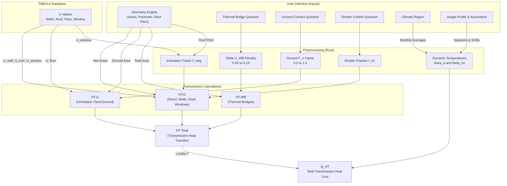

# Transmission Energy Calculation Engine

This document explains the physics and logic used in the Rust calculation engine (`lib.rs` / `transmission` module) to compute the building's transmission heat transfer coefficient ($H_T$) according to DIN V 18599-2 and ISO 13790.

## 1. Data Flow & Architecture

The calculation engine combines user inputs from the UI with pre-calculated archetype physics data from the **TABULA** database to compute the final transmission losses without overwhelming the user with overly complex physics inputs.



---

## 2. Inputs Required from the UI

To perform this calculation, the UI needs to provide two categories of data: **Automated Geometry** and **User Parameter Questions**.

### A. Automated Geometry (Calculated by the Sketchpad UI)

The UI dynamically calculates the shape of the building and provides these numbers:

- `net_wall`: Total exterior vertical wall area minus windows ($m^2$)
- `a_roof`: Total roof area ($m^2$)
- `a_ground`: Total ground/floor footprint area ($m^2$)
- `win_n`, `win_e`, `win_s`, `win_w`: Vertical window areas by direction ($m^2$)
- `win_h`: Horizontal/Roof window area ($m^2$)
- `roof_pitch_deg`: The slope angle of the roof (in degrees, 0 for flat).

### B. User Questions (Parameters)

The UI presents the following human-readable questions to determine the building physics context:

| Parameter Key             | UI Question / Prompt                                           | Available Options                                                                                                       | How Rust uses it                                                                                                                               |
| :------------------------ | :------------------------------------------------------------- | :---------------------------------------------------------------------------------------------------------------------- | :--------------------------------------------------------------------------------------------------------------------------------------------- |
| `thermal_bridge_category` | **"What is the thermal bridge planning standard?"**            | - Standard Default<br>- Good Planning<br>- Excellent Planning<br>- Internal Insulation Issues                           | Determines the $\Delta U_{WB}$ penalty (0.10, 0.05, 0.03, or 0.15).                                                                            |
| `ground_contact_type`     | **"What is below the lowest floor?"**                          | - Unheated Basement<br>- Floor Slab On Ground<br>- Heated Basement<br>- Ventilated Crawl Space<br>- Groundwater Contact | Maps to the $F_x$ temperature correction factor (e.g., 0.5 for standard unheated ground, 1.0 for groundwater).                                 |
| `shutter_control`         | **"How are window shutters controlled?"**                      | - Manual<br>- Automated<br>- None                                                                                       | Determines the shutter usage fraction ($f_{sh}$) which improves the effective window U-value ($U_{w,eff}$).                                    |
| `climate_region`          | **"In which climate region is the building located?"**         | 15 German Cities (e.g. Potsdam, Mannheim, Fichtelberg)                                                                  | Maps to a specific 12-month temperature profile to dynamically calculate the external average temperature ($\theta_e$) for the heating season. |
| `usage_profile`           | **"What is the primary usage of the building?"**               | - Residential<br>- Single Office<br>- Hospital Room<br>- Gymnasium<br>- etc.                                            | Establishes the baseline indoor heating setpoint ($\theta_{int}$) and determines the number of active heating days ($d_{hs}$).                 |
| `automation_class`        | **"What class of automation/smart thermostats is installed?"** | Class A, B, C, D                                                                                                        | Dynamically shifts the heating setpoint ($\theta_{int}$) down for smart energy-saving configurations (e.g., -1.5°C).                           |

---

## 3. The Core Calculations (Rust Logic)

Once the inputs and TABULA U-values are gathered, the engine executes three main equations:

### 1. Direct Transmission ($H_{T,D}$)

Calculates heat transfer directly touching the outside air.
**Components involved:** Exterior Walls, Roof, Windows.
**Formula:**
$H_{T,D} = \sum (A_j \cdot U_j \cdot f_{neig,j})$

_Rust Execution:_

- The engine creates dummy `BuildingComponent` instances for the wall and roof using the TABULA $U$-values.
- It infers `WindowGlazingType` (Single/Double/Triple) by inspecting the Tabula $U_{window}$ value.
- It calculates $f_{neig}$ (inclination factor) based on `roof_pitch_deg` and Glazing Type.
- It calculates $U_{w,eff}$ (effective window U-value) factoring in the `shutter_control` fraction ($f_{sh}$).

### 2. Transmission to Unheated Zones ($H_{T,iu}$)

Calculates heat transfer through components touching the ground or unheated rooms.
**Components involved:** Ground Floor / Basement Ceiling.
**Formula:**
$H_{T,iu} = \sum (A_j \cdot U_j \cdot F_{x,j})$

_Rust Execution:_

- The engine looks at `ground_contact_type` to find $F_x$. (e.g., "Unheated Basement" = 0.5).
- It multiplies the Tabula $U_{floor}$ by the Ground Area and the $F_x$ factor.

### 3. Thermal Bridges ($H_{T,WB}$)

Accounts for extra heat leaking through joints, corners, and structural intersections.
**Formula:**
$H_{T,WB} = \Delta U_{WB} \cdot \sum A_{total}$

_Rust Execution:_

- The engine uses `thermal_bridge_category` to determine the $\Delta U_{WB}$ penalty.
- It sums up the entire envelope area (Walls + Roof + Ground + Windows) and multiplies it by $\Delta U_{WB}$.

### 4. Total Transmission ($H_T$)

Finally, the three parts are summed together.
**Formula:**
$H_T = H_{T,D} + H_{T,iu} + H_{T,WB}$

This $H_T$ value is then passed into the broader ISO 13790 engine to calculate the final `Q_ht` (Total Heat Loss) alongside ventilation losses.

### 5. Dynamic Temperature Application ($Q_{ht}$)

The engine calculates the final heat loss in kWh/year using the specific Temperature Delta:
**Formula:**
$Q_{ht} = 0.024 \cdot H_T \cdot (\theta_{int} - \theta_e) \cdot d_{hs}$

_Rust Execution:_

- The engine maps `climate_region` to get the monthly temperatures and averages the 7 heating months to get $\theta_e$.
- The engine maps `usage_profile` to establish base $\theta_{int}$ and heating days $d_{hs}$.
- The engine maps `automation_class` to apply a precise energy-saving temperature shift to $\theta_{int}$.

---

## 4. Detailed Rust Code Walkthrough

This section breaks down how the physics logic is structurally implemented in the `transmission` module inside `lib.rs`.

### The Fundamental Data Structures

```rust
pub struct BuildingComponent {
    pub name: String,
    pub layers: Vec<Layer>,
    pub r_si: f64,
    pub r_se: f64,
    pub area: f64,
    pub f_neig: f64,
    pub f_x: f64,
}
```

- **Purpose:** Represents an opaque wall, roof, or floor.
- **How it works:** It natively calculates its U-value using the standard thermal resistance formula:
  $U = \frac{1}{R_T}$ where $R_T = R_{si} + \sum R_{layers} + R_{se}$

  The thermal resistance of each layer is calculated based on its thickness ($d$, in meters) and thermal conductivity ($\lambda$, in $W/(m \cdot K)$):
  $R_{layer} = \frac{d}{\lambda}$

  **Surface Resistances ($R_{si}$ and $R_{se}$):**
  DIN EN ISO 6946 dictates these constants. They almost never change unless the heat flow direction changes:
  - **External Walls (Horizontal heat flow):** $R_{si} = 0.13$, $R_{se} = 0.04$
  - **Roofs (Upward heat flow):** $R_{si} = 0.10$, $R_{se} = 0.04$
  - **Floors (Downward heat flow):** $R_{si} = 0.17$, $R_{se} = 0.04$

  _Note:_ Since we fetch exact U-values from TABULA, the engine bridges the gap by creating a "Dummy Layer" whose thickness mimics the exact TABULA thermal resistance ($R_{total} = 1.0 / U_{val}$), completely bypassing complex layer definitions for the user while preserving the DIN calculation structure.

  **Custom Insulation Overrides:**
  If the user chooses to define custom insulation for a component (adjusting only the material and thickness), the engine calculates the new U-value by fetching the "Existing State" (001 scenario) U-value from TABULA as the baseline, and then adds the thermal resistance of the custom insulation layer:
  $U_{new} = \frac{1}{\frac{1}{U_{existing}} + \frac{d}{\lambda}}$

  The UI provides four standard materials with their typical $\lambda$ values:
  
  1. **EPS (Expanded Polystyrene)**
     - **Use Case in TABULA:** The absolute standard for external wall insulation (ETICS/WDVS) in "Standard Refurbishment" scenarios.
     - **Standard Lambda ($\lambda$):** 0.035 - 0.040 W/(m·K)
  2. **Mineral Wool (Glass Wool / Rock Wool)**
     - **Use Case in TABULA:** The default choice for pitched roofs (between rafters), attic floors, and ventilated facades due to fire safety and acoustic properties.
     - **Standard Lambda ($\lambda$):** 0.035 - 0.040 W/(m·K)
  3. **XPS (Extruded Polystyrene)**
     - **Use Case in TABULA:** Used exclusively for ground-contact elements (perimeter insulation for basements, floor slabs) because it is moisture and pressure resistant.
     - **Standard Lambda ($\lambda$):** 0.035 W/(m·K)
  4. **PUR / PIR (Polyurethane / Polyisocyanurate Rigid Foam)**
     - **Use Case in TABULA:** Used in "Advanced Refurbishment" scenarios where high insulation is required but space is very limited (e.g., slim flat roofs or high-efficiency cavity walls).
     - **Standard Lambda ($\lambda$):** 0.022 - 0.028 W/(m·K)

```rust
pub struct WindowComponent {
    pub area: f64,
    pub u_w: f64,
    pub u_w_sh: f64,
    pub f_sh: f64,
    pub f_neig: f64,
    pub f_x: f64,
}
```

- **Purpose:** Represents transparent surfaces.
- **How it works:** It features an internal method `calculate_u_w_eff()` which dynamically blends the base U-value (`u_w`) with the shutter-closed U-value (`u_w_sh`) proportionally based on how often the user says shutters are used (`f_sh`).

### The Calculation Engine Functions

The core logic is broken into pure, side-effect-free functions that accept lists of these components:

1. **`calculate_h_t_d`**: Iterates through all `BuildingComponent`s and `WindowComponent`s. It filters exclusively for components that touch outside air directly (`f_x == 1.0`), multiplies their Area × U-Value × Inclination Factor (`f_neig`), and sums them up.
2. **`calculate_h_t_iu`**: Iterates through `BuildingComponent`s. It filters for components that touch unheated spaces or ground (`f_x < 1.0`), and multiplies their Area × U-Value × the specific Temperature Correction Factor (`f_x`) determined by the UI ground-contact question.
3. **`calculate_h_t_wb_simplified`**: A straightforward function that takes the flat penalty parameter (`delta_u_wb` selected by the UI thermal bridge question) and multiplies it by the absolute sum of all envelope areas.

### Engine Integration (`calculate_energy` inside `lib.rs`)

Inside the main `calculate_energy` loop, the program uses Rust's `match` blocks to convert the raw String parameters from the UI (`state.params`) directly into the strongly-typed Enums:

```rust
let f_x_ground = match state.params.ground_contact_type.as_str() {
    "Floor Slab On Ground" => 0.5,
    "Heated Basement" => 1.0,
    "Ventilated Crawl Space" => 0.8,
    // ...
```

````
Beyond geometry mapping, the engine dynamically calculates the temperature properties:
```rust
    // Calculate external temperature (theta_e) by averaging the heating months.
    let temps = region.monthly_temperatures();
    let heating_months_sum = temps[0] + temps[1] + temps[2] + temps[3] + temps[9] + temps[10] + temps[11];
    let theta_e = heating_months_sum / 7.0;

    // Calculate internal setpoint (theta_int)
    let base_temp = profile.heating_setpoint();
    let temp_shift = automation.temperature_shift(profile);
    let theta_int = f64::max(10.0, base_temp + temp_shift);
````

Once all values are mapped and calculated, it feeds the component arrays into the three `calculate_h_t` functions, sums them into `h_tr`, and applies the custom `theta_int - theta_e` delta to calculate the final `q_ht_tr` energy loss.


---

## DIN 18599 Reference Tables and Data

### Part 1: The Architecture of Transmission in DIN 18599

You cannot calculate transmission using just one document. The standard modularizes the logic:

1.  **DIN/TS 18599-2 (The Physics Engine):** This document dictates *how* to calculate transmission. It holds the core equations:
    *   **Transmission Heat Sink (Loss):** **$Q_{T,sink} = H_T \cdot (\theta_i - \theta_e) \cdot t$** (when inside is warmer).
    *   **Transmission Heat Source (Gain):** **$Q_{T,source} = H_T \cdot (\theta_e - \theta_i) \cdot t$** (when outside is warmer).
    *   **Total Heat Transfer Coefficient:** **$H_T = H_{T,D} \text{ (Direct)} + H_{T,iu} \text{ (Unheated)} + H_{T,g} \text{ (Ground)} + H_{T,WB} \text{ (Bridges)}$**.
2.  **DIN/TS 18599-10 (The Boundary Conditions):** This document dictates *when* and *under what conditions* transmission happens. It provides the exact temperatures (**$\theta$**) and the operating times (**$t$**).
3.  **DIN/TS 18599-1 (The Geometry):** Dictates the raw sizes (Areas and Lengths) of the building.
4.  **External ISO Norms (The Materials):** The DIN 18599 series *does not* tell you how insulating a brick wall is. You must calculate U-values and Psi-values using external norms (ISO 6946, 10077, 10211).

### Part 2: The Master List of ALL Transmission Inputs

To write your software, your data model must collect all of the following parameters. I have categorized them by where your system must source them.

#### Category A: Architectural Geometry (Sourced via DIN 18599-1 / CAD Model)

These are the physical dimensions of the building envelope.

*   **$A_j$ (Component Area):** The area in **$m^2$** of every wall, roof, window, and door facing the exterior, the ground, or an unheated space.
*   **$l_j$ (Thermal Bridge Length):** The length in meters of every linear structural joint (e.g., balcony connections, window perimeters) if doing detailed thermal bridge calculations.
*   **$P$ (Perimeter Length):** The exposed perimeter of the ground slab (required for ground transmission correction).

#### Category B: Material Thermal Properties (Sourced via External Norms)

These define how well the materials resist heat flow.

*   **$U_j$ (Thermal Transmittance / U-Value):** Measured in **$W/(m^2K)$**. Sourced via DIN EN ISO 6946 (opaque elements) or DIN EN ISO 10077-1 (windows/doors).
*   **$\Psi_j$ (Linear Thermal Transmittance / Psi-Value):** Measured in **$W/(mK)$**. The heat leak rate of a specific joint. Sourced via DIN EN ISO 10211 or DIN 4108 Beiblatt 2.
*   **$R_s$ (Surface Thermal Resistances):** Fixed constants used in U-value calculations (**$0.04$** external, **$0.13$** internal walls).

#### Category C: Structural Correction Factors (Sourced via DIN 18599-2)

These factors mathematically adjust the raw U-values based on orientation, location, or dynamic elements.

*   **$f_{neig,j}$ (Inclination Factor):** Adjusts window U-values based on tilt. Found in **Part 2, Table 7** (e.g., **$1.0$** for vertical, **$1.2$** for horizontal single glazing).
*   **$F_x$ (Temperature Correction Factor):** Reduces heat loss calculations for components that don't face the harsh exterior directly. Found in **Part 2, Tables 5 & 6**.
    *   Examples: **$0.8$** (Unheated Attic), **$0.5$** (Unheated Basement), **$0.35$** (Unheated Staircase).
*   **$\Delta U_{WB}$ (Simplified Thermal Bridge Addition):** If you don't calculate exact lengths (**$l_j \cdot \Psi_j$**), you add a flat penalty to all U-values.
    *   Values: **$0.10$** (Standard), **$0.05$** (Good planning), **$0.03$** (Excellent planning), **$0.15$** (Internal insulation issues).
*   **$f_{sh}$ (Shutter Fraction):** The percentage of time a night-shutter is closed, improving the window's U-value (**$U_{w,eff}$**). Found in **Part 2, Annex G**.

#### Category D: Climate & Boundary Conditions (Sourced via DIN 18599-10)

These are the exact numerical triggers that drive the equations, dictating the **$\Delta T$** (temperature difference) and operating hours.

**1. Setpoint Temperatures (The targets):**

*   **$\theta_{i,h,soll}$ (Heating Setpoint):** e.g., **$20^\circ C$** (Residential), **$21^\circ C$** (Office), **$15^\circ C$** (Heavy Industry).
*   **$\theta_{i,c,soll}$ (Cooling Setpoint):** e.g., **$25^\circ C$** (Residential), **$24^\circ C$** (Office).
*   **$\Delta\theta_{i,NA}$ (Setback Temp):** The allowed temperature drop during nights/weekends. Almost universally **$4.0 K$**.
*   **Design Extremes:** **$\theta_{i,h,min}$** (e.g., **$20^\circ C$**) and **$\theta_{i,c,max}$** (e.g., **$26^\circ C$**) used only for sizing peak equipment loads.

**2. Building Automation (The smart offsets):**

*   **$\Delta\theta_{EMS}$ (Automation Shift):** If the building has smart controls, the setpoints are artificially lowered to save energy calculation-wise.
    *   Class A: **$-1.5 K$** to **$-2.0 K$** | Class B: **$-1.0 K$** | Class C/D: **$0.0 K$**.
*   **$f_{adapt}$:** Multiplier for adaptive control (**$1.35$** for Classes A/B, **$1.0$** for C/D).

**3. External Climate:**

*   **$\theta_e$ (Monthly External Temperature):** 12 specific values depending on the climate region (e.g., Region 4 Potsdam ranges from **$0.1^\circ C$** in Jan to **$18.4^\circ C$** in July).
*   **$\theta_{e,min}$ (Winter Peak Design):** Fixed at **$-12^\circ C$**.

**4. Operating Times (The duration of heat flow):**

*   **$t_{h,op,d}$ (Daily Heating Hours):** e.g., **$17 \text{ h/d}$** (Residential), **$13 \text{ h/d}$** (Offices).
*   **$d_{nutz}$ (Usage Days per year):** e.g., **$365 \text{ d/a}$** (Residential), **$250 \text{ d/a}$** (Offices, meaning weekends are at setback temperatures).
*   **$d_{mth}$ (Days per month):** Standard calendar days (28, 30, 31).

### Implementation Summary

To build the transmission module, your software needs to:

1.  Load **Category A** (Geometry) and **Category B** (U-values) to calculate the static building shell **$H_T$**.
2.  Apply the modifiers from **Category C** (DIN 18599-2) to adjust for unheated spaces and bridges.
3.  Run a monthly loop using the temperatures and times from **Category D** (DIN 18599-10) to figure out exactly how many Watt-hours of energy transferred through that shell over the course of the year.

### The Transmission Formulas (from DIN/TS 18599-2)

#### 1. The Core Transmission Energy Balance (**$Q_T$**)

This calculates the actual energy (in Watt-hours or kWh) lost or gained through the envelope over a specific time period (usually a month).

*   **Transmission Heat Sink (Loss - when heating is needed):**

    $$
    Q_{T,sink} = \sum H_{T,j} \cdot (\theta_i - \theta_e) \cdot t
    $$

    *(Calculated for all components **$j$** where **$\theta_i > \theta_e$**)*

*   **Transmission Heat Source (Gain - when cooling is needed):**

    $$
    Q_{T,source} = \sum H_{T,j} \cdot (\theta_e - \theta_i) \cdot t
    $$

    *(Calculated for all components **$j$** where **$\theta_e > \theta_i$**)*

**$\theta_i$ (Indoor Target Temperature - Heating **$\theta_{i,h,soll}$** / Cooling **$\theta_{i,c,soll}$**):**

*   *Where to find:* **Table 5** (Residential): 
    *   **Heating Setpoint ($\theta_{i,h,soll}$):** 20.0 °C
    *   **Cooling Setpoint ($\theta_{i,c,soll}$):** 25.0 °C
    *   **Building Automation Shift ($\Delta\theta_{EMS}$):**
        *   Class D (No automation): 0.0 K
        *   Class C (Standard): -0.5 K
        *   Class B (Advanced): -1.0 K
        *   Class A (High Energy Performance): -1.5 K
*   and **Table 7** (Non-Residential, depending on the usage profile 1-43):

| Lfd. Nr. | Nutzung (Usage Profile)             | Heating Temp. (°C) | Cooling Temp. (°C) | Automation Shift (Class D / C / B / A) |
| :------- | :---------------------------------- | :----------------- | :----------------- | :------------------------------------- |
| 1        | Einzelbüro                          | 21                 | 24                 | 0 K / 0 K / -1.0 K / -1.5 K            |
| 2        | Gruppenbüro (2-6 Plätze)            | 21                 | 24                 | 0 K / 0 K / -1.0 K / -1.5 K            |
| 3        | Großraumbüro (ab 7 Plätze)          | 21                 | 24                 | 0 K / 0 K / -1.0 K / -1.5 K            |
| 4        | Besprechung, Sitzung, Seminar       | 21                 | 24                 | 0 K / 0 K / -1.0 K / -1.5 K            |
| 5        | Schalterhalle                       | 21                 | 24                 | 0 K / 0 K / -1.0 K / -1.5 K            |
| 6        | Einzelhandel/Kaufhaus               | 21                 | 24                 | 0 K / 0 K / -1.5 K / -2.0 K            |
| 7        | Einzelhandel (Lebensmittel/Kühl)    | 21                 | 24                 | 0 K / 0 K / -1.5 K / -2.0 K            |
| 8        | Klassenzimmer, Gruppenraum          | 21                 | 24                 | 0 K / 0 K / -1.2 K / -2.0 K            |
| 9        | Hörsaal, Auditorium                 | 21                 | 24                 | 0 K / 0 K / -1.5 K / -2.0 K            |
| 10       | Bettenzimmer                        | 22                 | 24                 | 0 K / 0 K / -1.0 K / -1.5 K            |
| 11       | Hotelzimmer                         | 21                 | 24                 | 0 K / 0 K / -1.0 K / -1.5 K            |
| 12       | Kantine                             | 21                 | 24                 | 0 K / 0 K / -1.5 K / -2.0 K            |
| 13       | Restaurant                          | 21                 | 24                 | 0 K / 0 K / -1.5 K / -2.0 K            |
| 14       | Küchen in Nichtwohngebäuden         | 21                 | 24                 | 0 K / 0 K / -1.5 K / -2.0 K            |
| 15       | Küche - Vorbereitung, Lager         | 21                 | 24                 | 0 K / 0 K / -1.5 K / -2.0 K            |
| 16       | WC und Sanitärräume                 | 21                 | 24                 | 0 K / 0 K / -0.5 K / -1.0 K            |
| 17       | Sonstige Aufenthaltsräume           | 21                 | 24                 | 0 K / 0 K / -0.5 K / -1.0 K            |
| 18       | Nebenflächen (ohne Aufenthalt)      | 21                 | 24                 | 0 K / 0 K / -0.5 K / -1.0 K            |
| 19       | Verkehrsflächen                     | 21                 | 24                 | 0 K / 0 K / -0.5 K / -1.0 K            |
| 20       | Lager, Technik, Archive             | 21                 | 24                 | 0 K / 0 K / -0.5 K / -1.0 K            |
| 21       | Rechenzentrum                       | 21                 | 24                 | 0 K / 0 K / -0.5 K / -0.5 K            |
| 22       | Gewerbliche Halle - schwere Arbeit  | 15                 | 28                 | 0 K / 0 K / -1.2 K / -1.8 K            |
| 23       | Gewerbliche Halle - mittelschwere   | 17                 | 26                 | 0 K / 0 K / -1.2 K / -1.8 K            |
| 24       | Gewerbliche Halle - leichte Arbeit  | 20                 | 24                 | 0 K / 0 K / -1.2 K / -1.8 K            |
| 25       | Zuschauerbereich (Theater/Veranst.) | 21                 | 24                 | 0 K / 0 K / -0.5 K / -1.0 K            |
| 26       | Foyer (Theater/Veranstaltungen)     | 21                 | 24                 | 0 K / 0 K / -0.3 K / -0.5 K            |
| 27       | Bühne (Theater/Veranstaltungen)     | 21                 | 24                 | 0 K / 0 K / -0.3 K / -0.5 K            |
| 28       | Messe/Kongress                      | 21                 | 24                 | 0 K / 0 K / -1.5 K / -2.0 K            |
| 29       | Ausstellungsräume / Museum          | 21                 | 24                 | 0 K / 0 K / -0.75 K / -1.25 K          |
| 30       | Bibliothek - Lesesaal               | 21                 | 24                 | 0 K / 0 K / -0.5 K / -1.0 K            |
| 31       | Bibliothek - Freihandbereich        | 21                 | 24                 | 0 K / 0 K / -0.5 K / -1.0 K            |
| 32       | Bibliothek - Magazin und Depot      | 21                 | 24                 | 0 K / 0 K / -0.5 K / -1.0 K            |
| 33       | Turnhalle (ohne Zuschauer)          | 19                 | 24                 | 0 K / 0 K / -0.5 K / -1.0 K            |
| 34       | Parkhäuser (Büro/Privat)            | 21                 | 24                 | 0 K / 0 K / -0.5 K / -1.0 K            |
| 35       | Parkhäuser (öffentlich)             | 21                 | 24                 | 0 K / 0 K / -0.5 K / -1.0 K            |
| 36       | Saunabereich                        | 24                 | None               | 0 K / 0 K / -0.5 K / -1.0 K            |
| 37       | Fitnessraum                         | 20                 | 24                 | 0 K / 0 K / -0.5 K / -1.0 K            |
| 38       | Labor                               | 22                 | 24                 | 0 K / 0 K / -0.5 K / -1.0 K            |
| 39       | Untersuchungs-/Behandlungsräume     | 22                 | 24                 | 0 K / 0 K / -0.5 K / -1.0 K            |
| 40       | Spezialpflegebereiche               | 24                 | 24                 | 0 K / 0 K / -0.5 K / -1.0 K            |
| 41       | Flure des Pflegebereichs            | 22                 | 24                 | 0 K / 0 K / -0.5 K / -1.0 K            |
| 42       | Arztpraxen/Therapeutische Praxen    | 22                 | 24                 | 0 K / 0 K / -0.5 K / -1.0 K            |
| 43       | Lagerhallen, Logistikhallen         | 12                 | 26                 | 0 K / 0 K / -0.5 K / -1.0 K            |

* *Details:* Must be adjusted by the Building Automation shift ( **$\Delta\theta_{EMS}$** ) found in **Table 5/9**.

**$\theta_e$ (External Climate Temperature):**

* *Where to find:* **Annex E, Table E.1**.
* *Details:* Provides the 12 monthly average external temperatures for 15 German climate regions.

| Region | Referenzort            | Jan  | Feb  | Mrz  | Apr  | Mai  | Jun  | Jul  | Aug  | Sep  | Okt  | Nov  | Dez  | Jahreswert |
| :----- | :--------------------- | :--- | :--- | :--- | :--- | :--- | :--- | :--- | :--- | :--- | :--- | :--- | :--- | :--------- |
| 1      | Bremerhaven            | 2,9  | 3,2  | 5,4  | 9,0  | 13,1 | 16,0 | 17,9 | 18,2 | 15,0 | 10,6 | 6,1  | 3,2  | 10,1       |
| 2      | Rostock                | 2,3  | 2,4  | 4,3  | 8,0  | 12,4 | 15,6 | 18,0 | 18,0 | 14,7 | 10,2 | 5,5  | 2,6  | 9,5        |
| 3      | Hamburg                | 2,5  | 2,7  | 4,9  | 8,5  | 12,8 | 15,5 | 17,8 | 17,8 | 14,1 | 9,8  | 5,1  | 2,3  | 9,5        |
| 4      | Potsdam (Referenz)     | 1,0  | 1,9  | 4,7  | 9,2  | 14,1 | 16,7 | 19,0 | 18,6 | 14,3 | 9,5  | 4,1  | 0,9  | 9,5        |
| 5      | Essen                  | 3,1  | 3,5  | 6,6  | 9,5  | 13,7 | 15,9 | 18,2 | 18,2 | 14,6 | 10,8 | 6,1  | 3,5  | 10,4       |
| 6      | Bad Marienberg         | 0,1  | 0,5  | 3,6  | 7,0  | 11,5 | 14,0 | 16,1 | 16,0 | 12,3 | 8,1  | 3,2  | 0,6  | 7,8        |
| 7      | Kassel                 | 1,0  | 2,1  | 5,2  | 8,8  | 13,3 | 15,9 | 18,1 | 17,8 | 13,7 | 9,5  | 4,5  | 1,7  | 9,3        |
| 8      | Braunlage              | -0,8 | -0,3 | 2,1  | 5,7  | 10,5 | 12,9 | 15,0 | 15,0 | 11,1 | 7,1  | 2,3  | -0,2 | 6,7        |
| 9      | Chemnitz               | 0,5  | 1,0  | 3,9  | 8,2  | 12,9 | 15,5 | 17,5 | 17,6 | 13,2 | 9,2  | 3,8  | 0,8  | 8,7        |
| 10     | Hof                    | -1,2 | -0,4 | 2,8  | 6,6  | 11,7 | 14,5 | 16,3 | 16,6 | 12,0 | 7,6  | 2,3  | -0,7 | 7,4        |
| 11     | Fichtelberg            | -3,3 | -3,5 | -1,3 | 2,3  | 7,4  | 9,8  | 12,2 | 12,4 | 8,1  | 4,4  | -0,6 | -2,8 | 3,8        |
| 12     | Mannheim               | 2,4  | 3,6  | 7,1  | 10,6 | 15,6 | 18,1 | 20,1 | 20,2 | 15,7 | 11,0 | 5,7  | 3,1  | 11,1       |
| 13     | Passau                 | -1,2 | 0,4  | 4,3  | 8,2  | 13,7 | 16,4 | 18,0 | 17,8 | 13,1 | 8,7  | 3,0  | -0,2 | 8,6        |
| 14     | Stötten                | -0,5 | 0,3  | 3,4  | 6,8  | 11,8 | 14,4 | 16,6 | 16,7 | 12,3 | 8,5  | 2,6  | -0,2 | 7,8        |
| 15     | Garmisch-Partenkirchen | -2,3 | -0,5 | 3,2  | 7,0  | 11,8 | 14,8 | 16,6 | 16,4 | 12,3 | 8,4  | 1,9  | -1,8 | 7,4        |

##### Design Extremes for Equipment Sizing ($\theta_{e,min}$ and $\theta_{e,max}$)

While the monthly averages (Table E.1) are used to calculate the annual energy demand ($kWh/a$), you cannot use them to calculate the peak load ($kW$) required to size the actual heating boiler or chiller.

For maximum load calculations, Table 12 provides the extreme single-day external temperatures:

*   **Design Temperature for Heating ($\theta_{e,min}$):** $-12.0\ ^\circ\text{C}$ (Used universally for the winter design day in January to calculate maximum heating load).
*   **Design Temperatures for Cooling ($\theta_{e,max}$):**
    *   $25.0\ ^\circ\text{C}$ (Used for the summer design day in July).
    *   $20.3\ ^\circ\text{C}$ (Used for the autumn design day in September).
    *(Note: The maximum cooling design temperature is relatively mild ($25.0\ ^\circ\text{C}$) because DIN 18599 balances it against simultaneous extreme solar radiation ($I_{S,max}$) of up to $927\ \text{W/m}^2$ on the same day. The combination of $25\ ^\circ\text{C}$ ambient air plus max solar gain produces the peak cooling demand).*

**$t$ (Operating Time/Duration):**

*   *Where to find:* Derived from **$d_{nutz}$** (Usage days) and **$t_{h,op,d}$** (Daily operating hours) found in **Table 5** (Res) and **Table 6** (Non-Res). Also requires **$d_{mth}$** (Days per month) from **Table 11**.

1.  **Days per Month ($d_{mth}$) - From Table 11**
    These are the standard calendar days used to determine the total hours available in a given month. The standard assumes a non-leap year (365 days).
    *   Jan: 31 | Feb: 28 | Mar: 31 | Apr: 30 | May: 31 | Jun: 30
    *   Jul: 31 | Aug: 31 | Sep: 30 | Oct: 31 | Nov: 30 | Dec: 31
    *   Total hours in a month: $t_{mth} = d_{mth} \times 24 \text{ hours}$ (e.g., January = 744 hours).

2.  **Residential Buildings (Wohngebäude) - From Table 5**
    For any residential building, the operating times are strictly fixed to one profile:
    *   Usage days per year ($d_{nutz,a}$): 365 days
    *   Daily heating/cooling operation ($t_{h,op,d}$): 17 hours/day
    *   *Application:* This means a residential home is fully heated for 17 hours a day, 7 days a week. The remaining 7 hours of the day are calculated using the setback temperature ($\Delta\theta_{i,NA} = 4\text{ K}$).

3.  **Non-Residential Buildings (Nichtwohngebäude) - From Table 6**
    For non-residential buildings, the operating times depend entirely on the usage profile. I have extracted the Usage Days per Year ($d_{nutz,a}$) and the Daily Heating Operation Hours ($t_{h,op,d}$) for all 43 profiles.
    *(Note: The daily heating operation time $t_{h,op,d}$ in the standard already includes the necessary pre-heating and post-heating times required to bring the building up to temperature before people arrive).*

| Lfd. Nr. | Nutzung (Usage Profile)             | Usage Days / Year (d_nutz) | Daily Heating Hours (t_h,op,d) |
| :------- | :---------------------------------- | :------------------------- | :----------------------------- |
| 1        | Einzelbüro                          | 250                        | 13                             |
| 2        | Gruppenbüro (2-6 Plätze)            | 250                        | 13                             |
| 3        | Großraumbüro (ab 7 Plätze)          | 250                        | 13                             |
| 4        | Besprechung, Sitzung, Seminar       | 250                        | 13                             |
| 5        | Schalterhalle                       | 250                        | 13                             |
| 6        | Einzelhandel/Kaufhaus               | 300                        | 12                             |
| 7        | Einzelhandel (Lebensmittel/Kühl)    | 300                        | 12                             |
| 8        | Klassenzimmer, Gruppenraum          | 250                        | 12                             |
| 9        | Hörsaal, Auditorium                 | 250                        | 12                             |
| 10       | Bettenzimmer (Krankenhaus)          | 365                        | 24                             |
| 11       | Hotelzimmer                         | 365                        | 24                             |
| 12       | Kantine                             | 250                        | 12                             |
| 13       | Restaurant                          | 365                        | 14                             |
| 14       | Küchen in Nichtwohngebäuden         | 365                        | 14                             |
| 15       | Küche - Vorbereitung, Lager         | 365                        | 14                             |
| 16       | WC und Sanitärräume                 | 250                        | 13                             |
| 17       | Sonstige Aufenthaltsräume           | 250                        | 13                             |
| 18       | Nebenflächen (ohne Aufenthalt)      | 250                        | 13                             |
| 19       | Verkehrsflächen                     | 250                        | 13                             |
| 20       | Lager, Technik, Archive             | 250                        | 13                             |
| 21       | Rechenzentrum                       | 365                        | 24                             |
| 22       | Gewerbliche Halle - schwere Arbeit  | 250                        | 14                             |
| 23       | Gewerbliche Halle - mittelschwere   | 250                        | 14                             |
| 24       | Gewerbliche Halle - leichte Arbeit  | 250                        | 14                             |
| 25       | Zuschauerbereich (Theater/Veranst.) | 200                        | 10                             |
| 26       | Foyer (Theater/Veranstaltungen)     | 200                        | 10                             |
| 27       | Bühne (Theater/Veranstaltungen)     | 200                        | 10                             |
| 28       | Messe/Kongress                      | 200                        | 14                             |
| 29       | Ausstellungsräume / Museum          | 300                        | 12                             |
| 30       | Bibliothek - Lesesaal               | 300                        | 13                             |
| 31       | Bibliothek - Freihandbereich        | 300                        | 13                             |
| 32       | Bibliothek - Magazin und Depot      | 300                        | 13                             |
| 33       | Turnhalle (ohne Zuschauer)          | 300                        | 14                             |
| 34       | Parkhäuser (Büro/Privat)            | 250                        | 13                             |
| 35       | Parkhäuser (öffentlich)             | 300                        | 14                             |
| 36       | Saunabereich                        | 365                        | 14                             |
| 37       | Fitnessraum                         | 365                        | 14                             |
| 38       | Labor                               | 250                        | 13                             |
| 39       | Untersuchungs-/Behandlungsräume     | 250                        | 13                             |
| 40       | Spezialpflegebereiche               | 365                        | 24                             |
| 41       | Flure des Pflegebereichs            | 365                        | 24                             |
| 42       | Arztpraxen/Therapeutische Praxen    | 250                        | 12                             |
| 43       | Lagerhallen, Logistikhallen         | 250                        | 14                             |

#### 2. The Overall Transmission Heat Transfer Coefficient (**$H_T$**)

This formula sums up the "leakiness" of the entire building envelope (in W/K).

$$
H_T = H_{T,D} + \sum(F_{x,j} \cdot H_{T,iu,j}) + H_{T,WB}
$$

**$F_x$ (Temperature Correction Factor):**

*   *Where to find:* **Table 5** (Unheated rooms) and **Table 6** (Ground slabs/basements).
*   *Details:* e.g., **$F_x = 0.8$** for unheated attics, **$F_x = 0.5$** for unheated basements.

*   **Table 5: Unheated Spaces ($F_x$ für unbeheizte Räume):**

    | Lfd. Nr. | Art des angrenzenden unbeheizten Raumes (Type of Unheated Space)    | F_x Factor |
    | :------- | :------------------------------------------------------------------ | :--------- |
    | 1        | Dachraum (Unheated Attic / Roof space)                              | 0.8        |
    | 2        | Unbeheizter Glasvorbau / Wintergarten (Unheated Sunspace)           | 0.8        |
    | 3        | Kriechkeller, stark belüftet (Crawl space, heavily ventilated)      | 0.8        |
    | 4        | Angrenzender unbeheizter Raum (Standard adjacent unheated room)     | 0.5        |
    | 5        | Unbeheizter Keller (Unheated Basement, general)                     | 0.5        |
    | 6        | Treppenhaus, außenliegend (Staircase with large exterior walls)     | 0.5        |
    | 7        | Kriechkeller, unbelüftet (Crawl space, unventilated)                | 0.5        |
    | 8        | Treppenhaus, innenliegend (Staircase mostly surrounded by building) | 0.35       |

*   **Table 6: Ground Contact ($F_x$ für Bauteile gegen Erdreich):**

    | Lfd. Nr. | Bauteil gegen Erdreich (Component against the ground)               | F_x Factor |
    | :------- | :------------------------------------------------------------------ | :--------- |
    | 1        | Bodenplatte auf Erdreich (Floor slab directly on ground)            | 0.5        |
    | 2        | Wände gegen Erdreich, < 1,5m Tiefe (Basement walls, shallow depth)  | 0.5        |
    | 3        | Wände gegen Erdreich, > 1,5m Tiefe (Basement walls, deep depth)     | 0.5        |
    | 4        | Fußboden des beheizten Kellers (Floor of a heated basement)         | 0.5        |
    | 5        | Bauteile gegen Grundwasser (Components touching groundwater)        | 1.0        |

#### 3. Direct Transmission to Exterior (**$H_{T,D}$**)

Calculates heat transfer through walls, roofs, and windows directly touching the outside air.

$$
H_{T,D} = \sum (f_{neig,j} \cdot U_j \cdot A_j)
$$

**$f_{neig,j}$ (Inclination Factor):**

*   *Where to find:* **Table 7** (18599-2)
*   *Details:* Adjusts window U-values based on their tilt angle (**$0^\circ$** to **$90^\circ$**) and glazing type (single, double, triple). Default is **$1.0$** for opaque walls.

*   **Table 7: Inclination Factor ($f_{neig,j}$):**

    | Neigung (Grad °) | Einfachglas (Single) | Zweifachglas (Double) | Dreifachglas (Triple) * |
    | :--------------- | :------------------- | :-------------------- | :---------------------- |
    | 0° (Horizontal)  | 1,25                 | 1,21                  | 1,20                    |
    | 15°              | 1,21                 | 1,22                  | 1,16                    |
    | 30°              | 1,19                 | 1,21                  | 1,13                    |
    | 45°              | 1,21                 | 1,15                  | 1,07                    |
    | 60°              | 1,00                 | 1,13                  | 1,05                    |
    | 75°              | 1,00                 | 1,08                  | 1,02                    |
    | 90° (Vertikal)   | 1,00                 | 1,00                  | 1,00                    |

##### 1. Das mathematische Prinzip

Der U-Wert ist der Kehrwert des gesamten Wärmedurchgangswiderstands ($R_T$):

$$
U = \frac{1}{R_T}
$$

Der gesamte Wärmedurchgangswiderstand setzt sich aus den Schichtwiderständen und den Übergangswiderständen zusammen:

$$
R_T = R_{si} + \sum \left( \frac{d_i}{\lambda_i} \right) + R_{se}
$$

Dabei ist:
*   $d_i$: Dicke der Schicht $i$ in Metern ($m$).
*   $\lambda_i$: Wärmeleitfähigkeit des Materials der Schicht $i$ in $W/(m \cdot K)$.
*   $R_{si}, R_{se}$: Übergangswiderstände (konstant, wie von dir genannt).

#### 4. Transmission to Unheated Spaces (**$H_{T,iu}$**)

Calculates heat transfer through walls/floors touching unheated rooms (like attics or basements) or the ground.

$$
H_{T,iu} = \sum (U_j \cdot A_j)
$$

*(Note: To get the effective heat transfer, this is multiplied by the temperature correction factor **$F_x$** as shown in Formula 2).*

```rust
pub struct Material {
    pub name: String,
    pub lambda: f64, // Wärmeleitfähigkeit W/(m*K)
}

pub struct Layer {
    pub material: Material,
    pub thickness: f64, // Dicke in Metern
}

pub struct BuildingComponent {
    pub layers: Vec<Layer>,
    pub r_si: f64, // Standard 0.13
    pub r_se: f64, // Standard 0.04
}

impl BuildingComponent {
    // Berechnet den U-Wert basierend auf der aktuellen Dicke aller Schichten
    pub fn calculate_u_value(&self) -> f64 {
        let sum_r: f64 = self.layers.iter()
            .map(|l| l.thickness / l.material.lambda)
            .sum();
        
        let r_t = self.r_si + sum_r + self.r_se;
        1.0 / r_t
    }
}

impl BuildingComponent {
    pub fn calculate_u_value_internal(&self) -> f64 {
        // Bei Innenbauteilen: R_se wird zu R_si (meist 0.13 + 0.13)
        let sum_r: f64 = self.layers.iter()
            .map(|l| l.thickness / l.material.lambda)
            .sum();
        
        let r_t = self.r_si + sum_r + self.r_si; 
        1.0 / r_t
    }
}
```

#### 5. Thermal Bridges (**$H_{T,WB}$**)

Calculates the extra heat lost through structural joints (balconies, window frames, corners). The standard allows for two calculation methods.

*   **Simplified Method (Flat Addition):**
    $$
    H_{T,WB} = \Delta U_{WB} \cdot \sum A_j
    $$

**$\Delta U_{WB}$ (Simplified Thermal Bridge Penalty):**

*   *Where to find:* **Section 6.1.4 (Text categories)** (18599-2)
*   *Details:* Flat values of **$0.10$** (default), **$0.05$**, **$0.03$**, or **$0.15 W/(m^2K)$** depending on the construction quality and adherence to DIN 4108 Beiblatt 2.

| Penalty Value ($\Delta U_{WB}$) | Construction Condition / Requirement (Anwendungsbedingung) |
| :------------------------------ | :---------------------------------------------------------- |
| 0.15 W/(m²K)                    | Increased Penalty: Must be used for buildings with internal insulation (Innendämmung) where solid floor ceilings intersect the exterior wall without thermal separation, creating massive thermal bridges. |
| 0.10 W/(m²K)                    | Standard Default (Ohne Nachweis): Used when no special thermal bridge planning is done, or if the construction details do not conform to the standard examples provided in DIN 4108 Beiblatt 2. |
| 0.05 W/(m²K)                    | Good Planning (Kategorie A): Allowed only if it is explicitly proven that all thermal bridges in the building match the standard, energy-optimized design examples shown in DIN 4108 Beiblatt 2. |
| 0.03 W/(m²K)                    | Excellent Planning (Kategorie B): Allowed only if proven that all thermal bridges match the highly-insulated, premium design examples (Category B) defined in DIN 4108 Beiblatt 2. |

#### 6. Effective Thermal Transmittance for Windows with Shutters (**$U_{w,eff}$**)

If a window has a night shutter, its **$U$**-value improves dynamically based on how long the shutter is closed.

$$
U_{w,eff} = U_w \cdot (1 - f_{sh}) + U_{w,sh} \cdot f_{sh}
$$

**$f_{sh}$ (Shutter Usage Fraction):**

*   *Where to find:* **Annex G, Tables G.1, G.2, G.3** (18599-2)
*   *Details:* The fraction of the day the shutter is closed, depending on the automation control type.

*   **Table G.1: Residential Buildings (Wohngebäude):**

    | Monat (Month) | f_sh : Manuell (Manual Control) | f_sh : Automatisch (Automated / Motorized) |
    | :------------ | :------------------------------ | :----------------------------------------- |
    | Januar        | 0,43                            | 0,61                                       |
    | Februar       | 0,38                            | 0,54                                       |
    | März          | 0,32                            | 0,45                                       |
    | April         | 0,25                            | 0,36                                       |
    | Mai           | 0,20                            | 0,28                                       |
    | Juni          | 0,16                            | 0,23                                       |
    | Juli          | 0,18                            | 0,25                                       |
    | August        | 0,23                            | 0,33                                       |
    | September     | 0,29                            | 0,42                                       |
    | Oktober       | 0,37                            | 0,53                                       |
    | November      | 0,42                            | 0,60                                       |
    | Dezember      | 0,45                            | 0,64                                       |

*   **Table G.2 & G.3: Non-Residential Buildings (Nichtwohngebäude):**

    | Monat (Month) | f_sh : Non-Residential (Manual) | f_sh : Non-Residential (Automated / BMS)   |
    | :------------ | :------------------------------ | :----------------------------------------- |
    | Januar        | 0,00                            | 0,61                                       |
    | Februar       | 0,00                            | 0,54                                       |
    | März          | 0,00                            | 0,45                                       |
    | April         | 0,00                            | 0,36                                       |
    | Mai           | 0,00                            | 0,28                                       |
    | Juni          | 0,00                            | 0,23                                       |
    | Juli          | 0,00                            | 0,25                                       |
    | August        | 0,00                            | 0,33                                       |
    | September     | 0,00                            | 0,42                                       |
    | Oktober       | 0,00                            | 0,53                                       |
    | November      | 0,00                            | 0,60                                       |
    | Dezember      | 0,00                            | 0,64                                       |

#### 7. Specific Heat Transfer Coefficient (**$H'_T$**)

Used primarily in Annex F to evaluate the overall energy quality of the building envelope relative to its size.

$$
H'_{T} = \frac{H_{T,D} + H_{T,WB} + \sum(F_{x,j} \cdot H_{T,iu,j})}{A}
$$
