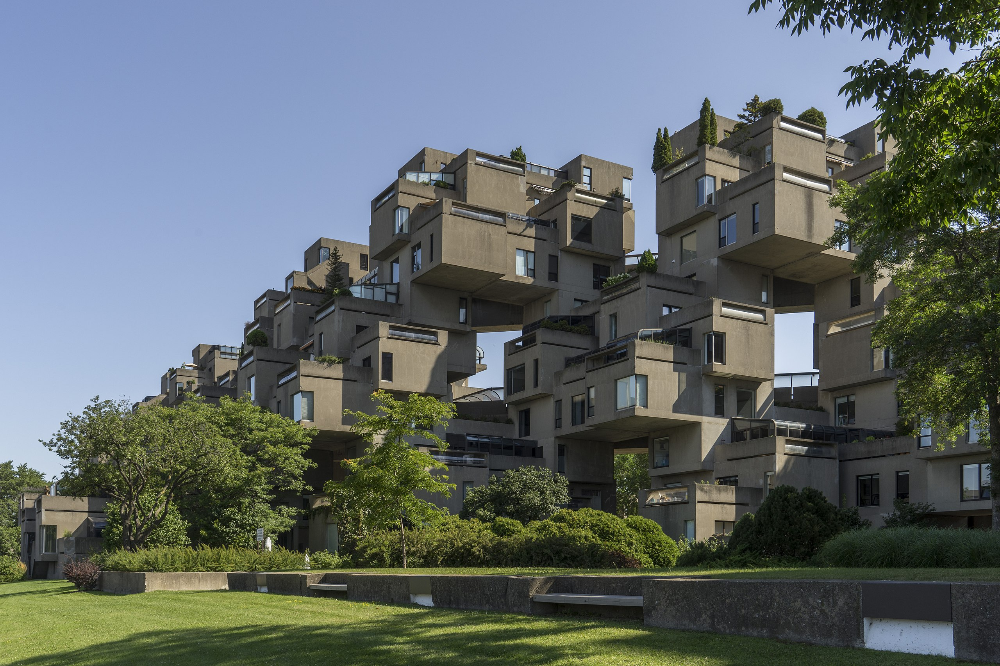
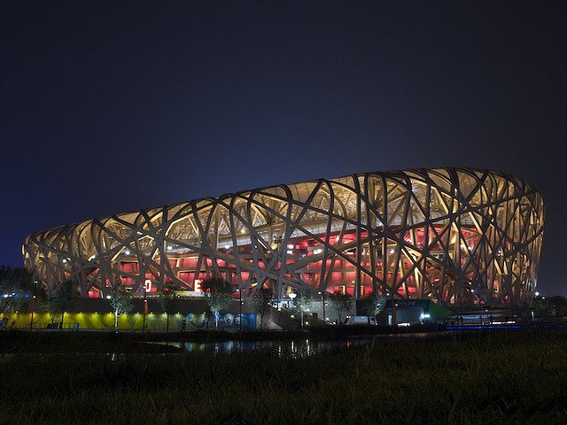

import { Tabs, TabItem, Card } from "@astrojs/starlight/components";

## 🧠 It's about Meaning

You might have heared of **Building-Information-Modeling (BIM)** where you explicitly model semantics instead of only representations 🔗

  

    It allows you to use smart objects early on, so you don't have to repeat the
    information retrieval process later ⏮️
  

  Instead of making a line with a pen (or a CAD tool), you use a BIM tool to
  draw a wall, and then you simultaneously model the wall's information
  (material, volume, cost, …) 📝

The hope is that this extra work and limitation in the beginning pays off in the end 📉

## 🩻 The Data Problem

:::note[Did you know?]
Computers love hierarchical tree structures 💾
:::

For computers to store and process information, they need data structures 🗄️

The main question is what are the **units of information**?

## 🧩 You have to Standardize the Elements!

You might ask yourself:

  
🗃️ What do most buildings have in common?

  Storeys, Walls, Windows, Doors, Columns, Beams, Slabs, Roofs, Stairs,
  Railings, …

  
🧩 How are they commonly put together?
A building constists
  of storeys, a wall starts and ends on a storey, a wall is 90 degrees vertical,
  …

  
🤷‍♂️ What about the exceptions?

  Split levels, incline walls, free-form roofs, …

Here some example buildings:

{/* prettier-ignore */}
<Tabs>
  <TabItem label="1234 Walls, 567 Railings, 890 Windows">
    
    

      [© CC BY-SA 4.0](https://de.wikipedia.org/wiki/Habitat_67#/media/Datei:Habitat_67,_southwest_view.jpg)
    

  </TabItem>
  <TabItem label="1234 Columns, 5678 Beams">
    
    

      [© CC BY-SA 2.0](https://en.wikipedia.org/wiki/File:Birds_Nest_at_Night.jpg)
    

  </TabItem>
  <TabItem label="123 Stairs, 456 Slabs">
    
    

      [© CC BY-SA 3.0](https://en.wikipedia.org/wiki/File:Nakagin.jpg)
    

  </TabItem>
</Tabs>

Is that the way you think about your design?

## 🤔 Or maybe not?

When you design you'll probably think more like this:

{/* prettier-ignore */}
<Tabs>
  <TabItem label="15 Dwelling Modules, 4 Parameters">
    
    

      [© CC BY-SA 4.0](https://de.wikipedia.org/wiki/Habitat_67#/media/Datei:Habitat_67,_southwest_view.jpg)
    

  </TabItem>
  <TabItem label="10 Structure Modules, 5 Parameters">
    
    

      [© CC BY-SA 2.0](https://en.wikipedia.org/wiki/File:Birds_Nest_at_Night.jpg)
    

  </TabItem>
  <TabItem label="6 Capsule Modules, 3 Parameters">
    
    

      [© CC BY-SA 3.0](https://en.wikipedia.org/wiki/File:Nakagin.jpg)
    

:::tip[Curious?]
The Nakagin Capsule Tower has been [digtially reconstructed in semio](../../showcases/metabolism) ⚒️
:::
  </TabItem>
</Tabs>

This is the difference between semio and other BIM tools 💡

In semio you first model **design knowledge instead of building elements** 🥇

And then as a second step you [turn your design into common formats such as building elements, zones, parts, ...](../../integrations) 🥈

:::note[What do you think?]
🤖 An AI design assistance works better for Building-Information-Modeling or Design-Information-Modeling?
:::
