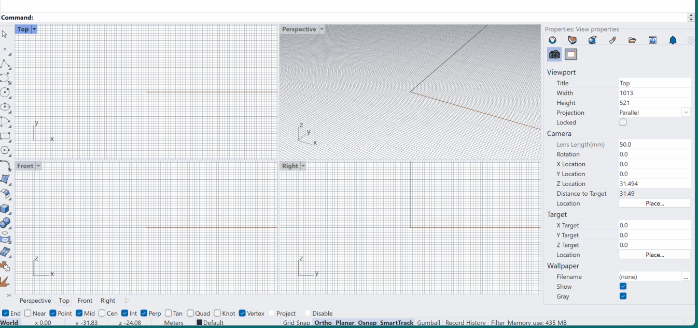
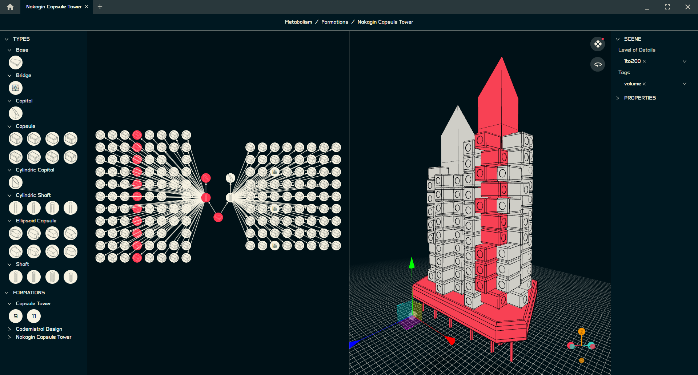

import { Steps, FileTree } from "@astrojs/starlight/components";

:::note[Are you a Mac user?]
The code of semio is compatible with Windows, Mac and Linux but currently compiled for Windows only ⚠️
[Reach out to us on Discord](https://discord.gg/m6nnf6pQRc) if you want to help us extend it for Mac 👐
:::

semio has two user-interfaces:

- Grasshopper 🦗
- sketchpad ✏️

### 🦗 Grasshopper (Rhino 8)

:::tip[Are you interested in the latest version? ]
Then hit `Include pre-releases` and download `5.3.0-beta` ⬇️
:::

The Grasshopper plugin can be installed over the Rhino Package Manager 🟢

<Steps>

1. Open Rhino Package Manger ⌨️
2. Search for semio 🔎
3. Install the latest version ⬇️
4. Restart Rhino 🔄

</Steps>

That's it!

### ✏️ sketchpad

:::caution[Still a prototype 🧑‍💻]
It doesn't use the latest versions of the engine and Grasshopper ⚠️
:::

{/*  */}
{/*  */}

[sketchpad](https://github.com/usalu/semio/releases/download/r24.07-1/sketchpad.exe) is a portable program and needs no installation. To use sketchpad with Grasshopper you need to download semio Grasshopper `2.1.2`. If you want to use sketchpad standalone you need to download, extract and start the [engine](https://github.com/usalu/semio/releases/download/r24.07-1/engine.zip). After this you can open the [examples](https://github.com/usalu/semio/releases/download/r24.07-1/examples.zip)🏎️
