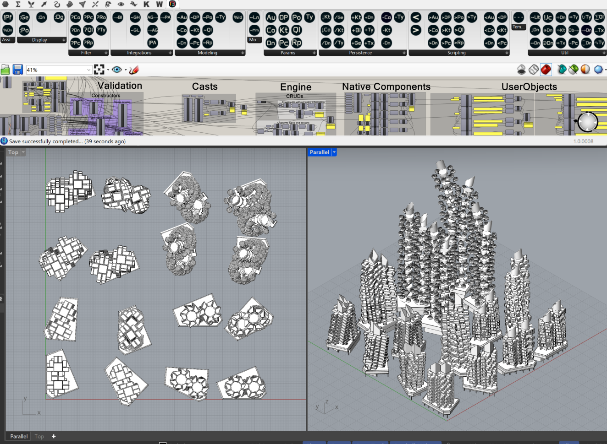
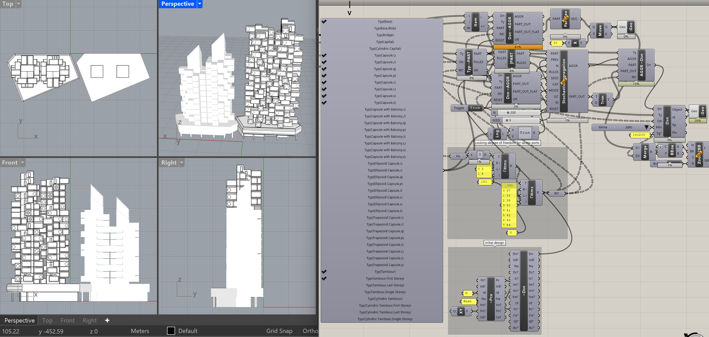
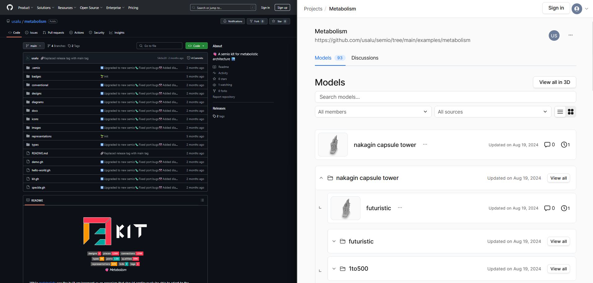
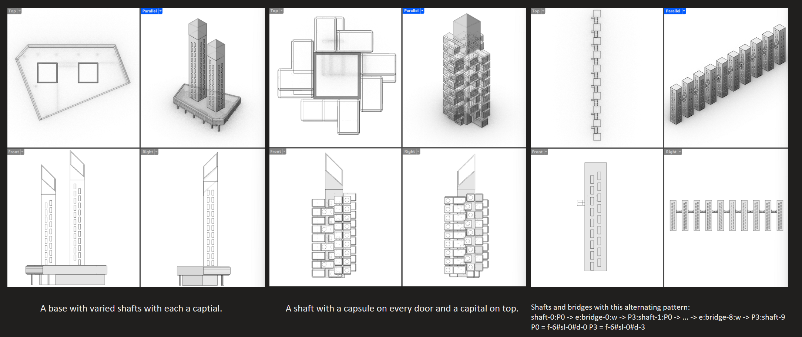

import { Tabs, TabItem, Card, Aside } from "@astrojs/starlight/components";

## 🛠️ Features

### ✅ Ready

- **[Grasshopper](/manuals/grasshopper):** Battery-included plugin for creating, editing and sharing semio kits 🦗
  
- **[sketchpad](/manuals/grasshopper):** A drag-and-drop interface to create semio designs ✏️
  
- **[Wasp](/integrations/wasp):** A Grasshopper-based integration between semio and Wasp 🐝
  
- **[Remote](/integrations/cloud):** Use any file-hosting platform as a shared Common-Data-Environment ☁️
  

### 🚀 In the making

- **[assistant](/manuals/assistant):** A personalized ai to help you design 🤖
  
- **[Ladybug](/integrations/speckle):** A Grasshopper-based converter from semio to Ladybug 🐞
- **[Speckle](/integrations/speckle):** A Grasshopper-based integration between semio and Speckle 🟦

### 📅 Planned

- **[studio](/manuals/studio):** A platform to design together in real-time 🕹️

## ❌ What semio is _not_:

- Rhino, SketchUp, 3ds Max, Spline, Blender, ...

  A _3d_ tool 🐚

  > In semio you **link** 3d-models 🎋

- AutoCAD, DraftSight, LibreCAD, ...

  A _CAD_ tool 📐

  > In semio you **link** dynamic blocks 📦

- Revit, ArchiCAD, Vectorworks, BricksCAD, Bonsai, …

  A _BIM_ tool 🧱

  > In semio you **link** instances of your own types 🗿

- Grasshopper, Dynamo, GenerativeComponents, Sverchok, …

  A _node_ tool 🦗

  > In semio you **link** the input with the output ⛓️‍💥

- IFC, Speckle, BHoM, …

  A _data_ tool 📄

  > In semio you **link** design knowledge 📚

- Hypar, Viktor, Fusion, …

  A _parametric_ tool 🎛️

  > In semio you **link** static designs 🩻

- Wasp, Assembler, Monoceros, ComputerGeneratedArchitecture …

  A _solver_ tool 🎰

  > In semio you **link** precise pieces 🪡

- OpenSCAD, CadQuery, Fornjot, …

  A _scripting_ tool 📜

  > In semio you **link** ports visually 🖱️

- Illustrator, AffinityDesigner, InkScape, …

  A _vector_ tool ↗️

  > In semio you **link** drawings 🪙

- EnergyPlus, TRYNSIS, Modellica, …

  A _simulation_ tool ☀️

  > In semio you **link** models and results 🔢

- Autodesk Construction Cloud, Bimcloud, Bentley Infrastructure Cloud, Git, Nextcloud, …

  A _CDE_ tool ☁️

  > In semio you **link** urls 🔗

## 📖 So, what _is_ semio?

<Card title="Design-Information-Modeling for Kit-of-Parts Architecture 🧩">
  semio is the toolchain for designing **modular** architecture ✏️
</Card>

In other words:

- An _open-source_ ecosystem for designing kit-of-parts architecture 🧩
- A _designer-affine_ pencil for a placeholder-based, non-linear and iterative design space exploration 🔀
- A _collaboration-friendly_ platform to design effectively in large teams 🤝
- A _local-first_ storage to link, reuse and develop design systems 🔗
- A _decentralized_ technology of sharing online assets with metadata 🌐
- An _ai-boosted_ design assistant, ready for LLM super powers 🤖
- A _razor-sharp_ interface for integrating manual and automated design workflows 🏗️
- A _conversion-free_ interoperability standard that sits on top of existing software and is not trying to get in between 🪆
- A _ready-to-use_ API for other developers 👩‍💻

## 📃 Principles

semio is built on top of the following premises:

- **[🔓 Open over closed](#open-over-closed):** Futureproof technology needs to be developed together 🤝
- **[🖱️ Manual over automated](#manual-over-automated):** Design supported and not derived by technology 🪛
- **[👥 Team over individual](#team-over-individual):** To collaborate efficiently we need interfaces 🧩
- **[♻️ Composable over disposable](#composable-over-disposable):** Even the most complex systems can be thought of parts 🧠
- **[🧪 Implementation over specification](#implementation-over-specification):** Hands-on instead of head-first ✍️
- **[🔀 Integration over generality](#integration-over-generality):** We don't want to replace existing tools but extend them 🚀
- **[🔨 Simple over complex](#simple-over-complex):** Complexity arises on it's own 🌱
- **[📖 Example over theory](#example-over-theory):** To avoid building an ivory tower 🗼
- **[🏛️ Architecture over modeling](#architecture-over-modeling):** We need more architecture-focused toolchains ✏️
- **[🏗️ Prefab over custom](#prefab-over-custom):** For economic and ecologic solutions 📉

### 🔓 Open over closed

:::note[Did you know?]
semio stands on the shoulder of giants 🏙️ It is built with cutting-edge open-source technology 🌍
| Tool | Users | Followers | Contributors |
|------|-------|-----------|--------------|
| [User Interface](https://github.com/facebook/react) | 27,800,000 | 234,000 | 1,698 |
| [3D Engine](https://github.com/mrdoob/three.js/) | 465,000 | 105,000 | 1,977 |
:::

The reason why computer science is so successful is because all of its core is open-source 🤝

Big IT-companies have realized that an open core is the best way for an industry to grow 📈

The monetization shouldn't happen on the core technology but on the services around them 💰

As customers we pay for:

- Shared collaboration environments
- Productivity enhancing features
- Private working spaces
- Integration with company-specific infrastructure
- …

We don't care about the underlying:

- Libraries
- Engines
- APIs
- CLIs
- SDKs
- …

Software companies of the Architecture-Engineering-Construction (AEC) industry have made the mistake to compete on the core technology instead of the services around them ❌

They have built closed-source core technology with open-source extensions to lock you into their platform 🔒

That's why semio is built the other way around 🔄️

The core technology is open-source and the extensions are closed-source 🔓

This way the industry can grow together by sharing the effort of building the core technology and companies that offer cloud solutions, ai features, … can still be profitable 📈

{/* prettier-ignore */}
<Aside type="tip" title="Are you curious what the world runs on?">
  <Tabs>
    <TabItem label="Operating System">
      Most servers in the world run on [Kubernetes](https://kubernetes.io) which runs containers with [Docker](https://www.docker.com) that uses mainly [Linux](https://www.linux.org) 🐧
    </TabItem>
    <TabItem label="Version Control">
      [GitHub](https://github.com), [GitLab](https://gitlab.com) and [Bitbucket](https://bitbucket.org) all rely on a linux tool [git](https://git-scm.com) 🔨
    </TabItem>
    <TabItem label="User Interfaces">
      {/* TODO: Doublecheck listing and add company-internal link for every company https://jaydevs.com/top-companies-using-react-js/ */}
      [React](https://react.dev) was originally only developed by [Facebook](https://github.com/facebook/react) but nowadays 
      [Netflix](https://netflixtechblog.com/tagged/react), 
      Airbnb, 
      Paypal, 
      Uber, 
      Walmart,
      Twitch,
      BBC,
      Tesla,
      Dropbox, 
      Salesforce,
      … use it to power their systems ⚡
    </TabItem>
    <TabItem label="Databases">
      [PostgreSQL](https://www.postgresql.org), 
      [MySQL](https://www.mysql.com),
      [MariaDB](https://mariadb.org), 
      [SQLite](https://www.sqlite.org), 
      [MongoDB](https://www.mongodb.com), 
      [Redis](https://redis.io), 
      [Cassandra](https://cassandra.apache.org), 
      [Neo4j](https://neo4j.com), 
      [InfluxDB](https://www.influxdata.com), 
      … have to be open for trust 👀
    </TabItem>
    <TabItem label="Programming Languages">
      [Python](https://www.python.org), 
      [Java](https://www.java.com), 
      [JavaScript](https://www.javascript.com), 
      [C++](https://isocpp.org), 
      [C#](https://learn.microsoft.com/en-us/dotnet/csharp/), 
      [Go](https://go.dev), 
      [Rust](https://www.rust-lang.org), 
      [PHP](https://www.php.net), 
      … have all open specification and implementations 🐍
    </TabItem>
  </Tabs>
</Aside>

### 🖱️ Manual over automated

### 👥 Team over individual

### ♻️ Composable over disposable

### 🛠️ Implementation over specification

### 🔀 Integration over generality

### 🧩 Simple over complex

### 📖 Example over theory

### 🏛️ Architecture over modeling

### 🏗️ Prefab over custom

## 🤨 When should I design with semio?

If you design unique atmospheres
by hand drawn sketches, eager to find the right shape based on surfaces with one-of-each-kind morphology, then you should stick to your 3d tool ❌

If you design floor plans, sections and elevations
by moving lines and hatches around, analyzing contours
then you should stick to your CAD tool ❌

If you design storeys, walls, windows, slabs and roofs
by moving them around, changing individual dimensions of those,
then you should stick to your BIM tool ❌

If you design high-resolution blobs
by sophisticated rules, statistical noise, intersection-based entropy,
then you should stick to your solver tool ❌

If you design modular systems
by iteratively developing typology based on metrics,
then you should use semio ✅
