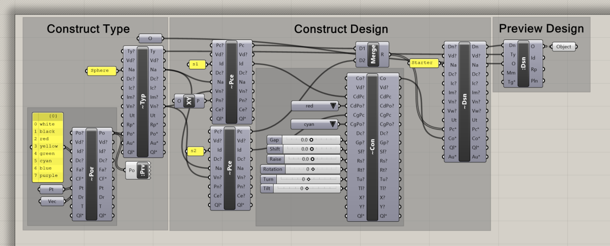
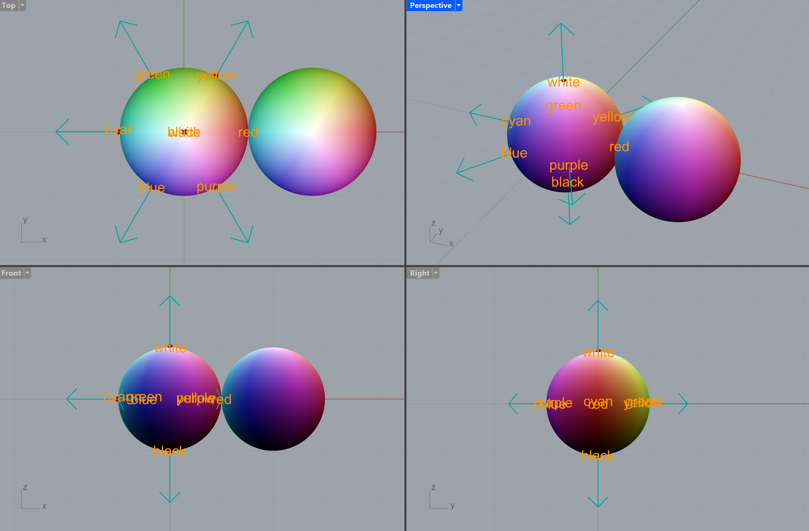
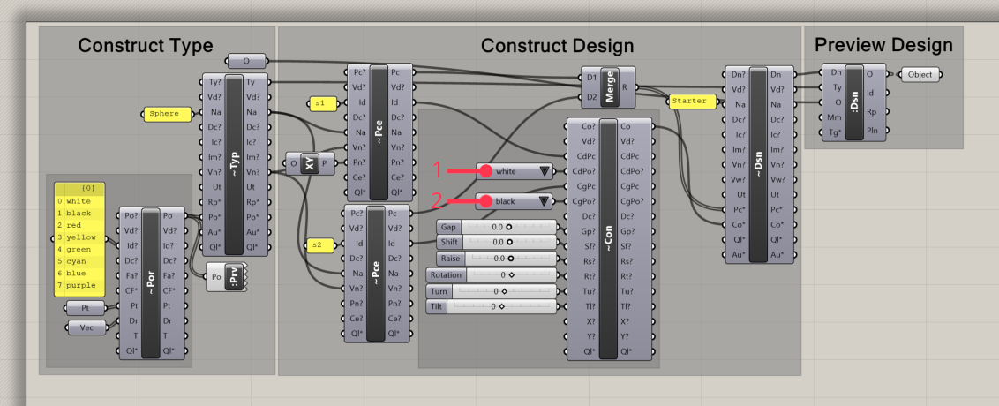
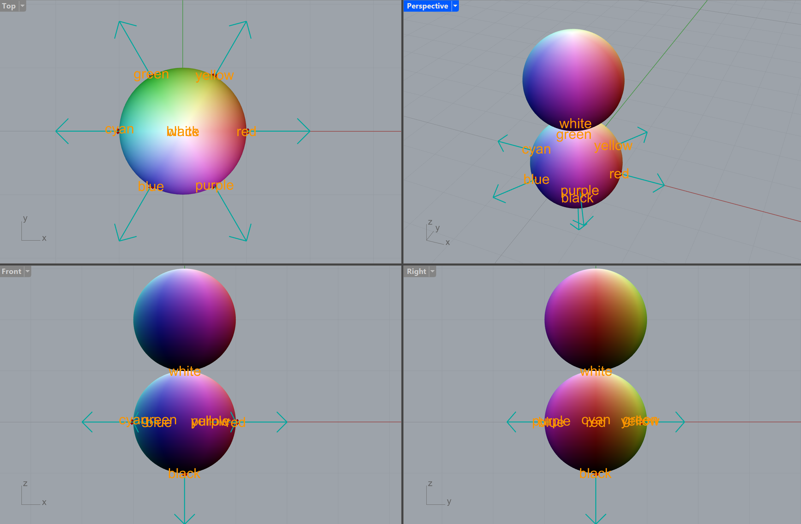
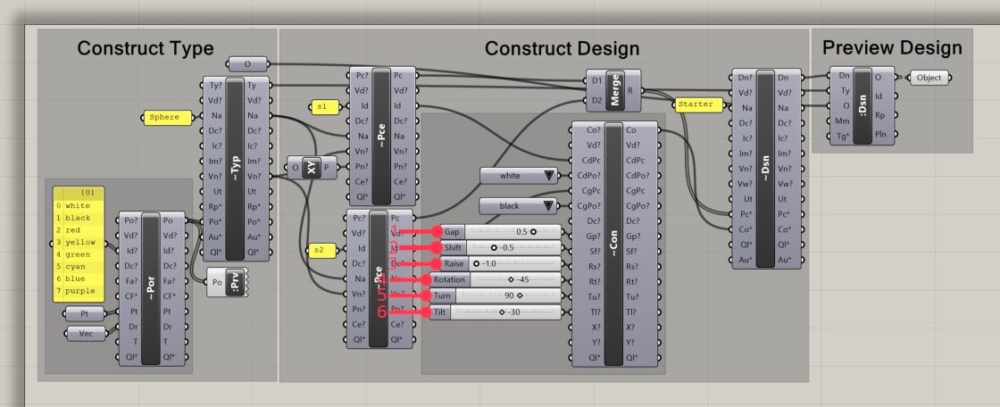
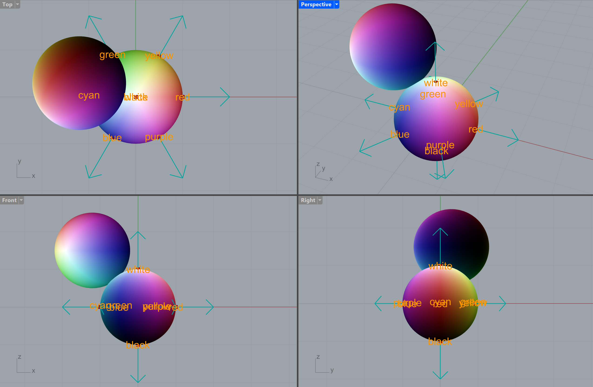

{/* Goals: */}
{/* - Explain a type (sphere) and ports (based on colors) */}
{/* - Show a piece (instance of type) a simple connection */}
{/* - Minimum amount of components: (Model Representation), Model Port, Model Type, (Model Piece), (Model Connection), (Model Design), Show Design */}

import { Steps, FileTree, Aside } from '@astrojs/starlight/components'
import { File } from '@semio/js'

{/* prettier-ignore */}

  <File
    client:load
    src="/colorful-sphere.glb"
    environment="/schlenker-shed.hdr"
  />
  <File
    client:load
    src="/pattern-sphere.glb"
    environment="/schlenker-shed.hdr"
  />

{/* prettier-ignore */}
{/* ## ✏️ sketchpad

  <Sketchpad client:load />

*/}

{/* prettier-ignore */}
{/* <Model client:load src="../../../../../examples/geometry/representations/colorful-sphere.glb"/> */}

## 🦗 Grasshoper

<Steps>

1. [Download the example file `starter.gh`](https://raw.githubusercontent.com/usalu/semio/examples/starters/starter.gh) ⬇️

2. Open the `starter.gh` file 📂

   In Grasshoper you should see:
   

   In Rhino you should see:
   

3. Change the ports from 1:`red` to `white` and 2:`cyan` to `black` 🎨

   In Grasshoper you should see:
   

   In Rhino you should see:
   

   <Aside type="tip" title="👀 Do you see what ports are?">
     They are a connection point with an out direction that is aligned ↗️
   </Aside>

4. Change the connection parameters (1:`Gap`, 2:`Shift`, 3;`Rise`, 4:`Rotation`, 5:`Turn`, 6:`Tilt`) 🎛️

   In Grasshoper you should see:
   

   In Rhino you should see:
   

   <Aside type="note" title="🤯 What just happened?">
     The connection parameters are applied one after each other 🔢
   </Aside>

</Steps>

That's it! Your first semio design 🎉
