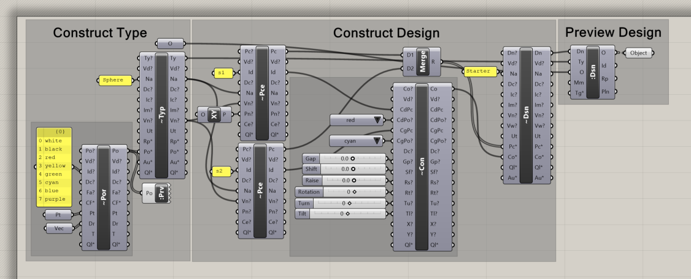
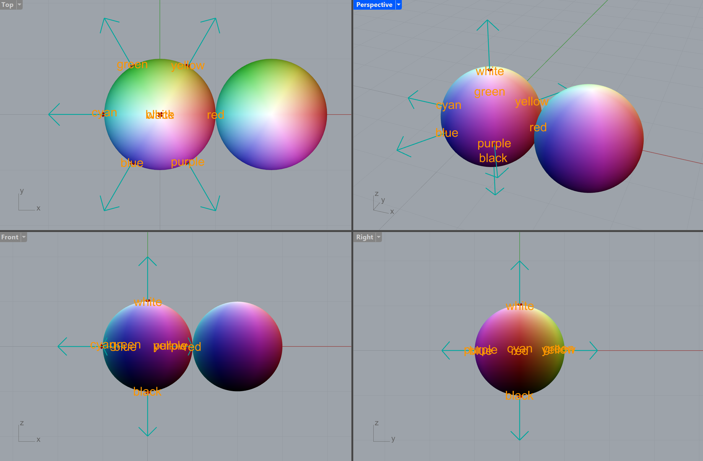
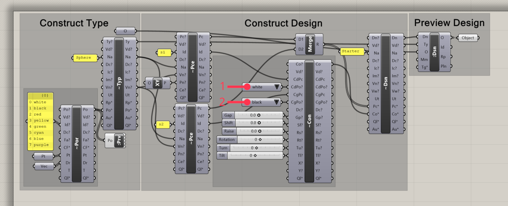
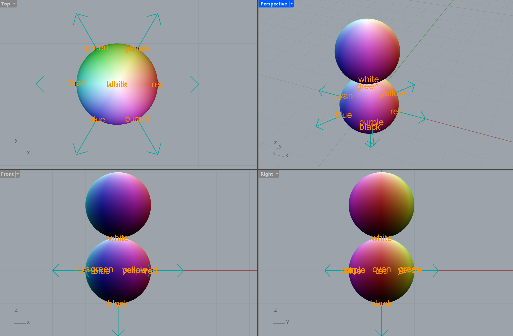
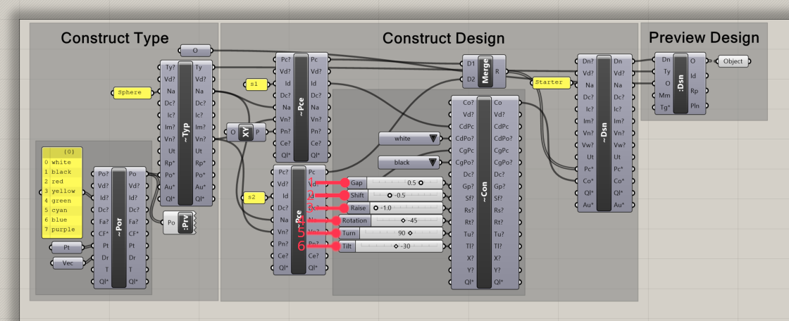
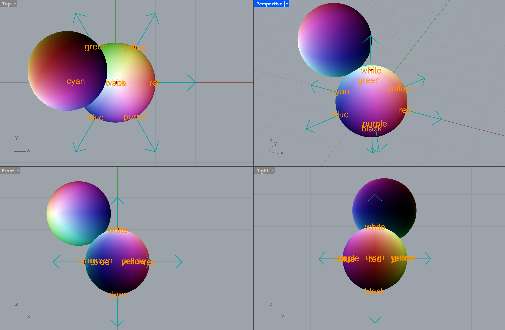

{/* Goals: */}
{/* - Explain how to install semio */}
{/* - Explain a type (sphere) and ports (based on colors) */}
{/* - Show a piece (instance of type) a simple connection */}
{/* - Minimum amount of components: (Model Representation), Model Port, Model Type, (Model Piece), (Model Connection), (Model Design), Show Design */}

import { Steps, FileTree, Aside } from "@astrojs/starlight/components";
import { Model } from "@semio/js";

<Model client:load src="/sphere.gltf" />

{/* <Model client:load src="http://localhost:4321/sphere.glb" /> */}

## 🦗 Grasshoper

<Steps>

1. [Download the example file `starter.gh`](https://raw.githubusercontent.com/usalu/geometry/starter/starter.gh) ⬇️

2. Open the `starter.gh` file 📂

   In Grasshoper you should see:
   

   In Rhino you should see:
   

3. Change the ports from 1:`red` to `white` and 2:`cyan` to `black` 🎨

   In Grasshoper you should see:
   

   In Rhino you should see:
   

   <Aside type="tip" title="👀 Do you see what ports are?">
     They are a connection point with an out direction that is aligned ↗️
   </Aside>

4. Change the connection parameters (1:`Gap`, 2:`Shift`, 3;`Raise`, 4:`Rotation`, 5:`Turn`, 6:`Tilt`) 🎛️

   In Grasshoper you should see:
   

   In Rhino you should see:
   

   <Aside type="note" title="🤯 What just happened?">
     The connection parameters are applied one after each other 🔢
   </Aside>

</Steps>

That's it! Your first semio design 🎉
