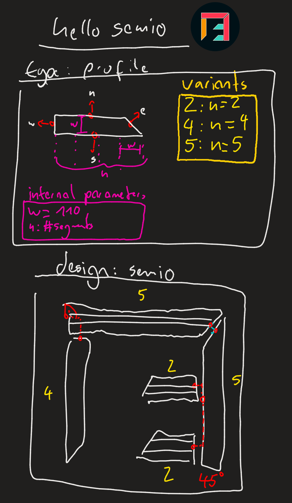
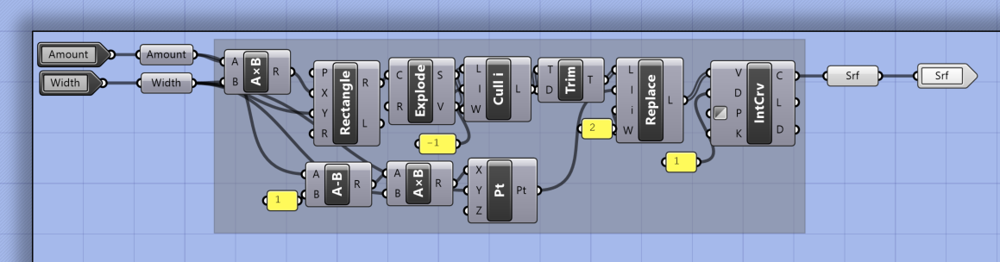
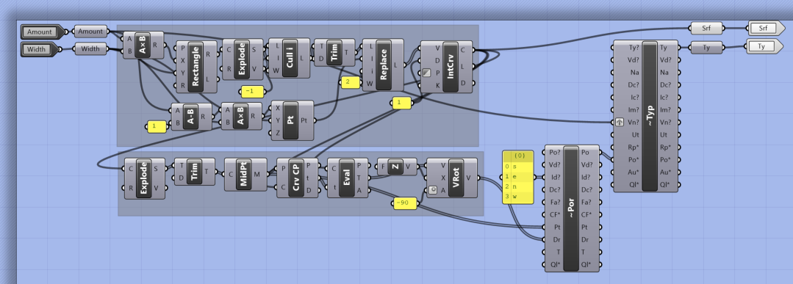

{/* ELO - Expected Learning Outcomes */}
{/* - Explain types and variants */}
{/* - Explain connection parameters */}
{/* - Explain representations (why semio uses urls and not directly geometry) and what a kit is (folder + .semio) */}

import { Steps, FileTree } from "@astrojs/starlight/components";

## ✍️ Concept

# 🦗 Grasshopper

<Steps>

1. [Download the `hello-semio` example kit](https://github.com/usalu/hello-semio/archive/refs/heads/main.zip) ⬇️

   After unpacking the `hello-semio-main.zip` you should see:

   <FileTree>

   - .semio/
   - hello-semio.gh
   - profile.gh
   - profile-2.glb
   - profile-4.glb
   - profile-5.glb

   </FileTree>

2. Open the `hello-semio.gh` file 📂

3. Open the `hello-semio.gh` file 📂

   In Grasshoper you should see:
   

4. Open the `hello-semio.gh` file 📂

   In Grasshoper you should see:
   

</Steps>
