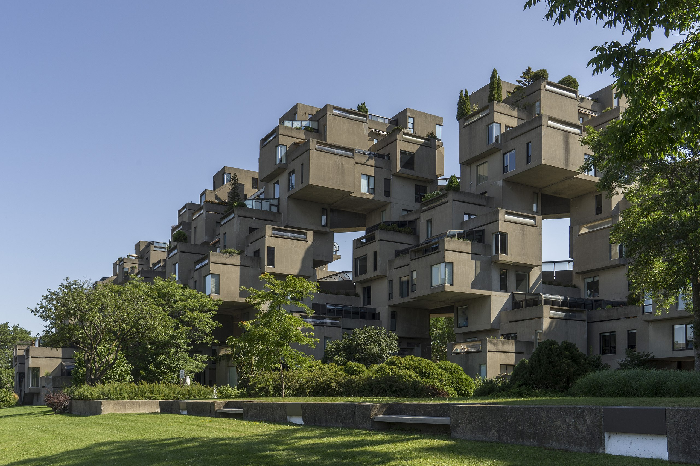

import { Tabs, TabItem, Card } from "@astrojs/starlight/components";

## 🧭 Why Rethink the Way We Model?

There’s a gap between **how architects think** and **how most tools work**

Designers think in:

- 🧠 **Systems**  
- 🔗 **Relationships**  
- 🧩 **Intentions and rules**

But traditional tools still expect:

- 📦 **Fixed components**  
- 📐 **Static geometry**  
- 🏷️ **Predefined categories**

> 🧠 **Semio takes a different route** —  
> letting you model design **logic**, **behavior**, and **systems** before locking in form

---

## 🧰 From Shapes to Systems

### ✏️ Traditional Modeling

Modeling used to mean: **drawing shapes**

You worked with:

- Lines ✏️  
- Volumes 📐 
- Layers 📊  

> You draw *how something looked* —  
> not how it behaves, connects, or can be evolved

It is **visual**, but not **relational** 

---

### 🏗️ BIM — Building Information Modeling

**BIM** introduced a major shift 💥  
It added **meaning** to geometry — now walls, windows, and roofs weren’t just lines,  
they became **smart objects** with embedded data 📦

That opened the door to better documentation, but it came with assumptions:

- The design is already decided 🗂️  
- You’re working toward construction 📄  
- You're choosing from fixed categories 🧱  

##### 🚫 But BIM Has Its Limits:

- Struggles with **non-standard geometry** 🌀  
- Can't easily express **modular systems** 🧩  
- Lacks flexibility for **custom parts** ⚙️  

:::note[What’s hard to model in BIM?]
- Inclined walls 🏔️  
- Split-level structures 🧗  
- free-form roofs 🔁 
:::

---

### 🧠 DIM — Design Information Modeling

**Design Information Modeling (DIM)** is a concept developed by **Semio** 🔬  
It supports how architects actually work — **iteratively**, **modularly**, and with evolving intent 🎯

Instead of modeling finished **objects**, DIM helps you model:

- 🧩 **Rules** — What can connect, repeat, or vary  
- 🔗 **Relationships** — How parts relate or depend on each other  
- 📄 **Placeholders** — Where meaning and data can evolve over time  

> DIM focuses on **design structure**, not predefined function  
> It lets you embed **custom logic** and **metadata** that evolve with your system 🔧

DIM works without forcing a final form —  
perfect for **early design**, **custom systems**, and **complex reuse workflows** 🔁

---

### 🔀 Semio vs BIM

##### This is how BIM tools read architecture
 

> As a catalog of elements 📚        
> quantified, categorized, and ready for construction  📊  
> but often detached from the logic behind the design 🔍
 
{/* prettier-ignore */}
<Tabs>
  <TabItem label="1234 Walls, 567 Railings, 890 Windows">
    
    

      [© CC BY-SA 4.0](https://de.wikipedia.org/wiki/Habitat_67#/media/Datei:Habitat_67,_southwest_view.jpg)
    

  </TabItem>
  <TabItem label="1234 Columns, 5678 Beams">
    
    

      [© CC BY-SA 2.0](https://en.wikipedia.org/wiki/File:Birds_Nest_at_Night.jpg)
    

  </TabItem>
  <TabItem label="123 Stairs, 456 Slabs">
    
    

      [© CC BY-SA 3.0](https://en.wikipedia.org/wiki/File:Nakagin.jpg)
    

  </TabItem>
</Tabs>

➤ *It’s accurate* 🎯 
but it reduces architecture  
to **isolated parts** 🧩

---

##### But this is how architects think 
 
> In systems 🧬  
> In relationships 🔗  
> In design intent 🧠
 
{/* prettier-ignore */}
<Tabs>
  <TabItem label="15 Dwelling Units, 4 Properties">
    
    

      [© CC BY-SA 4.0](https://de.wikipedia.org/wiki/Habitat_67#/media/Datei:Habitat_67,_southwest_view.jpg)
    

  </TabItem>
  <TabItem label="10 Structure Units, 5 Properties">
    
    

      [© CC BY-SA 2.0](https://en.wikipedia.org/wiki/File:Birds_Nest_at_Night.jpg)
    

  </TabItem>
  <TabItem label="6 Capsule Units, 3 Properties">
    
    

      [© CC BY-SA 3.0](https://en.wikipedia.org/wiki/File:Nakagin.jpg)
    

 

➤ A few adaptable **units** 🧱  
each shaped by a handful of meaningful **design properties** 🎚️  

**Together, they form a language** 🗣️  
one that speaks in **patterns**, not only parts 🕸️

:::tip[Curious?]
The Nakagin Capsule Tower has been [digtially reconstructed in semio](../../showcases/metabolism) ⚒️
:::
  </TabItem>
</Tabs>

 💡 **This is where semio takes a different path:**  
> You don’t start by placing walls or windows —  
> You start by shaping **ideas**, **rules**, and **relationships** 🧠  
>  
> Only then do you turn them into elements like **walls**, **zones**, or **components** — when you’re ready 🛠️  

