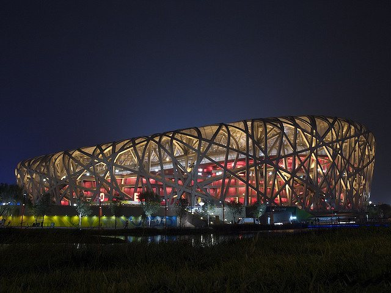

import { Tabs, TabItem, Card } from "@astrojs/starlight/components";

Design today is increasingly **system-based**, **modular**, and **dynamic**.  
But most tools are still built around **static components** and **fixed categories**.  
They assume you begin with **geometry**, not with **structure**, **logic**, or **relationships**.  

> **semio takes a different approach.**  
To support a more flexible, system-oriented way of working, we introduced a new modeling foundation:

---

### 🧠 What is Design Information Modeling?

**Design Information Modeling (DIM)** is a modeling approach developed by semio to support a level of architectural thinking that most tools overlook.  

- Model **design logic** instead of static shapes 🧩  
- Use **relationships**, **abstractions**, and **references** to define systems 🔗  
- Focus on **how it is all connected**, not only **how it looks** 🛠️

---

### 🧱 Why We Created DIM

**Building Information Modeling (BIM)** brought a major shift to architectural workflows by introducing **semantics**:  
> Rather than just drawing lines, you place **smart objects** (like walls or windows) with embedded data, enabling efficient documentation and coordination later on.  

However, this comes with constraints:

- Fixed building elements make **non-standard designs** hard to model 🚧  
  - **Inclined walls** 🏔️  
  - **Split-level structures** 🏠 
  - **Free-form roofs** 🌊  

 
-  BIM assumes most design decisions are already made.  
- It’s not built for 
  - modular systems, 
  - adaptive relationships, or 
  - custom logic 

  especially in early design.  

---

#### This is how BIM tools read architecture
 

> As a catalog of elements 📚        
> quantified, categorized, and ready for construction  📊  
> but often detached from the logic behind the design 🔍
 
{/* prettier-ignore */}
<Tabs>
  <TabItem label="1234 Walls, 567 Railings, 890 Windows">
    
    

      [© CC BY-SA 4.0](https://de.wikipedia.org/wiki/Habitat_67#/media/Datei:Habitat_67,_southwest_view.jpg)
    

  </TabItem>
  <TabItem label="1234 Columns, 5678 Beams">
    
    

      [© CC BY-SA 2.0](https://en.wikipedia.org/wiki/File:Birds_Nest_at_Night.jpg)
    

  </TabItem>
  <TabItem label="123 Stairs, 456 Slabs">
    
    

      [© CC BY-SA 3.0](https://en.wikipedia.org/wiki/File:Nakagin.jpg)
    

  </TabItem>
</Tabs>

➤ *It’s accurate* 🎯 
but it reduces architecture  
to **isolated parts** 🧩

---

#### But this is how architects think 
 
> In systems 🧬  
> In relationships 🔗  
> In design intent 🧠
 
{/* prettier-ignore */}
<Tabs>
  <TabItem label="15 Dwelling Units, 4 Properties">
    
    

      [© CC BY-SA 4.0](https://de.wikipedia.org/wiki/Habitat_67#/media/Datei:Habitat_67,_southwest_view.jpg)
    

  </TabItem>
  <TabItem label="10 Structure Units, 5 Properties">
    
    

      [© CC BY-SA 2.0](https://en.wikipedia.org/wiki/File:Birds_Nest_at_Night.jpg)
    

  </TabItem>
  <TabItem label="6 Capsule Units, 3 Properties">
    
    

      [© CC BY-SA 3.0](https://en.wikipedia.org/wiki/File:Nakagin.jpg)
    

 

➤ A few adaptable **units** 🧱  
each shaped by a handful of meaningful **design properties** 🎚️  

**Together, they form a language** 🗣️  
one that speaks in **patterns**, not only parts 🕸️

:::tip[Curious?]
The Nakagin Capsule Tower has been [digtially reconstructed in semio](../../showcases/metabolism) ⚒️
:::
  </TabItem>
</Tabs>

> This is the difference between semio and other BIM tools 💡**  
In **semio**, you're not just arranging components! you're designing how they ****, how they ****, and how they can ****.  

## 🤨 When should I use Semio?

Use Semio when:

- You’re designing modular or repeatable systems  
- You want to collaborate across tools and teams  
- You care about reusability and scalability  
- You think in systems, not just shapes  

Semio is not a replacement for your tools — it’s a foundation to build on 🧱