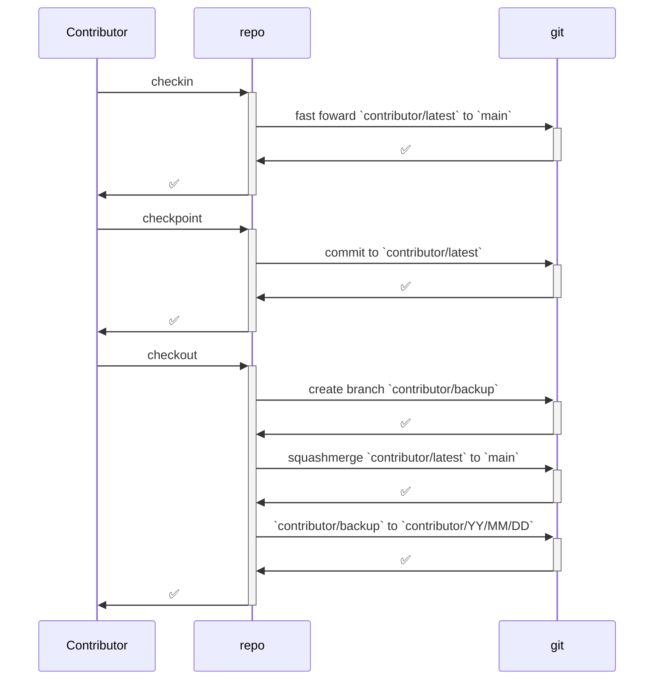

```mermaid
classDiagram
%% class event.{{entity}} {
%%  {{entity-name}}: Id
%% }
%% class event.{{entity}}.{{method}}.{{starting|ended}} {
%%  {{method-argument}}
%% }
class event {
  id: Id
  kind
  second
  checkpoint
  contributor
  client
}
class event.release {
  release: Id
}
event <|-- event.release
class event.release.plan {

}
event.release <|-- event.release.plan
event.release.plan <|-- event.release.plan.starting
event.release.plan <|-- event.release.plan.ended
class event.version {
  version
}
event <|-- event.version
class event.version.create.starting {
}
event.version <|-- event.version.starting

class event.checkpoint {
}
event <|-- event.checkpoint

class event.checkpoint.starting {
  newCheckpointDescription
}
event.checkpoint <|-- event.checkpoint.starting

class event.checkpoint.ended {
  oldCheckpoint
  newCheckpoint
  newCheckpointDescription
}
event.checkpoint <|-- event.checkpoint.ended

class event.checkin {
}
event <|-- event.checkin

class event.checkin.starting {
  checkinVersion
}
event.checkin <|-- event.checkin.starting

class event.checkin.ended {
  version
}
event.checkin <|-- event.checkin.ended

class event.checkout {
}
event <|-- event.checkout

class event.checkout.starting {
  checkoutCheckpointDescription
  checkoutCheckpoints
  archive
}
event.checkout <|-- event.checkout.starting

class event.checkout.ended {
  id
  description
}
event.checkout <|-- event.checkout.ended

class event.session {
  session
  llm
  parent
}
event <|-- event.session

class event.session.started {
}
event.session <|-- event.session.started

class event.session.ended {
}
event.session <|-- event.session.ended

class event.session.prompting {
}
event.session <|-- event.session.prompting

class event.session.prompting.starting {
  checkpoint
  session
  second
  llm
  message
  parent
  prompt
}
event.session.prompting <|-- event.session.prompting.starting

class event.session.prompting.ended {
  checkpoint
  session
  second
  llm
  message
  parent
  prompt
}
event.session.prompting <|-- event.session.prompting.ended

class event.session.compacting {
  checkpoint
  session
  second
  llm
  transcript
  message
  parent
  chat
}
event.session <|-- event.session.compacting

class event.session.plan {
}
event.session <|-- event.session.plan

class event.session.plan.updating {
  checkpoint
  session
  second
  llm
  transcript
}
event.session.plan <|-- event.session.plan.updating

class event.session.plan.updating.step {
  name
  status
}
event.session.plan.updating o-- event.session.plan.updating.step

class event.session.thinking {
}
event.session <|-- event.session.thinking

class event.session.thinking.starting {
  checkpoint
  session
  second
  llm
  transcript
  message
  parent
  prompt
}
event.session.thinking <|-- event.session.thinking.starting

class event.session.thinking.ended {
  session
  second
  llm
  transcript
  message
  parent
  prompt
}
event.session.thinking <|-- event.session.thinking.ended

class event.session.search {
}
event.session <|-- event.session.search

class event.session.search.starting {
  session
  second
  llm
  transcript
  pages
  ranges
}
event.session.search <|-- event.session.search.starting

class event.session.search.ended {
  session
  second
  llm
  transcript
  pages
  ranges
  error
}
event.session.search <|-- event.session.search.ended

class event.session.code {
}
event.session <|-- event.session.code

class event.session.code.edit {
}
event.session.code <|-- event.session.code.edit

class event.session.code.edit.starting {
  session
  second
  llm
  transcript
  path
  old
  new
  all
}
event.session.code.edit <|-- event.session.code.edit.starting

class event.session.code.edit.ended {
  session
  second
  llm
  transcript
  path
  old
  new
}
event.session.code.edit <|-- event.session.code.edit.ended

class event.session.test {
}
event.session <|-- event.session.test

class event.session.test.starting {
  session
  second
  llm
  transcript
  tests
  timeout
}
event.session.test <|-- event.session.test.starting

class event.session.test.ended {
  session
  second
  llm
  transcript
  succeeded
  failed
}
event.session.test <|-- event.session.test.ended

class event.session.build {
}
event.session <|-- event.session.build

class event.session.build.starting {
  session
  second
  llm
  transcript
  bundles
}
event.session.build <|-- event.session.build.starting

class event.session.build.ended {
  session
  second
  llm
  transcript
  succeeded
  failed
}
event.session.build <|-- event.session.build.ended

class event.session.terminal {
}
event.session <|-- event.session.terminal

class event.session.terminal.starting {
  session
  second
  llm
  transcript
  command
}
event.session.terminal <|-- event.session.terminal.starting

class event.session.terminal.ended {
  session
  second
  llm
  transcript
  command
  pid
  terminated
  stdout
  stderr
}
event.session.terminal <|-- event.session.terminal.ended

class event.session.tool {
}
event.session <|-- event.session.tool

class event.session.tool.starting {
  session
  second
  llm
  transcript
  message
  parent
  name
  input
}
event.session.tool <|-- event.session.tool.starting

class event.session.tool.ended {
  session
  second
  llm
  transcript
  message
  parent
  name
  input
  response
}
event.session.tool <|-- event.session.tool.ended
```

```mermaid
classDiagram

class event {
  id
  uri
  kind
  second
  checkpoint
  contributor
  client
}

class event.version {
  newCheckpointDescription
}
event <|-- event.version

class event.version.starting {
}
event.version <|-- event.version.starting

class event.checkpoint {
}
event <|-- event.checkpoint

class event.checkpoint.starting {
  newCheckpointDescription
}
event.checkpoint <|-- event.checkpoint.starting

class event.checkpoint.ended {
  oldCheckpoint
  newCheckpoint
  newCheckpointDescription
}
event.checkpoint <|-- event.checkpoint.ended

class event.checkin {
}
event <|-- event.checkin

class event.checkin.starting {
  checkinVersion
}
event.checkin <|-- event.checkin.starting

class event.checkin.ended {
  version
}
event.checkin <|-- event.checkin.ended

class event.checkout {
}
event <|-- event.checkout

class event.checkout.starting {
  checkoutCheckpointDescription
  checkoutCheckpoints
  archive
}
event.checkout <|-- event.checkout.starting

class event.checkout.ended {
  id
  description
}
event.checkout <|-- event.checkout.ended

class event.session {
  session
  llm
  parent
}
event <|-- event.session

class event.session.started {
}
event.session <|-- event.session.started

class event.session.ended {
}
event.session <|-- event.session.ended

class event.session.prompting {
}
event.session <|-- event.session.prompting

class event.session.prompting.starting {
  checkpoint
  session
  second
  llm
  message
  parent
  prompt
}
event.session.prompting <|-- event.session.prompting.starting

class event.session.prompting.ended {
  checkpoint
  session
  second
  llm
  message
  parent
  prompt
}
event.session.prompting <|-- event.session.prompting.ended

class event.session.compacting {
  checkpoint
  session
  second
  llm
  transcript
  message
  parent
  chat
}
event.session <|-- event.session.compacting

class event.session.plan {
}
event.session <|-- event.session.plan

class event.session.plan.updating {
  checkpoint
  session
  second
  llm
  transcript
}
event.session.plan <|-- event.session.plan.updating

class event.session.plan.updating.step {
  name
  status
}
event.session.plan.updating o-- event.session.plan.updating.step

class event.session.thinking {
}
event.session <|-- event.session.thinking

class event.session.thinking.starting {
  checkpoint
  session
  second
  llm
  transcript
  message
  parent
  prompt
}
event.session.thinking <|-- event.session.thinking.starting

class event.session.thinking.ended {
  session
  second
  llm
  transcript
  message
  parent
  prompt
}
event.session.thinking <|-- event.session.thinking.ended

class event.session.search {
}
event.session <|-- event.session.search

class event.session.search.starting {
  session
  second
  llm
  transcript
  pages
  ranges
}
event.session.search <|-- event.session.search.starting

class event.session.search.ended {
  session
  second
  llm
  transcript
  pages
  ranges
  error
}
event.session.search <|-- event.session.search.ended

class event.session.code {
}
event.session <|-- event.session.code

class event.session.code.edit {
}
event.session.code <|-- event.session.code.edit

class event.session.code.edit.starting {
  session
  second
  llm
  transcript
  path
  old
  new
  all
}
event.session.code.edit <|-- event.session.code.edit.starting

class event.session.code.edit.ended {
  session
  second
  llm
  transcript
  path
  old
  new
}
event.session.code.edit <|-- event.session.code.edit.ended

class event.session.test {
}
event.session <|-- event.session.test

class event.session.test.starting {
  session
  second
  llm
  transcript
  tests
  timeout
}
event.session.test <|-- event.session.test.starting

class event.session.test.ended {
  session
  second
  llm
  transcript
  succeeded
  failed
}
event.session.test <|-- event.session.test.ended

class event.session.build {
}
event.session <|-- event.session.build

class event.session.build.starting {
  session
  second
  llm
  transcript
  bundles
}
event.session.build <|-- event.session.build.starting

class event.session.build.ended {
  session
  second
  llm
  transcript
  succeeded
  failed
}
event.session.build <|-- event.session.build.ended

class event.session.terminal {
}
event.session <|-- event.session.terminal

class event.session.terminal.starting {
  session
  second
  llm
  transcript
  command
}
event.session.terminal <|-- event.session.terminal.starting

class event.session.terminal.ended {
  session
  second
  llm
  transcript
  command
  pid
  terminated
  stdout
  stderr
}
event.session.terminal <|-- event.session.terminal.ended

class event.session.tool {
}
event.session <|-- event.session.tool

class event.session.tool.starting {
  session
  second
  llm
  transcript
  message
  parent
  name
  input
}
event.session.tool <|-- event.session.tool.starting

class event.session.tool.ended {
  session
  second
  llm
  transcript
  message
  parent
  name
  input
  response
}
event.session.tool <|-- event.session.tool.ended
```

# 🧾 Specification

## 🕸️ Systems

### Repos, Technologies, Bundles, Folders, Files, Sections, Definitions

### Specifications, Algorithms

### Goals, Tickets

### Contributors, Interactions, Agents, Sessions

### Events, Commands, Hooks

### Policies, Statutes, Breaches, Requirements, Specs, Docs

### Releases, Versions, Checkpoints

### Languages, Trackers

## 🧮 Algorithms

## 🛠️ Mechanisms

### 🪪 Identification

```yaml
root:
  parent: none
  id:
    scheme: ""
    examples: [""]
  uri:
    scheme: "repo://"
    examples: ["repo://"]
years:
  parent: root
  emoji: 🎆
  code: yr
  id:
    scheme: "{{root-id}}🎆"
    examples: ["🎆"]
  uri:
    scheme: "{{root-uri}}{{years-name}}"
    examples: ["repo://years"]
year:
  parent: years
  id:
    scheme: "{{root-id}}🎆{{YY}}"
    examples: ["🎆26"]
  uri:
    scheme: "{{root-uri}}{{year-name}}/{{YY}}"
    examples: ["repo://year/26"]
months:
  parent: year
  emoji: 🌙
  code: mo
  id:
    scheme: "{{year-id}}🌙"
    examples: ["🎆26🌙"]
  uri:
    scheme: "{{root-uri}}{{months-name}}/{{YY}}"
    examples: ["repo://months/26"]
month:
  parent: months
  id:
    scheme: "{{year-id}}🌙{{MM}}"
    examples: ["🎆26🌙02"]
  uri:
    scheme: "{{root-uri}}{{month-name}}/{{YY}}{{MM}}"
    examples: ["repo://month/26/02"]
days:
  parent: month
  emoji: ☀️
  code: dy
  id:
    scheme: "{{month-id}}☀️"
    examples: ["🎆26🌙02☀️"]
  uri:
    scheme: "{{root-uri}}{{days-name}}/{{YY}}{{MM}}"
    examples: ["repo://days/26/02"]
day:
  parent: days
  id:
    scheme: "{{month-id}}☀️{{DD}}"
    examples: ["🎆26🌙02☀️15"]
  uri:
    scheme: "{{root-uri}}{{day-name}}/{{YY}}{{MM}}{{DD}}"
    examples: ["repo://day/26/02/15"]
hours:
  parent: day
  emoji: ⏰
  code: hr
  id:
    scheme: "{{day-id}}⏰"
    examples: ["🎆26🌙02☀️15⏰"]
  uri:
    scheme: "{{root-uri}}{{hours-name}}/{{YY}}{{MM}}{{DD}}{{HH}}"
    examples: ["repo://hours/26/02/15/14"]
hour:
  parent: hours
  id:
    scheme: "{{day-id}}⏰{{HH}}"
    examples: ["🎆26🌙02☀️15⏰14"]
  uri:
    scheme: "{{root-uri}}{{hour-name}}/{{YY}}{{MM}}{{DD}}{{HH}}"
    examples: ["repo://hour/26/02/15/14"]
minutes:
  parent: hour
  emoji: ⌚
  code: min
  id:
    scheme: "{{hour-id}}⌚"
    examples: ["🎆26🌙02☀️15⏰14⌚"]
  uri:
    scheme: "{{root-uri}}{{minutes-name}}/{{YY}}{{MM}}{{DD}}{{HH}}"
    examples: ["repo://minutes/26/02/15/14"]
minute:
  parent: minutes
  id:
    scheme: "{{hour-id}}⌚{{mm}}"
    examples: ["🎆26🌙02☀️15⏰14⌚33"]
  uri:
    scheme: "{{root-uri}}{{minutes-name}}/{{YY}}{{MM}}{{DD}}{{HH}}{{MM}}"
    examples: ["repo://minute/26/02/15/14/33"]
seconds:
  parent: minute
  emoji: ⏱️
  code: sec
  id:
    scheme: "{{minute-id}}⏱️"
    examples: ["🎆26🌙02☀️15⏰14⌚33⏱️"]
  uri:
    scheme: "{{root-uri}}{{seconds-name}}/{{YY}}{{MM}}{{DD}}{{HH}}{{MM}}"
    examples: ["repo://seconds/26/02/15/14/33"]
second:
  parent: seconds
  id:
    scheme: "{{minute-id}}⏱️{{SS}}"
    examples: ["🎆26🌙02☀️15⏰14⌚33⏱️38"]
  uri:
    scheme: "{{root-uri}}{{second-name}}/{{YY}}{{MM}}{{DD}}{{HH}}{{MM}}{{SS}}"
    examples: ["repo://second/26/02/15/14/33/38"]
repo:
  parent: root
  emoji: ""
  code: ""
  id:
    scheme: "{{root-id}}"
    examples: [""]
  uri:
    scheme: "{{root-uri}}{{repo-name}}"
    examples: ["repo://repo"]
releases:
  parent: repo
  emoji: 📢
  code: rel
  id:
    scheme: "{{repo-id}}📢"
    examples: ["📢"]
  uri:
    scheme: "{{root-uri}}{{YY?}}/{{MM?}}"
    examples: ["repo://releases", "repo://releases/26", "repo://releases/26/02"]
release:
  parent: releases
  id:
    scheme: "{{repo-id}}📢{{YY}}{{MM}}{{N}}"
    examples: ["📢26021"] # e.g. `r26.02-1`
  uri:
    scheme: "{{root-uri}}{{initial-releases-year}}/{{initial-release-month}}/{{release-number}}"
    examples: ["repo://release/26/02/1"]
versions:
  parent: release
  emoji: ⛳
  id:
    scheme: "{{release-id}}{{VV}}" # VV is two digit version number
    examples: ["📢260201⛳00"]
  uri:
    scheme: "{{root-uri}}{{versions-name}}/{initial-releases-year}}/{{initial-release-month}}/{{release-number}}/{{version-number}}"
    examples: ["repo://version/26/02/1/0"]
version:
  parent: versions
  id:
    scheme: "{{release-id}}⛳{{VV}}" # VV is two digit version number
    examples: ["📢260201⛳00"]
  uri:
    scheme: "{{root-uri}}{{versions-name}}/{initial-releases-year}}/{{initial-release-month}}/{{release-number}}/{{version-number}}"
    examples: ["repo://version/26/02/1/00"]
checkpoints:
  parent: "version+contributor"
  emoji: 🚩
  id:
    scheme: "{{repo-id}}{{contributor-id}}{{checkpoints-emoji}}"
    examples: ["📢260201⛳00🧑‍💻ueli🚩"]
  uri:
    scheme: "{{root-uri}}{{versions-name}}/{initial-releases-year}}/{{initial-release-month}}/{{release-number}}/{{version-number}}/{{contributor-alias}}"
    examples: ["repo://checkpoints/26/02/1/00/ueli"]
checkpoint:
  parent: checkpoints
  id:
    scheme: "{{checkpoints-id}}{{CC}}" # CC is two digit checkpoint number
    examples:
      - "📢260201⛳00🧑‍💻ueli🚩00"
  uri:
    scheme: "{{root-uri}}{{versions-name}}/{initial-releases-year}}/{{initial-release-month}}/{{release-number}}/{{version-number}}/{{checkpoint-number}}"
    examples: ["repo://checkpoint/26/02/1/00/usalu/00"]
technologies:
  parent: repo
  emoji: 🏗️
  code: prj
  id:
    scheme: "{{repo-id}}🏗️"
    examples: ["🏗️"]
  uri:
    scheme: "{{repo-id}}{{technologies-name}}/{{uri-encoded-identifying-path}}"
    examples: ["repo://technologies/26/02/15/14/33/38"]
technology:
  parent: technologies
  kinds:
    - name: infrastructure
    - name: user
    - name: research
  id:
    scheme: "{{repo-id}}{{technology-kind-emoji}}{{flat-technology-code}}"
    examples:
      - "🧰repo"
      - "👤semio"
  uri:
    scheme: "{{repo-id}}{{technologies-name}}/{{technology-name}}/{{uri-encoded-identifying-path}}"
    examples:
      - repo://technology/repo
      - repo://technology/semio
bundles:
  parent: technology
  emoji: 📦
  code: bnd
    kinds:
    - name: library
      emoji: 📚
      code: lib
    - name: schema
      emoji: 🛂
      code: sch
    - name: binary
      emoji: ⌨️
      code: bin
    - name: ui
      emoji: 🖱️
      code: ui
    - name: example
      emoji: 📔
      code: exa
    - name: site
      emoji: 🌐
      code: site
    - name: assets
      emoji: 🏪
      code: ast
  id:
    scheme: "{{technology-id}}📦"
    examples:
      - "👤semio📦"
      - "🧰repo📦"
  uri:
    scheme: "{{repo-id}}{{bundles-name}}/{{technology-name}}"
    examples:
      - repo://bundles/semio
      - repo://bundles/repo
bundle:
  parent: bundles
  id:
    scheme: "{{technology-id}}{{bundle-kind-emoji}}{{flat-bundle-code}}"
    examples:
      - "🌱mono🪆repo"
      - "👤semio📚js"
      - "🧰repo⌨️cli"
  uri:
    scheme: "{{repo-id}}{{bundles-name}}/{{technology-name}}/{{bundle-name}}"
    examples:
      - repo://bundle/mono/repo
      - repo://bundle/semio/js
      - repo://bundle/repo/client
folders:
  parent: bundle | folder
  emoji: 📁
  code: fd
  id:
    scheme: "{{(bundle-id|folder-id)?}}📁"
    examples:
      - "👤semio📚js📁"
      - "🧰repo⌨️cli📁"
      - "👤semio📚js🗃️sketchpad📁"
  uri:
    scheme: "{{repo-id}}{{folders-name}}/{{folder-path-with-uri-encoded-names}}"
    examples:
      - repo://folders/semio/js
      - repo://folders/semio/js/sketchpad
      - repo://folders/repo/client
folder:
  parent: folders
  kinds:
    - name: organization
    - name: required
  id:
    scheme: "{{(parent-bundle-id|parent-folder-id)?}}{{folder-kind-emoji}}{{flat-folder-name}}"
    examples:
      - "👤semio📚js🗃️sketchpad"
      - "🛅devcontainer"
  uri:
    scheme: "{{repo-id}}{{folders-name}}/{{folder-path-with-uri-encoded-names}}"
    examples:
      - repo://folders/semio/js/sketchpad
      - repo://folders/repo/client
files:
  parent: folder
  emoji: 📄
  code: fi
  id:
    scheme: "{{folder-id}}📄"
    examples:
      - "🛅devcontainer📄"
      - "👤semio📚js🗃️sketchpad📄"
  uri:
    scheme: "{{repo-id}}{{folder-name}}/{{uri-encoded-identifying-path}}"
    examples:
      - repo://fi/fd%2Forg%2Fsketchpad
file:
  parent: files
  kinds:
    - name: code
      emoji: 💻
      code: cd
    - name: lab
      emoji: 🥼
      code: ld
    - name: script
      emoji: 📜
      code: sd
    - name: docs
      emoji: 📝
      code: dd
    - name: config
      emoji: ⚙️
      code: cd
    - name: asset
      emoji: 💾
      code: ad
    - name: license
      emoji: ⚖️
      code: ld
  id:
    scheme: "{{folder-id}}{{file-kind-emoji}}{{flat-file-name-with-extension*}}"
    examples:
      - "👤semio📚js🗃️sketchpad💻designtsx"
      - "🛅devcontainer⚙️devcontainerjson"
  uri:
    scheme: "{{repo-id}}{{file-name}}/{{uri-encoded-identifying-path}}"
    examples:
      - repo://fi/fd%2Forg%2Fsketchpad%2Ff%2Fdesign.tsx
      - repo://fi/fd%2Freq%2F.devcontainer%2Ff%2Fdevcontainer.json
lines:
  parent: file
  emoji: 📌
  code: ln
  id:
    scheme: "{{file-id}}📌"
    examples:
      - "👤semio📚js🗃️sketchpad💻designtsx📌"
  uri:
    scheme: "{{repo-id}}{{lines-name}}/{{uri-encoded-identifying-path}}"
    examples:
      - repo://ln/fi%2Ff%2Fdesign.tsx
line:
  parent: lines
  id:
    scheme: "{{file-id}}📌{{linenumber}}"
    examples:
      - "👤semio📚js🗃️sketchpad💻designtsx📌3872"
  uri:
    scheme: "{{repo-id}}{{line-name}}/{{uri-encoded-identifying-path}}"
    examples:
      - repo://ln/fi%2Ff%2Fdesign.tsx%2F3872
ranges:
  parent: file
  emoji: 🧷
  code: rg
  id:
    scheme: "{{file-id}}📌📌"
    examples:
      - "👤semio📚js🗃️sketchpad💻designtsx📌📌"
  uri:
    scheme: "{{repo-id}}{{code}}/{{uri-encoded-identifying-path}}"
    examples:
      - repo://rg/fi%2Ff%2Fdesign.tsx
range:
  parent: ranges
  id:
    scheme: "{{file-id}}📌{{start-linenumber}}📌{{end-linenumber}}"
    examples:
      - "👤semio📚js🗃️sketchpad💻designtsx📌3872📌3875"
  uri:
    scheme: "{{repo-id}}{{code}}/{{uri-encoded-identifying-path}}"
    examples:
      - repo://rg/fi%2Ff%2Fdesign.tsx%2F3872%2F3875
sections:
  parent: section | file
  emoji: 🔖
  code: sc
  id:
    scheme: "{{(file-id|section-id)?}}🔖"
    examples:
      - "👤semio📚js🗃️sketchpad💻designtsx🔖"
  uri:
    scheme: "{{repo-id}}{{code}}/{{uri-encoded-identifying-path}}"
    examples:
      - repo://sc/fi%2Ff%2Fdesign.tsx
section:
  parent: sections
  id:
    scheme: "{{(file-id|parent-section-id)?}}🔖{{flat-section-name}}"
    examples:
      - "👤semio📚js🗃️sketchpad💻designtsx🔖statemanagment"
      - "👤semio📚js🗃️sketchpad💻designtsx🔖statemanagment🔖store"
  uri:
    scheme: "{{repo-id}}{{code}}/{{uri-encoded-identifying-path}}"
    examples:
      - repo://s/fi%2Ff%2Fdesign.tsx%2FState%20Management
      - repo://s/sc%2FState%20Management%2FDesign%20Store
definitions:
  parent: deltaable
  emoji: 🏷️
  code: def
  id:
    scheme: "{{deltaable-id}}🏷️"
    examples:
      - "👤semio📚js🗃️sketchpad💻designtsx🔖statemanagment🔖store🏷️"
  uri:
    scheme: "{{repo-id}}{{code}}/{{uri-encoded-identifying-path}}"
    examples:
      - repo://def/sc%2FState%20Management%2FDesign%20Store
definition:
  parent: definitions
  kinds:
    - name: implementation
    - name: interface
    - name: constant
    - name: test
  id:
    scheme: "{{section-id}}{{definition-kind-emoji}}{{flat-definition-name}}"
    examples:
      - "👤semio📚js🗃️sketchpad💻designtsx🔖statemanagment🔖store🛠️createsketchpadstore"
  uri:
    scheme: "{{repo-id}}{{code}}/{{uri-encoded-identifying-path}}"
    examples:
      - repo://def/sc%2FState%20Management%2FDesign%20Store%2Fi%2FcreateSketchpadStore
requirements:
  parent: requireable [technology|bundle|folder|file|section|definition]
  emoji: 💯
  code: req
  id:
    scheme: "{{requireable-parent-id}}💯"
    examples:
      - "👤semio📚js🗃️sketchpad💻designtsx💯"
  uri:
    scheme: "{{repo-id}}{{code}}/{{uri-encoded-identifying-path}}"
    examples:
      - repo://req/fi%2Ff%2Fdesign.tsx
requirement:
  parent: requirements
  id:
    scheme: "{{requirements-id}}{{flat-requirement-name}}"
    examples:
      - "👤semio📚js🗃️sketchpad💻designtsx💯onlyonemachine"
  uri:
    scheme: "{{repo-id}}{{code}}/{{uri-encoded-identifying-path}}"
    examples:
      - repo://req/fi%2Ff%2Fdesign.tsx%2FOnly%20One%20Machine
specs:
  parent: spec | technology
  emoji: 🔳
  code: spc
  id:
    scheme: "{{(testable-id|test-id)?}}🔳"
    examples:
      - "👤semio🔳kit🔳design🔳"
  uri:
    scheme: "{{repo-id}}{{code}}/{{uri-encoded-identifying-path}}"
    examples:
      - repo://spc/prj%2Fu%2Fsemio
spec:
  parent: specs
  id:
    scheme: "{{specs-id}}{{flat-spec-name}}"
    examples:
      - "👤semio🔳kit🔳design🔳flat"
  uri:
    scheme: "{{repo-id}}{{code}}/{{uri-encoded-identifying-path}}"
    examples:
      - repo://sp/prj%2Fu%2Fsemio%2FflattenDesign
goals:
  parent: goal | repo
  emoji: 🎯
  code: gl
  id:
    scheme: "{{(repo-id|goal-id)?}}🎯"
    examples:
      - "🎯"
      - "🎯r26021🎯runningsketchpad🎯"
  uri:
    scheme: "{{repo-id}}{{code}}/{{uri-encoded-identifying-path}}"
    examples:
      - repo://glc
      - repo://gl/g%2Fr26.02-1%2FRunning%20Sketchpad
goal:
  parent: goals
  id:
    scheme: "{{(repo-id|parent-goal-id)?}}🎯{{flat-name}}"
    examples:
      - "🎯r26021🎯runningsketchpad"
  uri:
    scheme: "{{repo-id}}{{code}}/{{uri-encoded-identifying-path}}"
    examples:
      - repo://gl/r26.02-1
      - repo://gl/r26.02-1%2FRunning%20Sketchpad
tickets:
  parent: deltaable
  emoji: 🎫
  code: tk
  id:
    scheme: "{{deltaable-id}}🎫"
    examples:
      - "🎯r26021🎯runningsketchpad🎫"
      - "👤semio📚js🗃️sketchpad💻designtsx🔖statemanagment🔖store🎫"
  uri:
    scheme: "{{repo-id}}{{code}}/{{uri-encoded-identifying-path}}"
    examples:
      - repo://tk/gl%2Fr26.02-1%2FRunning%20Sketchpad
ticket:
  parent: tickets
  id:
    scheme: "{{goal-id}}🎫{{flat-title}}"
    examples:
      - "🎯r26021🎯runningsketchpad🎫introducekeyguidurimechanism"
  uri:
    scheme: "{{repo-id}}{{code}}/{{uri-encoded-identifying-path}}"
    examples:
      - repo://tk/gl%2Fr26.02-1%2FRunning%20Sketchpad%2FIntroduce%20Key%20Guid%20Uri%20Mechanism
drafts:
  parent: resource
  emoji: 📝
  code: dr
  id:
    scheme: "{{resource-id}}📝"
    examples:
      - "🧰repo⌨️cli📝"
  uri:
    scheme: "{{repo-id}}{{code}}/{{uri-encoded-identifying-path}}"
    examples:
      - repo://dr/res%2Fcli
draft:
  parent: drafts
  id:
    scheme: "{{resource-id}}📝{{flat-title}}"
    examples:
      - "🧰repo⌨️cli📝newarchitecture"
  uri:
    scheme: "{{repo-id}}{{code}}/{{uri-encoded-identifying-path}}"
    examples:
      - repo://dr/res%2Fcli%2FNew%20Architecture
todos:
  parent: resource
  emoji: ✅
  code: to
  id:
    scheme: "{{resource-id}}✅"
    examples:
      - "👤semio📚js🗃️sketchpad💻designtsx🔖statemanagment🔖store🛠️createsketchpadstore✅"
  uri:
    scheme: "{{repo-id}}{{code}}/{{uri-encoded-identifying-path}}"
    examples:
      - repo://to/def%2FcreateSketchpadStore
todo:
  parent: todos
  id:
    scheme: "{{resource-id}}✅{{flat-title}}"
    examples:
      - "👤semio📚js🗃️sketchpad💻designtsx🔖statemanagment🔖store🛠️createsketchpadstore✅introducepropersyncmechanism"
  uri:
    scheme: "{{repo-id}}{{code}}/{{uri-encoded-identifying-path}}"
    examples:
      - repo://to/def%2FcreateSketchpadStore%2FIntroduce%20Proper%20Sync%20Mechanism
policies:
  parent: resource kind | resource
  emoji: 👮
  code: pl
  id:
    scheme: "{{(resource-kind|resource-id)?}}👮"
    examples:
      - "💻👮"
      - "👤semio📚js🗃️sketchpad💻designtsx🔖statemanagment🔖store👮"
  uri:
    scheme: "{{repo-id}}{{code}}/{{uri-encoded-identifying-path}}"
    examples:
      - repo://pl/code
policy:
  parent: policies
  id:
    scheme: "{{(resource-kind|resource-id)?}}👮{{flat-name}}"
    examples:
      - "💻👮godfiles"
      - "👤semio📚js🗃️sketchpad💻designtsx🔖statemanagment🔖store👮onlyonestore"
  uri:
    scheme: "{{repo-id}}{{code}}/{{uri-encoded-identifying-path}}"
    examples:
      - repo://pl/code%2FGodfiles
statutes:
  parent: policy
  emoji: 📜
  code: st
  id:
    scheme: "{{policy-id}}📜"
    examples:
      - "💻👮godfiles📜"
  uri:
    scheme: "{{repo-id}}{{code}}/{{uri-encoded-identifying-path}}"
    examples:
      - repo://st/pl%2FGodfiles
statute:
  parent: statutes
  id:
    scheme: "{{policy-id}}📜{{flat-name}}"
    examples:
      - "💻👮godfiles📜maxlinesperfile"
  uri:
    scheme: "{{repo-id}}{{code}}/{{uri-encoded-identifying-path}}"
    examples:
      - repo://st/pl%2FGodfiles%2FMax%20Lines%20Per%20File
breaches:
  parent: policy
  emoji: 🚫
  code: br
  id:
    scheme: "{{policy-id}}🚫"
    examples:
      - "💻👮godfiles🚫"
  uri:
    scheme: "{{repo-id}}{{code}}/{{uri-encoded-identifying-path}}"
    examples:
      - repo://br/pl%2FGodfiles
breach:
  parent: breaches
  id:
    scheme: "{{policy-id}}🚫{{affected}}🔍{{(line-id|range-id)}}{{second-id}}"
    examples:
      - "💻👮godfiles🚫👤semio📚js🗃️sketchpad💻designstorets📌3872📌3875🎆26🌙02☀️14⏰19⌚07⏱️12"
  uri:
    scheme: "{{repo-id}}{{code}}/{{uri-encoded-identifying-path}}"
    examples:
      - repo://br/pl%2FGodfiles%2Faffects%2F...%2Fat%2F...%2Fwhen%2F...
contributors:
  parent: repo
  emoji: 🧑‍💻
  code: ctrb
  id:
    scheme: "{{repo-id}}🧑‍💻"
    examples:
      - "🧑‍💻"
  uri:
    scheme: "{{repo-id}}{{code}}/{{uri-encoded-identifying-path}}"
    examples:
      - repo://ctrbc
contributor:
  parent: contributors
  id:
    scheme: "🧑‍💻{{github-username}}"
    examples:
      - "🧑‍💻ueli"
  uri:
    scheme: "{{repo-id}}{{code}}/{{uri-encoded-identifying-path}}"
    examples:
      - repo://ctrb/usalu
interactions:
  parent: contributor
  emoji: 🤝
  code: int
  id:
    scheme: "{{repo-id}}🤝"
    examples:
      - "🤝"
  uri:
    scheme: "{{repo-id}}{{code}}/{{uri-encoded-identifying-path}}"
    examples:
      - repo://intc
interaction:
  parent: interactions
  kinds:
    - name: started
    - name: edited
    - name: finished
    - name: restarted
    - name: deleted
  id:
    scheme: "{{second-id}}{{entity-id}}{{interaction-kind-emoji}}{{contributor-id}}"
    examples:
      - "🎆26🌙02☀️14⏰19⌚07⏱️12🎯r26021🎯runningsketchpad🎫introducekeyguidurimechanism🌱🧑‍💻ueli"
  uri:
    scheme: "{{repo-id}}{{code}}/{{uri-encoded-identifying-path}}"
    examples:
      - repo://int/when%2F...%2Fon%2F...%2Fstarted%2Fby%2Fusalu
agents:
  parent: repo
  emoji: 🤖
  code: ag
  id:
    scheme: "{{repo-id}}🤖"
    examples: ["🤖"]
  uri:
    scheme: "{{repo-id}}{{code}}/{{uri-encoded-identifying-path}}"
    examples: ["repo://agc"]
agent:
  parent: agents
  kinds:
    - name: generalist
  id:
    scheme: "{{repo-id}}{{agent-kind-emoji}}{{flat-agent-id}}"
    examples: ["🗺️generalist"]
  uri:
    scheme: "{{repo-id}}{{code}}/{{uri-encoded-identifying-path}}"
    examples: ["repo://ag/generalist"]
sessions:
  parent: checkpoint
  emoji: ⚪
  kinds:
    - name: running
      emoji: 🟡
    - name: completed
      emoji: 🟢
    - name: interrupted
      emoji: 🔴
  id:
    scheme: "{{repo-id}}{{session-emoji}}"
    examples:
      - "⚪"
  uri:
    scheme: "{{repo-id}}{{code}}/{{uri-encoded-identifying-path}}"
    examples:
      - repo://ssnc
session:
  parent: sessions
  id:
    scheme: "{{sessions-id}}{{flat-session-id}}"
    examples:
      - "⚪e753ed61-e8cc-49b7-88f7-dda53b8d5a15"
  uri:
    scheme: "{{repo-id}}{{code}}/{{uri-encoded-identifying-path}}"
    examples:
      - repo://ssn/e753ed61-e8cc-49b7-88f7-dda53b8d5a15
commands:
  parent: repo
  emoji: 🫡
  code: cmd
  id:
    scheme: "{{repo-id}}🫡"
    examples: ["🫡"]
  uri:
    scheme: "{{repo-id}}{{code}}/{{uri-encoded-identifying-path}}"
    examples: ["repo://cmdc"]
command:
  parent: commands
  id:
    scheme: "{{commands-id}}{{flat-command-name}}"
    examples: ["🫡build"]
  uri:
    scheme: "{{repo-id}}{{code}}/{{uri-encoded-identifying-path}}"
    examples:
      - repo://cmd/build
events:
  parent: repo
  emoji: ⚡
  code: evt
  id:
    scheme: "{{repo-id}}⚡"
    examples: ["⚡"]
  uri:
    scheme: "{{repo-id}}{{code}}/{{uri-encoded-identifying-path}}"
    examples: ["repo://evtc"]
event:
  parent: events
  id:
    scheme: "{{events-id}}{{flat-event-name}}"
    examples: ["⚡lint"]
  uri:
    scheme: "{{repo-id}}{{code}}/{{uri-encoded-identifying-path}}"
    examples:
      - repo://evt/lint
hooks:
  parent: event
  emoji: 🪝
  code: hk
  id:
    scheme: "{{event-id}}🪝"
    examples: ["⚡lint🪝"]
  uri:
    scheme: "{{repo-id}}{{code}}/{{uri-encoded-identifying-path}}"
    examples: ["repo://hk/evt%2Flint"]
hook:
  parent: hooks
  id:
    scheme: "{{hooks-id}}{{flat-hook-name}}"
    examples: ["⚡lint🪝pre-commit"]
  uri:
    scheme: "{{repo-id}}{{code}}/{{uri-encoded-identifying-path}}"
    examples:
      - repo://hk/evt%2Flint%2Fpre-commit
systems:
  parent: repo
  emoji: 🖥️
system:
  kinds:
    - name: linux
      emoji: 🐧
    - name: windows
      emoji: 🪟
    - name: mac
      emoji: 🍏
clients:
  parent: repo
  emoji:
```

### 🔢 Metrics

```yaml
technologies:
  - id: "{{technology-id}}"
    loc: "{{total-lines-of-code-of-the-technology}}"
    bundles:
      - id: "{{bundle-id}}"
        loc: "{{total-lines-of-code-of-the-bundle}}"
        folders:
          - id: "{{bundle-id}}"
versions:

changes:
  technologies:
    removed:
      - id: "{{technology-id-that-was-removed}}"
        loc: "{{lines-of-code-from-technology-that-was-removed}}"
    renamed:
      - from:
          id: "{{old-technology-id-before-renaming}}"
          name: "{{old-technology-name-before-renaming}}"
        to:
          id: "{{new-technology-id-after-renaming}}"
          name: "{{new-technology-name-after-renaming}}"
    modified: "{{lines-of-code-removed-from-technology}}"
      - id: "{{technology-id}}"
        loc:
          removed: "{{lines-of-code-removed-from-technology}}"
          added: "{{lines-of-code-added-to-technology}}"
```

```md
# 🔢 Metrics

- 🟥762🟩847➕85
- 👤semio🟥211🟩156➖55
```

## 📛 Entities

### 🌐 Repo

```yaml
repo:
 - id: "{{repo-id}}"
   name: "{{repo-name}}"
   summary: "{{repo-summary}}"
   loc: "{{lines-of-code-of-repo}}"
technologies:
 - id: "{{technology-id}}"
   name: "{{technology-name}}"
   summary: "{{technology-summary}}"
   loc: "{{lines-of-code-of-technology}}"
bundles:
 - id: "{{bundle-id}}"
   name: "{{bundle-name}}"
   summary: "{{bundle-summary}}"
   loc: "{{lines-of-code-of-bundle}}"
folders:
 - id: "{{folder-id}}"
   name: "{{folder-name}}"
   summary: "{{folder-summary}}"
   loc: "{{lines-of-code-of-folder}}"
files:
 - id: "{{file-id}}"
   name: "{{file-name}}"
   summary: "{{file-summary}}"
   loc: "{{lines-of-code-of-file}}"
sections:
 - id: "{{section-id}}"
   name: "{{section-name}}"
   summary: "{{section-summary}}"
   loc: "{{lines-of-code-of-section}}"
definitions:
 - id: "{{definition-id}}"
   name: "{{definition-name}}"
   summary: "{{definition-summary}}"
   loc: "{{lines-of-code-of-definition}}"
contributor:
 - id: "{{contributor-id}}"
   name: "{{contributor-name}}"
   loc: "{{lines-of-code-of-contributor}}"
```

#### 💾 sqlite

Complete:


### 📢 Release

### 🔀 Version



### 🚩 Checkpoint

### 🏗️ Technology

### 📦 Bundle

### 📁 Folder

### 📄 File

### 🔖 Section

### 🏷️ Definition

### 🤖 Agent

#### 🥽 Generalist

A `generalist` MUST do everything that is neccessary to achieve a `target`.

A `generalist` MUST use the same `tools` and perform the same `tasks` than all the other `agents`.

A `generalist` MUST NOT delegate work to other `agents`.

#### 🗺️ Coordinator

A `coordinator` MUST only delegate work to other `agents`.

A `coordinator` MOST NOT work on any specific `task`.

#### 🪛 Fixer

A `fixer` MUST only fix exactly one `problem`.

#### 🔄️ Refactorer

### ⚡ Event

`.repo/🧑‍💻/⚡/🔀/{{YY}}/{{MM}}/{{DD}}/{{checkpoint-id}}/{{HHMMSS}}_{{version-event-kind}}.json`
`.repo/🧑‍💻/⚡/🤖/{{YY}}/{{MM}}/{{DD}}/{{session-id}}/{{HHMMSS}}_{{agent-event-kind}}.json`

```yaml
event:
  DATA:
    id: "{{event-id}}"
    uri: "{{event-uri}}"
    kind: "{{event-kind}}"
    second: "{{second-id}}"
    checkpoint: "{{checkpoint-id}}"
    contributor: "{{contributor-id}}"
    client: "{{client-id}}"

  version:
    starting: # e.g. in git pre-commit on main branch.
      DATA:
        new-checkpoint-description: "{{checkpoint-description}}" # e.g. in git commit message

  checkpoint:
    starting: # e.g. in git pre-commit
      DATA:
        new-checkpoint-description: "{{checkpoint-description}}" # e.g. in git commit message
    ended: # e.g. in git post-commit
      DATA:
        old-checkpoint: "{{checkpoint-id}}" # e.g. in git commit sha
        new-checkpoint: "{{checkpoint-id}}" # e.g. in git commit sha
        new-checkpoint-description: "{{checkpoint-description}}" # e.g. in git commit message

  checkin:
    starting:
      DATA:
        checkin-version: "{{version-id}}" # target version id to use as starting checkpoint
    ended:
      DATA:
        version: "{{version-id}}" # new checkin checkpoint id

  checkout:
    starting:
      DATA:
        checkout-checkpoint-description: "{{checkout-description}}"
        checkout-checkpoints: ["{{checkpoint-id-between-checkin-and-checkout}}"] # e.g. in git commit sha of squash checkpoints between checkin and checkout
        archive: ["{{archive-checkpoint-id}}"] # e.g. in git branch name of the archive branch e.g. "kinan/2026/02/24"
    ended:
      DATA:
        id: "{{checkpoint-id}}" # e.g. in new git commit sha of squash checkpoints between checkin and checkout
      description: "{{checkout-description}}" # e.g. in git commit message

  session:
    DATA:
      session: "{{session-id}}" # e.g. "⚪17722881541519940541784063889126907940"
      llm: "{{llm}}" # e.g. "gpt-5.1"
      parent: "{{parent-agent-session-id?}}" # only if it is a subagent session otherwise ""
    started: "" #
    ended: "" #

    prompting:
      starting:
        DATA:
          checkpoint: "{{checkpoint-id}}"
          session: "{{session-id}}"
          second: "{{second-id}}"
          llm: "{{llm}}"
          message: "{{message-id}}"
          parent: "{{parent-message-id}}"
        prompt: "{{prompt}}"
      ended:
        DATA:
          checkpoint: "{{checkpoint-id}}"
          session: "{{session-id}}"
          second: "{{second-id}}"
          llm: "{{llm}}"
          message: "{{message-id}}"
          parent: "{{parent-message-id}}"
        prompt: "{{prompt}}"

    compacting:
      DATA:
        checkpoint: "{{checkpoint-id}}"
        session: "{{session-id}}"
        second: "{{second-id}}"
        llm: "{{llm}}"
        transcript: "{{transcript-path}}"
        message: "{{message-id}}"
      parent: "{{parent-message-id}}"
      chat: "{{chat}}"

    plan: # A list of tasks - usually TODO lists in the native clients
      updating: # Planning involves changing the task list
        checkpoint: "{{checkpoint-id}}"
        session: "{{session-id}}"
        second: "{{second-id}}"
        llm: "{{llm}}"
        transcript: "{{transcript-path}}"
        steps:
          - name: "{{step-name}}"
          - status: "{{STATUS}}" # completed, in progress, pending

    thinking:
      starting:
        DATA:
          checkpoint: "{{checkpoint-id}}"
          session: "{{session-id}}"
          second: "{{second-id}}"
          llm: "{{llm}}"
          transcript: "{{transcript-path}}"
          message: "{{message-id}}"
        parent: "{{parent-message-id}}"
        prompt: "{{prompt}}"
      ended:
        DATA:
          session: "{{session-id}}"
          second: "{{second-id}}"
          llm: "{{llm}}"
          transcript: "{{transcript-path}}"
          message: "{{message-id}}"
          parent: "{{parent-message-id}}"
        prompt: "{{prompt}}"

    search: # All searches such as file read, grep, websearch, ls, …
      starting:
        DATA:
          session: "{{session-id}}"
          second: "{{second-id}}"
          llm: "{{llm}}"
          transcript: "{{transcript-path}}"
          pages: ["{{web-page-url}}"] # e.g. https://reactflow.dev/api-reference/react-flow
          ranges: ["{{affected-range-id}}"] # resolve the query and list all affected ranges e.g. "👤semio📚js🗃️sketchpad💻designtsx📌3872📌3875"
      ended:
        DATA:
          session: "{{session-id}}"
          second: "{{second-id}}"
          llm: "{{llm}}"
          transcript: "{{transcript-path}}"
          pages: ["{{web-page-url}}"] # e.g. https://reactflow.dev/api-reference/react-flow
          ranges: ["{{affected-range-id}}"] # resolve the query and list all affected ranges e.g. "👤semio📚js🗃️sketchpad💻designtsx📌3872📌3875"
        error: "{{error-message-from-failed-search}}" # When this is non-empty then it means that the search failed. The error message of the failed search.

    code:
      edit:
        starting:
          DATA:
            session: "{{session-id}}"
            second: "{{second-id}}"
            llm: "{{llm}}"
            transcript: "{{transcript-path}}"
            path: "{{file-path}}"
            old: "{{old-string}}"
          new: "{{new-string}}"
          all: "{{REPLACEALLSTRINGS}}" # false: just first, true: replace all occurrences
        ended:
          DATA:
            session: "{{session-id}}"
            second: "{{second-id}}"
            llm: "{{llm}}"
            transcript: "{{transcript-path}}"
            path: "{{file-path}}"
            old: "{{old-string}}"
          new: "{{new-string}}"

    test:
      starting:
        DATA:
          session: "{{session-id}}"
          second: "{{second-id}}"
          llm: "{{llm}}"
          transcript: "{{transcript-path}}"
          tests: ["{{test-id}}"] # e.g. ["","🧰repo⌨️cli🥼maintestgo🔖policytests🧪testpolicylistcommand",]
          timeout: "{{timeout}}" # seconds e.g. 600
      ended:
        DATA:
          session: "{{session-id}}"
          second: "{{second-id}}"
          llm: "{{llm}}"
          transcript: "{{transcript-path}}"
          succeeded: ["{{successful-test-id}}"] # e.g. ["🧰repo⌨️cli🥼maintestgo🔖policytests🧪testpolicylistcommand"]
          failed: ["{{failed-test-id}}"] # e.g. ["🧰repo⌨️cli🥼maintestgo🔖policytests🧪testpolicylistcommand"]

    build:
      starting:
        DATA:
          session: "{{session-id}}"
          second: "{{second-id}}"
          llm: "{{llm}}"
          transcript: "{{transcript-path}}"
          bundles: ["{{bundle-id}}"] # e.g. ["🧰repo⌨️cli","👤semio📚js"]
      ended:
        DATA:
          session: "{{session-id}}"
          second: "{{second-id}}"
          llm: "{{llm}}"
          transcript: "{{transcript-path}}"
          succeeded: ["{{successfully-built-bundle-id}}"] # e.g. ["🧰repo⌨️cli","👤semio📚js"]
          failed: ["{{failed-to-build-bundle-id}}"] # e.g. ["🧰repo⌨️cli","👤semio📚js"]

    terminal:
      starting:
        DATA:
          session: "{{session-id}}"
          second: "{{second-id}}"
          llm: "{{llm}}"
          transcript: "{{transcript-path}}"
          command: "{{command}}"
      ended:
        DATA:
          session: "{{session-id}}"
          second: "{{second-id}}"
          llm: "{{llm}}"
          transcript: "{{transcript-path}}"
          command: "{{command}}"
          pid: "{{pid}}" # process id, execution id, etc
        terminated: "{{has-terminated}}" # true: stopped, false: still running
        stdout: "{{stdout}}"
        stderr: "{{stderr}}"

    tool:
      starting: # all tools but excluding
        DATA:
          session: "{{session-id}}"
          second: "{{second-id}}"
          llm: "{{llm}}"
          transcript: "{{transcript-path}}"
          message: "{{message-id}}"
          parent: "{{parent-message-id}}"
        name: "{{tool-name}}" # name of the tool
        input: "{{tool-input}}"
      ended: # excluding task, code and terminal
          DATA:
          session: "{{session-id}}"
          second: "{{second-id}}"
          llm: "{{llm}}"
          transcript: "{{transcript-path}}"
          message: "{{message-id}}"
          parent: "{{parent-message-id}}"
        name: "{{tool-name}}" # name of the tool
        input: "{{tool-input}}"
        response: "{{tool-response}}"
```



```

```



````


### 🎯 Goals

### 🎫 Ticket

`ticket.json`

```yaml
title: "{{ticket-title}}" # e.g. Tree Text Short IDs
description: "{{ticket-description}}" # e.g. Fix renderTreeNodeText to temporarily clear parentId before calling renderEntityHuman so tree text output shows only the own ID segment instead of full hierarchical chains. Add tests for nested goal short IDs and parentId restoration.
github:
 issue: "{{github-issue-url}}" # e.g. https://github.com/usalu/semio/issues/612
goal: "{{goal-id}}" # e.g. 🎯aioptimizedrepo🎯repoclient🎯repobinary🎯repocli🎯repoclifilters
contributors: ["{{contributor-id}}"]
session: ["{{agent-session-id}}"] # add session from within agent hooks after ticket was opened or reopened by the cli or the mcp tool. e.g. ""
````

`repo/clientent/client ticket <ticket>`

```yaml
title: "{{ticket-title}}" # e.g. Tree Text Short IDs
description: "{{ticket-description}}" # e.g. Fix renderTreeNodeText to temporarily clear parentId before calling renderEntityHuman so tree text output shows only the own ID segment instead of full hierarchical chains. Add tests for nested goal short IDs and parentId restoration.
github:
 issue: "{{github-issue-url}}" # e.g. https://github.com/usalu/semio/issues/612
goal: "{{goal-id}}" # e.g. 🎯aioptimizedrepo🎯repoclient🎯repobinary🎯repocli🎯repoclifilters
searched:

delta: # Derive delta at the end of a session using the agent.code.edited events and git delta (both staged and unstaged)
 technologies:
  deleted: ["{{technology-id}}"]
  renamed:
   - from: "{{technology-id}}"
     to: "{{technology-id}}"
  modified: ["{{technology-id}}"]
  created: ["{{technology-id}}"]
 bundles:
  deleted: ["{{bundle-id}}"]
  renamed:
   - from: "{{bundle-id}}"
     to: "{{bundle-id}}"
  modified: ["{{bundle-id}}"]
  created: ["{{bundle-id}}"]
 folders:
  deleted: ["{{folder-id}}"]
  renamed:
   - from: "{{folder-id}}"
     to: "{{folder-id}}"
  modified: ["{{folder-id}}"]
  created: ["{{folder-id}}"]
 files:
  deleted: ["{{file-id}}"]
  renamed:
   - from: "{{file-id}}"
     to: "{{file-id}}"
  modified: ["{{file-id}}"]
  created: ["{{file-id}}"]
 sections:
  deleted: ["{{section-id}}"]
  renamed:
   - from: "{{section-id}}"
     to: "{{section-id}}"
  modified: ["{{section-id}}"]
  created: ["{{section-id}}"]
 definitions:
  deleted: ["{{definition-id}}"]
  renamed:
   - from: "{{definition-id}}"
     to: "{{definition-id}}"
  modified: ["{{definition-id}}"]
  created: ["{{definition-id}}"]
```

### 📝 Changes

```bash
repo/clientent/client changes # e.g. in git use the unstaged changes since last commit in repo change format
repo/clientent/client changes {{entity-id-to-filter-changes}} # shows only the portion of the current revision to the checkpoint for the given entity. e.g. technology only show the part of the revision in regards to the technology such as only bundles inside the technology, only
```

### 🆕 Revisions

```bash
repo/clientent/client revision # e.g. in git shows current staged changes since last commit
repo/clientent/client revision {{entity-id-to-filter-revision}} # shows only the portion of the current revision to the checkpoint for the given entity. e.g. technology only show the part of the revision in regards to the technology such as only bundles inside the technology, only
```

```yaml
technologies:
  removed:
    - id: "{{technology-id-that-was-removed}}"
      name: "{{technology-id-that-was-removed}}"
      summary: "{{summary-of-technology-that-was-removed}}"
  renamed:
    - from:
        id: "{{old-technology-id-before-renaming}}"
        name: "{{old-technology-name-before-renaming}}"
      to:
        id: "{{new-technology-id-after-renaming}}"
        name: "{{new-technology-name-after-renaming}}"
  modified: "{{lines-of-code-removed-from-technology}}"
    - id: "{{technology-id}}"
      loc:
        removed: "{{lines-of-code-removed-from-technology}}"
        added: "{{lines-of-code-added-to-technology}}"
```

### 🔼 Deltas

```yaml
technologies:
  removed:
    - id: "{{technology-id-that-was-removed}}"
      name: "{{name-from-technology-that-was-removed}}"
      summary: "{{summary-from-technology-that-was-removed}}"
  renamed:
    - from:
        id: "{{old-technology-id-before-renaming}}"
        name: "{{old-technology-name-before-renaming}}"
      to:
        id: "{{new-technology-id-after-renaming}}"
        name: "{{new-technology-name-after-renaming}}"
  modified: "{{lines-of-code-removed-from-technology}}"
    - id: "{{technology-id}}"
      loc:
        removed: "{{lines-of-code-removed-from-technology}}"
        added: "{{lines-of-code-added-to-technology}}"
  started:
bundles:

```

# 🔜 TODOs

## TODO: Extend docs with gh cli auth

In order to link issues to the technology, first permissions must be expliclty set with `gh auth refresh -s read:technology,technology`

# Formalization

## 0. Source-Relative Closure Axiom

Let `Src` be the union of all entity kinds, fields, constructors, classifiers, commands, event kinds, transition patterns, and relational structures that are explicit in the uploaded draft specification and CLI implementation.

A formalization `𝔉` is **complete relative to `Src`** iff every element of `Src` is represented in `𝔉` by at least one primitive sort, total function, partial function, relation, or derived theorem, and every primitive symbol of `𝔉` is constrained by axioms.

The present document defines such a formalization.

---

## 1. Foundations

### 1.1 Primitive domains

Let

- `𝕊` be the set of finite strings.
- `ℕ` be the natural numbers including `0`.
- `ℤ` be the integers.
- `𝔹 = {⊤, ⊥}`.
- `𝕋` be the set of timestamps.
- `ℙ(X)` be the powerset of `X`.
- `𝕃(X)` be the set of finite lists over `X`.
- `𝕄(X,Y)` be the set of finite partial maps from `X` to `Y`.

Let `⊥` denote undefinedness for partial functions.

### 1.2 Normalization operators

Let the following total functions be given:

- `flat : 𝕊 → 𝕊`
- `slug : 𝕊 → 𝕊`
- `uriEnc : 𝕊 → 𝕊`
- `normEmoji : 𝕊 → 𝕊`
- `normPath : 𝕊 → 𝕊`

Axioms:

1. `flat(flat(s)) = flat(s)`.
2. `slug(slug(s)) = slug(s)`.
3. `uriEnc(uriEnc(s)) = uriEnc(s)`.
4. `normEmoji(normEmoji(s)) = normEmoji(s)`.
5. On every admissible atomic name domain used as an identifier component, `flat` is injective.
6. On every admissible path segment domain, `uriEnc` is injective.
7. `normPath` is idempotent.

### 1.3 Finite-state assumption

All concrete repository states are finite.

---

## 2. Enumerated sets

### 2.1 Technology kinds

Let

`TechnologyKind = {user, infrastructure, research, mono}`.

### 2.2 Bundle kinds

Let

`BundleKind = {library, schema, binary, ui, example, site, assets, repo}`.

### 2.3 Folder kinds

Let

`FolderKind = {organization, required, root}`.

### 2.4 File kinds

Let

`FileKind = {code, script, config, lab, docs, resource, template, license}`.

### 2.5 Definition kinds

Let

`DefinitionKind = {implementation, interface, constant, test}`.

### 2.6 Ticket status

Let

`TicketStatus = {open, closed}`.

### 2.7 Breach priority

Let

`BreachPriority = {high, medium, low}`.

### 2.8 Session kind

Let

`SessionKind = {running, completed, interrupted}`.

### 2.9 Engine error codes

Let

`ErrorCode = {E_INTERNAL, E_PARSE, E_CANCELED, E_NETWORK, E_AUTH}`.

### 2.10 Engine event kinds

Let

`EngineEventKind = {start, log, progress, result, artifact, error, done}`.

### 2.11 Engine commands

Let

`EngineCommand = {graphql, analyze, autofix, policy, ticket, bundle, folder, file, section, definition}`.

### 2.12 Tree node kinds

Let

`TreeNodeKind = {technology, bundle, folder, file, section, definition, goal, ticket, draft, todo, policy, breach, contributor, checkpoint, session, statute, category}`.

### 2.13 Interaction kinds

Let

`InteractionKind = {started, edited, finished, restarted, deleted}`

and let the ticket interaction vocabulary additionally contain at least

`{ticket.open, ticket.close}`

with optional suffix `.ended`.

---

## 3. Sorts

Let the following pairwise-disjoint finite sorts exist:

### 3.1 Temporal hierarchy

- `Root`
- `Years`
- `Year`
- `Months`
- `Month`
- `Days`
- `Day`
- `Hours`
- `Hour`
- `Minutes`
- `Minute`
- `Seconds`
- `Second`

### 3.2 Release and checkpoint hierarchy

- `Repo`
- `Releases`
- `Release`
- `Versions`
- `Version`
- `Checkpoints`
- `Checkpoint`

### 3.3 Structural repository hierarchy

- `Technologies`
- `Technology`
- `Bundles`
- `Bundle`
- `Folders`
- `Folder`
- `Files`
- `File`
- `Lines`
- `Line`
- `Ranges`
- `Range`
- `Sections`
- `Section`
- `Definitions`
- `Definition`

### 3.4 Governance and specification

- `Requirements`
- `Requirement`
- `Specs`
- `Spec`
- `Policies`
- `Policy`
- `Statutes`
- `Statute`
- `Breaches`
- `Breach`
- `Docs`
- `Doc`

### 3.5 Work management

- `Goals`
- `Goal`
- `Tickets`
- `Ticket`
- `Drafts`
- `Draft`
- `Todos`
- `Todo`

### 3.6 Human and runtime entities

- `Contributors`
- `Contributor`
- `Interactions`
- `Interaction`
- `Agents`
- `Agent`
- `Sessions`
- `Session`
- `Commands`
- `Command`
- `Events`
- `Event`
- `Hooks`
- `Hook`
- `Languages`
- `Language`
- `Trackers`
- `Tracker`

### 3.7 Derived UI representation

- `TreeNode`
- `CategoryNode`

---

## 4. Global state

A repository state is a tuple

`Σ = (repo, releases, versions, checkpoints, technologies, bundles, folders, files, lines, ranges, sections, definitions, requirements, specs, goals, tickets, drafts, todos, policies, statutes, breaches, contributors, interactions, agents, sessions, commands, events, hooks, languages, trackers)`

where each component is a finite set of the corresponding sort, except `repo`, which is either empty or singleton.

---

## 5. Core attribute functions

For each sort `X`, let there be total functions

- `id_X : X → 𝕊`
- `uri_X : X → 𝕊`

and where appropriate the following total or partial fields.

### 5.1 Repository

For `r ∈ Repo`:

- `name_R : Repo → 𝕊`
- `path_R : Repo → 𝕊`

### 5.2 Release/version/checkpoint

For `rel ∈ Release`:

- `initialYear : Release → ℕ`
- `initialMonth : Release → ℕ`
- `releaseNumber : Release → ℕ`
- `releaseDescription : Release → 𝕊`

For `ver ∈ Version`:

- `versionNumber : Version → ℕ`
- `versionSecond : Version → 𝕋`
- `versionMessage : Version → 𝕊`

For `cp ∈ Checkpoint`:

- `sha : Checkpoint → 𝕊`
- `checkpointNumber : Checkpoint → ℕ`
- `checkpointSecond : Checkpoint → 𝕋`
- `checkpointMessage : Checkpoint → 𝕊`

### 5.3 Technology and bundle

For `t ∈ Technology`:

- `techName : Technology → 𝕊`
- `techRoot : Technology → 𝕊`
- `techKind : Technology → TechnologyKind`

For `b ∈ Bundle`:

- `bundleName : Bundle → 𝕊`
- `bundleRoot : Bundle → 𝕊`
- `bundleSourceRoot : Bundle ⇀ 𝕊`
- `bundleKind : Bundle → BundleKind`
- `bundleTechnologyName : Bundle → 𝕊`
- `bundleTags : Bundle → 𝕃(𝕊)`

### 5.4 Folder and file

For `f ∈ Folder`:

- `folderPath : Folder → 𝕊`
- `folderName : Folder → 𝕊`
- `folderKind : Folder → FolderKind`
- `folderIgnored : Folder → 𝔹`
- `folderGenerated : Folder → 𝔹`

For `g ∈ File`:

- `filePath : File → 𝕊`
- `fileName : File → 𝕊`
- `fileExt : File → 𝕊`
- `fileKind : File → FileKind`
- `fileIgnored : File → 𝔹`
- `fileGenerated : File → 𝔹`

### 5.5 Section and definition

For `s ∈ Section`:

- `sectionName : Section → 𝕊`
- `sectionPath : Section ⇀ 𝕊`
- `sectionFilePath : Section ⇀ 𝕊`
- `sectionStartLine : Section → ℕ`
- `sectionEndLine : Section → ℕ`
- `sectionStartIndex : Section → ℕ`
- `sectionEndIndex : Section → ℕ`

For `d ∈ Definition`:

- `defName : Definition → 𝕊`
- `defKind : Definition → DefinitionKind`
- `defFilePath : Definition ⇀ 𝕊`
- `defSectionPath : Definition ⇀ 𝕊`
- `defStartLine : Definition → ℕ`
- `defEndLine : Definition → ℕ`
- `defStartIndex : Definition → ℕ`
- `defEndIndex : Definition → ℕ`

### 5.6 Goal and ticket

For `g ∈ Goal`:

- `goalTitle : Goal → 𝕊`
- `goalDescription : Goal → 𝕊`
- `goalPrompt : Goal → 𝕊`
- `goalStatus : Goal → 𝕊`
- `goalSummary : Goal ⇀ 𝕊`
- `goalDueDate : Goal ⇀ 𝕊`
- `goalClient : Goal ⇀ 𝕊`
- `goalLLM : Goal ⇀ 𝕊`
- `goalPath : Goal ⇀ 𝕊`

For `t ∈ Ticket`:

- `ticketYear : Ticket → ℕ`
- `ticketMonth : Ticket → ℕ`
- `ticketDay : Ticket → ℕ`
- `ticketSlug : Ticket → 𝕊`
- `ticketTitle : Ticket → 𝕊`
- `ticketStatus : Ticket → TicketStatus`
- `ticketDescription : Ticket ⇀ 𝕊`
- `ticketSummary : Ticket ⇀ 𝕊`
- `ticketGoalRef : Ticket ⇀ 𝕊`
- `ticketParentRef : Ticket ⇀ 𝕊`
- `ticketFolderPath : Ticket ⇀ 𝕊`
- `ticketJsonPath : Ticket ⇀ 𝕊`
- `ticketImportantPath : Ticket ⇀ 𝕊`
- `ticketSessionRefs : Ticket → 𝕃(𝕊)`

### 5.7 Draft and todo

For `d ∈ Draft`:

- `draftSlug : Draft → 𝕊`

For `t ∈ Todo`:

- `todoSlug : Todo → 𝕊`
- `todoParent : Todo ⇀ 𝕊`
- `todoName : Todo ⇀ 𝕊`
- `todoDescription : Todo ⇀ 𝕊`

### 5.8 Policy, statute, breach

For `p ∈ Policy`:

- `policyRawId : Policy → 𝕊`
- `policyName : Policy → 𝕊`
- `policyDescription : Policy ⇀ 𝕊`
- `policyScopes : Policy → 𝕃(𝕊)`

For `s ∈ Statute`:

- `statutePath : Statute → 𝕊`
- `statutePolicyId : Statute ⇀ 𝕊`
- `statutePriority : Statute → BreachPriority`
- `statuteReason : Statute → 𝕊`
- `statuteSolution : Statute → 𝕊`
- `statuteAutofixable : Statute → 𝔹`

For `b ∈ Breach`:

- `breachRawId : Breach → 𝕊`
- `breachSummary : Breach → 𝕊`
- `breachKind : Breach → Statute`
- `breachScope : Breach → 𝕊`
- `breachLine : Breach ⇀ ℕ`
- `breachColumn : Breach ⇀ ℕ`
- `breachExcerpt : Breach ⇀ 𝕊`

### 5.9 Contributor, interaction, agent, session

For `c ∈ Contributor`:

- `contribAlias : Contributor → 𝕊`
- `contribAliases : Contributor → 𝕃(𝕊)`
- `contribGithub : Contributor → 𝕊`
- `contribGithubs : Contributor → 𝕃(𝕊)`
- `contribName : Contributor → 𝕊`
- `contribNames : Contributor → 𝕃(𝕊)`
- `contribEmail : Contributor → 𝕊`
- `contribEmails : Contributor → 𝕃(𝕊)`
- `contribLinks : Contributor → 𝕄(𝕊,𝕊)`
- `contribFingerprint : Contributor ⇀ 𝕊`
- `contribFingerprints : Contributor → 𝕃(𝕊)`

For `i ∈ Interaction`:

- `interactionKind : Interaction → 𝕊`
- `interactionDate : Interaction → 𝕊`
- `interactionAuthor : Interaction → 𝕊`
- `interactionSystem : Interaction → 𝕊`
- `interactionClient : Interaction → 𝕊`
- `interactionCheckpoint : Interaction → 𝕊`
- `interactionPrompt : Interaction ⇀ 𝕊`
- `interactionSummary : Interaction ⇀ 𝕊`
- `interactionLLM : Interaction ⇀ 𝕊`
- `interactionFiles : Interaction → 𝕃(FileRef)`

where `FileRef = 𝕊 × 𝕊 × 𝕊` interpreted as `(path,id,uri)`.

For `a ∈ Agent`:

- `agentSession : Agent → 𝕊`
- `agentContributor : Agent ⇀ 𝕊`
- `agentSystem : Agent ⇀ 𝕊`
- `agentClient : Agent ⇀ 𝕊`
- `agentLLM : Agent ⇀ 𝕊`
- `agentTranscript : Agent ⇀ 𝕊`
- `agentPlan : Agent ⇀ Plan`

For `s ∈ Session`:

- `sessionUUID : Session → 𝕊`
- `sessionYear : Session → ℕ`
- `sessionMonth : Session → ℕ`
- `sessionDay : Session → ℕ`
- `sessionCheckpoint : Session ⇀ 𝕊`
- `sessionKind : Session → SessionKind`
- `sessionClient : Session ⇀ 𝕊`
- `sessionLLM : Session ⇀ 𝕊`
- `sessionStartedAt : Session ⇀ 𝕊`
- `sessionEndedAt : Session ⇀ 𝕊`

### 5.10 Engine request and engine event

For `cmd ∈ Command`:

- `commandKind : Command → EngineCommand`
- `commandArgs : Command → 𝕊`
- `commandRepoRoot : Command ⇀ 𝕊`
- `commandVerbose : Command → 𝔹`

For `e ∈ Event`:

- `eventKind : Event → EngineEventKind`
- `eventCommand : Event ⇀ EngineCommand`
- `eventIdField : Event ⇀ 𝕊`
- `eventMessage : Event ⇀ 𝕊`
- `eventLevel : Event ⇀ 𝕊`
- `eventProgressCurrent : Event ⇀ ℕ`
- `eventProgressTotal : Event ⇀ ℕ`
- `eventProgressPercent : Event ⇀ ℕ`
- `eventProgressStep : Event ⇀ 𝕊`
- `eventData : Event ⇀ 𝕊`
- `eventArtifactType : Event ⇀ 𝕊`
- `eventArtifactURI : Event ⇀ 𝕊`
- `eventArtifactNote : Event ⇀ 𝕊`
- `eventErrorCode : Event ⇀ ErrorCode`
- `eventErrorMessage : Event ⇀ 𝕊`
- `eventErrorDetail : Event ⇀ 𝕊`
- `eventErrorFatal : Event ⇀ 𝔹`
- `eventDoneExitCode : Event ⇀ ℤ`
- `eventDoneStatus : Event ⇀ 𝕊`

---

## 6. Parent, ownership, and containment relations

Let `parent ⊆ E × E`, where `E` is the disjoint union of all entity sorts.

The parent relation is constrained as follows.

### 6.1 Temporal chain

- `Years` is parented by `Root`.
- `Year` is parented by `Years`.
- `Months` is parented by `Year`.
- `Month` is parented by `Months`.
- `Days` is parented by `Month`.
- `Day` is parented by `Days`.
- `Hours` is parented by `Day`.
- `Hour` is parented by `Hours`.
- `Minutes` is parented by `Hour`.
- `Minute` is parented by `Minutes`.
- `Seconds` is parented by `Minute`.
- `Second` is parented by `Seconds`.

### 6.2 Release chain

- `Releases` is parented by `Repo`.
- `Release` is parented by `Releases`.
- `Versions` is parented by `Release`.
- `Version` is parented by `Versions`.
- `Checkpoints` is jointly parented by `(Version, Contributor)`.
- `Checkpoint` is parented by `Checkpoints`.

### 6.3 Structural chain

- `Technologies` is parented by `Repo`.
- `Technology` is parented by `Technologies`.
- `Bundles` is parented by `Technology`.
- `Bundle` is parented by `Bundles`.
- `Folders` is parented by either `Bundle` or `Folder`.
- `Folder` is parented by `Folders`.
- `Files` is parented by `Folder`.
- `File` is parented by `Files`.
- `Lines` is parented by `File`.
- `Line` is parented by `Lines`.
- `Ranges` is parented by `File`.
- `Range` is parented by `Ranges`.
- `Sections` is parented by either `File` or `Section`.
- `Section` is parented by `Sections`.
- `Definitions` is parented by a deltaable entity, concretely by `Section` or `File`-relative section context.
- `Definition` is parented by `Definitions`.

### 6.4 Governance chain

- `Requirements` is parented by any requireable entity in `{Technology, Bundle, Folder, File, Section, Definition}`.
- `Requirement` is parented by `Requirements`.
- `Specs` is parented by either `Technology` or `Spec`.
- `Spec` is parented by `Specs`.
- `Policies` is parented by either a resource kind or a resource.
- `Policy` is parented by `Policies`.
- `Statutes` is parented by `Policy`.
- `Statute` is parented by `Statutes`.
- `Breaches` is parented by `Policy`.
- `Breach` is parented by `Breaches`.

### 6.5 Planning chain

- `Goals` is parented by either `Repo` or `Goal`.
- `Goal` is parented by `Goals`.
- `Tickets` is parented by a deltaable entity.
- `Ticket` is parented by `Tickets`.
- `Drafts` is parented by a resource.
- `Draft` is parented by `Drafts`.
- `Todos` is parented by a resource.
- `Todo` is parented by `Todos`.

### 6.6 Human/runtime chain

- `Contributors` is parented by `Repo`.
- `Contributor` is parented by `Contributors`.
- `Interactions` is parented by `Contributor`.
- `Interaction` is parented by `Interactions`.
- `Sessions` is parented by `Checkpoint` or by a temporal node if checkpoint is absent.
- `Session` is parented by `Sessions`.
- `Agents`, `Commands`, `Events`, and `Hooks` are parented by `Session` unless otherwise specified by a concrete event grammar.

### 6.7 Acyclicity

`parent` is acyclic.

### 6.8 Unique parenthood

Every concrete entity except `Root` has exactly one primary parent in the sense of a typed constructor; joint-parent container kinds (for example checkpoints) are encoded by a unique container node.

---

## 7. Structural invariants

### 7.1 Bundle-to-technology consistency

For every `b ∈ Bundle`, there exists exactly one `t ∈ Technology` such that `bundleTechnologyName(b) = techName(t)`.

### 7.2 Folder hierarchy consistency

For every `f ∈ Folder`, `folderPath(f)` is unique.
If `f₁` is parent of `f₂`, then `folderPath(f₁)` is a strict path prefix of `folderPath(f₂)`.

### 7.3 File hierarchy consistency

For every `g ∈ File`, there exists at most one parent folder `f` such that
`folderPath(f) = dirname(filePath(g))`.

### 7.4 Section consistency

For every `s ∈ Section`:

- `sectionStartLine(s) ≤ sectionEndLine(s)`
- `sectionStartIndex(s) ≤ sectionEndIndex(s)`

If `s₁` is parent of `s₂`, then the interval of `s₂` is contained in the interval of `s₁`.

### 7.5 Definition consistency

For every `d ∈ Definition`:

- `defStartLine(d) ≤ defEndLine(d)`
- `defStartIndex(d) ≤ defEndIndex(d)`

If `d` belongs to section `s`, then the interval of `d` is contained in the interval of `s`.

### 7.6 Ticket temporal consistency

For every `t ∈ Ticket`:

- `1 ≤ ticketMonth(t) ≤ 12`
- `1 ≤ ticketDay(t) ≤ 31`
- `ticketStatus(t) ∈ TicketStatus`

### 7.7 Breach/statute consistency

For every `b ∈ Breach`:

- `breachKind(b) ∈ Statute`
- `statutePriority(breachKind(b)) ∈ BreachPriority`
- `statuteAutofixable(breachKind(b)) ∈ 𝔹`

---

## 8. Identification algebra

### 8.1 Global admissibility

Let `Id = { id_X(x) | X a sort, x ∈ X }`.

Let `Uri = { uri_X(x) | X a sort, x ∈ X }`.

Axioms:

1. For each sort `X`, `id_X` is injective.
2. For each sort `X`, `uri_X` is injective.
3. For each sort `X`, there exists a total kind-detection function `kindOfUri_X` satisfying  
   `uri_X(x) = "repo://" ⧺ kindName(X) ⧺ "/" ⧺ id_X(x)`  
   whenever that entity family uses the generic constructor.
4. If two sorts use explicit encoders instead of the generic URI form, their URIs remain globally unique.

### 8.2 Temporal IDs

Let the primitive emoji components be abstract symbols

- `ε_year`, `ε_month`, `ε_day`, `ε_hour`, `ε_minute`, `ε_second`.

Then:

- `id_year(y) = id_years(parent(y)) ⧺ ε_year ⧺ YY(y)`
- `id_month(m) = id_months(parent(m)) ⧺ ε_month ⧺ MM(m)`
- `id_day(d) = id_days(parent(d)) ⧺ ε_day ⧺ DD(d)`
- `id_hour(h) = id_hours(parent(h)) ⧺ ε_hour ⧺ HH(h)`
- `id_minute(m) = id_minutes(parent(m)) ⧺ ε_minute ⧺ mm(m)`
- `id_second(s) = id_seconds(parent(s)) ⧺ ε_second ⧺ ss(s)`

with all numeric fragments zero-padded to width `2`.

### 8.3 Technology ID

For `t ∈ Technology`, define

`id_Technology(t) = techEmoji(techKind(t)) ⧺ flat(techName(t))`.

`uri_Technology(t) = "repo://technology/" ⧺ id_Technology(t)`.

### 8.4 Bundle ID

Let `split₂(bundleName(b)) = (techCode(b), bundleCode(b))`, where if no slash is present then `bundleCode(b)=techCode(b)`.

Then

`id_Bundle(b) = techEmoji(deriveTechnologyKind(techCode(b))) ⧺ flat(techCode(b)) ⧺ bundleEmoji(bundleKind(b)) ⧺ flat(bundleCode(b))`.

`uri_Bundle(b) = "repo://bundle/" ⧺ id_Bundle(b)`.

### 8.5 Folder ID

For `f ∈ Folder`, letting `n = basename(folderPath(f))` and `p = id(parent structural owner)`,

`id_Folder(f) = p ⧺ folderEmoji(folderKind(f)) ⧺ flat(n)`.

`uri_Folder(f) = "repo://folder/" ⧺ id_Folder(f)`.

### 8.6 File ID

For `g ∈ File`, letting `base = basename(filePath(g))`, `stem = removeExtension(base)`, and `p = id(parent folder)`,

`id_File(g) = p ⧺ fileEmoji(fileKind(g)) ⧺ flat(stem)`.

`uri_File(g) = "repo://file/" ⧺ id_File(g)`.

### 8.7 Section ID

For `s ∈ Section`, if `sectionFilePath(s)` is defined and the section path chain is  
`π = [π₁, …, πₙ]`, then

`id_Section(s) = id_File(file(s)) ⧺ ε_section ⧺ flat(π₁) ⧺ … ⧺ ε_section ⧺ flat(πₙ)`.

If only the section name is known, then

`id_Section(s) = ε_section ⧺ flat(sectionName(s))`.

`uri_Section(s) = "repo://section/" ⧺ id_Section(s)`.

### 8.8 Definition ID

For `d ∈ Definition`, with parent section chain `π` and definition name `n`,

`id_Definition(d) = id_Section(section(d)) ⧺ defEmoji(defKind(d)) ⧺ flat(n)`.

`uri_Definition(d) = "repo://definition/" ⧺ id_Definition(d)`.

### 8.9 Goal ID

Let `goalLocalName(g)` be the last path segment of `goalPath(g)` if present, otherwise the internal goal identifier.

Then

`id_Goal(g) = id(parent goal container) ⧺ ε_goal ⧺ flat(goalLocalName(g))`.

`uri_Goal(g) = "repo://goal/" ⧺ id_Goal(g)`.

### 8.10 Ticket ID

For `t ∈ Ticket`, with parent either a goal or another deltaable owner,

`id_Ticket(t) = id(parent ticket container) ⧺ ε_ticket ⧺ flat(ticketSlug(t))`.

`uri_Ticket(t) = "repo://ticket/" ⧺ id_Ticket(t)`.

### 8.11 Draft and todo IDs

- `id_Draft(d) = id(parent draft container) ⧺ ε_draft ⧺ flat(draftSlug(d))`
- `uri_Draft(d) = "repo://draft/" ⧺ id_Draft(d)`

- `id_Todo(t) = id(parent todo container) ⧺ ε_todo ⧺ flat(todoSlug(t))`
- `uri_Todo(t) = "repo://todo/" ⧺ id_Todo(t)`

### 8.12 Policy, statute, breach IDs

- `id_Policy(p) = ε_policy ⧺ flat(trimLeadingSlash(policyRawId(p)))`
- `uri_Policy(p) = "repo://policy/" ⧺ id_Policy(p)`

- `id_Statute(s) = ε_statute ⧺ statuteIdValue(statutePath(s))`
- `uri_Statute(s) = "repo://statute/" ⧺ id_Statute(s)`

- `id_Breach(b) = ε_breach ⧺ breachRawId(b)`
- `uri_Breach(b) = "repo://breach/" ⧺ id_Breach(b)`

The **composite breach constructor** may be refined as

`breachCompositeId(policy, affected, locus, second) = id_Policy(policy) ⧺ ε_breach ⧺ id(affected) ⧺ ε_scope ⧺ id(locus) ⧺ id(second)`.

### 8.13 Contributor, checkpoint, interaction, session IDs

- `id_Contributor(c) = ε_contributor ⧺ flat(contribAlias(c))`
- `uri_Contributor(c) = "repo://contributor/" ⧺ id_Contributor(c)`

- `id_Checkpoint(cp) = id(author(cp)) ⧺ ε_checkpoint ⧺ sha(cp)`
- `uri_Checkpoint(cp) = "repo://checkpoint/" ⧺ id_Checkpoint(cp)`

- `id_Interaction(i) = id(second(i)) ⧺ id(contributor(i)) ⧺ id(entity(i)) ⧺ interactionEmoji(interactionKind(i))`
- `uri_Interaction(i) = "repo://interaction/" ⧺ id_Interaction(i)`

- `id_Session(s) = id(parent session container) ⧺ ε_session ⧺ flat(sessionUUID(s))`
- `uri_Session(s) = "repo://session/" ⧺ id_Session(s)`

### 8.14 Inversion property

There exists a partial function

`detectKindFromId : Id ⇀ 𝕊`

satisfying, whenever defined,

`detectKindFromId(id_X(x)) = kindName(X)`.

There exists a corresponding partial function

`idToUri : Id ⇀ Uri`

with

`idToUri(id_X(x)) = uri_X(x)`.

---

## 9. Derived classification functions

### 9.1 Technology-kind derivation

Define

`deriveTechnologyKind : 𝕊 → TechnologyKind`

by

- `deriveTechnologyKind("semio") = user`
- `deriveTechnologyKind("repo") = infrastructure`
- `deriveTechnologyKind("coda") = research`
- `deriveTechnologyKind("@" ⧺ s) = deriveTechnologyKind(s)`
- otherwise `deriveTechnologyKind(s) = user`.

### 9.2 Bundle-kind derivation

Let `configBundleKind : 𝕊 ⇀ BundleKind` inspect bundle metadata under the bundle root.

Then

`deriveBundleKind(name, root) =`

- `configBundleKind(root)` if defined and valid,
- otherwise `library`.

### 9.3 Folder-kind derivation

Define `deriveFolderKind : 𝕊 → FolderKind` by:

- if `basename(path)` begins with `"."`, return `required`;
- else if the folder contains any required manifest in  
  `{package.json, pyproject.toml, go.mod, Cargo.toml}` or any file with extension `.csproj` or `.sln`, return `required`;
- else return `organization`.

### 9.4 Generated-folder predicate

`isGeneratedFolder : 𝕊 → 𝔹` is true iff some path component belongs to

`{generated, dist, build, node_modules, __pycache__, .next, coverage}`

or to any explicitly declared generated-folder prefix.

### 9.5 File-kind derivation

`deriveFileKind : 𝕊 → FileKind` is the total classifier induced by the filename and extension partition:

1. license-pattern files map to `license`;
2. test/spec/benchmark/story/conftest-style files map to `lab`;
3. configuration suffixes map to `config`;
4. script extensions map to `script`;
5. config extensions and well-known config filenames map to `config`;
6. document extensions map to `docs`;
7. template extensions map to `template`;
8. media/font/archive/database/wasm/map-like extensions map to `resource`;
9. source-language extensions map to `code`;
10. otherwise `resource`.

### 9.6 Generated-file predicate

`isGeneratedFile : 𝕊 → 𝔹` is true for lockfiles, generated metadata files such as `ticket.json` and `goal.json`, and generated source patterns such as `*.generated.go` and `*.pb.go`.

### 9.7 Semantically ignored predicate

`isSemanticallyIgnored : 𝕊 → 𝔹` is true for hidden filesystem entries except explicitly retained exceptions (for example `.gitignore`, `.env`) and for common build/cache directories.

### 9.8 Definition-kind derivation

`deriveDefinitionKind : 𝕊 → DefinitionKind` is defined by the partition:

- interface-like keywords map to `interface`;
- constant-like keywords map to `constant`;
- `"test"` maps to `test`;
- everything else maps to `implementation`.

---

## 10. Metrics

### 10.1 Line metrics

For any diffable artifact `x`, let

`lineMetrics(x) = (added(x), removed(x)) ∈ ℕ × ℕ`.

### 10.2 Count metrics

For any countable artifact family `F`, let

`countMetrics(F) = (added_F, updated_F, removed_F) ∈ ℕ³`.

### 10.3 LOC aggregation

Let `loc : E → ℕ` be a total function on structural entities satisfying

- `loc(Definition) ≤ loc(Section) ≤ loc(File)`
- `loc(Bundle) = Σ_{g child of bundle} loc(g) + Σ_{f child folders recursively} loc(f)`
- `loc(Technology) = Σ_{b child of technology} loc(b)`
- `loc(Repo) = Σ_{t ∈ technologies} loc(t)`

---

## 11. Tree semantics

### 11.1 Tree node structure

A tree node is a tuple

`n = (kind, id, label, uri, subkind, description, summary, year, month, day, status, contributor, data, children)`

where

- `kind ∈ TreeNodeKind`
- `id, label, uri, subkind, description, summary, status, contributor ∈ 𝕊`
- `year, month, day ∈ ℕ`
- `data ∈ 𝕄(𝕊, 𝕊 ∪ ℕ ∪ 𝔹)`
- `children ∈ 𝕃(TreeNode)`.

### 11.2 Tree extraction

There exists a function

`buildTree : Σ → TreeNode`

that produces a rooted tree over all visible repository entities.

### 11.3 Cache semantics

There exists a fingerprint function

`fp : Σ → 𝕊`

and a cached tree function

`buildTreeCached : Σ × Cache → TreeNode`

such that

- if cache fingerprint equals `fp(Σ)`, the cached tree is returned,
- otherwise `buildTree(Σ)` is computed and persisted.

### 11.4 Flattening

`flatten : TreeNode → 𝕃(TreeNode)`

recursively enumerates all non-category nodes.

### 11.5 Filter structure

A filter is a tuple

`F = (query, onlyKinds, excludeKinds, onlySubKinds, excludeSubKinds, onlyYears, excludeYears, onlyMonths, excludeMonths, onlyDays, excludeDays, onlyStatus, onlyContributors, excludeContributors, onlyPolicies, excludePolicies)`

where each list/set corresponds to the implemented filter fields.

### 11.6 Visibility predicates

Define:

- `visibleKind_F(k)`
- `visibleSubKind_F(k,sk)`
- `visibleDate_F(y,m,d)`
- `visibleStatus_F(st)`
- `visibleContributor_F(c)`
- `visiblePolicy_F(p)`
- `matchesQuery_F(n)`

Then node visibility is

`visible_F(n) = visibleKind_F(kind(n)) ∧ visibleSubKind_F(kind(n), subkind(n)) ∧ visibleDate_F(year(n),month(n),day(n)) ∧ visibleStatus_F(status(n)) ∧ visibleContributor_F(contributor(n)) ∧ visiblePolicy_F(policyRef(n)) ∧ matchesQuery_F(n)`.

### 11.7 Search

There exists a full-text matcher

`search : TreeNode × 𝕊 → TreeNode`

such that the result is the minimal induced subtree containing all matching descendants.

---

## 12. Change, revision, and delta semantics

### 12.1 Rename pair

For any entity family `X`, a rename is a pair `(from,to) ∈ X × X`.

### 12.2 Diff stats

For any artifact family `X`, define

`DiffStats_X = (deleted_X, renamed_X, modified_X, created_X)`

where

- `deleted_X ⊆ X`
- `renamed_X ⊆ X × X`
- `modified_X ⊆ X`
- `created_X ⊆ X`

and these sets are pairwise disjoint modulo the rename relation.

### 12.3 Repository checkpoint diff

A checkpoint diff is the tuple

`Δ = (ΔTech, ΔBundle, ΔFolder, ΔFile, ΔSection, ΔDefinition)`

with one `DiffStats` component per artifact family.

### 12.4 Revision and delta laws

For any two states `Σ₁, Σ₂` there exists a delta

`δ(Σ₁,Σ₂)`

such that for each artifact family `X`:

- `created_X = X(Σ₂) \ X(Σ₁)` up to identity,
- `deleted_X = X(Σ₁) \ X(Σ₂)` up to identity,
- `renamed_X` captures identifier-preserving semantic continuity with changed names,
- `modified_X` captures same-identity artifacts whose observable fields changed.

### 12.5 Ticket contribution decomposition

Each ticket induces a contribution summary

`contrib(ticket) = (bundleContrib, fileContrib, sectionContrib, definitionContrib, metrics)`

where metrics are aggregated from interactions, sessions, or checkpoint deltas.

---

## 13. Requirements and specs

### 13.1 Requireable domain

Let

`Requireable = Technology ∪ Bundle ∪ Folder ∪ File ∪ Section ∪ Definition`.

A requirement is a pair `(owner, name)` with `owner ∈ Requireable`.

### 13.2 Requirement family

For each `x ∈ Requireable`, let `requirements(x)` be a finite set.

### 13.3 Spec family

Specs form a rooted tree over either a technology or another spec.

### 13.4 Completeness of requirement association

Every requirement belongs to exactly one requireable owner.

---

## 14. Policy semantics

### 14.1 Territories and scopes

Each policy has

- a finite set `policyScopes(p) ⊆ 𝕊`,
- a finite grouping structure over territories,
- a finite statute set.

### 14.2 Statute metadata

For every `s ∈ Statute`:

- `statutePriority(s) ∈ BreachPriority`
- `statuteReason(s) ∈ 𝕊`
- `statuteSolution(s) ∈ 𝕊`
- `statuteAutofixable(s) ∈ 𝔹`

### 14.3 Entity-kind inference from statute path

Define

`inferEntityKindFromStatute : Statute → {definition, section, file, folder, bundle, technology, repo}`

by path-substring matching:

- if `"/definition/" ⊆ statutePath(s)`, return `definition`,
- else if `"/section/" ⊆ statutePath(s)`, return `section`,
- else if `"/file/" ⊆ statutePath(s)`, return `file`,
- else if `"/folder/" ⊆ statutePath(s)`, return `folder`,
- else if `"/bundle/" ⊆ statutePath(s)`, return `bundle`,
- else if `"/technology/" ⊆ statutePath(s)`, return `technology`,
- else return `repo`.

### 14.4 Applicability relation

Let

`applies ⊆ Statute × E`

be the applicability relation determined by entity kind and policy scope.

### 14.5 Violation predicate

Let

`violates_Σ(s,e)` be a boolean predicate on a state `Σ`, a statute `s`, and an entity `e`.

### 14.6 Breach realization

A breach `b` is valid in state `Σ` iff there exists an entity `e` such that

1. `applies(breachKind(b), e)`,
2. `violates_Σ(breachKind(b), e)`,
3. `breachScope(b)` denotes the relevant scope of `e`,
4. if `breachLine(b)` is defined then it lies in the admissible line domain of the targeted file or section.

### 14.7 Analyze operator

Define

`Analyze : Σ × Scope → AnalyzeResult`

where

- `Analyze(Σ, scope).breachs = { b | breach valid in Σ and inside scope }`,
- `Analyze(Σ, scope).metrics.total = |breachs|`,
- `Analyze(Σ, scope).metrics.autofixable = |{ b | statuteAutofixable(breachKind(b)) = ⊤ }|`,
- metrics by priority are the corresponding cardinalities.

### 14.8 Autofix operator

Let

`Fix : Σ × Scope → (Σ', FixResult)`

such that

1. only autofixable breaches may be transformed automatically,
2. `FixResult.fixed + FixResult.remaining = |Analyze(Σ,scope).breachs|`,
3. `Analyze(Σ',scope).breachs` equals the remaining set after fixes,
4. `Σ'` differs from `Σ` only on artifacts touched by autofixable statutes.

---

## 15. Language semantics

### 15.1 Language plugin structure

A language plugin is a tuple

`L = (name, extensions, supportsSections, supportsDefinitions, supportsComments, supportsHeaders, usesIndentScoping, commentPrefix, blockCommentStart, blockCommentEnd, parseSections, parseDefinitions, formatSectionStart, formatSectionEnd, formatSectionBoth, formatHeader, policySectionStartMatch, policySectionEndMatch, extraOrphanDefinitions, scanComments, skipDirectives, extractImports, formatImports, extractPackage)`.

### 15.2 Registered language set

`languages ⊆ Languages` is finite.

### 15.3 Parsing semantics

For any file `g` with recognized language `L`:

- `parseSections_L(content(g))` yields a finite rooted section forest;
- `parseDefinitions_L(content(g))` yields a finite definition set with intervals;
- orphan definitions are added by `extraOrphanDefinitions_L`.

### 15.4 Section/definition soundness

Every parsed definition interval is contained in the file interval.
Every parsed section interval is contained in the file interval.
If sections exist and definitions belong to a sectionized language, each definition is assigned either to exactly one minimal containing section or is marked orphan.

---

## 16. Goal and ticket semantics

### 16.1 Goal tree

Goals form a rooted forest over `Repo`, with optional parent pointers.

### 16.2 Ticket attachment

Every ticket is attached either to

- a goal,
- another deltaable artifact,
- or both via cross-reference.

### 16.3 Ticket prompts and summaries

For each ticket `t`:

- `effectivePrompt(t) = ticketDescription(t)` if defined, else the earliest interaction prompt if any, else `""`.
- `latestPrompt(t)` is the latest interaction prompt if any, else `effectivePrompt(t)`.
- `effectiveSummary(t)` is `ticketSummary(t)` if defined, else the summary of the latest closing interaction if any, else `""`.

### 16.4 Ticket author/client/llm

For each ticket `t`:

- `effectiveAuthor(t)` is the first interaction author if any, else the first agent contributor if any, else `""`.
- `effectiveClient(t)` is the latest interaction client if any, else the latest agent client if any, else `""`.
- `effectiveLLM(t)` is the latest interaction LLM if any, else the latest agent LLM if any, else `""`.

### 16.5 Ticket date interval

`dateStarted(t)` is the earliest opening interaction date if present, else the earliest interaction date if present, else the calendar date encoded by `(ticketYear, ticketMonth, ticketDay)`.

`dateFinished(t)` is the latest closing interaction date if present, else `⊥`.

### 16.6 Session-reference uniqueness

For every ticket `t`, `ticketSessionRefs(t)` contains no duplicates.

---

## 17. Contributor semantics

### 17.1 Canonical contributor identity

A contributor is canonically identified by alias, with auxiliary equivalence classes over GitHub usernames, names, emails, and fingerprints.

Define an equivalence relation `≈_contrib` over raw contributor observations by normalized alias/name/email/github/fingerprint agreement.

Each concrete `Contributor` is an equivalence class representative.

### 17.2 Contribution aggregation

Each contributor induces aggregated contributions across

- checkpoints,
- tickets,
- bundles,
- folders,
- files,
- sections,
- definitions,

with either line or count metrics depending on artifact family.

---

## 18. Session, interaction, and agent semantics

### 18.1 Session identity

If a checkpoint is known, the parent session container is checkpoint-relative; otherwise it is day-relative.

### 18.2 Session status derivation

Define `deriveSessionKind : SessionTrace → SessionKind` by:

- `completed` iff an agent-ended terminal event exists;
- else `running` iff the session metadata is recent and active;
- else `interrupted`.

### 18.3 Agent plans

A plan is a finite ordered list of steps

`Plan = [step₁, …, stepₙ]`

where each step has fields

`(id, name, description, status, ideated, started, completed, abandoned)`.

For each step, the time fields are partially ordered by

`ideated ≤ started ≤ completed`
when all are defined.

### 18.4 Interaction file references

Each interaction file reference is a triple `(path,id,uri)` and satisfies:

- if `id` is defined, it equals the file identifier induced by `path`,
- if `uri` is defined, it equals the URI induced by `id`.

---

## 19. Event and hook semantics

### 19.1 Event core schema

Every event has at least

`(id, kind, second, checkpoint?, contributor?, client?)`.

### 19.2 Hooked event families

The session event grammar contains at least the following typed families:

- `session.started`
- `session.ended`
- `session.prompting.starting`
- `session.prompting.ended`
- `session.compacting`
- `session.plan.updating`
- `session.plan.updating.step`
- `session.thinking.starting`
- `session.thinking.ended`
- `session.search.starting`
- `session.search.ended`
- `session.code.edit.starting`
- `session.code.edit.ended`
- `session.test.starting`
- `session.test.ended`
- `session.build.starting`
- `session.build.ended`
- `session.terminal.starting`
- `session.terminal.ended`
- `session.tool.starting`
- `session.tool.ended`

and release/checkpoint/checkin/checkout event families.

### 19.3 Starting/ended pairing law

For every family `F` admitting both `starting` and `ended`, the ended event must match an earlier starting event on all correlation keys of `F` (at least session and kind, and additionally message/tool/command/path/etc. where relevant).

### 19.4 Event trace ordering

Each session has an event trace `trace(session) ∈ 𝕃(Event)` satisfying nondecreasing timestamp order.

### 19.5 Terminal event law

For each terminal execution:

- `terminal.starting` contains `(command)`,
- `terminal.ended` contains `(command, pid, terminated, stdout, stderr)`,

and must refer to the same logical execution.

### 19.6 Tool event law

For each tool invocation:

- `tool.starting` contains `(name,input)`,
- `tool.ended` contains `(name,input,response)`,

with the same `(session,message,parent,name,input)` correlation tuple.

---

## 20. Engine semantics

### 20.1 Request

A request is a tuple

`req = (command, args, repoRoot, verbose)`

with `command ∈ EngineCommand`.

### 20.2 Output stream

For every execution context `ctx` and request `req`, the engine emits a finite event sequence

`Run(ctx, req, Σ) = [e₁, …, eₙ]`.

### 20.3 Run ordering law

Every engine run satisfies:

1. `n ≥ 2`.
2. `eventKind(e₁) = start`.
3. `eventKind(eₙ) = done`.
4. Exactly one of the following holds:
   - there exists a unique `k` with `eventKind(e_k) = result`,
   - there exists a unique `k` with `eventKind(e_k) = error`.
5. If `result` exists, it precedes `done`.
6. If `error` exists, it precedes `done`.

### 20.4 Unsupported command law

If `req.command ∉ EngineCommand`, the unique terminal non-done event is an error with code `E_INTERNAL`.

### 20.5 Argument parse law

If the command arguments cannot be decoded as required, the unique terminal non-done event is an error with code `E_PARSE`.

### 20.6 Cancellation law

If the context is canceled before execution, the unique terminal non-done event is an error with code `E_CANCELED` and the done exit code is `130`.

### 20.7 GraphQL dispatch law

For commands in the implemented set `{graphql, analyze, autofix, policy, ticket, bundle, folder, file, section, definition}`, execution is delegated to a GraphQL executor, and the result payload is JSON-encoded into the unique result event.

---

## 21. Search, list, and query semantics

### 21.1 Search

`searchMonorepoTree : Σ × 𝕊 × Filter → TreeNode`

returns the filtered induced tree of matching entities.

### 21.2 List

`listMonorepo : Σ × Filter × {sorted,limit} → 𝕃(E)`

returns the flattened filtered entity stream, optionally sorted by identifier and optionally truncated.

### 21.3 Query

`queryMonorepo : Σ × 𝕊 → 𝕃(Id)`

returns identifiers of in-memory matched entities.

### 21.4 Analyze-by-id

`analyzeEntity : Σ × Id → Summary`

returns the tuple `(id, kind, label, summary, uri)` for the unique matching entity, if it exists.

---

## 22. Test-scope semantics

### 22.1 Test scope kinds

Let

`TestScopeKind = {all, technology, bundle, file, section, definition}`.

A test scope is a tuple

`(kind, bundleRoot, filePath, section, testName, language)`.

### 22.2 Resolution law

A URI or ID resolves to a test scope by parsing the encoded hierarchy:

- technology IDs/URIs resolve to `technology`,
- bundle IDs/URIs resolve to `bundle`,
- file IDs/URIs resolve to `file`,
- section IDs/URIs resolve to `section`,
- definition IDs/URIs resolve to `definition`,
- absent input resolves to `all`.

### 22.3 Language detection

`detectBundleLanguage : 𝕊 → 𝕊`

is determined by manifest presence:

- `go.mod → go`
- `Cargo.toml → rust`
- `*.csproj` or `*.sln → csharp`
- `package.json → typescript`
- `pyproject.toml` or `requirements.txt → python`
- otherwise `""`.

---

## 23. SQLite relational semantics

### 23.1 Relational interpretation

There exists a relational encoding

`Rel : Σ → 𝓡`

into a normalized relational schema containing at least tables for:

- repo,
- release,
- version,
- checkpoint,
- technology,
- bundle,
- folder,
- file,
- section,
- definition,
- goal,
- ticket,
- draft,
- todo,

and kind lookup tables for at least file kind, technology kind, bundle kind, and definition kind.

### 23.2 Foreign-key law

All relational references in `Rel(Σ)` respect parent and ownership relations from Sections 6 and 7.

### 23.3 Snapshot export law

There exists an export operator

`ExportToSQLite : Σ × Path → 𝓡`

that, when no historical release/version/checkpoint is otherwise specified, inserts a synthetic contributor, release, version, and checkpoint representing the export snapshot.

---

## 24. Completeness constraints by entity family

The formal system includes all explicit artifact families named in the uploaded specification:

1. temporal artifacts: year, month, day, hour, minute, second;
2. release artifacts: release, version, checkpoint;
3. structural artifacts: repo, technology, bundle, folder, file, line, range, section, definition;
4. governance artifacts: requirement, spec, policy, statute, breach, docs;
5. work artifacts: goal, ticket, draft, todo;
6. human/runtime artifacts: contributor, interaction, agent, session, command, event, hook, language, tracker;
7. tree/view artifacts: category, tree node;
8. operational artifacts: diff, revision, delta, analyze result, fix result, export result, test scope.

Hence the formalization is source-complete.

---

## 25. Reconciliation axioms for draft/implementation mismatches

The uploaded draft and implementation are not perfectly identical. The mathematical model resolves this by taking the least conservative super-signature that contains both.

### 25.1 Technology kinds

`{user, infrastructure, research} ⊆ TechnologyKind`  
and `mono ∈ TechnologyKind` is permitted as an implementation-reserved extension.

### 25.2 Bundle kinds

`{library, schema, binary, ui, example, site, assets, repo} = BundleKind`.

The recognizer used by some executable code may only validate a strict subset
`{library, schema, binary, ui, site, assets, repo}`,
but the abstract model contains `example` because it appears in the draft specification and in identifier/emoji machinery.

### 25.3 Emoji aliases

Any visible emoji encoding is treated as an external representation only.  
All semantic laws are invariant under replacement of one emoji alias by another so long as `id_X` and `uri_X` remain injective.

---

## 26. Minimal theorem set

### Theorem 1. Identifier uniqueness

For every sort `X` and `x₁,x₂ ∈ X`,
if `id_X(x₁) = id_X(x₂)`, then `x₁ = x₂`.

### Theorem 2. URI uniqueness

For every sort `X` and `x₁,x₂ ∈ X`,
if `uri_X(x₁) = uri_X(x₂)`, then `x₁ = x₂`.

### Theorem 3. Parent acyclicity

There is no finite nonempty sequence `x₁,…,xₙ` with `parent(x_i,x_{i+1})` for `1 ≤ i < n` and `parent(x_n,x₁)`.

### Theorem 4. Engine terminality

Every engine run contains exactly one `done` event and at most one `result` or `error` terminal predecessor.

### Theorem 5. Analyze consistency

For every scope,
`Analyze.metrics.total = |Analyze.breachs|`.

### Theorem 6. Autofix monotonicity

For every `Fix(Σ,scope) = (Σ',res)`,
`|Analyze(Σ',scope).breachs| = res.remaining ≤ |Analyze(Σ,scope).breachs|`.

### Theorem 7. Structural containment

Every definition belongs to exactly one file and to at most one minimal enclosing section.

### Theorem 8. Flatten preservation

`flatten(buildTree(Σ))` contains every visible non-category entity exactly once.

---

## 27. Canonical abstract model

The technology is therefore the finite many-sorted algebraic-transition system

`𝔗 = (Σ, Id, Uri, parent, owner, buildTree, search, listMonorepo, queryMonorepo, Analyze, Fix, ExportToSQLite, Run, deriveTechnologyKind, deriveBundleKind, deriveFolderKind, deriveFileKind, deriveDefinitionKind, detectBundleLanguage)`

subject to all axioms and theorems above.

This object is the complete mathematical formalization.
