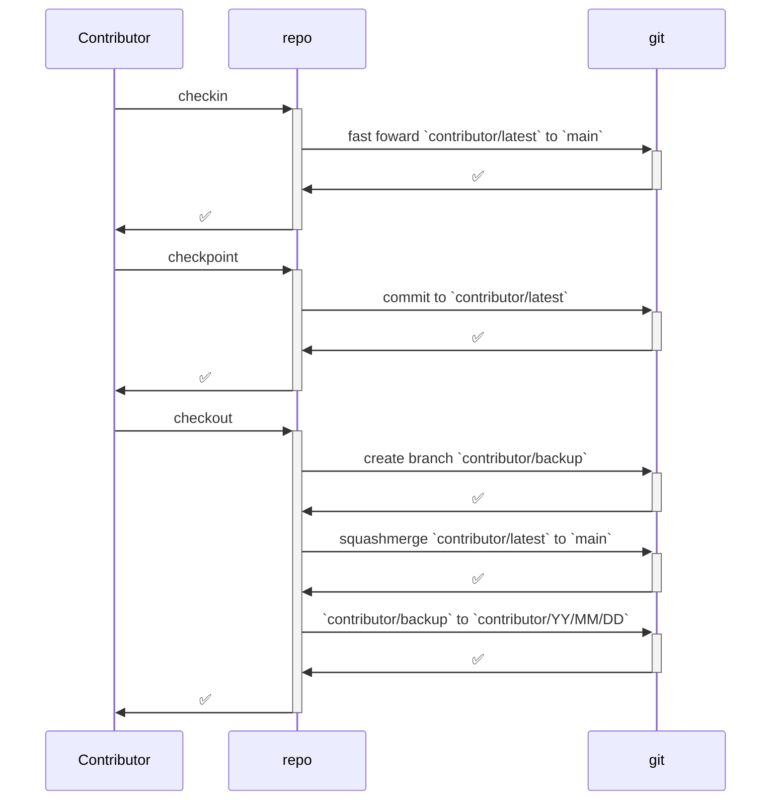

```mermaid
classDiagram

class event {
  id
  uri
  kind
  second
  checkpoint
  contributor
  client
}

class event.version {
  newCheckpointDescription
}
event <|-- event.version

class event.version.starting {
}
event.version <|-- event.version.starting

class event.checkpoint {
}
event <|-- event.checkpoint

class event.checkpoint.starting {
  newCheckpointDescription
}
event.checkpoint <|-- event.checkpoint.starting

class event.checkpoint.ended {
  oldCheckpoint
  newCheckpoint
  newCheckpointDescription
}
event.checkpoint <|-- event.checkpoint.ended

class event.checkin {
}
event <|-- event.checkin

class event.checkin.starting {
  checkinVersion
}
event.checkin <|-- event.checkin.starting

class event.checkin.ended {
  version
}
event.checkin <|-- event.checkin.ended

class event.checkout {
}
event <|-- event.checkout

class event.checkout.starting {
  checkoutCheckpointDescription
  checkoutCheckpoints
  archive
}
event.checkout <|-- event.checkout.starting

class event.checkout.ended {
  id
  description
}
event.checkout <|-- event.checkout.ended

class event.session {
  session
  llm
  parent
}
event <|-- event.session

class event.session.started {
}
event.session <|-- event.session.started

class event.session.ended {
}
event.session <|-- event.session.ended

class event.session.prompting {
}
event.session <|-- event.session.prompting

class event.session.prompting.starting {
  checkpoint
  session
  second
  llm
  message
  parent
  prompt
}
event.session.prompting <|-- event.session.prompting.starting

class event.session.prompting.ended {
  checkpoint
  session
  second
  llm
  message
  parent
  prompt
}
event.session.prompting <|-- event.session.prompting.ended

class event.session.compacting {
  checkpoint
  session
  second
  llm
  transcript
  message
  parent
  chat
}
event.session <|-- event.session.compacting

class event.session.plan {
}
event.session <|-- event.session.plan

class event.session.plan.updating {
  checkpoint
  session
  second
  llm
  transcript
}
event.session.plan <|-- event.session.plan.updating

class event.session.plan.updating.step {
  name
  status
}
event.session.plan.updating o-- event.session.plan.updating.step

class event.session.thinking {
}
event.session <|-- event.session.thinking

class event.session.thinking.starting {
  checkpoint
  session
  second
  llm
  transcript
  message
  parent
  prompt
}
event.session.thinking <|-- event.session.thinking.starting

class event.session.thinking.ended {
  session
  second
  llm
  transcript
  message
  parent
  prompt
}
event.session.thinking <|-- event.session.thinking.ended

class event.session.search {
}
event.session <|-- event.session.search

class event.session.search.starting {
  session
  second
  llm
  transcript
  pages
  ranges
}
event.session.search <|-- event.session.search.starting

class event.session.search.ended {
  session
  second
  llm
  transcript
  pages
  ranges
  error
}
event.session.search <|-- event.session.search.ended

class event.session.code {
}
event.session <|-- event.session.code

class event.session.code.edit {
}
event.session.code <|-- event.session.code.edit

class event.session.code.edit.starting {
  session
  second
  llm
  transcript
  path
  old
  new
  all
}
event.session.code.edit <|-- event.session.code.edit.starting

class event.session.code.edit.ended {
  session
  second
  llm
  transcript
  path
  old
  new
}
event.session.code.edit <|-- event.session.code.edit.ended

class event.session.test {
}
event.session <|-- event.session.test

class event.session.test.starting {
  session
  second
  llm
  transcript
  tests
  timeout
}
event.session.test <|-- event.session.test.starting

class event.session.test.ended {
  session
  second
  llm
  transcript
  succeeded
  failed
}
event.session.test <|-- event.session.test.ended

class event.session.build {
}
event.session <|-- event.session.build

class event.session.build.starting {
  session
  second
  llm
  transcript
  bundles
}
event.session.build <|-- event.session.build.starting

class event.session.build.ended {
  session
  second
  llm
  transcript
  succeeded
  failed
}
event.session.build <|-- event.session.build.ended

class event.session.terminal {
}
event.session <|-- event.session.terminal

class event.session.terminal.starting {
  session
  second
  llm
  transcript
  command
}
event.session.terminal <|-- event.session.terminal.starting

class event.session.terminal.ended {
  session
  second
  llm
  transcript
  command
  pid
  terminated
  stdout
  stderr
}
event.session.terminal <|-- event.session.terminal.ended

class event.session.tool {
}
event.session <|-- event.session.tool

class event.session.tool.starting {
  session
  second
  llm
  transcript
  message
  parent
  name
  input
}
event.session.tool <|-- event.session.tool.starting

class event.session.tool.ended {
  session
  second
  llm
  transcript
  message
  parent
  name
  input
  response
}
event.session.tool <|-- event.session.tool.ended
```

# 🧾 Specification

## 🕸️ Systems

### Repos, Technologies, Bundles, Folders, Files, Sections, Definitions

### Specifications, Algorithms

### Goals, Tickets

### Contributors, Interactions, Agents, Sessions

### Events, Commands, Hooks

### Policies, Statutes, Breaches, Requirements, Specs, Docs

### Releases, Versions, Checkpoints

### Languages, Trackers

## 🧮 Algorithms

## 🛠️ Mechanisms

### 🪪 Identification

```yaml
root:
  parent: none
  id:
    scheme: ""
    examples: [""]
  uri:
    scheme: "repo://"
    examples: ["repo://"]
years:
  parent: root
  emoji: 🎆
  code: yr
  id:
    scheme: "{{root-id}}🎆"
    examples: ["🎆"]
  uri:
    scheme: "{{root-uri}}{{years-name}}"
    examples: ["repo://years"]
year:
  parent: years
  id:
    scheme: "{{root-id}}🎆{{YY}}"
    examples: ["🎆26"]
  uri:
    scheme: "{{root-uri}}{{year-name}}/{{YY}}"
    examples: ["repo://year/26"]
months:
  parent: year
  emoji: 🌙
  code: mo
  id:
    scheme: "{{year-id}}🌙"
    examples: ["🎆26🌙"]
  uri:
    scheme: "{{root-uri}}{{months-name}}/{{YY}}"
    examples: ["repo://months/26"]
month:
  parent: months
  id:
    scheme: "{{year-id}}🌙{{MM}}"
    examples: ["🎆26🌙02"]
  uri:
    scheme: "{{root-uri}}{{month-name}}/{{YY}}{{MM}}"
    examples: ["repo://month/26/02"]
days:
  parent: month
  emoji: ☀️
  code: dy
  id:
    scheme: "{{month-id}}☀️"
    examples: ["🎆26🌙02☀️"]
  uri:
    scheme: "{{root-uri}}{{days-name}}/{{YY}}{{MM}}"
    examples: ["repo://days/26/02"]
day:
  parent: days
  id:
    scheme: "{{month-id}}☀️{{DD}}"
    examples: ["🎆26🌙02☀️15"]
  uri:
    scheme: "{{root-uri}}{{day-name}}/{{YY}}{{MM}}{{DD}}"
    examples: ["repo://day/26/02/15"]
hours:
  parent: day
  emoji: ⏰
  code: hr
  id:
    scheme: "{{day-id}}⏰"
    examples: ["🎆26🌙02☀️15⏰"]
  uri:
    scheme: "{{root-uri}}{{hours-name}}/{{YY}}{{MM}}{{DD}}{{HH}}"
    examples: ["repo://hours/26/02/15/14"]
hour:
  parent: hours
  id:
    scheme: "{{day-id}}⏰{{HH}}"
    examples: ["🎆26🌙02☀️15⏰14"]
  uri:
    scheme: "{{root-uri}}{{hour-name}}/{{YY}}{{MM}}{{DD}}{{HH}}"
    examples: ["repo://hour/26/02/15/14"]
minutes:
  parent: hour
  emoji: ⌚
  code: min
  id:
    scheme: "{{hour-id}}⌚"
    examples: ["🎆26🌙02☀️15⏰14⌚"]
  uri:
    scheme: "{{root-uri}}{{minutes-name}}/{{YY}}{{MM}}{{DD}}{{HH}}"
    examples: ["repo://minutes/26/02/15/14"]
minute:
  parent: minutes
  id:
    scheme: "{{hour-id}}⌚{{mm}}"
    examples: ["🎆26🌙02☀️15⏰14⌚33"]
  uri:
    scheme: "{{root-uri}}{{minutes-name}}/{{YY}}{{MM}}{{DD}}{{HH}}{{MM}}"
    examples: ["repo://minute/26/02/15/14/33"]
seconds:
  parent: minute
  emoji: ⏱️
  code: sec
  id:
    scheme: "{{minute-id}}⏱️"
    examples: ["🎆26🌙02☀️15⏰14⌚33⏱️"]
  uri:
    scheme: "{{root-uri}}{{seconds-name}}/{{YY}}{{MM}}{{DD}}{{HH}}{{MM}}"
    examples: ["repo://seconds/26/02/15/14/33"]
second:
  parent: seconds
  id:
    scheme: "{{minute-id}}⏱️{{SS}}"
    examples: ["🎆26🌙02☀️15⏰14⌚33⏱️38"]
  uri:
    scheme: "{{root-uri}}{{second-name}}/{{YY}}{{MM}}{{DD}}{{HH}}{{MM}}{{SS}}"
    examples: ["repo://second/26/02/15/14/33/38"]
repo:
  parent: root
  emoji: ""
  code: ""
  id:
    scheme: "{{root-id}}"
    examples: [""]
  uri:
    scheme: "{{root-uri}}{{repo-name}}"
    examples: ["repo://repo"]
releases:
  parent: repo
  emoji: 📢
  code: rel
  id:
    scheme: "{{repo-id}}📢"
    examples: ["📢"]
  uri:
    scheme: "{{root-uri}}{{YY?}}/{{MM?}}"
    examples: ["repo://releases", "repo://releases/26", "repo://releases/26/02"]
release:
  parent: releases
  id:
    scheme: "{{repo-id}}📢{{YY}}{{MM}}{{N}}"
    examples: ["📢26021"] # e.g. `r26.02-1`
  uri:
    scheme: "{{root-uri}}{{initial-releases-year}}/{{initial-release-month}}/{{release-number}}"
    examples: ["repo://release/26/02/1"]
versions:
  parent: release
  emoji: ⛳
  id:
    scheme: "{{release-id}}{{VV}}" # VV is two digit version number
    examples: ["📢260201⛳00"]
  uri:
    scheme: "{{root-uri}}{{versions-name}}/{initial-releases-year}}/{{initial-release-month}}/{{release-number}}/{{version-number}}"
    examples: ["repo://version/26/02/1/0"]
version:
  parent: versions
  id:
    scheme: "{{release-id}}⛳{{VV}}" # VV is two digit version number
    examples: ["📢260201⛳00"]
  uri:
    scheme: "{{root-uri}}{{versions-name}}/{initial-releases-year}}/{{initial-release-month}}/{{release-number}}/{{version-number}}"
    examples: ["repo://version/26/02/1/00"]
checkpoints:
  parent: "version+contributor"
  emoji: 🚩
  id:
    scheme: "{{repo-id}}{{contributor-id}}{{checkpoints-emoji}}"
    examples: ["📢260201⛳00🧑‍💻ueli🚩"]
  uri:
    scheme: "{{root-uri}}{{versions-name}}/{initial-releases-year}}/{{initial-release-month}}/{{release-number}}/{{version-number}}/{{contributor-alias}}"
    examples: ["repo://checkpoints/26/02/1/00/ueli"]
checkpoint:
  parent: checkpoints
  id:
    scheme: "{{checkpoints-id}}{{CC}}" # CC is two digit checkpoint number
    examples:
      - "📢260201⛳00🧑‍💻ueli🚩00"
  uri:
    scheme: "{{root-uri}}{{versions-name}}/{initial-releases-year}}/{{initial-release-month}}/{{release-number}}/{{version-number}}/{{checkpoint-number}}"
    examples: ["repo://checkpoint/26/02/1/00/usalu/00"]
technologies:
  parent: repo
  emoji: 🏗️
  code: prj
  id:
    scheme: "{{repo-id}}🏗️"
    examples: ["🏗️"]
  uri:
    scheme: "{{repo-id}}{{technologies-name}}/{{uri-encoded-identifying-path}}"
    examples: ["repo://technologies/26/02/15/14/33/38"]
technology:
  parent: technologies
  kinds:
    - name: infrastructure
    - name: user
    - name: research
  id:
    scheme: "{{repo-id}}{{technology-kind-emoji}}{{flat-technology-code}}"
    examples:
      - "🧰repo"
      - "👤semio"
  uri:
    scheme: "{{repo-id}}{{technologies-name}}/{{technology-name}}/{{uri-encoded-identifying-path}}"
    examples:
      - repo://technology/repo
      - repo://technology/semio
bundles:
  parent: technology
  emoji: 📦
  code: bnd
    kinds:
    - name: library
      emoji: 📚
      code: lib
    - name: schema
      emoji: 🛂
      code: sch
    - name: binary
      emoji: ⌨️
      code: bin
    - name: ui
      emoji: 🖱️
      code: ui
    - name: example
      emoji: 📔
      code: exa
    - name: site
      emoji: 🌐
      code: site
    - name: assets
      emoji: 🏪
      code: ast
  id:
    scheme: "{{technology-id}}📦"
    examples:
      - "👤semio📦"
      - "🧰repo📦"
  uri:
    scheme: "{{repo-id}}{{bundles-name}}/{{technology-name}}"
    examples:
      - repo://bundles/semio
      - repo://bundles/repo
bundle:
  parent: bundles
  id:
    scheme: "{{technology-id}}{{bundle-kind-emoji}}{{flat-bundle-code}}"
    examples:
      - "🌱mono🪆repo"
      - "👤semio📚js"
      - "🧰repo⌨️cli"
  uri:
    scheme: "{{repo-id}}{{bundles-name}}/{{technology-name}}/{{bundle-name}}"
    examples:
      - repo://bundle/mono/repo
      - repo://bundle/semio/js
      - repo://bundle/repo/cli
folders:
  parent: bundle | folder
  emoji: 📁
  code: fd
  id:
    scheme: "{{(bundle-id|folder-id)?}}📁"
    examples:
      - "👤semio📚js📁"
      - "🧰repo⌨️cli📁"
      - "👤semio📚js🗃️sketchpad📁"
  uri:
    scheme: "{{repo-id}}{{folders-name}}/{{folder-path-with-uri-encoded-names}}"
    examples:
      - repo://folders/semio/js
      - repo://folders/semio/js/sketchpad
      - repo://folders/repo/cli
folder:
  parent: folders
  kinds:
    - name: organization
    - name: required
  id:
    scheme: "{{(parent-bundle-id|parent-folder-id)?}}{{folder-kind-emoji}}{{flat-folder-name}}"
    examples:
      - "👤semio📚js🗃️sketchpad"
      - "🛅devcontainer"
  uri:
    scheme: "{{repo-id}}{{folders-name}}/{{folder-path-with-uri-encoded-names}}"
    examples:
      - repo://folders/semio/js/sketchpad
      - repo://folders/repo/cli
files:
  parent: folder
  emoji: 📄
  code: fi
  id:
    scheme: "{{folder-id}}📄"
    examples:
      - "🛅devcontainer📄"
      - "👤semio📚js🗃️sketchpad📄"
  uri:
    scheme: "{{repo-id}}{{folder-name}}/{{uri-encoded-identifying-path}}"
    examples:
      - repo://fi/fd%2Forg%2Fsketchpad
file:
  parent: files
  kinds:
    - name: code
      emoji: 💻
      code: cd
    - name: lab
      emoji: 🥼
      code: ld
    - name: script
      emoji: 📜
      code: sd
    - name: docs
      emoji: 📝
      code: dd
    - name: config
      emoji: ⚙️
      code: cd
    - name: asset
      emoji: 💾
      code: ad
    - name: license
      emoji: ⚖️
      code: ld
  id:
    scheme: "{{folder-id}}{{file-kind-emoji}}{{flat-file-name-with-extension*}}"
    examples:
      - "👤semio📚js🗃️sketchpad💻designtsx"
      - "🛅devcontainer⚙️devcontainerjson"
  uri:
    scheme: "{{repo-id}}{{file-name}}/{{uri-encoded-identifying-path}}"
    examples:
      - repo://fi/fd%2Forg%2Fsketchpad%2Ff%2Fdesign.tsx
      - repo://fi/fd%2Freq%2F.devcontainer%2Ff%2Fdevcontainer.json
lines:
  parent: file
  emoji: 📌
  code: ln
  id:
    scheme: "{{file-id}}📌"
    examples:
      - "👤semio📚js🗃️sketchpad💻designtsx📌"
  uri:
    scheme: "{{repo-id}}{{lines-name}}/{{uri-encoded-identifying-path}}"
    examples:
      - repo://ln/fi%2Ff%2Fdesign.tsx
line:
  parent: lines
  id:
    scheme: "{{file-id}}📌{{linenumber}}"
    examples:
      - "👤semio📚js🗃️sketchpad💻designtsx📌3872"
  uri:
    scheme: "{{repo-id}}{{line-name}}/{{uri-encoded-identifying-path}}"
    examples:
      - repo://ln/fi%2Ff%2Fdesign.tsx%2F3872
ranges:
  parent: file
  emoji: 🧷
  code: rg
  id:
    scheme: "{{file-id}}📌📌"
    examples:
      - "👤semio📚js🗃️sketchpad💻designtsx📌📌"
  uri:
    scheme: "{{repo-id}}{{code}}/{{uri-encoded-identifying-path}}"
    examples:
      - repo://rg/fi%2Ff%2Fdesign.tsx
range:
  parent: ranges
  id:
    scheme: "{{file-id}}📌{{start-linenumber}}📌{{end-linenumber}}"
    examples:
      - "👤semio📚js🗃️sketchpad💻designtsx📌3872📌3875"
  uri:
    scheme: "{{repo-id}}{{code}}/{{uri-encoded-identifying-path}}"
    examples:
      - repo://rg/fi%2Ff%2Fdesign.tsx%2F3872%2F3875
sections:
  parent: section | file
  emoji: 🔖
  code: sc
  id:
    scheme: "{{(file-id|section-id)?}}🔖"
    examples:
      - "👤semio📚js🗃️sketchpad💻designtsx🔖"
  uri:
    scheme: "{{repo-id}}{{code}}/{{uri-encoded-identifying-path}}"
    examples:
      - repo://sc/fi%2Ff%2Fdesign.tsx
section:
  parent: sections
  id:
    scheme: "{{(file-id|parent-section-id)?}}🔖{{flat-section-name}}"
    examples:
      - "👤semio📚js🗃️sketchpad💻designtsx🔖statemanagment"
      - "👤semio📚js🗃️sketchpad💻designtsx🔖statemanagment🔖store"
  uri:
    scheme: "{{repo-id}}{{code}}/{{uri-encoded-identifying-path}}"
    examples:
      - repo://s/fi%2Ff%2Fdesign.tsx%2FState%20Management
      - repo://s/sc%2FState%20Management%2FDesign%20Store
definitions:
  parent: deltaable
  emoji: 🏷️
  code: def
  id:
    scheme: "{{deltaable-id}}🏷️"
    examples:
      - "👤semio📚js🗃️sketchpad💻designtsx🔖statemanagment🔖store🏷️"
  uri:
    scheme: "{{repo-id}}{{code}}/{{uri-encoded-identifying-path}}"
    examples:
      - repo://def/sc%2FState%20Management%2FDesign%20Store
definition:
  parent: definitions
  kinds:
    - name: implementation
    - name: interface
    - name: constant
    - name: test
  id:
    scheme: "{{section-id}}{{definition-kind-emoji}}{{flat-definition-name}}"
    examples:
      - "👤semio📚js🗃️sketchpad💻designtsx🔖statemanagment🔖store🛠️createsketchpadstore"
  uri:
    scheme: "{{repo-id}}{{code}}/{{uri-encoded-identifying-path}}"
    examples:
      - repo://def/sc%2FState%20Management%2FDesign%20Store%2Fi%2FcreateSketchpadStore
requirements:
  parent: requireable [technology|bundle|folder|file|section|definition]
  emoji: 💯
  code: req
  id:
    scheme: "{{requireable-parent-id}}💯"
    examples:
      - "👤semio📚js🗃️sketchpad💻designtsx💯"
  uri:
    scheme: "{{repo-id}}{{code}}/{{uri-encoded-identifying-path}}"
    examples:
      - repo://req/fi%2Ff%2Fdesign.tsx
requirement:
  parent: requirements
  id:
    scheme: "{{requirements-id}}{{flat-requirement-name}}"
    examples:
      - "👤semio📚js🗃️sketchpad💻designtsx💯onlyonemachine"
  uri:
    scheme: "{{repo-id}}{{code}}/{{uri-encoded-identifying-path}}"
    examples:
      - repo://req/fi%2Ff%2Fdesign.tsx%2FOnly%20One%20Machine
specs:
  parent: spec | technology
  emoji: 🔳
  code: spc
  id:
    scheme: "{{(testable-id|test-id)?}}🔳"
    examples:
      - "👤semio🔳kit🔳design🔳"
  uri:
    scheme: "{{repo-id}}{{code}}/{{uri-encoded-identifying-path}}"
    examples:
      - repo://spc/prj%2Fu%2Fsemio
spec:
  parent: specs
  id:
    scheme: "{{specs-id}}{{flat-spec-name}}"
    examples:
      - "👤semio🔳kit🔳design🔳flat"
  uri:
    scheme: "{{repo-id}}{{code}}/{{uri-encoded-identifying-path}}"
    examples:
      - repo://sp/prj%2Fu%2Fsemio%2FflattenDesign
goals:
  parent: goal | repo
  emoji: 🎯
  code: gl
  id:
    scheme: "{{(repo-id|goal-id)?}}🎯"
    examples:
      - "🎯"
      - "🎯r26021🎯runningsketchpad🎯"
  uri:
    scheme: "{{repo-id}}{{code}}/{{uri-encoded-identifying-path}}"
    examples:
      - repo://glc
      - repo://gl/g%2Fr26.02-1%2FRunning%20Sketchpad
goal:
  parent: goals
  id:
    scheme: "{{(repo-id|parent-goal-id)?}}🎯{{flat-name}}"
    examples:
      - "🎯r26021🎯runningsketchpad"
  uri:
    scheme: "{{repo-id}}{{code}}/{{uri-encoded-identifying-path}}"
    examples:
      - repo://gl/r26.02-1
      - repo://gl/r26.02-1%2FRunning%20Sketchpad
tickets:
  parent: deltaable
  emoji: 🎫
  code: tk
  id:
    scheme: "{{deltaable-id}}🎫"
    examples:
      - "🎯r26021🎯runningsketchpad🎫"
      - "👤semio📚js🗃️sketchpad💻designtsx🔖statemanagment🔖store🎫"
  uri:
    scheme: "{{repo-id}}{{code}}/{{uri-encoded-identifying-path}}"
    examples:
      - repo://tk/gl%2Fr26.02-1%2FRunning%20Sketchpad
ticket:
  parent: tickets
  id:
    scheme: "{{goal-id}}🎫{{flat-title}}"
    examples:
      - "🎯r26021🎯runningsketchpad🎫introducekeyguidurimechanism"
  uri:
    scheme: "{{repo-id}}{{code}}/{{uri-encoded-identifying-path}}"
    examples:
      - repo://tk/gl%2Fr26.02-1%2FRunning%20Sketchpad%2FIntroduce%20Key%20Guid%20Uri%20Mechanism
drafts:
  parent: resource
  emoji: 📝
  code: dr
  id:
    scheme: "{{resource-id}}📝"
    examples:
      - "🧰repo⌨️cli📝"
  uri:
    scheme: "{{repo-id}}{{code}}/{{uri-encoded-identifying-path}}"
    examples:
      - repo://dr/res%2Fcli
draft:
  parent: drafts
  id:
    scheme: "{{resource-id}}📝{{flat-title}}"
    examples:
      - "🧰repo⌨️cli📝newarchitecture"
  uri:
    scheme: "{{repo-id}}{{code}}/{{uri-encoded-identifying-path}}"
    examples:
      - repo://dr/res%2Fcli%2FNew%20Architecture
todos:
  parent: resource
  emoji: ✅
  code: to
  id:
    scheme: "{{resource-id}}✅"
    examples:
      - "👤semio📚js🗃️sketchpad💻designtsx🔖statemanagment🔖store🛠️createsketchpadstore✅"
  uri:
    scheme: "{{repo-id}}{{code}}/{{uri-encoded-identifying-path}}"
    examples:
      - repo://to/def%2FcreateSketchpadStore
todo:
  parent: todos
  id:
    scheme: "{{resource-id}}✅{{flat-title}}"
    examples:
      - "👤semio📚js🗃️sketchpad💻designtsx🔖statemanagment🔖store🛠️createsketchpadstore✅introducepropersyncmechanism"
  uri:
    scheme: "{{repo-id}}{{code}}/{{uri-encoded-identifying-path}}"
    examples:
      - repo://to/def%2FcreateSketchpadStore%2FIntroduce%20Proper%20Sync%20Mechanism
policies:
  parent: resource kind | resource
  emoji: 👮
  code: pl
  id:
    scheme: "{{(resource-kind|resource-id)?}}👮"
    examples:
      - "💻👮"
      - "👤semio📚js🗃️sketchpad💻designtsx🔖statemanagment🔖store👮"
  uri:
    scheme: "{{repo-id}}{{code}}/{{uri-encoded-identifying-path}}"
    examples:
      - repo://pl/code
policy:
  parent: policies
  id:
    scheme: "{{(resource-kind|resource-id)?}}👮{{flat-name}}"
    examples:
      - "💻👮godfiles"
      - "👤semio📚js🗃️sketchpad💻designtsx🔖statemanagment🔖store👮onlyonestore"
  uri:
    scheme: "{{repo-id}}{{code}}/{{uri-encoded-identifying-path}}"
    examples:
      - repo://pl/code%2FGodfiles
statutes:
  parent: policy
  emoji: 📜
  code: st
  id:
    scheme: "{{policy-id}}📜"
    examples:
      - "💻👮godfiles📜"
  uri:
    scheme: "{{repo-id}}{{code}}/{{uri-encoded-identifying-path}}"
    examples:
      - repo://st/pl%2FGodfiles
statute:
  parent: statutes
  id:
    scheme: "{{policy-id}}📜{{flat-name}}"
    examples:
      - "💻👮godfiles📜maxlinesperfile"
  uri:
    scheme: "{{repo-id}}{{code}}/{{uri-encoded-identifying-path}}"
    examples:
      - repo://st/pl%2FGodfiles%2FMax%20Lines%20Per%20File
breaches:
  parent: policy
  emoji: 🚫
  code: br
  id:
    scheme: "{{policy-id}}🚫"
    examples:
      - "💻👮godfiles🚫"
  uri:
    scheme: "{{repo-id}}{{code}}/{{uri-encoded-identifying-path}}"
    examples:
      - repo://br/pl%2FGodfiles
breach:
  parent: breaches
  id:
    scheme: "{{policy-id}}🚫{{affected}}🔍{{(line-id|range-id)}}{{second-id}}"
    examples:
      - "💻👮godfiles🚫👤semio📚js🗃️sketchpad💻designstorets📌3872📌3875🎆26🌙02☀️14⏰19⌚07⏱️12"
  uri:
    scheme: "{{repo-id}}{{code}}/{{uri-encoded-identifying-path}}"
    examples:
      - repo://br/pl%2FGodfiles%2Faffects%2F...%2Fat%2F...%2Fwhen%2F...
contributors:
  parent: repo
  emoji: 🧑‍💻
  code: ctrb
  id:
    scheme: "{{repo-id}}🧑‍💻"
    examples:
      - "🧑‍💻"
  uri:
    scheme: "{{repo-id}}{{code}}/{{uri-encoded-identifying-path}}"
    examples:
      - repo://ctrbc
contributor:
  parent: contributors
  id:
    scheme: "🧑‍💻{{github-username}}"
    examples:
      - "🧑‍💻ueli"
  uri:
    scheme: "{{repo-id}}{{code}}/{{uri-encoded-identifying-path}}"
    examples:
      - repo://ctrb/usalu
interactions:
  parent: contributor
  emoji: 🤝
  code: int
  id:
    scheme: "{{repo-id}}🤝"
    examples:
      - "🤝"
  uri:
    scheme: "{{repo-id}}{{code}}/{{uri-encoded-identifying-path}}"
    examples:
      - repo://intc
interaction:
  parent: interactions
  kinds:
    - name: started
    - name: edited
    - name: finished
    - name: restarted
    - name: deleted
  id:
    scheme: "{{second-id}}{{entity-id}}{{interaction-kind-emoji}}{{contributor-id}}"
    examples:
      - "🎆26🌙02☀️14⏰19⌚07⏱️12🎯r26021🎯runningsketchpad🎫introducekeyguidurimechanism🌱🧑‍💻ueli"
  uri:
    scheme: "{{repo-id}}{{code}}/{{uri-encoded-identifying-path}}"
    examples:
      - repo://int/when%2F...%2Fon%2F...%2Fstarted%2Fby%2Fusalu
agents:
  parent: repo
  emoji: 🤖
  code: ag
  id:
    scheme: "{{repo-id}}🤖"
    examples: ["🤖"]
  uri:
    scheme: "{{repo-id}}{{code}}/{{uri-encoded-identifying-path}}"
    examples: ["repo://agc"]
agent:
  parent: agents
  kinds:
    - name: generalist
  id:
    scheme: "{{repo-id}}{{agent-kind-emoji}}{{flat-agent-id}}"
    examples: ["🗺️generalist"]
  uri:
    scheme: "{{repo-id}}{{code}}/{{uri-encoded-identifying-path}}"
    examples: ["repo://ag/generalist"]
sessions:
  parent: checkpoint
  emoji: ⚪
  kinds:
    - name: running
      emoji: 🟡
    - name: completed
      emoji: 🟢
    - name: interrupted
      emoji: 🔴
  id:
    scheme: "{{repo-id}}{{session-emoji}}"
    examples:
      - "⚪"
  uri:
    scheme: "{{repo-id}}{{code}}/{{uri-encoded-identifying-path}}"
    examples:
      - repo://ssnc
session:
  parent: sessions
  id:
    scheme: "{{sessions-id}}{{flat-session-id}}"
    examples:
      - "⚪e753ed61-e8cc-49b7-88f7-dda53b8d5a15"
  uri:
    scheme: "{{repo-id}}{{code}}/{{uri-encoded-identifying-path}}"
    examples:
      - repo://ssn/e753ed61-e8cc-49b7-88f7-dda53b8d5a15
commands:
  parent: repo
  emoji: 🫡
  code: cmd
  id:
    scheme: "{{repo-id}}🫡"
    examples: ["🫡"]
  uri:
    scheme: "{{repo-id}}{{code}}/{{uri-encoded-identifying-path}}"
    examples: ["repo://cmdc"]
command:
  parent: commands
  id:
    scheme: "{{commands-id}}{{flat-command-name}}"
    examples: ["🫡build"]
  uri:
    scheme: "{{repo-id}}{{code}}/{{uri-encoded-identifying-path}}"
    examples:
      - repo://cmd/build
events:
  parent: repo
  emoji: ⚡
  code: evt
  id:
    scheme: "{{repo-id}}⚡"
    examples: ["⚡"]
  uri:
    scheme: "{{repo-id}}{{code}}/{{uri-encoded-identifying-path}}"
    examples: ["repo://evtc"]
event:
  parent: events
  id:
    scheme: "{{events-id}}{{flat-event-name}}"
    examples: ["⚡lint"]
  uri:
    scheme: "{{repo-id}}{{code}}/{{uri-encoded-identifying-path}}"
    examples:
      - repo://evt/lint
hooks:
  parent: event
  emoji: 🪝
  code: hk
  id:
    scheme: "{{event-id}}🪝"
    examples: ["⚡lint🪝"]
  uri:
    scheme: "{{repo-id}}{{code}}/{{uri-encoded-identifying-path}}"
    examples: ["repo://hk/evt%2Flint"]
hook:
  parent: hooks
  id:
    scheme: "{{hooks-id}}{{flat-hook-name}}"
    examples: ["⚡lint🪝pre-commit"]
  uri:
    scheme: "{{repo-id}}{{code}}/{{uri-encoded-identifying-path}}"
    examples:
      - repo://hk/evt%2Flint%2Fpre-commit
systems:
  parent: repo
  emoji: 🖥️
system:
  kinds:
    - name: linux
      emoji: 🐧
    - name: windows
      emoji: 🪟
    - name: mac
      emoji: 🍏
clients:
  parent: repo
  emoji:
```

### 🔢 Metrics

```yaml
technologies:
  - id: "{{technology-id}}"
    loc: "{{total-lines-of-code-of-the-technology}}"
    bundles:
      - id: "{{bundle-id}}"
        loc: "{{total-lines-of-code-of-the-bundle}}"
        folders:
          - id: "{{bundle-id}}"
versions:

changes:
  technologies:
    removed:
      - id: "{{technology-id-that-was-removed}}"
        loc: "{{lines-of-code-from-technology-that-was-removed}}"
    renamed:
      - from:
          id: "{{old-technology-id-before-renaming}}"
          name: "{{old-technology-name-before-renaming}}"
        to:
          id: "{{new-technology-id-after-renaming}}"
          name: "{{new-technology-name-after-renaming}}"
    modified: "{{lines-of-code-removed-from-technology}}"
      - id: "{{technology-id}}"
        loc:
          removed: "{{lines-of-code-removed-from-technology}}"
          added: "{{lines-of-code-added-to-technology}}"
```

```md
# 🔢 Metrics

- 🟥762🟩847➕85
- 👤semio🟥211🟩156➖55
```

## 📛 Entities

### 🌐 Repo

```yaml
repo:
 - id: "{{repo-id}}"
   name: "{{repo-name}}"
   summary: "{{repo-summary}}"
   loc: "{{lines-of-code-of-repo}}"
technologies:
 - id: "{{technology-id}}"
   name: "{{technology-name}}"
   summary: "{{technology-summary}}"
   loc: "{{lines-of-code-of-technology}}"
bundles:
 - id: "{{bundle-id}}"
   name: "{{bundle-name}}"
   summary: "{{bundle-summary}}"
   loc: "{{lines-of-code-of-bundle}}"
folders:
 - id: "{{folder-id}}"
   name: "{{folder-name}}"
   summary: "{{folder-summary}}"
   loc: "{{lines-of-code-of-folder}}"
files:
 - id: "{{file-id}}"
   name: "{{file-name}}"
   summary: "{{file-summary}}"
   loc: "{{lines-of-code-of-file}}"
sections:
 - id: "{{section-id}}"
   name: "{{section-name}}"
   summary: "{{section-summary}}"
   loc: "{{lines-of-code-of-section}}"
definitions:
 - id: "{{definition-id}}"
   name: "{{definition-name}}"
   summary: "{{definition-summary}}"
   loc: "{{lines-of-code-of-definition}}"
contributor:
 - id: "{{contributor-id}}"
   name: "{{contributor-name}}"
   loc: "{{lines-of-code-of-contributor}}"
```

#### 💾 sqlite

Complete:

```mermaid
erDiagram
  REPO {
    int id PK
    string name
    string summary
  }
  RELEASE {
    int id PK
    int repo_id FK
    string name
    string summary
    int due "? unix: 23:59:59 of the day"
    int released "? unix"
  }
  VERSION {
    int id PK
    int release_id FK
    string name
    string summary
  }
  CHECKPOINT {
    int id PK
    int version_id FK
    string name
    string summary
  }
  TECHNOLOGY {
    int id PK
    int folder_id FK
    int kind "0:👤1:🧰2:🔬"
    string name UK
    string summary
  }
  BUNDLE {
    int id PK
    int technology_id FK
    int folder_id FK
    int kind "0:📚1:🛂2:⌨️3:🖱️4:📔5:🌐6:🏪"
    string name "UK(technology_id,kind,name)"
    string summary
  }
  FOLDER {
    int id PK
    int checkpoint_id FK
    int parent_folder_id FK "?"
    string name "UK(checkpoint_id,parent_folder_id,name)"
    string summary
  }
  FILE {
    int id PK
    int checkpoint_id FK
    int parent_folder_id FK "?"
    int kind "0:💻1:🥼2:📜3:📝4:⚙️5:💾6:⚖️"
    string name "UK(checkpoint_id,parent_folder_id,kind,name)"
    string summary
  }
  SECTION {
    int id PK
    int file_id FK
    string name "UK(file_id,name)"
    string summary
  }
  DEFINITION {
    int id PK
    int section_id FK
    int kind "0:🛠️1:✂️2:🪨3:🧪"
    string name "UK(section_id,kind,name)"
    string summary
    string code
  }
  GOAL {
    int id PK
    int release_id FK
    int parent_id FK "?"
    string name "UK(release_id,parent_id,name)"
    string summary
    int due "? unix: 23:59:59 of the day"
  }
  TICKET {
    int id PK
    int parent_goal_id FK
    string title
    string description
  }
  DRAFT {
    int id PK
    string slug
    string summary
  }
  TODO {
    int id PK
    int parent_technology_id FK "?"
    string title
    string description
  }
```



### 📢 Release

### 🔀 Version



### 🚩 Checkpoint

### 🏗️ Technology

### 📦 Bundle

### 📁 Folder

### 📄 File

### 🔖 Section

### 🏷️ Definition

### 🤖 Agent

#### 🥽 Generalist

A `generalist` MUST do everything that is neccessary to achieve a `target`.

A `generalist` MUST use the same `tools` and perform the same `tasks` than all the other `agents`.

A `generalist` MUST NOT delegate work to other `agents`.

#### 🗺️ Coordinator

A `coordinator` MUST only delegate work to other `agents`.

A `coordinator` MOST NOT work on any specific `task`.

#### 🪛 Fixer

A `fixer` MUST only fix exactly one `problem`.

#### 🔄️ Refactorer

### ⚡ Event

`.repo/🧑‍💻/⚡/🔀/{{YY}}/{{MM}}/{{DD}}/{{checkpoint-id}}/{{HHMMSS}}_{{version-event-kind}}.json`
`.repo/🧑‍💻/⚡/🤖/{{YY}}/{{MM}}/{{DD}}/{{session-id}}/{{HHMMSS}}_{{agent-event-kind}}.json`

```yaml
event:
  DATA:
    id: "{{event-id}}"
    uri: "{{event-uri}}"
    kind: "{{event-kind}}"
    second: "{{second-id}}"
    checkpoint: "{{checkpoint-id}}"
    contributor: "{{contributor-id}}"
    client: "{{client-id}}"

  version:
    starting: # e.g. in git pre-commit on main branch.
      DATA:
        new-checkpoint-description: "{{checkpoint-description}}" # e.g. in git commit message

  checkpoint:
    starting: # e.g. in git pre-commit
      DATA:
        new-checkpoint-description: "{{checkpoint-description}}" # e.g. in git commit message
    ended: # e.g. in git post-commit
      DATA:
        old-checkpoint: "{{checkpoint-id}}" # e.g. in git commit sha
        new-checkpoint: "{{checkpoint-id}}" # e.g. in git commit sha
        new-checkpoint-description: "{{checkpoint-description}}" # e.g. in git commit message

  checkin:
    starting:
      DATA:
        checkin-version: "{{version-id}}" # target version id to use as starting checkpoint
    ended:
      DATA:
        version: "{{version-id}}" # new checkin checkpoint id

  checkout:
    starting:
      DATA:
        checkout-checkpoint-description: "{{checkout-description}}"
        checkout-checkpoints: ["{{checkpoint-id-between-checkin-and-checkout}}"] # e.g. in git commit sha of squash checkpoints between checkin and checkout
        archive: ["{{archive-checkpoint-id}}"] # e.g. in git branch name of the archive branch e.g. "kinan/2026/02/24"
    ended:
      DATA:
        id: "{{checkpoint-id}}" # e.g. in new git commit sha of squash checkpoints between checkin and checkout
      description: "{{checkout-description}}" # e.g. in git commit message

  session:
    DATA:
      session: "{{session-id}}" # e.g. "⚪17722881541519940541784063889126907940"
      llm: "{{llm}}" # e.g. "gpt-5.1"
      parent: "{{parent-agent-session-id?}}" # only if it is a subagent session otherwise ""
    started: "" #
    ended: "" #

    prompting:
      starting:
        DATA:
          checkpoint: "{{checkpoint-id}}"
          session: "{{session-id}}"
          second: "{{second-id}}"
          llm: "{{llm}}"
          message: "{{message-id}}"
          parent: "{{parent-message-id}}"
        prompt: "{{prompt}}"
      ended:
        DATA:
          checkpoint: "{{checkpoint-id}}"
          session: "{{session-id}}"
          second: "{{second-id}}"
          llm: "{{llm}}"
          message: "{{message-id}}"
          parent: "{{parent-message-id}}"
        prompt: "{{prompt}}"

    compacting:
      DATA:
        checkpoint: "{{checkpoint-id}}"
        session: "{{session-id}}"
        second: "{{second-id}}"
        llm: "{{llm}}"
        transcript: "{{transcript-path}}"
        message: "{{message-id}}"
      parent: "{{parent-message-id}}"
      chat: "{{chat}}"

    plan: # A list of tasks - usually TODO lists in the native clients
      updating: # Planning involves changing the task list
        checkpoint: "{{checkpoint-id}}"
        session: "{{session-id}}"
        second: "{{second-id}}"
        llm: "{{llm}}"
        transcript: "{{transcript-path}}"
        steps:
          - name: "{{step-name}}"
          - status: "{{STATUS}}" # completed, in progress, pending

    thinking:
      starting:
        DATA:
          checkpoint: "{{checkpoint-id}}"
          session: "{{session-id}}"
          second: "{{second-id}}"
          llm: "{{llm}}"
          transcript: "{{transcript-path}}"
          message: "{{message-id}}"
        parent: "{{parent-message-id}}"
        prompt: "{{prompt}}"
      ended:
        DATA:
          session: "{{session-id}}"
          second: "{{second-id}}"
          llm: "{{llm}}"
          transcript: "{{transcript-path}}"
          message: "{{message-id}}"
          parent: "{{parent-message-id}}"
        prompt: "{{prompt}}"

    search: # All searches such as file read, grep, websearch, ls, …
      starting:
        DATA:
          session: "{{session-id}}"
          second: "{{second-id}}"
          llm: "{{llm}}"
          transcript: "{{transcript-path}}"
          pages: ["{{web-page-url}}"] # e.g. https://reactflow.dev/api-reference/react-flow
          ranges: ["{{affected-range-id}}"] # resolve the query and list all affected ranges e.g. "👤semio📚js🗃️sketchpad💻designtsx📌3872📌3875"
      ended:
        DATA:
          session: "{{session-id}}"
          second: "{{second-id}}"
          llm: "{{llm}}"
          transcript: "{{transcript-path}}"
          pages: ["{{web-page-url}}"] # e.g. https://reactflow.dev/api-reference/react-flow
          ranges: ["{{affected-range-id}}"] # resolve the query and list all affected ranges e.g. "👤semio📚js🗃️sketchpad💻designtsx📌3872📌3875"
        error: "{{error-message-from-failed-search}}" # When this is non-empty then it means that the search failed. The error message of the failed search.

    code:
      edit:
        starting:
          DATA:
            session: "{{session-id}}"
            second: "{{second-id}}"
            llm: "{{llm}}"
            transcript: "{{transcript-path}}"
            path: "{{file-path}}"
            old: "{{old-string}}"
          new: "{{new-string}}"
          all: "{{REPLACEALLSTRINGS}}" # false: just first, true: replace all occurrences
        ended:
          DATA:
            session: "{{session-id}}"
            second: "{{second-id}}"
            llm: "{{llm}}"
            transcript: "{{transcript-path}}"
            path: "{{file-path}}"
            old: "{{old-string}}"
          new: "{{new-string}}"

    test:
      starting:
        DATA:
          session: "{{session-id}}"
          second: "{{second-id}}"
          llm: "{{llm}}"
          transcript: "{{transcript-path}}"
          tests: ["{{test-id}}"] # e.g. ["","🧰repo⌨️cli🥼maintestgo🔖policytests🧪testpolicylistcommand",]
          timeout: "{{timeout}}" # seconds e.g. 600
      ended:
        DATA:
          session: "{{session-id}}"
          second: "{{second-id}}"
          llm: "{{llm}}"
          transcript: "{{transcript-path}}"
          succeeded: ["{{successful-test-id}}"] # e.g. ["🧰repo⌨️cli🥼maintestgo🔖policytests🧪testpolicylistcommand"]
          failed: ["{{failed-test-id}}"] # e.g. ["🧰repo⌨️cli🥼maintestgo🔖policytests🧪testpolicylistcommand"]

    build:
      starting:
        DATA:
          session: "{{session-id}}"
          second: "{{second-id}}"
          llm: "{{llm}}"
          transcript: "{{transcript-path}}"
          bundles: ["{{bundle-id}}"] # e.g. ["🧰repo⌨️cli","👤semio📚js"]
      ended:
        DATA:
          session: "{{session-id}}"
          second: "{{second-id}}"
          llm: "{{llm}}"
          transcript: "{{transcript-path}}"
          succeeded: ["{{successfully-built-bundle-id}}"] # e.g. ["🧰repo⌨️cli","👤semio📚js"]
          failed: ["{{failed-to-build-bundle-id}}"] # e.g. ["🧰repo⌨️cli","👤semio📚js"]

    terminal:
      starting:
        DATA:
          session: "{{session-id}}"
          second: "{{second-id}}"
          llm: "{{llm}}"
          transcript: "{{transcript-path}}"
          command: "{{command}}"
      ended:
        DATA:
          session: "{{session-id}}"
          second: "{{second-id}}"
          llm: "{{llm}}"
          transcript: "{{transcript-path}}"
          command: "{{command}}"
          pid: "{{pid}}" # process id, execution id, etc
        terminated: "{{has-terminated}}" # true: stopped, false: still running
        stdout: "{{stdout}}"
        stderr: "{{stderr}}"

    tool:
      starting: # all tools but excluding
        DATA:
          session: "{{session-id}}"
          second: "{{second-id}}"
          llm: "{{llm}}"
          transcript: "{{transcript-path}}"
          message: "{{message-id}}"
          parent: "{{parent-message-id}}"
        name: "{{tool-name}}" # name of the tool
        input: "{{tool-input}}"
      ended: # excluding task, code and terminal
          DATA:
          session: "{{session-id}}"
          second: "{{second-id}}"
          llm: "{{llm}}"
          transcript: "{{transcript-path}}"
          message: "{{message-id}}"
          parent: "{{parent-message-id}}"
        name: "{{tool-name}}" # name of the tool
        input: "{{tool-input}}"
        response: "{{tool-response}}"
```


```

```



````


### 🎯 Goals

### 🎫 Ticket

`ticket.json`

```yaml
title: "{{ticket-title}}" # e.g. Tree Text Short IDs
description: "{{ticket-description}}" # e.g. Fix renderTreeNodeText to temporarily clear parentId before calling renderEntityHuman so tree text output shows only the own ID segment instead of full hierarchical chains. Add tests for nested goal short IDs and parentId restoration.
github:
 issue: "{{github-issue-url}}" # e.g. https://github.com/usalu/semio/issues/612
goal: "{{goal-id}}" # e.g. 🎯aioptimizedrepo🎯repoclient🎯repobinary🎯repocli🎯repoclifilters
contributors: ["{{contributor-id}}"]
session: ["{{agent-session-id}}"] # add session from within agent hooks after ticket was opened or reopened by the cli or the mcp tool. e.g. ""
````

`repo/cli/cli ticket <ticket>`

```yaml
title: "{{ticket-title}}" # e.g. Tree Text Short IDs
description: "{{ticket-description}}" # e.g. Fix renderTreeNodeText to temporarily clear parentId before calling renderEntityHuman so tree text output shows only the own ID segment instead of full hierarchical chains. Add tests for nested goal short IDs and parentId restoration.
github:
 issue: "{{github-issue-url}}" # e.g. https://github.com/usalu/semio/issues/612
goal: "{{goal-id}}" # e.g. 🎯aioptimizedrepo🎯repoclient🎯repobinary🎯repocli🎯repoclifilters
searched:

delta: # Derive delta at the end of a session using the agent.code.edited events and git delta (both staged and unstaged)
 technologies:
  deleted: ["{{technology-id}}"]
  renamed:
   - from: "{{technology-id}}"
     to: "{{technology-id}}"
  modified: ["{{technology-id}}"]
  created: ["{{technology-id}}"]
 bundles:
  deleted: ["{{bundle-id}}"]
  renamed:
   - from: "{{bundle-id}}"
     to: "{{bundle-id}}"
  modified: ["{{bundle-id}}"]
  created: ["{{bundle-id}}"]
 folders:
  deleted: ["{{folder-id}}"]
  renamed:
   - from: "{{folder-id}}"
     to: "{{folder-id}}"
  modified: ["{{folder-id}}"]
  created: ["{{folder-id}}"]
 files:
  deleted: ["{{file-id}}"]
  renamed:
   - from: "{{file-id}}"
     to: "{{file-id}}"
  modified: ["{{file-id}}"]
  created: ["{{file-id}}"]
 sections:
  deleted: ["{{section-id}}"]
  renamed:
   - from: "{{section-id}}"
     to: "{{section-id}}"
  modified: ["{{section-id}}"]
  created: ["{{section-id}}"]
 definitions:
  deleted: ["{{definition-id}}"]
  renamed:
   - from: "{{definition-id}}"
     to: "{{definition-id}}"
  modified: ["{{definition-id}}"]
  created: ["{{definition-id}}"]
```

### 📝 Changes

```bash
repo/cli/cli changes # e.g. in git use the unstaged changes since last commit in repo change format
repo/cli/cli changes {{entity-id-to-filter-changes}} # shows only the portion of the current revision to the checkpoint for the given entity. e.g. technology only show the part of the revision in regards to the technology such as only bundles inside the technology, only
```

### 🆕 Revisions

```bash
repo/cli/cli revision # e.g. in git shows current staged changes since last commit
repo/cli/cli revision {{entity-id-to-filter-revision}} # shows only the portion of the current revision to the checkpoint for the given entity. e.g. technology only show the part of the revision in regards to the technology such as only bundles inside the technology, only
```

```yaml
technologies:
  removed:
    - id: "{{technology-id-that-was-removed}}"
      name: "{{technology-id-that-was-removed}}"
      summary: "{{summary-of-technology-that-was-removed}}"
  renamed:
    - from:
        id: "{{old-technology-id-before-renaming}}"
        name: "{{old-technology-name-before-renaming}}"
      to:
        id: "{{new-technology-id-after-renaming}}"
        name: "{{new-technology-name-after-renaming}}"
  modified: "{{lines-of-code-removed-from-technology}}"
    - id: "{{technology-id}}"
      loc:
        removed: "{{lines-of-code-removed-from-technology}}"
        added: "{{lines-of-code-added-to-technology}}"
```

### 🔼 Deltas

```yaml
technologies:
  removed:
    - id: "{{technology-id-that-was-removed}}"
      name: "{{name-from-technology-that-was-removed}}"
      summary: "{{summary-from-technology-that-was-removed}}"
  renamed:
    - from:
        id: "{{old-technology-id-before-renaming}}"
        name: "{{old-technology-name-before-renaming}}"
      to:
        id: "{{new-technology-id-after-renaming}}"
        name: "{{new-technology-name-after-renaming}}"
  modified: "{{lines-of-code-removed-from-technology}}"
    - id: "{{technology-id}}"
      loc:
        removed: "{{lines-of-code-removed-from-technology}}"
        added: "{{lines-of-code-added-to-technology}}"
  started:
bundles:

```

# 🔜 TODOs

## TODO: Extend docs with gh cli auth

In order to link issues to the technology, first permissions must be expliclty set with `gh auth refresh -s read:technology,technology`
