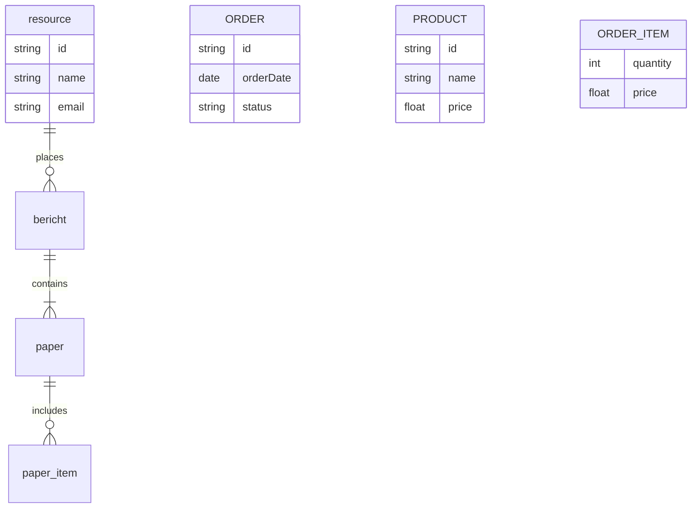

# Prompts

---

Erstellen Sie einen Baum von Themen, nur Namen keine Beschreibung zu allen themen die das Notebook umfasst.

---

Welche konstruktiven Verbindungen gibt es, um wiederverwendete Stahlbetonteile zu fügen?

---

Erstellen Sie einen Baum von Themen, nur Namen keine Beschreibung zu allen themen die das Notebook umfasst.

---

```
1.

Analysieren Sie das Software-Ecosystem SOFTWARE (LINK).

2.

Finden Sie alle Quellen zu Features, Handbücher, Tutorials, Videos, Beispiele, etc.

3.

Finden Sie alle Architektur und Ingenieurbüros, welche dieses Tool verwenden und welche Gebäude mit diesem Tool nachweislich verwendet wurde.
```

---

Erstellen Sie einen Bericht mit den

---

resource
bericht
abschlussbericht
paper
aufbereitungsmethode
gebäude
fallstudie
element
pavillon
hürde

material
verbindung

gebäude -- bericht
gebäude -- aufbereitungsmethode
aufbereitungsmethode -- elementart

thema
berichte
material
organization - buro - institute - research
aufbereitungsmethode
prüfverfahren
büro

organization
projects and case study
platforms and tools
guidelines and standards
methods
workflow steps
challenges and bottlenecks
metadata fields and data requirements
actor roles

source Layer : websites
project pages
reports
PDFs
slide decks
funding applications
internal project documents
guidelines
case study pages
later : interview transcripts and workshop material


