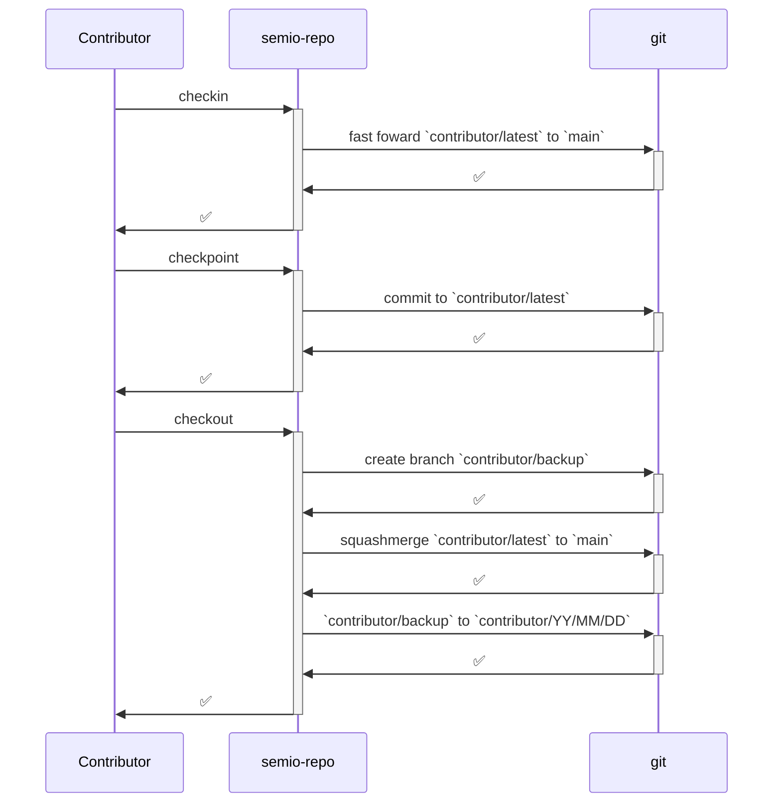

## ✨ Features

- 🤖 AI integrations
  - ✅ Currently
    - 🧑‍✈️ Copilot
    - 🌊 Cascade
    - 🖱️ Cursor Agent
    - ❄️ Claude Code
    - ⚙️ Codex
  - 📅 Possible
    - 🦾 Droid
    - …
- 🧑‍💻 IDE integrations
  - ✅ Currently
    - 💻 VSCode
    - 🌊 Windsurf
    - 🖱️ Cursor
    - Antigravity
    - ⚙️ Codex
    - ❄️ Claude Code
    - 🦾 Droid
  - 📅 Possible
    - InteliJ
    - PyCharm
    - WebStorm
    - Rider
    - Android Studio
    - …
- 🗣️ Language integrations
  - ✅ Currently
    - 🟦 Typescript
    - 🐹 Go
    - 🐍 Python
    - 🦀 Rust
    - 🟣 C#
  - 📅 Possible
    - ♨️ Java
    - 🟪 Kotlin
    - ➕ C++
    - ©️ C
    - 🐘 PHP
    - 💎 Ruby
    - 🐦 Swift
    - …
- 📦 Sandbox integrations
  - ✅ Currently
    - 🐋 Devcontainers
  - 📅 Possible
    - 🦭 Podman
    - …
- 👥 Tracker integrations
  - ✅ Currently
    - 🐙 GitHub
  - 📅 Possible
    - 🦊 GitLab
    - 🪣 Bitbucket
    - …

### 🤖 AI

| System          | Agents | Skills | Hooks |
| --------------- | :----: | :----: | :---: |
| 🧑‍✈️ Copilot      |   ✅   |   ✅   |  ✅   |
| 🌊 Cascade      |   ✅   |   ✅   |  ✅   |
| 🖱️ Cursor Agent |   ✅   |   ✅   |  ✅   |
| ❄️ Claude Code  |   ✅   |   ✅   |  ✅   |
| ⚙️ Codex        |   ✅   |   ✅   |  ❌   |
| (🦾 Droid)      |   ✅   |   ✅   |  ✅   |

###

## 🥇 Why semio-repo is a game changer

### 📈 Requirements + Docs + Stats + Semantics

#### 🚀 Agents love TDD

[Test-Driven-Development (TDD)](https://en.wikipedia.org/wiki/Test-driven_development) is a game changer for agents 🚀

##### ↔️ Multi-lanugage development

Ever had the problem that you domain-expert devs write Python/C++/C/Javascript/Ruby/Lua/… but not Typescript/Go/Rust/C#/Julia/… or vice versa?

No problem, let them write what they know, until the tests are extended and let agents reimplement it natively until the tests succeeds ✅

## 😥 What, you'll have to abandon

### ❌ No granular files, only godfiles

### ❌ No normal docstrings

### ❌ No inline comments

## 😲 What, you'll get

### 🚀 Zero-touch development

### � Shared test infrastructure

### 💯 Consistent requirements

### 📑 Conistent docs

### 🔮 Future proof infrastructure

### 📊 Meaningful stats

# 💯 Requirements

## [🧰semio-repo](semiorepo://project/semio-repo)

### 🕸️ Systems

#### Repos, Projects, Bundles, Folders, Files, Sections, Definitions

#### Goals, Tickets, Sessions

#### Events, Commands, Hooks

#### Policies, Breaches, Requirements, Specs, Docs

#### Contributors, Agents, Checkpoints

#### Languages, Trackers

### 🛠️ Mechanisms

#### 🤖 Agents

##### 🥽 Generalist

A `generalist` MUST do everything that is neccessary to achieve a `target`.

A `generalist` MUST use the same `tools` and perform the same `tasks` than all the other `agents`.

A `generalist` MUST NOT delegate work to other `agents`.

##### 🗺️ Coordinator

A `coordinator` MUST only delegate work to other `agents`.

A `coordinator` MOST NOT work on any specific `task`.

##### 🪛 Fixer

A `fixer` MUST only fix exactly one `problem`.

##### 🔄️ Refactorer

#### 🔀 Versions



#### ⚡ Events

`.semio-repo/🧑‍💻/⚡/🔀/{{YY}}/{{MM}}/{{DD}}/{{checkpoint-id}}/{{HHMMSS}}_{{version-event-kind}}.json`
`.semio-repo/🧑‍💻/⚡/🤖/{{YY}}/{{MM}}/{{DD}}/{{session-id}}/{{HHMMSS}}_{{agent-event-kind}}.json`

```yaml
version:
 checkpoint:
  starting: # e.g. in git pre-commit
   timestamp: "{{timestamp}}"
   description: "{{checkpoint-description}}" # e.g. in git commit message
  ended: # e.g. in git post-commit
   timestamp: "{{timestamp}}"
   id: "{{checkpoint-id}}" # e.g. in git commit sha
   description: "{{checkpoint-description}}" # e.g. in git commit message
 checkin:
  starting:
   checkpoint: "{{checkpoint-id}}" # current checkpoint id
   timestamp: "{{timestamp}}"
  ended:
   checkpoint: "{{checkpoint-id}}" # new checkin checkpoint id
   timestamp: "{{timestamp}}"
 checkout:
  starting:
   description: "{{checkout-description}}"
   checkpoints: ["{{checkpoint-id-between-checkin-and-checkout}}"] # e.g. in git commit sha of squash checkpoints between checkin and checkout
   archive: ["{{archive-checkpoint-id}}"] # e.g. in git branch name of the archive branch e.g. "kinan/2026/02/24"
  ended:
   id: "{{checkpoint-id}}" # e.g. in new git commit sha of squash checkpoints between checkin and checkout
   description: "{{checkout-description}}" # e.g. in git commit message
agent:
 started:
  session: "{{session-id}}"
  timestamp: "{{timestamp}}"
  client: "{{client}}"
  llm: "{{llm}}"
  transcript: "{{transcript-path}}"
  parent: "{{parent-agent-session-id}}"
 ended:
  session: "{{session-id}}"
  timestamp: "{{timestamp}}"
  client: "{{client}}"
  llm: "{{llm}}"
  transcript: "{{transcript-path}}"
  parent: "{{parent-agent-session-id}}"
 prompting:
  starting:
   session: "{{session-id}}"
   timestamp: "{{timestamp}}"
   client: "{{client}}"
   llm: "{{llm}}"
   message: "{{message-id}}"
   parent: "{{parent-message-id}}"
   prompt: "{{prompt}}"
  ended:
   session: "{{session-id}}"
   timestamp: "{{timestamp}}"
   client: "{{client}}"
   llm: "{{llm}}"
   message: "{{message-id}}"
   parent: "{{parent-message-id}}"
   prompt: "{{prompt}}"
 compacting:
  session: "{{session-id}}"
  timestamp: "{{timestamp}}"
  client: "{{client}}"
  llm: "{{llm}}"
  transcript: "{{transcript-path}}"
  message: "{{message-id}}"
  parent: "{{parent-message-id}}"
  chat: "{{chat}}"
 plan: # A list of tasks - usually TODO lists in the native clients
  updating: # Planning involves changing the task list
   session: "{{session-id}}"
   timestamp: "{{timestamp}}"
   client: "{{client}}"
   llm: "{{llm}}"
   transcript: "{{transcript-path}}"
   steps:
    - name: "{{step-name}}"
    - status: "{{STATUS}}" # completed, in progress, pending
 search: # All searches such as file read, grep, websearch, ls, …
  starting:
   session: "{{session-id}}"
   timestamp: "{{timestamp}}"
   client: "{{client}}"
   llm: "{{llm}}"
   transcript: "{{transcript-path}}"
   pages: ["{{web-page-url}}"] # e.g. https://reactflow.dev/api-reference/react-flow
   ranges: ["{{affected-range-id}}"] # resolve the query and list all affected ranges e.g. "👤semio📚js🗃️sketchpad💻designtsx📌3872📌3875"
  ended:
   session: "{{session-id}}"
   timestamp: "{{timestamp}}"
   client: "{{client}}"
   llm: "{{llm}}"
   transcript: "{{transcript-path}}"
   pages: ["{{web-page-url}}"] # e.g. https://reactflow.dev/api-reference/react-flow
   ranges: ["{{affected-range-id}}"] # resolve the query and list all affected ranges e.g. "👤semio📚js🗃️sketchpad💻designtsx📌3872📌3875"
   error: "{{error-message-from-failed-search}}" # When this is non-empty then it means that the search failed. The error message of the failed search.
 code:
  edit:
   starting:
    session: "{{session-id}}"
    timestamp: "{{timestamp}}"
    client: "{{client}}"
    llm: "{{llm}}"
    transcript: "{{transcript-path}}"
    path: "{{file-path}}"
    old: "{{old-string}}"
    new: "{{new-string}}"
    all: "{{REPLACEALLSTRINGS}}" # false: just first, true: replace all occurrences
   ended:
    session: "{{session-id}}"
    timestamp: "{{timestamp}}"
    client: "{{client}}"
    llm: "{{llm}}"
    transcript: "{{transcript-path}}"
    path: "{{file-path}}"
    old: "{{old-string}}"
    new: "{{new-string}}"
 test:
  starting:
   session: "{{session-id}}"
   timestamp: "{{timestamp}}"
   client: "{{client}}"
   llm: "{{llm}}"
   transcript: "{{transcript-path}}"
   tests: ["{{test-id}}"] # e.g. ["","🧰semiorepo⌨️cli🥼maintestgo🔖policytests🥼testpolicylistcommand",]
   timeout: "{{timeout}}" # seconds e.g. 600
  ended:
   session: "{{session-id}}"
   timestamp: "{{timestamp}}"
   client: "{{client}}"
   llm: "{{llm}}"
   transcript: "{{transcript-path}}"
   succeeded: ["{{successful-test-id}}"] # e.g. ["🧰semiorepo⌨️cli🥼maintestgo🔖policytests🥼testpolicylistcommand"]
   failed: ["{{failed-test-id}}"] # e.g. ["🧰semiorepo⌨️cli🥼maintestgo🔖policytests🥼testpolicylistcommand"]
 build:
  starting:
   session: "{{session-id}}"
   timestamp: "{{timestamp}}"
   client: "{{client}}"
   llm: "{{llm}}"
   transcript: "{{transcript-path}}"
   bundles: ["{{bundle-id}}"] # e.g. ["🧰semiorepo⌨️cli","👤semio📚js"]
  ended:
   session: "{{session-id}}"
   timestamp: "{{timestamp}}"
   client: "{{client}}"
   llm: "{{llm}}"
   transcript: "{{transcript-path}}"
   succeeded: ["{{successfully-built-bundle-id}}"] # e.g. ["🧰semiorepo⌨️cli","👤semio📚js"]
   failed: ["{{failed-to-build-bundle-id}}"] # e.g. ["🧰semiorepo⌨️cli","👤semio📚js"]
 terminal:
  starting:
   session: "{{session-id}}"
   timestamp: "{{timestamp}}"
   client: "{{client}}"
   llm: "{{llm}}"
   transcript: "{{transcript-path}}"
   command: "{{command}}"
  ended:
   session: "{{session-id}}"
   timestamp: "{{timestamp}}"
   client: "{{client}}"
   llm: "{{llm}}"
   transcript: "{{transcript-path}}"
   command: "{{command}}"
   pid: "{{pid}}" # process id, execution id, etc
   terminated: "{{has-terminated}}" # true: stopped, false: still running
   stdout: "{{stdout}}"
   stderr: "{{stderr}}"
 tool:
  starting: # all tools but excluding
   session: "{{session-id}}"
   timestamp: "{{timestamp}}"
   client: "{{client}}"
   llm: "{{llm}}"
   transcript: "{{transcript-path}}"
   message: "{{message-id}}"
   parent: "{{parent-message-id}}"
   name: "{{tool-name}}" # name of the tool
   input: "{{tool-input}}"
  ended: # excluding task, code and terminal
   session: "{{session-id}}"
   timestamp: "{{timestamp}}"
   client: "{{client}}"
   llm: "{{llm}}"
   transcript: "{{transcript-path}}"
   message: "{{message-id}}"
   parent: "{{parent-message-id}}"
   name: "{{tool-name}}" # name of the tool
   input: "{{tool-input}}"
   response: "{{tool-response}}"
```

#### 🪪 Identification

```yaml
repo:
 parent: none
 id:
  scheme: ""
  examples: [""]
 uri:
  scheme: "semiorepo://"
  examples: ["semiorepo://"]
years:
 parent: repo
 id:
  scheme: "{{repo-id}}🎆"
  examples: ["🎆"]
 uri:
  scheme: "{{repo-uri}}y"
  examples: ["semiorepo://y"]
year:
 parent: years
 id:
  scheme: "{{repo-id}}🎆{{YY}}"
  examples: ["🎆26"]
 uri:
  scheme: "{{years-uri}}/{{YY}}"
  examples: ["semiorepo://y/26"]
months:
 parent: year
 id:
  scheme: "{{year-id}}🌙"
  examples: ["🎆26🌙"]
 uri:
  scheme: "{{year-uri}}/m"
  examples: ["semiorepo://y/26/m"]
month:
 parent: months
 id:
  scheme: "{{year-id}}🌙{{MM}}"
  examples: ["🎆26🌙02"]
 uri:
  scheme: "{{months-uri}}/{{MM}}"
  examples: ["semiorepo://y/26/m/02"]
days:
 parent: month
 id:
  scheme: "{{month-id}}☀️"
  examples: ["🎆26🌙02☀️"]
 uri:
  scheme: "{{month-uri}}/d"
  examples: ["semiorepo://y/26/m/02/d"]
day:
 parent: days
 id:
  scheme: "{{month-id}}☀️{{DD}}"
  examples: ["🎆26🌙02☀️15"]
 uri:
  scheme: "{{days-uri}}/{{DD}}"
  examples: ["semiorepo://y/26/m/02/d/15"]
hours:
 parent: day
 id:
  scheme: "{{day-id}}⏰"
  examples: ["🎆26🌙02☀️15⏰"]
 uri:
  scheme: "{{day-uri}}/h"
  examples: ["semiorepo://y/26/m/02/d/15/h"]
hour:
 parent: hours
 id:
  scheme: "{{day-id}}⏰{{HH}}"
  examples: ["🎆26🌙02☀️15⏰14"]
 uri:
  scheme: "{{hours-uri}}/{{HH}}"
  examples: ["semiorepo://y/26/m/02/d/15/h/14"]
minutes:
 parent: hour
 id:
  scheme: "{{hour-id}}⌚"
  examples: ["🎆26🌙02☀️15⏰14⌚"]
 uri:
  scheme: "{{hour-uri}}/min"
  examples: ["semiorepo://y/26/m/02/d/15/h/14/min"]
minute:
 parent: minutes
 id:
  scheme: "{{hour-id}}⌚{{mm}}"
  examples: ["🎆26🌙02☀️15⏰14⌚33"]
 uri:
  scheme: "{{minutes-uri}}/{{mm}}"
  examples: ["semiorepo://y/26/m/02/d/15/h/14/min/33"]
seconds:
 parent: minute
 id:
  scheme: "{{minute-id}}⏱️"
  examples: ["🎆26🌙02☀️15⏰14⌚33⏱️"]
 uri:
  scheme: "{{minute-uri}}/s"
  examples: ["semiorepo://y/26/m/02/d/15/h/14/min/33/s"]
second:
 parent: seconds
 id:
  scheme: "{{minute-id}}⏱️{{SS}}"
  examples: ["🎆26🌙02☀️15⏰14⌚33⏱️38"]
 uri:
  scheme: "{{seconds-uri}}/{{SS}}"
  examples: ["semiorepo://y/26/m/02/d/15/h/14/min/33/s/38"]

projects:
 parent: repo
 id:
  scheme: "{{repo-id}}🏗️"
  examples: ["🏗️"]
 uri:
  scheme: "{{repo-uri}}p"
  examples: ["semiorepo://p"]

project:
 parent: projects
 kinds:
  - name: mono # virtual root project
    emoji: 🌱
    code: m
  - name: infrastructure
    emoji: 🧰
    code: i
  - name: user
    emoji: 👤
    code: u
  - name: research
    emoji: 🔬
    code: r
 id:
  scheme: "{{repo-id}}{{project-kind-emoji}}{{flat-project-code}}"
  examples:
   - "🌱mono"
   - "🧰semiorepo"
   - "👤semio"
 uri:
  scheme: "{{projects-uri}}/{{project-kind-code}}/{{flat-project-code}}"
  examples:
   - "semiorepo://p/m/mono"
   - "semiorepo://p/i/semio-repo"
   - "semiorepo://p/u/semio"

bundles:
 parent: project
 id:
  scheme: "{{project-id}}📦"
  examples:
   - "👤semio📦"
   - "🧰semiorepo📦"
 uri:
  scheme: "{{project-uri}}/bs"
  examples:
   - "semiorepo://p/u/semio/bs"
   - "semiorepo://p/i/semio-repo/bs"

bundle:
 parent: project
 kinds:
  - name: repo # virtual root bundle of root project
    emoji: 🪆
    code: r
  - name: library
    emoji: 📚
    code: l
  - name: schema
    emoji: 🛂
    code: s
  - name: binary
    emoji: ⌨️️
    code: b
  - name: ui
    emoji: 🖱️️
    code: u
  - name: example
    emoji: 📔
    code: e
  - name: site
    emoji: 🌐
    code: w
  - name: assets
    emoji: 🏪
    code: a
 id:
  scheme: "{{project-id}}{{bundle-kind-emoji}}{{flat-bundle-code}}"
  examples:
   - "🌱mono🪆repo"
   - "👤semio📚js"
   - "🧰semiorepo⌨️cli"
 uri:
  scheme: "{{project-uri}}/b/{{bundle-kind-code}}/{{flat-bundle-code}}"
  examples:
   - "semiorepo://p/m/mono/b/r/repo"
   - "semiorepo://p/u/semio/b/l/js"
   - "semiorepo://p/i/semio-repo/b/b/cli"

folders:
 parent: folder | bundle
 id:
  scheme: "{{(bundle-id|folder-id)?}}📁"
  examples:
   - "👤semio📚js📁"
   - "🧰semiorepo⌨️cli📁"
   - "👤semio📚js🗃️sketchpad📁"
 uri:
  scheme: "{{parent-uri}}/fds"
  examples:
   - "semiorepo://p/u/semio/b/l/js/fds"
   - "semiorepo://p/i/semio-repo/b/b/cli/fds"
   - "semiorepo://p/u/semio/b/l/js/fd/org/sketchpad/fds"

folder:
 parent: folder | bundle
 kinds:
  - name: organization
    emoji: 🗃️️
    code: org
  - name: required
    emoji: 🛅
    code: req
 id:
  scheme: "{{(parent-bundle-id|parent-folder-id)?}}{{folder-kind-emoji}}{{flat-folder-name}}"
  examples:
   - "👤semio📚js🗃️sketchpad"
   - "🛅devcontainer"
 uri:
  scheme: "{{parent-uri}}/fd/{{folder-kind-code}}/{{uri-encoded-folder-name}}"
  examples:
   - "semiorepo://p/u/semio/b/l/js/fd/org/sketchpad"
   - "semiorepo://p/i/semio-repo/b/r/repo/fd/req/.devcontainer"

files:
 parent: folder
 id:
  scheme: "{{folder-id}}📄"
  examples:
   - "🛅devcontainer📄"
   - "👤semio📚js🗃️sketchpad📄"
 uri:
  scheme: "{{folder-uri}}/fis"
  examples:
   - "semiorepo://p/u/semio/b/l/js/fd/org/sketchpad/fis"

file:
 parent: folder
 kinds:
  - name: code
    emoji: 💻
    code: c
  - name: lab
    emoji: �
    code: t
  - name: script
    emoji: 📜
    code: s
  - name: docs
    emoji: 📃
    code: d
  - name: config
    emoji: ⚙️️
    code: g
  - name: asset
    emoji: 💾
    code: a
  - name: license
    emoji: ⚖️
    code: l
 id:
  scheme: "{{folder-id}}{{file-kind-emoji}}{{flat-file-name-with-extension*}}"
  examples:
   - "👤semio📚js🗃️sketchpad💻designtsx"
   - "🛅devcontainer⚙️️devcontainerjson"
 uri:
  scheme: "{{folder-uri}}/f/{{uri-encoded-file-name-with-extension*}}"
  examples:
   - "semiorepo://p/u/semio/b/l/js/fd/org/sketchpad/f/design.tsx"
   - "semiorepo://p/i/semio-repo/b/r/repo/fd/req/.devcontainer/f/devcontainer.json"

lines:
 parent: file
 id:
  scheme: "{{file-id}}📌"
  examples:
   - "👤semio📚js🗃️sketchpad💻designtsx📌"
 uri:
  scheme: "{{file-uri}}/ls"
  examples:
   - "semiorepo://p/u/semio/b/l/js/fd/org/sketchpad/f/design.tsx/ls"

line:
 parent: file
 id:
  scheme: "{{file-id}}📌{{linenumber}}"
  examples:
   - "👤semio📚js🗃️sketchpad💻designtsx📌3872"
 uri:
  scheme: "{{file-uri}}/l/{{linenumber}}"
  examples:
   - "semiorepo://p/u/semio/b/l/js/fd/org/sketchpad/f/design.tsx/l/3872"

ranges:
 parent: file
 id:
  scheme: "{{file-id}}📌📌"
  examples:
   - "👤semio📚js🗃️sketchpad💻designtsx📌📌"
 uri:
  scheme: "{{file-uri}}/rgs"
  examples:
   - "semiorepo://p/u/semio/b/l/js/fd/org/sketchpad/f/design.tsx/rgs"

range:
 parent: file
 code: r
 id:
  scheme: "{{file-id}}📌{{start-linenumber}}📌{{end-linenumber}}"
  examples:
   - "👤semio📚js🗃️sketchpad💻designtsx📌3872📌3875"
 uri:
  scheme: "{{file-uri}}/rg/{{start-linenumber}}/{{end-linenumber}}"
  examples:
   - "semiorepo://p/u/semio/b/l/js/fd/org/sketchpad/f/design.tsx/rg/3872/3875"

sections:
 parent: section | file
 id:
  scheme: "{{(file-id|section-id)?}}🔖"
  examples:
   - "👤semio📚js🗃️sketchpad💻designtsx🔖"
 uri:
  scheme: "{{parent-uri}}/ss"
  examples:
   - "semiorepo://p/u/semio/b/l/js/fd/org/sketchpad/f/design.tsx/ss"

section:
 parent: section | file
 code: s
 id:
  scheme: "{{(file-id|parent-section-id)?}}🔖{{flat-section-name}}"
  examples:
   - "👤semio📚js🗃️sketchpad💻designtsx🔖statemanagment"
   - "👤semio📚js🗃️sketchpad💻designtsx🔖statemanagment🔖store"
 uri:
  scheme: "{{parent-uri}}/s/{{uri-encoded-section-name}}"
  examples:
   - "semiorepo://p/u/semio/b/l/js/fd/org/sketchpad/f/design.tsx/s/State%20Management"
   - "semiorepo://p/u/semio/b/l/js/fd/org/sketchpad/f/design.tsx/s/State%20Management/s/Design%20Store"

definitions:
 parent: diffable
 id:
  scheme: "{{diffable-id}}🏷️"
  examples:
   - "👤semio📚js🗃️sketchpad💻designtsx🔖statemanagment🔖store🏷️"
 uri:
  scheme: "{{diffable-uri}}/ds"
  examples:
   - "semiorepo://p/u/semio/b/l/js/fd/org/sketchpad/f/design.tsx/s/State%20Management/s/Design%20Store/ds"

definition:
 parent: section
 code: d
 kinds:
  - name: implementation
    emoji: 🛠️
    code: i
  - name: interface
    emoji: ✂️
    code: f
  - name: constant
    emoji: 🪨
    code: c
  - name: test
    emoji: 🥼
    code: t
 id:
  scheme: "{{section-id}}{{definition-kind-emoji}}{{flat-definition-name}}"
  examples:
   - "👤semio📚js🗃️sketchpad💻designtsx🔖statemanagment🔖store🛠️createsketchpadstore"
 uri:
  scheme: "{{section-uri}}/d/{{definition-kind-code}}/{{uri-encoded-definition-name}}"
  examples:
   - "semiorepo://p/u/semio/b/l/js/fd/org/sketchpad/f/design.tsx/s/State%20Management/s/Design%20Store/d/i/createSketchpadStore"

# TODO: requirement
requirements:
  parent: requireable [project|bundle|folder|file|section|definition]
  emoji: 💯
  code: r
  id:
    scheme: "{{requireable-parent-id}}"
    examples:
      - "👤semio📚js🗃️sketchpad💻designtsx💯onlyonemachine"
requirement:
  parent: requirements
   id:
    scheme: "{{requirements-id}}"
     examples:
      - "👤semio📚js🗃️sketchpad💻designtsx💯onlyonemachine"

specs:
 parent: spec|project
 emoji: 🔳
 code: s
 id:
  scheme: "{{(testable-id|test-id)?}}�"
  examples:
   - "👤semio🔳kit🔳design🔳"
 uri:
  scheme: "{{parent-uri}}/ts"
  examples:
   - "semiorepo://p/u/semio/b/l/js/fd/org/sketchpad/f/design.tsx/s/State%20Management/s/Design%20Store/ts"
spec:
 parent: specs
 id:
  scheme: "{{specs-id}}{{flat-spec-name}}"
  examples:
   - "👤semio🔳kit🔳design🔳flat"
 uri:
  scheme: "{{testable-uri}}/t/{{uri-encoded-test-name}}"
  examples:
   - "semiorepo://p/u/semio/b/l/js/f/semio.ts/t/flattenDesign"


goals:
 parent: goal | repo
 id:
  scheme: "{{(repo-id|goal-id)?}}🎯"
  examples:
   - "🎯"
   - "🎯r26021🎯runningsketchpad🎯"
 uri:
  scheme: "{{parent-uri}}/gs"
  examples:
   - "semiorepo://gs"
   - "semiorepo://g/r26.02-1/Running%20Sketchpad/gs"

goal:
 parent: goal | repo
 code: g
 id:
  scheme: "{{(repo-id|parent-goal-id)?}}🎯{{flat-name}}"
  examples:
   - "🎯r26021🎯runningsketchpad"
 uri:
  scheme: "{{parent-uri}}/g/{{uri-encoded-goal-name}}"
  examples:
   - "semiorepo://g/r26.02-1"
   - "semiorepo://g/r26.02-1/g/Running%20Sketchpad"

tickets:
 parent: diffable
 id:
  scheme: "{{diffable-id}}🎫"
  examples:
   - "🎫"
   - "🎯r26021🎯runningsketchpad🎫"
   - "👤semio📚js🗃️sketchpad💻designtsx🔖statemanagment🔖store🎫"
 uri:
  scheme: "{{diffable-uri}}/tks"
  examples:
   - "semiorepo://g/r26.02-1/Running%20Sketchpad/tks"

ticket:
 parent: goal
 code: ti
 id:
  scheme: "{{goal-id}}🎫{{flat-title}}"
  examples:
   - "🎯r26021🎯runningsketchpad🎫introducekeyguidurimechanism"
 uri:
  scheme: "{{goal-uri}}/tk/{{uri-encoded-ticket-title}}"
  examples:
   - "semiorepo://g/r26.02-1/g/Running%20Sketchpad/tk/Introduce%20Key%20Guid%20Uri%20Mechanism"

drafts:
 parent: resource
 id:
  scheme: "{{resource-id}}📝"
  examples:
   - "🧰semiorepo⌨️cli📝"
 uri:
  scheme: "{{resource-uri}}/drs"
  examples:
   - "semiorepo://p/i/semio-repo/b/b/cli/drs"

draft:
 parent: resource
 code: ~d~
 id:
  scheme: "{{resource-id}}📝{{flat-title}}"
  examples:
   - "🧰semiorepo⌨️cli📝newarchitecture"
 uri:
  scheme: "{{drafts-uri}}/{{uri-encoded-draft-title*}}"
  examples:
   - "semiorepo://p/i/semio-repo/b/b/cli/drs/New%20Architecture"

todos:
 parent: resource
 id:
  scheme: "{{resource-id}}✅"
  examples:
   - "👤semio📚js🗃️sketchpad💻designtsx🔖statemanagment🔖store🛠️createsketchpadstore✅"
 uri:
  scheme: "{{resource-uri}}/tos"
  examples:
   - "semiorepo://p/u/semio/b/l/js/fd/org/sketchpad/f/design.tsx/s/State%20Management/s/Design%20Store/d/i/createSketchpadStore/tos"

todo:
 parent: resource
 code: ~to~
 id:
  scheme: "{{resource-id}}✅{{flat-title}}"
  examples:
   - "👤semio📚js🗃️sketchpad💻designtsx🔖statemanagment🔖store🛠️createsketchpadstore✅introducepropersyncmechanism"
 uri:
  scheme: "{{todos-uri}}/{{uri-encoded-todo-title*}}"
  examples:
   - "semiorepo://p/u/semio/b/l/js/fd/org/sketchpad/f/design.tsx/s/State%20Management/s/Design%20Store/d/i/createSketchpadStore/tos/Introduce%20Proper%20Sync%20Mechanism"

policies:
 parent: resource kind | resource
 id:
  scheme: "{{(resource-kind|resource-id)?}}👮"
  examples:
   - "💻👮"
   - "👤semio📚js🗃️sketchpad💻designtsx🔖statemanagment🔖store👮"
 uri:
  scheme: "{{parent-uri}}/pls"
  examples:
   - "semiorepo://code/pls"

policy:
 parent: resource kind | resource
 id:
  scheme: "{{(resource-kind|resource-id)?}}👮{{flat-name}}"
  examples:
   - "💻👮godfiles"
   - "👤semio📚js🗃️sketchpad💻designtsx🔖statemanagment🔖store👮onlyonestore"
 uri:
  scheme: "{{parent-uri}}/pl/{{uri-encoded-policy-name*}}"
  examples:
   - "semiorepo://code/pls/pl/Godfiles"

statutes:
 parent: policy
 id:
  scheme: "{{policy-id}}📜"
  examples:
   - "💻👮godfiles📜"
 uri:
  scheme: "{{policy-uri}}/sts"
  examples:
   - "semiorepo://code/pls/pl/Godfiles/sts"

statute:
 parent: policy
 id:
  scheme: "{{policy-id}}📜{{flat-name}}"
  examples:
   - "💻👮godfiles📜maxlinesperfile"
 uri:
  scheme: "{{statutes-uri}}/{{uri-encoded-statute-name*}}"
  examples:
   - "semiorepo://code/pls/pl/Godfiles/sts/Max%20Lines%20Per%20File"

breaches:
 parent: policy
 id:
  scheme: "{{policy-id}}🚫"
  examples:
   - "💻👮godfiles🚫"
 uri:
  scheme: "{{policy-uri}}/brs"
  examples:
   - "semiorepo://code/pls/pl/Godfiles/brs"

breach:
 parent: policy
 id:
  scheme: "{{policy-id}}🚫{{affected}}🔍{{(line-id|range-id)}}{{second-id}}"
  examples:
   - "💻👮godfiles🚫👤semio📚js🗃️sketchpad💻designstorets📌3872📌3875🎆26🌙02☀️14⏰19⌚07⏱️12"
 uri:
  scheme: "{{breaches-uri}}/affects/{{uri-encoded-affected-resource-uri*}}/at/{{uri-encoded-location-uri*}}/when/{{uri-encoded-second-uri*}}"
  examples:
   - "semiorepo://code/pls/pl/Godfiles/brs/affects/semiorepo%3A%2F%2Fp%2Fu%2Fsemio%2Fb%2Fl%2Fjs%2Ffd%2Forg%2Fsketchpad%2Ff%2Fdesign-store.ts/at/semiorepo%3A%2F%2Fp%2Fu%2Fsemio%2Fb%2Fl%2Fjs%2Ffd%2Forg%2Fsketchpad%2Ff%2Fdesign-store.ts%2Frg%2F3872%2F3875/when/semiorepo%3A%2F%2Fy%2F26%2Fm%2F02%2Fd%2F14%2Fh%2F19%2Fmin%2F07%2Fs%2F12"

contributors:
 parent: repo
 id:
  scheme: "{{repo-id}}🧑‍💻"
  examples:
   - "🧑‍💻"
 uri:
  scheme: "{{repo-uri}}cs"
  examples:
   - "semiorepo://cs"

contributor:
 parent: contributors
 id:
  scheme: "🧑‍💻{{github-username}}"
  examples:
   - "🧑‍💻usalu"
 uri:
  scheme: "{{contributors-uri}}/{{uri-encoded-contributor-name*}}"
  examples:
   - "semiorepo://cs/usalu"

# TODO: agents
agent:
  parent: repo
  emoji: 🤖
  kinds:
    - name: generalist
      emoji: 🗺️

# TODO: session
sessions:
  parent: repo
  emoji: ⚪
    kinds:
    - name: running
      emoji: 🟡
    - name: completed
      emoji: 🟢
    - name: interrupted
      emoji: 🔴
 id:
    scheme: "{{repo-id}}{{session-emoji}}"
    examples:
      - "⚪"
  uri:
    scheme: "{{repo-uri}}s"
    examples:
      - "semiorepo://s"
session:
  parent: sessions
  id:
    scheme: "{{sessions-id}}{{flat-session-id}}"
    examples:
      - "⚪e753ed61e8cc49b788f7dda53b8d5a15"
  uri:
    scheme: "{{sessions-uri}}/{{session-id}}"
    examples:
      - "semiorepo://s/e753ed61-e8cc-49b7-88f7-dda53b8d5a15"

checkpoint:
 parent: repo
 id:
  scheme: "{{repo-id}}🔀"
  examples:
   - "🔀"
 uri:
  scheme: "{{repo-uri}}c"
  examples:
   - "semiorepo://c"
checkpoint: # e.g. for git provider a commit sha
 parent: checkpoints
 id:
  scheme: "{{repo-id}}🔀{{checkpoint-id}}"
  examples:
   - "🔀cfb3b6084ff3fe883d5f39b08810a0b90997907a"
 uri:
  scheme: "{{checkpoints-uri}}/{{checkpoint-id*}}"
  examples:
   - "semiorepo://c/cfb3b6084ff3fe883d5f39b08810a0b90997907a"

commands:
  parent: [repo, command]
  emoji: 🫡

events:
  parent: [repo, project, bundle, folder, file, definition, section]
  emoji: ⚡

hooks:
  parent: event
  emoji: 🪝

interactions:
 parent: contributor
 id:
  scheme: "{{repo-id}}🤝"
  examples:
   - "🤝"
 uri:
  scheme: "{{repo-uri}}is"
  examples:
   - "semiorepo://is"
interaction:
 parent: interactions
 kinds:
  - name: started
    emoji: 🌱
    code: started
  - name: edited
    emoji: ✏️
    code: edited
  - name: finished
    emoji: ✅
    code: finished
  - name: restarted
    emoji: 🔁
    code: restarted
  - name: deleted
    emoji: 🗑️
    code: deleted
 id:
  scheme: "{{second-id}}{{entity-id}}{{interaction-kind-emoji}}{{contributor-id}}"
  examples:
   - "🎆26🌙02☀️14⏰19⌚07⏱️12🎯r26021🎯runningsketchpad🎫introducekeyguidurimechanism🌱🧑‍💻usalu"
   - "🎆26🌙02☀️14⏰19⌚07⏱️12🎯r26021🎯runningsketchpad🎫introducekeyguidurimechanism✅🧑‍💻usalu"
 uri:
  scheme: "{{interactions-uri}}/when/{{uri-encoded-second-uri*}}/on/{{uri-encoded-entity-uri*}}/{{interaction-kind-code}}/by/{{uri-encoded-contributor-name*}}"
  examples:
   - "semiorepo://is/when/semiorepo%3A%2F%2Fy%2F26%2Fm%2F02%2Fd%2F14%2Fh%2F19%2Fmin%2F07%2Fs%2F12/on/semiorepo%3A%2F%2Fg%2Fr26.02-1%2Fg%2FRunning%2520Sketchpad%2Ftk%2FIntroduce%2520Key%2520Guid%2520Uri%2520Mechanism/started/by/usalu"
```

Display codebase diffs as
added: `➕{{added}}`
removed: `➖{{removed}}`
total: `{{removed}}{{added}}🟰{{(➕|➖)?}}{{total}}`

loc-diff: `{{diffable-id}}📌{{loc-total}}`
root-loc-diff: `{{root-id}}📌{{loc-total}}` e.g. `📌➖253➕387🟰➕134`
year-loc-diff: `{{year-id}}📌{{loc-total}}` e.g. `🎆26📌➖253➕387🟰➕134`
month-loc-diff: `{{month-id}}📌{{loc-total}}` e.g. `🎆26🌙02📌➖253➕387🟰➕134`
day-loc-diff: `{{day-id}}📌{{loc-total}}` e.g. `🎆26🌙02☀️14📌➖253➕387🟰➕134`
hour-loc-diff: `{{hour-id}}📌{{loc-total}}` e.g. `🎆26🌙02☀️14⏰19📌➖253➕387🟰➕134`
project-loc-diff: `{{project-id}}📌{{loc-total}}` e.g. `👤semio📌➖75324➕154056🟰➕78732`
bundle-loc-diff: `{{bundle-id}}📌{{loc-total}}` e.g. `👤semio📚js📌➖253➕387🟰➕134`
folder-loc-diff: `{{folder-id}}📌{{loc-total}}` e.g. `👤semio📚js🗃️sketchpad📌➖253➕387🟰➕134`
file-loc-diff: `{{file-id}}📌{{loc-total}}` e.g. `👤semio📚js🗃️sketchpad💻designtsx📌➖253➕387🟰➕134`
section-loc-diff: `{{section-id}}📌{{loc-total}}` e.g. `👤semio📚js🗃️sketchpad💻designtsx🔖statemanagment🔖store📌➖253➕387🟰➕134`
definition-loc-diff: `{{definition-id}}📌{{loc-total}}` e.g. `👤semio📚js🗃️sketchpad💻designtsx🔖statemanagment🔖store🛠️createsketchpadstore📌➖253➕387🟰➕134`
goal-loc-diff: `{{goal-id}}📌{{loc-total}}` e.g. `🎯r26021🎯runningsketchpad📌➖253➕387🟰➕134`
ticket-loc-diff: `{{ticket-id}}📌{{loc-total}}` e.g. `🎯r26021🎯runningsketchpad🎫introducekeyguidurimechanism📌➖253➕387🟰➕134`
contributor-loc-diff: `{{contributor-id}}{{loc-total}}` e.g. `🧑‍💻usalu➖253➕387🟰➕134`
commit-loc-diff: `{{commit-id}}{{loc-total}}` e.g. `🧑‍💻usalu🔀cfb3b6084ff3fe883d5f39b08810a0b90997907a➖253➕387🟰➕134`

### 📛 Concepts

#### Project

#### Bundle

#### 📁 Folder

#### 📄 File

#### 🔖 Section

#### Definition

#### 🎫 Ticket

`ticket.json`

```yaml
title: "{{ticket-title}}" # e.g. Tree Text Short IDs
description: "{{ticket-description}}" # e.g. Fix renderTreeNodeText to temporarily clear parentId before calling renderEntityHuman so tree text output shows only the own ID segment instead of full hierarchical chains. Add tests for nested goal short IDs and parentId restoration.
github:
 issue: "{{github-issue-url}}" # e.g. https://github.com/usalu/semio/issues/612
goal: "{{goal-id}}" # e.g. 🎯aioptimizedrepo🎯repoclient🎯repobinary🎯repocli🎯repoclifilters
contributors: ["{{contributor-id}}"]
session: ["{{agent-session-id}}"] # add session from within agent hooks after ticket was opened or reopened by the cli or the mcp tool. e.g. ""
```

`semio-repo/cli/cli ticket <ticket>`

```yaml
title: "{{ticket-title}}" # e.g. Tree Text Short IDs
description: "{{ticket-description}}" # e.g. Fix renderTreeNodeText to temporarily clear parentId before calling renderEntityHuman so tree text output shows only the own ID segment instead of full hierarchical chains. Add tests for nested goal short IDs and parentId restoration.
github:
 issue: "{{github-issue-url}}" # e.g. https://github.com/usalu/semio/issues/612
goal: "{{goal-id}}" # e.g. 🎯aioptimizedrepo🎯repoclient🎯repobinary🎯repocli🎯repoclifilters
searched:

diff: # Derive diff at the end of a session using the agent.code.edited events and git diff (both staged and unstaged)
 projects:
  deleted: ["{{project-id}}"]
  renamed:
   - from: "{{project-id}}"
     to: "{{project-id}}"
  modified: ["{{project-id}}"]
  created: ["{{project-id}}"]
 bundles:
  deleted: ["{{bundle-id}}"]
  renamed:
   - from: "{{bundle-id}}"
     to: "{{bundle-id}}"
  modified: ["{{bundle-id}}"]
  created: ["{{bundle-id}}"]
 folders:
  deleted: ["{{folder-id}}"]
  renamed:
   - from: "{{folder-id}}"
     to: "{{folder-id}}"
  modified: ["{{folder-id}}"]
  created: ["{{folder-id}}"]
 files:
  deleted: ["{{file-id}}"]
  renamed:
   - from: "{{file-id}}"
     to: "{{file-id}}"
  modified: ["{{file-id}}"]
  created: ["{{file-id}}"]
 sections:
  deleted: ["{{section-id}}"]
  renamed:
   - from: "{{section-id}}"
     to: "{{section-id}}"
  modified: ["{{section-id}}"]
  created: ["{{section-id}}"]
 definitions:
  deleted: ["{{definition-id}}"]
  renamed:
   - from: "{{definition-id}}"
     to: "{{definition-id}}"
  modified: ["{{definition-id}}"]
  created: ["{{definition-id}}"]
```

## AI

##

# TODOs

## TODO Extend docs with gh cli auth

In order to link issues to the project, first permissions must be expliclty set with `gh auth refresh -s read:project,project`
