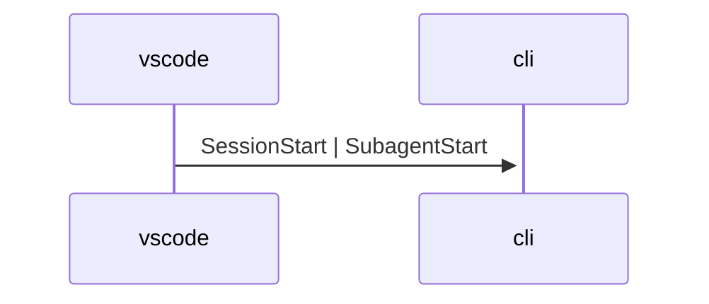
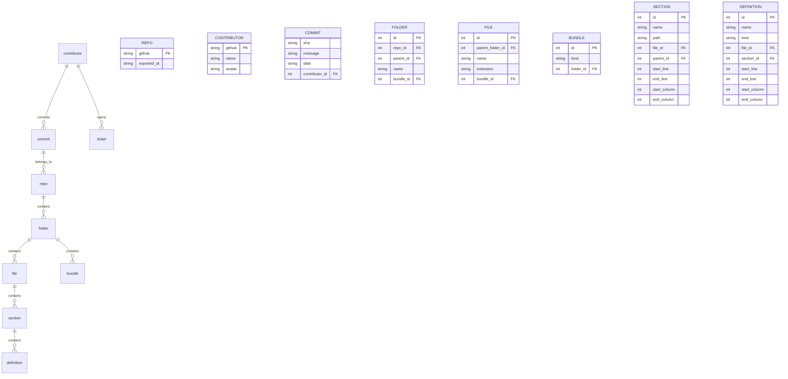

# 💯 Requirements

## [🧰semiorepo⌨️cli](semiorepo://p/i/semio-repo/b/b/cli)

## hooks

### git

#### commit

##### starting

##### ended

### agent

#### started

##### vscode-chat

##### windsurf-chat

##### cursor-chat

##### claude-code

##### droid

#### ended

##### vscode-chat

##### windsurf-chat

##### cursor-chat

##### claude-code

##### droid

#### prompt

##### submit

###### vscode-chat

###### windsurf-chat

###### cursor-chat

###### claude-code

###### droid

#### compacting

##### vscode-chat

##### windsurf-chat

##### cursor-chat

##### claude-code

##### droid

#### tool

##### starting

###### vscode-chat

###### windsurf-chat

###### cursor-chat

###### claude-code

###### droid

##### ended

###### vscode-chat

###### windsurf-chat

###### cursor-chat

###### claude-code

###### droid

##### plan

###### updating

####### vscode-chat

####### windsurf-chat

####### cursor-chat

####### claude-code

####### droid

## [🧰semiorepo📚go](semiorepo://p/i/semio-repo/b/l/go)

- Event kinds and payloads are the single source of truth for CLI→server communication.
- All changing interactions (ticket, goal, contributor, todo, commit) emit events with consistent schema.

## [🧰semiorepo🛂sqlite](semiorepo://p/i/semio-repo/b/s/sqlite)

## [🧰semiorepo🖱️vscode](semiorepo://p/i/semio-repo/b/u/vscode)

## Sidebar

The semio-repo sidebar MUST expose exactly two views: Monorepo and Filter.

The Filter view MUST represent each filter kind as a single item and expose filter options as view item menu actions.

Filter view items MUST render emoji plus name labels with tooltip descriptions; filter option menu actions MUST use emoji-only labels and MUST NOT use codeicons.

Filter state MUST apply globally to all Monorepo tree branches.

Monorepo root nodes MUST expand to show children for Technologies, Goals, Tickets, Policies, Contributors, and Commits.

## Tickets

Ticket tree items expose inline close and reopen actions that apply to the selected ticket based on status.

Ticket tree hovers show only the ticket description.

Ticket creation prompts for LLM and ticket UI selections.

Ticket tree items list commit entries as child nodes.

Ticket commands collect title/prompt/LLM for open, prompt/LLM for reopen, and operate on YYYY/MM/DD/SLUG ticket identifiers.

Ticket detail views consume git-derived per-file and total line stats stored on interactions and ticket close.

## Commands

Command trees mirror the CLI command and subcommand hierarchy; matching a command group keeps its subtree visible.

## Diagnostics

Problem list diagnostics open in pinned editor tabs for immediate saves.

Repo diagnostics and trees are driven by repo CLI ignore rules for gitignored files and repo directory content.

## Contributors

Contributor tree items list emails with mailto actions, links with external navigation, and contribution nodes with line summary descriptions.

Contributor contributions are grouped into commits, bundles, tickets (year/month/day), and files (folder/file) with navigation actions and inline ticket close/reopen actions.

## Sections View

The built-in Explorer hosts the Sections view; selecting a section navigates to it, F2 renames, drag-and-drop moves sections, JSON keys surface as sections, and inline actions create child sections, rename sections, and delete sections via repo commands.

The Sections view resolves the active file's section tree with line ranges so navigation and section actions match the current editor content.

Monorepo section tree rendering MUST include only section-typed section children and MUST exclude definition-typed children from section rows.

## General

Ticket tooling treats temporary artifacts as part of the active ticket workspace.

Devcontainer setup uninstalls any existing semio-repo extension, clears stale VS Code and Cursor caches, then installs the workspace extension for VS Code, Cursor, Windsurf, and Antigravity on attach without manual installation actions, validating installs per detected editor IPC hook CLI and falling back to extensions directories with extensions.json registration on WSL-only CLI responses.

Extension engine compatibility targets the lowest supported editor version so Cursor accepts the packaged VSIX.

Sidebar view registration keeps a single filter view and monorepo view instance wired to the shared filter state.

## [🧰semiorepo⌨️cli💻main🔖summarizecommand](semiorepo://p/i/semio-repo/b/b/cli/f/main.go/s/Summarize%20Command)

summarizeCommand MUST return a summary for the given entity ID.

## [🧰semiorepo⌨️cli💻main🔖entityemojiscommand](semiorepo://p/i/semio-repo/b/b/cli/f/main.go/s/Entity%20Emojis%20Command)

AllEntityEmojis MUST return the complete set of entity-identifying emojis.

## [🧰semiorepo⌨️cli💻main🔖mermaid](semiorepo://p/i/semio-repo/b/b/cli/f/main.go/s/Mermaid)

mermaidEscapeLabel MUST escape double quotes in mermaid labels.

## [🧰semiorepo⌨️cli💻main🔖providerregistry](semiorepo://p/i/semio-repo/b/b/cli/f/main.go/s/Provider%20Registry)

AllEditorProviders MUST perform the AllEditorProviders operation.

## [🧰semiorepo⌨️cli💻main🔖sections](semiorepo://p/i/semio-repo/b/b/cli/f/main.go/s/Sections)

ParseCodeSections MUST return an error when the input is malformed.

## [🧰semiorepo⌨️cli💻main🔖tickets](semiorepo://p/i/semio-repo/b/b/cli/f/main.go/s/Tickets)

GetTicketsDir MUST return the stored value without modification.

## [🧰semiorepo⌨️cli💻main🔖queryresolvers](semiorepo://p/i/semio-repo/b/b/cli/f/main.go/s/Query%20Resolvers)

Query MUST execute the query and return matching results.

## [🧰semiorepo⌨️cli💻main🔖mutationresolvers](semiorepo://p/i/semio-repo/b/b/cli/f/main.go/s/Mutation%20Resolvers)

Mutation MUST complete the operation successfully.

## [🧰semiorepo⌨️cli💻main🔖missingutilities](semiorepo://p/i/semio-repo/b/b/cli/f/main.go/s/Missing%20Utilities)

ScopeToFiles MUST return a non-nil error when the operation fails.

## [🧰semiorepo⌨️cli💻main🔖resolvermethods](semiorepo://p/i/semio-repo/b/b/cli/f/main.go/s/Resolver%20Methods)

Bundles MUST return a non-nil error when the operation fails.

## [🧰semiorepo⌨️cli💻main🔖missingtoolfunctions](semiorepo://p/i/semio-repo/b/b/cli/f/main.go/s/Missing%20Tool%20Functions)

ToolAnalyze MUST complete the operation successfully.

## [🧰semiorepo⌨️cli💻main🔖fileutilities](semiorepo://p/i/semio-repo/b/b/cli/f/main.go/s/File%20Utilities)

MoveFile MUST return a non-nil error when the operation fails.

## [🧰semiorepo⌨️cli💻main🔖goals](semiorepo://p/i/semio-repo/b/b/cli/f/main.go/s/Goals)

GetRepoGoalsDir MUST retrieve the requested value or return an error.

## [🧰semiorepo⌨️cli💻main🔖todos](semiorepo://p/i/semio-repo/b/b/cli/f/main.go/s/Todos)

GetTodos MUST retrieve the requested value or return an error.

## [🧰semiorepo⌨️cli💻main🛠️templatefuncmap](semiorepo://p/i/semio-repo/b/b/cli/f/main.go/d/i/templateFuncMap)

templateFuncMap MUST perform the templateFuncMap operation.

## [🧰semiorepo⌨️cli💻main🛠️colornametoansi](semiorepo://p/i/semio-repo/b/b/cli/f/main.go/d/i/colorNameToANSI)

colorNameToANSI MUST perform the colorNameToANSI operation.

## [🧰semiorepo⌨️cli💻main🛠️inittemplates](semiorepo://p/i/semio-repo/b/b/cli/f/main.go/d/i/initTemplates)

initTemplates MUST perform the initTemplates operation.

## [🧰semiorepo⌨️cli💻main🛠️rendertemplate](semiorepo://p/i/semio-repo/b/b/cli/f/main.go/d/i/renderTemplate)

renderTemplate MUST perform the renderTemplate operation.

## [🧰semiorepo⌨️cli💻main🛠️newengine](semiorepo://p/i/semio-repo/b/b/cli/f/main.go/d/i/NewEngine)

NewEngine MUST initialize all required fields and return a valid Engine.

## [🧰semiorepo⌨️cli💻main🛠️run](semiorepo://p/i/semio-repo/b/b/cli/f/main.go/d/i/Run)

Run MUST emit start, result or error, and done events in order.

## [🧰semiorepo⌨️cli💻main🛠️isjson](semiorepo://p/i/semio-repo/b/b/cli/f/main.go/d/i/IsJSON)

IsJSON MUST return true only when the condition is met.

## [🧰semiorepo⌨️cli💻main🛠️ismarkdown](semiorepo://p/i/semio-repo/b/b/cli/f/main.go/d/i/IsMarkdown)

IsMarkdown MUST return true only when the condition is met.

## [🧰semiorepo⌨️cli💻main🛠️istext](semiorepo://p/i/semio-repo/b/b/cli/f/main.go/d/i/IsText)

IsText MUST return true only when the condition is met.

## [🧰semiorepo⌨️cli💻main🛠️error](semiorepo://p/i/semio-repo/b/b/cli/f/main.go/d/i/Error)

Error MUST return a formatted string representation.

## [🧰semiorepo⌨️cli💻main🛠️newroot](semiorepo://p/i/semio-repo/b/b/cli/f/main.go/d/i/NewRoot)

NewRoot MUST initialize all required fields and return a valid Root.

## [🧰semiorepo⌨️cli💻main🛠️newrootwithconfig](semiorepo://p/i/semio-repo/b/b/cli/f/main.go/d/i/NewRootWithConfig)

NewRootWithConfig MUST initialize all required fields and return a valid RootWithConfig.

## [🧰semiorepo⌨️cli💻main🛠️execute](semiorepo://p/i/semio-repo/b/b/cli/f/main.go/d/i/Execute)

Execute MUST delegate to the root command and propagate errors.

## [🧰semiorepo⌨️cli💻main🛠️summarizecommand](semiorepo://p/i/semio-repo/b/b/cli/f/main.go/d/i/summarizeCommand)

summarizeCommand MUST return a summary for the given entity ID.

## [🧰semiorepo⌨️cli💻main🛠️allentityemojis](semiorepo://p/i/semio-repo/b/b/cli/f/main.go/d/i/AllEntityEmojis)

AllEntityEmojis MUST return the complete set of entity-identifying emojis.

## [🧰semiorepo⌨️cli💻main🛠️entityemojiscommand](semiorepo://p/i/semio-repo/b/b/cli/f/main.go/d/i/entityEmojisCommand)

entityEmojisCommand MUST output all entity-identifying emojis.

## [🧰semiorepo⌨️cli💻main🛠️extractmarkdownsection](semiorepo://p/i/semio-repo/b/b/cli/f/main.go/d/i/ExtractMarkdownSection)

ExtractMarkdownSection MUST perform the ExtractMarkdownSection operation.

## [🧰semiorepo⌨️cli💻main🛠️extractfileheadersummary](semiorepo://p/i/semio-repo/b/b/cli/f/main.go/d/i/ExtractFileHeaderSummary)

ExtractFileHeaderSummary MUST perform the ExtractFileHeaderSummary operation.

## [🧰semiorepo⌨️cli💻main🛠️extractfileheaderrequirements](semiorepo://p/i/semio-repo/b/b/cli/f/main.go/d/i/ExtractFileHeaderRequirements)

ExtractFileHeaderRequirements MUST perform the ExtractFileHeaderRequirements operation.

## [🧰semiorepo⌨️cli💻main🛠️extractsectionleadcomments](semiorepo://p/i/semio-repo/b/b/cli/f/main.go/d/i/ExtractSectionLeadComments)

ExtractSectionLeadComments MUST perform the ExtractSectionLeadComments operation.

## [🧰semiorepo⌨️cli💻main🛠️extractdefinitiondocstring](semiorepo://p/i/semio-repo/b/b/cli/f/main.go/d/i/ExtractDefinitionDocstring)

ExtractDefinitionDocstring MUST perform the ExtractDefinitionDocstring operation.

## [🧰semiorepo⌨️cli💻main🛠️generatetechnologyrequirements](semiorepo://p/i/semio-repo/b/b/cli/f/main.go/d/i/GenerateTechnologyRequirements)

GenerateTechnologyRequirements MUST perform the GenerateTechnologyRequirements operation.

## [🧰semiorepo⌨️cli💻main🛠️generatetechnologydocs](semiorepo://p/i/semio-repo/b/b/cli/f/main.go/d/i/GenerateTechnologyDocs)

GenerateTechnologyDocs MUST perform the GenerateTechnologyDocs operation.

## [🧰semiorepo⌨️cli💻main🛠️generatetechnologytodos](semiorepo://p/i/semio-repo/b/b/cli/f/main.go/d/i/GenerateTechnologyTodos)

GenerateTechnologyTodos MUST perform the GenerateTechnologyTodos operation.

## [🧰semiorepo⌨️cli💻main🛠️hasonlykinds](semiorepo://p/i/semio-repo/b/b/cli/f/main.go/d/i/HasOnlyKinds)

HasOnlyKinds MUST return true only when the property is present.

## [🧰semiorepo⌨️cli💻main🛠️iskindvisible](semiorepo://p/i/semio-repo/b/b/cli/f/main.go/d/i/IsKindVisible)

IsKindVisible MUST return true only when the condition is met.

## [🧰semiorepo⌨️cli💻main🛠️matchessubkind](semiorepo://p/i/semio-repo/b/b/cli/f/main.go/d/i/MatchesSubKind)

MatchesSubKind MUST operate on the TreeFilter receiver and return consistent results.

## [🧰semiorepo⌨️cli💻main🛠️matchesdate](semiorepo://p/i/semio-repo/b/b/cli/f/main.go/d/i/MatchesDate)

MatchesDate MUST operate on the TreeFilter receiver and return consistent results.

## [🧰semiorepo⌨️cli💻main🛠️matchesstatus](semiorepo://p/i/semio-repo/b/b/cli/f/main.go/d/i/MatchesStatus)

MatchesStatus MUST operate on the TreeFilter receiver and return consistent results.

## [🧰semiorepo⌨️cli💻main🛠️matchescontributor](semiorepo://p/i/semio-repo/b/b/cli/f/main.go/d/i/MatchesContributor)

MatchesContributor MUST operate on the TreeFilter receiver and return consistent results.

## [🧰semiorepo⌨️cli💻main🛠️buildmonorepotree](semiorepo://p/i/semio-repo/b/b/cli/f/main.go/d/i/BuildMonorepoTree)

BuildMonorepoTree MUST assemble the monorepo tree from the available context data.

## [🧰semiorepo⌨️cli💻main🛠️propagateparentids](semiorepo://p/i/semio-repo/b/b/cli/f/main.go/d/i/PropagateParentIDs)

PropagateParentIDs MUST perform the PropagateParentIDs operation.

## [🧰semiorepo⌨️cli💻main🛠️filtermonorepotree](semiorepo://p/i/semio-repo/b/b/cli/f/main.go/d/i/FilterMonorepoTree)

FilterMonorepoTree MUST preserve the tree structure while removing non-matching nodes.

## [🧰semiorepo⌨️cli💻main🛠️searchmonorepotree](semiorepo://p/i/semio-repo/b/b/cli/f/main.go/d/i/SearchMonorepoTree)

SearchMonorepoTree MUST match case-insensitively against node labels and descriptions.

## [🧰semiorepo⌨️cli💻main🛠️rendermonorepotree](semiorepo://p/i/semio-repo/b/b/cli/f/main.go/d/i/RenderMonorepoTree)

RenderMonorepoTree MUST produce a complete monorepo tree output.

## [🧰semiorepo⌨️cli💻main🛠️rendermonorepotreemarkdown](semiorepo://p/i/semio-repo/b/b/cli/f/main.go/d/i/RenderMonorepoTreeMarkdown)

RenderMonorepoTreeMarkdown MUST produce a complete monorepo tree markdown output.

## [🧰semiorepo⌨️cli💻main🛠️buildmonorepotreecached](semiorepo://p/i/semio-repo/b/b/cli/f/main.go/d/i/BuildMonorepoTreeCached)

BuildMonorepoTreeCached MUST perform the BuildMonorepoTreeCached operation.

## [🧰semiorepo⌨️cli💻main🛠️render](semiorepo://p/i/semio-repo/b/b/cli/f/main.go/d/i/Render)

Render MUST produce a complete  output.

## [🧰semiorepo⌨️cli💻main🛠️render](semiorepo://p/i/semio-repo/b/b/cli/f/main.go/d/i/Render)

Render MUST produce a complete  output.

## [🧰semiorepo⌨️cli💻main🛠️render](semiorepo://p/i/semio-repo/b/b/cli/f/main.go/d/i/Render)

Render MUST produce a complete  output.

## [🧰semiorepo⌨️cli💻main🛠️mermaidescapelabel](semiorepo://p/i/semio-repo/b/b/cli/f/main.go/d/i/mermaidEscapeLabel)

mermaidEscapeLabel MUST escape double quotes in mermaid labels.

## [🧰semiorepo⌨️cli💻main🛠️mermaidtechnologyemoji](semiorepo://p/i/semio-repo/b/b/cli/f/main.go/d/i/mermaidTechnologyEmoji)

mermaidTechnologyEmoji MUST return the correct emoji for the technology kind.

## [🧰semiorepo⌨️cli💻main🛠️mermaidbundleemoji](semiorepo://p/i/semio-repo/b/b/cli/f/main.go/d/i/mermaidBundleEmoji)

mermaidBundleEmoji MUST return the correct emoji for the bundle kind.

## [🧰semiorepo⌨️cli💻main🛠️mermaidfileemoji](semiorepo://p/i/semio-repo/b/b/cli/f/main.go/d/i/mermaidFileEmoji)

mermaidFileEmoji MUST return the correct emoji for the file kind.

## [🧰semiorepo⌨️cli💻main🛠️mermaidcommand](semiorepo://p/i/semio-repo/b/b/cli/f/main.go/d/i/mermaidCommand)

mermaidCommand MUST return a cobra.Command with loc-by subcommands for mermaid diagram generation.

## [🧰semiorepo⌨️cli💻main🛠️isvalid](semiorepo://p/i/semio-repo/b/b/cli/f/main.go/d/i/IsValid)

IsValid MUST return true only when the condition is met.

## [🧰semiorepo⌨️cli💻main🛠️string](semiorepo://p/i/semio-repo/b/b/cli/f/main.go/d/i/String)

String MUST return the canonical string value.

## [🧰semiorepo⌨️cli💻main🛠️derivedefinitionkind](semiorepo://p/i/semio-repo/b/b/cli/f/main.go/d/i/DeriveDefinitionKind)

DeriveDefinitionKind MUST return a valid value for any recognized input.

## [🧰semiorepo⌨️cli💻main🛠️isvalid](semiorepo://p/i/semio-repo/b/b/cli/f/main.go/d/i/IsValid)

IsValid MUST return true only when the condition is met.

## [🧰semiorepo⌨️cli💻main🛠️string](semiorepo://p/i/semio-repo/b/b/cli/f/main.go/d/i/String)

String MUST return the canonical string value.

## [🧰semiorepo⌨️cli💻main🛠️isvalid](semiorepo://p/i/semio-repo/b/b/cli/f/main.go/d/i/IsValid)

IsValid MUST return true only when the condition is met.

## [🧰semiorepo⌨️cli💻main🛠️string](semiorepo://p/i/semio-repo/b/b/cli/f/main.go/d/i/String)

String MUST return the canonical string value.

## [🧰semiorepo⌨️cli💻main🛠️normalizellmslug](semiorepo://p/i/semio-repo/b/b/cli/f/main.go/d/i/NormalizeLLMSlug)

NormalizeLLMSlug MUST be idempotent for already-normalized values.

## [🧰semiorepo⌨️cli💻main🛠️normalizeclientslug](semiorepo://p/i/semio-repo/b/b/cli/f/main.go/d/i/NormalizeClientSlug)

NormalizeClientSlug MUST be idempotent for already-normalized values.

## [🧰semiorepo⌨️cli💻main🛠️resolveallowedllm](semiorepo://p/i/semio-repo/b/b/cli/f/main.go/d/i/ResolveAllowedLLM)

ResolveAllowedLLM MUST return an error for unrecognized values.

## [🧰semiorepo⌨️cli💻main🛠️resolveallowedclient](semiorepo://p/i/semio-repo/b/b/cli/f/main.go/d/i/ResolveAllowedClient)

ResolveAllowedClient MUST return an error for unrecognized values.

## [🧰semiorepo⌨️cli💻main🛠️isnode](semiorepo://p/i/semio-repo/b/b/cli/f/main.go/d/i/IsNode)

IsNode MUST return true only when the condition is met.

## [🧰semiorepo⌨️cli💻main🛠️getid](semiorepo://p/i/semio-repo/b/b/cli/f/main.go/d/i/GetID)

GetID MUST return the stored value without modification.

## [🧰semiorepo⌨️cli💻main🛠️geturi](semiorepo://p/i/semio-repo/b/b/cli/f/main.go/d/i/GetURI)

GetURI MUST return the stored value without modification.

## [🧰semiorepo⌨️cli💻main🛠️string](semiorepo://p/i/semio-repo/b/b/cli/f/main.go/d/i/String)

String MUST return the canonical string value.

## [🧰semiorepo⌨️cli💻main🛠️isvalid](semiorepo://p/i/semio-repo/b/b/cli/f/main.go/d/i/IsValid)

IsValid MUST return true only when the condition is met.

## [🧰semiorepo⌨️cli💻main🛠️string](semiorepo://p/i/semio-repo/b/b/cli/f/main.go/d/i/String)

String MUST return the canonical string value.

## [🧰semiorepo⌨️cli💻main🛠️derivetechnologykind](semiorepo://p/i/semio-repo/b/b/cli/f/main.go/d/i/DeriveTechnologyKind)

DeriveTechnologyKind MUST return a valid value for any recognized input.

## [🧰semiorepo⌨️cli💻main🛠️derivebundlekind](semiorepo://p/i/semio-repo/b/b/cli/f/main.go/d/i/DeriveBundleKind)

DeriveBundleKind MUST return a valid value for any recognized input.

## [🧰semiorepo⌨️cli💻main🛠️isnode](semiorepo://p/i/semio-repo/b/b/cli/f/main.go/d/i/IsNode)

IsNode MUST return true only when the condition is met.

## [🧰semiorepo⌨️cli💻main🛠️getid](semiorepo://p/i/semio-repo/b/b/cli/f/main.go/d/i/GetID)

GetID MUST return the stored value without modification.

## [🧰semiorepo⌨️cli💻main🛠️geturi](semiorepo://p/i/semio-repo/b/b/cli/f/main.go/d/i/GetURI)

GetURI MUST return the stored value without modification.

## [🧰semiorepo⌨️cli💻main🛠️isnode](semiorepo://p/i/semio-repo/b/b/cli/f/main.go/d/i/IsNode)

IsNode MUST return true only when the condition is met.

## [🧰semiorepo⌨️cli💻main🛠️getid](semiorepo://p/i/semio-repo/b/b/cli/f/main.go/d/i/GetID)

GetID MUST return the stored value without modification.

## [🧰semiorepo⌨️cli💻main🛠️geturi](semiorepo://p/i/semio-repo/b/b/cli/f/main.go/d/i/GetURI)

GetURI MUST return the stored value without modification.

## [🧰semiorepo⌨️cli💻main🛠️isvalid](semiorepo://p/i/semio-repo/b/b/cli/f/main.go/d/i/IsValid)

IsValid MUST return true only when the condition is met.

## [🧰semiorepo⌨️cli💻main🛠️string](semiorepo://p/i/semio-repo/b/b/cli/f/main.go/d/i/String)

String MUST return the canonical string value.

## [🧰semiorepo⌨️cli💻main🪨folderkindcache](semiorepo://p/i/semio-repo/b/b/cli/f/main.go/d/c/folderKindCache)

DeriveFolderKind MUST return a valid value for any recognized input.

## [🧰semiorepo⌨️cli💻main🛠️derivefolderkind](semiorepo://p/i/semio-repo/b/b/cli/f/main.go/d/i/DeriveFolderKind)

DeriveFolderKind MUST perform the DeriveFolderKind operation.

## [🧰semiorepo⌨️cli💻main🛠️isgeneratedfolder](semiorepo://p/i/semio-repo/b/b/cli/f/main.go/d/i/IsGeneratedFolder)

IsGeneratedFolder MUST return true only when the condition is met.

## [🧰semiorepo⌨️cli💻main🛠️isnode](semiorepo://p/i/semio-repo/b/b/cli/f/main.go/d/i/IsNode)

IsNode MUST return true only when the condition is met.

## [🧰semiorepo⌨️cli💻main🛠️getid](semiorepo://p/i/semio-repo/b/b/cli/f/main.go/d/i/GetID)

GetID MUST return the stored value without modification.

## [🧰semiorepo⌨️cli💻main🛠️geturi](semiorepo://p/i/semio-repo/b/b/cli/f/main.go/d/i/GetURI)

GetURI MUST return the stored value without modification.

## [🧰semiorepo⌨️cli💻main🛠️derivefilekind](semiorepo://p/i/semio-repo/b/b/cli/f/main.go/d/i/DeriveFileKind)

DeriveFileKind MUST return a valid value for any recognized input.

## [🧰semiorepo⌨️cli💻main🛠️isnode](semiorepo://p/i/semio-repo/b/b/cli/f/main.go/d/i/IsNode)

IsNode MUST return true only when the condition is met.

## [🧰semiorepo⌨️cli💻main🛠️isgenerated](semiorepo://p/i/semio-repo/b/b/cli/f/main.go/d/i/IsGenerated)

IsGenerated MUST return true only when the condition is met.

## [🧰semiorepo⌨️cli💻main🛠️issemanticallyignored](semiorepo://p/i/semio-repo/b/b/cli/f/main.go/d/i/IsSemanticallyIgnored)

IsSemanticallyIgnored MUST return true only when the condition is met.

## [🧰semiorepo⌨️cli💻main🛠️getid](semiorepo://p/i/semio-repo/b/b/cli/f/main.go/d/i/GetID)

GetID MUST return the stored value without modification.

## [🧰semiorepo⌨️cli💻main🛠️geturi](semiorepo://p/i/semio-repo/b/b/cli/f/main.go/d/i/GetURI)

GetURI MUST return the stored value without modification.

## [🧰semiorepo⌨️cli💻main🛠️isnode](semiorepo://p/i/semio-repo/b/b/cli/f/main.go/d/i/IsNode)

IsNode MUST return true only when the condition is met.

## [🧰semiorepo⌨️cli💻main🛠️getid](semiorepo://p/i/semio-repo/b/b/cli/f/main.go/d/i/GetID)

GetID MUST return the stored value without modification.

## [🧰semiorepo⌨️cli💻main🛠️geturi](semiorepo://p/i/semio-repo/b/b/cli/f/main.go/d/i/GetURI)

GetURI MUST return the stored value without modification.

## [🧰semiorepo⌨️cli💻main🛠️isnode](semiorepo://p/i/semio-repo/b/b/cli/f/main.go/d/i/IsNode)

IsNode MUST return true only when the condition is met.

## [🧰semiorepo⌨️cli💻main🛠️getid](semiorepo://p/i/semio-repo/b/b/cli/f/main.go/d/i/GetID)

GetID MUST return the stored value without modification.

## [🧰semiorepo⌨️cli💻main🛠️geturi](semiorepo://p/i/semio-repo/b/b/cli/f/main.go/d/i/GetURI)

GetURI MUST return the stored value without modification.

## [🧰semiorepo⌨️cli💻main🛠️isnode](semiorepo://p/i/semio-repo/b/b/cli/f/main.go/d/i/IsNode)

IsNode MUST return true only when the condition is met.

## [🧰semiorepo⌨️cli💻main🛠️getid](semiorepo://p/i/semio-repo/b/b/cli/f/main.go/d/i/GetID)

GetID MUST return the stored value without modification.

## [🧰semiorepo⌨️cli💻main🛠️geturi](semiorepo://p/i/semio-repo/b/b/cli/f/main.go/d/i/GetURI)

GetURI MUST return the stored value without modification.

## [🧰semiorepo⌨️cli💻main🛠️isnode](semiorepo://p/i/semio-repo/b/b/cli/f/main.go/d/i/IsNode)

IsNode MUST return true only when the condition is met.

## [🧰semiorepo⌨️cli💻main🛠️getid](semiorepo://p/i/semio-repo/b/b/cli/f/main.go/d/i/GetID)

GetID MUST return the stored value without modification.

## [🧰semiorepo⌨️cli💻main🛠️geturi](semiorepo://p/i/semio-repo/b/b/cli/f/main.go/d/i/GetURI)

GetURI MUST return the stored value without modification.

## [🧰semiorepo⌨️cli💻main🛠️getdraftspath](semiorepo://p/i/semio-repo/b/b/cli/f/main.go/d/i/GetDraftsPath)

GetDraftsPath MUST return the stored value without modification.

## [🧰semiorepo⌨️cli💻main🛠️listdrafts](semiorepo://p/i/semio-repo/b/b/cli/f/main.go/d/i/ListDrafts)

ListDrafts MUST return a consistent snapshot of available entries.

## [🧰semiorepo⌨️cli💻main🛠️createdraft](semiorepo://p/i/semio-repo/b/b/cli/f/main.go/d/i/CreateDraft)

CreateDraft MUST persist the new entity and return a reference to it.

## [🧰semiorepo⌨️cli💻main🛠️deletedraft](semiorepo://p/i/semio-repo/b/b/cli/f/main.go/d/i/DeleteDraft)

DeleteDraft MUST remove all associated data for the entity.

## [🧰semiorepo⌨️cli💻main🛠️getid](semiorepo://p/i/semio-repo/b/b/cli/f/main.go/d/i/GetID)

GetID MUST return the stored value without modification.

## [🧰semiorepo⌨️cli💻main🛠️geturi](semiorepo://p/i/semio-repo/b/b/cli/f/main.go/d/i/GetURI)

GetURI MUST return the stored value without modification.

## [🧰semiorepo⌨️cli💻main🛠️unmarshaljson](semiorepo://p/i/semio-repo/b/b/cli/f/main.go/d/i/UnmarshalJSON)

UnmarshalJSON MUST handle both legacy and current ticket JSON layouts.

## [🧰semiorepo⌨️cli💻main🛠️marshaljson](semiorepo://p/i/semio-repo/b/b/cli/f/main.go/d/i/MarshalJSON)

MarshalJSON MUST perform the MarshalJSON operation.

## [🧰semiorepo⌨️cli💻main🛠️isnode](semiorepo://p/i/semio-repo/b/b/cli/f/main.go/d/i/IsNode)

IsNode MUST return true only when the condition is met.

## [🧰semiorepo⌨️cli💻main🛠️getid](semiorepo://p/i/semio-repo/b/b/cli/f/main.go/d/i/GetID)

GetID MUST return the stored value without modification.

## [🧰semiorepo⌨️cli💻main🛠️geturi](semiorepo://p/i/semio-repo/b/b/cli/f/main.go/d/i/GetURI)

GetURI MUST return the stored value without modification.

## [🧰semiorepo⌨️cli💻main🛠️gettitle](semiorepo://p/i/semio-repo/b/b/cli/f/main.go/d/i/GetTitle)

GetTitle MUST return the stored value without modification.

## [🧰semiorepo⌨️cli💻main🛠️getprompt](semiorepo://p/i/semio-repo/b/b/cli/f/main.go/d/i/GetPrompt)

GetPrompt MUST return the description or the first interaction prompt.

## [🧰semiorepo⌨️cli💻main🛠️getlatestprompt](semiorepo://p/i/semio-repo/b/b/cli/f/main.go/d/i/GetLatestPrompt)

GetLatestPrompt MUST return the latest prompt from sessions or interactions.

## [🧰semiorepo⌨️cli💻main🛠️getllm](semiorepo://p/i/semio-repo/b/b/cli/f/main.go/d/i/GetLLM)

GetLLM MUST return the LLM from the latest session or interaction.

## [🧰semiorepo⌨️cli💻main🛠️getclient](semiorepo://p/i/semio-repo/b/b/cli/f/main.go/d/i/GetClient)

GetClient MUST return the client from the latest session or interaction.

## [🧰semiorepo⌨️cli💻main🛠️getstatus](semiorepo://p/i/semio-repo/b/b/cli/f/main.go/d/i/GetStatus)

GetStatus MUST return the stored value without modification.

## [🧰semiorepo⌨️cli💻main🛠️getauthor](semiorepo://p/i/semio-repo/b/b/cli/f/main.go/d/i/GetAuthor)

GetAuthor MUST return the author from the first session or interaction.

## [🧰semiorepo⌨️cli💻main🛠️getcheckpoint](semiorepo://p/i/semio-repo/b/b/cli/f/main.go/d/i/GetCheckpoint)

GetCheckpoint MUST return the checkpoint from the first interaction.

## [🧰semiorepo⌨️cli💻main🛠️getsummary](semiorepo://p/i/semio-repo/b/b/cli/f/main.go/d/i/GetSummary)

GetSummary MUST return the stored value without modification.

## [🧰semiorepo⌨️cli💻main🛠️getdatestarted](semiorepo://p/i/semio-repo/b/b/cli/f/main.go/d/i/GetDateStarted)

GetDateStarted MUST return the earliest date from interactions or sessions.

## [🧰semiorepo⌨️cli💻main🛠️getdatefinished](semiorepo://p/i/semio-repo/b/b/cli/f/main.go/d/i/GetDateFinished)

GetDateFinished MUST return the stored value without modification.

## [🧰semiorepo⌨️cli💻main🛠️getinteractionfiles](semiorepo://p/i/semio-repo/b/b/cli/f/main.go/d/i/GetInteractionFiles)

GetInteractionFiles MUST return the stored value without modification.

## [🧰semiorepo⌨️cli💻main🛠️isnode](semiorepo://p/i/semio-repo/b/b/cli/f/main.go/d/i/IsNode)

IsNode MUST return true only when the condition is met.

## [🧰semiorepo⌨️cli💻main🛠️getid](semiorepo://p/i/semio-repo/b/b/cli/f/main.go/d/i/GetID)

GetID MUST return the stored value without modification.

## [🧰semiorepo⌨️cli💻main🛠️geturi](semiorepo://p/i/semio-repo/b/b/cli/f/main.go/d/i/GetURI)

GetURI MUST return the stored value without modification.

## [🧰semiorepo⌨️cli💻main🛠️isnode](semiorepo://p/i/semio-repo/b/b/cli/f/main.go/d/i/IsNode)

IsNode MUST return true only when the condition is met.

## [🧰semiorepo⌨️cli💻main🛠️getid](semiorepo://p/i/semio-repo/b/b/cli/f/main.go/d/i/GetID)

GetID MUST return the stored value without modification.

## [🧰semiorepo⌨️cli💻main🛠️geturi](semiorepo://p/i/semio-repo/b/b/cli/f/main.go/d/i/GetURI)

GetURI MUST return the stored value without modification.

## [🧰semiorepo⌨️cli💻main🛠️buildsemanticdiffs](semiorepo://p/i/semio-repo/b/b/cli/f/main.go/d/i/BuildSemanticDiffs)

BuildSemanticDiffs MUST assemble the semantic diffs from the available context data.

## [🧰semiorepo⌨️cli💻main🛠️tostreamoptions](semiorepo://p/i/semio-repo/b/b/cli/f/main.go/d/i/ToStreamOptions)

ToStreamOptions MUST map all filter input fields to stream options.

## [🧰semiorepo⌨️cli💻main🛠️kind](semiorepo://p/i/semio-repo/b/b/cli/f/main.go/d/i/Kind)

Kind MUST perform the Kind operation.

## [🧰semiorepo⌨️cli💻main🛠️configure](semiorepo://p/i/semio-repo/b/b/cli/f/main.go/d/i/Configure)

Configure MUST perform the Configure operation.

## [🧰semiorepo⌨️cli💻main🛠️createissue](semiorepo://p/i/semio-repo/b/b/cli/f/main.go/d/i/CreateIssue)

CreateIssue MUST perform the CreateIssue operation.

## [🧰semiorepo⌨️cli💻main🛠️closeissue](semiorepo://p/i/semio-repo/b/b/cli/f/main.go/d/i/CloseIssue)

CloseIssue MUST perform the CloseIssue operation.

## [🧰semiorepo⌨️cli💻main🛠️reopenissue](semiorepo://p/i/semio-repo/b/b/cli/f/main.go/d/i/ReopenIssue)

ReopenIssue MUST perform the ReopenIssue operation.

## [🧰semiorepo⌨️cli💻main🛠️deleteissue](semiorepo://p/i/semio-repo/b/b/cli/f/main.go/d/i/DeleteIssue)

DeleteIssue MUST perform the DeleteIssue operation.

## [🧰semiorepo⌨️cli💻main🛠️updateissuetitle](semiorepo://p/i/semio-repo/b/b/cli/f/main.go/d/i/UpdateIssueTitle)

UpdateIssueTitle MUST perform the UpdateIssueTitle operation.

## [🧰semiorepo⌨️cli💻main🛠️updateissuebody](semiorepo://p/i/semio-repo/b/b/cli/f/main.go/d/i/UpdateIssueBody)

UpdateIssueBody MUST perform the UpdateIssueBody operation.

## [🧰semiorepo⌨️cli💻main🛠️getissuedetails](semiorepo://p/i/semio-repo/b/b/cli/f/main.go/d/i/GetIssueDetails)

GetIssueDetails MUST perform the GetIssueDetails operation.

## [🧰semiorepo⌨️cli💻main🛠️getissuenodeid](semiorepo://p/i/semio-repo/b/b/cli/f/main.go/d/i/GetIssueNodeID)

GetIssueNodeID MUST perform the GetIssueNodeID operation.

## [🧰semiorepo⌨️cli💻main🛠️getissueparenturl](semiorepo://p/i/semio-repo/b/b/cli/f/main.go/d/i/GetIssueParentURL)

GetIssueParentURL MUST perform the GetIssueParentURL operation.

## [🧰semiorepo⌨️cli💻main🛠️addcomment](semiorepo://p/i/semio-repo/b/b/cli/f/main.go/d/i/AddComment)

AddComment MUST perform the AddComment operation.

## [🧰semiorepo⌨️cli💻main🛠️addlabels](semiorepo://p/i/semio-repo/b/b/cli/f/main.go/d/i/AddLabels)

AddLabels MUST perform the AddLabels operation.

## [🧰semiorepo⌨️cli💻main🛠️removelabels](semiorepo://p/i/semio-repo/b/b/cli/f/main.go/d/i/RemoveLabels)

RemoveLabels MUST perform the RemoveLabels operation.

## [🧰semiorepo⌨️cli💻main🛠️addissuetoproject](semiorepo://p/i/semio-repo/b/b/cli/f/main.go/d/i/AddIssueToProject)

AddIssueToProject MUST perform the AddIssueToProject operation.

## [🧰semiorepo⌨️cli💻main🛠️assignissuetocurrentuser](semiorepo://p/i/semio-repo/b/b/cli/f/main.go/d/i/AssignIssueToCurrentUser)

AssignIssueToCurrentUser MUST perform the AssignIssueToCurrentUser operation.

## [🧰semiorepo⌨️cli💻main🛠️addsubissue](semiorepo://p/i/semio-repo/b/b/cli/f/main.go/d/i/AddSubIssue)

AddSubIssue MUST perform the AddSubIssue operation.

## [🧰semiorepo⌨️cli💻main🛠️updateissuemilestone](semiorepo://p/i/semio-repo/b/b/cli/f/main.go/d/i/UpdateIssueMilestone)

UpdateIssueMilestone MUST perform the UpdateIssueMilestone operation.

## [🧰semiorepo⌨️cli💻main🛠️clearissuemilestone](semiorepo://p/i/semio-repo/b/b/cli/f/main.go/d/i/ClearIssueMilestone)

ClearIssueMilestone MUST perform the ClearIssueMilestone operation.

## [🧰semiorepo⌨️cli💻main🛠️createmilestone](semiorepo://p/i/semio-repo/b/b/cli/f/main.go/d/i/CreateMilestone)

CreateMilestone MUST perform the CreateMilestone operation.

## [🧰semiorepo⌨️cli💻main🛠️updatemilestone](semiorepo://p/i/semio-repo/b/b/cli/f/main.go/d/i/UpdateMilestone)

UpdateMilestone MUST perform the UpdateMilestone operation.

## [🧰semiorepo⌨️cli💻main🛠️deletemilestone](semiorepo://p/i/semio-repo/b/b/cli/f/main.go/d/i/DeleteMilestone)

DeleteMilestone MUST perform the DeleteMilestone operation.

## [🧰semiorepo⌨️cli💻main🛠️getmilestone](semiorepo://p/i/semio-repo/b/b/cli/f/main.go/d/i/GetMilestone)

GetMilestone MUST perform the GetMilestone operation.

## [🧰semiorepo⌨️cli💻main🛠️getmilestonetitle](semiorepo://p/i/semio-repo/b/b/cli/f/main.go/d/i/GetMilestoneTitle)

GetMilestoneTitle MUST perform the GetMilestoneTitle operation.

## [🧰semiorepo⌨️cli💻main🛠️findmilestonebytitle](semiorepo://p/i/semio-repo/b/b/cli/f/main.go/d/i/FindMilestoneByTitle)

FindMilestoneByTitle MUST perform the FindMilestoneByTitle operation.

## [🧰semiorepo⌨️cli💻main🛠️listissuesforlabelsync](semiorepo://p/i/semio-repo/b/b/cli/f/main.go/d/i/ListIssuesForLabelSync)

ListIssuesForLabelSync MUST perform the ListIssuesForLabelSync operation.

## [🧰semiorepo⌨️cli💻main🛠️listopenissueswithlabel](semiorepo://p/i/semio-repo/b/b/cli/f/main.go/d/i/ListOpenIssuesWithLabel)

ListOpenIssuesWithLabel MUST perform the ListOpenIssuesWithLabel operation.

## [🧰semiorepo⌨️cli💻main🛠️listrepolabels](semiorepo://p/i/semio-repo/b/b/cli/f/main.go/d/i/ListRepoLabels)

ListRepoLabels MUST perform the ListRepoLabels operation.

## [🧰semiorepo⌨️cli💻main🛠️createrepolabel](semiorepo://p/i/semio-repo/b/b/cli/f/main.go/d/i/CreateRepoLabel)

CreateRepoLabel MUST perform the CreateRepoLabel operation.

## [🧰semiorepo⌨️cli💻main🛠️deleterepolabel](semiorepo://p/i/semio-repo/b/b/cli/f/main.go/d/i/DeleteRepoLabel)

DeleteRepoLabel MUST perform the DeleteRepoLabel operation.

## [🧰semiorepo⌨️cli💻main🛠️syncrepolabelcatalog](semiorepo://p/i/semio-repo/b/b/cli/f/main.go/d/i/SyncRepoLabelCatalog)

SyncRepoLabelCatalog MUST perform the SyncRepoLabelCatalog operation.

## [🧰semiorepo⌨️cli💻main🛠️creategoalissue](semiorepo://p/i/semio-repo/b/b/cli/f/main.go/d/i/CreateGoalIssue)

CreateGoalIssue MUST perform the CreateGoalIssue operation.

## [🧰semiorepo⌨️cli💻main🛠️updategoalissue](semiorepo://p/i/semio-repo/b/b/cli/f/main.go/d/i/UpdateGoalIssue)

UpdateGoalIssue MUST perform the UpdateGoalIssue operation.

## [🧰semiorepo⌨️cli💻main🛠️getcurrentuser](semiorepo://p/i/semio-repo/b/b/cli/f/main.go/d/i/GetCurrentUser)

GetCurrentUser MUST perform the GetCurrentUser operation.

## [🧰semiorepo⌨️cli💻main🛠️kind](semiorepo://p/i/semio-repo/b/b/cli/f/main.go/d/i/Kind)

Kind MUST perform the Kind operation.

## [🧰semiorepo⌨️cli💻main🛠️configure](semiorepo://p/i/semio-repo/b/b/cli/f/main.go/d/i/Configure)

Configure MUST perform the Configure operation.

## [🧰semiorepo⌨️cli💻main🛠️createissue](semiorepo://p/i/semio-repo/b/b/cli/f/main.go/d/i/CreateIssue)

CreateIssue MUST perform the CreateIssue operation.

## [🧰semiorepo⌨️cli💻main🛠️closeissue](semiorepo://p/i/semio-repo/b/b/cli/f/main.go/d/i/CloseIssue)

CloseIssue MUST perform the CloseIssue operation.

## [🧰semiorepo⌨️cli💻main🛠️reopenissue](semiorepo://p/i/semio-repo/b/b/cli/f/main.go/d/i/ReopenIssue)

ReopenIssue MUST perform the ReopenIssue operation.

## [🧰semiorepo⌨️cli💻main🛠️deleteissue](semiorepo://p/i/semio-repo/b/b/cli/f/main.go/d/i/DeleteIssue)

DeleteIssue MUST perform the DeleteIssue operation.

## [🧰semiorepo⌨️cli💻main🛠️updateissuetitle](semiorepo://p/i/semio-repo/b/b/cli/f/main.go/d/i/UpdateIssueTitle)

UpdateIssueTitle MUST perform the UpdateIssueTitle operation.

## [🧰semiorepo⌨️cli💻main🛠️updateissuebody](semiorepo://p/i/semio-repo/b/b/cli/f/main.go/d/i/UpdateIssueBody)

UpdateIssueBody MUST perform the UpdateIssueBody operation.

## [🧰semiorepo⌨️cli💻main🛠️getissuedetails](semiorepo://p/i/semio-repo/b/b/cli/f/main.go/d/i/GetIssueDetails)

GetIssueDetails MUST perform the GetIssueDetails operation.

## [🧰semiorepo⌨️cli💻main🛠️getissuenodeid](semiorepo://p/i/semio-repo/b/b/cli/f/main.go/d/i/GetIssueNodeID)

GetIssueNodeID MUST perform the GetIssueNodeID operation.

## [🧰semiorepo⌨️cli💻main🛠️getissueparenturl](semiorepo://p/i/semio-repo/b/b/cli/f/main.go/d/i/GetIssueParentURL)

GetIssueParentURL MUST perform the GetIssueParentURL operation.

## [🧰semiorepo⌨️cli💻main🛠️addcomment](semiorepo://p/i/semio-repo/b/b/cli/f/main.go/d/i/AddComment)

AddComment MUST perform the AddComment operation.

## [🧰semiorepo⌨️cli💻main🛠️addlabels](semiorepo://p/i/semio-repo/b/b/cli/f/main.go/d/i/AddLabels)

AddLabels MUST perform the AddLabels operation.

## [🧰semiorepo⌨️cli💻main🛠️removelabels](semiorepo://p/i/semio-repo/b/b/cli/f/main.go/d/i/RemoveLabels)

RemoveLabels MUST perform the RemoveLabels operation.

## [🧰semiorepo⌨️cli💻main🛠️addissuetoproject](semiorepo://p/i/semio-repo/b/b/cli/f/main.go/d/i/AddIssueToProject)

AddIssueToProject MUST perform the AddIssueToProject operation.

## [🧰semiorepo⌨️cli💻main🛠️assignissuetocurrentuser](semiorepo://p/i/semio-repo/b/b/cli/f/main.go/d/i/AssignIssueToCurrentUser)

AssignIssueToCurrentUser MUST perform the AssignIssueToCurrentUser operation.

## [🧰semiorepo⌨️cli💻main🛠️addsubissue](semiorepo://p/i/semio-repo/b/b/cli/f/main.go/d/i/AddSubIssue)

AddSubIssue MUST perform the AddSubIssue operation.

## [🧰semiorepo⌨️cli💻main🛠️updateissuemilestone](semiorepo://p/i/semio-repo/b/b/cli/f/main.go/d/i/UpdateIssueMilestone)

UpdateIssueMilestone MUST perform the UpdateIssueMilestone operation.

## [🧰semiorepo⌨️cli💻main🛠️clearissuemilestone](semiorepo://p/i/semio-repo/b/b/cli/f/main.go/d/i/ClearIssueMilestone)

ClearIssueMilestone MUST perform the ClearIssueMilestone operation.

## [🧰semiorepo⌨️cli💻main🛠️createmilestone](semiorepo://p/i/semio-repo/b/b/cli/f/main.go/d/i/CreateMilestone)

CreateMilestone MUST perform the CreateMilestone operation.

## [🧰semiorepo⌨️cli💻main🛠️updatemilestone](semiorepo://p/i/semio-repo/b/b/cli/f/main.go/d/i/UpdateMilestone)

UpdateMilestone MUST perform the UpdateMilestone operation.

## [🧰semiorepo⌨️cli💻main🛠️deletemilestone](semiorepo://p/i/semio-repo/b/b/cli/f/main.go/d/i/DeleteMilestone)

DeleteMilestone MUST perform the DeleteMilestone operation.

## [🧰semiorepo⌨️cli💻main🛠️getmilestone](semiorepo://p/i/semio-repo/b/b/cli/f/main.go/d/i/GetMilestone)

GetMilestone MUST perform the GetMilestone operation.

## [🧰semiorepo⌨️cli💻main🛠️getmilestonetitle](semiorepo://p/i/semio-repo/b/b/cli/f/main.go/d/i/GetMilestoneTitle)

GetMilestoneTitle MUST perform the GetMilestoneTitle operation.

## [🧰semiorepo⌨️cli💻main🛠️findmilestonebytitle](semiorepo://p/i/semio-repo/b/b/cli/f/main.go/d/i/FindMilestoneByTitle)

FindMilestoneByTitle MUST perform the FindMilestoneByTitle operation.

## [🧰semiorepo⌨️cli💻main🛠️listissuesforlabelsync](semiorepo://p/i/semio-repo/b/b/cli/f/main.go/d/i/ListIssuesForLabelSync)

ListIssuesForLabelSync MUST perform the ListIssuesForLabelSync operation.

## [🧰semiorepo⌨️cli💻main🛠️listopenissueswithlabel](semiorepo://p/i/semio-repo/b/b/cli/f/main.go/d/i/ListOpenIssuesWithLabel)

ListOpenIssuesWithLabel MUST perform the ListOpenIssuesWithLabel operation.

## [🧰semiorepo⌨️cli💻main🛠️listrepolabels](semiorepo://p/i/semio-repo/b/b/cli/f/main.go/d/i/ListRepoLabels)

ListRepoLabels MUST perform the ListRepoLabels operation.

## [🧰semiorepo⌨️cli💻main🛠️createrepolabel](semiorepo://p/i/semio-repo/b/b/cli/f/main.go/d/i/CreateRepoLabel)

CreateRepoLabel MUST perform the CreateRepoLabel operation.

## [🧰semiorepo⌨️cli💻main🛠️deleterepolabel](semiorepo://p/i/semio-repo/b/b/cli/f/main.go/d/i/DeleteRepoLabel)

DeleteRepoLabel MUST perform the DeleteRepoLabel operation.

## [🧰semiorepo⌨️cli💻main🛠️syncrepolabelcatalog](semiorepo://p/i/semio-repo/b/b/cli/f/main.go/d/i/SyncRepoLabelCatalog)

SyncRepoLabelCatalog MUST perform the SyncRepoLabelCatalog operation.

## [🧰semiorepo⌨️cli💻main🛠️creategoalissue](semiorepo://p/i/semio-repo/b/b/cli/f/main.go/d/i/CreateGoalIssue)

CreateGoalIssue MUST perform the CreateGoalIssue operation.

## [🧰semiorepo⌨️cli💻main🛠️updategoalissue](semiorepo://p/i/semio-repo/b/b/cli/f/main.go/d/i/UpdateGoalIssue)

UpdateGoalIssue MUST perform the UpdateGoalIssue operation.

## [🧰semiorepo⌨️cli💻main🛠️getcurrentuser](semiorepo://p/i/semio-repo/b/b/cli/f/main.go/d/i/GetCurrentUser)

GetCurrentUser MUST perform the GetCurrentUser operation.

## [🧰semiorepo⌨️cli💻main🛠️kind](semiorepo://p/i/semio-repo/b/b/cli/f/main.go/d/i/Kind)

Kind MUST perform the Kind operation.

## [🧰semiorepo⌨️cli💻main🛠️repourl](semiorepo://p/i/semio-repo/b/b/cli/f/main.go/d/i/RepoURL)

RepoURL MUST perform the RepoURL operation.

## [🧰semiorepo⌨️cli💻main🛠️configure](semiorepo://p/i/semio-repo/b/b/cli/f/main.go/d/i/Configure)

Configure MUST perform the Configure operation.

## [🧰semiorepo⌨️cli💻main🛠️checkpoint](semiorepo://p/i/semio-repo/b/b/cli/f/main.go/d/i/Checkpoint)

Checkpoint MUST perform the Checkpoint operation.

## [🧰semiorepo⌨️cli💻main🛠️currentcheckpoint](semiorepo://p/i/semio-repo/b/b/cli/f/main.go/d/i/CurrentCheckpoint)

CurrentCheckpoint MUST perform the CurrentCheckpoint operation.

## [🧰semiorepo⌨️cli💻main🛠️checkin](semiorepo://p/i/semio-repo/b/b/cli/f/main.go/d/i/Checkin)

Checkin MUST perform the Checkin operation.

## [🧰semiorepo⌨️cli💻main🛠️checkout](semiorepo://p/i/semio-repo/b/b/cli/f/main.go/d/i/Checkout)

Checkout MUST perform the Checkout operation.

## [🧰semiorepo⌨️cli💻main🛠️currentbranch](semiorepo://p/i/semio-repo/b/b/cli/f/main.go/d/i/CurrentBranch)

CurrentBranch MUST perform the CurrentBranch operation.

## [🧰semiorepo⌨️cli💻main🛠️stagedfiles](semiorepo://p/i/semio-repo/b/b/cli/f/main.go/d/i/StagedFiles)

StagedFiles MUST perform the StagedFiles operation.

## [🧰semiorepo⌨️cli💻main🛠️stageall](semiorepo://p/i/semio-repo/b/b/cli/f/main.go/d/i/StageAll)

StageAll MUST perform the StageAll operation.

## [🧰semiorepo⌨️cli💻main🛠️kind](semiorepo://p/i/semio-repo/b/b/cli/f/main.go/d/i/Kind)

Kind MUST perform the Kind operation.

## [🧰semiorepo⌨️cli💻main🛠️configure](semiorepo://p/i/semio-repo/b/b/cli/f/main.go/d/i/Configure)

Configure MUST perform the Configure operation.

## [🧰semiorepo⌨️cli💻main🛠️kind](semiorepo://p/i/semio-repo/b/b/cli/f/main.go/d/i/Kind)

Kind MUST perform the Kind operation.

## [🧰semiorepo⌨️cli💻main🛠️configure](semiorepo://p/i/semio-repo/b/b/cli/f/main.go/d/i/Configure)

Configure MUST perform the Configure operation.

## [🧰semiorepo⌨️cli💻main🛠️resolvenativeevent](semiorepo://p/i/semio-repo/b/b/cli/f/main.go/d/i/ResolveNativeEvent)

ResolveNativeEvent MUST perform the ResolveNativeEvent operation.

## [🧰semiorepo⌨️cli💻main🛠️formathookoutput](semiorepo://p/i/semio-repo/b/b/cli/f/main.go/d/i/FormatHookOutput)

FormatHookOutput MUST perform the FormatHookOutput operation.

## [🧰semiorepo⌨️cli💻main🛠️nativeeventfromhookevent](semiorepo://p/i/semio-repo/b/b/cli/f/main.go/d/i/NativeEventFromHookEvent)

NativeEventFromHookEvent MUST perform the NativeEventFromHookEvent operation.

## [🧰semiorepo⌨️cli💻main🛠️generatehookconfig](semiorepo://p/i/semio-repo/b/b/cli/f/main.go/d/i/GenerateHookConfig)

GenerateHookConfig MUST perform the GenerateHookConfig operation.

## [🧰semiorepo⌨️cli💻main🛠️hookmapping](semiorepo://p/i/semio-repo/b/b/cli/f/main.go/d/i/HookMapping)

HookMapping MUST perform the HookMapping operation.

## [🧰semiorepo⌨️cli💻main🛠️kind](semiorepo://p/i/semio-repo/b/b/cli/f/main.go/d/i/Kind)

Kind MUST perform the Kind operation.

## [🧰semiorepo⌨️cli💻main🛠️configure](semiorepo://p/i/semio-repo/b/b/cli/f/main.go/d/i/Configure)

Configure MUST perform the Configure operation.

## [🧰semiorepo⌨️cli💻main🛠️resolvenativeevent](semiorepo://p/i/semio-repo/b/b/cli/f/main.go/d/i/ResolveNativeEvent)

ResolveNativeEvent MUST perform the ResolveNativeEvent operation.

## [🧰semiorepo⌨️cli💻main🛠️formathookoutput](semiorepo://p/i/semio-repo/b/b/cli/f/main.go/d/i/FormatHookOutput)

FormatHookOutput MUST perform the FormatHookOutput operation.

## [🧰semiorepo⌨️cli💻main🛠️nativeeventfromhookevent](semiorepo://p/i/semio-repo/b/b/cli/f/main.go/d/i/NativeEventFromHookEvent)

NativeEventFromHookEvent MUST perform the NativeEventFromHookEvent operation.

## [🧰semiorepo⌨️cli💻main🛠️generatehookconfig](semiorepo://p/i/semio-repo/b/b/cli/f/main.go/d/i/GenerateHookConfig)

GenerateHookConfig MUST perform the GenerateHookConfig operation.

## [🧰semiorepo⌨️cli💻main🛠️hookmapping](semiorepo://p/i/semio-repo/b/b/cli/f/main.go/d/i/HookMapping)

HookMapping MUST perform the HookMapping operation.

## [🧰semiorepo⌨️cli💻main🛠️kind](semiorepo://p/i/semio-repo/b/b/cli/f/main.go/d/i/Kind)

Kind MUST perform the Kind operation.

## [🧰semiorepo⌨️cli💻main🛠️configure](semiorepo://p/i/semio-repo/b/b/cli/f/main.go/d/i/Configure)

Configure MUST perform the Configure operation.

## [🧰semiorepo⌨️cli💻main🛠️resolvenativeevent](semiorepo://p/i/semio-repo/b/b/cli/f/main.go/d/i/ResolveNativeEvent)

ResolveNativeEvent MUST perform the ResolveNativeEvent operation.

## [🧰semiorepo⌨️cli💻main🛠️formathookoutput](semiorepo://p/i/semio-repo/b/b/cli/f/main.go/d/i/FormatHookOutput)

FormatHookOutput MUST perform the FormatHookOutput operation.

## [🧰semiorepo⌨️cli💻main🛠️nativeeventfromhookevent](semiorepo://p/i/semio-repo/b/b/cli/f/main.go/d/i/NativeEventFromHookEvent)

NativeEventFromHookEvent MUST perform the NativeEventFromHookEvent operation.

## [🧰semiorepo⌨️cli💻main🛠️generatehookconfig](semiorepo://p/i/semio-repo/b/b/cli/f/main.go/d/i/GenerateHookConfig)

GenerateHookConfig MUST perform the GenerateHookConfig operation.

## [🧰semiorepo⌨️cli💻main🛠️hookmapping](semiorepo://p/i/semio-repo/b/b/cli/f/main.go/d/i/HookMapping)

HookMapping MUST perform the HookMapping operation.

## [🧰semiorepo⌨️cli💻main🛠️kind](semiorepo://p/i/semio-repo/b/b/cli/f/main.go/d/i/Kind)

Kind MUST perform the Kind operation.

## [🧰semiorepo⌨️cli💻main🛠️configure](semiorepo://p/i/semio-repo/b/b/cli/f/main.go/d/i/Configure)

Configure MUST perform the Configure operation.

## [🧰semiorepo⌨️cli💻main🛠️resolvenativeevent](semiorepo://p/i/semio-repo/b/b/cli/f/main.go/d/i/ResolveNativeEvent)

ResolveNativeEvent MUST perform the ResolveNativeEvent operation.

## [🧰semiorepo⌨️cli💻main🛠️formathookoutput](semiorepo://p/i/semio-repo/b/b/cli/f/main.go/d/i/FormatHookOutput)

FormatHookOutput MUST perform the FormatHookOutput operation.

## [🧰semiorepo⌨️cli💻main🛠️nativeeventfromhookevent](semiorepo://p/i/semio-repo/b/b/cli/f/main.go/d/i/NativeEventFromHookEvent)

NativeEventFromHookEvent MUST perform the NativeEventFromHookEvent operation.

## [🧰semiorepo⌨️cli💻main🛠️generatehookconfig](semiorepo://p/i/semio-repo/b/b/cli/f/main.go/d/i/GenerateHookConfig)

GenerateHookConfig MUST perform the GenerateHookConfig operation.

## [🧰semiorepo⌨️cli💻main🛠️hookmapping](semiorepo://p/i/semio-repo/b/b/cli/f/main.go/d/i/HookMapping)

HookMapping MUST perform the HookMapping operation.

## [🧰semiorepo⌨️cli💻main🛠️kind](semiorepo://p/i/semio-repo/b/b/cli/f/main.go/d/i/Kind)

Kind MUST perform the Kind operation.

## [🧰semiorepo⌨️cli💻main🛠️configure](semiorepo://p/i/semio-repo/b/b/cli/f/main.go/d/i/Configure)

Configure MUST perform the Configure operation.

## [🧰semiorepo⌨️cli💻main🛠️resolvenativeevent](semiorepo://p/i/semio-repo/b/b/cli/f/main.go/d/i/ResolveNativeEvent)

ResolveNativeEvent MUST perform the ResolveNativeEvent operation.

## [🧰semiorepo⌨️cli💻main🛠️formathookoutput](semiorepo://p/i/semio-repo/b/b/cli/f/main.go/d/i/FormatHookOutput)

FormatHookOutput MUST perform the FormatHookOutput operation.

## [🧰semiorepo⌨️cli💻main🛠️nativeeventfromhookevent](semiorepo://p/i/semio-repo/b/b/cli/f/main.go/d/i/NativeEventFromHookEvent)

NativeEventFromHookEvent MUST perform the NativeEventFromHookEvent operation.

## [🧰semiorepo⌨️cli💻main🛠️generatehookconfig](semiorepo://p/i/semio-repo/b/b/cli/f/main.go/d/i/GenerateHookConfig)

GenerateHookConfig MUST perform the GenerateHookConfig operation.

## [🧰semiorepo⌨️cli💻main🛠️hookmapping](semiorepo://p/i/semio-repo/b/b/cli/f/main.go/d/i/HookMapping)

HookMapping MUST perform the HookMapping operation.

## [🧰semiorepo⌨️cli💻main🛠️kind](semiorepo://p/i/semio-repo/b/b/cli/f/main.go/d/i/Kind)

Kind MUST perform the Kind operation.

## [🧰semiorepo⌨️cli💻main🛠️configure](semiorepo://p/i/semio-repo/b/b/cli/f/main.go/d/i/Configure)

Configure MUST perform the Configure operation.

## [🧰semiorepo⌨️cli💻main🛠️resolvenativeevent](semiorepo://p/i/semio-repo/b/b/cli/f/main.go/d/i/ResolveNativeEvent)

ResolveNativeEvent MUST perform the ResolveNativeEvent operation.

## [🧰semiorepo⌨️cli💻main🛠️formathookoutput](semiorepo://p/i/semio-repo/b/b/cli/f/main.go/d/i/FormatHookOutput)

FormatHookOutput MUST perform the FormatHookOutput operation.

## [🧰semiorepo⌨️cli💻main🛠️nativeeventfromhookevent](semiorepo://p/i/semio-repo/b/b/cli/f/main.go/d/i/NativeEventFromHookEvent)

NativeEventFromHookEvent MUST perform the NativeEventFromHookEvent operation.

## [🧰semiorepo⌨️cli💻main🛠️generatehookconfig](semiorepo://p/i/semio-repo/b/b/cli/f/main.go/d/i/GenerateHookConfig)

GenerateHookConfig MUST perform the GenerateHookConfig operation.

## [🧰semiorepo⌨️cli💻main🛠️hookmapping](semiorepo://p/i/semio-repo/b/b/cli/f/main.go/d/i/HookMapping)

HookMapping MUST perform the HookMapping operation.

## [🧰semiorepo⌨️cli💻main🛠️kind](semiorepo://p/i/semio-repo/b/b/cli/f/main.go/d/i/Kind)

Kind MUST perform the Kind operation.

## [🧰semiorepo⌨️cli💻main🛠️configure](semiorepo://p/i/semio-repo/b/b/cli/f/main.go/d/i/Configure)

Configure MUST perform the Configure operation.

## [🧰semiorepo⌨️cli💻main🛠️resolvenativeevent](semiorepo://p/i/semio-repo/b/b/cli/f/main.go/d/i/ResolveNativeEvent)

ResolveNativeEvent MUST perform the ResolveNativeEvent operation.

## [🧰semiorepo⌨️cli💻main🛠️formathookoutput](semiorepo://p/i/semio-repo/b/b/cli/f/main.go/d/i/FormatHookOutput)

FormatHookOutput MUST perform the FormatHookOutput operation.

## [🧰semiorepo⌨️cli💻main🛠️nativeeventfromhookevent](semiorepo://p/i/semio-repo/b/b/cli/f/main.go/d/i/NativeEventFromHookEvent)

NativeEventFromHookEvent MUST perform the NativeEventFromHookEvent operation.

## [🧰semiorepo⌨️cli💻main🛠️generatehookconfig](semiorepo://p/i/semio-repo/b/b/cli/f/main.go/d/i/GenerateHookConfig)

GenerateHookConfig MUST perform the GenerateHookConfig operation.

## [🧰semiorepo⌨️cli💻main🛠️hookmapping](semiorepo://p/i/semio-repo/b/b/cli/f/main.go/d/i/HookMapping)

HookMapping MUST perform the HookMapping operation.

## [🧰semiorepo⌨️cli💻main🛠️alleditorproviders](semiorepo://p/i/semio-repo/b/b/cli/f/main.go/d/i/AllEditorProviders)

AllEditorProviders MUST perform the AllEditorProviders operation.

## [🧰semiorepo⌨️cli💻main🛠️geteditorprovider](semiorepo://p/i/semio-repo/b/b/cli/f/main.go/d/i/GetEditorProvider)

GetEditorProvider MUST perform the GetEditorProvider operation.

## [🧰semiorepo⌨️cli💻main🛠️defaultmanagementprovider](semiorepo://p/i/semio-repo/b/b/cli/f/main.go/d/i/DefaultManagementProvider)

DefaultManagementProvider MUST perform the DefaultManagementProvider operation.

## [🧰semiorepo⌨️cli💻main🛠️defaultversioncontrolprovider](semiorepo://p/i/semio-repo/b/b/cli/f/main.go/d/i/DefaultVersionControlProvider)

DefaultVersionControlProvider MUST perform the DefaultVersionControlProvider operation.

## [🧰semiorepo⌨️cli💻main🛠️defaultsandboxprovider](semiorepo://p/i/semio-repo/b/b/cli/f/main.go/d/i/DefaultSandboxProvider)

DefaultSandboxProvider MUST perform the DefaultSandboxProvider operation.

## [🧰semiorepo⌨️cli💻main🛠️getmanagementprovider](semiorepo://p/i/semio-repo/b/b/cli/f/main.go/d/i/GetManagementProvider)

GetManagementProvider MUST perform the GetManagementProvider operation.

## [🧰semiorepo⌨️cli💻main🛠️isnode](semiorepo://p/i/semio-repo/b/b/cli/f/main.go/d/i/IsNode)

IsNode MUST return true only when the condition is met.

## [🧰semiorepo⌨️cli💻main🛠️getid](semiorepo://p/i/semio-repo/b/b/cli/f/main.go/d/i/GetID)

GetID MUST return the stored value without modification.

## [🧰semiorepo⌨️cli💻main🛠️geturi](semiorepo://p/i/semio-repo/b/b/cli/f/main.go/d/i/GetURI)

GetURI MUST return the stored value without modification.

## [🧰semiorepo⌨️cli💻main🛠️isnode](semiorepo://p/i/semio-repo/b/b/cli/f/main.go/d/i/IsNode)

IsNode MUST return true only when the condition is met.

## [🧰semiorepo⌨️cli💻main🛠️getid](semiorepo://p/i/semio-repo/b/b/cli/f/main.go/d/i/GetID)

GetID MUST return the stored value without modification.

## [🧰semiorepo⌨️cli💻main🛠️geturi](semiorepo://p/i/semio-repo/b/b/cli/f/main.go/d/i/GetURI)

GetURI MUST return the stored value without modification.

## [🧰semiorepo⌨️cli💻main🛠️priority](semiorepo://p/i/semio-repo/b/b/cli/f/main.go/d/i/Priority)

Priority MUST derive the value from the statute metadata.

## [🧰semiorepo⌨️cli💻main🛠️autofixable](semiorepo://p/i/semio-repo/b/b/cli/f/main.go/d/i/Autofixable)

Autofixable MUST return true only for statutes that support auto-fix.

## [🧰semiorepo⌨️cli💻main🛠️name](semiorepo://p/i/semio-repo/b/b/cli/f/main.go/d/i/Name)

Name MUST operate on the BaseLanguage receiver and return consistent results.

## [🧰semiorepo⌨️cli💻main🛠️extensions](semiorepo://p/i/semio-repo/b/b/cli/f/main.go/d/i/Extensions)

Extensions MUST operate on the BaseLanguage receiver and return consistent results.

## [🧰semiorepo⌨️cli💻main🛠️commentprefix](semiorepo://p/i/semio-repo/b/b/cli/f/main.go/d/i/CommentPrefix)

CommentPrefix MUST operate on the BaseLanguage receiver and return consistent results.

## [🧰semiorepo⌨️cli💻main🛠️blockcommentstart](semiorepo://p/i/semio-repo/b/b/cli/f/main.go/d/i/BlockCommentStart)

BlockCommentStart MUST operate on the BaseLanguage receiver and return consistent results.

## [🧰semiorepo⌨️cli💻main🛠️blockcommentend](semiorepo://p/i/semio-repo/b/b/cli/f/main.go/d/i/BlockCommentEnd)

BlockCommentEnd MUST operate on the BaseLanguage receiver and return consistent results.

## [🧰semiorepo⌨️cli💻main🛠️usesindentscoping](semiorepo://p/i/semio-repo/b/b/cli/f/main.go/d/i/UsesIndentScoping)

UsesIndentScoping MUST operate on the BaseLanguage receiver and return consistent results.

## [🧰semiorepo⌨️cli💻main🛠️supportssections](semiorepo://p/i/semio-repo/b/b/cli/f/main.go/d/i/SupportsSections)

SupportsSections MUST operate on the BaseLanguage receiver and return consistent results.

## [🧰semiorepo⌨️cli💻main🛠️supportsdefinitions](semiorepo://p/i/semio-repo/b/b/cli/f/main.go/d/i/SupportsDefinitions)

SupportsDefinitions MUST operate on the BaseLanguage receiver and return consistent results.

## [🧰semiorepo⌨️cli💻main🛠️supportscomments](semiorepo://p/i/semio-repo/b/b/cli/f/main.go/d/i/SupportsComments)

SupportsComments MUST operate on the BaseLanguage receiver and return consistent results.

## [🧰semiorepo⌨️cli💻main🛠️supportsheaders](semiorepo://p/i/semio-repo/b/b/cli/f/main.go/d/i/SupportsHeaders)

SupportsHeaders MUST operate on the BaseLanguage receiver and return consistent results.

## [🧰semiorepo⌨️cli💻main🛠️matchesextension](semiorepo://p/i/semio-repo/b/b/cli/f/main.go/d/i/MatchesExtension)

MatchesExtension MUST operate on the BaseLanguage receiver and return consistent results.

## [🧰semiorepo⌨️cli💻main🛠️formatsectionstart](semiorepo://p/i/semio-repo/b/b/cli/f/main.go/d/i/FormatSectionStart)

FormatSectionStart MUST produce a well-formed section start string.

## [🧰semiorepo⌨️cli💻main🛠️formatsectionend](semiorepo://p/i/semio-repo/b/b/cli/f/main.go/d/i/FormatSectionEnd)

FormatSectionEnd MUST produce a well-formed section end string.

## [🧰semiorepo⌨️cli💻main🛠️formatsectionboth](semiorepo://p/i/semio-repo/b/b/cli/f/main.go/d/i/FormatSectionBoth)

FormatSectionBoth MUST produce a well-formed section both string.

## [🧰semiorepo⌨️cli💻main🛠️formatheader](semiorepo://p/i/semio-repo/b/b/cli/f/main.go/d/i/FormatHeader)

FormatHeader MUST produce a well-formed header string.

## [🧰semiorepo⌨️cli💻main🛠️policysectionstartmatch](semiorepo://p/i/semio-repo/b/b/cli/f/main.go/d/i/PolicySectionStartMatch)

PolicySectionStartMatch MUST operate on the BaseLanguage receiver and return consistent results.

## [🧰semiorepo⌨️cli💻main🛠️policysectionendmatch](semiorepo://p/i/semio-repo/b/b/cli/f/main.go/d/i/PolicySectionEndMatch)

PolicySectionEndMatch MUST operate on the BaseLanguage receiver and return consistent results.

## [🧰semiorepo⌨️cli💻main🛠️parsesections](semiorepo://p/i/semio-repo/b/b/cli/f/main.go/d/i/ParseSections)

ParseSections MUST return an error when the input is malformed.

## [🧰semiorepo⌨️cli💻main🛠️parsedefinitions](semiorepo://p/i/semio-repo/b/b/cli/f/main.go/d/i/ParseDefinitions)

ParseDefinitions MUST return an error when the input is malformed.

## [🧰semiorepo⌨️cli💻main🛠️extraorphandefinitions](semiorepo://p/i/semio-repo/b/b/cli/f/main.go/d/i/ExtraOrphanDefinitions)

ExtraOrphanDefinitions MUST operate on the BaseLanguage receiver and return consistent results.

## [🧰semiorepo⌨️cli💻main🛠️skipdirectives](semiorepo://p/i/semio-repo/b/b/cli/f/main.go/d/i/SkipDirectives)

SkipDirectives MUST operate on the BaseLanguage receiver and return consistent results.

## [🧰semiorepo⌨️cli💻main🛠️scancomments](semiorepo://p/i/semio-repo/b/b/cli/f/main.go/d/i/ScanComments)

ScanComments MUST operate on the BaseLanguage receiver and return consistent results.

## [🧰semiorepo⌨️cli💻main🛠️extractimports](semiorepo://p/i/semio-repo/b/b/cli/f/main.go/d/i/ExtractImports)

ExtractImports MUST return the extracted value without side effects.

## [🧰semiorepo⌨️cli💻main🛠️formatimports](semiorepo://p/i/semio-repo/b/b/cli/f/main.go/d/i/FormatImports)

FormatImports MUST produce a well-formed imports string.

## [🧰semiorepo⌨️cli💻main🛠️extractpackage](semiorepo://p/i/semio-repo/b/b/cli/f/main.go/d/i/ExtractPackage)

ExtractPackage MUST return the extracted value without side effects.

## [🧰semiorepo⌨️cli💻main🛠️newtypescriptlanguage](semiorepo://p/i/semio-repo/b/b/cli/f/main.go/d/i/NewTypeScriptLanguage)

NewTypeScriptLanguage MUST initialize all required fields and return a valid TypeScriptLanguage.

## [🧰semiorepo⌨️cli💻main🛠️scancomments](semiorepo://p/i/semio-repo/b/b/cli/f/main.go/d/i/ScanComments)

ScanComments MUST operate on the TypeScriptLanguage receiver and return consistent results.

## [🧰semiorepo⌨️cli💻main🛠️extractimports](semiorepo://p/i/semio-repo/b/b/cli/f/main.go/d/i/ExtractImports)

ExtractImports MUST return the extracted value without side effects.

## [🧰semiorepo⌨️cli💻main🛠️formatimports](semiorepo://p/i/semio-repo/b/b/cli/f/main.go/d/i/FormatImports)

FormatImports MUST produce a well-formed imports string.

## [🧰semiorepo⌨️cli💻main🛠️newgolanguage](semiorepo://p/i/semio-repo/b/b/cli/f/main.go/d/i/NewGoLanguage)

NewGoLanguage MUST initialize all required fields and return a valid GoLanguage.

## [🧰semiorepo⌨️cli💻main🛠️extraorphandefinitions](semiorepo://p/i/semio-repo/b/b/cli/f/main.go/d/i/ExtraOrphanDefinitions)

ExtraOrphanDefinitions MUST operate on the GoLanguage receiver and return consistent results.

## [🧰semiorepo⌨️cli💻main🛠️extractimports](semiorepo://p/i/semio-repo/b/b/cli/f/main.go/d/i/ExtractImports)

ExtractImports MUST return the extracted value without side effects.

## [🧰semiorepo⌨️cli💻main🛠️formatimports](semiorepo://p/i/semio-repo/b/b/cli/f/main.go/d/i/FormatImports)

FormatImports MUST produce a well-formed imports string.

## [🧰semiorepo⌨️cli💻main🛠️extractpackage](semiorepo://p/i/semio-repo/b/b/cli/f/main.go/d/i/ExtractPackage)

ExtractPackage MUST return the extracted value without side effects.

## [🧰semiorepo⌨️cli💻main🛠️newpythonlanguage](semiorepo://p/i/semio-repo/b/b/cli/f/main.go/d/i/NewPythonLanguage)

NewPythonLanguage MUST initialize all required fields and return a valid PythonLanguage.

## [🧰semiorepo⌨️cli💻main🛠️extractimports](semiorepo://p/i/semio-repo/b/b/cli/f/main.go/d/i/ExtractImports)

ExtractImports MUST return the extracted value without side effects.

## [🧰semiorepo⌨️cli💻main🛠️formatimports](semiorepo://p/i/semio-repo/b/b/cli/f/main.go/d/i/FormatImports)

FormatImports MUST produce a well-formed imports string.

## [🧰semiorepo⌨️cli💻main🛠️newcsharplanguage](semiorepo://p/i/semio-repo/b/b/cli/f/main.go/d/i/NewCSharpLanguage)

NewCSharpLanguage MUST initialize all required fields and return a valid CSharpLanguage.

## [🧰semiorepo⌨️cli💻main🛠️extractimports](semiorepo://p/i/semio-repo/b/b/cli/f/main.go/d/i/ExtractImports)

ExtractImports MUST return the extracted value without side effects.

## [🧰semiorepo⌨️cli💻main🛠️formatimports](semiorepo://p/i/semio-repo/b/b/cli/f/main.go/d/i/FormatImports)

FormatImports MUST produce a well-formed imports string.

## [🧰semiorepo⌨️cli💻main🛠️newjsonlanguage](semiorepo://p/i/semio-repo/b/b/cli/f/main.go/d/i/NewJSONLanguage)

NewJSONLanguage MUST initialize all required fields and return a valid JSONLanguage.

## [🧰semiorepo⌨️cli💻main🛠️supportssections](semiorepo://p/i/semio-repo/b/b/cli/f/main.go/d/i/SupportsSections)

SupportsSections MUST operate on the JSONLanguage receiver and return consistent results.

## [🧰semiorepo⌨️cli💻main🛠️supportsdefinitions](semiorepo://p/i/semio-repo/b/b/cli/f/main.go/d/i/SupportsDefinitions)

SupportsDefinitions MUST operate on the JSONLanguage receiver and return consistent results.

## [🧰semiorepo⌨️cli💻main🛠️supportscomments](semiorepo://p/i/semio-repo/b/b/cli/f/main.go/d/i/SupportsComments)

SupportsComments MUST operate on the JSONLanguage receiver and return consistent results.

## [🧰semiorepo⌨️cli💻main🛠️supportsheaders](semiorepo://p/i/semio-repo/b/b/cli/f/main.go/d/i/SupportsHeaders)

SupportsHeaders MUST operate on the JSONLanguage receiver and return consistent results.

## [🧰semiorepo⌨️cli💻main🛠️parsesections](semiorepo://p/i/semio-repo/b/b/cli/f/main.go/d/i/ParseSections)

ParseSections MUST return an error when the input is malformed.

## [🧰semiorepo⌨️cli💻main🛠️newmarkdownlanguage](semiorepo://p/i/semio-repo/b/b/cli/f/main.go/d/i/NewMarkdownLanguage)

NewMarkdownLanguage MUST initialize all required fields and return a valid MarkdownLanguage.

## [🧰semiorepo⌨️cli💻main🛠️supportssections](semiorepo://p/i/semio-repo/b/b/cli/f/main.go/d/i/SupportsSections)

SupportsSections MUST operate on the MarkdownLanguage receiver and return consistent results.

## [🧰semiorepo⌨️cli💻main🛠️supportsdefinitions](semiorepo://p/i/semio-repo/b/b/cli/f/main.go/d/i/SupportsDefinitions)

SupportsDefinitions MUST operate on the MarkdownLanguage receiver and return consistent results.

## [🧰semiorepo⌨️cli💻main🛠️supportscomments](semiorepo://p/i/semio-repo/b/b/cli/f/main.go/d/i/SupportsComments)

SupportsComments MUST operate on the MarkdownLanguage receiver and return consistent results.

## [🧰semiorepo⌨️cli💻main🛠️parsesections](semiorepo://p/i/semio-repo/b/b/cli/f/main.go/d/i/ParseSections)

ParseSections MUST return an error when the input is malformed.

## [🧰semiorepo⌨️cli💻main🛠️newrustlanguage](semiorepo://p/i/semio-repo/b/b/cli/f/main.go/d/i/NewRustLanguage)

NewRustLanguage MUST initialize all required fields and return a valid RustLanguage.

## [🧰semiorepo⌨️cli💻main🛠️extraorphandefinitions](semiorepo://p/i/semio-repo/b/b/cli/f/main.go/d/i/ExtraOrphanDefinitions)

ExtraOrphanDefinitions MUST operate on the RustLanguage receiver and return consistent results.

## [🧰semiorepo⌨️cli💻main🛠️newrubylanguage](semiorepo://p/i/semio-repo/b/b/cli/f/main.go/d/i/NewRubyLanguage)

NewRubyLanguage MUST initialize all required fields and return a valid RubyLanguage.

## [🧰semiorepo⌨️cli💻main🛠️parsedefinitions](semiorepo://p/i/semio-repo/b/b/cli/f/main.go/d/i/ParseDefinitions)

ParseDefinitions MUST return an error when the input is malformed.

## [🧰semiorepo⌨️cli💻main🛠️extraorphandefinitions](semiorepo://p/i/semio-repo/b/b/cli/f/main.go/d/i/ExtraOrphanDefinitions)

ExtraOrphanDefinitions MUST operate on the RubyLanguage receiver and return consistent results.

## [🧰semiorepo⌨️cli💻main🛠️newshelllanguage](semiorepo://p/i/semio-repo/b/b/cli/f/main.go/d/i/NewShellLanguage)

NewShellLanguage MUST initialize all required fields and return a valid ShellLanguage.

## [🧰semiorepo⌨️cli💻main🛠️newtomllanguage](semiorepo://p/i/semio-repo/b/b/cli/f/main.go/d/i/NewTomlLanguage)

NewTomlLanguage MUST initialize all required fields and return a valid TomlLanguage.

## [🧰semiorepo⌨️cli💻main🛠️supportssections](semiorepo://p/i/semio-repo/b/b/cli/f/main.go/d/i/SupportsSections)

SupportsSections MUST operate on the TomlLanguage receiver and return consistent results.

## [🧰semiorepo⌨️cli💻main🛠️supportsdefinitions](semiorepo://p/i/semio-repo/b/b/cli/f/main.go/d/i/SupportsDefinitions)

SupportsDefinitions MUST operate on the TomlLanguage receiver and return consistent results.

## [🧰semiorepo⌨️cli💻main🛠️supportscomments](semiorepo://p/i/semio-repo/b/b/cli/f/main.go/d/i/SupportsComments)

SupportsComments MUST operate on the TomlLanguage receiver and return consistent results.

## [🧰semiorepo⌨️cli💻main🛠️supportsheaders](semiorepo://p/i/semio-repo/b/b/cli/f/main.go/d/i/SupportsHeaders)

SupportsHeaders MUST operate on the TomlLanguage receiver and return consistent results.

## [🧰semiorepo⌨️cli💻main🛠️newyamllanguage](semiorepo://p/i/semio-repo/b/b/cli/f/main.go/d/i/NewYamlLanguage)

NewYamlLanguage MUST initialize all required fields and return a valid YamlLanguage.

## [🧰semiorepo⌨️cli💻main🛠️supportssections](semiorepo://p/i/semio-repo/b/b/cli/f/main.go/d/i/SupportsSections)

SupportsSections MUST operate on the YamlLanguage receiver and return consistent results.

## [🧰semiorepo⌨️cli💻main🛠️supportsdefinitions](semiorepo://p/i/semio-repo/b/b/cli/f/main.go/d/i/SupportsDefinitions)

SupportsDefinitions MUST operate on the YamlLanguage receiver and return consistent results.

## [🧰semiorepo⌨️cli💻main🛠️supportscomments](semiorepo://p/i/semio-repo/b/b/cli/f/main.go/d/i/SupportsComments)

SupportsComments MUST operate on the YamlLanguage receiver and return consistent results.

## [🧰semiorepo⌨️cli💻main🛠️supportsheaders](semiorepo://p/i/semio-repo/b/b/cli/f/main.go/d/i/SupportsHeaders)

SupportsHeaders MUST operate on the YamlLanguage receiver and return consistent results.

## [🧰semiorepo⌨️cli💻main🛠️newsqllanguage](semiorepo://p/i/semio-repo/b/b/cli/f/main.go/d/i/NewSqlLanguage)

NewSqlLanguage MUST initialize all required fields and return a valid SqlLanguage.

## [🧰semiorepo⌨️cli💻main🛠️newgraphqllanguage](semiorepo://p/i/semio-repo/b/b/cli/f/main.go/d/i/NewGraphqlLanguage)

NewGraphqlLanguage MUST initialize all required fields and return a valid GraphqlLanguage.

## [🧰semiorepo⌨️cli💻main🛠️getlanguage](semiorepo://p/i/semio-repo/b/b/cli/f/main.go/d/i/GetLanguage)

GetLanguage MUST return the stored value without modification.

## [🧰semiorepo⌨️cli💻main🛠️getlanguagebyname](semiorepo://p/i/semio-repo/b/b/cli/f/main.go/d/i/GetLanguageByName)

GetLanguageByName MUST return the stored value without modification.

## [🧰semiorepo⌨️cli💻main🛠️string](semiorepo://p/i/semio-repo/b/b/cli/f/main.go/d/i/String)

String MUST return the canonical string value.

## [🧰semiorepo⌨️cli💻main🛠️findandupdatecontributor](semiorepo://p/i/semio-repo/b/b/cli/f/main.go/d/i/FindAndUpdateContributor)

FindAndUpdateContributor MUST return nil when no match is found.

## [🧰semiorepo⌨️cli💻main🛠️getsystem](semiorepo://p/i/semio-repo/b/b/cli/f/main.go/d/i/GetSystem)

GetSystem MUST return the stored value without modification.

## [🧰semiorepo⌨️cli💻main🛠️unmarshaljson](semiorepo://p/i/semio-repo/b/b/cli/f/main.go/d/i/UnmarshalJSON)

UnmarshalJSON MUST handle both legacy and current JSON layouts.

## [🧰semiorepo⌨️cli💻main🛠️listinteractions](semiorepo://p/i/semio-repo/b/b/cli/f/main.go/d/i/ListInteractions)

ListInteractions MUST perform the ListInteractions operation.

## [🧰semiorepo⌨️cli💻main🛠️streaminteractions](semiorepo://p/i/semio-repo/b/b/cli/f/main.go/d/i/StreamInteractions)

StreamInteractions MUST perform the StreamInteractions operation.

## [🧰semiorepo⌨️cli💻main🛠️marshaljson](semiorepo://p/i/semio-repo/b/b/cli/f/main.go/d/i/MarshalJSON)

MarshalJSON MUST perform the MarshalJSON operation.

## [🧰semiorepo⌨️cli💻main🛠️isnode](semiorepo://p/i/semio-repo/b/b/cli/f/main.go/d/i/IsNode)

IsNode MUST return true only when the condition is met.

## [🧰semiorepo⌨️cli💻main🛠️getid](semiorepo://p/i/semio-repo/b/b/cli/f/main.go/d/i/GetID)

GetID MUST return the stored value without modification.

## [🧰semiorepo⌨️cli💻main🛠️geturi](semiorepo://p/i/semio-repo/b/b/cli/f/main.go/d/i/GetURI)

GetURI MUST return the stored value without modification.

## [🧰semiorepo⌨️cli💻main🛠️info](semiorepo://p/i/semio-repo/b/b/cli/f/main.go/d/i/Info)

Info MUST return the metadata entry for the statute.

## [🧰semiorepo⌨️cli💻main🛠️allkinds](semiorepo://p/i/semio-repo/b/b/cli/f/main.go/d/i/AllKinds)

AllKinds MUST include all statutes from the group and its children.

## [🧰semiorepo⌨️cli💻main🛠️getid](semiorepo://p/i/semio-repo/b/b/cli/f/main.go/d/i/GetID)

GetID MUST return the stored value without modification.

## [🧰semiorepo⌨️cli💻main🛠️geturi](semiorepo://p/i/semio-repo/b/b/cli/f/main.go/d/i/GetURI)

GetURI MUST return the stored value without modification.

## [🧰semiorepo⌨️cli💻main🛠️allkinds](semiorepo://p/i/semio-repo/b/b/cli/f/main.go/d/i/AllKinds)

AllKinds MUST include all statutes from the group and its children.

## [🧰semiorepo⌨️cli💻main🛠️getrootdir](semiorepo://p/i/semio-repo/b/b/cli/f/main.go/d/i/GetRootDir)

GetRootDir MUST return the stored value without modification.

## [🧰semiorepo⌨️cli💻main🛠️setrootdir](semiorepo://p/i/semio-repo/b/b/cli/f/main.go/d/i/SetRootDir)

SetRootDir MUST update the value on the receiver.

## [🧰semiorepo⌨️cli💻main🛠️getrepometadir](semiorepo://p/i/semio-repo/b/b/cli/f/main.go/d/i/GetRepoMetaDir)

GetRepoMetaDir MUST return the stored value without modification.

## [🧰semiorepo⌨️cli💻main🛠️getrepometapath](semiorepo://p/i/semio-repo/b/b/cli/f/main.go/d/i/GetRepoMetaPath)

GetRepoMetaPath MUST return the stored value without modification.

## [🧰semiorepo⌨️cli💻main🛠️normalizepath](semiorepo://p/i/semio-repo/b/b/cli/f/main.go/d/i/NormalizePath)

NormalizePath MUST be idempotent for already-normalized values.

## [🧰semiorepo⌨️cli💻main🛠️ensuredir](semiorepo://p/i/semio-repo/b/b/cli/f/main.go/d/i/EnsureDir)

EnsureDir MUST be idempotent and MUST NOT fail if the target already exists.

## [🧰semiorepo⌨️cli💻main🛠️getrelativepath](semiorepo://p/i/semio-repo/b/b/cli/f/main.go/d/i/GetRelativePath)

GetRelativePath MUST return the stored value without modification.

## [🧰semiorepo⌨️cli💻main🛠️readtextfile](semiorepo://p/i/semio-repo/b/b/cli/f/main.go/d/i/ReadTextFile)

ReadTextFile MUST return the full content from the given path.

## [🧰semiorepo⌨️cli💻main🛠️writetextfile](semiorepo://p/i/semio-repo/b/b/cli/f/main.go/d/i/WriteTextFile)

WriteTextFile MUST persist the content atomically.

## [🧰semiorepo⌨️cli💻main🛠️writejsonfile](semiorepo://p/i/semio-repo/b/b/cli/f/main.go/d/i/WriteJSONFile)

WriteJSONFile MUST persist the content atomically.

## [🧰semiorepo⌨️cli💻main🛠️readjsonfile](semiorepo://p/i/semio-repo/b/b/cli/f/main.go/d/i/ReadJSONFile)

ReadJSONFile MUST return the full content from the given path.

## [🧰semiorepo⌨️cli💻main🛠️fileexists](semiorepo://p/i/semio-repo/b/b/cli/f/main.go/d/i/FileExists)

FileExists MUST complete the operation and return consistent results.

## [🧰semiorepo⌨️cli💻main🛠️isdir](semiorepo://p/i/semio-repo/b/b/cli/f/main.go/d/i/IsDir)

IsDir MUST return true only when the condition is met.

## [🧰semiorepo⌨️cli💻main🛠️loadgitignore](semiorepo://p/i/semio-repo/b/b/cli/f/main.go/d/i/LoadGitignore)

LoadGitignore MUST read from the configured storage path.

## [🧰semiorepo⌨️cli💻main🛠️simpleglob](semiorepo://p/i/semio-repo/b/b/cli/f/main.go/d/i/SimpleGlob)

SimpleGlob MUST complete the operation and return consistent results.

## [🧰semiorepo⌨️cli💻main🛠️formatsecond](semiorepo://p/i/semio-repo/b/b/cli/f/main.go/d/i/FormatSecond)

FormatSecond MUST complete the operation and return consistent results.

## [🧰semiorepo⌨️cli💻main🛠️formatdate](semiorepo://p/i/semio-repo/b/b/cli/f/main.go/d/i/FormatDate)

FormatDate MUST produce a well-formed date string.

## [🧰semiorepo⌨️cli💻main🛠️padnumber](semiorepo://p/i/semio-repo/b/b/cli/f/main.go/d/i/PadNumber)

PadNumber MUST complete the operation and return consistent results.

## [🧰semiorepo⌨️cli💻main🛠️pathtouripath](semiorepo://p/i/semio-repo/b/b/cli/f/main.go/d/i/PathToUriPath)

PathToUriPath MUST complete the operation and return consistent results.

## [🧰semiorepo⌨️cli💻main🛠️pathfromuripath](semiorepo://p/i/semio-repo/b/b/cli/f/main.go/d/i/PathFromUriPath)

PathFromUriPath MUST complete the operation and return consistent results.

## [🧰semiorepo⌨️cli💻main🛠️flat](semiorepo://p/i/semio-repo/b/b/cli/f/main.go/d/i/Flat)

Flat MUST preserve only alphanumeric characters and emojis, then lower case.

## [🧰semiorepo⌨️cli💻main🛠️slugify](semiorepo://p/i/semio-repo/b/b/cli/f/main.go/d/i/Slugify)

Slugify MUST complete the operation and return consistent results.

## [🧰semiorepo⌨️cli💻main🛠️titleizeslug](semiorepo://p/i/semio-repo/b/b/cli/f/main.go/d/i/TitleizeSlug)

TitleizeSlug MUST complete the operation and return consistent results.

## [🧰semiorepo⌨️cli💻main🛠️statutepathtoidvalue](semiorepo://p/i/semio-repo/b/b/cli/f/main.go/d/i/StatutePathToIdValue)

StatutePathToIdValue MUST complete the operation and return consistent results.

## [🧰semiorepo⌨️cli💻main🛠️statuteidvaluetopath](semiorepo://p/i/semio-repo/b/b/cli/f/main.go/d/i/StatuteIdValueToPath)

StatuteIdValueToPath MUST complete the operation and return consistent results.

## [🧰semiorepo⌨️cli💻main🛠️execcommand](semiorepo://p/i/semio-repo/b/b/cli/f/main.go/d/i/ExecCommand)

ExecCommand MUST complete the operation and return consistent results.

## [🧰semiorepo⌨️cli💻main🛠️getgitauthor](semiorepo://p/i/semio-repo/b/b/cli/f/main.go/d/i/GetGitAuthor)

GetGitAuthor MUST return the stored value without modification.

## [🧰semiorepo⌨️cli💻main🛠️getgitauthoralias](semiorepo://p/i/semio-repo/b/b/cli/f/main.go/d/i/GetGitAuthorAlias)

GetGitAuthorAlias MUST return the stored value without modification.

## [🧰semiorepo⌨️cli💻main🛠️getgitcheckpoint](semiorepo://p/i/semio-repo/b/b/cli/f/main.go/d/i/GetGitCheckpoint)

GetGitCheckpoint MUST return the stored value without modification.

## [🧰semiorepo⌨️cli💻main🛠️getgitignoredset](semiorepo://p/i/semio-repo/b/b/cli/f/main.go/d/i/GetGitIgnoredSet)

GetGitIgnoredSet MUST return the stored value without modification.

## [🧰semiorepo⌨️cli💻main🛠️newoutput](semiorepo://p/i/semio-repo/b/b/cli/f/main.go/d/i/NewOutput)

NewOutput MUST initialize all required fields and return a valid Output.

## [🧰semiorepo⌨️cli💻main🛠️info](semiorepo://p/i/semio-repo/b/b/cli/f/main.go/d/i/Info)

Info MUST return the metadata entry for the statute.

## [🧰semiorepo⌨️cli💻main🛠️success](semiorepo://p/i/semio-repo/b/b/cli/f/main.go/d/i/Success)

Success MUST operate on the CommandOutput receiver and return consistent results.

## [🧰semiorepo⌨️cli💻main🛠️error](semiorepo://p/i/semio-repo/b/b/cli/f/main.go/d/i/Error)

Error MUST return a formatted string representation.

## [🧰semiorepo⌨️cli💻main🛠️warn](semiorepo://p/i/semio-repo/b/b/cli/f/main.go/d/i/Warn)

Warn MUST operate on the CommandOutput receiver and return consistent results.

## [🧰semiorepo⌨️cli💻main🛠️plain](semiorepo://p/i/semio-repo/b/b/cli/f/main.go/d/i/Plain)

Plain MUST operate on the CommandOutput receiver and return consistent results.

## [🧰semiorepo⌨️cli💻main🛠️print](semiorepo://p/i/semio-repo/b/b/cli/f/main.go/d/i/Print)

Print MUST operate on the CommandOutput receiver and return consistent results.

## [🧰semiorepo⌨️cli💻main🛠️json](semiorepo://p/i/semio-repo/b/b/cli/f/main.go/d/i/Json)

Json MUST operate on the CommandOutput receiver and return consistent results.

## [🧰semiorepo⌨️cli💻main🛠️listdirentries](semiorepo://p/i/semio-repo/b/b/cli/f/main.go/d/i/ListDirEntries)

ListDirEntries MUST return a consistent snapshot of available entries.

## [🧰semiorepo⌨️cli💻main🛠️walkdir](semiorepo://p/i/semio-repo/b/b/cli/f/main.go/d/i/WalkDir)

WalkDir MUST visit every entry and MUST stop when the callback returns an error.

## [🧰semiorepo⌨️cli💻main🛠️parsescope](semiorepo://p/i/semio-repo/b/b/cli/f/main.go/d/i/ParseScope)

ParseScope MUST return an error when the input is malformed.

## [🧰semiorepo⌨️cli💻main🛠️readlines](semiorepo://p/i/semio-repo/b/b/cli/f/main.go/d/i/ReadLines)

ReadLines MUST return the full content from the given path.

## [🧰semiorepo⌨️cli💻main🛠️parsecodesections](semiorepo://p/i/semio-repo/b/b/cli/f/main.go/d/i/ParseCodeSections)

ParseCodeSections MUST return an error when the input is malformed.

## [🧰semiorepo⌨️cli💻main🛠️parsemarkdownsectionsinternal](semiorepo://p/i/semio-repo/b/b/cli/f/main.go/d/i/ParseMarkdownSectionsInternal)

ParseMarkdownSectionsInternal MUST return an error when the input is malformed.

## [🧰semiorepo⌨️cli💻main🛠️parsejsonsectionsdetailed](semiorepo://p/i/semio-repo/b/b/cli/f/main.go/d/i/ParseJSONSectionsDetailed)

ParseJSONSectionsDetailed MUST return an error when the input is malformed.

## [🧰semiorepo⌨️cli💻main🛠️parsejsonsections](semiorepo://p/i/semio-repo/b/b/cli/f/main.go/d/i/ParseJSONSections)

ParseJSONSections MUST return an error when the input is malformed.

## [🧰semiorepo⌨️cli💻main🛠️parsesections](semiorepo://p/i/semio-repo/b/b/cli/f/main.go/d/i/ParseSections)

ParseSections MUST return an error when the input is malformed.

## [🧰semiorepo⌨️cli💻main🛠️parsedefinitions](semiorepo://p/i/semio-repo/b/b/cli/f/main.go/d/i/ParseDefinitions)

ParseDefinitions MUST return an error when the input is malformed.

## [🧰semiorepo⌨️cli💻main🛠️hydratesectionswithdefinitions](semiorepo://p/i/semio-repo/b/b/cli/f/main.go/d/i/HydrateSectionsWithDefinitions)

HydrateSectionsWithDefinitions MUST attach all matching child elements to their parents.

## [🧰semiorepo⌨️cli💻main🛠️normalizesectionpath](semiorepo://p/i/semio-repo/b/b/cli/f/main.go/d/i/NormalizeSectionPath)

NormalizeSectionPath MUST be idempotent for already-normalized values.

## [🧰semiorepo⌨️cli💻main🛠️findsection](semiorepo://p/i/semio-repo/b/b/cli/f/main.go/d/i/FindSection)

FindSection MUST return nil when no match is found.

## [🧰semiorepo⌨️cli💻main🛠️findpolicy](semiorepo://p/i/semio-repo/b/b/cli/f/main.go/d/i/FindPolicy)

FindPolicy MUST return nil when no match is found.

## [🧰semiorepo⌨️cli💻main🛠️getpolicies](semiorepo://p/i/semio-repo/b/b/cli/f/main.go/d/i/GetPolicies)

GetPolicies MUST return the stored value without modification.

## [🧰semiorepo⌨️cli💻main🛠️streampolicies](semiorepo://p/i/semio-repo/b/b/cli/f/main.go/d/i/StreamPolicies)

StreamPolicies MUST emit all matching entries and close the channel when done.

## [🧰semiorepo⌨️cli💻main🛠️newpolicycontext](semiorepo://p/i/semio-repo/b/b/cli/f/main.go/d/i/NewPolicyContext)

NewPolicyContext MUST initialize all required fields and return a valid PolicyContext.

## [🧰semiorepo⌨️cli💻main🛠️newpolicycontextwithfiles](semiorepo://p/i/semio-repo/b/b/cli/f/main.go/d/i/NewPolicyContextWithFiles)

NewPolicyContextWithFiles MUST initialize all required fields and return a valid PolicyContextWithFiles.

## [🧰semiorepo⌨️cli💻main🛠️files](semiorepo://p/i/semio-repo/b/b/cli/f/main.go/d/i/Files)

Files MUST operate on the PolicyContext receiver and return consistent results.

## [🧰semiorepo⌨️cli💻main🛠️readtext](semiorepo://p/i/semio-repo/b/b/cli/f/main.go/d/i/ReadText)

ReadText MUST return the full content from the given path.

## [🧰semiorepo⌨️cli💻main🛠️sections](semiorepo://p/i/semio-repo/b/b/cli/f/main.go/d/i/Sections)

Sections MUST operate on the PolicyContext receiver and return consistent results.

## [🧰semiorepo⌨️cli💻main🛠️parseignoredirectives](semiorepo://p/i/semio-repo/b/b/cli/f/main.go/d/i/ParseIgnoreDirectives)

ParseIgnoreDirectives MUST return an error when the input is malformed.

## [🧰semiorepo⌨️cli💻main🛠️ignoredirectives](semiorepo://p/i/semio-repo/b/b/cli/f/main.go/d/i/IgnoreDirectives)

IgnoreDirectives MUST operate on the PolicyContext receiver and return consistent results.

## [🧰semiorepo⌨️cli💻main🛠️isignored](semiorepo://p/i/semio-repo/b/b/cli/f/main.go/d/i/IsIgnored)

IsIgnored MUST return true only when the condition is met.

## [🧰semiorepo⌨️cli💻main🛠️createbreach](semiorepo://p/i/semio-repo/b/b/cli/f/main.go/d/i/CreateBreach)

CreateBreach MUST persist the new entity and return a reference to it.

## [🧰semiorepo⌨️cli💻main🛠️filterignored](semiorepo://p/i/semio-repo/b/b/cli/f/main.go/d/i/FilterIgnored)

FilterIgnored MUST preserve the tree structure while removing non-matching nodes.

## [🧰semiorepo⌨️cli💻main🛠️speclines](semiorepo://p/i/semio-repo/b/b/cli/f/main.go/d/i/SpecLines)

SpecLines MUST operate on the PolicyContext receiver and return consistent results.

## [🧰semiorepo⌨️cli💻main🛠️isspecline](semiorepo://p/i/semio-repo/b/b/cli/f/main.go/d/i/IsSpecLine)

IsSpecLine MUST return true only when the condition is met.

## [🧰semiorepo⌨️cli💻main🛠️isspecblock](semiorepo://p/i/semio-repo/b/b/cli/f/main.go/d/i/IsSpecBlock)

IsSpecBlock MUST return true only when the condition is met.

## [🧰semiorepo⌨️cli💻main🛠️sectiondoclines](semiorepo://p/i/semio-repo/b/b/cli/f/main.go/d/i/SectionDocLines)

SectionDocLines MUST operate on the PolicyContext receiver and return consistent results.

## [🧰semiorepo⌨️cli💻main🛠️issectiondocline](semiorepo://p/i/semio-repo/b/b/cli/f/main.go/d/i/IsSectionDocLine)

IsSectionDocLine MUST return true only when the condition is met.

## [🧰semiorepo⌨️cli💻main🛠️definitiondoclines](semiorepo://p/i/semio-repo/b/b/cli/f/main.go/d/i/DefinitionDocLines)

DefinitionDocLines MUST operate on the PolicyContext receiver and return consistent results.

## [🧰semiorepo⌨️cli💻main🛠️isdefinitiondocline](semiorepo://p/i/semio-repo/b/b/cli/f/main.go/d/i/IsDefinitionDocLine)

IsDefinitionDocLine MUST return true only when the condition is met.

## [🧰semiorepo⌨️cli💻main🛠️checkpolicies](semiorepo://p/i/semio-repo/b/b/cli/f/main.go/d/i/CheckPolicies)

CheckPolicies MUST run all applicable policies and aggregate breachs.

## [🧰semiorepo⌨️cli💻main🛠️checkpolicieswithcontext](semiorepo://p/i/semio-repo/b/b/cli/f/main.go/d/i/CheckPoliciesWithContext)

CheckPoliciesWithContext MUST run all applicable policies and aggregate breachs.

## [🧰semiorepo⌨️cli💻main🛠️intemplateraw](semiorepo://p/i/semio-repo/b/b/cli/f/main.go/d/i/InTemplateRaw)

InTemplateRaw MUST operate on the CommentScanState receiver and return consistent results.

## [🧰semiorepo⌨️cli💻main🛠️newcodebasecontext](semiorepo://p/i/semio-repo/b/b/cli/f/main.go/d/i/NewCodebaseContext)

NewCodebaseContext MUST initialize all required fields and return a valid CodebaseContext.

## [🧰semiorepo⌨️cli💻main🛠️loadbundles](semiorepo://p/i/semio-repo/b/b/cli/f/main.go/d/i/LoadBundles)

LoadBundles MUST read from the configured storage path.

## [🧰semiorepo⌨️cli💻main🛠️loadfiles](semiorepo://p/i/semio-repo/b/b/cli/f/main.go/d/i/LoadFiles)

LoadFiles MUST read from the configured storage path.

## [🧰semiorepo⌨️cli💻main🛠️loadbreachs](semiorepo://p/i/semio-repo/b/b/cli/f/main.go/d/i/LoadBreachs)

LoadBreachs MUST read from the configured storage path.

## [🧰semiorepo⌨️cli💻main🛠️loadtickets](semiorepo://p/i/semio-repo/b/b/cli/f/main.go/d/i/LoadTickets)

LoadTickets MUST read from the configured storage path.

## [🧰semiorepo⌨️cli💻main🛠️loadpolicies](semiorepo://p/i/semio-repo/b/b/cli/f/main.go/d/i/LoadPolicies)

LoadPolicies MUST read from the configured storage path.

## [🧰semiorepo⌨️cli💻main🛠️getbundleforfile](semiorepo://p/i/semio-repo/b/b/cli/f/main.go/d/i/GetBundleForFile)

GetBundleForFile MUST return the stored value without modification.

## [🧰semiorepo⌨️cli💻main🛠️getbundleinfo](semiorepo://p/i/semio-repo/b/b/cli/f/main.go/d/i/GetBundleInfo)

GetBundleInfo MUST return the stored value without modification.

## [🧰semiorepo⌨️cli💻main🛠️getfileid](semiorepo://p/i/semio-repo/b/b/cli/f/main.go/d/i/GetFileID)

GetFileID MUST return the stored value without modification.

## [🧰semiorepo⌨️cli💻main🛠️getfolderid](semiorepo://p/i/semio-repo/b/b/cli/f/main.go/d/i/GetFolderID)

GetFolderID MUST return the stored value without modification.

## [🧰semiorepo⌨️cli💻main🛠️fileuri](semiorepo://p/i/semio-repo/b/b/cli/f/main.go/d/i/FileURI)

FileURI MUST operate on the CodebaseContext receiver and return consistent results.

## [🧰semiorepo⌨️cli💻main🛠️folderuri](semiorepo://p/i/semio-repo/b/b/cli/f/main.go/d/i/FolderURI)

FolderURI MUST operate on the CodebaseContext receiver and return consistent results.

## [🧰semiorepo⌨️cli💻main🛠️buildcodebasebundles](semiorepo://p/i/semio-repo/b/b/cli/f/main.go/d/i/BuildCodebaseBundles)

BuildCodebaseBundles MUST assemble the codebase bundles from the available context data.

## [🧰semiorepo⌨️cli💻main🛠️buildcodebasefolders](semiorepo://p/i/semio-repo/b/b/cli/f/main.go/d/i/BuildCodebaseFolders)

BuildCodebaseFolders MUST assemble the codebase folders from the available context data.

## [🧰semiorepo⌨️cli💻main🛠️buildcodebasefiles](semiorepo://p/i/semio-repo/b/b/cli/f/main.go/d/i/BuildCodebaseFiles)

BuildCodebaseFiles MUST assemble the codebase files from the available context data.

## [🧰semiorepo⌨️cli💻main🛠️buildcodebasesections](semiorepo://p/i/semio-repo/b/b/cli/f/main.go/d/i/BuildCodebaseSections)

BuildCodebaseSections MUST assemble the codebase sections from the available context data.

## [🧰semiorepo⌨️cli💻main🛠️buildcodebasedefinitions](semiorepo://p/i/semio-repo/b/b/cli/f/main.go/d/i/BuildCodebaseDefinitions)

BuildCodebaseDefinitions MUST assemble the codebase definitions from the available context data.

## [🧰semiorepo⌨️cli💻main🛠️buildcodebasecontributors](semiorepo://p/i/semio-repo/b/b/cli/f/main.go/d/i/BuildCodebaseContributors)

BuildCodebaseContributors MUST assemble the codebase contributors from the available context data.

## [🧰semiorepo⌨️cli💻main🛠️buildcodebasetickets](semiorepo://p/i/semio-repo/b/b/cli/f/main.go/d/i/BuildCodebaseTickets)

BuildCodebaseTickets MUST assemble the codebase tickets from the available context data.

## [🧰semiorepo⌨️cli💻main🛠️buildcodebasepolicies](semiorepo://p/i/semio-repo/b/b/cli/f/main.go/d/i/BuildCodebasePolicies)

BuildCodebasePolicies MUST assemble the codebase policies from the available context data.

## [🧰semiorepo⌨️cli💻main🛠️buildcodebasebreachs](semiorepo://p/i/semio-repo/b/b/cli/f/main.go/d/i/BuildCodebaseBreachs)

BuildCodebaseBreachs MUST assemble the codebase breachs from the available context data.

## [🧰semiorepo⌨️cli💻main🛠️buildcodebasetree](semiorepo://p/i/semio-repo/b/b/cli/f/main.go/d/i/BuildCodebaseTree)

BuildCodebaseTree MUST assemble the codebase tree from the available context data.

## [🧰semiorepo⌨️cli💻main🛠️buildcodebase](semiorepo://p/i/semio-repo/b/b/cli/f/main.go/d/i/BuildCodebase)

BuildCodebase MUST assemble the codebase from the available context data.

## [🧰semiorepo⌨️cli💻main🛠️buildcodebasesnapshot](semiorepo://p/i/semio-repo/b/b/cli/f/main.go/d/i/BuildCodebaseSnapshot)

BuildCodebaseSnapshot MUST assemble the codebase snapshot from the available context data.

## [🧰semiorepo⌨️cli💻main🛠️buildcodebasebundlesforfiles](semiorepo://p/i/semio-repo/b/b/cli/f/main.go/d/i/BuildCodebaseBundlesForFiles)

BuildCodebaseBundlesForFiles MUST assemble the codebase bundles for files from the available context data.

## [🧰semiorepo⌨️cli💻main🛠️buildcodebasefoldersforfiles](semiorepo://p/i/semio-repo/b/b/cli/f/main.go/d/i/BuildCodebaseFoldersForFiles)

BuildCodebaseFoldersForFiles MUST assemble the codebase folders for files from the available context data.

## [🧰semiorepo⌨️cli💻main🛠️buildcodebasefilesforfiles](semiorepo://p/i/semio-repo/b/b/cli/f/main.go/d/i/BuildCodebaseFilesForFiles)

BuildCodebaseFilesForFiles MUST assemble the codebase files for files from the available context data.

## [🧰semiorepo⌨️cli💻main🛠️buildcodebasesectionsforfiles](semiorepo://p/i/semio-repo/b/b/cli/f/main.go/d/i/BuildCodebaseSectionsForFiles)

BuildCodebaseSectionsForFiles MUST assemble the codebase sections for files from the available context data.

## [🧰semiorepo⌨️cli💻main🛠️buildcodebasedefinitionsforfiles](semiorepo://p/i/semio-repo/b/b/cli/f/main.go/d/i/BuildCodebaseDefinitionsForFiles)

BuildCodebaseDefinitionsForFiles MUST assemble the codebase definitions for files from the available context data.

## [🧰semiorepo⌨️cli💻main🛠️toolcodebase](semiorepo://p/i/semio-repo/b/b/cli/f/main.go/d/i/ToolCodebase)

ToolCodebase MUST complete the operation and return consistent results.

## [🧰semiorepo⌨️cli💻main🛠️getticketsdir](semiorepo://p/i/semio-repo/b/b/cli/f/main.go/d/i/GetTicketsDir)

GetTicketsDir MUST return the stored value without modification.

## [🧰semiorepo⌨️cli💻main🛠️getticketpath](semiorepo://p/i/semio-repo/b/b/cli/f/main.go/d/i/GetTicketPath)

GetTicketPath MUST return the stored value without modification.

## [🧰semiorepo⌨️cli💻main🛠️getimportantfilepath](semiorepo://p/i/semio-repo/b/b/cli/f/main.go/d/i/GetImportantFilePath)

GetImportantFilePath MUST return the stored value without modification.

## [🧰semiorepo⌨️cli💻main🛠️getticketjsonpath](semiorepo://p/i/semio-repo/b/b/cli/f/main.go/d/i/GetTicketJsonPath)

GetTicketJsonPath MUST return the stored value without modification.

## [🧰semiorepo⌨️cli💻main🛠️findticketbyslug](semiorepo://p/i/semio-repo/b/b/cli/f/main.go/d/i/FindTicketBySlug)

FindTicketBySlug MUST return nil when no match is found.

## [🧰semiorepo⌨️cli💻main🛠️latestticket](semiorepo://p/i/semio-repo/b/b/cli/f/main.go/d/i/LatestTicket)

LatestTicket MUST complete the operation and return consistent results.

## [🧰semiorepo⌨️cli💻main🛠️openticket](semiorepo://p/i/semio-repo/b/b/cli/f/main.go/d/i/OpenTicket)

OpenTicket MUST complete the operation and return consistent results.

## [🧰semiorepo⌨️cli💻main🛠️opengoal](semiorepo://p/i/semio-repo/b/b/cli/f/main.go/d/i/OpenGoal)

OpenGoal MUST complete the operation and return consistent results.

## [🧰semiorepo⌨️cli💻main🛠️updatetickettitle](semiorepo://p/i/semio-repo/b/b/cli/f/main.go/d/i/UpdateTicketTitle)

UpdateTicketTitle MUST complete the operation and return consistent results.

## [🧰semiorepo⌨️cli💻main🛠️createticket](semiorepo://p/i/semio-repo/b/b/cli/f/main.go/d/i/CreateTicket)

CreateTicket MUST persist the new entity and return a reference to it.

## [🧰semiorepo⌨️cli💻main🛠️countlines](semiorepo://p/i/semio-repo/b/b/cli/f/main.go/d/i/CountLines)

CountLines MUST complete the operation and return consistent results.

## [🧰semiorepo⌨️cli💻main🛠️countlinesinfile](semiorepo://p/i/semio-repo/b/b/cli/f/main.go/d/i/CountLinesInFile)

CountLinesInFile MUST complete the operation and return consistent results.

## [🧰semiorepo⌨️cli💻main🛠️countlinesatcheckpoint](semiorepo://p/i/semio-repo/b/b/cli/f/main.go/d/i/CountLinesAtCheckpoint)

CountLinesAtCheckpoint MUST complete the operation and return consistent results.

## [🧰semiorepo⌨️cli💻main🛠️readtextfileatcheckpoint](semiorepo://p/i/semio-repo/b/b/cli/f/main.go/d/i/ReadTextFileAtCheckpoint)

ReadTextFileAtCheckpoint MUST return the text file at checkpoint content or an error if unavailable.

## [🧰semiorepo⌨️cli💻main🛠️listfilesatcheckpoint](semiorepo://p/i/semio-repo/b/b/cli/f/main.go/d/i/ListFilesAtCheckpoint)

ListFilesAtCheckpoint MUST return all available files at checkpoint entries.

## [🧰semiorepo⌨️cli💻main🛠️filterticketworkspacefiles](semiorepo://p/i/semio-repo/b/b/cli/f/main.go/d/i/FilterTicketWorkspaceFiles)

FilterTicketWorkspaceFiles MUST return only entries that match the filter criteria.

## [🧰semiorepo⌨️cli💻main🛠️saveticket](semiorepo://p/i/semio-repo/b/b/cli/f/main.go/d/i/SaveTicket)

SaveTicket MUST persist the ticket atomically to the data store.

## [🧰semiorepo⌨️cli💻main🛠️readticket](semiorepo://p/i/semio-repo/b/b/cli/f/main.go/d/i/ReadTicket)

ReadTicket MUST return the ticket content or an error if unavailable.

## [🧰semiorepo⌨️cli💻main🛠️listtickets](semiorepo://p/i/semio-repo/b/b/cli/f/main.go/d/i/ListTickets)

ListTickets MUST return all available tickets entries.

## [🧰semiorepo⌨️cli💻main🛠️streamtickets](semiorepo://p/i/semio-repo/b/b/cli/f/main.go/d/i/StreamTickets)

StreamTickets MUST invoke the callback for each matching tickets entry.

## [🧰semiorepo⌨️cli💻main🛠️invalidatetechnologycache](semiorepo://p/i/semio-repo/b/b/cli/f/main.go/d/i/InvalidateTechnologyCache)

InvalidateTechnologyCache MUST clear the cached state to force a reload.

## [🧰semiorepo⌨️cli💻main🛠️loadtechnologies](semiorepo://p/i/semio-repo/b/b/cli/f/main.go/d/i/LoadTechnologies)

LoadTechnologies MUST return all matching technologies from the data source.

## [🧰semiorepo⌨️cli💻main🛠️loadcheckpoints](semiorepo://p/i/semio-repo/b/b/cli/f/main.go/d/i/LoadCheckpoints)

LoadCheckpoints MUST return all matching checkpoints from the data source.

## [🧰semiorepo⌨️cli💻main🛠️loadbundles](semiorepo://p/i/semio-repo/b/b/cli/f/main.go/d/i/LoadBundles)

LoadBundles MUST return all matching bundles from the data source.

## [🧰semiorepo⌨️cli💻main🛠️gettechnologies](semiorepo://p/i/semio-repo/b/b/cli/f/main.go/d/i/GetTechnologies)

GetTechnologies MUST retrieve the requested value or return an error.

## [🧰semiorepo⌨️cli💻main🛠️streambundles](semiorepo://p/i/semio-repo/b/b/cli/f/main.go/d/i/StreamBundles)

StreamBundles MUST invoke the callback for each matching bundles entry.

## [🧰semiorepo⌨️cli💻main🛠️streamtechnologies](semiorepo://p/i/semio-repo/b/b/cli/f/main.go/d/i/StreamTechnologies)

StreamTechnologies MUST invoke the callback for each matching technologies entry.

## [🧰semiorepo⌨️cli💻main🛠️streamfolders](semiorepo://p/i/semio-repo/b/b/cli/f/main.go/d/i/StreamFolders)

StreamFolders MUST invoke the callback for each matching folders entry.

## [🧰semiorepo⌨️cli💻main🛠️streamfiles](semiorepo://p/i/semio-repo/b/b/cli/f/main.go/d/i/StreamFiles)

StreamFiles MUST invoke the callback for each matching files entry.

## [🧰semiorepo⌨️cli💻main🛠️streamsections](semiorepo://p/i/semio-repo/b/b/cli/f/main.go/d/i/StreamSections)

StreamSections MUST invoke the callback for each matching sections entry.

## [🧰semiorepo⌨️cli💻main🛠️streamdefinitions](semiorepo://p/i/semio-repo/b/b/cli/f/main.go/d/i/StreamDefinitions)

StreamDefinitions MUST invoke the callback for each matching definitions entry.

## [🧰semiorepo⌨️cli💻main🛠️resolvebundleforpath](semiorepo://p/i/semio-repo/b/b/cli/f/main.go/d/i/ResolveBundleForPath)

ResolveBundleForPath MUST return the resolved value or an error if unresolvable.

## [🧰semiorepo⌨️cli💻main🛠️finishticket](semiorepo://p/i/semio-repo/b/b/cli/f/main.go/d/i/FinishTicket)

FinishTicket MUST return a non-nil error when the operation fails.

## [🧰semiorepo⌨️cli💻main🛠️reopenticket](semiorepo://p/i/semio-repo/b/b/cli/f/main.go/d/i/ReopenTicket)

ReopenTicket MUST return a non-nil error when the operation fails.

## [🧰semiorepo⌨️cli💻main🛠️toolticketopen](semiorepo://p/i/semio-repo/b/b/cli/f/main.go/d/i/ToolTicketOpen)

ToolTicketOpen MUST complete the operation successfully.

## [🧰semiorepo⌨️cli💻main🛠️toolticketlist](semiorepo://p/i/semio-repo/b/b/cli/f/main.go/d/i/ToolTicketList)

ToolTicketList MUST complete the operation successfully.

## [🧰semiorepo⌨️cli💻main🛠️toolticketread](semiorepo://p/i/semio-repo/b/b/cli/f/main.go/d/i/ToolTicketRead)

ToolTicketRead MUST complete the operation successfully.

## [🧰semiorepo⌨️cli💻main🛠️toolticketclose](semiorepo://p/i/semio-repo/b/b/cli/f/main.go/d/i/ToolTicketClose)

ToolTicketClose MUST complete the operation successfully.

## [🧰semiorepo⌨️cli💻main🛠️toolticketreopen](semiorepo://p/i/semio-repo/b/b/cli/f/main.go/d/i/ToolTicketReopen)

ToolTicketReopen MUST complete the operation successfully.

## [🧰semiorepo⌨️cli💻main🛠️tooldraftcreate](semiorepo://p/i/semio-repo/b/b/cli/f/main.go/d/i/ToolDraftCreate)

ToolDraftCreate MUST complete the operation successfully.

## [🧰semiorepo⌨️cli💻main🛠️tooldraftlist](semiorepo://p/i/semio-repo/b/b/cli/f/main.go/d/i/ToolDraftList)

ToolDraftList MUST complete the operation successfully.

## [🧰semiorepo⌨️cli💻main🛠️tooldraftdelete](semiorepo://p/i/semio-repo/b/b/cli/f/main.go/d/i/ToolDraftDelete)

ToolDraftDelete MUST complete the operation successfully.

## [🧰semiorepo⌨️cli💻main🛠️toolgoalcreate](semiorepo://p/i/semio-repo/b/b/cli/f/main.go/d/i/ToolGoalCreate)

ToolGoalCreate MUST complete the operation successfully.

## [🧰semiorepo⌨️cli💻main🛠️toolgoallist](semiorepo://p/i/semio-repo/b/b/cli/f/main.go/d/i/ToolGoalList)

ToolGoalList MUST complete the operation successfully.

## [🧰semiorepo⌨️cli💻main🛠️toolgoalclose](semiorepo://p/i/semio-repo/b/b/cli/f/main.go/d/i/ToolGoalClose)

ToolGoalClose MUST complete the operation successfully.

## [🧰semiorepo⌨️cli💻main🛠️toolgoalreopen](semiorepo://p/i/semio-repo/b/b/cli/f/main.go/d/i/ToolGoalReopen)

ToolGoalReopen MUST complete the operation successfully.

## [🧰semiorepo⌨️cli💻main🛠️toolcontributoradd](semiorepo://p/i/semio-repo/b/b/cli/f/main.go/d/i/ToolContributorAdd)

ToolContributorAdd MUST complete the operation successfully.

## [🧰semiorepo⌨️cli💻main🛠️toolcontributorlist](semiorepo://p/i/semio-repo/b/b/cli/f/main.go/d/i/ToolContributorList)

ToolContributorList MUST complete the operation successfully.

## [🧰semiorepo⌨️cli💻main🛠️toolcontributorremove](semiorepo://p/i/semio-repo/b/b/cli/f/main.go/d/i/ToolContributorRemove)

ToolContributorRemove MUST complete the operation successfully.

## [🧰semiorepo⌨️cli💻main🛠️tooltechnologylist](semiorepo://p/i/semio-repo/b/b/cli/f/main.go/d/i/ToolTechnologyList)

ToolTechnologyList MUST complete the operation successfully.

## [🧰semiorepo⌨️cli💻main🛠️toolbundlelist](semiorepo://p/i/semio-repo/b/b/cli/f/main.go/d/i/ToolBundleList)

ToolBundleList MUST complete the operation successfully.

## [🧰semiorepo⌨️cli💻main🛠️tooltechnologytree](semiorepo://p/i/semio-repo/b/b/cli/f/main.go/d/i/ToolTechnologyTree)

ToolTechnologyTree MUST complete the operation successfully.

## [🧰semiorepo⌨️cli💻main🛠️toolfoldercreate](semiorepo://p/i/semio-repo/b/b/cli/f/main.go/d/i/ToolFolderCreate)

ToolFolderCreate MUST complete the operation successfully.

## [🧰semiorepo⌨️cli💻main🛠️toolfoldermove](semiorepo://p/i/semio-repo/b/b/cli/f/main.go/d/i/ToolFolderMove)

ToolFolderMove MUST complete the operation successfully.

## [🧰semiorepo⌨️cli💻main🛠️toolfolderdelete](semiorepo://p/i/semio-repo/b/b/cli/f/main.go/d/i/ToolFolderDelete)

ToolFolderDelete MUST complete the operation successfully.

## [🧰semiorepo⌨️cli💻main🛠️toolfolderlist](semiorepo://p/i/semio-repo/b/b/cli/f/main.go/d/i/ToolFolderList)

ToolFolderList MUST complete the operation successfully.

## [🧰semiorepo⌨️cli💻main🛠️toolfoldertree](semiorepo://p/i/semio-repo/b/b/cli/f/main.go/d/i/ToolFolderTree)

ToolFolderTree MUST complete the operation successfully.

## [🧰semiorepo⌨️cli💻main🛠️toolfilecreate](semiorepo://p/i/semio-repo/b/b/cli/f/main.go/d/i/ToolFileCreate)

ToolFileCreate MUST complete the operation successfully.

## [🧰semiorepo⌨️cli💻main🛠️fileheaderid](semiorepo://p/i/semio-repo/b/b/cli/f/main.go/d/i/FileHeaderId)

FileHeaderId MUST complete the operation successfully.

## [🧰semiorepo⌨️cli💻main🛠️agpllicensetext](semiorepo://p/i/semio-repo/b/b/cli/f/main.go/d/i/AGPLLicenseText)

AGPLLicenseText MUST complete the operation successfully.

## [🧰semiorepo⌨️cli💻main🛠️fileheaderuri](semiorepo://p/i/semio-repo/b/b/cli/f/main.go/d/i/FileHeaderUri)

FileHeaderUri MUST return the semiorepo URI for a file path.

## [🧰semiorepo⌨️cli💻main🛠️sectionheaderid](semiorepo://p/i/semio-repo/b/b/cli/f/main.go/d/i/SectionHeaderId)

SectionHeaderId MUST return the section artifact ID for a file path and section path.

## [🧰semiorepo⌨️cli💻main🛠️sectionheaderuri](semiorepo://p/i/semio-repo/b/b/cli/f/main.go/d/i/SectionHeaderUri)

SectionHeaderUri MUST return the semiorepo URI for a section.

## [🧰semiorepo⌨️cli💻main🛠️definitionheaderid](semiorepo://p/i/semio-repo/b/b/cli/f/main.go/d/i/DefinitionHeaderId)

DefinitionHeaderId MUST return the definition artifact ID for a file path, section path, and definition name.

## [🧰semiorepo⌨️cli💻main🛠️definitionheaderuri](semiorepo://p/i/semio-repo/b/b/cli/f/main.go/d/i/DefinitionHeaderUri)

DefinitionHeaderUri MUST return the semiorepo URI for a definition.

## [🧰semiorepo⌨️cli💻main🛠️toolfilemove](semiorepo://p/i/semio-repo/b/b/cli/f/main.go/d/i/ToolFileMove)

ToolFileMove MUST complete the operation successfully.

## [🧰semiorepo⌨️cli💻main🛠️toolfiledelete](semiorepo://p/i/semio-repo/b/b/cli/f/main.go/d/i/ToolFileDelete)

ToolFileDelete MUST complete the operation successfully.

## [🧰semiorepo⌨️cli💻main🛠️toolfilelist](semiorepo://p/i/semio-repo/b/b/cli/f/main.go/d/i/ToolFileList)

ToolFileList MUST complete the operation successfully.

## [🧰semiorepo⌨️cli💻main🛠️toolfiletree](semiorepo://p/i/semio-repo/b/b/cli/f/main.go/d/i/ToolFileTree)

ToolFileTree MUST complete the operation successfully.

## [🧰semiorepo⌨️cli💻main🛠️toolsectioncreate](semiorepo://p/i/semio-repo/b/b/cli/f/main.go/d/i/ToolSectionCreate)

ToolSectionCreate MUST complete the operation successfully.

## [🧰semiorepo⌨️cli💻main🛠️toolsectionmove](semiorepo://p/i/semio-repo/b/b/cli/f/main.go/d/i/ToolSectionMove)

ToolSectionMove MUST complete the operation successfully.

## [🧰semiorepo⌨️cli💻main🛠️toolintegrate](semiorepo://p/i/semio-repo/b/b/cli/f/main.go/d/i/ToolIntegrate)

ToolIntegrate MUST complete the operation successfully.

## [🧰semiorepo⌨️cli💻main🛠️toolextract](semiorepo://p/i/semio-repo/b/b/cli/f/main.go/d/i/ToolExtract)

ToolExtract MUST complete the operation successfully.

## [🧰semiorepo⌨️cli💻main🛠️updateagentsdocspath](semiorepo://p/i/semio-repo/b/b/cli/f/main.go/d/i/UpdateAgentsDocsPath)

UpdateAgentsDocsPath MUST apply the update and return an error if the target is missing.

## [🧰semiorepo⌨️cli💻main🛠️removeagentsdocsentry](semiorepo://p/i/semio-repo/b/b/cli/f/main.go/d/i/RemoveAgentsDocsEntry)

RemoveAgentsDocsEntry MUST remove the target and return an error on failure.

## [🧰semiorepo⌨️cli💻main🛠️splitheader](semiorepo://p/i/semio-repo/b/b/cli/f/main.go/d/i/SplitHeader)

SplitHeader MUST complete the operation successfully.

## [🧰semiorepo⌨️cli💻main🛠️mergeheaders](semiorepo://p/i/semio-repo/b/b/cli/f/main.go/d/i/MergeHeaders)

MergeHeaders MUST combine the inputs and return the merged result.

## [🧰semiorepo⌨️cli💻main🛠️uniquestrings](semiorepo://p/i/semio-repo/b/b/cli/f/main.go/d/i/UniqueStrings)

UniqueStrings MUST complete the operation successfully.

## [🧰semiorepo⌨️cli💻main🛠️toolsectiondelete](semiorepo://p/i/semio-repo/b/b/cli/f/main.go/d/i/ToolSectionDelete)

ToolSectionDelete MUST complete the operation successfully.

## [🧰semiorepo⌨️cli💻main🛠️toolsectionlist](semiorepo://p/i/semio-repo/b/b/cli/f/main.go/d/i/ToolSectionList)

ToolSectionList MUST complete the operation successfully.

## [🧰semiorepo⌨️cli💻main🛠️toolsectiontree](semiorepo://p/i/semio-repo/b/b/cli/f/main.go/d/i/ToolSectionTree)

ToolSectionTree MUST complete the operation successfully.

## [🧰semiorepo⌨️cli💻main🛠️tooldefinitionlist](semiorepo://p/i/semio-repo/b/b/cli/f/main.go/d/i/ToolDefinitionList)

ToolDefinitionList MUST complete the operation successfully.

## [🧰semiorepo⌨️cli💻main🛠️tooldefinitiontree](semiorepo://p/i/semio-repo/b/b/cli/f/main.go/d/i/ToolDefinitionTree)

ToolDefinitionTree MUST complete the operation successfully.

## [🧰semiorepo⌨️cli💻main🛠️toolupdatemetabolism](semiorepo://p/i/semio-repo/b/b/cli/f/main.go/d/i/ToolUpdateMetabolism)

ToolUpdateMetabolism MUST complete the operation successfully.

## [🧰semiorepo⌨️cli💻main🛠️folderkindtoint](semiorepo://p/i/semio-repo/b/b/cli/f/main.go/d/i/folderKindToInt)

folderKindToInt MUST map FolderKind to the integer enum value for folder_kind table (id 0=organizational, 1=required).

## [🧰semiorepo⌨️cli💻main🛠️technologykindtoint](semiorepo://p/i/semio-repo/b/b/cli/f/main.go/d/i/technologyKindToInt)

technologyKindToInt MUST map TechnologyKind to the integer enum value for technology_kind table (id 0=user, 1=infrastructure, 2=research).

## [🧰semiorepo⌨️cli💻main🛠️bundlekindtoint](semiorepo://p/i/semio-repo/b/b/cli/f/main.go/d/i/bundleKindToInt)

bundleKindToInt MUST map BundleKind to the integer enum value for bundle_kind table (id 0=library, 1=schema, 2=binary, 3=ui, 4=examples, 5=site, 6=assets).

## [🧰semiorepo⌨️cli💻main🛠️filekindtoint](semiorepo://p/i/semio-repo/b/b/cli/f/main.go/d/i/fileKindToInt)

fileKindToInt MUST map file kind string to the integer enum value for file_kind table (id 0=code, 1=lab, 2=script, 3=docs, 4=config, 5=binary, 6=template, 7=license).

## [🧰semiorepo⌨️cli💻main🛠️definitionkindtoint](semiorepo://p/i/semio-repo/b/b/cli/f/main.go/d/i/definitionKindToInt)

definitionKindToInt MUST map DefinitionKind to the integer enum value for definition_kind table (id 0=implementation, 1=interface, 2=constant, 3=test).

## [🧰semiorepo⌨️cli💻main🛠️seedkindtables](semiorepo://p/i/semio-repo/b/b/cli/f/main.go/d/i/seedKindTables)

seedKindTables MUST insert all enum rows into kind tables before any FK-referencing inserts.

## [🧰semiorepo⌨️cli💻main🛠️exporttosqlite](semiorepo://p/i/semio-repo/b/b/cli/f/main.go/d/i/ExportToSQLite)

ExportToSQLite MUST write the complete output to the target using exactly the schema defined in semio-repo/sqlite/schema.sql.

## [🧰semiorepo⌨️cli💻main🛠️exportfoldersnew](semiorepo://p/i/semio-repo/b/b/cli/f/main.go/d/i/exportFoldersNew)

exportFoldersNew MUST insert all folders with checkpoint_id, folder_kind_id, and a non-empty summary.

## [🧰semiorepo⌨️cli💻main🛠️extractreadmesummary](semiorepo://p/i/semio-repo/b/b/cli/f/main.go/d/i/extractReadmeSummary)

extractReadmeSummary MUST extract the summary from a README.md file.

## [🧰semiorepo⌨️cli💻main🛠️exporttechnologiesnew](semiorepo://p/i/semio-repo/b/b/cli/f/main.go/d/i/exportTechnologiesNew)

exportTechnologiesNew MUST insert all technologies using technology_kind_id FK reference.

## [🧰semiorepo⌨️cli💻main🛠️exportbundlesnew](semiorepo://p/i/semio-repo/b/b/cli/f/main.go/d/i/exportBundlesNew)

exportBundlesNew MUST insert all bundles using bundle_kind_id FK reference.

## [🧰semiorepo⌨️cli💻main🛠️exportfilesnew](semiorepo://p/i/semio-repo/b/b/cli/f/main.go/d/i/exportFilesNew)

exportFilesNew MUST insert all files with checkpoint_id, file_kind_id, extension, and a non-empty summary.

## [🧰semiorepo⌨️cli💻main🛠️exportsectionsnew](semiorepo://p/i/semio-repo/b/b/cli/f/main.go/d/i/exportSectionsNew)

exportSectionsNew MUST insert all sections with integer IDs.

## [🧰semiorepo⌨️cli💻main🛠️exportsectionsrecursivenew](semiorepo://p/i/semio-repo/b/b/cli/f/main.go/d/i/exportSectionsRecursiveNew)

exportSectionsRecursiveNew MUST insert sections recursively with flat names.

## [🧰semiorepo⌨️cli💻main🛠️exportdefinitionsnew](semiorepo://p/i/semio-repo/b/b/cli/f/main.go/d/i/exportDefinitionsNew)

exportDefinitionsNew MUST insert all definitions with integer IDs and code.

## [🧰semiorepo⌨️cli💻main🛠️toolexport](semiorepo://p/i/semio-repo/b/b/cli/f/main.go/d/i/ToolExport)

ToolExport MUST complete the operation successfully.

## [🧰semiorepo⌨️cli💻main🛠️newresolver](semiorepo://p/i/semio-repo/b/b/cli/f/main.go/d/i/NewResolver)

NewResolver MUST initialize all required fields and return a valid resolver.

## [🧰semiorepo⌨️cli💻main🛠️newresolverwithcontext](semiorepo://p/i/semio-repo/b/b/cli/f/main.go/d/i/NewResolverWithContext)

NewResolverWithContext MUST initialize all required fields and return a valid resolver with context.

## [🧰semiorepo⌨️cli💻main🛠️newdefaultcontext](semiorepo://p/i/semio-repo/b/b/cli/f/main.go/d/i/NewDefaultContext)

NewDefaultContext MUST initialize all required fields and return a valid default context.

## [🧰semiorepo⌨️cli💻main🛠️newrepocontext](semiorepo://p/i/semio-repo/b/b/cli/f/main.go/d/i/NewRepoContext)

NewRepoContext MUST initialize all required fields and return a valid repo context.

## [🧰semiorepo⌨️cli💻main🛠️managementprov](semiorepo://p/i/semio-repo/b/b/cli/f/main.go/d/i/ManagementProv)

ManagementProv MUST perform the ManagementProv operation.

## [🧰semiorepo⌨️cli💻main🛠️getrootdir](semiorepo://p/i/semio-repo/b/b/cli/f/main.go/d/i/GetRootDir)

GetRootDir MUST retrieve the requested value or return an error.

## [🧰semiorepo⌨️cli💻main🛠️getfileid](semiorepo://p/i/semio-repo/b/b/cli/f/main.go/d/i/GetFileID)

GetFileID MUST retrieve the requested value or return an error.

## [🧰semiorepo⌨️cli💻main🛠️getfolderid](semiorepo://p/i/semio-repo/b/b/cli/f/main.go/d/i/GetFolderID)

GetFolderID MUST retrieve the requested value or return an error.

## [🧰semiorepo⌨️cli💻main🛠️getbundles](semiorepo://p/i/semio-repo/b/b/cli/f/main.go/d/i/GetBundles)

GetBundles MUST retrieve the requested value or return an error.

## [🧰semiorepo⌨️cli💻main🛠️gettechnologies](semiorepo://p/i/semio-repo/b/b/cli/f/main.go/d/i/GetTechnologies)

GetTechnologies MUST retrieve the requested value or return an error.

## [🧰semiorepo⌨️cli💻main🛠️getcheckpoints](semiorepo://p/i/semio-repo/b/b/cli/f/main.go/d/i/GetCheckpoints)

GetCheckpoints MUST retrieve the requested value or return an error.

## [🧰semiorepo⌨️cli💻main🛠️getfolders](semiorepo://p/i/semio-repo/b/b/cli/f/main.go/d/i/GetFolders)

GetFolders MUST retrieve the requested value or return an error.

## [🧰semiorepo⌨️cli💻main🛠️getfiles](semiorepo://p/i/semio-repo/b/b/cli/f/main.go/d/i/GetFiles)

GetFiles MUST retrieve the requested value or return an error.

## [🧰semiorepo⌨️cli💻main🛠️getdefinitions](semiorepo://p/i/semio-repo/b/b/cli/f/main.go/d/i/GetDefinitions)

GetDefinitions MUST retrieve the requested value or return an error.

## [🧰semiorepo⌨️cli💻main🛠️getsections](semiorepo://p/i/semio-repo/b/b/cli/f/main.go/d/i/GetSections)

GetSections MUST retrieve the requested value or return an error.

## [🧰semiorepo⌨️cli💻main🛠️getcontributors](semiorepo://p/i/semio-repo/b/b/cli/f/main.go/d/i/GetContributors)

GetContributors MUST retrieve the requested value or return an error.

## [🧰semiorepo⌨️cli💻main🛠️gettickets](semiorepo://p/i/semio-repo/b/b/cli/f/main.go/d/i/GetTickets)

GetTickets MUST retrieve the requested value or return an error.

## [🧰semiorepo⌨️cli💻main🛠️getgoals](semiorepo://p/i/semio-repo/b/b/cli/f/main.go/d/i/GetGoals)

GetGoals MUST retrieve the requested value or return an error.

## [🧰semiorepo⌨️cli💻main🛠️goalcreate](semiorepo://p/i/semio-repo/b/b/cli/f/main.go/d/i/GoalCreate)

GoalCreate MUST return a non-nil error when the operation fails.

## [🧰semiorepo⌨️cli💻main🛠️updategoaltitle](semiorepo://p/i/semio-repo/b/b/cli/f/main.go/d/i/UpdateGoalTitle)

UpdateGoalTitle MUST apply the update and return an error if the target is missing.

## [🧰semiorepo⌨️cli💻main🛠️goalchange](semiorepo://p/i/semio-repo/b/b/cli/f/main.go/d/i/GoalChange)

GoalChange MUST return a non-nil error when the operation fails.

## [🧰semiorepo⌨️cli💻main🛠️goalclose](semiorepo://p/i/semio-repo/b/b/cli/f/main.go/d/i/GoalClose)

GoalClose MUST return a non-nil error when the operation fails.

## [🧰semiorepo⌨️cli💻main🛠️goalreopen](semiorepo://p/i/semio-repo/b/b/cli/f/main.go/d/i/GoalReopen)

GoalReopen MUST return a non-nil error when the operation fails.

## [🧰semiorepo⌨️cli💻main🛠️ticketchange](semiorepo://p/i/semio-repo/b/b/cli/f/main.go/d/i/TicketChange)

TicketChange MUST return a non-nil error when the operation fails.

## [🧰semiorepo⌨️cli💻main🛠️goaldelete](semiorepo://p/i/semio-repo/b/b/cli/f/main.go/d/i/GoalDelete)

GoalDelete MUST return a non-nil error when the operation fails.

## [🧰semiorepo⌨️cli💻main🛠️ticketdelete](semiorepo://p/i/semio-repo/b/b/cli/f/main.go/d/i/TicketDelete)

TicketDelete MUST return a non-nil error when the operation fails.

## [🧰semiorepo⌨️cli💻main🛠️getdrafts](semiorepo://p/i/semio-repo/b/b/cli/f/main.go/d/i/GetDrafts)

GetDrafts MUST retrieve the requested value or return an error.

## [🧰semiorepo⌨️cli💻main🛠️draftcreate](semiorepo://p/i/semio-repo/b/b/cli/f/main.go/d/i/DraftCreate)

DraftCreate MUST return a non-nil error when the operation fails.

## [🧰semiorepo⌨️cli💻main🛠️draftdelete](semiorepo://p/i/semio-repo/b/b/cli/f/main.go/d/i/DraftDelete)

DraftDelete MUST return a non-nil error when the operation fails.

## [🧰semiorepo⌨️cli💻main🛠️getpolicies](semiorepo://p/i/semio-repo/b/b/cli/f/main.go/d/i/GetPolicies)

GetPolicies MUST retrieve the requested value or return an error.

## [🧰semiorepo⌨️cli💻main🛠️getstatutes](semiorepo://p/i/semio-repo/b/b/cli/f/main.go/d/i/GetStatutes)

GetStatutes MUST retrieve the requested value or return an error.

## [🧰semiorepo⌨️cli💻main🛠️analyze](semiorepo://p/i/semio-repo/b/b/cli/f/main.go/d/i/Analyze)

Analyze MUST return a non-nil error when the operation fails.

## [🧰semiorepo⌨️cli💻main🛠️fix](semiorepo://p/i/semio-repo/b/b/cli/f/main.go/d/i/Fix)

Fix MUST return a non-nil error when the operation fails.

## [🧰semiorepo⌨️cli💻main🛠️ticketopen](semiorepo://p/i/semio-repo/b/b/cli/f/main.go/d/i/TicketOpen)

TicketOpen MUST return a non-nil error when the operation fails.

## [🧰semiorepo⌨️cli💻main🛠️ticketclose](semiorepo://p/i/semio-repo/b/b/cli/f/main.go/d/i/TicketClose)

TicketClose MUST return a non-nil error when the operation fails.

## [🧰semiorepo⌨️cli💻main🛠️ticketreopen](semiorepo://p/i/semio-repo/b/b/cli/f/main.go/d/i/TicketReopen)

TicketReopen MUST return a non-nil error when the operation fails.

## [🧰semiorepo⌨️cli💻main🛠️foldercreate](semiorepo://p/i/semio-repo/b/b/cli/f/main.go/d/i/FolderCreate)

FolderCreate MUST return a non-nil error when the operation fails.

## [🧰semiorepo⌨️cli💻main🛠️foldermove](semiorepo://p/i/semio-repo/b/b/cli/f/main.go/d/i/FolderMove)

FolderMove MUST return a non-nil error when the operation fails.

## [🧰semiorepo⌨️cli💻main🛠️folderdelete](semiorepo://p/i/semio-repo/b/b/cli/f/main.go/d/i/FolderDelete)

FolderDelete MUST return a non-nil error when the operation fails.

## [🧰semiorepo⌨️cli💻main🛠️filecreate](semiorepo://p/i/semio-repo/b/b/cli/f/main.go/d/i/FileCreate)

FileCreate MUST return a non-nil error when the operation fails.

## [🧰semiorepo⌨️cli💻main🛠️filemove](semiorepo://p/i/semio-repo/b/b/cli/f/main.go/d/i/FileMove)

FileMove MUST return a non-nil error when the operation fails.

## [🧰semiorepo⌨️cli💻main🛠️filedelete](semiorepo://p/i/semio-repo/b/b/cli/f/main.go/d/i/FileDelete)

FileDelete MUST return a non-nil error when the operation fails.

## [🧰semiorepo⌨️cli💻main🛠️sectioncreate](semiorepo://p/i/semio-repo/b/b/cli/f/main.go/d/i/SectionCreate)

SectionCreate MUST return a non-nil error when the operation fails.

## [🧰semiorepo⌨️cli💻main🛠️sectionmove](semiorepo://p/i/semio-repo/b/b/cli/f/main.go/d/i/SectionMove)

SectionMove MUST return a non-nil error when the operation fails.

## [🧰semiorepo⌨️cli💻main🛠️sectiondelete](semiorepo://p/i/semio-repo/b/b/cli/f/main.go/d/i/SectionDelete)

SectionDelete MUST return a non-nil error when the operation fails.

## [🧰semiorepo⌨️cli💻main🛠️integrate](semiorepo://p/i/semio-repo/b/b/cli/f/main.go/d/i/Integrate)

Integrate MUST return a non-nil error when the operation fails.

## [🧰semiorepo⌨️cli💻main🛠️extract](semiorepo://p/i/semio-repo/b/b/cli/f/main.go/d/i/Extract)

Extract MUST return the extracted component from the input.

## [🧰semiorepo⌨️cli💻main🛠️contributoradd](semiorepo://p/i/semio-repo/b/b/cli/f/main.go/d/i/ContributorAdd)

ContributorAdd MUST return a non-nil error when the operation fails.

## [🧰semiorepo⌨️cli💻main🛠️contributorremove](semiorepo://p/i/semio-repo/b/b/cli/f/main.go/d/i/ContributorRemove)

ContributorRemove MUST return a non-nil error when the operation fails.

## [🧰semiorepo⌨️cli💻main🛠️syncmanagement](semiorepo://p/i/semio-repo/b/b/cli/f/main.go/d/i/SyncManagement)

SyncManagement MUST return a non-nil error when the operation fails.

## [🧰semiorepo⌨️cli💻main🛠️getrootdir](semiorepo://p/i/semio-repo/b/b/cli/f/main.go/d/i/GetRootDir)

GetRootDir MUST retrieve the requested value or return an error.

## [🧰semiorepo⌨️cli💻main🛠️getbundles](semiorepo://p/i/semio-repo/b/b/cli/f/main.go/d/i/GetBundles)

GetBundles MUST retrieve the requested value or return an error.

## [🧰semiorepo⌨️cli💻main🛠️gettechnologies](semiorepo://p/i/semio-repo/b/b/cli/f/main.go/d/i/GetTechnologies)

GetTechnologies MUST retrieve the requested value or return an error.

## [🧰semiorepo⌨️cli💻main🛠️getcheckpoints](semiorepo://p/i/semio-repo/b/b/cli/f/main.go/d/i/GetCheckpoints)

GetCheckpoints MUST retrieve the requested value or return an error.

## [🧰semiorepo⌨️cli💻main🛠️getfolders](semiorepo://p/i/semio-repo/b/b/cli/f/main.go/d/i/GetFolders)

GetFolders MUST retrieve the requested value or return an error.

## [🧰semiorepo⌨️cli💻main🛠️getfiles](semiorepo://p/i/semio-repo/b/b/cli/f/main.go/d/i/GetFiles)

GetFiles MUST retrieve the requested value or return an error.

## [🧰semiorepo⌨️cli💻main🛠️getdefinitions](semiorepo://p/i/semio-repo/b/b/cli/f/main.go/d/i/GetDefinitions)

GetDefinitions MUST retrieve the requested value or return an error.

## [🧰semiorepo⌨️cli💻main🛠️getsections](semiorepo://p/i/semio-repo/b/b/cli/f/main.go/d/i/GetSections)

GetSections MUST retrieve the requested value or return an error.

## [🧰semiorepo⌨️cli💻main🛠️getcontributors](semiorepo://p/i/semio-repo/b/b/cli/f/main.go/d/i/GetContributors)

GetContributors MUST retrieve the requested value or return an error.

## [🧰semiorepo⌨️cli💻main🛠️gettickets](semiorepo://p/i/semio-repo/b/b/cli/f/main.go/d/i/GetTickets)

GetTickets MUST retrieve the requested value or return an error.

## [🧰semiorepo⌨️cli💻main🛠️getpolicies](semiorepo://p/i/semio-repo/b/b/cli/f/main.go/d/i/GetPolicies)

GetPolicies MUST retrieve the requested value or return an error.

## [🧰semiorepo⌨️cli💻main🛠️getstatutes](semiorepo://p/i/semio-repo/b/b/cli/f/main.go/d/i/GetStatutes)

GetStatutes MUST retrieve the requested value or return an error.

## [🧰semiorepo⌨️cli💻main🛠️analyze](semiorepo://p/i/semio-repo/b/b/cli/f/main.go/d/i/Analyze)

Analyze MUST return a non-nil error when the operation fails.

## [🧰semiorepo⌨️cli💻main🛠️fix](semiorepo://p/i/semio-repo/b/b/cli/f/main.go/d/i/Fix)

Fix MUST return a non-nil error when the operation fails.

## [🧰semiorepo⌨️cli💻main🛠️ticketopen](semiorepo://p/i/semio-repo/b/b/cli/f/main.go/d/i/TicketOpen)

TicketOpen MUST return a non-nil error when the operation fails.

## [🧰semiorepo⌨️cli💻main🛠️ticketclose](semiorepo://p/i/semio-repo/b/b/cli/f/main.go/d/i/TicketClose)

TicketClose MUST return a non-nil error when the operation fails.

## [🧰semiorepo⌨️cli💻main🛠️ticketreopen](semiorepo://p/i/semio-repo/b/b/cli/f/main.go/d/i/TicketReopen)

TicketReopen MUST return a non-nil error when the operation fails.

## [🧰semiorepo⌨️cli💻main🛠️ticketchange](semiorepo://p/i/semio-repo/b/b/cli/f/main.go/d/i/TicketChange)

TicketChange MUST return a non-nil error when the operation fails.

## [🧰semiorepo⌨️cli💻main🛠️foldercreate](semiorepo://p/i/semio-repo/b/b/cli/f/main.go/d/i/FolderCreate)

FolderCreate MUST return a non-nil error when the operation fails.

## [🧰semiorepo⌨️cli💻main🛠️foldermove](semiorepo://p/i/semio-repo/b/b/cli/f/main.go/d/i/FolderMove)

FolderMove MUST return a non-nil error when the operation fails.

## [🧰semiorepo⌨️cli💻main🛠️folderdelete](semiorepo://p/i/semio-repo/b/b/cli/f/main.go/d/i/FolderDelete)

FolderDelete MUST return a non-nil error when the operation fails.

## [🧰semiorepo⌨️cli💻main🛠️filecreate](semiorepo://p/i/semio-repo/b/b/cli/f/main.go/d/i/FileCreate)

FileCreate MUST return a non-nil error when the operation fails.

## [🧰semiorepo⌨️cli💻main🛠️filemove](semiorepo://p/i/semio-repo/b/b/cli/f/main.go/d/i/FileMove)

FileMove MUST return a non-nil error when the operation fails.

## [🧰semiorepo⌨️cli💻main🛠️filedelete](semiorepo://p/i/semio-repo/b/b/cli/f/main.go/d/i/FileDelete)

FileDelete MUST return a non-nil error when the operation fails.

## [🧰semiorepo⌨️cli💻main🛠️sectioncreate](semiorepo://p/i/semio-repo/b/b/cli/f/main.go/d/i/SectionCreate)

SectionCreate MUST return a non-nil error when the operation fails.

## [🧰semiorepo⌨️cli💻main🛠️sectionmove](semiorepo://p/i/semio-repo/b/b/cli/f/main.go/d/i/SectionMove)

SectionMove MUST return a non-nil error when the operation fails.

## [🧰semiorepo⌨️cli💻main🛠️sectiondelete](semiorepo://p/i/semio-repo/b/b/cli/f/main.go/d/i/SectionDelete)

SectionDelete MUST return a non-nil error when the operation fails.

## [🧰semiorepo⌨️cli💻main🛠️integrate](semiorepo://p/i/semio-repo/b/b/cli/f/main.go/d/i/Integrate)

Integrate MUST return a non-nil error when the operation fails.

## [🧰semiorepo⌨️cli💻main🛠️extract](semiorepo://p/i/semio-repo/b/b/cli/f/main.go/d/i/Extract)

Extract MUST return the extracted component from the input.

## [🧰semiorepo⌨️cli💻main🛠️contributoradd](semiorepo://p/i/semio-repo/b/b/cli/f/main.go/d/i/ContributorAdd)

ContributorAdd MUST return a non-nil error when the operation fails.

## [🧰semiorepo⌨️cli💻main🛠️contributorremove](semiorepo://p/i/semio-repo/b/b/cli/f/main.go/d/i/ContributorRemove)

ContributorRemove MUST return a non-nil error when the operation fails.

## [🧰semiorepo⌨️cli💻main🛠️syncmanagement](semiorepo://p/i/semio-repo/b/b/cli/f/main.go/d/i/SyncManagement)

SyncManagement MUST return a non-nil error when the operation fails.

## [🧰semiorepo⌨️cli💻main🛠️getgoals](semiorepo://p/i/semio-repo/b/b/cli/f/main.go/d/i/GetGoals)

GetGoals MUST retrieve the requested value or return an error.

## [🧰semiorepo⌨️cli💻main🛠️goalcreate](semiorepo://p/i/semio-repo/b/b/cli/f/main.go/d/i/GoalCreate)

GoalCreate MUST return a non-nil error when the operation fails.

## [🧰semiorepo⌨️cli💻main🛠️goalchange](semiorepo://p/i/semio-repo/b/b/cli/f/main.go/d/i/GoalChange)

GoalChange MUST return a non-nil error when the operation fails.

## [🧰semiorepo⌨️cli💻main🛠️goalclose](semiorepo://p/i/semio-repo/b/b/cli/f/main.go/d/i/GoalClose)

GoalClose MUST return a non-nil error when the operation fails.

## [🧰semiorepo⌨️cli💻main🛠️goalreopen](semiorepo://p/i/semio-repo/b/b/cli/f/main.go/d/i/GoalReopen)

GoalReopen MUST return a non-nil error when the operation fails.

## [🧰semiorepo⌨️cli💻main🛠️goaldelete](semiorepo://p/i/semio-repo/b/b/cli/f/main.go/d/i/GoalDelete)

GoalDelete MUST return a non-nil error when the operation fails.

## [🧰semiorepo⌨️cli💻main🛠️ticketdelete](semiorepo://p/i/semio-repo/b/b/cli/f/main.go/d/i/TicketDelete)

TicketDelete MUST return a non-nil error when the operation fails.

## [🧰semiorepo⌨️cli💻main🛠️getdrafts](semiorepo://p/i/semio-repo/b/b/cli/f/main.go/d/i/GetDrafts)

GetDrafts MUST retrieve the requested value or return an error.

## [🧰semiorepo⌨️cli💻main🛠️draftcreate](semiorepo://p/i/semio-repo/b/b/cli/f/main.go/d/i/DraftCreate)

DraftCreate MUST return a non-nil error when the operation fails.

## [🧰semiorepo⌨️cli💻main🛠️draftdelete](semiorepo://p/i/semio-repo/b/b/cli/f/main.go/d/i/DraftDelete)

DraftDelete MUST return a non-nil error when the operation fails.

## [🧰semiorepo⌨️cli💻main🛠️gettodos](semiorepo://p/i/semio-repo/b/b/cli/f/main.go/d/i/GetTodos)

GetTodos MUST retrieve the requested value or return an error.

## [🧰semiorepo⌨️cli💻main🛠️todocreate](semiorepo://p/i/semio-repo/b/b/cli/f/main.go/d/i/TodoCreate)

TodoCreate MUST return a non-nil error when the operation fails.

## [🧰semiorepo⌨️cli💻main🛠️todochange](semiorepo://p/i/semio-repo/b/b/cli/f/main.go/d/i/TodoChange)

TodoChange MUST return a non-nil error when the operation fails.

## [🧰semiorepo⌨️cli💻main🛠️tododelete](semiorepo://p/i/semio-repo/b/b/cli/f/main.go/d/i/TodoDelete)

TodoDelete MUST return a non-nil error when the operation fails.

## [🧰semiorepo⌨️cli💻main🛠️newexecutor](semiorepo://p/i/semio-repo/b/b/cli/f/main.go/d/i/NewExecutor)

NewExecutor MUST initialize all required fields and return a valid executor.

## [🧰semiorepo⌨️cli💻main🛠️newexecutorwithcontext](semiorepo://p/i/semio-repo/b/b/cli/f/main.go/d/i/NewExecutorWithContext)

NewExecutorWithContext MUST initialize all required fields and return a valid executor with context.

## [🧰semiorepo⌨️cli💻main🛠️execute](semiorepo://p/i/semio-repo/b/b/cli/f/main.go/d/i/Execute)

Execute MUST execute the operation to completion and report any errors.

## [🧰semiorepo⌨️cli💻main🛠️executejson](semiorepo://p/i/semio-repo/b/b/cli/f/main.go/d/i/ExecuteJSON)

ExecuteJSON MUST execute the operation to completion and report any errors.

## [🧰semiorepo⌨️cli💻main🛠️validatequery](semiorepo://p/i/semio-repo/b/b/cli/f/main.go/d/i/ValidateQuery)

ValidateQuery MUST return nil when valid and a descriptive error otherwise.

## [🧰semiorepo⌨️cli💻main🛠️getoperationtype](semiorepo://p/i/semio-repo/b/b/cli/f/main.go/d/i/GetOperationType)

GetOperationType MUST retrieve the requested value or return an error.

## [🧰semiorepo⌨️cli💻main🛠️query](semiorepo://p/i/semio-repo/b/b/cli/f/main.go/d/i/Query)

Query MUST execute the query and return matching results.

## [🧰semiorepo⌨️cli💻main🛠️drafts](semiorepo://p/i/semio-repo/b/b/cli/f/main.go/d/i/Drafts)

Drafts MUST return a non-nil error when the operation fails.

## [🧰semiorepo⌨️cli💻main🛠️node](semiorepo://p/i/semio-repo/b/b/cli/f/main.go/d/i/Node)

Node MUST return a non-nil error when the operation fails.

## [🧰semiorepo⌨️cli💻main🛠️repo](semiorepo://p/i/semio-repo/b/b/cli/f/main.go/d/i/Repo)

Repo MUST return a non-nil error when the operation fails.

## [🧰semiorepo⌨️cli💻main🛠️technologies](semiorepo://p/i/semio-repo/b/b/cli/f/main.go/d/i/Technologies)

Technologies MUST return a non-nil error when the operation fails.

## [🧰semiorepo⌨️cli💻main🛠️technology](semiorepo://p/i/semio-repo/b/b/cli/f/main.go/d/i/Technology)

Technology MUST return a non-nil error when the operation fails.

## [🧰semiorepo⌨️cli💻main🛠️bundles](semiorepo://p/i/semio-repo/b/b/cli/f/main.go/d/i/Bundles)

Bundles MUST return a non-nil error when the operation fails.

## [🧰semiorepo⌨️cli💻main🛠️folders](semiorepo://p/i/semio-repo/b/b/cli/f/main.go/d/i/Folders)

Folders MUST return a non-nil error when the operation fails.

## [🧰semiorepo⌨️cli💻main🛠️files](semiorepo://p/i/semio-repo/b/b/cli/f/main.go/d/i/Files)

Files MUST return a non-nil error when the operation fails.

## [🧰semiorepo⌨️cli💻main🛠️sections](semiorepo://p/i/semio-repo/b/b/cli/f/main.go/d/i/Sections)

Sections MUST return a non-nil error when the operation fails.

## [🧰semiorepo⌨️cli💻main🛠️definitions](semiorepo://p/i/semio-repo/b/b/cli/f/main.go/d/i/Definitions)

Definitions MUST return a non-nil error when the operation fails.

## [🧰semiorepo⌨️cli💻main🛠️contributors](semiorepo://p/i/semio-repo/b/b/cli/f/main.go/d/i/Contributors)

Contributors MUST return a non-nil error when the operation fails.

## [🧰semiorepo⌨️cli💻main🛠️todos](semiorepo://p/i/semio-repo/b/b/cli/f/main.go/d/i/Todos)

Todos MUST return a non-nil error when the operation fails.

## [🧰semiorepo⌨️cli💻main🛠️tickets](semiorepo://p/i/semio-repo/b/b/cli/f/main.go/d/i/Tickets)

Tickets MUST return a non-nil error when the operation fails.

## [🧰semiorepo⌨️cli💻main🛠️interactions](semiorepo://p/i/semio-repo/b/b/cli/f/main.go/d/i/Interactions)

Interactions MUST perform the Interactions operation.

## [🧰semiorepo⌨️cli💻main🛠️policies](semiorepo://p/i/semio-repo/b/b/cli/f/main.go/d/i/Policies)

Policies MUST return a non-nil error when the operation fails.

## [🧰semiorepo⌨️cli💻main🛠️statutes](semiorepo://p/i/semio-repo/b/b/cli/f/main.go/d/i/Statutes)

Statutes MUST return a non-nil error when the operation fails.

## [🧰semiorepo⌨️cli💻main🛠️breachs](semiorepo://p/i/semio-repo/b/b/cli/f/main.go/d/i/Breachs)

Breachs MUST return a non-nil error when the operation fails.

## [🧰semiorepo⌨️cli💻main🛠️bundle](semiorepo://p/i/semio-repo/b/b/cli/f/main.go/d/i/Bundle)

Bundle MUST return a non-nil error when the operation fails.

## [🧰semiorepo⌨️cli💻main🛠️folder](semiorepo://p/i/semio-repo/b/b/cli/f/main.go/d/i/Folder)

Folder MUST return a non-nil error when the operation fails.

## [🧰semiorepo⌨️cli💻main🛠️file](semiorepo://p/i/semio-repo/b/b/cli/f/main.go/d/i/File)

File MUST return a non-nil error when the operation fails.

## [🧰semiorepo⌨️cli💻main🛠️section](semiorepo://p/i/semio-repo/b/b/cli/f/main.go/d/i/Section)

Section MUST return a non-nil error when the operation fails.

## [🧰semiorepo⌨️cli💻main🛠️definition](semiorepo://p/i/semio-repo/b/b/cli/f/main.go/d/i/Definition)

Definition MUST return a non-nil error when the operation fails.

## [🧰semiorepo⌨️cli💻main🛠️contributor](semiorepo://p/i/semio-repo/b/b/cli/f/main.go/d/i/Contributor)

Contributor MUST return a non-nil error when the operation fails.

## [🧰semiorepo⌨️cli💻main🛠️ticket](semiorepo://p/i/semio-repo/b/b/cli/f/main.go/d/i/Ticket)

Ticket MUST return a non-nil error when the operation fails.

## [🧰semiorepo⌨️cli💻main🛠️policy](semiorepo://p/i/semio-repo/b/b/cli/f/main.go/d/i/Policy)

Policy MUST return a non-nil error when the operation fails.

## [🧰semiorepo⌨️cli💻main🛠️statute](semiorepo://p/i/semio-repo/b/b/cli/f/main.go/d/i/Statute)

Statute MUST return a non-nil error when the operation fails.

## [🧰semiorepo⌨️cli💻main🛠️analyze](semiorepo://p/i/semio-repo/b/b/cli/f/main.go/d/i/Analyze)

Analyze MUST return a non-nil error when the operation fails.

## [🧰semiorepo⌨️cli💻main🛠️mutation](semiorepo://p/i/semio-repo/b/b/cli/f/main.go/d/i/Mutation)

Mutation MUST complete the operation successfully.

## [🧰semiorepo⌨️cli💻main🛠️syncmanagement](semiorepo://p/i/semio-repo/b/b/cli/f/main.go/d/i/SyncManagement)

SyncManagement MUST return a non-nil error when the operation fails.

## [🧰semiorepo⌨️cli💻main🛠️fix](semiorepo://p/i/semio-repo/b/b/cli/f/main.go/d/i/Fix)

Fix MUST return a non-nil error when the operation fails.

## [🧰semiorepo⌨️cli💻main🛠️draftcreate](semiorepo://p/i/semio-repo/b/b/cli/f/main.go/d/i/DraftCreate)

DraftCreate MUST return a non-nil error when the operation fails.

## [🧰semiorepo⌨️cli💻main🛠️draftdelete](semiorepo://p/i/semio-repo/b/b/cli/f/main.go/d/i/DraftDelete)

DraftDelete MUST return a non-nil error when the operation fails.

## [🧰semiorepo⌨️cli💻main🛠️ticketopen](semiorepo://p/i/semio-repo/b/b/cli/f/main.go/d/i/TicketOpen)

TicketOpen MUST return a non-nil error when the operation fails.

## [🧰semiorepo⌨️cli💻main🛠️ticketclose](semiorepo://p/i/semio-repo/b/b/cli/f/main.go/d/i/TicketClose)

TicketClose MUST return a non-nil error when the operation fails.

## [🧰semiorepo⌨️cli💻main🛠️ticketreopen](semiorepo://p/i/semio-repo/b/b/cli/f/main.go/d/i/TicketReopen)

TicketReopen MUST return a non-nil error when the operation fails.

## [🧰semiorepo⌨️cli💻main🛠️ticketchange](semiorepo://p/i/semio-repo/b/b/cli/f/main.go/d/i/TicketChange)

TicketChange MUST return a non-nil error when the operation fails.

## [🧰semiorepo⌨️cli💻main🛠️goalcreate](semiorepo://p/i/semio-repo/b/b/cli/f/main.go/d/i/GoalCreate)

GoalCreate MUST return a non-nil error when the operation fails.

## [🧰semiorepo⌨️cli💻main🛠️goalchange](semiorepo://p/i/semio-repo/b/b/cli/f/main.go/d/i/GoalChange)

GoalChange MUST return a non-nil error when the operation fails.

## [🧰semiorepo⌨️cli💻main🛠️goalclose](semiorepo://p/i/semio-repo/b/b/cli/f/main.go/d/i/GoalClose)

GoalClose MUST return a non-nil error when the operation fails.

## [🧰semiorepo⌨️cli💻main🛠️todocreate](semiorepo://p/i/semio-repo/b/b/cli/f/main.go/d/i/TodoCreate)

TodoCreate MUST return a non-nil error when the operation fails.

## [🧰semiorepo⌨️cli💻main🛠️todochange](semiorepo://p/i/semio-repo/b/b/cli/f/main.go/d/i/TodoChange)

TodoChange MUST return a non-nil error when the operation fails.

## [🧰semiorepo⌨️cli💻main🛠️tododelete](semiorepo://p/i/semio-repo/b/b/cli/f/main.go/d/i/TodoDelete)

TodoDelete MUST return a non-nil error when the operation fails.

## [🧰semiorepo⌨️cli💻main🛠️goalreopen](semiorepo://p/i/semio-repo/b/b/cli/f/main.go/d/i/GoalReopen)

GoalReopen MUST return a non-nil error when the operation fails.

## [🧰semiorepo⌨️cli💻main🛠️goaldelete](semiorepo://p/i/semio-repo/b/b/cli/f/main.go/d/i/GoalDelete)

GoalDelete MUST return a non-nil error when the operation fails.

## [🧰semiorepo⌨️cli💻main🛠️ticketdelete](semiorepo://p/i/semio-repo/b/b/cli/f/main.go/d/i/TicketDelete)

TicketDelete MUST return a non-nil error when the operation fails.

## [🧰semiorepo⌨️cli💻main🛠️contributoradd](semiorepo://p/i/semio-repo/b/b/cli/f/main.go/d/i/ContributorAdd)

ContributorAdd MUST return a non-nil error when the operation fails.

## [🧰semiorepo⌨️cli💻main🛠️contributorremove](semiorepo://p/i/semio-repo/b/b/cli/f/main.go/d/i/ContributorRemove)

ContributorRemove MUST return a non-nil error when the operation fails.

## [🧰semiorepo⌨️cli💻main🛠️foldercreate](semiorepo://p/i/semio-repo/b/b/cli/f/main.go/d/i/FolderCreate)

FolderCreate MUST return a non-nil error when the operation fails.

## [🧰semiorepo⌨️cli💻main🛠️foldermove](semiorepo://p/i/semio-repo/b/b/cli/f/main.go/d/i/FolderMove)

FolderMove MUST return a non-nil error when the operation fails.

## [🧰semiorepo⌨️cli💻main🛠️folderdelete](semiorepo://p/i/semio-repo/b/b/cli/f/main.go/d/i/FolderDelete)

FolderDelete MUST return a non-nil error when the operation fails.

## [🧰semiorepo⌨️cli💻main🛠️filecreate](semiorepo://p/i/semio-repo/b/b/cli/f/main.go/d/i/FileCreate)

FileCreate MUST return a non-nil error when the operation fails.

## [🧰semiorepo⌨️cli💻main🛠️filemove](semiorepo://p/i/semio-repo/b/b/cli/f/main.go/d/i/FileMove)

FileMove MUST return a non-nil error when the operation fails.

## [🧰semiorepo⌨️cli💻main🛠️filedelete](semiorepo://p/i/semio-repo/b/b/cli/f/main.go/d/i/FileDelete)

FileDelete MUST return a non-nil error when the operation fails.

## [🧰semiorepo⌨️cli💻main🛠️sectioncreate](semiorepo://p/i/semio-repo/b/b/cli/f/main.go/d/i/SectionCreate)

SectionCreate MUST return a non-nil error when the operation fails.

## [🧰semiorepo⌨️cli💻main🛠️sectionmove](semiorepo://p/i/semio-repo/b/b/cli/f/main.go/d/i/SectionMove)

SectionMove MUST return a non-nil error when the operation fails.

## [🧰semiorepo⌨️cli💻main🛠️sectiondelete](semiorepo://p/i/semio-repo/b/b/cli/f/main.go/d/i/SectionDelete)

SectionDelete MUST return a non-nil error when the operation fails.

## [🧰semiorepo⌨️cli💻main🛠️integrate](semiorepo://p/i/semio-repo/b/b/cli/f/main.go/d/i/Integrate)

Integrate MUST return a non-nil error when the operation fails.

## [🧰semiorepo⌨️cli💻main🛠️extract](semiorepo://p/i/semio-repo/b/b/cli/f/main.go/d/i/Extract)

Extract MUST return the extracted component from the input.

## [🧰semiorepo⌨️cli💻main🛠️repo](semiorepo://p/i/semio-repo/b/b/cli/f/main.go/d/i/Repo_)

Repo_ MUST complete the operation successfully.

## [🧰semiorepo⌨️cli💻main🛠️bundles](semiorepo://p/i/semio-repo/b/b/cli/f/main.go/d/i/Bundles)

Bundles MUST return a non-nil error when the operation fails.

## [🧰semiorepo⌨️cli💻main🛠️folders](semiorepo://p/i/semio-repo/b/b/cli/f/main.go/d/i/Folders)

Folders MUST return a non-nil error when the operation fails.

## [🧰semiorepo⌨️cli💻main🛠️files](semiorepo://p/i/semio-repo/b/b/cli/f/main.go/d/i/Files)

Files MUST return a non-nil error when the operation fails.

## [🧰semiorepo⌨️cli💻main🛠️sections](semiorepo://p/i/semio-repo/b/b/cli/f/main.go/d/i/Sections)

Sections MUST return a non-nil error when the operation fails.

## [🧰semiorepo⌨️cli💻main🛠️definitions](semiorepo://p/i/semio-repo/b/b/cli/f/main.go/d/i/Definitions)

Definitions MUST return a non-nil error when the operation fails.

## [🧰semiorepo⌨️cli💻main🛠️contributors](semiorepo://p/i/semio-repo/b/b/cli/f/main.go/d/i/Contributors)

Contributors MUST return a non-nil error when the operation fails.

## [🧰semiorepo⌨️cli💻main🛠️todos](semiorepo://p/i/semio-repo/b/b/cli/f/main.go/d/i/Todos)

Todos MUST return a non-nil error when the operation fails.

## [🧰semiorepo⌨️cli💻main🛠️tickets](semiorepo://p/i/semio-repo/b/b/cli/f/main.go/d/i/Tickets)

Tickets MUST return a non-nil error when the operation fails.

## [🧰semiorepo⌨️cli💻main🛠️policies](semiorepo://p/i/semio-repo/b/b/cli/f/main.go/d/i/Policies)

Policies MUST return a non-nil error when the operation fails.

## [🧰semiorepo⌨️cli💻main🛠️statutes](semiorepo://p/i/semio-repo/b/b/cli/f/main.go/d/i/Statutes)

Statutes MUST return a non-nil error when the operation fails.

## [🧰semiorepo⌨️cli💻main🛠️breachs](semiorepo://p/i/semio-repo/b/b/cli/f/main.go/d/i/Breachs)

Breachs MUST return a non-nil error when the operation fails.

## [🧰semiorepo⌨️cli💻main🛠️scopetofiles](semiorepo://p/i/semio-repo/b/b/cli/f/main.go/d/i/ScopeToFiles)

ScopeToFiles MUST return a non-nil error when the operation fails.

## [🧰semiorepo⌨️cli💻main🛠️computeticketfiles](semiorepo://p/i/semio-repo/b/b/cli/f/main.go/d/i/ComputeTicketFiles)

ComputeTicketFiles MUST return the computed result deterministically.

## [🧰semiorepo⌨️cli💻main🛠️getgitdifflines](semiorepo://p/i/semio-repo/b/b/cli/f/main.go/d/i/GetGitDiffLines)

GetGitDiffLines MUST retrieve the requested value or return an error.

## [🧰semiorepo⌨️cli💻main🛠️cancloseticket](semiorepo://p/i/semio-repo/b/b/cli/f/main.go/d/i/CanCloseTicket)

CanCloseTicket MUST return a deterministic boolean result.

## [🧰semiorepo⌨️cli💻main🛠️getbundlebypath](semiorepo://p/i/semio-repo/b/b/cli/f/main.go/d/i/GetBundleByPath)

GetBundleByPath MUST retrieve the requested value or return an error.

## [🧰semiorepo⌨️cli💻main🛠️guesssectionname](semiorepo://p/i/semio-repo/b/b/cli/f/main.go/d/i/GuessSectionName)

GuessSectionName MUST complete the operation successfully.

## [🧰semiorepo⌨️cli💻main🛠️getgitdiffsectionlinemetrics](semiorepo://p/i/semio-repo/b/b/cli/f/main.go/d/i/GetGitDiffSectionLineMetrics)

GetGitDiffSectionLineMetrics MUST retrieve the requested value or return an error.

## [🧰semiorepo⌨️cli💻main🛠️flattensections](semiorepo://p/i/semio-repo/b/b/cli/f/main.go/d/i/FlattenSections)

FlattenSections MUST return a single-level collection with all nested items.

## [🧰semiorepo⌨️cli💻main🛠️buildgitdiffargs](semiorepo://p/i/semio-repo/b/b/cli/f/main.go/d/i/BuildGitDiffArgs)

BuildGitDiffArgs MUST construct and return the fully initialized result.

## [🧰semiorepo⌨️cli💻main🛠️getgitdiffstatus](semiorepo://p/i/semio-repo/b/b/cli/f/main.go/d/i/GetGitDiffStatus)

GetGitDiffStatus MUST retrieve the requested value or return an error.

## [🧰semiorepo⌨️cli💻main🛠️getfolderchildren](semiorepo://p/i/semio-repo/b/b/cli/f/main.go/d/i/GetFolderChildren)

GetFolderChildren MUST retrieve the requested value or return an error.

## [🧰semiorepo⌨️cli💻main🛠️getfolderfiles](semiorepo://p/i/semio-repo/b/b/cli/f/main.go/d/i/GetFolderFiles)

GetFolderFiles MUST retrieve the requested value or return an error.

## [🧰semiorepo⌨️cli💻main🛠️analyzefile](semiorepo://p/i/semio-repo/b/b/cli/f/main.go/d/i/AnalyzeFile)

AnalyzeFile MUST return a non-nil error when the operation fails.

## [🧰semiorepo⌨️cli💻main🛠️parsecontributoridentity](semiorepo://p/i/semio-repo/b/b/cli/f/main.go/d/i/ParseContributorIdentity)

ParseContributorIdentity MUST return the parsed result or an error for invalid input.

## [🧰semiorepo⌨️cli💻main🛠️listcontributors](semiorepo://p/i/semio-repo/b/b/cli/f/main.go/d/i/ListContributors)

ListContributors MUST return all available contributors entries.

## [🧰semiorepo⌨️cli💻main🛠️streamcontributors](semiorepo://p/i/semio-repo/b/b/cli/f/main.go/d/i/StreamContributors)

StreamContributors MUST invoke the callback for each matching contributors entry.

## [🧰semiorepo⌨️cli💻main🛠️getcontributoravatarpath](semiorepo://p/i/semio-repo/b/b/cli/f/main.go/d/i/GetContributorAvatarPath)

GetContributorAvatarPath MUST retrieve the requested value or return an error.

## [🧰semiorepo⌨️cli💻main🛠️getcontributoravatarroundpath](semiorepo://p/i/semio-repo/b/b/cli/f/main.go/d/i/GetContributorAvatarRoundPath)

GetContributorAvatarRoundPath MUST retrieve the requested value or return an error.

## [🧰semiorepo⌨️cli💻main🛠️getcontributorpath](semiorepo://p/i/semio-repo/b/b/cli/f/main.go/d/i/GetContributorPath)

GetContributorPath MUST retrieve the requested value or return an error.

## [🧰semiorepo⌨️cli💻main🛠️createcontributor](semiorepo://p/i/semio-repo/b/b/cli/f/main.go/d/i/CreateContributor)

CreateContributor MUST create a new entry and return an error on conflict.

## [🧰semiorepo⌨️cli💻main🛠️loadcontributor](semiorepo://p/i/semio-repo/b/b/cli/f/main.go/d/i/LoadContributor)

LoadContributor MUST return all matching contributor from the data source.

## [🧰semiorepo⌨️cli💻main🛠️savecontributor](semiorepo://p/i/semio-repo/b/b/cli/f/main.go/d/i/SaveContributor)

SaveContributor MUST persist the contributor atomically to the data store.

## [🧰semiorepo⌨️cli💻main🛠️removecontributor](semiorepo://p/i/semio-repo/b/b/cli/f/main.go/d/i/RemoveContributor)

RemoveContributor MUST remove the target and return an error on failure.

## [🧰semiorepo⌨️cli💻main🛠️getregisteredpolicies](semiorepo://p/i/semio-repo/b/b/cli/f/main.go/d/i/GetRegisteredPolicies)

GetRegisteredPolicies MUST retrieve the requested value or return an error.

## [🧰semiorepo⌨️cli💻main🛠️bundles](semiorepo://p/i/semio-repo/b/b/cli/f/main.go/d/i/Bundles)

Bundles MUST return a non-nil error when the operation fails.

## [🧰semiorepo⌨️cli💻main🛠️folders](semiorepo://p/i/semio-repo/b/b/cli/f/main.go/d/i/Folders)

Folders MUST return a non-nil error when the operation fails.

## [🧰semiorepo⌨️cli💻main🛠️files](semiorepo://p/i/semio-repo/b/b/cli/f/main.go/d/i/Files)

Files MUST return a non-nil error when the operation fails.

## [🧰semiorepo⌨️cli💻main🛠️sections](semiorepo://p/i/semio-repo/b/b/cli/f/main.go/d/i/Sections)

Sections MUST return a non-nil error when the operation fails.

## [🧰semiorepo⌨️cli💻main🛠️definitions](semiorepo://p/i/semio-repo/b/b/cli/f/main.go/d/i/Definitions)

Definitions MUST return a non-nil error when the operation fails.

## [🧰semiorepo⌨️cli💻main🛠️contributors](semiorepo://p/i/semio-repo/b/b/cli/f/main.go/d/i/Contributors)

Contributors MUST return a non-nil error when the operation fails.

## [🧰semiorepo⌨️cli💻main🛠️policies](semiorepo://p/i/semio-repo/b/b/cli/f/main.go/d/i/Policies)

Policies MUST return a non-nil error when the operation fails.

## [🧰semiorepo⌨️cli💻main🛠️statutes](semiorepo://p/i/semio-repo/b/b/cli/f/main.go/d/i/Statutes)

Statutes MUST return a non-nil error when the operation fails.

## [🧰semiorepo⌨️cli💻main🛠️breachs](semiorepo://p/i/semio-repo/b/b/cli/f/main.go/d/i/Breachs)

Breachs MUST return a non-nil error when the operation fails.

## [🧰semiorepo⌨️cli💻main🛠️toolanalyze](semiorepo://p/i/semio-repo/b/b/cli/f/main.go/d/i/ToolAnalyze)

ToolAnalyze MUST complete the operation successfully.

## [🧰semiorepo⌨️cli💻main🛠️toolfix](semiorepo://p/i/semio-repo/b/b/cli/f/main.go/d/i/ToolFix)

ToolFix MUST complete the operation successfully.

## [🧰semiorepo⌨️cli💻main🛠️toolpolicylist](semiorepo://p/i/semio-repo/b/b/cli/f/main.go/d/i/ToolPolicyList)

ToolPolicyList MUST complete the operation successfully.

## [🧰semiorepo⌨️cli💻main🛠️toolpolicytree](semiorepo://p/i/semio-repo/b/b/cli/f/main.go/d/i/ToolPolicyTree)

ToolPolicyTree MUST complete the operation successfully.

## [🧰semiorepo⌨️cli💻main🛠️toolpolicycheck](semiorepo://p/i/semio-repo/b/b/cli/f/main.go/d/i/ToolPolicyCheck)

ToolPolicyCheck MUST complete the operation successfully.

## [🧰semiorepo⌨️cli💻main🛠️toolpolicybreachlist](semiorepo://p/i/semio-repo/b/b/cli/f/main.go/d/i/ToolPolicyBreachList)

ToolPolicyBreachList MUST complete the operation successfully.

## [🧰semiorepo⌨️cli💻main🛠️hookeventkind](semiorepo://p/i/semio-repo/b/b/cli/f/main.go/d/i/HookEventKind)

HookEventKind MUST perform the HookEventKind operation.

## [🧰semiorepo⌨️cli💻main🛠️isallowed](semiorepo://p/i/semio-repo/b/b/cli/f/main.go/d/i/IsAllowed)

IsAllowed MUST perform the IsAllowed operation.

## [🧰semiorepo⌨️cli💻main🛠️getmessage](semiorepo://p/i/semio-repo/b/b/cli/f/main.go/d/i/GetMessage)

GetMessage MUST perform the GetMessage operation.

## [🧰semiorepo⌨️cli💻main🛠️istoolblocked](semiorepo://p/i/semio-repo/b/b/cli/f/main.go/d/i/IsToolBlocked)

IsToolBlocked MUST perform the IsToolBlocked operation.

## [🧰semiorepo⌨️cli💻main🛠️resolvehookevent](semiorepo://p/i/semio-repo/b/b/cli/f/main.go/d/i/ResolveHookEvent)

ResolveHookEvent MUST perform the ResolveHookEvent operation.

## [🧰semiorepo⌨️cli💻main✂️sessionmeta](semiorepo://p/i/semio-repo/b/b/cli/f/main.go/d/f/SessionMeta)

SessionMeta MUST persist id, uri, contributor, client, second, transcript, and plan for the session.

## [🧰semiorepo⌨️cli💻main🛠️writesessionmeta](semiorepo://p/i/semio-repo/b/b/cli/f/main.go/d/i/writeSessionMeta)

writeSessionMeta MUST persist session metadata without overwriting existing data.

## [🧰semiorepo⌨️cli💻main🛠️appendsessionevent](semiorepo://p/i/semio-repo/b/b/cli/f/main.go/d/i/appendSessionEvent)

appendSessionEvent MUST append an event entry into session.json events for the session.

## [🧰semiorepo⌨️cli💻main🛠️mergeticketagentplansteps](semiorepo://p/i/semio-repo/b/b/cli/f/main.go/d/i/mergeTicketAgentPlanSteps)

mergeTicketAgentPlanSteps MUST merge incoming plan steps with existing ones, preserving timestamps, marking removed non-completed steps as abandoned, and never abandoning completed steps.

## [🧰semiorepo⌨️cli💻main🛠️updatesessionmetaplan](semiorepo://p/i/semio-repo/b/b/cli/f/main.go/d/i/updateSessionMetaPlan)

updateSessionMetaPlan MUST read existing session.json, merge plan steps, and write back.

## [🧰semiorepo⌨️cli💻main🛠️deriverepoopfrommcptool](semiorepo://p/i/semio-repo/b/b/cli/f/main.go/d/i/deriveRepoOpFromMCPTool)

deriveRepoOpFromMCPTool MUST perform the deriveRepoOpFromMCPTool operation.

## [🧰semiorepo⌨️cli💻main🛠️deriverepoopfromclicommand](semiorepo://p/i/semio-repo/b/b/cli/f/main.go/d/i/deriveRepoOpFromCLICommand)

deriveRepoOpFromCLICommand MUST perform the deriveRepoOpFromCLICommand operation.

## [🧰semiorepo⌨️cli💻main🛠️logrepooperationhook](semiorepo://p/i/semio-repo/b/b/cli/f/main.go/d/i/logRepoOperationHook)

logRepoOperationHook MUST perform the logRepoOperationHook operation.

## [🧰semiorepo⌨️cli💻main🛠️runhook](semiorepo://p/i/semio-repo/b/b/cli/f/main.go/d/i/RunHook)

RunHook MUST perform the RunHook operation.

## [🧰semiorepo⌨️cli💻main🛠️validatehookevent](semiorepo://p/i/semio-repo/b/b/cli/f/main.go/d/i/ValidateHookEvent)

ValidateHookEvent MUST perform the ValidateHookEvent operation.

## [🧰semiorepo⌨️cli💻main🛠️movefile](semiorepo://p/i/semio-repo/b/b/cli/f/main.go/d/i/MoveFile)

MoveFile MUST return a non-nil error when the operation fails.

## [🧰semiorepo⌨️cli💻main🛠️copyfile](semiorepo://p/i/semio-repo/b/b/cli/f/main.go/d/i/CopyFile)

CopyFile MUST return a non-nil error when the operation fails.

## [🧰semiorepo⌨️cli💻main🛠️getrepogoalsdir](semiorepo://p/i/semio-repo/b/b/cli/f/main.go/d/i/GetRepoGoalsDir)

GetRepoGoalsDir MUST retrieve the requested value or return an error.

## [🧰semiorepo⌨️cli💻main🛠️listgoals](semiorepo://p/i/semio-repo/b/b/cli/f/main.go/d/i/ListGoals)

ListGoals MUST return all available goals entries.

## [🧰semiorepo⌨️cli💻main🛠️readgoal](semiorepo://p/i/semio-repo/b/b/cli/f/main.go/d/i/ReadGoal)

ReadGoal MUST return the goal content or an error if unavailable.

## [🧰semiorepo⌨️cli💻main🛠️streamgoals](semiorepo://p/i/semio-repo/b/b/cli/f/main.go/d/i/StreamGoals)

StreamGoals MUST invoke the callback for each matching goals entry.

## [🧰semiorepo⌨️cli💻main🛠️streamstatutes](semiorepo://p/i/semio-repo/b/b/cli/f/main.go/d/i/StreamStatutes)

StreamStatutes MUST invoke the callback for each matching statutes entry.

## [🧰semiorepo⌨️cli💻main🛠️streamcheckpoints](semiorepo://p/i/semio-repo/b/b/cli/f/main.go/d/i/StreamCheckpoints)

StreamCheckpoints MUST invoke the callback for each matching checkpoints entry.

## [🧰semiorepo⌨️cli💻main🛠️getid](semiorepo://p/i/semio-repo/b/b/cli/f/main.go/d/i/GetID)

GetID MUST use the checkpoint ID as parent for the session ID. Falls back to date hierarchy if checkpoint is unknown.

## [🧰semiorepo⌨️cli💻main🛠️geturi](semiorepo://p/i/semio-repo/b/b/cli/f/main.go/d/i/GetURI)

GetURI MUST perform the GetURI operation.

## [🧰semiorepo⌨️cli💻main🛠️sessionkindemoji](semiorepo://p/i/semio-repo/b/b/cli/f/main.go/d/i/SessionKindEmoji)

SessionKindEmoji MUST perform the SessionKindEmoji operation.

## [🧰semiorepo⌨️cli💻main🛠️derivesessionkind](semiorepo://p/i/semio-repo/b/b/cli/f/main.go/d/i/DeriveSessionKind)

DeriveSessionKind MUST perform the DeriveSessionKind operation.

## [🧰semiorepo⌨️cli💻main🛠️extractsessionclient](semiorepo://p/i/semio-repo/b/b/cli/f/main.go/d/i/ExtractSessionClient)

ExtractSessionClient MUST perform the ExtractSessionClient operation.

## [🧰semiorepo⌨️cli💻main🛠️extractsessionsecond](semiorepo://p/i/semio-repo/b/b/cli/f/main.go/d/i/ExtractSessionSecond)

ExtractSessionSecond MUST perform the ExtractSessionSecond operation.

## [🧰semiorepo⌨️cli💻main🛠️extractsessioncheckpoint](semiorepo://p/i/semio-repo/b/b/cli/f/main.go/d/i/ExtractSessionCheckpoint)

ExtractSessionCheckpoint MUST return the checkpoint SHA stored in session.json, or empty string if not present.

## [🧰semiorepo⌨️cli💻main🛠️streamsessions](semiorepo://p/i/semio-repo/b/b/cli/f/main.go/d/i/StreamSessions)

StreamSessions MUST perform the StreamSessions operation.

## [🧰semiorepo⌨️cli💻main🛠️savegoal](semiorepo://p/i/semio-repo/b/b/cli/f/main.go/d/i/SaveGoal)

SaveGoal MUST persist the goal atomically to the data store.

## [🧰semiorepo⌨️cli💻main🛠️resolvecontributorcontributions](semiorepo://p/i/semio-repo/b/b/cli/f/main.go/d/i/ResolveContributorContributions)

ResolveContributorContributions MUST return the resolved value or an error if unresolvable.

## [🧰semiorepo⌨️cli💻main🛠️gettodos](semiorepo://p/i/semio-repo/b/b/cli/f/main.go/d/i/GetTodos)

GetTodos MUST retrieve the requested value or return an error.

## [🧰semiorepo⌨️cli💻main🛠️scantodos](semiorepo://p/i/semio-repo/b/b/cli/f/main.go/d/i/ScanTodos)

ScanTodos MUST scan the input completely and collect all matches.

## [🧰semiorepo⌨️cli💻main🛠️parsetodomarkdown](semiorepo://p/i/semio-repo/b/b/cli/f/main.go/d/i/ParseTodoMarkdown)

ParseTodoMarkdown MUST return the parsed result or an error for invalid input.

## [🧰semiorepo⌨️cli💻main🛠️parsetodocomments](semiorepo://p/i/semio-repo/b/b/cli/f/main.go/d/i/ParseTodoComments)

ParseTodoComments MUST return the parsed result or an error for invalid input.

## [🧰semiorepo⌨️cli💻main🛠️todocreate](semiorepo://p/i/semio-repo/b/b/cli/f/main.go/d/i/TodoCreate)

TodoCreate MUST return a non-nil error when the operation fails.

## [🧰semiorepo⌨️cli💻main🛠️todochange](semiorepo://p/i/semio-repo/b/b/cli/f/main.go/d/i/TodoChange)

TodoChange MUST return a non-nil error when the operation fails.

## [🧰semiorepo⌨️cli💻main🛠️tododelete](semiorepo://p/i/semio-repo/b/b/cli/f/main.go/d/i/TodoDelete)

TodoDelete MUST return a non-nil error when the operation fails.

## [🧰semiorepo⌨️cli💻main🛠️todototicket](semiorepo://p/i/semio-repo/b/b/cli/f/main.go/d/i/TodoToTicket)

TodoToTicket MUST return a non-nil error when the operation fails.

## [🧰semiorepo⌨️cli💻main🛠️string](semiorepo://p/i/semio-repo/b/b/cli/f/main.go/d/i/String)

String MUST return a non-empty string representation.

## [🧰semiorepo⌨️cli💻main🛠️technologykindtocode](semiorepo://p/i/semio-repo/b/b/cli/f/main.go/d/i/TechnologyKindToCode)

TechnologyKindToCode MUST perform the TechnologyKindToCode operation.

## [🧰semiorepo⌨️cli💻main🛠️bundlekindtocode](semiorepo://p/i/semio-repo/b/b/cli/f/main.go/d/i/BundleKindToCode)

BundleKindToCode MUST perform the BundleKindToCode operation.

## [🧰semiorepo⌨️cli💻main🛠️folderkindtocode](semiorepo://p/i/semio-repo/b/b/cli/f/main.go/d/i/FolderKindToCode)

FolderKindToCode MUST perform the FolderKindToCode operation.

## [🧰semiorepo⌨️cli💻main🛠️parseartifactref](semiorepo://p/i/semio-repo/b/b/cli/f/main.go/d/i/ParseArtifactRef)

ParseArtifactRef MUST return the parsed result or an error for invalid input.

## [🧰semiorepo⌨️cli💻main🛠️unslugify](semiorepo://p/i/semio-repo/b/b/cli/f/main.go/d/i/UnSlugify)

UnSlugify MUST complete the operation successfully.

## [🧰semiorepo⌨️cli💻main🛠️findsectionbyslug](semiorepo://p/i/semio-repo/b/b/cli/f/main.go/d/i/FindSectionBySlug)

FindSectionBySlug MUST return the matching result or an error if not found.

## [🧰semiorepo⌨️cli💻main🛠️resolvesectionname](semiorepo://p/i/semio-repo/b/b/cli/f/main.go/d/i/ResolveSectionName)

ResolveSectionName MUST return the resolved value or an error if unresolvable.

## [🧰semiorepo⌨️cli💻main🛠️sectionidvaluetouripath](semiorepo://p/i/semio-repo/b/b/cli/f/main.go/d/i/SectionIdValueToUriPath)

SectionIdValueToUriPath MUST complete the operation successfully.

## [🧰semiorepo⌨️cli💻main🛠️definitionidvaluetouripath](semiorepo://p/i/semio-repo/b/b/cli/f/main.go/d/i/DefinitionIdValueToUriPath)

DefinitionIdValueToUriPath MUST complete the operation successfully.

## [🧰semiorepo⌨️cli💻main🛠️parsesectionuripath](semiorepo://p/i/semio-repo/b/b/cli/f/main.go/d/i/ParseSectionUriPath)

ParseSectionUriPath MUST return the parsed result or an error for invalid input.

## [🧰semiorepo⌨️cli💻main🛠️statuteidtouripath](semiorepo://p/i/semio-repo/b/b/cli/f/main.go/d/i/StatuteIdToUriPath)

StatuteIdToUriPath MUST complete the operation successfully.

## [🧰semiorepo⌨️cli💻main🛠️statuteuripathtoid](semiorepo://p/i/semio-repo/b/b/cli/f/main.go/d/i/StatuteUriPathToId)

StatuteUriPathToId MUST complete the operation successfully.

## [🧰semiorepo⌨️cli💻main🛠️getartifactid](semiorepo://p/i/semio-repo/b/b/cli/f/main.go/d/i/GetArtifactID)

GetArtifactID MUST retrieve the requested value or return an error.

## [🧰semiorepo⌨️cli💻main🛠️getartifacturi](semiorepo://p/i/semio-repo/b/b/cli/f/main.go/d/i/GetArtifactURI)

GetArtifactURI MUST retrieve the requested value or return an error.

## [🧰semiorepo⌨️cli💻main🛠️idtouri](semiorepo://p/i/semio-repo/b/b/cli/f/main.go/d/i/IdToUri)

IdToUri MUST complete the operation successfully.

## [🧰semiorepo⌨️cli💻main🛠️uritoid](semiorepo://p/i/semio-repo/b/b/cli/f/main.go/d/i/UriToId)

UriToId MUST complete the operation successfully.

## [🧰semiorepo📚go💻emit🛠️emit](semiorepo://p/i/semio-repo/b/l/go/f/emit.go/d/i/Emit)

Emit MUST perform the Emit operation.

## [🧰semiorepo⌨️server💻main🔖package](semiorepo://p/i/semio-repo/b/b/server/f/main.go/s/Package)

Package declaration for the semio repo server binary. MUST be package main.

## [🧰semiorepo⌨️server💻main🔖imports](semiorepo://p/i/semio-repo/b/b/server/f/main.go/s/Imports)

Standard library and third-party imports MUST be grouped by origin.

## [🧰semiorepo⌨️server💻main🔖config](semiorepo://p/i/semio-repo/b/b/server/f/main.go/s/Config)

Server configuration loading from environment variables. MUST provide sensible defaults.

## [🧰semiorepo⌨️server💻main🔖models](semiorepo://p/i/semio-repo/b/b/server/f/main.go/s/Models)

Data model types for tickets, scopes, warnings, breachs, events, and API request/response payloads. MUST mirror the server SQLite schema.

## [🧰semiorepo⌨️server💻main🔖database](semiorepo://p/i/semio-repo/b/b/server/f/main.go/s/Database)

SQLite database layer for persistent storage of tickets, scopes, claims, warnings, breachs, and events. MUST use WAL journal mode.

## [🧰semiorepo⌨️server💻main🔖eventbus](semiorepo://p/i/semio-repo/b/b/server/f/main.go/s/EventBus)

Asynchronous in-process event bus for decoupled event publishing and subscription. MUST persist events to the database before dispatching.

## [🧰semiorepo⌨️server💻main🔖diffparsing](semiorepo://p/i/semio-repo/b/b/server/f/main.go/s/DiffParsing)

Unified diff parser that extracts file paths and hunk line ranges from patch text. MUST handle standard git diff output format.

## [🧰semiorepo⌨️server💻main🔖indexing](semiorepo://p/i/semio-repo/b/b/server/f/main.go/s/Indexing)

Source code indexer that parses files into scopes covering files, sections, and definitions. MUST support region-marker-based sections and language-specific definition patterns.

## [🧰semiorepo⌨️server💻main🔖claims](semiorepo://p/i/semio-repo/b/b/server/f/main.go/s/Claims)

Scope claim mapping logic that associates diff hunks with overlapping scopes. MUST detect multi-ticket conflicts.
mapClaims MUST perform the mapClaims operation.

## [🧰semiorepo⌨️server💻main🔖warnings](semiorepo://p/i/semio-repo/b/b/server/f/main.go/s/Warnings)

Conflict warning generation from multi-ticket scope overlaps. MUST produce error-severity warnings for blocking conflicts.
buildConflictWarnings MUST perform the buildConflictWarnings operation.

## [🧰semiorepo⌨️server💻main🔖server](semiorepo://p/i/semio-repo/b/b/server/f/main.go/s/Server)

HTTP server with ticket lifecycle, diff ingestion, pre-checkpoint checks, indexing, and webhook endpoints. MUST enforce authentication on mutating routes.

## [🧰semiorepo⌨️server💻main🔖processing](semiorepo://p/i/semio-repo/b/b/server/f/main.go/s/Processing)

Diff processing pipeline that indexes changed files, maps claims, detects conflicts, and produces warnings. MUST be transactional per request.

## [🧰semiorepo⌨️server💻main🔖webhooks](semiorepo://p/i/semio-repo/b/b/server/f/main.go/s/Webhooks)

GitHub webhook handlers for issue comment caching and issue event processing. MUST verify HMAC signatures when a secret is configured.

## [🧰semiorepo⌨️server💻main🔖discord](semiorepo://p/i/semio-repo/b/b/server/f/main.go/s/Discord)

Discord notification integration for ticket lifecycle events. MUST silently skip when no webhook URL is configured.
notifyDiscord MUST perform the notifyDiscord operation.

## [🧰semiorepo⌨️server💻main🛠️loadconfig](semiorepo://p/i/semio-repo/b/b/server/f/main.go/d/i/loadConfig)

loadConfig MUST perform the loadConfig operation.

## [🧰semiorepo⌨️server💻main🛠️envordefault](semiorepo://p/i/semio-repo/b/b/server/f/main.go/d/i/envOrDefault)

envOrDefault MUST perform the envOrDefault operation.

## [🧰semiorepo⌨️server💻main🛠️envordefaultint64](semiorepo://p/i/semio-repo/b/b/server/f/main.go/d/i/envOrDefaultInt64)

envOrDefaultInt64 MUST perform the envOrDefaultInt64 operation.

## [🧰semiorepo⌨️server💻main🛠️opendatabase](semiorepo://p/i/semio-repo/b/b/server/f/main.go/d/i/openDatabase)

MUST enable WAL journal mode and foreign keys.

## [🧰semiorepo⌨️server💻main🛠️migrate](semiorepo://p/i/semio-repo/b/b/server/f/main.go/d/i/migrate)

migrate MUST perform the migrate operation.

## [🧰semiorepo⌨️server💻main🛠️close](semiorepo://p/i/semio-repo/b/b/server/f/main.go/d/i/Close)

MUST release all database resources.

## [🧰semiorepo⌨️server💻main🛠️insertevent](semiorepo://p/i/semio-repo/b/b/server/f/main.go/d/i/insertEvent)

insertEvent MUST perform the insertEvent operation.

## [🧰semiorepo⌨️server💻main🛠️upsertticket](semiorepo://p/i/semio-repo/b/b/server/f/main.go/d/i/upsertTicket)

upsertTicket MUST perform the upsertTicket operation.

## [🧰semiorepo⌨️server💻main🛠️listtickets](semiorepo://p/i/semio-repo/b/b/server/f/main.go/d/i/listTickets)

listTickets MUST perform the listTickets operation.

## [🧰semiorepo⌨️server💻main🛠️getticket](semiorepo://p/i/semio-repo/b/b/server/f/main.go/d/i/getTicket)

getTicket MUST perform the getTicket operation.

## [🧰semiorepo⌨️server💻main🛠️replacescopes](semiorepo://p/i/semio-repo/b/b/server/f/main.go/d/i/replaceScopes)

replaceScopes MUST perform the replaceScopes operation.

## [🧰semiorepo⌨️server💻main🛠️listscopesbyfile](semiorepo://p/i/semio-repo/b/b/server/f/main.go/d/i/listScopesByFile)

listScopesByFile MUST perform the listScopesByFile operation.

## [🧰semiorepo⌨️server💻main🛠️upsertclaim](semiorepo://p/i/semio-repo/b/b/server/f/main.go/d/i/upsertClaim)

upsertClaim MUST perform the upsertClaim operation.

## [🧰semiorepo⌨️server💻main🛠️listclaimsbyticket](semiorepo://p/i/semio-repo/b/b/server/f/main.go/d/i/listClaimsByTicket)

listClaimsByTicket MUST perform the listClaimsByTicket operation.

## [🧰semiorepo⌨️server💻main🛠️replacewarnings](semiorepo://p/i/semio-repo/b/b/server/f/main.go/d/i/replaceWarnings)

replaceWarnings MUST perform the replaceWarnings operation.

## [🧰semiorepo⌨️server💻main🛠️listwarnings](semiorepo://p/i/semio-repo/b/b/server/f/main.go/d/i/listWarnings)

listWarnings MUST perform the listWarnings operation.

## [🧰semiorepo⌨️server💻main🛠️listbreachs](semiorepo://p/i/semio-repo/b/b/server/f/main.go/d/i/listBreachs)

listBreachs MUST perform the listBreachs operation.

## [🧰semiorepo⌨️server💻main🛠️listconflicts](semiorepo://p/i/semio-repo/b/b/server/f/main.go/d/i/listConflicts)

listConflicts MUST perform the listConflicts operation.

## [🧰semiorepo⌨️server💻main🛠️addcontributorwork](semiorepo://p/i/semio-repo/b/b/server/f/main.go/d/i/addContributorWork)

addContributorWork MUST perform the addContributorWork operation.

## [🧰semiorepo⌨️server💻main🛠️removecontributorwork](semiorepo://p/i/semio-repo/b/b/server/f/main.go/d/i/removeContributorWork)

removeContributorWork MUST perform the removeContributorWork operation.

## [🧰semiorepo⌨️server💻main🛠️listcontributorsonitem](semiorepo://p/i/semio-repo/b/b/server/f/main.go/d/i/listContributorsOnItem)

listContributorsOnItem MUST perform the listContributorsOnItem operation.

## [🧰semiorepo⌨️server💻main🛠️removecontributorworkforcheckpoint](semiorepo://p/i/semio-repo/b/b/server/f/main.go/d/i/removeContributorWorkForCheckpoint)

removeContributorWorkForCheckpoint MUST perform the removeContributorWorkForCheckpoint operation.

## [🧰semiorepo⌨️server💻main🛠️neweventbus](semiorepo://p/i/semio-repo/b/b/server/f/main.go/d/i/NewEventBus)

MUST initialize the channel buffer to 256 and create a cancellable context.

## [🧰semiorepo⌨️server💻main🛠️subscribe](semiorepo://p/i/semio-repo/b/b/server/f/main.go/d/i/Subscribe)

MUST append the handler to the handlers map.

## [🧰semiorepo⌨️server💻main🛠️publish](semiorepo://p/i/semio-repo/b/b/server/f/main.go/d/i/Publish)

MUST store the event in the database before sending to the channel.

## [🧰semiorepo⌨️server💻main🛠️start](semiorepo://p/i/semio-repo/b/b/server/f/main.go/d/i/Start)

MUST consume events from the channel and invoke registered handlers.

## [🧰semiorepo⌨️server💻main🛠️stop](semiorepo://p/i/semio-repo/b/b/server/f/main.go/d/i/Stop)

MUST block until the goroutine exits.

## [🧰semiorepo⌨️server💻main🛠️parseunifieddiff](semiorepo://p/i/semio-repo/b/b/server/f/main.go/d/i/parseUnifiedDiff)

parseUnifiedDiff MUST perform the parseUnifiedDiff operation.

## [🧰semiorepo⌨️server💻main🛠️parsehunkint](semiorepo://p/i/semio-repo/b/b/server/f/main.go/d/i/parseHunkInt)

parseHunkInt MUST perform the parseHunkInt operation.

## [🧰semiorepo⌨️server💻main🛠️parsehunkintwithdefault](semiorepo://p/i/semio-repo/b/b/server/f/main.go/d/i/parseHunkIntWithDefault)

parseHunkIntWithDefault MUST perform the parseHunkIntWithDefault operation.

## [🧰semiorepo⌨️server💻main🛠️newindexcache](semiorepo://p/i/semio-repo/b/b/server/f/main.go/d/i/newIndexCache)

newIndexCache MUST perform the newIndexCache operation.

## [🧰semiorepo⌨️server💻main🛠️buildscopesforfile](semiorepo://p/i/semio-repo/b/b/server/f/main.go/d/i/buildScopesForFile)

buildScopesForFile MUST perform the buildScopesForFile operation.

## [🧰semiorepo⌨️server💻main🛠️parsesections](semiorepo://p/i/semio-repo/b/b/server/f/main.go/d/i/parseSections)

parseSections MUST perform the parseSections operation.

## [🧰semiorepo⌨️server💻main🛠️parseregionmarker](semiorepo://p/i/semio-repo/b/b/server/f/main.go/d/i/parseRegionMarker)

parseRegionMarker MUST perform the parseRegionMarker operation.

## [🧰semiorepo⌨️server💻main🛠️parsemarkdownheading](semiorepo://p/i/semio-repo/b/b/server/f/main.go/d/i/parseMarkdownHeading)

parseMarkdownHeading MUST perform the parseMarkdownHeading operation.

## [🧰semiorepo⌨️server💻main🛠️assignsectionpaths](semiorepo://p/i/semio-repo/b/b/server/f/main.go/d/i/assignSectionPaths)

assignSectionPaths MUST perform the assignSectionPaths operation.

## [🧰semiorepo⌨️server💻main🛠️parsedefinitions](semiorepo://p/i/semio-repo/b/b/server/f/main.go/d/i/parseDefinitions)

parseDefinitions MUST perform the parseDefinitions operation.

## [🧰semiorepo⌨️server💻main🛠️definitionpatterns](semiorepo://p/i/semio-repo/b/b/server/f/main.go/d/i/definitionPatterns)

definitionPatterns MUST perform the definitionPatterns operation.

## [🧰semiorepo⌨️server💻main🛠️mapclaims](semiorepo://p/i/semio-repo/b/b/server/f/main.go/d/i/mapClaims)

mapClaims MUST perform the mapClaims operation.

## [🧰semiorepo⌨️server💻main🛠️filterscopesbyfile](semiorepo://p/i/semio-repo/b/b/server/f/main.go/d/i/filterScopesByFile)

filterScopesByFile MUST perform the filterScopesByFile operation.

## [🧰semiorepo⌨️server💻main🛠️rangesoverlap](semiorepo://p/i/semio-repo/b/b/server/f/main.go/d/i/rangesOverlap)

rangesOverlap MUST perform the rangesOverlap operation.

## [🧰semiorepo⌨️server💻main🛠️appendifmissing](semiorepo://p/i/semio-repo/b/b/server/f/main.go/d/i/appendIfMissing)

appendIfMissing MUST perform the appendIfMissing operation.

## [🧰semiorepo⌨️server💻main🛠️buildconflictwarnings](semiorepo://p/i/semio-repo/b/b/server/f/main.go/d/i/buildConflictWarnings)

buildConflictWarnings MUST perform the buildConflictWarnings operation.

## [🧰semiorepo⌨️server💻main🛠️newserver](semiorepo://p/i/semio-repo/b/b/server/f/main.go/d/i/NewServer)

MUST initialize the index cache and GitHub comment cache.

## [🧰semiorepo⌨️server💻main🛠️newrequestcontext](semiorepo://p/i/semio-repo/b/b/server/f/main.go/d/i/newRequestContext)

newRequestContext MUST perform the newRequestContext operation.

## [🧰semiorepo⌨️server💻main🛠️requireauth](semiorepo://p/i/semio-repo/b/b/server/f/main.go/d/i/requireAuth)

requireAuth MUST perform the requireAuth operation.

## [🧰semiorepo⌨️server💻main🛠️decodejson](semiorepo://p/i/semio-repo/b/b/server/f/main.go/d/i/decodeJSON)

decodeJSON MUST perform the decodeJSON operation.

## [🧰semiorepo⌨️server💻main🛠️writejson](semiorepo://p/i/semio-repo/b/b/server/f/main.go/d/i/writeJSON)

writeJSON MUST perform the writeJSON operation.

## [🧰semiorepo⌨️server💻main🛠️responderror](semiorepo://p/i/semio-repo/b/b/server/f/main.go/d/i/respondError)

respondError MUST perform the respondError operation.

## [🧰semiorepo⌨️server💻main🛠️handleevents](semiorepo://p/i/semio-repo/b/b/server/f/main.go/d/i/handleEvents)

handleEvents MUST perform the handleEvents operation.

## [🧰semiorepo⌨️server💻main🛠️handlehealth](semiorepo://p/i/semio-repo/b/b/server/f/main.go/d/i/handleHealth)

handleHealth MUST perform the handleHealth operation.

## [🧰semiorepo⌨️server💻main🛠️handleticketopen](semiorepo://p/i/semio-repo/b/b/server/f/main.go/d/i/handleTicketOpen)

handleTicketOpen MUST perform the handleTicketOpen operation.

## [🧰semiorepo⌨️server💻main🛠️handleticketclose](semiorepo://p/i/semio-repo/b/b/server/f/main.go/d/i/handleTicketClose)

handleTicketClose MUST perform the handleTicketClose operation.

## [🧰semiorepo⌨️server💻main🛠️handleticketreopen](semiorepo://p/i/semio-repo/b/b/server/f/main.go/d/i/handleTicketReopen)

handleTicketReopen MUST perform the handleTicketReopen operation.

## [🧰semiorepo⌨️server💻main🛠️handleticketsquery](semiorepo://p/i/semio-repo/b/b/server/f/main.go/d/i/handleTicketsQuery)

handleTicketsQuery MUST perform the handleTicketsQuery operation.

## [🧰semiorepo⌨️server💻main🛠️handleticketdetail](semiorepo://p/i/semio-repo/b/b/server/f/main.go/d/i/handleTicketDetail)

handleTicketDetail MUST perform the handleTicketDetail operation.

## [🧰semiorepo⌨️server💻main🛠️handleticketclaims](semiorepo://p/i/semio-repo/b/b/server/f/main.go/d/i/handleTicketClaims)

handleTicketClaims MUST perform the handleTicketClaims operation.

## [🧰semiorepo⌨️server💻main🛠️handlediffingest](semiorepo://p/i/semio-repo/b/b/server/f/main.go/d/i/handleDiffIngest)

handleDiffIngest MUST perform the handleDiffIngest operation.

## [🧰semiorepo⌨️server💻main🛠️handleprecheckpoint](semiorepo://p/i/semio-repo/b/b/server/f/main.go/d/i/handlePrecheckpoint)

handlePrecheckpoint MUST perform the handlePrecheckpoint operation.

## [🧰semiorepo⌨️server💻main🛠️handlereindex](semiorepo://p/i/semio-repo/b/b/server/f/main.go/d/i/handleReindex)

handleReindex MUST perform the handleReindex operation.

## [🧰semiorepo⌨️server💻main🛠️handleindexfile](semiorepo://p/i/semio-repo/b/b/server/f/main.go/d/i/handleIndexFile)

handleIndexFile MUST perform the handleIndexFile operation.

## [🧰semiorepo⌨️server💻main🛠️handlewarnings](semiorepo://p/i/semio-repo/b/b/server/f/main.go/d/i/handleWarnings)

handleWarnings MUST perform the handleWarnings operation.

## [🧰semiorepo⌨️server💻main🛠️handlebreachs](semiorepo://p/i/semio-repo/b/b/server/f/main.go/d/i/handleBreachs)

handleBreachs MUST perform the handleBreachs operation.

## [🧰semiorepo⌨️server💻main🛠️handlescopes](semiorepo://p/i/semio-repo/b/b/server/f/main.go/d/i/handleScopes)

handleScopes MUST perform the handleScopes operation.

## [🧰semiorepo⌨️server💻main🛠️processdiff](semiorepo://p/i/semio-repo/b/b/server/f/main.go/d/i/processDiff)

MUST return warnings and breachs alongside the processing result.

## [🧰semiorepo⌨️server💻main🛠️uniquefiles](semiorepo://p/i/semio-repo/b/b/server/f/main.go/d/i/uniqueFiles)

uniqueFiles MUST perform the uniqueFiles operation.

## [🧰semiorepo⌨️server💻main🛠️snapshotmap](semiorepo://p/i/semio-repo/b/b/server/f/main.go/d/i/snapshotMap)

snapshotMap MUST perform the snapshotMap operation.

## [🧰semiorepo⌨️server💻main🛠️updateindexforfile](semiorepo://p/i/semio-repo/b/b/server/f/main.go/d/i/updateIndexForFile)

updateIndexForFile MUST perform the updateIndexForFile operation.

## [🧰semiorepo⌨️server💻main🛠️buildscopeid](semiorepo://p/i/semio-repo/b/b/server/f/main.go/d/i/buildScopeID)

buildScopeID MUST perform the buildScopeID operation.

## [🧰semiorepo⌨️server💻main🛠️walkrepofiles](semiorepo://p/i/semio-repo/b/b/server/f/main.go/d/i/walkRepoFiles)

walkRepoFiles MUST perform the walkRepoFiles operation.

## [🧰semiorepo⌨️server💻main🛠️handlegithubwebhook](semiorepo://p/i/semio-repo/b/b/server/f/main.go/d/i/handleGitHubWebhook)

handleGitHubWebhook MUST perform the handleGitHubWebhook operation.

## [🧰semiorepo⌨️server💻main🛠️verifygithubsignature](semiorepo://p/i/semio-repo/b/b/server/f/main.go/d/i/verifyGitHubSignature)

verifyGitHubSignature MUST perform the verifyGitHubSignature operation.

## [🧰semiorepo⌨️server💻main🛠️cachegithubcomment](semiorepo://p/i/semio-repo/b/b/server/f/main.go/d/i/cacheGitHubComment)

cacheGitHubComment MUST perform the cacheGitHubComment operation.

## [🧰semiorepo⌨️server💻main🛠️handlegithubissueevent](semiorepo://p/i/semio-repo/b/b/server/f/main.go/d/i/handleGitHubIssueEvent)

handleGitHubIssueEvent MUST perform the handleGitHubIssueEvent operation.

## [🧰semiorepo⌨️server💻main🛠️findcachedcomment](semiorepo://p/i/semio-repo/b/b/server/f/main.go/d/i/findCachedComment)

findCachedComment MUST perform the findCachedComment operation.

## [🧰semiorepo⌨️server💻main🛠️extractissuecomment](semiorepo://p/i/semio-repo/b/b/server/f/main.go/d/i/extractIssueComment)

extractIssueComment MUST perform the extractIssueComment operation.

## [🧰semiorepo⌨️server💻main🛠️extractissuenumber](semiorepo://p/i/semio-repo/b/b/server/f/main.go/d/i/extractIssueNumber)

extractIssueNumber MUST perform the extractIssueNumber operation.

## [🧰semiorepo⌨️server💻main🛠️extractrepofullname](semiorepo://p/i/semio-repo/b/b/server/f/main.go/d/i/extractRepoFullName)

extractRepoFullName MUST perform the extractRepoFullName operation.

## [🧰semiorepo⌨️server💻main🛠️handlegithubpushevent](semiorepo://p/i/semio-repo/b/b/server/f/main.go/d/i/handleGitHubPushEvent)

handleGitHubPushEvent MUST perform the handleGitHubPushEvent operation.

## [🧰semiorepo⌨️server💻main🛠️extractactorlogin](semiorepo://p/i/semio-repo/b/b/server/f/main.go/d/i/extractActorLogin)

extractActorLogin MUST perform the extractActorLogin operation.

## [🧰semiorepo⌨️server💻main🛠️notifydiscord](semiorepo://p/i/semio-repo/b/b/server/f/main.go/d/i/notifyDiscord)

notifyDiscord MUST perform the notifyDiscord operation.

## [🧰semiorepo⌨️server💻main🛠️registernotifications](semiorepo://p/i/semio-repo/b/b/server/f/main.go/d/i/registerNotifications)

registerNotifications MUST perform the registerNotifications operation.

## [🧰semiorepo⌨️server💻main🛠️onclievent](semiorepo://p/i/semio-repo/b/b/server/f/main.go/d/i/onCLIEvent)

onCLIEvent MUST perform the onCLIEvent operation.

## [🧰semiorepo⌨️server💻main🛠️oncheckpointevent](semiorepo://p/i/semio-repo/b/b/server/f/main.go/d/i/onCheckpointEvent)

onCheckpointEvent MUST perform the onCheckpointEvent operation.

## [🧰semiorepo⌨️server💻main🛠️extractauthoranditems](semiorepo://p/i/semio-repo/b/b/server/f/main.go/d/i/extractAuthorAndItems)

extractAuthorAndItems MUST perform the extractAuthorAndItems operation.

## [🧰semiorepo⌨️server💻main🛠️getauthorfrompayload](semiorepo://p/i/semio-repo/b/b/server/f/main.go/d/i/getAuthorFromPayload)

getAuthorFromPayload MUST perform the getAuthorFromPayload operation.

## [🧰semiorepo⌨️server💻main🛠️filterout](semiorepo://p/i/semio-repo/b/b/server/f/main.go/d/i/filterOut)

filterOut MUST perform the filterOut operation.

## [🧰semiorepo🖱️vscode💻codegen🔖configuration](semiorepo://p/i/semio-repo/b/u/vscode/f/codegen.ts/s/Configuration)

Configuration MUST generate typed client code from the GraphQL schema.

## [🧰semiorepo🖱️vscode💻extension🔖imports](semiorepo://p/i/semio-repo/b/u/vscode/f/extension.ts/s/Imports)

Imports MUST include VS Code API, Node.js utilities, and semio validation.

## [🧰semiorepo🖱️vscode💻extension🔖constants](semiorepo://p/i/semio-repo/b/u/vscode/f/extension.ts/s/Constants)

Constants MUST define static configuration for diagnostics and UI strings.

## [🧰semiorepo🖱️vscode💻extension🔖entityemojiregistry](semiorepo://p/i/semio-repo/b/u/vscode/f/extension.ts/s/Entity%20Emoji%20Registry)

Entity Emoji Registry MUST contain all entity-identifying emojis used in IDs.
It MUST be kept in sync with the CLI AllEntityEmojis() function.

## [🧰semiorepo🖱️vscode💻extension🔖types](semiorepo://p/i/semio-repo/b/u/vscode/f/extension.ts/s/Types)

Types MUST define interfaces for repo events, tool results, and data models.

## [🧰semiorepo🖱️vscode💻extension🔖globals](semiorepo://p/i/semio-repo/b/u/vscode/f/extension.ts/s/Globals)

Globals MUST hold module-level state for output channel, diagnostics, caches, and providers.

## [🧰semiorepo🖱️vscode💻extension🔖utilities](semiorepo://p/i/semio-repo/b/u/vscode/f/extension.ts/s/Utilities)

Utilities MUST provide shared functions for logging, shell execution, and binary resolution.

## [🧰semiorepo🖱️vscode💻extension🔖uriresolution](semiorepo://p/i/semio-repo/b/u/vscode/f/extension.ts/s/URI%20Resolution)

URI Resolution MUST handle parsing, tree node caching, and semiorepo URI navigation.

## [🧰semiorepo🖱️vscode💻extension🔖helpers](semiorepo://p/i/semio-repo/b/u/vscode/f/extension.ts/s/Helpers)

Helpers MUST provide file path extraction, ticket path resolution, and editor navigation.

## [🧰semiorepo🖱️vscode💻extension🔖fileanalysisdiagnostics](semiorepo://p/i/semio-repo/b/u/vscode/f/extension.ts/s/File%20Analysis%20&%20Diagnostics)

File Analysis & Diagnostics MUST handle analysis, breach diagnostics, bundle caching, and kit validation.

## [🧰semiorepo🖱️vscode💻extension🔖providers](semiorepo://p/i/semio-repo/b/u/vscode/f/extension.ts/s/Providers)

Providers MUST implement VS Code tree data providers for filter, monorepo, and sections views.

## [🧰semiorepo🖱️vscode💻extension🔖activation](semiorepo://p/i/semio-repo/b/u/vscode/f/extension.ts/s/Activation)

Activation MUST handle extension activation, command registration, and lifecycle management.

## [🧰semiorepo🖱️vscode💻queries🔖queries](semiorepo://p/i/semio-repo/b/u/vscode/f/queries.ts/s/Queries)

Typed GraphQL document constants MUST use generated graphql tag functions.
