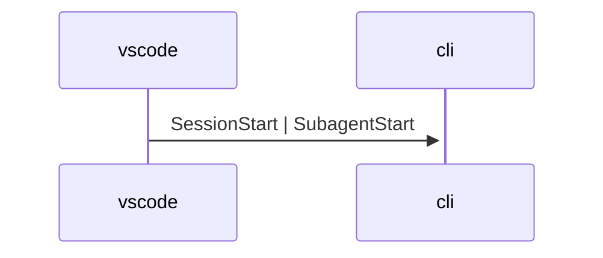

# Summary

Repo CLI implementation and tests for the Go-based `semio-repo` tooling entrypoint.

# 💯Requirements

## hooks

### git

#### commit

##### starting

##### ended

### agent

#### started

##### vscode-chat

##### windsurf-chat

##### cursor-chat

##### claude-code

##### droid

#### ended

##### vscode-chat

##### windsurf-chat

##### cursor-chat

##### claude-code

##### droid

#### prompt

##### submit

###### vscode-chat

###### windsurf-chat

###### cursor-chat

###### claude-code

###### droid

#### compacting

##### vscode-chat

##### windsurf-chat

##### cursor-chat

##### claude-code

##### droid

#### tool

##### starting

###### vscode-chat

###### windsurf-chat

###### cursor-chat

###### claude-code

###### droid

##### ended

###### vscode-chat

###### windsurf-chat

###### cursor-chat

###### claude-code

###### droid

##### plan

###### updating

####### vscode-chat

####### windsurf-chat

####### cursor-chat

####### claude-code

####### droid
