# 🧾 Specification

## 🕸️ Systems

### Kits, Families, Designs, Types

### Types, Representations, Ports, Connectors

### Designs, Pieces, Connections, Layers, Groups

### Stats, Attributes,

## 🛠️ Mechanisms

### SQL

```mermaid
erDiagram

    semio {
        string release PK
        string created_by_app
        string app_version
        datetime created_at
    }

    attributes {
        int id PK
        string key
        string value
        string definition
        int representation_id FK
        int connector_id FK
        int type_id FK
        int piece_id FK
        int connection_id FK
        int design_id FK
        int kit_id FK
    }

    files {
        int id PK
        string path
        string remote_url
        string description
        int kit_id FK
    }

    qualities {
        int id PK
        string key
        string name
        string description
        string uri
        int kind
        boolean can_scale
        string default_si_unit
        string default_imperial_unit
        float min
        boolean is_min_excluded
        float max
        boolean is_max_excluded
        float default_value
        string formula
        datetime created_at
        datetime updated_at
        int kit_id FK
    }

    benchmarks {
        int id PK
        string name
        string icon
        float min
        boolean is_min_excluded
        float max
        boolean is_max_excluded
        int quality_id FK
    }

    props {
        int id PK
        string key
        string value
        string unit
        datetime created_at
        datetime updated_at
        int representation_id FK
        int connector_id FK
        int type_id FK
        int piece_id FK
        int connection_id FK
        int design_id FK
    }

    stats {
        int id PK
        string key
        string unit
        float min
        boolean is_min_excluded
        float max
        boolean is_max_excluded
        datetime created_at
        datetime updated_at
        int design_id FK
    }

    tags {
        int id PK
        string id
        string name
        string description
        string icon
        int kit_id FK
    }

    concepts {
        int id PK
        string id
        string name
        string description
        string icon
        int kit_id FK
    }

    representations {
        int id PK
        string id
        string name
        string description
        int file_id FK
        int type_id FK
    }

    planes {
        int id PK
        float origin_x
        float origin_y
        float origin_z
        float x_axis_x
        float x_axis_y
        float x_axis_z
        float y_axis_x
        float y_axis_y
        float y_axis_z
    }

    locations {
        int id PK
    }

    compatible_ports {
        int id PK
        string name
        int order
        int connector_id FK
    }

    connectors {
        int id PK
        string connector_id
        string description
        string port
        boolean is_mandatory
        float point_x
        float point_y
        float point_z
        float direction_x
        float direction_y
        float direction_z
        float t
        int type_id FK
        int design_id FK
    }

    authors {
        int id PK
        string name
        string email
        int kit_id FK
    }

    author_artifact {
        int author_id PK
        int rank
        int type_id PK
        int design_id PK
    }

    types {
        int id PK
        string name
        boolean is_virtual
        boolean can_scale
        boolean can_mirror
        string unit
        float available_count
        int location_id FK
        string icon
        string image_url
        string description
        datetime created_at
        datetime updated_at
        int kit_id FK
    }

    pieces {
        int id PK
        string piece_id
        int type_id FK
        int design_id FK
        int plane_id FK
        int center_id FK
        float scale
        int mirror_plane_id FK
        boolean is_hidden
        boolean is_locked
        string color
        string description
        int parent_piece_id FK
    }

    connections {
        int id PK
        int connected_piece_id FK
        int connected_design_piece_id FK
        int connected_connector_id FK
        int connecting_piece_id FK
        int connecting_design_piece_id FK
        int connecting_connector_id FK
        string description
        float gap
        float shift
        float rise
        float rotation
        float turn
        float tilt
        float u
        float v
        int design_id FK
    }

    layers {
        int id PK
        string name
        string description
        string color
        int design_id FK
    }

    groups {
        int id PK
        string name
        string description
        string color
        int design_id FK
    }

    group_pieces {
        int group_id PK
        int piece_id PK
    }

    designs {
        int id PK
        string name
        boolean can_scale
        boolean can_mirror
        string unit
        int location_id FK
        string icon
        string image_url
        string description
        datetime created_at
        datetime updated_at
        int kit_id FK
    }

    kits {
        int id PK
        string name
        string version
        string remote_url
        string homepage_url
        string license
        string icon
        string image_url
        string description
        datetime created_at
        datetime updated_at
    }

    representation_tags {
        int representation_id PK
        int tag_id PK
        int order
    }

    type_concepts {
        int type_id PK
        int concept_id PK
        int order
    }

    design_concepts {
        int design_id PK
        int concept_id PK
        int order
    }

    kit_concepts {
        int kit_id PK
        int concept_id PK
        int order
    }

    %% Relationships from source
    authors ||--o{ author_artifact : links
    types ||--o{ author_artifact : references
    designs ||--o{ author_artifact : references

    representations ||--o{ representation_tags : links
    tags ||--o{ representation_tags : references

    representations ||--o{ attributes : has
    files ||--o{ representations : might_reference

    connectors ||--o{ compatible_ports : has
    connectors ||--o{ attributes : has
    connectors ||--o{ props : has

    types ||--o{ locations : has

    types ||--o{ type_concepts : links
    concepts ||--o{ type_concepts : references

    designs ||--o{ design_concepts : links
    concepts ||--o{ design_concepts : references

    kits ||--o{ kit_concepts : links
    concepts ||--o{ kit_concepts : references

    types ||--o{ representations : has
    types ||--o{ connectors : has
    types ||--o{ authors : has
    types ||--o{ attributes : has
    types ||--o{ concepts : has
    types }o--o{ authors : has

    pieces ||--o{ planes : has
    pieces ||--o{ attributes : has

    pieces ||--o{ group_pieces : links
    groups ||--o{ group_pieces : references

    connections ||--o{ attributes : has
    pieces }o--o{ connections : connected
    pieces }o--o{ connections : connecting
    connectors }o--o{ connections : connected
    connectors }o--o{ connections : connecting

    designs ||--o{ pieces : has
    designs ||--o{ connections : has
    designs ||--o{ stats : has
    designs ||--o{ props : has
    designs ||--o{ layers : has
    designs ||--o{ groups : has
    designs ||--o{ locations : has
    designs ||--o{ concepts : has
    designs ||--o{ attributes : has
    designs }o--o{ authors : has

    kits ||--o{ types : has
    kits ||--o{ designs : has
    kits ||--o{ qualities : has
    kits ||--o{ files : has
    kits ||--o{ authors : has
    kits ||--o{ tags : has
    kits ||--o{ concepts : has
    kits ||--o{ attributes : has

    %% FK-implied relationship not explicitly listed in the source
    qualities ||--o{ benchmarks : has
```



### Interface

REST and GraphQL-friendly JSON:

```
kit : !Kit{
    id: !String
    description !String
    name : !String
    types : *Type[
        name : !String
        representations : +Representation[
            id : !String
            name : ?String
            tags : *TagId[] // references to kit-level tags
            file : !FileId // reference to kit-level file
            description : ?String
            attributes : *Attribute[]
        ]
        connectors : +Connector[
            id : !String // empty is default
            point : !Point{
                x : !Float
                y : !Float
                z : !Float
            }
            direction : !Vector{
                x : !Float
                y : !Float
                z : !Float
            }
            t : !Float // [0,1[ for diagram ring position
            mandatory : ?Boolean // default false
            port : ?PortId
            compatiblePorts : *PortId[] // Empty list means compatible with all
            description : ?String
            attributes : *Attribute[]
        ]
        props : *Prop[
            key : !String // quality key
            value : !String // number | text
            unit : ?String
            attributes : *Attribute[]
        ]
        isVirtual : ?Boolean // default false
        canScale : ?Boolean // default true
        canMirror : ?Boolean // default true
        unit : !String // e.g., mm, cm, m
        availableCount : !Float // default is +infinity
        location : ?Location{
            longitude : ?Float
            latitude : ?Float
            altitude : ?Float
        }
        authors: *AuthorId[
            email : !String
        ]
        concepts : *ConceptId[] // references to kit-level concepts
        icon : ?String // emoji | logogram | url
        image : ?String // url
        description : ?String
        attributes : *Attribute[]
        created : !String // date
        updated : !String // date
    ]
    tags : *Tag[
        id : !String
        name : !String
        description : ?String
        icon : ?String
        attributes : *Attribute[]
    ]
    concepts : *Concept[
        id : !String
        name : !String
        description : ?String
        icon : ?String
        attributes : *Attribute[]
    ]
    files : *File[
        id : !String
        path : !String
        remoteUrl : ?String
        description : ?String
        attributes : *Attribute[]
    ]
    designs : *Design[
        name : !String
        pieces : +Piece[
            id : !String
            type : !TypeId{
                name : !String
            }
            design : ?DesignId{
                name : !String
            }
            plane : ?Plane{
                origin : !Point{
                    x : !Float
                    y : !Float
                    z : !Float
                }
                xAxis : !Vector{
                    x : !Float
                    y : !Float
                    z : !Float
                }
                yAxis : !Vector{
                    x : !Float
                    y : !Float
                    z : !Float
                }
            }
            center : ?Coordinate{
                u : !Float
                v : !Float
            }
            scale : ?Float // default 1.0
            mirrorPlane : ?Plane{
                origin : !Point{
                    x : !Float
                    y : !Float
                    z : !Float
                }
                xAxis : !Vector{
                    x : !Float
                    y : !Float
                    z : !Float
                }
                yAxis : !Vector{
                    x : !Float
                    y : !Float
                    z : !Float
                }
            }
            props : *Prop[
                key : !String // quality key
                value : !String // number | text
                unit : ?String
                attributes : *Attribute[]
            ]
            hidden : ?Boolean // default false
            locked : ?Boolean // default false
            color : ?String // hex color
            description : ?String
            attributes : *Attribute[]
        ]
        connections : +Connection[
            connected : !Side{
                piece : !PieceId{ id : !String }
                designPiece : ?PieceId{ id : !String }
                connector : !ConnectorId{ id : !String }
            }
            connecting : !Side{
                piece : !PieceId{ id : !String }
                designPiece : ?PieceId{ id : !String }
                connector : !ConnectorId{ id : !String }
            }
            gap : ?Float
            shift : ?Float
            rise : ?Float
            rotation : ?Float // degrees
            turn : ?Float // degrees
            tilt : ?Float // degrees
            x : ?Float // diagram offset x
            y : ?Float // diagram offset y
            description : ?String
            attributes : *Attribute[]
        ]
        stats : *Stat[
            key : !String // quality key
            unit : ?String
            min : ?Float
            minExcluded : ?Boolean // default false
            max : ?Float
            maxExcluded : ?Boolean // default false
        ]
        props : *Prop[
            key : !String // quality key
            value : !String // number | text
            unit : ?String
            attributes : *Attribute[]
        ]
        layers : *Layer[
            path : !String
            isHidden : ?Boolean // default false
            isLocked : ?Boolean // default false
            color : ?String // hex color
            description : ?String
            attributes : *Attribute[]
        ]
        activeLayer : ?Layer{
            path : !String
        }
        groups : *Group[
            pieces : *PieceId[
                id : !String
            ]
            color : ?String // hex color
            name : ?String
            description : ?String
            attributes : *Attribute[]
        ]
        canScale : ?Boolean // default true
        canMirror : ?Boolean // default true
        unit : !String // e.g., mm, cm, m
        location : ?Location{
            longitude : ?Float
            latitude : ?Float
            altitude : ?Float
        }
        authors: *AuthorId[
            email : !String
        ]
        concepts : *ConceptId[] // references to kit-level concepts
        icon : ?String // emoji | logogram | url
        image : ?String // url
        description : ?String
        attributes : *Attribute[]
        created : !String // date
        updated : !String // date
    ]
    qualities : *Quality[
        key : !String
        name : !String
        kind : !QualityKind // enum: General, Design, Type, Piece, Connection, Connector
        default : ?Float
        formula : ?String
        defaultSiUnit : ?String
        defaultImperialUnit : ?String
        min : ?Float
        minExcluded : ?Boolean // default true
        max : ?Float
        maxExcluded : ?Boolean // default true
        canScale : ?Boolean // default false
        benchmarks : *Benchmark[
            name : !String
            icon : ?String
            min : ?Float
            minExcluded : ?Boolean // default false
            max : ?Float
            maxExcluded : ?Boolean // default false
            definition : ?String // text | uri
            attributes : *Attribute[]
        ]
        definition : ?String // text | uri
        attributes : *Attribute[]
    ]
    authors : *Author[
        name : !String
        email : !String
        attributes : *Attribute[]
    ]
    remoteUrl : ?String // url for remote fetching
    homepageUrl : ?String // url
    license : ?String // spdx id | url
    icon : ?String // emoji | logogram | url
    image : ?String // url
    description : ?String
    attributes : *Attribute[
        key : !String
        value : ?String // No value means true
        definition : ?String // text | uri
    ]
    created : !String // date
    updated : !String // date
}
```

### InMemory

```mermaid
classDiagram
direction TB

class Store {
  <<abstract>>
  +toIdDto() IdDto
  +toInputDto() InputDto
  +toMetadataDto() MetadataDto
  +toShallowDto() ShallowDto
  +toFullDto() FullDto
}

class Dto {
  <<abstract>>
  +validate() Boolean
}

class IdDto {
  +id: String
}

class InputDto
class MetadataDto {
  <<abstract>>
}
class ShallowDto {
  <<abstract>>
}
class FullDto {
  <<abstract>>
}

class SideDto {
  +piece: PieceIdDto
  +designPiece: PieceIdDto
  +connector: ConnectorIdDto
}

class Coordinate {
  +u: Float
  +v: Float
}

class Point {
  +x: Float
  +y: Float
  +z: Float
}

class Vector {
  +x: Float
  +y: Float
  +z: Float
}

class Plane {
  +origin: Point
  +xAxis: Vector
  +yAxis: Vector
}

class AttributeStore {
  +AttributeStore(dto: AttributeIdDto)
  +AttributeStore(dto: AttributeInputDto)
  +AttributeStore(dto: AttributeMetadataDto)
  +AttributeStore(dto: AttributeShallowDto)
  +AttributeStore(dto: AttributeFullDto)
  +toIdDto() AttributeIdDto
  +toInputDto() AttributeInputDto
  +toMetadataDto() AttributeMetadataDto
  +toShallowDto() AttributeShallowDto
  +toFullDto() AttributeFullDto
}

class AuthorStore {
  +AuthorStore(dto: AuthorIdDto)
  +AuthorStore(dto: AuthorInputDto)
  +AuthorStore(dto: AuthorMetadataDto)
  +AuthorStore(dto: AuthorShallowDto)
  +AuthorStore(dto: AuthorFullDto)
  +toIdDto() AuthorIdDto
  +toInputDto() AuthorInputDto
  +toMetadataDto() AuthorMetadataDto
  +toShallowDto() AuthorShallowDto
  +toFullDto() AuthorFullDto
}

class LocationStore {
  +LocationStore(dto: LocationIdDto)
  +LocationStore(dto: LocationInputDto)
  +LocationStore(dto: LocationMetadataDto)
  +LocationStore(dto: LocationShallowDto)
  +LocationStore(dto: LocationFullDto)
  +toIdDto() LocationIdDto
  +toInputDto() LocationInputDto
  +toMetadataDto() LocationMetadataDto
  +toShallowDto() LocationShallowDto
  +toFullDto() LocationFullDto
}

class FolderStore {
  +FolderStore(dto: FolderIdDto)
  +FolderStore(dto: FolderInputDto)
  +FolderStore(dto: FolderMetadataDto)
  +FolderStore(dto: FolderShallowDto)
  +FolderStore(dto: FolderFullDto)
  +toIdDto() FolderIdDto
  +toInputDto() FolderInputDto
  +toMetadataDto() FolderMetadataDto
  +toShallowDto() FolderShallowDto
  +toFullDto() FolderFullDto
}

class FileStore {
  +FileStore(dto: FileIdDto)
  +FileStore(dto: FileInputDto)
  +FileStore(dto: FileMetadataDto)
  +FileStore(dto: FileShallowDto)
  +FileStore(dto: FileFullDto)
  +toIdDto() FileIdDto
  +toInputDto() FileInputDto
  +toMetadataDto() FileMetadataDto
  +toShallowDto() FileShallowDto
  +toFullDto() FileFullDto
}

class ConceptStore {
  +ConceptStore(dto: ConceptIdDto)
  +ConceptStore(dto: ConceptInputDto)
  +ConceptStore(dto: ConceptMetadataDto)
  +ConceptStore(dto: ConceptShallowDto)
  +ConceptStore(dto: ConceptFullDto)
  +toIdDto() ConceptIdDto
  +toInputDto() ConceptInputDto
  +toMetadataDto() ConceptMetadataDto
  +toShallowDto() ConceptShallowDto
  +toFullDto() ConceptFullDto
}

class QualityStore {
  +QualityStore(dto: QualityIdDto)
  +QualityStore(dto: QualityInputDto)
  +QualityStore(dto: QualityMetadataDto)
  +QualityStore(dto: QualityShallowDto)
  +QualityStore(dto: QualityFullDto)
  +toIdDto() QualityIdDto
  +toInputDto() QualityInputDto
  +toMetadataDto() QualityMetadataDto
  +toShallowDto() QualityShallowDto
  +toFullDto() QualityFullDto
}

class BenchmarkStore {
  +BenchmarkStore(dto: BenchmarkIdDto)
  +BenchmarkStore(dto: BenchmarkInputDto)
  +BenchmarkStore(dto: BenchmarkMetadataDto)
  +BenchmarkStore(dto: BenchmarkShallowDto)
  +BenchmarkStore(dto: BenchmarkFullDto)
  +toIdDto() BenchmarkIdDto
  +toInputDto() BenchmarkInputDto
  +toMetadataDto() BenchmarkMetadataDto
  +toShallowDto() BenchmarkShallowDto
  +toFullDto() BenchmarkFullDto
}

class StatStore {
  +StatStore(dto: StatIdDto)
  +StatStore(dto: StatInputDto)
  +StatStore(dto: StatMetadataDto)
  +StatStore(dto: StatShallowDto)
  +StatStore(dto: StatFullDto)
  +toIdDto() StatIdDto
  +toInputDto() StatInputDto
  +toMetadataDto() StatMetadataDto
  +toShallowDto() StatShallowDto
  +toFullDto() StatFullDto
}

class TagStore {
  +TagStore(dto: TagIdDto)
  +TagStore(dto: TagInputDto)
  +TagStore(dto: TagMetadataDto)
  +TagStore(dto: TagShallowDto)
  +TagStore(dto: TagFullDto)
  +toIdDto() TagIdDto
  +toInputDto() TagInputDto
  +toMetadataDto() TagMetadataDto
  +toShallowDto() TagShallowDto
  +toFullDto() TagFullDto
}

class RepresentationStore {
  +RepresentationStore(dto: RepresentationIdDto)
  +RepresentationStore(dto: RepresentationInputDto)
  +RepresentationStore(dto: RepresentationMetadataDto)
  +RepresentationStore(dto: RepresentationShallowDto)
  +RepresentationStore(dto: RepresentationFullDto)
  +toIdDto() RepresentationIdDto
  +toInputDto() RepresentationInputDto
  +toMetadataDto() RepresentationMetadataDto
  +toShallowDto() RepresentationShallowDto
  +toFullDto() RepresentationFullDto
}

class PortStore {
  +PortStore(dto: PortIdDto)
  +PortStore(dto: PortInputDto)
  +PortStore(dto: PortMetadataDto)
  +PortStore(dto: PortShallowDto)
  +PortStore(dto: PortFullDto)
  +toIdDto() PortIdDto
  +toInputDto() PortInputDto
  +toMetadataDto() PortMetadataDto
  +toShallowDto() PortShallowDto
  +toFullDto() PortFullDto
}

class ConnectorStore {
  +ConnectorStore(dto: ConnectorIdDto)
  +ConnectorStore(dto: ConnectorInputDto)
  +ConnectorStore(dto: ConnectorMetadataDto)
  +ConnectorStore(dto: ConnectorShallowDto)
  +ConnectorStore(dto: ConnectorFullDto)
  +toIdDto() ConnectorIdDto
  +toInputDto() ConnectorInputDto
  +toMetadataDto() ConnectorMetadataDto
  +toShallowDto() ConnectorShallowDto
  +toFullDto() ConnectorFullDto
}

class PropStore {
  +PropStore(dto: PropIdDto)
  +PropStore(dto: PropInputDto)
  +PropStore(dto: PropMetadataDto)
  +PropStore(dto: PropShallowDto)
  +PropStore(dto: PropFullDto)
  +toIdDto() PropIdDto
  +toInputDto() PropInputDto
  +toMetadataDto() PropMetadataDto
  +toShallowDto() PropShallowDto
  +toFullDto() PropFullDto
}

class LayerStore {
  +LayerStore(dto: LayerIdDto)
  +LayerStore(dto: LayerInputDto)
  +LayerStore(dto: LayerMetadataDto)
  +LayerStore(dto: LayerShallowDto)
  +LayerStore(dto: LayerFullDto)
  +toIdDto() LayerIdDto
  +toInputDto() LayerInputDto
  +toMetadataDto() LayerMetadataDto
  +toShallowDto() LayerShallowDto
  +toFullDto() LayerFullDto
}

class GroupStore {
  +GroupStore(dto: GroupIdDto)
  +GroupStore(dto: GroupInputDto)
  +GroupStore(dto: GroupMetadataDto)
  +GroupStore(dto: GroupShallowDto)
  +GroupStore(dto: GroupFullDto)
  +toIdDto() GroupIdDto
  +toInputDto() GroupInputDto
  +toMetadataDto() GroupMetadataDto
  +toShallowDto() GroupShallowDto
  +toFullDto() GroupFullDto
}

class PieceStore {
  +PieceStore(dto: PieceIdDto)
  +PieceStore(dto: PieceInputDto)
  +PieceStore(dto: PieceMetadataDto)
  +PieceStore(dto: PieceShallowDto)
  +PieceStore(dto: PieceFullDto)
  +toIdDto() PieceIdDto
  +toInputDto() PieceInputDto
  +toMetadataDto() PieceMetadataDto
  +toShallowDto() PieceShallowDto
  +toFullDto() PieceFullDto
}

class ConnectionStore {
  +ConnectionStore(dto: ConnectionIdDto)
  +ConnectionStore(dto: ConnectionInputDto)
  +ConnectionStore(dto: ConnectionMetadataDto)
  +ConnectionStore(dto: ConnectionShallowDto)
  +ConnectionStore(dto: ConnectionFullDto)
  +toIdDto() ConnectionIdDto
  +toInputDto() ConnectionInputDto
  +toMetadataDto() ConnectionMetadataDto
  +toShallowDto() ConnectionShallowDto
  +toFullDto() ConnectionFullDto
}

class TypeStore {
  +TypeStore(dto: TypeIdDto)
  +TypeStore(dto: TypeInputDto)
  +TypeStore(dto: TypeMetadataDto)
  +TypeStore(dto: TypeShallowDto)
  +TypeStore(dto: TypeFullDto)
  +toIdDto() TypeIdDto
  +toInputDto() TypeInputDto
  +toMetadataDto() TypeMetadataDto
  +toShallowDto() TypeShallowDto
  +toFullDto() TypeFullDto
}

class DesignStore {
  +DesignStore(dto: DesignIdDto)
  +DesignStore(dto: DesignInputDto)
  +DesignStore(dto: DesignMetadataDto)
  +DesignStore(dto: DesignShallowDto)
  +DesignStore(dto: DesignFullDto)
  +toIdDto() DesignIdDto
  +toInputDto() DesignInputDto
  +toMetadataDto() DesignMetadataDto
  +toShallowDto() DesignShallowDto
  +toFullDto() DesignFullDto
}

class KitStore {
  +KitStore(dto: KitIdDto)
  +KitStore(dto: KitInputDto)
  +KitStore(dto: KitMetadataDto)
  +KitStore(dto: KitShallowDto)
  +KitStore(dto: KitFullDto)
  +toIdDto() KitIdDto
  +toInputDto() KitInputDto
  +toMetadataDto() KitMetadataDto
  +toShallowDto() KitShallowDto
  +toFullDto() KitFullDto
}

class AttributeIdDto {
  +id: String
}
class AttributeInputDto {
  +id: String
  +key: String
  +value: String
  +definition: String
}
class AttributeMetadataDto {
  <<abstract>>
  +id: String
  +key: String
  +value: String
  +definition: String
}
class AttributeShallowDto {
  <<abstract>>
  +id: String
  +key: String
  +value: String
  +definition: String
}
class AttributeFullDto {
  <<abstract>>
  +id: String
  +key: String
  +value: String
  +definition: String
}

class AuthorIdDto {
  +id: String
}
class AuthorInputDto {
  +id: String
  +name: String
  +email: String
  +attributes: AttributeInputDto[]
}
class AuthorMetadataDto {
  <<abstract>>
  +id: String
  +name: String
  +email: String
}
class AuthorShallowDto {
  <<abstract>>
  +id: String
  +name: String
  +email: String
  +attributes: AttributeMetadataDto[]
}
class AuthorFullDto {
  <<abstract>>
  +id: String
  +name: String
  +email: String
  +attributes: AttributeFullDto[]
}

class LocationIdDto {
  +id: String
}
class LocationInputDto {
  +id: String
  +longitude: Float
  +latitude: Float
  +altitude: Float
  +attributes: AttributeInputDto[]
}
class LocationMetadataDto {
  <<abstract>>
  +id: String
  +longitude: Float
  +latitude: Float
  +altitude: Float
}
class LocationShallowDto {
  <<abstract>>
  +id: String
  +longitude: Float
  +latitude: Float
  +altitude: Float
  +attributes: AttributeMetadataDto[]
}
class LocationFullDto {
  <<abstract>>
  +id: String
  +longitude: Float
  +latitude: Float
  +altitude: Float
  +attributes: AttributeFullDto[]
}

class FolderIdDto {
  +id: String
}
class FolderInputDto {
  +id: String
  +name: String
  +parent: FolderIdDto
  +description: String
  +attributes: AttributeInputDto[]
  +createdAt: DateTime
  +createdBy: AuthorIdDto
  +modifiedAt: DateTime
  +modifiedBy: AuthorIdDto
}
class FolderMetadataDto {
  <<abstract>>
  +id: String
  +name: String
  +parent: FolderIdDto
  +description: String
  +createdAt: DateTime
  +createdBy: AuthorIdDto
  +modifiedAt: DateTime
  +modifiedBy: AuthorIdDto
}
class FolderShallowDto {
  <<abstract>>
  +id: String
  +name: String
  +parent: FolderIdDto
  +description: String
  +attributes: AttributeMetadataDto[]
  +createdAt: DateTime
  +createdBy: AuthorMetadataDto
  +modifiedAt: DateTime
  +modifiedBy: AuthorMetadataDto
}
class FolderFullDto {
  <<abstract>>
  +id: String
  +name: String
  +parent: FolderFullDto
  +description: String
  +attributes: AttributeFullDto[]
  +createdAt: DateTime
  +createdBy: AuthorFullDto
  +modifiedAt: DateTime
  +modifiedBy: AuthorFullDto
}

class FileIdDto {
  +id: String
}
class FileInputDto {
  +id: String
  +name: String
  +remote: String
  +folder: FolderIdDto
  +size: Float
  +hash: String
  +blob: String
  +createdAt: DateTime
  +createdBy: AuthorIdDto
  +modifiedAt: DateTime
  +modifiedBy: AuthorIdDto
}
class FileMetadataDto {
  <<abstract>>
  +id: String
  +name: String
  +remote: String
  +folder: FolderIdDto
  +size: Float
  +hash: String
  +createdAt: DateTime
  +createdBy: AuthorIdDto
  +modifiedAt: DateTime
  +modifiedBy: AuthorIdDto
}
class FileShallowDto {
  <<abstract>>
  +id: String
  +name: String
  +remote: String
  +folder: FolderMetadataDto
  +size: Float
  +hash: String
  +createdAt: DateTime
  +createdBy: AuthorMetadataDto
  +modifiedAt: DateTime
  +modifiedBy: AuthorMetadataDto
}
class FileFullDto {
  <<abstract>>
  +id: String
  +name: String
  +remote: String
  +folder: FolderFullDto
  +size: Float
  +hash: String
  +blob: String
  +mime: String
  +createdAt: DateTime
  +createdBy: AuthorFullDto
  +modifiedAt: DateTime
  +modifiedBy: AuthorFullDto
}

class ConceptIdDto {
  +id: String
}
class ConceptInputDto {
  +id: String
  +name: String
  +description: String
  +icon: String
  +attributes: AttributeInputDto[]
}
class ConceptMetadataDto {
  <<abstract>>
  +id: String
  +name: String
  +description: String
  +icon: String
}
class ConceptShallowDto {
  <<abstract>>
  +id: String
  +name: String
  +description: String
  +icon: String
  +attributes: AttributeMetadataDto[]
}
class ConceptFullDto {
  <<abstract>>
  +id: String
  +name: String
  +description: String
  +icon: String
  +attributes: AttributeFullDto[]
}

class QualityIdDto {
  +id: String
}
class QualityInputDto {
  +id: String
  +key: String
  +name: String
  +description: String
  +uri: String
  +kind: Int
  +folder: String
  +canScale: Boolean
  +defaultSiUnit: String
  +defaultImperialUnit: String
  +min: Float
  +isMinExcluded: Boolean
  +max: Float
  +isMaxExcluded: Boolean
  +defaultValue: Float
  +formula: String
  +icon: String
  +image: String
  +unit: String
  +benchmarks: BenchmarkInputDto[]
  +attributes: AttributeInputDto[]
}
class QualityMetadataDto {
  <<abstract>>
  +id: String
  +key: String
  +name: String
  +description: String
  +uri: String
  +kind: Int
  +folder: String
  +canScale: Boolean
  +defaultSiUnit: String
  +defaultImperialUnit: String
  +min: Float
  +isMinExcluded: Boolean
  +max: Float
  +isMaxExcluded: Boolean
  +defaultValue: Float
  +formula: String
  +icon: String
  +image: String
  +unit: String
}
class QualityShallowDto {
  <<abstract>>
  +id: String
  +key: String
  +name: String
  +description: String
  +uri: String
  +kind: Int
  +folder: String
  +canScale: Boolean
  +defaultSiUnit: String
  +defaultImperialUnit: String
  +min: Float
  +isMinExcluded: Boolean
  +max: Float
  +isMaxExcluded: Boolean
  +defaultValue: Float
  +formula: String
  +icon: String
  +image: String
  +unit: String
  +benchmarks: BenchmarkMetadataDto[]
  +attributes: AttributeMetadataDto[]
}
class QualityFullDto {
  <<abstract>>
  +id: String
  +key: String
  +name: String
  +description: String
  +uri: String
  +kind: Int
  +folder: String
  +canScale: Boolean
  +defaultSiUnit: String
  +defaultImperialUnit: String
  +min: Float
  +isMinExcluded: Boolean
  +max: Float
  +isMaxExcluded: Boolean
  +defaultValue: Float
  +formula: String
  +icon: String
  +image: String
  +unit: String
  +benchmarks: BenchmarkFullDto[]
  +attributes: AttributeFullDto[]
}

class BenchmarkIdDto {
  +id: String
}
class BenchmarkInputDto {
  +id: String
  +name: String
  +icon: String
  +min: Float
  +minExcluded: Boolean
  +max: Float
  +maxExcluded: Boolean
  +attributes: AttributeInputDto[]
}
class BenchmarkMetadataDto {
  <<abstract>>
  +id: String
  +name: String
  +icon: String
  +min: Float
  +minExcluded: Boolean
  +max: Float
  +maxExcluded: Boolean
}
class BenchmarkShallowDto {
  <<abstract>>
  +id: String
  +name: String
  +icon: String
  +min: Float
  +minExcluded: Boolean
  +max: Float
  +maxExcluded: Boolean
  +attributes: AttributeMetadataDto[]
}
class BenchmarkFullDto {
  <<abstract>>
  +id: String
  +name: String
  +icon: String
  +min: Float
  +minExcluded: Boolean
  +max: Float
  +maxExcluded: Boolean
  +attributes: AttributeFullDto[]
}

class StatIdDto {
  +id: String
}
class StatInputDto {
  +id: String
  +quality: QualityIdDto
  +unit: String
  +min: Float
  +minExcluded: Boolean
  +max: Float
  +maxExcluded: Boolean
}
class StatMetadataDto {
  <<abstract>>
  +id: String
  +quality: QualityIdDto
  +unit: String
  +min: Float
  +minExcluded: Boolean
  +max: Float
  +maxExcluded: Boolean
}
class StatShallowDto {
  <<abstract>>
  +id: String
  +quality: QualityMetadataDto
  +unit: String
  +min: Float
  +minExcluded: Boolean
  +max: Float
  +maxExcluded: Boolean
}
class StatFullDto {
  <<abstract>>
  +id: String
  +quality: QualityFullDto
  +unit: String
  +min: Float
  +minExcluded: Boolean
  +max: Float
  +maxExcluded: Boolean
}

class TagIdDto {
  +id: String
}
class TagInputDto {
  +id: String
  +name: String
  +description: String
  +icon: String
  +attributes: AttributeInputDto[]
}
class TagMetadataDto {
  <<abstract>>
  +id: String
  +name: String
  +description: String
  +icon: String
}
class TagShallowDto {
  <<abstract>>
  +id: String
  +name: String
  +description: String
  +icon: String
  +attributes: AttributeMetadataDto[]
}
class TagFullDto {
  <<abstract>>
  +id: String
  +name: String
  +description: String
  +icon: String
  +attributes: AttributeFullDto[]
}

class RepresentationIdDto {
  +id: String
}
class RepresentationInputDto {
  +id: String
  +name: String
  +tags: TagIdDto[]
  +file: FileIdDto
  +description: String
  +attributes: AttributeInputDto[]
}
class RepresentationMetadataDto {
  <<abstract>>
  +id: String
  +name: String
  +tags: TagIdDto[]
  +file: FileIdDto
  +description: String
}
class RepresentationShallowDto {
  <<abstract>>
  +id: String
  +name: String
  +tags: TagMetadataDto[]
  +file: FileMetadataDto
  +description: String
  +attributes: AttributeMetadataDto[]
}
class RepresentationFullDto {
  <<abstract>>
  +id: String
  +name: String
  +tags: TagFullDto[]
  +file: FileFullDto
  +description: String
  +attributes: AttributeFullDto[]
  +fileHash: String
  +fileMime: String
}

class PortIdDto {
  +id: String
}
class PortInputDto {
  +id: String
  +name: String
  +description: String
  +icon: String
  +compatiblePorts: PortIdDto[]
  +attributes: AttributeInputDto[]
}
class PortMetadataDto {
  <<abstract>>
  +id: String
  +name: String
  +description: String
  +icon: String
  +maxChildren: Int
  +compatiblePorts: PortIdDto[]
}
class PortShallowDto {
  <<abstract>>
  +id: String
  +name: String
  +description: String
  +icon: String
  +maxChildren: Int
  +compatiblePorts: PortMetadataDto[]
  +attributes: AttributeMetadataDto[]
}
class PortFullDto {
  <<abstract>>
  +id: String
  +name: String
  +description: String
  +icon: String
  +maxChildren: Int
  +compatiblePorts: PortFullDto[]
  +attributes: AttributeFullDto[]
}

class ConnectorIdDto {
  +id: String
}
class ConnectorInputDto {
  +id: String
  +name: String
  +t: Float
  +point: Point
  +direction: Vector
  +description: String
  +port: PortIdDto
  +mandatory: Boolean
  +props: PropInputDto[]
  +attributes: AttributeInputDto[]
}
class ConnectorMetadataDto {
  <<abstract>>
  +id: String
  +name: String
  +t: Float
  +point: Point
  +direction: Vector
  +description: String
  +port: PortIdDto
  +mandatory: Boolean
  +maxChildren: Int
}
class ConnectorShallowDto {
  <<abstract>>
  +id: String
  +name: String
  +t: Float
  +point: Point
  +direction: Vector
  +description: String
  +port: PortMetadataDto
  +mandatory: Boolean
  +maxChildren: Int
  +props: PropMetadataDto[]
  +attributes: AttributeMetadataDto[]
}
class ConnectorFullDto {
  <<abstract>>
  +id: String
  +name: String
  +t: Float
  +point: Point
  +direction: Vector
  +description: String
  +port: PortFullDto
  +mandatory: Boolean
  +maxChildren: Int
  +props: PropFullDto[]
  +attributes: AttributeFullDto[]
}

class PropIdDto {
  +id: String
}
class PropInputDto {
  +id: String
  +quality: QualityIdDto
  +value: String
  +unit: String
  +attributes: AttributeInputDto[]
}
class PropMetadataDto {
  <<abstract>>
  +id: String
  +quality: QualityIdDto
  +value: String
  +unit: String
}
class PropShallowDto {
  <<abstract>>
  +id: String
  +quality: QualityMetadataDto
  +value: String
  +unit: String
  +attributes: AttributeMetadataDto[]
}
class PropFullDto {
  <<abstract>>
  +id: String
  +quality: QualityFullDto
  +value: String
  +unit: String
  +attributes: AttributeFullDto[]
}

class LayerIdDto {
  +id: String
}
class LayerInputDto {
  +id: String
  +path: String
  +isHidden: Boolean
  +isLocked: Boolean
  +color: String
  +description: String
  +attributes: AttributeInputDto[]
}
class LayerMetadataDto {
  <<abstract>>
  +id: String
  +path: String
  +isHidden: Boolean
  +isLocked: Boolean
  +color: String
  +description: String
}
class LayerShallowDto {
  <<abstract>>
  +id: String
  +path: String
  +isHidden: Boolean
  +isLocked: Boolean
  +color: String
  +description: String
  +attributes: AttributeMetadataDto[]
}
class LayerFullDto {
  <<abstract>>
  +id: String
  +path: String
  +isHidden: Boolean
  +isLocked: Boolean
  +color: String
  +description: String
  +attributes: AttributeFullDto[]
}

class GroupIdDto {
  +id: String
}
class GroupInputDto {
  +id: String
  +pieces: PieceIdDto[]
  +color: String
  +name: String
  +description: String
  +attributes: AttributeInputDto[]
}
class GroupMetadataDto {
  <<abstract>>
  +id: String
  +pieces: PieceIdDto[]
  +color: String
  +name: String
  +description: String
}
class GroupShallowDto {
  <<abstract>>
  +id: String
  +pieces: PieceMetadataDto[]
  +color: String
  +name: String
  +description: String
  +attributes: AttributeMetadataDto[]
}
class GroupFullDto {
  <<abstract>>
  +id: String
  +pieces: PieceFullDto[]
  +color: String
  +name: String
  +description: String
  +attributes: AttributeFullDto[]
}

class PieceIdDto {
  +id: String
}
class PieceInputDto {
  +id: String
  +name: String
  +type: TypeIdDto
  +design: DesignIdDto
  +plane: Plane
  +center: Coordinate
  +scale: Float
  +mirrorPlane: Plane
  +isHidden: Boolean
  +isLocked: Boolean
  +color: String
  +description: String
  +props: PropInputDto[]
  +attributes: AttributeInputDto[]
}
class PieceMetadataDto {
  <<abstract>>
  +id: String
  +name: String
  +type: TypeIdDto
  +design: DesignIdDto
  +plane: Plane
  +center: Coordinate
  +scale: Float
  +mirrorPlane: Plane
  +isHidden: Boolean
  +isLocked: Boolean
  +color: String
  +description: String
}
class PieceShallowDto {
  <<abstract>>
  +id: String
  +name: String
  +type: TypeMetadataDto
  +design: DesignMetadataDto
  +plane: Plane
  +center: Coordinate
  +scale: Float
  +mirrorPlane: Plane
  +isHidden: Boolean
  +isLocked: Boolean
  +color: String
  +description: String
  +props: PropMetadataDto[]
  +attributes: AttributeMetadataDto[]
}
class PieceFullDto {
  <<abstract>>
  +id: String
  +name: String
  +type: TypeFullDto
  +design: DesignMetadataDto
  +plane: Plane
  +center: Coordinate
  +scale: Float
  +mirrorPlane: Plane
  +isHidden: Boolean
  +isLocked: Boolean
  +color: String
  +description: String
  +props: PropFullDto[]
  +attributes: AttributeFullDto[]
  +kind: PieceKind
}

class ConnectionIdDto {
  +id: String
}
class ConnectionInputDto {
  +id: String
  +connected: SideDto
  +connecting: SideDto
  +gap: Float
  +shift: Float
  +rise: Float
  +rotation: Float
  +turn: Float
  +tilt: Float
  +u: Float
  +v: Float
  +description: String
  +attributes: AttributeInputDto[]
}
class ConnectionMetadataDto {
  <<abstract>>
  +id: String
  +connected: SideDto
  +connecting: SideDto
  +gap: Float
  +shift: Float
  +rise: Float
  +rotation: Float
  +turn: Float
  +tilt: Float
  +u: Float
  +v: Float
  +description: String
}
class ConnectionShallowDto {
  <<abstract>>
  +id: String
  +connected: SideDto
  +connecting: SideDto
  +gap: Float
  +shift: Float
  +rise: Float
  +rotation: Float
  +turn: Float
  +tilt: Float
  +u: Float
  +v: Float
  +description: String
  +attributes: AttributeMetadataDto[]
}
class ConnectionFullDto {
  <<abstract>>
  +id: String
  +connected: SideDto
  +connecting: SideDto
  +gap: Float
  +shift: Float
  +rise: Float
  +rotation: Float
  +turn: Float
  +tilt: Float
  +u: Float
  +v: Float
  +description: String
  +attributes: AttributeFullDto[]
}

class TypeIdDto {
  +id: String
}
class TypeInputDto {
  +id: String
  +name: String
  +parent: TypeIdDto
  +isAbstract: Boolean
  +folder: String
  +representations: RepresentationInputDto[]
  +connectors: ConnectorInputDto[]
  +props: PropInputDto[]
  +stock: Int
  +virtual: Boolean
  +unit: String
  +createdAt: DateTime
  +modifiedAt: DateTime
  +location: LocationIdDto
  +authors: AuthorIdDto[]
  +concepts: ConceptIdDto[]
  +icon: String
  +image: String
  +description: String
  +attributes: AttributeInputDto[]
}
class TypeMetadataDto {
  <<abstract>>
  +id: String
  +name: String
  +parent: TypeIdDto
  +isAbstract: Boolean
  +folder: String
  +stock: Int
  +virtual: Boolean
  +unit: String
  +createdAt: DateTime
  +modifiedAt: DateTime
  +location: LocationIdDto
  +authors: AuthorIdDto[]
  +concepts: ConceptIdDto[]
  +icon: String
  +image: String
  +description: String
}
class TypeShallowDto {
  <<abstract>>
  +id: String
  +name: String
  +parent: TypeMetadataDto
  +isAbstract: Boolean
  +folder: String
  +representations: RepresentationMetadataDto[]
  +connectors: ConnectorMetadataDto[]
  +props: PropMetadataDto[]
  +stock: Int
  +virtual: Boolean
  +unit: String
  +createdAt: DateTime
  +modifiedAt: DateTime
  +location: LocationMetadataDto
  +authors: AuthorMetadataDto[]
  +concepts: ConceptMetadataDto[]
  +icon: String
  +image: String
  +description: String
  +attributes: AttributeMetadataDto[]
}
class TypeFullDto {
  <<abstract>>
  +id: String
  +name: String
  +parent: TypeMetadataDto
  +isAbstract: Boolean
  +folder: String
  +representations: RepresentationFullDto[]
  +connectors: ConnectorFullDto[]
  +props: PropFullDto[]
  +stock: Int
  +virtual: Boolean
  +unit: String
  +createdAt: DateTime
  +modifiedAt: DateTime
  +location: LocationFullDto
  +authors: AuthorFullDto[]
  +concepts: ConceptFullDto[]
  +icon: String
  +image: String
  +description: String
  +attributes: AttributeFullDto[]
  +hash: String
}

class DesignIdDto {
  +id: String
}
class DesignInputDto {
  +id: String
  +name: String
  +parent: DesignIdDto
  +isAbstract: Boolean
  +folder: String
  +pieces: PieceInputDto[]
  +connections: ConnectionInputDto[]
  +stats: StatInputDto[]
  +props: PropInputDto[]
  +layers: LayerInputDto[]
  +activeLayer: LayerIdDto
  +groups: GroupInputDto[]
  +canScale: Boolean
  +canMirror: Boolean
  +unit: String
  +location: LocationIdDto
  +authors: AuthorIdDto[]
  +concepts: ConceptIdDto[]
  +icon: String
  +image: String
  +description: String
  +attributes: AttributeInputDto[]
  +createdAt: DateTime
  +modifiedAt: DateTime
}
class DesignMetadataDto {
  <<abstract>>
  +id: String
  +name: String
  +parent: DesignIdDto
  +isAbstract: Boolean
  +folder: String
  +activeLayer: LayerIdDto
  +canScale: Boolean
  +canMirror: Boolean
  +unit: String
  +location: LocationIdDto
  +authors: AuthorIdDto[]
  +concepts: ConceptIdDto[]
  +icon: String
  +image: String
  +description: String
  +createdAt: DateTime
  +modifiedAt: DateTime
}
class DesignShallowDto {
  <<abstract>>
  +id: String
  +name: String
  +parent: DesignMetadataDto
  +isAbstract: Boolean
  +folder: String
  +pieces: PieceMetadataDto[]
  +connections: ConnectionMetadataDto[]
  +stats: StatMetadataDto[]
  +props: PropMetadataDto[]
  +layers: LayerMetadataDto[]
  +activeLayer: LayerMetadataDto
  +groups: GroupMetadataDto[]
  +canScale: Boolean
  +canMirror: Boolean
  +unit: String
  +location: LocationMetadataDto
  +authors: AuthorMetadataDto[]
  +concepts: ConceptMetadataDto[]
  +icon: String
  +image: String
  +description: String
  +attributes: AttributeMetadataDto[]
  +createdAt: DateTime
  +modifiedAt: DateTime
}
class DesignFullDto {
  <<abstract>>
  +id: String
  +name: String
  +parent: DesignMetadataDto
  +isAbstract: Boolean
  +folder: String
  +pieces: PieceFullDto[]
  +connections: ConnectionFullDto[]
  +stats: StatFullDto[]
  +props: PropFullDto[]
  +layers: LayerFullDto[]
  +activeLayer: LayerMetadataDto
  +groups: GroupFullDto[]
  +canScale: Boolean
  +canMirror: Boolean
  +unit: String
  +location: LocationFullDto
  +authors: AuthorFullDto[]
  +concepts: ConceptFullDto[]
  +icon: String
  +image: String
  +description: String
  +attributes: AttributeFullDto[]
  +createdAt: DateTime
  +modifiedAt: DateTime
  +hash: String
}

class KitIdDto {
  +id: String
}
class KitInputDto {
  +id: String
  +name: String
  +release: String
  +types: TypeInputDto[]
  +designs: DesignInputDto[]
  +tags: TagInputDto[]
  +concepts: ConceptInputDto[]
  +ports: PortInputDto[]
  +qualities: QualityInputDto[]
  +files: FileInputDto[]
  +folders: FolderInputDto[]
  +authors: AuthorInputDto[]
  +remote: String
  +homepage: String
  +license: String
  +preview: String
  +icon: String
  +image: String
  +description: String
  +attributes: AttributeInputDto[]
  +createdAt: DateTime
  +modifiedAt: DateTime
}
class KitMetadataDto {
  <<abstract>>
  +id: String
  +name: String
  +release: String
  +remote: String
  +homepage: String
  +license: String
  +preview: String
  +icon: String
  +image: String
  +description: String
  +createdAt: DateTime
  +modifiedAt: DateTime
}
class KitShallowDto {
  <<abstract>>
  +id: String
  +name: String
  +release: String
  +types: TypeMetadataDto[]
  +designs: DesignMetadataDto[]
  +tags: TagMetadataDto[]
  +concepts: ConceptMetadataDto[]
  +ports: PortMetadataDto[]
  +qualities: QualityMetadataDto[]
  +files: FileMetadataDto[]
  +folders: FolderMetadataDto[]
  +authors: AuthorMetadataDto[]
  +remote: String
  +homepage: String
  +license: String
  +preview: String
  +icon: String
  +image: String
  +description: String
  +attributes: AttributeMetadataDto[]
  +createdAt: DateTime
  +modifiedAt: DateTime
}
class KitFullDto {
  <<abstract>>
  +id: String
  +name: String
  +release: String
  +types: TypeFullDto[]
  +designs: DesignFullDto[]
  +tags: TagFullDto[]
  +concepts: ConceptFullDto[]
  +ports: PortFullDto[]
  +qualities: QualityFullDto[]
  +files: FileFullDto[]
  +folders: FolderFullDto[]
  +authors: AuthorFullDto[]
  +remote: String
  +homepage: String
  +license: String
  +preview: String
  +icon: String
  +image: String
  +description: String
  +attributes: AttributeFullDto[]
  +createdAt: DateTime
  +modifiedAt: DateTime
  +hash: String
}

IdDto --|> Dto
InputDto --|> Dto
MetadataDto --|> Dto
ShallowDto --|> Dto
FullDto --|> Dto

AttributeStore --|> Store
AuthorStore --|> Store
LocationStore --|> Store
FolderStore --|> Store
FileStore --|> Store
ConceptStore --|> Store
QualityStore --|> Store
BenchmarkStore --|> Store
StatStore --|> Store
TagStore --|> Store
RepresentationStore --|> Store
PortStore --|> Store
ConnectorStore --|> Store
PropStore --|> Store
LayerStore --|> Store
GroupStore --|> Store
PieceStore --|> Store
ConnectionStore --|> Store
TypeStore --|> Store
DesignStore --|> Store
KitStore --|> Store

AttributeIdDto --|> IdDto
AttributeInputDto --|> InputDto
AttributeMetadataDto --|> MetadataDto
AttributeShallowDto --|> ShallowDto
AttributeFullDto --|> FullDto

AuthorIdDto --|> IdDto
AuthorInputDto --|> InputDto
AuthorMetadataDto --|> MetadataDto
AuthorShallowDto --|> ShallowDto
AuthorFullDto --|> FullDto

LocationIdDto --|> IdDto
LocationInputDto --|> InputDto
LocationMetadataDto --|> MetadataDto
LocationShallowDto --|> ShallowDto
LocationFullDto --|> FullDto

FolderIdDto --|> IdDto
FolderInputDto --|> InputDto
FolderMetadataDto --|> MetadataDto
FolderShallowDto --|> ShallowDto
FolderFullDto --|> FullDto

FileIdDto --|> IdDto
FileInputDto --|> InputDto
FileMetadataDto --|> MetadataDto
FileShallowDto --|> ShallowDto
FileFullDto --|> FullDto

ConceptIdDto --|> IdDto
ConceptInputDto --|> InputDto
ConceptMetadataDto --|> MetadataDto
ConceptShallowDto --|> ShallowDto
ConceptFullDto --|> FullDto

QualityIdDto --|> IdDto
QualityInputDto --|> InputDto
QualityMetadataDto --|> MetadataDto
QualityShallowDto --|> ShallowDto
QualityFullDto --|> FullDto

BenchmarkIdDto --|> IdDto
BenchmarkInputDto --|> InputDto
BenchmarkMetadataDto --|> MetadataDto
BenchmarkShallowDto --|> ShallowDto
BenchmarkFullDto --|> FullDto

StatIdDto --|> IdDto
StatInputDto --|> InputDto
StatMetadataDto --|> MetadataDto
StatShallowDto --|> ShallowDto
StatFullDto --|> FullDto

TagIdDto --|> IdDto
TagInputDto --|> InputDto
TagMetadataDto --|> MetadataDto
TagShallowDto --|> ShallowDto
TagFullDto --|> FullDto

RepresentationIdDto --|> IdDto
RepresentationInputDto --|> InputDto
RepresentationMetadataDto --|> MetadataDto
RepresentationShallowDto --|> ShallowDto
RepresentationFullDto --|> FullDto

PortIdDto --|> IdDto
PortInputDto --|> InputDto
PortMetadataDto --|> MetadataDto
PortShallowDto --|> ShallowDto
PortFullDto --|> FullDto

ConnectorIdDto --|> IdDto
ConnectorInputDto --|> InputDto
ConnectorMetadataDto --|> MetadataDto
ConnectorShallowDto --|> ShallowDto
ConnectorFullDto --|> FullDto

PropIdDto --|> IdDto
PropInputDto --|> InputDto
PropMetadataDto --|> MetadataDto
PropShallowDto --|> ShallowDto
PropFullDto --|> FullDto

LayerIdDto --|> IdDto
LayerInputDto --|> InputDto
LayerMetadataDto --|> MetadataDto
LayerShallowDto --|> ShallowDto
LayerFullDto --|> FullDto

GroupIdDto --|> IdDto
GroupInputDto --|> InputDto
GroupMetadataDto --|> MetadataDto
GroupShallowDto --|> ShallowDto
GroupFullDto --|> FullDto

PieceIdDto --|> IdDto
PieceInputDto --|> InputDto
PieceMetadataDto --|> MetadataDto
PieceShallowDto --|> ShallowDto
PieceFullDto --|> FullDto

ConnectionIdDto --|> IdDto
ConnectionInputDto --|> InputDto
ConnectionMetadataDto --|> MetadataDto
ConnectionShallowDto --|> ShallowDto
ConnectionFullDto --|> FullDto

TypeIdDto --|> IdDto
TypeInputDto --|> InputDto
TypeMetadataDto --|> MetadataDto
TypeShallowDto --|> ShallowDto
TypeFullDto --|> FullDto

DesignIdDto --|> IdDto
DesignInputDto --|> InputDto
DesignMetadataDto --|> MetadataDto
DesignShallowDto --|> ShallowDto
DesignFullDto --|> FullDto

KitIdDto --|> IdDto
KitInputDto --|> InputDto
KitMetadataDto --|> MetadataDto
KitShallowDto --|> ShallowDto
KitFullDto --|> FullDto

Plane *-- Point
Plane *-- Vector
```

## 📛 Entities

$$
\Sigma := \text{finite strings},
\qquad
\mathbb{B} := \{\mathrm{true},\mathrm{false}\},
\qquad
\mathbb{R} := \text{real numbers}.
$$

$$
X \rightharpoonup Y := \text{partial functions},
\qquad
\bot := \text{unspecified optional value},
\qquad
\top := \text{present without explicit value}.
$$

### Id

A id is an immutable uuid-v7 string of the creation timestamp.

### Coordinate

$$
\operatorname{Point} := \mathbb{R}^2
$$

### Offset

$$
\operatorname{Point} := \mathbb{R}^2
$$

### Point

$$
\operatorname{Point} := \mathbb{R}^3
$$

### Vector

$$
\operatorname{Vector} := \mathbb{R}^3
$$

### 📦 Kit

$$
K = (T_K, D_K, Q_K, F_K, A_K, C_K, \Gamma_K, Attr_K, description, metadata).
$$

$$
T_K \subseteq \mathcal{T},
\qquad
D_K \subseteq \mathcal{D},
\qquad
Q_K = \text{qualities},
\qquad
F_K = \text{files},
$$

$$
A_K = \text{authors},
\qquad
C_K = \text{concepts},
\qquad
\Gamma_K = \text{tags},
\qquad
Attr_K = \text{kit-level attributes}.
$$

- `kit store` is the master process and is full control plane to do everything. It has three concurrent tasks: wip kit, backbone kit stub and kit coordinator. It has a kit conflict registry to manage conflicts between the wip kit and the backbone kit.
- `wip kit` is an async task that is a replica of the kit graph.
- `backbone kit stub` an async task kit graph stub to an authorative persisted out-of-process kit graph.
- `kit graph` is a complete in-memory kit graph (including history, sessions, drafts, transactions, etc)
- `kit coordinator` is an asnyc task to coordinate the wip kit process and the backbone kit graph process.
- `kit history` is the complete history of a kit (initial kit, checkpoints, alternatives)
- `kit checkpoint tree` is the tree of all checkpoints.
- `initial kit` is a kit snapshot.
- `kit checkpoint` is a compressed list of kit changes with an optional message, timestamp and authors.
- `kit change` is a forward list of kit change commands and a backward list of kit change commands.
- `kit session` is a stateful session that a client can open (e.g. when sketchpad opens a kit for the first time a kit session is opened).
- `kit draft` is a draft is a stack of kit transactions for a checkpoint within a session. Undo/redo support. A draft is only allowed on the last checkpoint of an alternative or the last checkpoint of `the kit`.
- `kit transaction` is a raw list of kit changes for a draft. Undo/redo support.
- `kit alternative` is a named list of checkpoints (starting from `the kit` and then more linear checkpoints). Multiple alternatives can shared checkpoints. Checkpoints are stored individually.
- `kit diff` is a diff to a kit snapshot.
- `kit command` is a command to a `kit store`
- `kit read command` is a read-only command to a `kit store`
- `kit change command` is a command that changes part of the kit within a `kit transaction`
- `kit snapshot` is a point-in-time representation of a kit.
- `materialized kit` is a computed kit snapshot that is computed from an initial kit
- `the kit` means the the last materlialized from non-alternative
- `kit release` is checkpoint that is marked for released and is additionally stored as materialized kit.

### 🏘 Design

$$
d =
(
name,
P_d,
E_d,
S_d,
\Pi_d,
L_d,
G_d,
canScale,
canMirror,
unit,
location,
authors,
concepts,
icon,
image,
description,
attributes,
created,
updated
).
$$

$$
\mathcal{G}(d) = (P_d, \sim_d),
\qquad
p \sim_d q
\iff
\exists e \in E_d \text{ joining } p \text{ and } q.
$$

$$
\operatorname{directlyConnected}_d(p,q) \iff p \sim_d q.
$$

$$
\operatorname{connected}_d(p,q)
\iff
\exists n \ge 0,\; \exists p_0,\dots,p_n \in P_d:
\; p_0 = p,\; p_n = q,\; p_i \sim_d p_{i+1}.
$$

$$
\operatorname{component}_d(p) = [p]_{\operatorname{connected}_d}.
$$

$$
\operatorname{parent}^{\mathrm{design}} : \mathcal{D} \rightharpoonup \mathcal{D},
\qquad
\operatorname{proto}(d) \iff \operatorname{parent}^{\mathrm{design}}(d) = \bot.
$$

### 🏠 Type

$$
\tau =
(
name,
representations,
connectors,
props,
isVirtual,
canScale,
canMirror,
unit,
availableCount,
location,
authors,
concepts,
icon,
image,
description,
attributes,
created,
updated
).
$$

$$
\operatorname{parent}^{\mathrm{type}} : \mathcal{T} \rightharpoonup \mathcal{T},
\qquad
\operatorname{proto}(\tau) \iff \operatorname{parent}^{\mathrm{type}}(\tau) = \bot.
$$

### 🔗 Connection

$$
\sigma = (piece, connector, designPiece^{\ast}),
\qquad
designPiece^{\ast} \in P_d \cup \{\bot\}.
$$

$$
e =
(
\sigma_c,
\sigma_g,
gap,
shift,
rise,
rotation,
turn,
tilt,
x,
y,
description,
attributes
).
$$

$$
\operatorname{ends}(e) = \{\sigma_c.piece, \sigma_g.piece\}.
$$

$$
\operatorname{lower}(e)
:=
\arg\min_{p \in \operatorname{ends}(e)} \operatorname{hierarchy}_d(p),
\qquad
\operatorname{higher}(e)
:=
\arg\max_{p \in \operatorname{ends}(e)} \operatorname{hierarchy}_d(p).
$$

### ⭕ Piece

$$
p =
(
id,
ref,
plane,
center,
scale,
mirrorPlane,
props,
hidden,
locked,
color,
description,
attributes
),
\qquad
ref(p) \in \mathcal{T} \sqcup \mathcal{D}.
$$

$$
\operatorname{fixed}(p) \iff plane(p) \neq \bot \land center(p) \neq \bot.
$$

$$
\operatorname{linked}(p) \iff plane(p) = \bot \land center(p) = \bot.
$$

$$
F_d := \{p \in P_d \mid \operatorname{fixed}(p)\}.
$$

$$
\operatorname{hierarchy}_d(p)
:=
\min_{f \in F_d} \operatorname{dist}_{\mathcal{G}(d)}(f,p).
$$

$$
\mathcal{F}_d := \text{a breadth-first spanning forest of } \mathcal{G}(d) \text{ rooted at } F_d.
$$

$$
\operatorname{parent}_d : P_d \rightharpoonup P_d.
$$

$$
\operatorname{path}_d(p)
=
\begin{cases}
[], & \operatorname{parent}_d(p) = \bot,\\[4pt]
\operatorname{path}_d(\operatorname{parent}_d(p)) \mathbin{+\!\!+} [\operatorname{parent}_d(p)], & \text{otherwise.}
\end{cases}
$$

$$
\operatorname{ancestor}_d(x,y) \iff x \in \operatorname{path}_d(y).
$$

$$
\operatorname{descendant}_d(y,x) \iff x \in \operatorname{path}_d(y).
$$

$$
\operatorname{child}_d(c,p) \iff \operatorname{parent}_d(c) = p.
$$

$$
\operatorname{grandchild}_d(g,p)
\iff
\exists c \in P_d:
\operatorname{child}_d(c,p) \land \operatorname{child}_d(g,c).
$$

$$
\operatorname{root}_d(p) \iff \operatorname{parent}_d(p) = \bot.
$$

$$
\operatorname{leaf}_d(p) \iff \neg \exists c \in P_d : \operatorname{child}_d(c,p).
$$

$$
\operatorname{sibling}_d(p,q)
\iff
p \neq q \land \operatorname{parent}_d(p) = \operatorname{parent}_d(q) \neq \bot.
$$

### ⚓ Connector

$$
\kappa =
(
id,
point,
direction,
t,
mandatory,
port,
compatiblePorts,
props,
description,
attributes
),
$$

$$
point \in \operatorname{Point},
\qquad
direction \in \operatorname{Vector},
\qquad
t \in [0,1).
$$

$$
\operatorname{port}^{\ast}(\kappa)
=
\begin{cases}
port(\kappa), & port(\kappa) \neq \bot,\\
\bot, & \text{otherwise.}
\end{cases}
$$

$$
\operatorname{compatible}(\kappa_1,\kappa_2)
\iff
\bigl(compatiblePorts(\kappa_1)=\varnothing\bigr)
\lor
\bigl(compatiblePorts(\kappa_2)=\varnothing\bigr)
\lor
\bigl(\operatorname{port}^{\ast}(\kappa_2) \in compatiblePorts(\kappa_1)\bigr)
\lor
\bigl(\operatorname{port}^{\ast}(\kappa_1) \in compatiblePorts(\kappa_2)\bigr).
$$

### 💾 Representation

$$
m = (id, name, tags, file, description, attributes).
$$

$$
\operatorname{sim}(m_1,m_2)
=
\frac{|tags(m_1) \cap tags(m_2)|}{|tags(m_1) \cup tags(m_2)|},
\qquad
|tags(m_1) \cup tags(m_2)| \neq 0.
$$

### 🏷️ Attribute

$$
a = (key, value, unit, definition),
$$

$$
key \in \Sigma,
\qquad
value \in \Sigma \cup \{\top,\bot\},
\qquad
unit \in \Sigma \cup \{\bot\},
\qquad
definition \in \Sigma \cup \{\bot\}.
$$

### 🏷️ Tag

$$
t = (id, name, description, icon, attributes).
$$

### ◳ Plane

$$
\operatorname{Plane}
:=
\left\{
(o,x,y) \in \operatorname{Point} \times \operatorname{Vector} \times \operatorname{Vector}
\;\middle|\;
 x \neq 0,\; y \neq 0,\; x \not\parallel y
\right\}.
$$

### 🔗 Url

$$
\operatorname{Url} := \Sigma,
\qquad
\operatorname{Url} = \operatorname{RelativeUrl} \sqcup \operatorname{RemoteUrl}.
$$

### 🔢 Quality

$$
\operatorname{QualityKind}
\subseteq
\{\mathrm{General},\mathrm{Design},\mathrm{Type},\mathrm{Piece},\mathrm{Connection},\mathrm{Connector}\}.
$$

$$
q =
(
key,
name,
kind,
default,
formula,
defaultSiUnit,
defaultImperialUnit,
min,
minExcluded,
max,
maxExcluded,
canScale,
benchmarks,
definition,
attributes
).
$$

### 📊 Benchmark

$$
b = (name, icon, min, minExcluded, max, maxExcluded, definition, attributes).
$$

### 🏷️ Concept

$$
c = (id, name, description, icon, attributes).
$$

### 👤 Author

$$
u = (name, email, attributes).
$$

### 📋 Layer

$$
\lambda = (path, isHidden, isLocked, color, description, attributes).
$$

### 👥 Group

$$
g = (pieces, color, name, description, attributes).
$$

### ⚙️ Prop

$$
\pi = (key, value, unit, attributes).
$$

### 📈 Stat

$$
s = (key, unit, min, minExcluded, max, maxExcluded).
$$
