# 🧾 Specification

## 🕸️ Systems

### Kit, Design, Types, Ports

### Types, Shapes, Connectors

### Designs, Pieces, Connections, Layers, Groups

### Stats, Attributes,

## 🛠️ Mechanisms

### SQL

```mermaid
erDiagram

    semio {
        string release PK
        string created_by_app
        string app_version
        datetime created_at
    }

    attributes {
        int id PK
        string key
        string value
        string definition
        int model_id FK
        int connector_id FK
        int type_id FK
        int piece_id FK
        int connection_id FK
        int design_id FK
        int kit_id FK
    }

    files {
        int id PK
        string path
        string remote_url
        string description
        int kit_id FK
    }

    qualities {
        int id PK
        string key
        string name
        string description
        string uri
        int kind
        boolean can_scale
        string default_si_unit
        string default_imperial_unit
        float min
        boolean is_min_excluded
        float max
        boolean is_max_excluded
        float default_value
        string formula
        datetime created_at
        datetime updated_at
        int kit_id FK
    }

    benchmarks {
        int id PK
        string name
        string icon
        float min
        boolean is_min_excluded
        float max
        boolean is_max_excluded
        int quality_id FK
    }

    props {
        int id PK
        string key
        string value
        string unit
        datetime created_at
        datetime updated_at
        int model_id FK
        int connector_id FK
        int type_id FK
        int piece_id FK
        int connection_id FK
        int design_id FK
    }

    stats {
        int id PK
        string key
        string unit
        float min
        boolean is_min_excluded
        float max
        boolean is_max_excluded
        datetime created_at
        datetime updated_at
        int design_id FK
    }

    tags {
        int id PK
        string guid
        string name
        string description
        string icon
        int kit_id FK
    }

    concepts {
        int id PK
        string guid
        string name
        string description
        string icon
        int kit_id FK
    }

    models {
        int id PK
        string guid
        string name
        string description
        int file_id FK
        int type_id FK
    }

    planes {
        int id PK
        float origin_x
        float origin_y
        float origin_z
        float x_axis_x
        float x_axis_y
        float x_axis_z
        float y_axis_x
        float y_axis_y
        float y_axis_z
    }

    locations {
        int id PK
    }

    compatible_ports {
        int id PK
        string name
        int order
        int connector_id FK
    }

    connectors {
        int id PK
        string connector_id
        string description
        string port
        boolean is_mandatory
        float point_x
        float point_y
        float point_z
        float direction_x
        float direction_y
        float direction_z
        float t
        int type_id FK
        int design_id FK
    }

    authors {
        int id PK
        string name
        string email
        int kit_id FK
    }

    author_artifact {
        int author_id PK
        int rank
        int type_id PK
        int design_id PK
    }

    types {
        int id PK
        string name
        boolean is_virtual
        boolean can_scale
        boolean can_mirror
        string unit
        float available_count
        int location_id FK
        string icon
        string image_url
        string description
        datetime created_at
        datetime updated_at
        int kit_id FK
    }

    pieces {
        int id PK
        string piece_id
        int type_id FK
        int design_id FK
        int plane_id FK
        int center_id FK
        float scale
        int mirror_plane_id FK
        boolean is_hidden
        boolean is_locked
        string color
        string description
        int parent_piece_id FK
    }

    connections {
        int id PK
        int connected_piece_id FK
        int connected_design_piece_id FK
        int connected_connector_id FK
        int connecting_piece_id FK
        int connecting_design_piece_id FK
        int connecting_connector_id FK
        string description
        float gap
        float shift
        float rise
        float rotation
        float turn
        float tilt
        float u
        float v
        int design_id FK
    }

    layers {
        int id PK
        string name
        string description
        string color
        int design_id FK
    }

    groups {
        int id PK
        string name
        string description
        string color
        int design_id FK
    }

    group_pieces {
        int group_id PK
        int piece_id PK
    }

    designs {
        int id PK
        string name
        boolean can_scale
        boolean can_mirror
        string unit
        int location_id FK
        string icon
        string image_url
        string description
        datetime created_at
        datetime updated_at
        int kit_id FK
    }

    kits {
        int id PK
        string name
        string version
        string remote_url
        string homepage_url
        string license
        string icon
        string image_url
        string description
        datetime created_at
        datetime updated_at
    }

    model_tags {
        int model_id PK
        int tag_id PK
        int order
    }

    type_concepts {
        int type_id PK
        int concept_id PK
        int order
    }

    design_concepts {
        int design_id PK
        int concept_id PK
        int order
    }

    kit_concepts {
        int kit_id PK
        int concept_id PK
        int order
    }

    %% Relationships from source
    authors ||--o{ author_artifact : links
    types ||--o{ author_artifact : references
    designs ||--o{ author_artifact : references

    models ||--o{ model_tags : links
    tags ||--o{ model_tags : references

    models ||--o{ attributes : has
    files ||--o{ models : might_reference

    connectors ||--o{ compatible_ports : has
    connectors ||--o{ attributes : has
    connectors ||--o{ props : has

    types ||--o{ locations : has

    types ||--o{ type_concepts : links
    concepts ||--o{ type_concepts : references

    designs ||--o{ design_concepts : links
    concepts ||--o{ design_concepts : references

    kits ||--o{ kit_concepts : links
    concepts ||--o{ kit_concepts : references

    types ||--o{ models : has
    types ||--o{ connectors : has
    types ||--o{ authors : has
    types ||--o{ attributes : has
    types ||--o{ concepts : has
    types }o--o{ authors : has

    pieces ||--o{ planes : has
    pieces ||--o{ attributes : has

    pieces ||--o{ group_pieces : links
    groups ||--o{ group_pieces : references

    connections ||--o{ attributes : has
    pieces }o--o{ connections : connected
    pieces }o--o{ connections : connecting
    connectors }o--o{ connections : connected
    connectors }o--o{ connections : connecting

    designs ||--o{ pieces : has
    designs ||--o{ connections : has
    designs ||--o{ stats : has
    designs ||--o{ props : has
    designs ||--o{ layers : has
    designs ||--o{ groups : has
    designs ||--o{ locations : has
    designs ||--o{ concepts : has
    designs ||--o{ attributes : has
    designs }o--o{ authors : has

    kits ||--o{ types : has
    kits ||--o{ designs : has
    kits ||--o{ qualities : has
    kits ||--o{ files : has
    kits ||--o{ authors : has
    kits ||--o{ tags : has
    kits ||--o{ concepts : has
    kits ||--o{ attributes : has

    %% FK-implied relationship not explicitly listed in the source
    qualities ||--o{ benchmarks : has
```



### Interface

REST and GraphQL-friendly JSON:

```
kit : !Kit{
    guid: !String
    description !String
    name : !String
    types : *Type[
        name : !String
        models : +Model[
            guid : !String
            name : ?String
            tags : *TagId[] // references to kit-level tags
            file : !FileId // reference to kit-level file
            description : ?String
            attributes : *Attribute[]
        ]
        connectors : +Connector[
            id : !String // empty is default
            point : !Point{
                x : !Float
                y : !Float
                z : !Float
            }
            direction : !Vector{
                x : !Float
                y : !Float
                z : !Float
            }
            t : !Float // [0,1[ for diagram ring position
            mandatory : ?Boolean // default false
            port : ?PortId
            compatiblePorts : *PortId[] // Empty list means compatible with all
            description : ?String
            attributes : *Attribute[]
        ]
        props : *Prop[
            key : !String // quality key
            value : !String // number | text
            unit : ?String
            attributes : *Attribute[]
        ]
        isVirtual : ?Boolean // default false
        canScale : ?Boolean // default true
        canMirror : ?Boolean // default true
        unit : !String // e.g., mm, cm, m
        availableCount : !Float // default is +infinity
        location : ?Location{
            longitude : ?Float
            latitude : ?Float
            altitude : ?Float
        }
        authors: *AuthorId[
            email : !String
        ]
        concepts : *ConceptId[] // references to kit-level concepts
        icon : ?String // emoji | logogram | url
        image : ?String // url
        description : ?String
        attributes : *Attribute[]
        created : !String // date
        updated : !String // date
    ]
    tags : *Tag[
        guid : !String
        name : !String
        description : ?String
        icon : ?String
        attributes : *Attribute[]
    ]
    concepts : *Concept[
        guid : !String
        name : !String
        description : ?String
        icon : ?String
        attributes : *Attribute[]
    ]
    files : *File[
        guid : !String
        path : !String
        remoteUrl : ?String
        description : ?String
        attributes : *Attribute[]
    ]
    designs : *Design[
        name : !String
        pieces : +Piece[
            id : !String
            type : !TypeId{
                name : !String
            }
            design : ?DesignId{
                name : !String
            }
            plane : ?Plane{
                origin : !Point{
                    x : !Float
                    y : !Float
                    z : !Float
                }
                xAxis : !Vector{
                    x : !Float
                    y : !Float
                    z : !Float
                }
                yAxis : !Vector{
                    x : !Float
                    y : !Float
                    z : !Float
                }
            }
            center : ?Coord{
                u : !Float
                v : !Float
            }
            scale : ?Float // default 1.0
            mirrorPlane : ?Plane{
                origin : !Point{
                    x : !Float
                    y : !Float
                    z : !Float
                }
                xAxis : !Vector{
                    x : !Float
                    y : !Float
                    z : !Float
                }
                yAxis : !Vector{
                    x : !Float
                    y : !Float
                    z : !Float
                }
            }
            props : *Prop[
                key : !String // quality key
                value : !String // number | text
                unit : ?String
                attributes : *Attribute[]
            ]
            hidden : ?Boolean // default false
            locked : ?Boolean // default false
            color : ?String // hex color
            description : ?String
            attributes : *Attribute[]
        ]
        connections : +Connection[
            connected : !Side{
                piece : !PieceId{ id : !String }
                designPiece : ?PieceId{ id : !String }
                connector : !ConnectorId{ id : !String }
            }
            connecting : !Side{
                piece : !PieceId{ id : !String }
                designPiece : ?PieceId{ id : !String }
                connector : !ConnectorId{ id : !String }
            }
            gap : ?Float
            shift : ?Float
            rise : ?Float
            rotation : ?Float // degrees
            turn : ?Float // degrees
            tilt : ?Float // degrees
            x : ?Float // diagram offset x
            y : ?Float // diagram offset y
            description : ?String
            attributes : *Attribute[]
        ]
        stats : *Stat[
            key : !String // quality key
            unit : ?String
            min : ?Float
            minExcluded : ?Boolean // default false
            max : ?Float
            maxExcluded : ?Boolean // default false
        ]
        props : *Prop[
            key : !String // quality key
            value : !String // number | text
            unit : ?String
            attributes : *Attribute[]
        ]
        layers : *Layer[
            path : !String
            isHidden : ?Boolean // default false
            isLocked : ?Boolean // default false
            color : ?String // hex color
            description : ?String
            attributes : *Attribute[]
        ]
        activeLayer : ?Layer{
            path : !String
        }
        groups : *Group[
            pieces : *PieceId[
                id : !String
            ]
            color : ?String // hex color
            name : ?String
            description : ?String
            attributes : *Attribute[]
        ]
        canScale : ?Boolean // default true
        canMirror : ?Boolean // default true
        unit : !String // e.g., mm, cm, m
        location : ?Location{
            longitude : ?Float
            latitude : ?Float
            altitude : ?Float
        }
        authors: *AuthorId[
            email : !String
        ]
        concepts : *ConceptId[] // references to kit-level concepts
        icon : ?String // emoji | logogram | url
        image : ?String // url
        description : ?String
        attributes : *Attribute[]
        created : !String // date
        updated : !String // date
    ]
    qualities : *Quality[
        key : !String
        name : !String
        kind : !QualityKind // enum: General, Design, Type, Piece, Connection, Connector
        default : ?Float
        formula : ?String
        defaultSiUnit : ?String
        defaultImperialUnit : ?String
        min : ?Float
        minExcluded : ?Boolean // default true
        max : ?Float
        maxExcluded : ?Boolean // default true
        canScale : ?Boolean // default false
        benchmarks : *Benchmark[
            name : !String
            icon : ?String
            min : ?Float
            minExcluded : ?Boolean // default false
            max : ?Float
            maxExcluded : ?Boolean // default false
            definition : ?String // text | uri
            attributes : *Attribute[]
        ]
        definition : ?String // text | uri
        attributes : *Attribute[]
    ]
    authors : *Author[
        name : !String
        email : !String
        attributes : *Attribute[]
    ]
    remoteUrl : ?String // url for remote fetching
    homepageUrl : ?String // url
    license : ?String // spdx id | url
    icon : ?String // emoji | logogram | url
    image : ?String // url
    description : ?String
    attributes : *Attribute[
        key : !String
        value : ?String // No value means true
        definition : ?String // text | uri
    ]
    created : !String // date
    updated : !String // date
}
```

## 📛 Entities

$$
\Sigma := \text{finite strings},
\qquad
\mathbb{B} := \{\mathrm{true},\mathrm{false}\},
\qquad
\mathbb{R} := \text{real numbers}.
$$

$$
X \rightharpoonup Y := \text{partial functions},
\qquad
\bot := \text{unspecified optional value},
\qquad
\top := \text{present without explicit value}.
$$

### Guid

A guid is an immutable uuid-v7 string of the creation timestamp.

### Coordinate

$$
\operatorname{Point} := \mathbb{R}^2
$$

### Offset

$$
\operatorname{Point} := \mathbb{R}^2
$$

### Point

$$
\operatorname{Point} := \mathbb{R}^3
$$

### Vector

$$
\operatorname{Vector} := \mathbb{R}^3
$$

### 📦 Kit

$$
K = (T_K, D_K, Q_K, F_K, A_K, C_K, \Gamma_K, Attr_K, description, metadata).
$$

$$
T_K \subseteq \mathcal{T},
\qquad
D_K \subseteq \mathcal{D},
\qquad
Q_K = \text{qualities},
\qquad
F_K = \text{files},
$$

$$
A_K = \text{authors},
\qquad
C_K = \text{concepts},
\qquad
\Gamma_K = \text{tags},
\qquad
Attr_K = \text{kit-level attributes}.
$$

### 🏘 Design

$$
d =
(
name,
P_d,
E_d,
S_d,
\Pi_d,
L_d,
G_d,
canScale,
canMirror,
unit,
location,
authors,
concepts,
icon,
image,
description,
attributes,
created,
updated
).
$$

$$
\mathcal{G}(d) = (P_d, \sim_d),
\qquad
p \sim_d q
\iff
\exists e \in E_d \text{ joining } p \text{ and } q.
$$

$$
\operatorname{directlyConnected}_d(p,q) \iff p \sim_d q.
$$

$$
\operatorname{connected}_d(p,q)
\iff
\exists n \ge 0,\; \exists p_0,\dots,p_n \in P_d:
\; p_0 = p,\; p_n = q,\; p_i \sim_d p_{i+1}.
$$

$$
\operatorname{component}_d(p) = [p]_{\operatorname{connected}_d}.
$$

$$
\operatorname{parent}^{\mathrm{design}} : \mathcal{D} \rightharpoonup \mathcal{D},
\qquad
\operatorname{proto}(d) \iff \operatorname{parent}^{\mathrm{design}}(d) = \bot.
$$

### 🏠 Type

$$
\tau =
(
name,
models,
connectors,
props,
isVirtual,
canScale,
canMirror,
unit,
availableCount,
location,
authors,
concepts,
icon,
image,
description,
attributes,
created,
updated
).
$$

$$
\operatorname{parent}^{\mathrm{type}} : \mathcal{T} \rightharpoonup \mathcal{T},
\qquad
\operatorname{proto}(\tau) \iff \operatorname{parent}^{\mathrm{type}}(\tau) = \bot.
$$

### 🔗 Connection

$$
\sigma = (piece, connector, designPiece^{\ast}),
\qquad
designPiece^{\ast} \in P_d \cup \{\bot\}.
$$

$$
e =
(
\sigma_c,
\sigma_g,
gap,
shift,
rise,
rotation,
turn,
tilt,
x,
y,
description,
attributes
).
$$

$$
\operatorname{ends}(e) = \{\sigma_c.piece, \sigma_g.piece\}.
$$

$$
\operatorname{lower}(e)
:=
\arg\min_{p \in \operatorname{ends}(e)} \operatorname{hierarchy}_d(p),
\qquad
\operatorname{higher}(e)
:=
\arg\max_{p \in \operatorname{ends}(e)} \operatorname{hierarchy}_d(p).
$$

### ⭕ Piece

$$
p =
(
id,
ref,
plane,
center,
scale,
mirrorPlane,
props,
hidden,
locked,
color,
description,
attributes
),
\qquad
ref(p) \in \mathcal{T} \sqcup \mathcal{D}.
$$

$$
\operatorname{fixed}(p) \iff plane(p) \neq \bot \land center(p) \neq \bot.
$$

$$
\operatorname{linked}(p) \iff plane(p) = \bot \land center(p) = \bot.
$$

$$
F_d := \{p \in P_d \mid \operatorname{fixed}(p)\}.
$$

$$
\operatorname{hierarchy}_d(p)
:=
\min_{f \in F_d} \operatorname{dist}_{\mathcal{G}(d)}(f,p).
$$

$$
\mathcal{F}_d := \text{a breadth-first spanning forest of } \mathcal{G}(d) \text{ rooted at } F_d.
$$

$$
\operatorname{parent}_d : P_d \rightharpoonup P_d.
$$

$$
\operatorname{path}_d(p)
=
\begin{cases}
[], & \operatorname{parent}_d(p) = \bot,\\[4pt]
\operatorname{path}_d(\operatorname{parent}_d(p)) \mathbin{+\!\!+} [\operatorname{parent}_d(p)], & \text{otherwise.}
\end{cases}
$$

$$
\operatorname{ancestor}_d(x,y) \iff x \in \operatorname{path}_d(y).
$$

$$
\operatorname{descendant}_d(y,x) \iff x \in \operatorname{path}_d(y).
$$

$$
\operatorname{child}_d(c,p) \iff \operatorname{parent}_d(c) = p.
$$

$$
\operatorname{grandchild}_d(g,p)
\iff
\exists c \in P_d:
\operatorname{child}_d(c,p) \land \operatorname{child}_d(g,c).
$$

$$
\operatorname{root}_d(p) \iff \operatorname{parent}_d(p) = \bot.
$$

$$
\operatorname{leaf}_d(p) \iff \neg \exists c \in P_d : \operatorname{child}_d(c,p).
$$

$$
\operatorname{sibling}_d(p,q)
\iff
p \neq q \land \operatorname{parent}_d(p) = \operatorname{parent}_d(q) \neq \bot.
$$

### ⚓ Connector

$$
\kappa =
(
id,
point,
direction,
t,
mandatory,
port,
compatiblePorts,
props,
description,
attributes
),
$$

$$
point \in \operatorname{Point},
\qquad
direction \in \operatorname{Vector},
\qquad
t \in [0,1).
$$

$$
\operatorname{port}^{\ast}(\kappa)
=
\begin{cases}
port(\kappa), & port(\kappa) \neq \bot,\\
\bot, & \text{otherwise.}
\end{cases}
$$

$$
\operatorname{compatible}(\kappa_1,\kappa_2)
\iff
\bigl(compatiblePorts(\kappa_1)=\varnothing\bigr)
\lor
\bigl(compatiblePorts(\kappa_2)=\varnothing\bigr)
\lor
\bigl(\operatorname{port}^{\ast}(\kappa_2) \in compatiblePorts(\kappa_1)\bigr)
\lor
\bigl(\operatorname{port}^{\ast}(\kappa_1) \in compatiblePorts(\kappa_2)\bigr).
$$

### 💾 Model

$$
m = (guid, name, tags, file, description, attributes).
$$

$$
\operatorname{sim}(m_1,m_2)
=
\frac{|tags(m_1) \cap tags(m_2)|}{|tags(m_1) \cup tags(m_2)|},
\qquad
|tags(m_1) \cup tags(m_2)| \neq 0.
$$

### 🏷️ Attribute

$$
a = (key, value, unit, definition),
$$

$$
key \in \Sigma,
\qquad
value \in \Sigma \cup \{\top,\bot\},
\qquad
unit \in \Sigma \cup \{\bot\},
\qquad
definition \in \Sigma \cup \{\bot\}.
$$

### 🏷️ Tag

$$
t = (guid, name, description, icon, attributes).
$$

### ◳ Plane

$$
\operatorname{Plane}
:=
\left\{
(o,x,y) \in \operatorname{Point} \times \operatorname{Vector} \times \operatorname{Vector}
\;\middle|\;
 x \neq 0,\; y \neq 0,\; x \not\parallel y
\right\}.
$$

### 🔗 Url

$$
\operatorname{Url} := \Sigma,
\qquad
\operatorname{Url} = \operatorname{RelativeUrl} \sqcup \operatorname{RemoteUrl}.
$$

### 🔢 Quality

$$
\operatorname{QualityKind}
\subseteq
\{\mathrm{General},\mathrm{Design},\mathrm{Type},\mathrm{Piece},\mathrm{Connection},\mathrm{Connector}\}.
$$

$$
q =
(
key,
name,
kind,
default,
formula,
defaultSiUnit,
defaultImperialUnit,
min,
minExcluded,
max,
maxExcluded,
canScale,
benchmarks,
definition,
attributes
).
$$

### 📊 Benchmark

$$
b = (name, icon, min, minExcluded, max, maxExcluded, definition, attributes).
$$

### 🏷️ Concept

$$
c = (guid, name, description, icon, attributes).
$$

### 👤 Author

$$
u = (name, email, attributes).
$$

### 📋 Layer

$$
\lambda = (path, isHidden, isLocked, color, description, attributes).
$$

### 👥 Group

$$
g = (pieces, color, name, description, attributes).
$$

### ⚙️ Prop

$$
\pi = (key, value, unit, attributes).
$$

### 📈 Stat

$$
s = (key, unit, min, minExcluded, max, maxExcluded).
$$
