# 🧾 Specification

## 🕸️ Systems

### Kit, Design, Types, Ports

### Types, Shapes, Connectors

### Designs, Pieces, Connections, Layers, Groups

### Stats, Attributes,

## 🛠️ Mechanisms

### SQL

```mermaid
erDiagram

    semio {
        string release PK
        string created_by_app
        string app_version
        datetime created_at
    }

    attributes {
        int id PK
        string key
        string value
        string definition
        int model_id FK
        int connector_id FK
        int type_id FK
        int piece_id FK
        int connection_id FK
        int design_id FK
        int kit_id FK
    }

    files {
        int id PK
        string path
        string remote_url
        string description
        int kit_id FK
    }

    qualities {
        int id PK
        string key
        string name
        string description
        string uri
        int kind
        boolean can_scale
        string default_si_unit
        string default_imperial_unit
        float min
        boolean is_min_excluded
        float max
        boolean is_max_excluded
        float default_value
        string formula
        datetime created_at
        datetime updated_at
        int kit_id FK
    }

    benchmarks {
        int id PK
        string name
        string icon
        float min
        boolean is_min_excluded
        float max
        boolean is_max_excluded
        int quality_id FK
    }

    props {
        int id PK
        string key
        string value
        string unit
        datetime created_at
        datetime updated_at
        int model_id FK
        int connector_id FK
        int type_id FK
        int piece_id FK
        int connection_id FK
        int design_id FK
    }

    stats {
        int id PK
        string key
        string unit
        float min
        boolean is_min_excluded
        float max
        boolean is_max_excluded
        datetime created_at
        datetime updated_at
        int design_id FK
    }

    tags {
        int id PK
        string guid
        string name
        string description
        string icon
        int kit_id FK
    }

    concepts {
        int id PK
        string guid
        string name
        string description
        string icon
        int kit_id FK
    }

    models {
        int id PK
        string guid
        string name
        string description
        int file_id FK
        int type_id FK
    }

    planes {
        int id PK
        float origin_x
        float origin_y
        float origin_z
        float x_axis_x
        float x_axis_y
        float x_axis_z
        float y_axis_x
        float y_axis_y
        float y_axis_z
    }

    locations {
        int id PK
    }

    compatible_ports {
        int id PK
        string name
        int order
        int connector_id FK
    }

    connectors {
        int id PK
        string connector_id
        string description
        string port
        boolean is_mandatory
        float point_x
        float point_y
        float point_z
        float direction_x
        float direction_y
        float direction_z
        float t
        int type_id FK
        int design_id FK
    }

    authors {
        int id PK
        string name
        string email
        int kit_id FK
    }

    author_artifact {
        int author_id PK
        int rank
        int type_id PK
        int design_id PK
    }

    types {
        int id PK
        string name
        string variant
        boolean is_virtual
        boolean can_scale
        boolean can_mirror
        string unit
        float available_count
        int location_id FK
        string icon
        string image_url
        string description
        datetime created_at
        datetime updated_at
        int kit_id FK
    }

    pieces {
        int id PK
        string piece_id
        int type_id FK
        int design_id FK
        int plane_id FK
        int center_id FK
        float scale
        int mirror_plane_id FK
        boolean is_hidden
        boolean is_locked
        string color
        string description
        int parent_piece_id FK
    }

    connections {
        int id PK
        int connected_piece_id FK
        int connected_design_piece_id FK
        int connected_connector_id FK
        int connecting_piece_id FK
        int connecting_design_piece_id FK
        int connecting_connector_id FK
        string description
        float gap
        float shift
        float rise
        float rotation
        float turn
        float tilt
        float u
        float v
        int design_id FK
    }

    layers {
        int id PK
        string name
        string description
        string color
        int design_id FK
    }

    groups {
        int id PK
        string name
        string description
        string color
        int design_id FK
    }

    group_pieces {
        int group_id PK
        int piece_id PK
    }

    designs {
        int id PK
        string name
        string variant
        string view
        boolean can_scale
        boolean can_mirror
        string unit
        int location_id FK
        string icon
        string image_url
        string description
        datetime created_at
        datetime updated_at
        int kit_id FK
    }

    kits {
        int id PK
        string name
        string version
        string remote_url
        string homepage_url
        string license
        string icon
        string image_url
        string description
        datetime created_at
        datetime updated_at
    }

    model_tags {
        int model_id PK
        int tag_id PK
        int order
    }

    type_concepts {
        int type_id PK
        int concept_id PK
        int order
    }

    design_concepts {
        int design_id PK
        int concept_id PK
        int order
    }

    kit_concepts {
        int kit_id PK
        int concept_id PK
        int order
    }

    %% Relationships from source
    authors ||--o{ author_artifact : links
    types ||--o{ author_artifact : references
    designs ||--o{ author_artifact : references

    models ||--o{ model_tags : links
    tags ||--o{ model_tags : references

    models ||--o{ attributes : has
    files ||--o{ models : might_reference

    connectors ||--o{ compatible_ports : has
    connectors ||--o{ attributes : has
    connectors ||--o{ props : has

    types ||--o{ locations : has

    types ||--o{ type_concepts : links
    concepts ||--o{ type_concepts : references

    designs ||--o{ design_concepts : links
    concepts ||--o{ design_concepts : references

    kits ||--o{ kit_concepts : links
    concepts ||--o{ kit_concepts : references

    types ||--o{ models : has
    types ||--o{ connectors : has
    types ||--o{ authors : has
    types ||--o{ attributes : has
    types ||--o{ concepts : has
    types }o--o{ authors : has

    pieces ||--o{ planes : has
    pieces ||--o{ attributes : has

    pieces ||--o{ group_pieces : links
    groups ||--o{ group_pieces : references

    connections ||--o{ attributes : has
    pieces }o--o{ connections : connected
    pieces }o--o{ connections : connecting
    connectors }o--o{ connections : connected
    connectors }o--o{ connections : connecting

    designs ||--o{ pieces : has
    designs ||--o{ connections : has
    designs ||--o{ stats : has
    designs ||--o{ props : has
    designs ||--o{ layers : has
    designs ||--o{ groups : has
    designs ||--o{ locations : has
    designs ||--o{ concepts : has
    designs ||--o{ attributes : has
    designs }o--o{ authors : has

    kits ||--o{ types : has
    kits ||--o{ designs : has
    kits ||--o{ qualities : has
    kits ||--o{ files : has
    kits ||--o{ authors : has
    kits ||--o{ tags : has
    kits ||--o{ concepts : has
    kits ||--o{ attributes : has

    %% FK-implied relationship not explicitly listed in the source
    qualities ||--o{ benchmarks : has
```



### Interface

GraphQL-friendly JSON:

```
kit : !Kit{
    name : !String
    version : ?String // empty is latest
    types : *Type[
        name : !String
        variant : ?String // empty is default
        models : +Model[
            guid : !String
            name : ?String
            tags : *TagId[] // references to kit-level tags
            file : !FileId // reference to kit-level file
            description : ?String
            attributes : *Attribute[]
        ]
        connectors : +Connector[
            id : !String // empty is default
            point : !Point{
                x : !Float
                y : !Float
                z : !Float
            }
            direction : !Vector{
                x : !Float
                y : !Float
                z : !Float
            }
            t : !Float // [0,1[ for diagram ring position
            mandatory : ?Boolean // default false
            port : ?String // For explicit compatibility
            compatiblePorts : *String[] // Empty list means compatible with all
            description : ?String
            attributes : *Attribute[]
        ]
        props : *Prop[
            key : !String // quality key
            value : !String // number | text
            unit : ?String
            attributes : *Attribute[]
        ]
        isVirtual : ?Boolean // default false
        canScale : ?Boolean // default true
        canMirror : ?Boolean // default true
        unit : !String // e.g., mm, cm, m
        availableCount : !Float // default is +infinity
        location : ?Location{
            longitude : ?Float
            latitude : ?Float
            altitude : ?Float
        }
        authors: *AuthorId[
            email : !String
        ]
        concepts : *ConceptId[] // references to kit-level concepts
        icon : ?String // emoji | logogram | url
        image : ?String // url
        description : ?String
        attributes : *Attribute[]
        created : !String // date
        updated : !String // date
    ]
    tags : *Tag[
        guid : !String
        name : !String
        description : ?String
        icon : ?String
        attributes : *Attribute[]
    ]
    concepts : *Concept[
        guid : !String
        name : !String
        description : ?String
        icon : ?String
        attributes : *Attribute[]
    ]
    files : *File[
        guid : !String
        path : !String
        remoteUrl : ?String
        description : ?String
        attributes : *Attribute[]
    ]
    designs : *Design[
        name : !String
        variant : ?String // empty is default
        view : ?String // empty is default
        pieces : +Piece[
            id : !String
            type : !TypeId{
                name : !String
                variant : ?String
            }
            design : ?DesignId{
                name : !String
                variant : ?String
                view : ?String
            }
            plane : ?Plane{
                origin : !Point{
                    x : !Float
                    y : !Float
                    z : !Float
                }
                xAxis : !Vector{
                    x : !Float
                    y : !Float
                    z : !Float
                }
                yAxis : !Vector{
                    x : !Float
                    y : !Float
                    z : !Float
                }
            }
            center : ?Coord{
                u : !Float
                v : !Float
            }
            scale : ?Float // default 1.0
            mirrorPlane : ?Plane{
                origin : !Point{
                    x : !Float
                    y : !Float
                    z : !Float
                }
                xAxis : !Vector{
                    x : !Float
                    y : !Float
                    z : !Float
                }
                yAxis : !Vector{
                    x : !Float
                    y : !Float
                    z : !Float
                }
            }
            props : *Prop[
                key : !String // quality key
                value : !String // number | text
                unit : ?String
                attributes : *Attribute[]
            ]
            hidden : ?Boolean // default false
            locked : ?Boolean // default false
            color : ?String // hex color
            description : ?String
            attributes : *Attribute[]
        ]
        connections : +Connection[
            connected : !Side{
                piece : !PieceId{ id : !String }
                designPiece : ?PieceId{ id : !String }
                connector : !ConnectorId{ id : !String }
            }
            connecting : !Side{
                piece : !PieceId{ id : !String }
                designPiece : ?PieceId{ id : !String }
                connector : !ConnectorId{ id : !String }
            }
            gap : ?Float
            shift : ?Float
            rise : ?Float
            rotation : ?Float // degrees
            turn : ?Float // degrees
            tilt : ?Float // degrees
            x : ?Float // diagram offset x
            y : ?Float // diagram offset y
            description : ?String
            attributes : *Attribute[]
        ]
        stats : *Stat[
            key : !String // quality key
            unit : ?String
            min : ?Float
            minExcluded : ?Boolean // default false
            max : ?Float
            maxExcluded : ?Boolean // default false
        ]
        props : *Prop[
            key : !String // quality key
            value : !String // number | text
            unit : ?String
            attributes : *Attribute[]
        ]
        layers : *Layer[
            path : !String
            isHidden : ?Boolean // default false
            isLocked : ?Boolean // default false
            color : ?String // hex color
            description : ?String
            attributes : *Attribute[]
        ]
        activeLayer : ?Layer{
            path : !String
        }
        groups : *Group[
            pieces : *PieceId[
                id : !String
            ]
            color : ?String // hex color
            name : ?String
            description : ?String
            attributes : *Attribute[]
        ]
        canScale : ?Boolean // default true
        canMirror : ?Boolean // default true
        unit : !String // e.g., mm, cm, m
        location : ?Location{
            longitude : ?Float
            latitude : ?Float
            altitude : ?Float
        }
        authors: *AuthorId[
            email : !String
        ]
        concepts : *ConceptId[] // references to kit-level concepts
        icon : ?String // emoji | logogram | url
        image : ?String // url
        description : ?String
        attributes : *Attribute[]
        created : !String // date
        updated : !String // date
    ]
    qualities : *Quality[
        key : !String
        name : !String
        kind : !QualityKind // enum: General, Design, Type, Piece, Connection, Connector
        default : ?Float
        formula : ?String
        defaultSiUnit : ?String
        defaultImperialUnit : ?String
        min : ?Float
        minExcluded : ?Boolean // default true
        max : ?Float
        maxExcluded : ?Boolean // default true
        canScale : ?Boolean // default false
        benchmarks : *Benchmark[
            name : !String
            icon : ?String
            min : ?Float
            minExcluded : ?Boolean // default false
            max : ?Float
            maxExcluded : ?Boolean // default false
            definition : ?String // text | uri
            attributes : *Attribute[]
        ]
        definition : ?String // text | uri
        attributes : *Attribute[]
    ]
    authors : *Author[
        name : !String
        email : !String
        attributes : *Attribute[]
    ]
    remoteUrl : ?String // url for remote fetching
    homepageUrl : ?String // url
    license : ?String // spdx id | url
    icon : ?String // emoji | logogram | url
    image : ?String // url
    description : ?String
    attributes : *Attribute[
        key : !String
        value : ?String // No value means true
        definition : ?String // text | uri
    ]
    created : !String // date
    updated : !String // date
}
```

## 📛 Concepts

### 📦 Kit [↑](#-concepts-)

A [`kit`](#-kit-) is a collection of [`types`](#-type-), [`designs`](#%EF%B8%8F-design-), [`authors`](#-author-), [`qualities`](#-quality-), [`attributes`](#%EF%B8%8F-attribute-), and [`concepts`](#%EF%B8%8F-concept-) 📦

The SQL-schema of `kit.db` is found in [`./semio/sqlite/schema.sql`](./semio/sqlite/schema.sql) 📄

For Inter-Process-Communication (IPC) the JSON-schema in [`./semio/jsonschema/kit.json`](./semio/jsonschema/kit.json) is used 📄

####

A [`kit`](#-kit-) is either _static_ (a special `.zip` file) or _dynamic_ (bound to a runtime) 📦

A _static_ [`kit`](#-kit-) contains a reserved `.semio` folder that contains a `kit.db` sqlite file 💾

### 🏘 Design [↑](#-concepts-)

A [`design`](#%EF%B8%8F-design-) is an undirected graph of [`pieces`](#-piece-) (nodes) and [`connections`](#-connection-) (edges) with organizational [`layers`](#-layer-), [`groups`](#-group-), [`stats`](#-stat-), [`attributes`](#%EF%B8%8F-attribute-), and [`concepts`](#%EF%B8%8F-concept-) 📐

A [`design`](#-design-) is _proto_ (a _protodesign_) when it has no _parent_.

_Children_ of a _parent_ are \_subdesigns.

A _flat_ [`design`](#%EF%B8%8F-design-) has no [`connections`](#-connection-) and all [`pieces`](#-piece-) are _fixed_ ◳

The [`pieces`](#-piece-) are _placed_ _hierarchically_ ([breadth-first](https://en.wikipedia.org/wiki/Breadth-first_search)) for every _component_ 🌿

Additional [`connections`](#-connection-) which where not used in the _placement_ can be used to validate the computed [`planes`](#-plane-) 🛂

### 🏠 Type [↑](#-concepts-)

A [`type`](#-type-) is a reusable component with different [`models`](#-model-), [`connectors`](#-port-), [`attributes`](#%EF%B8%8F-attribute-), [`concepts`](#%EF%B8%8F-concept-), and [`authors`](#-author-) 🧱

A [`type`](#-type-) is _proto_ (a _prototype_) when it has no _parent_.

_Children_ of a _parent_ are \_subtypes.

A [`type`](#-type-) can be **virtual** (intermediate type requiring other virtual types to form a physical type), **scalable**, and **mirrorable** with **stock** quantity, **unit**, and optional **location** 📍

### 🔗 Connection [↑](#-concepts-)

A [`connection`](#-connection-) is a 3D-Link between two [`pieces`](#-piece-) with the _translation_ parameters **gap** (offset in y-direction), **shift** (offset in x-direction) and **rise** (offset in z-direction), and the _rotation_ parameters **rotation** (rotation around y-axis), **turn** (rotation around z-axis) and **tilt** (rotation around x-axis) 🪢

The _translation_ is applied first, then the _rotation_ 🥈

The two [`pieces`](#-piece-) are called **_connected_** and **_connecting_** but there is no difference between them 🔄

The _direction_ of a [`connection`](#-connection-) goes from the lower _hierarchy_ to the higher _hierarchy_ of the [`pieces`](#-piece-) ➡

A [`connection`](#-connection-) can have [`attributes`](#%EF%B8%8F-attribute-) and diagram positioning with **x** and **y** offsets 📍

### ⭕ Piece [↑](#-concepts-)

A [`piece`](#-piece-) is an instance of either a [`type`](#-type-) or a [`design`](#%EF%B8%8F-design-) with **id**, optional **description**, optional **plane**, **center** position, **scale**, optional **mirror plane**, **hidden** and **locked** states, **color**, and [`attributes`](#%EF%B8%8F-attribute-) 📐

A [`piece`](#-piece-) is either _fixed_ (with a [`plane`](#-plane-)) or _linked_ (with a [`connection`](#-connection-)) 📐

A group of _connected_ [`pieces`](#-piece-) is called a _component_ 🌿

The _hierarchy_ of a [`piece`](#-piece-) is the length of the shortest path to the next _fixed_ [`piece`](#-piece-) 👣

### ⚓ Connector [↑](#-concepts-)

A [`connector`](#-port-) is a conceptual connection **point** with an outwards **direction**, **id**, optional **description**, and **t** value for diagram ring positioning 🤝

A [`connector`](#-port-) can be marked as **mandatory** in which case it is required to be connected to a [`piece`](#-piece-) 💯

A [`connector`](#-port-) can have a connector **port** and a list of **compatible ports** for explicit compatibility control 👨‍👩‍👧‍👦

No **port** means the _default_ port and no **compatible ports** means the connector is compatible with all other connectors 🔑

It is enough for one [`connector`](#-port-) to be compatible with another [`connector`](#-port-) to be compatible with each other ↔

A [`connector`](#-port-) can have [`props`](#-prop-) that define measurable characteristics and [`attributes`](#%EF%B8%8F-attribute-) for additional metadata 📏

### 💾 Model [↑](#-concepts-)

A [`model`](#-model-) is a **[`tagged`](#%EF%B8%8F-tag-)** **[`url`](#-url-)** to a resource with an optional **description** 📄

No **[`tags`](#%EF%B8%8F-tag-)** means the _default_ model 🔑

The similarity of [`models`](#-model-) is determined by the [jaccard index](https://en.wikipedia.org/wiki/Jaccard_index) of their **[`tags`](#%EF%B8%8F-tag-)** 🔄

### 🏷️ Attribute [↑](#-concepts-)

A [`attribute`](#%EF%B8%8F-attribute-) is metadata with a unique **name**, an optional **value**, an optional **unit** and an optional **definition** ([`url`](#-url-) or text) 🔤

The **name** is[kebab-cased](https://en.wikipedia.org/wiki/Kebab_case) and with `.`-separated string similar to [toml keys](https://toml.io/en/v1.0.0#keys) 🔑

No **value** is equivalent to the boolean _true_ where the **name** is the category of the attribute 🔑

The **unit** is a [unit identifier](https://en.wikipedia.org/wiki/Unit_of_measurement) 🔢

- `mm` for millimeter, `cm` for centimeter, `dm` for decimeter, `m` for meter, `km` for kilometer
- `m²` for square meter, `m³` for cubic meter, `m⁴` for quartic meter
- `°` for degree, `rad` for radian
- `N` for newton, `kN` for kilonewton, `MN` for meganewton
- `°C` for degree Celsius, `°F` for degree Fahrenheit
- `W` for watt, `kW` for kilowatt, `MW` for megawatt, `GW` for gigawatt
- `Wh` for watt-hour, `kWh` for kilowatt-hour, `MWh` for megawatt-hour, `GWh` for gigawatt-hour
- `J` for joule, `kJ` for kilojoule, `kcal` for kilocalorie
- `kWh/m²a` for kilowatt-hour per square meter per year
- `m/s` for meter per second, `m²/s` for square meter per second, `m³/s` for cubic meter per second
- `Pa` for pascal, `kPa` for kilopascal, `MPa` for megapascal
- …

A list of [attributes](#%EF%B8%8F-attribute-) is semantically equivalent to nested dictionaries where the key is the **name** and the value is the **value** ↔

### 🏷️ Tag [↑](#-concepts-)

A [`tag`](#%EF%B8%8F-tag-) is a [kebab-cased](https://en.wikipedia.org/wiki/Kebab_case) **name** 🔤

### ◳ Plane [↑](#-concepts-)

A [`plane`](#-plane-) is a location (**origin**) and orientation (**x-axis**, **y-axis** and derived z-axis) in 3D space ✈

The coordinate system is left-handed where the thumb points up into the direction of the z-axis, the index-finger forwards into the direction of the y-axis and the middle-finger points to the right into the direction of the x-axis 👈

### 🔗 Url [↑](#-concepts-)

A [`url`](#-url-) is either _relative_ (to the root of the `.zip` file) or _remote_ (http, https, ftp, …) string🌐

A _relative_ [`url`](#-url-) is a `/`-normalized path to a file in the `.zip` file and is not prefixed with with `.`, `./`, `/`, …

### 🔢 Quality [↑](#-concepts-)

A [`quality`](#-quality-) is a measurement definition with a **key**, **name**, **description**, **kind** (General, Design, Type, Piece, Connection, Connector), **unit information** (SI and Imperial), **range constraints** (min/max with exclusion flags), **default value**, and optional **formula** 📏

A [`quality`](#-quality-) can be **scalable** (adjusts with piece scaling) and have multiple **benchmarks** for performance evaluation 🎯

The **kind** determines which entities the quality can be applied to using a bitwise enum system 🔢

### 📊 Benchmark [↑](#-concepts-)

A [`benchmark`](#-benchmark-) is a performance standard within a [`quality`](#-quality-) with a **name**, optional **icon**, and **range** (min/max with exclusion flags) 🏆

Benchmarks provide reference points for evaluating quality measurements against industry or design standards 📈

### 🏷️ Concept [↑](#-concepts-)

A [`concept`](#%EF%B8%8F-concept-) is a **name** and **order** pair that provides semantic grouping for [`kits`](#-kit-), [`types`](#-type-), or [`designs`](#%EF%B8%8F-design-) 🧠

Concepts enable hierarchical organization and categorization of design elements beyond simple naming 📂

### 👤 Author [↑](#-concepts-)

An [`author`](#-author-) has a **name** and **email** and can be associated with [`kits`](#-kit-), [`types`](#-type-), or [`designs`](#%EF%B8%8F-design-) with a **rank** indicating contribution level 👨‍💻

Authors provide attribution and contact information for design ownership and collaboration 🤝

### 📋 Layer [↑](#-concepts-)

A [`layer`](#-layer-) is an organizational grouping within a [`design`](#%EF%B8%8F-design-) with a **name**, optional **description**, and **color** for visual organization 🎨

Layers provide a way to group and manage pieces logically within complex designs 📑

### 👥 Group [↑](#-concepts-)

A [`group`](#-group-) is a collection of [`pieces`](#-piece-) within a [`design`](#%EF%B8%8F-design-) with optional **name**, **description**, **color**, and **attributes** 👥

Groups enable semantic clustering of pieces that belong together functionally or conceptually 🔗

### ⚙️️ Prop [↑](#-concepts-)

A [`prop`](#-prop-) is a **key-value** pair on a [`connector`](#-port-) that references a [`quality`](#-quality-) with a specific **value** and optional **unit** 🔧

Props define measurable characteristics of connectors using the quality system for standardized measurement 📐

### 📈 Stat [↑](#-concepts-)

A [`stat`](#-stat-) is a statistical measurement on a [`design`](#%EF%B8%8F-design-) that references a [`quality`](#-quality-) with **range** (min/max) and optional **unit** 📊
Stats provide computed or measured performance data for entire designs using the quality framework 📈
