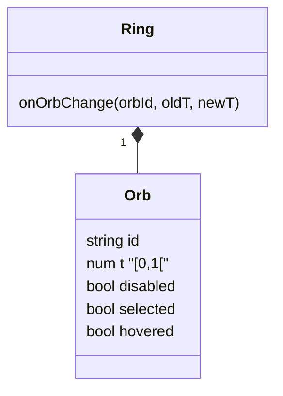

# Summary

Sketchpad app modules, state machine wiring, and shared app surfaces for Home, Kit, Design, Type, Quality, Docs, and Feedback.

# 💯Requirements

## 👤semio📚js🗃️sketchpad💻designtsx


### Panels

#### Detail

##### Tabs

###### Piece

```yaml
Piece: # section,
  Type: "{{piece-type-select}}" # input tree item, only show types that can replaced the type (e.g. all used connectors must exist)
  Id: "{{piece-id-input}}" # input tree item
  Description: "{{piece-description-text-area}}" # input tree item
  Attributes:
    - name: "{{attribute-name-input}}" # input tree item
      value: "{{attribute-value-input}}" # input tree item
  Plane: # collection tree item, only show section when
    Origin: # collection tree item
      X: "{{origin-x-stepper}}" # input tree item
      Y: "{{origin-y-stepper}}" # input tree item
      Z: "{{origin-z-stepper}}" # input tree item
    X-Axis:
      X: "{{x-axis-x-stepper}}"
      Y: "{{x-axis-y-stepper}}"
      Z: "{{x-axis-z-stepper}}"
    Y-Axis:
      X: "{{y-axis-x-stepper}}"
      Y: "{{y-axis-y-stepper}}"
      Z: "{{y-axis-z-stepper}}"
Parent Connection:
  Scene:
    Translation:
      Gap: "{{gap-slider}}"
      Shift: "{{shift-slider}}"
      Rise: "{{rise-slider}}"
    Orientation:
      Rotation: "{{rotation-slider}}"
      Inversion: "{{inversion-slider}}"
  Diagram:
    X Offset: "{{diagram-x-offset-stepper}}" # applied to all selected connections
    Y Offset: "{{diagram-y-offset-stepper}}"

```

# Specs

## Elements

### Orb




`elements.tsx`
```ts
interface OrbProps {
  id: string;
  t: number;
  disabled?: boolean;
  selected?: boolean;
  hovered?: boolean;
  radius?: number;
  onPointerDown?: (e: React.PointerEvent<SVGCircleElement>) => void;
  onPointerMove?: (e: React.PointerEvent<SVGCircleElement>) => void;
  onPointerUp?: (e: React.PointerEvent<SVGCircleElement>) => void;
  onPointerEnter?: (e: React.PointerEvent<SVGCircleElement>) => void;
  onPointerLeave?: (e: React.PointerEvent<SVGCircleElement>) => void;
}
export function Orb({ id, t, disabled, selected, hovered, radius, ... }: OrbProps): JSX.Element;

interface RingOrbData {
  id: string;
  t: number;
  disabled?: boolean;
  selected?: boolean;
  hovered?: boolean;
}
interface RingProps extends ElementProps {
  orbs: RingOrbData[];
  radius?: number;
  size?: number;
  onOrbChange?: (orbId: string, oldT: number, newT: number) => void;
  onOrbSelect?: (orbId: string) => void;
  onOrbHoverChange?: (orbId: string, hovered: boolean) => void;
  showLabel?: boolean;
  className?: string;
}
export function Ring({ id, orbs, radius, size, onOrbChange, onOrbSelect, onOrbHoverChange, showLabel, className }: RingProps): JSX.Element;
```
`sketchpad.tsx`
```ts
export const TypeDetails: FC = ({ ports}) => {
  const [t,setT,canSetT] = usePortT()
  return (
    <Ring
      orbs={ports.map((port)=> {
          <Orb t={t} onOrbChange={canSetT}>
        }
        )
      }
    >
    <Ring/>
  )
```

## Toolbar

### Architecture

The toolbar is a floating dual-zone panel system anchored at the bottom center of the canvas. It consists of two horizontally adjacent zones separated by a center seam: the **tools zone** (left of seam, grows rightward toward seam) and the **settings zone** (right of seam, grows leftward toward seam). The seam is fixed at viewport center (`left: 50%`) with a constant 8px gap between the two zones.

The toolbar is rendered inside a pointer-events-none container (`#semio.sketchpad.toolbar`) that spans the full width. Each zone re-enables pointer events independently. The seam element (`#semio.sketchpad.toolbar.seam`) is absolutely positioned at the horizontal midpoint. The tools zone sits to the right of the seam anchor and the settings zone to the left, so width changes in either zone grow away from center without shifting the other.

Each app registers toolbar sections via `addSection("toolbar", { ... })` during its mount lifecycle and removes them on unmount. The Sketchpad shell reads all registered toolbar sections via `usePanelSections("toolbar")` and renders them.

### Component Hierarchy

The toolbar uses four primitive components from `elements.tsx`:

- **`ToolbarZone`**: The outermost container. Renders a bordered, rounded, panel-background surface with `data-slot="toolbar-zone"`. Sets height via `--toolbar-item-height`, internal gap via `--toolbar-gap`, and inline padding via `--toolbar-padding-inline`. Provides the outer border and shadow.
- **`ToolbarGroup`**: Groups related toolbar elements. Renders a flex row with `data-slot="toolbar-group"` and `role="group"`. Uses `--toolbar-gap` for internal spacing.
- **`ToolbarItem`**: Wraps individual toolbar items in the settings zone. Renders a flex container with `data-slot="toolbar-item"`.
- **`ToolbarDivider`**: A vertical pixel-wide divider between groups. Height derived from `--toolbar-divider-height`.

### Registration Contract

Each app registers toolbar sections as `PanelSection` objects with a `toolbarGroup` property:

```typescript
interface PanelSection {
  id: string;
  content: ReactNode | (() => ReactNode);
  specificity?: number;
  order?: number;
  toolbarGroup?: {
    id: string;
    labelId?: string;
    order?: number;
    subToolId?: string;
    subToolLabelId?: string;
    subToolIcon?: ReactNode;
    onActivate?: () => void;
  };
}
```

- `toolbarGroup.id` MUST be one of the canonical group identifiers: `"hand"`, `"selection"`, `"filter"`, `"create"`, `"view"`, `"actions"`.
- `toolbarGroup.order` controls sort order within a group.
- `toolbarGroup.labelId` is the i18n key for the group toggle label. Labels MUST use the pattern `semio.sketchpad.toolbar.parent.<groupId>`.
- `toolbarGroup.subToolId` declares a sub-tool within a group. When present, the group renders as a dropdown toggle instead of a simple toggle.
- `toolbarGroup.subToolLabelId` and `toolbarGroup.subToolIcon` provide i18n label and icon for the sub-tool dropdown row.

### Group Ordering and Rendering

Groups are rendered in the tools zone in a fixed canonical order: `hand`, `selection`, `filter`, `create`, `view`, `actions`. Only groups that have at least one registered section are rendered. Each group renders as a `Toggle` element:

- **Simple groups** (no sub-tools): Render as `Toggle kind="single"` with the group icon and i18n label.
- **Selection group with sub-tools**: Renders as `Toggle kind="dropdown"` with a vertical dropdown list of sub-tools. The dropdown opens upward (`dropdownSide="top"`) from the toggle button, matches its width, and closes on selection or outside click.

Group icons are resolved by group ID: `hand` → HandIcon, `selection` → MousePointerIcon, `filter` → SearchIcon, `create` → AddIcon, `view` → LayoutIcon, `actions` → MoreHorizontalIcon.

### Active Group and Settings Zone

Exactly one group can be active at a time. The active group is tracked in component state (`activeToolbarGroup`). On initial render, the first non-hand group with registered sections auto-activates. If the active group's sections are removed (app switch), the first available non-hand group auto-activates.

When a group is active, its settings zone renders to the right of the seam. The settings zone contains the `content` of each section in that group, wrapped in `ToolbarItem` elements. For the selection group with sub-tools, only the sections matching the active sub-tool ID are rendered.

Toggling the same group toggle deactivates it and hides the settings zone. Toggling a different group switches the active group and replaces settings zone content.

### Sub-Tool Mechanics

Sub-tools only apply to the `selection` group. Each section in the selection group can declare a `subToolId`. Unique sub-tool IDs are extracted and rendered as dropdown items. The active sub-tool per group is tracked in `activeSubToolByGroup` state. Selecting a sub-tool from the dropdown sets it as active and also activates the group.

When sub-tools exist in a group, only sections whose `subToolId` matches the active sub-tool render in the settings zone. The dropdown item for each sub-tool shows `subToolIcon` and `subToolLabelId`.

### CSS Sizing Normalization

All toolbar interactive elements MUST derive their height from ToolbarZone, not from internal values.

CSS custom properties (defined in `globals.css`):
- `--toolbar-item-height`: `var(--size-medium)` — single source of truth for zone height
- `--toolbar-gap`: `var(--spacing-single)` — gap between items within a zone
- `--toolbar-group-gap`: `var(--spacing-double)` — gap between groups
- `--toolbar-padding-inline`: `var(--spacing-single)` — horizontal padding inside zones
- `--toolbar-divider-height`: `var(--size-small)` — divider height

Normalization rules in `globals.css` target `data-slot` attributes:
- `[data-slot="toolbar-zone"] [data-slot="toggle-group"]` and `[data-slot="button-group"]`: `border-width: 0; height: 100%` — strips inner group borders and forces height inheritance
- `[data-slot="toolbar-zone"] [data-slot="toggle-group-item"]` and `[data-slot="button-group-item"]`: `height: 100%` — forces item height inheritance

This ensures ToolbarZone is the single source of truth for element height, inner group borders are stripped (the zone provides the outer border), and all elements render at identical heights regardless of component family.

### Per-App Toolbar Sections

#### Home

- **Filter group** (`id: "filter"`): `HomeToolbarFilters` — Toggle buttons for `temporary`, `local`, `remote` kit kinds. Toggles update URL `kind` search param.
- **Create group** (`id: "create"`): `HomeToolbarCreate` — Action buttons to create new temporary, local, or remote kits.

#### Kit

- **Selection group** (`id: "selection"`, sub-tool `"select"`): `KitToolbarSelection` — Selection mode toggles (additive, subtractive) for the Kit app.
- **Filter group** (`id: "filter"`): `KitFilters` — Toggle buttons for artifact kinds (designs, types, qualities, ports, tags, concepts, files, folders, authors). Toggles update URL `filter` search params.
- **Create group** (`id: "create"`): `KitCreateActions` — Action buttons to create new artifacts within the kit.

#### Design

- **Selection group** (`id: "selection"`, sub-tool `"select"`): `DesignToolbarSelection` — Selection mode toggles (additive, subtractive) for the Design app.
- **Filter group** (`id: "filter"`): `DesignToolbarFilters` — Toggle buttons for `pieces`, `connections`, `ports` visibility. Toggles update URL `filter` search params and synchronize with the Design filter store.

#### Type

- **Filter group** (`id: "filter"`): `TypeKindToggles` — Toggle buttons for `connectors` and `models` visibility.
- **Selection group** (`id: "selection"`): `TypeSelectSettings` — Selection mode toggles (additive, subtractive).
- **Hand group** (`id: "hand"`, sub-tool `hand`): `TypeHandSettings` — Hand tool settings.
- **Create group** (`id: "create"`, sub-tool `connector`): `TypeConnectorSettings` — Connector creation tool settings.

#### Quality

- **Selection group** (`id: "selection"`): `QualitySelectSettings` — Selection mode toggles (additive, subtractive, intersect).
- **View group** (`id: "view"`): Placeholder, renders null.
- **Actions group** (`id: "actions"`): Placeholder, renders null.

#### Feedback

- **Actions group** (`id: "actions"`): `FeedbackToolbar` — Send button to submit the feedback form.

#### Docs

No toolbar sections registered.

### Toolbar State Management

- Active tool per app is stored in the Sketchpad state machine under each app's state (e.g., `kitApp.activeTool`, `designApp.activeTool`).
- `ToolKind` enum defines canonical tool kinds: `SELECTION_NORMAL`, `SELECTION_ADDITIVE`, `SELECTION_SUBTRACTIVE`, `SELECTION_INTERSECT`, `LASSO_RECTANGULAR`, `LASSO_FREEFORM`, `CONNECTOR`, `HAND`.
- Selection composition semantics (`replace`, `additive`, `subtractive`, `intersect`) map from `ToolKind` and keyboard modifiers (`Shift` → additive, `Alt/Ctrl/Meta` → subtractive, combined → intersect).
- Tool changes are dispatched via `SET_ACTIVE_TOOL` events through the keyed event handler factory.

### Interaction Invariants

- Toolbar panel visibility defaults to true for all apps.
- The toolbar MUST render when the app type is `home`, `kit`, `design`, `type`, `quality`, `feedback`, or `docs`.
- The tools zone MUST render all groups in canonical order: `hand`, `selection`, `filter`, `create`, `view`, `actions`.
- Only groups with registered sections MUST appear.
- Exactly one group MUST be active at a time (or none if deactivated).
- Group mutual exclusivity MUST hold: activating a group MUST hide settings from the previously active group.
- Selection group dropdown MUST open upward, match button width, close on selection or outside click.
- Settings zone MUST be hidden when no group is active.
- Each app MUST clean up its toolbar sections on unmount via `removeSection`.

---

## Toolbar Quick Reference

### Components
- `ToolbarZone` — outer container with `data-slot="toolbar-zone"`, height from `--toolbar-item-height`
- `ToolbarGroup` — group container with `data-slot="toolbar-group"`, flex row
- `ToolbarItem` — item wrapper with `data-slot="toolbar-item"`
- `ToolbarDivider` — vertical divider with `data-slot="toolbar-divider"`

### Groups (canonical order)
1. `hand` — HandIcon
2. `selection` — MousePointerIcon (supports sub-tools with dropdown)
3. `filter` — SearchIcon
4. `create` — AddIcon
5. `view` — LayoutIcon
6. `actions` — MoreHorizontalIcon

### Tool Kinds
- `SELECTION_NORMAL`, `SELECTION_ADDITIVE`, `SELECTION_SUBTRACTIVE`, `SELECTION_INTERSECT`
- `LASSO_RECTANGULAR`, `LASSO_FREEFORM`
- `CONNECTOR`, `HAND`

### Per-App Sections

| App | Groups | Sections |
|-----|--------|----------|
| **Home** | `filter`, `create` | Kit kind toggles (temporary/local/remote), create kit buttons |
| **Kit** | `selection`, `filter`, `create` | Selection modes, artifact kind toggles (designs/types/qualities/ports/tags/concepts/files/folders/authors), create actions |
| **Design** | `selection`, `filter` | Selection modes (additive/subtractive), element toggles (pieces/connections/ports) |
| **Type** | `filter`, `selection`, `hand`, `create` | Connector/model toggles, selection modes, hand tool, connector creation |
| **Quality** | `selection`, `view`, `actions` | Selection modes (additive/subtractive/intersect), view placeholder, actions placeholder |
| **Feedback** | `actions` | Send button |
| **Docs** | — | No toolbar |

### Registration Pattern
```typescript
addSection("toolbar", {
  id: "app.toolbar.section",
  specificity: 20,
  order: 10,
  toolbarGroup: {
    id: "selection", // or hand/filter/create/view/actions
    labelId: "semio.sketchpad.toolbar.parent.selection",
    order: 10,
    subToolId?: "select", // optional, for dropdown sub-tools
    subToolLabelId?: "semio.sketchpad.toolbar.subtool.select",
    subToolIcon?: <Icon className="size-tiny" />
  },
  content: () => <YourToolbarContent />
});
```

### CSS Variables
- `--toolbar-item-height: var(--size-medium)` — zone height
- `--toolbar-gap: var(--spacing-single)` — item gap
- `--toolbar-group-gap: var(--spacing-double)` — group gap
- `--toolbar-padding-inline: var(--spacing-single)` — horizontal padding
- `--toolbar-divider-height: var(--size-small)` — divider height

---

## Detail Panel Quick Reference

### Structure
Detail panel displays properties and controls for selected artifacts. Sections are registered via `addSection("details", { ... })` with `specificity` and `order` controlling priority and position. Higher specificity sections render above lower specificity ones.

### Components
- `TreeSection` — collapsible section with title and actions
- `TreeItem` — property row with label and control
- `TreeContent` — nested content wrapper
- `TreeRow` — simple text/element row
- Controls: `Input`, `Textarea`, `Select`, `Combobox`, `Slider`, `Stepper`, `Toggle`

### Per-App Detail Sections

| App | Selection State | Sections Shown |
|-----|-----------------|----------------|
| **Home** | Single kit | `KitSection` (name, version, kind, description) |
| **Home** | Multiple kits | `KitSection` (multi-select mode with mixed values) |
| **Kit** | Single design | `DesignSection` + `KitSection` |
| **Kit** | Multiple designs | `MultipleDesignsSection` + `KitSection` |
| **Kit** | Single type | `TypeSection` + `KitSection` |
| **Kit** | Multiple types | `MultipleTypesSection` + `KitSection` |
| **Kit** | Single port | `PortSection` + `KitSection` |
| **Kit** | Single tag | `TagSection` + `KitSection` |
| **Kit** | Single concept | `ConceptSection` + `KitSection` |
| **Kit** | Single file | `FileSection` + `KitSection` |
| **Kit** | Single folder | `FolderSection` + `KitSection` |
| **Kit** | Mixed kinds | `MultipleArtifactsSection` + `KitSection` |
| **Design** | No selection | `DesignSection` + `KitSection` |
| **Design** | Single piece | `PiecesSection` (type, id, description, attributes, plane, parent connection) + `DesignSection` + `KitSection` |
| **Design** | Multiple pieces | `PiecesSection` (multi-edit with mixed values) + `DesignSection` + `KitSection` |
| **Design** | Single connection | `ConnectionsSection` (connecting/connected piece+port, plane translation/orientation, diagram offset) + `DesignSection` + `KitSection` |
| **Design** | Multiple connections | `ConnectionsSection` (multi-edit) + `DesignSection` + `KitSection` |
| **Design** | Mixed selection | Warning message + `DesignSection` + `KitSection` |
| **Design** | Port selected | `ConnectorSection` (point, direction, mandatory) + `DesignSection` + `KitSection` |
| **Type** | No selection | `TypeDetails` + `ModelsSection` + `ConnectorsListSection` + `AuthorsSection` + `AttributesSection` + `KitSection` |
| **Type** | Single connector | `ConnectorSection` + `TypeDetails` + ... + `KitSection` |
| **Type** | Multiple connectors | `ConnectorsMultipleSection` + `TypeDetails` + ... + `KitSection` |
| **Quality** | Any | `QualityDetails` |
| **Docs** | Any | `DocsDetails` |
| **Feedback** | Any | No detail panel |

### Section Properties

#### PiecesSection (Design single/multi)
- **Type** — Combobox (single) or mixed indicator (multi), replacement candidates filtered by compatibility
- **Id** — Input (single) or mixed (multi)
- **Description** — Textarea (single) or mixed (multi)
- **Attributes** — Array of key/value pairs with add/remove actions
- **Plane** — Origin (x/y/z steppers), X-Axis (x/y/z steppers), Y-Axis (x/y/z steppers)
- **Parent Connection** — Embedded inside piece section as TreeItem group:
  - **Scene Translation** — Gap/Shift/Rise sliders
  - **Scene Orientation** — Rotation/Inversion sliders
  - **Diagram** — X Offset/Y Offset steppers

#### ConnectionsSection (Design single/multi)
- **Connecting** — Piece ID + Port ID (read-only labels)
- **Connected** — Piece ID + Port ID (read-only labels)
- **Plane Translation** — Gap/Shift/Rise sliders
- **Plane Orientation** — Rotation/Turn/Tilt sliders
- **Diagram** — X Offset/Y Offset steppers

#### ConnectorSection (Design/Type)
- **Point** — X/Y/Z steppers
- **Direction** — X/Y/Z steppers
- **Mandatory** — Toggle

### Registration Pattern
```typescript
addSection("details", {
  id: "app.section.id",
  specificity: 30, // 30=selection-specific, 20=app-level, 10=global
  order: 0, // lower numbers render first within same specificity
  defaultOpen: true,
  content: () => <YourSectionComponent />
});
```

### Specificity Hierarchy
- **30** — Selection-specific sections (pieces, connections, ports, etc.)
- **20** — App-level sections (design properties, type properties, etc.)
- **10** — Global sections (kit properties, always shown at bottom)

### Multi-Edit Behavior
When multiple items are selected, detail sections show:
- **Mixed values** — Display placeholder text like "Mixed" or "—"
- **Shared values** — Display the common value
- **Bulk edit** — Changes apply to all selected items
- **Validation** — Only allow edits that are valid for all selected items
