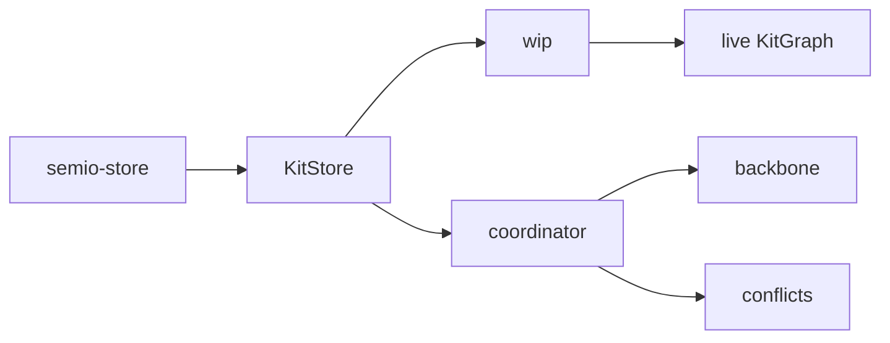

# 🧾 Specification

## 🕸️ Systems

Native **kit control plane** ([`kit_store::KitStore`](lib.rs), driven by `semio-store` JSON-RPC) is made of:

- **WIP** — thread that runs [`KitStoreCommand`](lib.rs) against the live [`KitGraph`](lib.rs) ([`wip_kit`](lib.rs)).
- **Backbone** — optional authoritative sink: **Dev** (one JSON file), **Local** (`.semio/kit.db` + folder materialization), **Remote** (hub session). Wire config types live in [`kit_backbone_wire`](lib.rs) (shared with wasm serde).
- **Coordinator** — owns a synchronizer [`KitGraph`](lib.rs), replays WIP proposals, calls the backbone, fills [`ConflictRegistry`](lib.rs) on failure ([`kit_coordinator`](lib.rs)).
- **Conflict registry** — in-memory [`KitConflict`](lib.rs) map; resolve strategies `dropWip` / `forceOverwriteBackbone`.



Historical path `semio::kit` re-exports [`kit_graph`](lib.rs); prefer `KitGraph` / `kit_store::KitStore` in new code.

## 🧮 Algorithms

## 🛠️ Mechanisms

### Layout

The library is a single crate root file, [`lib.rs`](lib.rs) (no `src/` tree). It uses inline
`pub mod … { … }` for each domain (including a large [`change_command`](lib.rs) section). Every parent owns its children through
`Arc<RwLock<T>>`; every child keeps a `Weak<RwLock<T>>` back-reference to its
parent. Derived data (content-addressable hashes, flatten caches) lives in
`OnceLock` fields invalidated by the owning entity's setters.

- Primitives: `id`, `hash`, `error`, `report`, `geom` and `merkle` modules in `lib.rs`. **`geom`**: `Coordinate` is 2D diagram space (**`u` / `v`**, Merkle + JSON canonical); 3D uses **`Point`** and **`Vector`**; **`Plane`** uses `Point` + `Vector` axes; **`Camera`** is view-space (position, forward, up) — not stored on [`DesignStore`](lib.rs) (views live outside the design aggregate). Geographic/named places are kit-level **[`location`](lib.rs)** entities; **type** and **design** reference a location via **`LocationIdDto`** (`{ id }`) only.
- Value objects: `attribute`, `prop`, `benchmark`, `stat`, `tag`, `concept`, `author`.
- Kit-scoped entities: `file`, `folder`, `quality`.
- Type-scoped children: `port`, `connector`, `representation`.
- Design-scoped children: `piece`, `connection`, `side`, `layer`, `group`.
- Aggregates: `typ` (Type), `design`, `kit`.
- **Read command surface** — [`read`](read_module.rs) (included from [`read_module.rs`](read_module.rs) + [`read_impl.rs`](read_impl.rs)): exhaustive, externally-tagged, `camelCase` **`Read*Command` / `Read*CommandOutput`** (no `Other`). Each command runs on the **live** [`KitGraph`](lib.rs) via `ReadKitCommand::execute` / `execute_many` (VCS materialized views use `KitGraph::materialize_graph_at` + a short lock). Regenerate the enum list with [`gen_read_module.py`](gen_read_module.py); the JS mirror is generated with [`../js/gen_read_command_types.py`](../js/gen_read_command_types.py).
- Change flow: `change_command` produces sparse diffs; [`KitStore::apply_kit_diff`](lib.rs) and [`DesignStore::apply_diff`](lib.rs) are the central write paths for kit and design trees (**remove → update → add** per child collection, then rewire + invalidate where applicable). [`ChangeKitCommand::apply`](lib.rs) returns `(KitDiff, inverse)` from `KitDiff::between` on the live kit before/after each step; [`ChangeKitCommand::apply_many`](lib.rs) merges those via [`KitDiff::merge`](lib.rs) and stacks inverses. [`FileStore::apply_diff`](lib.rs) / [`FolderStore::apply_diff`](lib.rs) apply sparse file/folder patches. [`ChangeKitCommand::compact`](lib.rs) coalesces consecutive kit metadata writes and cancels adjacent add/remove pairs for types and designs. VCS: [`KitChange`](lib.rs) stores `Vec<ChangeKitCommand>` forward + inverse; diffs are ephemeral per-apply products; snapshot reconciliation uses [`ChangeKitCommand::ReplaceKitFromFullDto`](lib.rs) when no command history exists. See also `read`, `kit_store_command`, `kit_session`, and related `kit_*` modules.
- I/O: `io::json` and native-only SQLite/ZIP under `io` in `lib.rs`.
- WASM surface: `pub mod wasm` in `lib.rs` (identical JS names, delegates to OO API).

## 📛 Entities

### Ownership graph

```
Kit  ─┬─> Type  ─┬─> Port
      │          ├─> Connector ──> Weak<Port>
      │          └─> Representation ──> Weak<File>
      ├─> Design ─┬─> Piece ──> Weak<Type>
      │           ├─> Connection ──> Side { Weak<Piece>, Weak<Port> }
      │           ├─> Layer
      │           └─> Group ──> [Weak<Piece>]
      ├─> File
      ├─> Folder
      ├─> Location (geographic / named; referenced by id from Type/Design)
      └─> Quality (also referenced from Port/Type/Design)
```

Planned / in-flight alignment: **Family**-scoped ports, kit-level **families** / **locations** / **tags** tables (see canonical kit JSON and `semio/py/main.py` hash order). **Connection** in-plane offsets use event fields **`U` / `V`** (not `X` / `Y`) while legacy DTO/SQLite column names may still be `x` / `y` until renamed end-to-end.

Every solid arrow is an `Arc<RwLock<T>>`; every back-reference (drawn from a
child to its parent) is a `Weak<RwLock<T>>`. IDs appear only on `*Dto`
structs and as keys in the kit-level resolver during `Kit::from_dto`.
