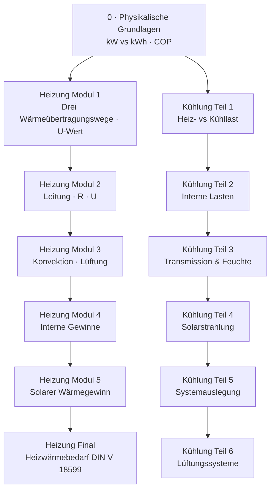

# Gebäudeenergie — Konzepte, Definitionen & Formeln

Referenz zu den Tutorial-Videos unter `tutorial/energy/demand/`.  
Jedes Kapitel fasst **Lernziel**, **Kernbegriffe**, **Formeln** und **Merksätze** zusammen — parallel zu den Manim-Animationen.

---

## Curriculum-Übersicht

| # | Video | Ordner | Normen (Auswahl) |
|---|-------|--------|------------------|
| 0 | Physikalische Grundlagen | `1_physical_fundamentals/` | — |
| H1–H5 | Heizwärmebedarf (5 Module) | `Heating/` | DIN EN ISO 6946, DIN EN 12831, DIN V 18599 |
| HF | Heizwärmebedarf — Bilanz | `Heating/final_calculation/` | DIN V 18599 |
| C1–C6 | Kühllast (6 Teile) | `Cooling/` | DIN V 18599, VDI 2078 (implizit) |

---

## 0 · Physikalische Grundlagen

**Titel:** Physikalische Zusammenhänge: Kraft, Leistung & Energie  
**Datei:** `1_physical_fundamentals/scene_1.py`

### Lernziel

Die Sprache der Gebäudeenergie verstehen, bevor Heiz- und Kühlbedarf berechnet werden: **Kraft**, **Arbeit/Energie**, **Leistung**, **kWh**, Größenordnungen, Energieerhaltung, Wärmepumpen-COP.

### Kernbegriffe

| Begriff | Definition | Alltagsanker |
|---------|------------|--------------|
| **Newton (N)** | Einheit der Kraft | ≈ Gewicht von 100 g (Tafel Schokolade) |
| **Joule (J)** | Einheit der Energie / Arbeit | 1 N über 1 m Weg |
| **Watt (W)** | Einheit der Leistung (Energiefluss pro Zeit) | 1 J in 1 s |
| **Kilowatt (kW)** | 1 000 W | Momentaufnahme — „Dicke des Rohres“ |
| **Kilowattstunde (kWh)** | Energie = Leistung × Zeit | „Eimer unter dem Rohr“ |
| **Heizlast** | Maximaler Wärmebedarf bei Norm-Außentemperatur | Dimensionierung des Erzeugers (kW) |
| **Heizwärmebedarf** | Jahresenergie zum Heizen | Jahresbilanz (kWh/m²a) |
| **COP** | Leistungszahl einer Wärmepumpe | Nutzwärme ÷ Stromaufwand |

### Formeln

| Formel | Bedeutung |
|--------|-----------|
| **W = F · s** | Arbeit = Kraft × Weg |
| **P = W / t** | Leistung = Arbeit ÷ Zeit |
| **1 W = 1 J/s** | Definition Watt |
| **E = P · t** | Energie = Leistung × Zeit |
| **1 kWh = 3 600 000 J = 3,6 MJ** | Umrechnung (1 h = 3 600 s) |
| **ΣE = konstant** | 1. Hauptsatz der Thermodynamik |
| **COP = Q_ab / W_zu** | z. B. 4 kWh Heizung aus 1 kWh Strom + 3 kWh Umweltwärme → COP = 4 |

### Größenordnungen (Hannover-Kontext)

| Leistung | Beispiel |
|----------|----------|
| 25 W | Kerze |
| 100 W | Glühbirne ≈ ruhender Erwachsener |
| 10 kW | 100 Studierende im Hörsaal **oder** typische EFH-Heizlast |
| 30 MW | Wärmepumpe Klärwerk Herrenhausen (~3 000 EFH) |

### Merksätze

- **kW = Rohr** (momentaner Fluss), **kWh = Eimer** (gesammelte Menge).
- Fast jede elektrische Leistung im Gebäude wird zu **100 % thermische Last** (Winter hilfreich, Sommer problematisch).
- Glühbirne: ~5 % Licht, ~95 % Wärme — Licht wird an Wänden ebenfalls zu Wärme.
- Nächste Schritte: **Heizlast** nach DIN EN 12831 (kW), **Heizwärmebedarf** nach DIN V 18599 (kWh/m²a).

---

## Heizung · Modul 1 — Die Grundlagen der Bauphysik

**Datei:** `Heating/1_introduction/scene_1.py`

### Lernziel

Die drei Wärmeübertragungsmechanismen an derselben Gebäudewand verstehen und in Kennzahlen (R, U, Q̇) übersetzen.

### Kernbegriffe

| Begriff | Definition |
|---------|------------|
| **Wärmeleitung (Q̇_k)** | Energie wandert durch festes Material; Moleküle bleiben am Platz |
| **Konvektion (Q̇_c)** | Wärme wird von **bewegter Luft** transportiert (Luft verlässt das Gebäude) |
| **Strahlung (Q̇_r)** | Infrarotwellen, **kein Medium** nötig (Sonne, Wand-zu-Wand) |
| **Δθ** | Temperaturdifferenz — einziger Antrieb des Wärmestroms (warm → kalt) |
| **Wärmedurchlasswiderstand R** | Bremswirkung einer Schicht [m²·K/W] |
| **U-Wert** | Kehrwert des Gesamtwiderstands — wie leicht Wärme hindurchkommt [W/(m²·K)] |
| **λ (Lambda)** | Wärmeleitfähigkeit des Materials [W/(m·K)] |

### Formeln

| Formel | Bedeutung |
|--------|-----------|
| **Q̇_ges = Q̇_k + Q̇_c + Q̇_r** | Gesamtwärmestrom über ein Bauteil |
| **R = d / λ** | Widerstand einer Schicht |
| **R_ges = R_si + Σ(d/λ) + R_se** | Gesamtwiderstand inkl. Oberflächenwiderständen |
| **U = 1 / R_ges** | U-Wert |
| **Q̇ = U · A · Δθ** | Wärmestrom durch Bauteil [W] |

### Merksätze

- Energie wandert **nur von warm nach kalt** (2. Hauptsatz).
- DIN EN ISO 6946 fasst Leitung, Konvektion und Strahlung zu **einem U-Wert** pro Bauteil zusammen.
- **Nur U ist eine Entwurfsentscheidung** — Dämmung ist der Hebel (A und Δθ sind gegeben).

---

## Heizung · Modul 2 — Wärmeleitung (Transmission)

**Datei:** `Heating/2_conduction/scene_2.py`

### Lernziel

Vom makroskopischen Temperaturgradienten zum mikroskopischen Molekülschwingen — und zur Berechnung von R und U an mehrschichtigen Wänden.

### Kernbegriffe

| Begriff | Definition |
|---------|------------|
| **Temperaturgradient** | Temperaturabfall über die Schichtdicke |
| **Mehrschichtenaufbau** | Putz · Mauerwerk · Dämmung · Außenputz — jede Schicht eigenes R |
| **Bauteilfläche A_i** | Fläche der i-ten Hüllenfläche |

### Formeln

| Formel | Bedeutung |
|--------|-----------|
| **R = d / λ** | pro Schicht |
| **U = 1 / R_ges** | |
| **Q̇_T = U · A · Δθ** | Transmissionswärmestrom (opake Bauteile) |

### Merksätze

- Dicker oder besser gedämmt → **R steigt**, **Q̇ sinkt**.
- Altbau-Massivwand U ≈ 1,4 vs. saniert mit 20 cm Dämmung U ≈ 0,15 (≈ Faktor 10).

---

## Heizung · Modul 3 — Konvektion / Lüftung

**Datei:** `Heating/3_convection/scene_3.py`

### Lernziel

Lüftungswärmeverluste durch Luftwechsel quantifizieren; Rolle von Volumen, Luftwechselrate, spezifischer Wärmekapazität und Wärmerückgewinnung.

### Kernbegriffe

| Begriff | Definition |
|---------|------------|
| **Innenvolumen V** | Beheiztes Luftvolumen [m³] |
| **Luftwechselrate n** | [1/h] — wie oft das Luftvolumen pro Stunde ausgetauscht wird |
| **c_Luft** | Spezifische Wärmekapazität der Luft ≈ 0,34 Wh/(m³·K) |
| **η_WRG** | Wirkungsgrad der Wärmerückgewinnung |

### Formeln

| Formel | Bedeutung |
|--------|-----------|
| **V** | Innenvolumen des Gebäudes |
| **n** | Luftwechselrate [h⁻¹] |
| **Φ_V = V · n · c_Luft · Δθ** | Lüftungswärmeverlust ohne WRG [W] |
| **Φ_V = V · n · (1 − η_WRG) · c_Luft · Δθ** | mit Wärmerückgewinnung |

### Merksätze

- Undichte Gebäudehülle = permanenter **Wärmeverlust-Konvektionskreislauf**.
- Mechanische Lüftung mit WRG kann den Lüftungsverlust drastisch senken.

---

## Heizung · Modul 4 — Interne Wärmegewinne

**Datei:** `Heating/4_internal_heat_gain/scene_4.py`

### Lernziel

Personen, Geräte und Beleuchtung als Wärmequellen im Winter (Gewinn) erfassen.

### Kernbegriffe

| Begriff | Definition |
|---------|------------|
| **Φ_P** | Wärmegewinn durch Personen |
| **Φ_E** | Wärmegewinn durch Geräte (elektrische Leistung × Nutzungsfaktor) |
| **Φ_L** | Wärmegewinn durch Beleuchtung |
| **Φ_int** | Summe interner Gewinne |
| **A_N** | Nutzfläche [m²] |

### Formeln

| Formel | Bedeutung |
|--------|-----------|
| **Φ_int = Φ_P + Φ_E + Φ_L** | Gesamte interne Wärmegewinne [W] |
| **q_int = Φ_int / A_N** | Spezifische interne Gewinnleistung [W/m²] |

### Merksätze

- Ruhende Person ≈ **80–100 W** thermisch (≈ Glühbirne).
- Im Winter senken interne Gewinne die **Heizlast**; im Sommer erhöhen sie die **Kühllast**.

---

## Heizung · Modul 5 — Solarer Wärmegewinn

**Datei:** `Heating/5_solar_heat_gain/scene_5.py`

### Lernziel

Solare Einstrahlung durch transparente Bauteile, g-Wert, Verschattung, Speichermasse und die solare Hauptgleichung.

### Kernbegriffe

| Begriff | Definition |
|---------|------------|
| **G** | Gesamtsonneneinstrahlung auf geneigte Fläche [W/m²] |
| **A** | Fläche des Bauteils [m²] |
| **F_f** | Rahmenanteil (nicht transparent) |
| **g** | Gesamtenergiedurchlassgrad der Verglasung |
| **F_sh** | Verschattungsfaktor |
| **Speichermasse** | Schwere Innenschichten puffern Temperatur (Trägheit) |

### Formeln

| Formel | Bedeutung |
|--------|-----------|
| **Φ_solar = G · A · F_f · g · F_sh** | Solarer Wärmegewinn [W] |

### Merksätze

- Niedriger **g-Wert** = weniger solare Wärme durchs Fenster (Sommer wichtig).
- Verschattung und Speichermasse **verschieben** den Lastspitzen-Zeitpunkt.

---

## Heizung · Final Calculation — Heizwärmebedarf

**Datei:** `Heating/final_calculation/merged_scenes.py`

### Lernziel

Alle Verlust- und Gewinnpfade in **einer Bilanz** zusammenführen → Jahres-Heizwärmebedarf.

### Formeln

| Formel | Bedeutung |
|--------|-----------|
| **Φ_trans = U · A · ΔT** | Transmissionsverluste |
| **Φ_vent = V · n · c_Luft · ΔT** | Lüftungsverluste |
| **Φ_Verlust = Φ_trans + Φ_vent** | Gesamtwärmeverlustleistung |
| **Q_h = Φ_Verlust − η_h · (Φ_solar + Φ_int)** | **Heizwärmebedarf** (DIN V 18599) |

### Kernbegriffe

| Begriff | Definition |
|---------|------------|
| **η_h** | Nutzungsgrad der internen/solaren Gewinne für Heizen |
| **Q_h** | Heizwärmebedarf — Energie, die aktiv zugeführt werden muss |

### Merksätze

- **Heizlast (kW)** = Dimensionierung für den kältesten Moment (DIN EN 12831, Hannover −12 °C).
- **Heizwärmebedarf (kWh/m²a)** = Jahresenergiebilanz (DIN V 18599).

---

## Kühlung · Teil 1 — Heizlast vs. Kühllast

**Datei:** `Cooling/1_heating_vs_cooling/scene_1.py`

### Lernziel

Dieselben Gewinnequellen (Sonne, Personen, Geräte) **saisonal unterschiedlich** bewerten: Winter = Hilfe, Sommer = Problem.

### Kernbegriffe

| Begriff | Definition |
|---------|------------|
| **Heizlast** | Fehlende Wärmeleistung im Winter |
| **Kühllast** | Zu entfernende Wärmeleistung im Sommer |
| **Interne Gewinne** | Personen (~100 W), Laptop (~60 W), Beleuchtung |

### Merksätze

- **Gleiches Haus, gleiche Gewinne — gegenteilige Wirkung** je nach Jahreszeit.
- Kühlsystem muss interne + solare Gewinne **abführen**, nicht nur Außenhitze.

---

## Kühlung · Teil 2 — Interne Wärmegewinne

**Datei:** `Cooling/2_internal_gains/scene_2.py`

### Lernziel

Interne Lasten detailliert aufschlüsseln; sensible vs. latente Anteile bei Personen.

### Formeln

| Formel | Bedeutung |
|--------|-----------|
| **Q̇_Pers = n · q̇_p** | Personenlast [W] |
| **Q̇_Geräte = P_el · f_N** | Gerätelast (Leistung × Nutzungsfaktor) |
| **Q̇_Licht = P_Licht · f_g** | Beleuchtungslast |
| **Q̇_i = Q̇_Pers + Q̇_Geräte + Q̇_Licht** | Gesamte interne Last |
| **Q̇_ges = Q̇_sens + Q̇_lat** | Sensible + latente Kühlung |

### Merksätze

- Hörsaal mit 100 Personen: **~10 kW** interne Wärme — massive Sommerlast.
- Latente Last = Feuchte (Schwitzen, Atmung) — braucht **Entfeuchtung**, nicht nur Kühlung.

---

## Kühlung · Teil 3 — Transmission & Feuchte

**Datei:** `Cooling/3_transmission_humidity/scene_3.py`

### Lernziel

Sommerliche Transmissionslast (mit ΔT_eq für solare Aufheizung) und latente Lasten durch Feuchte.

### Formeln

| Formel | Bedeutung |
|--------|-----------|
| **Q̇_T = U · A · ΔT_eq** | Transmissionskühllast (opake Bauteile, Sommer) |
| **Q̇_L = Q̇_sens + Q̇_lat** | Gesamte Lüftungs-/Infiltrationslast |
| **Q̇_sens = ρ_a · c_p,a · ΔΘ · q_v,R** | Sensible Lüftungslast |
| **Q̇_lat = ρ_a · r · Δx · q_v,R** | Latente Lüftungslast (Feuchte) |

### Kernbegriffe

| Begriff | Definition |
|---------|------------|
| **ΔT_eq** | Äquivalente Temperaturdifferenz (solare Oberflächenaufheizung) |
| **Zeitverzögerung** | Schwere Wände puffern — Last kommt **verspätet** |
| **q_v,R** | Volumenstrom der Raumluft [m³/s] |

---

## Kühlung · Teil 4 — Solarstrahlung

**Datei:** `Cooling/4_solar_radiation/scene_4.py`

### Lernziel

Solare Kühllast durch Fenster: Einstrahlung, Rahmen, Verschattung, Verglasung.

### Formeln

| Formel | Bedeutung |
|--------|-----------|
| **I_S,max ≈ 800 W/m²** | Max. solare Einstrahlung (Größenordnung) |
| **A_eff = A · F_F** | Effektive Glasfläche (ohne Rahmen) |
| **I_reduziert = I_S,max · F_V** | Nach Verschattung |
| **g_tot = τ_e + q_i** | Gesamtenergiedurchlassgrad |
| **Q̇_S,tr = A · F_F · F_V · g_tot · I_S,max** | Solare Transmissionskühllast |

### Kernbegriffe

| Begriff | Definition |
|---------|------------|
| **F_F** | Rahmenflächenanteil |
| **F_V** | Verschattungsfaktor (Außen-/Innenschatten) |
| **τ_e** | Transmissionsgrad der Verglasung |
| **q_i** | Absorptionsanteil der Verglasung |

---

## Kühlung · Teil 5 — Systemauslegung

**Datei:** `Cooling/5_systemauslegung/scene_5.py`

### Lernziel

Von der Kühllast zum erforderlichen **Luftvolumenstrom** und **Kanalquerschnitt**.

### Formeln

| Formel | Bedeutung |
|--------|-----------|
| **Q̇_V = ρ_a · c_p,a · Δθ · q_v,R** | Volumenstrom-Kühlleistung |
| **q_v,R = Q̇_S,tr / (ρ_a · c_p,a · Δθ)** | Erforderlicher Volumenstrom aus solarer Last |
| **q_v,R = v_m · A** | Kontinuität |
| **A = q_v,R / v_m** | Kanalquerschnitt |
| **r = √(A / π)** | Rohrradius bei rundem Kanal |

### Merksätze

- Erst **Last isolieren** (solar getrennt von intern), dann Volumenstrom dimensionieren.
- Kanaldurchmesser wächst mit **√(Volumenstrom)** — doppelter Durchsatz braucht nicht doppelten Radius.

---

## Kühlung · Teil 6 — Lüftungssysteme

**Datei:** `Cooling/6_lueftungssysteme/scene_6.py`

### Lernziel

Strategie: Last senken → natürliche Lüftung nutzen → mechanisch nur den Rest. Passivhaus-Prinzipien.

### Kernbegriffe

| Begriff | Definition |
|---------|------------|
| **Querlüftung** | Zwei Öffnungen — effektive Fläche A_eff aus beiden Querschnitten |
| **Auftriebslüftung** | Δp = h · g · (ρ_a − ρ_i) — Höhendifferenz erzeugt Druck |
| **Nachtlüftung** | Speichermasse nachts abkühlen |
| **WRG / KRG** | Wärme- bzw. Kälterückgewinnung im Sommer |
| **Φ (WRG)** | (θ_ZUL − θ_AUL) / (θ_ABL − θ_AUL) — Temperaturwirkungsgrad |

### Formeln

| Formel | Bedeutung |
|--------|-----------|
| **1/A_eff² = 1/A_1² + 1/A_2²** | Serienschaltung zweier Öffnungen |
| **Δp = h · g · (ρ_a − ρ_i)** | Auftriebsdruck |
| **Φ = (θ_ZUL − θ_AUL) / (θ_ABL − θ_AUL)** | Rückgewinnungsgrad (Beispiel: 5 K / 6 K ≈ 0,8) |

### Strategie (3 Stufen)

1. **Hülle + Sonnenschutz** — Last senken (~45 %)
2. **Natürliche Lüftung** — kostenlos nutzen (~35 %)
3. **Mechanische Lüftung** — nur für den Rest (~20 %)

---

## Einheiten-Spickzettel

| Größe | Symbol | Einheit | Typ |
|-------|--------|---------|-----|
| Kraft | F | N | Vektor |
| Arbeit / Energie | W, E | J, kWh | Skalar |
| Leistung | P, Q̇, Φ | W, kW | Fluss (momentan) |
| Wärmedurchgangskoeffizient | U | W/(m²·K) | Material/Bauteil |
| Wärmedurchlasswiderstand | R | m²·K/W | Material/Bauteil |
| Wärmeleitfähigkeit | λ | W/(m·K) | Material |
| Volumen | V | m³ | Geometrie |
| Luftwechselrate | n | h⁻¹ | Betrieb |
| Fläche | A | m² | Geometrie |
| Temperaturdifferenz | Δθ, ΔT | K | Treiber |

---

## Wasser-Analogie (durchgängig)

| Physik | Analogie |
|--------|----------|
| Leistung (kW) | Wassermenge pro Sekunde im Rohr |
| Energie (kWh) | Wasser im Eimer unter dem Rohr |
| U-Wert (niedrig) | Dünnes Rohr / wenig Durchfluss |
| Wärmepumpe (COP) | Pumpe, die Wärme „hochhebt“ statt sie zu erzeugen |

---

*Stand: abgeleitet aus den Manim-Szenen in `tutorial/energy/demand/`. Bei Abweichungen gilt der Quellcode (`scene_*.py` → `NARRATION` + `equation_row`) als maßgeblich.*
