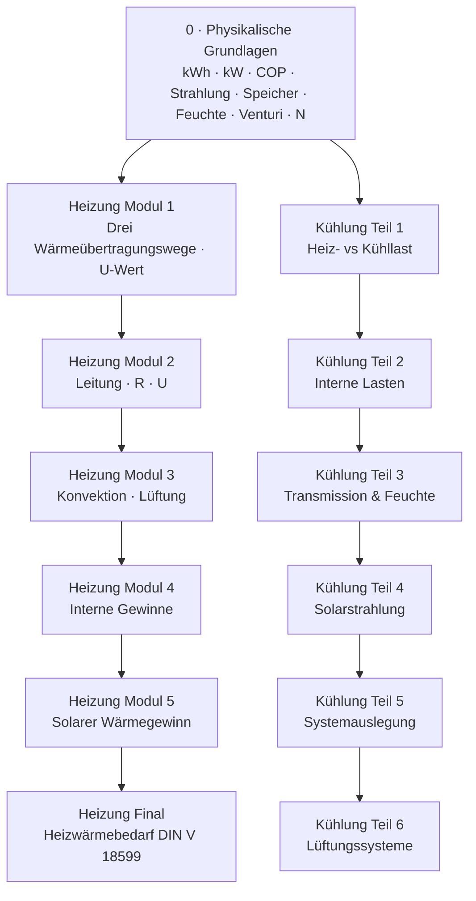

# Gebäudeenergie — Konzepte, Definitionen & Formeln

Referenz zu den Tutorial-Videos unter `tutorial/energy/demand/`.  
Jedes Kapitel fasst **Lernziel**, **Kernbegriffe**, **Formeln** und **Merksätze** zusammen — parallel zu den Manim-Animationen.

---

## Curriculum-Übersicht

```mermaid
flowchart TB
    PF["0 · Physikalische Grundlagen<br/>kWh · kW · COP · Strahlung · Speicher · Feuchte · Venturi · N"]
    H1["Heizung Modul 1<br/>Drei Wärmeübertragungswege · U-Wert"]
    H2["Heizung Modul 2<br/>Leitung · R · U"]
    H3["Heizung Modul 3<br/>Konvektion · Lüftung"]
    H4["Heizung Modul 4<br/>Interne Gewinne"]
    H5["Heizung Modul 5<br/>Solarer Wärmegewinn"]
    HF["Heizung Final<br/>Heizwärmebedarf DIN V 18599"]
    C1["Kühlung Teil 1<br/>Heiz- vs Kühllast"]
    C2["Kühlung Teil 2<br/>Interne Lasten"]
    C3["Kühlung Teil 3<br/>Transmission & Feuchte"]
    C4["Kühlung Teil 4<br/>Solarstrahlung"]
    C5["Kühlung Teil 5<br/>Systemauslegung"]
    C6["Kühlung Teil 6<br/>Lüftungssysteme"]

    PF --> H1 --> H2 --> H3 --> H4 --> H5 --> HF
    PF --> C1 --> C2 --> C3 --> C4 --> C5 --> C6
```

| # | Video | Ordner | Normen (Auswahl) |
|---|-------|--------|------------------|
| 0 | Physikalische Grundlagen | `1_physical_fundamentals/` | DIN EN 12831, DIN V 18599, DIN EN 14511, VDI 4650, DIN EN 410, DIN 4108-2/-3, DIN EN ISO 13786, DIN 1946-6 |
| H1–H5 | Heizwärmebedarf (5 Module) | `Heating/` | DIN EN ISO 6946, DIN EN 12831, DIN V 18599 |
| HF | Heizwärmebedarf — Bilanz | `Heating/final_calculation/` | DIN V 18599 |
| C1–C6 | Kühllast (6 Teile) | `Cooling/` | DIN V 18599, VDI 2078 (implizit) |

---

## 0 · Physikalische Grundlagen

**Titel:** Physikalische Grundlagen  
**Datei:** `1_physical_fundamentals/scene_1.py` · **9 Beats** (Reihenfolge: `BEATS` in `scene_1.py`)

### Lernziel

Die Größen der Gebäudeenergie konkret und visuell verstehen — immer am Bauteil, das sie bestimmt: **Energie (kWh)** im Alltag, **Leistung (kW)** als Fläche im Leistung-Zeit-Diagramm, **Energieerhaltung**, **Wärmepumpe/COP** im Vergleich zu anderen Heizsystemen, **Strahlung** am Glas, **thermische Masse** der Decke, **sensible/latente Wärme**, **Venturi-Effekt** an Öffnungen — und zuletzt die **Kraft (N)**, die im Joule steckt.

### Beat-Übersicht

| Beat | Untertitel | Inhalt |
|------|------------|--------|
| 1 | Energie im Alltag — die Kilowattstunde | Zähler · weggelassenes „h“ · 1 kWh = Staubsauger 1 h = ≈ 3 min warm duschen · Energie-Skala Teelicht → Welt · Glas, Decke, Öffnungen |
| 2 | Leistung — wie schnell Energie fließt | E = P · t als Fläche · Staubsauger/Wasserkocher/Dusche · 1 W = 1 J/s · Leistungs-Skala Teelicht → alle Kraftwerke · Heizlast vs. Heizwärmebedarf |
| 3 | Energie bleibt erhalten — jedes Watt wird Wärme | E_ein = E_aus + ΔE_Speicher · Lampe 5 % Licht + 95 % Wärme → 100 % Wärme · Mensch 100 W · Winter/Sommer |
| 4 | Wärmepumpe — Wärme verschieben statt erzeugen | Kältekreis animiert · 1 + 3 = 4 · COP aus Balken · COP(Außentemperatur) · JAZ · Vergleich Holz, Öl, Gas, Elektro, Luft-/Erd-WP |
| 5 | Strahlung — kurzwellig hinein, langwellig gefangen | g-Wert aus Strahlen · Q̇_S = g · A · I · langwellige Rückstrahlung, Low-E · Treibhauseffekt · Sonnenschutz außen |
| 6 | Thermische Masse — speichern und zeitversetzt abgeben | Q = m · c · ΔT an 1 m² Betondecke · 24-h-Verlauf, Phasenverschiebung, Dämpfung · warum die Decke · Nachtlüftung/Sonnengewinne |
| 7 | Sensible und latente Wärme | T-Q-Diagramm Wasser · Sättigungskurve x_s(ϑ) · Taupunkt · Mensch 70 W sensibel + 30 W latent · Tauwasser/Entfeuchtung |
| 8 | Venturi-Effekt — Luft in Bewegung | A₁ · v₁ = A₂ · v₂ · Druckabfall, Sog · Wind über den First · Lage und Größe der Öffnungen · Lüftungswärmeverlust |
| 9 | Kraft — was in einem Joule steckt | F_G = m · g · W = F · s als Fläche · Herz: 1 N über 1 m pro Sekunde → 1 J → 1 W · 1 000 Herzen = 1 kW · 1 kWh = 3,6 · 10⁶ J |

### Kernbegriffe

| Begriff | Definition | Was ist „1 …“? |
|---------|------------|----------------|
| **Kilowattstunde (kWh)** | Energie / verrichtete Arbeit: 1 kW eine Stunde lang | Staubsauger 1 h · ≈ 3 min warm duschen (30 l von 10 auf 38 °C) |
| **Kurzform** | Im Alltag fällt oft das „h“ weg („4 000 kW verbraucht“) | ohne „h“ ist es eine Leistung, keine Menge |
| **Kilowatt (kW)** | Leistung = Energie pro Zeit | Staubsauger ≈ 1 kW · Wasserkocher 2 kW · Durchlauferhitzer 18–24 kW |
| **Watt (W)** | 1 J pro Sekunde | ein Herzschlag pro Sekunde |
| **Joule (J)** | 1 N über 1 m | Apfel (100 g) 1 m hochheben · ein Herzschlag |
| **Newton (N)** | Kraft; Gewichtskraft F_G = m · g | Erde zieht an 100 g mit ≈ 1 N |
| **Heizlast** | Spitzenleistung der kältesten Stunde | EFH ≈ 8 kW, DIN EN 12831 |
| **Heizwärmebedarf** | Fläche unter der Leistungskurve übers Jahr | EFH ≈ 15 000 kWh/a, DIN V 18599 |
| **COP** | Heizwärme / Strom in einem Betriebspunkt | 1 kWh Strom + 3 kWh Umweltwärme = 4 kWh, DIN EN 14511 |
| **JAZ** | Jahresarbeitszahl, COP übers Jahr | Luft-WP ≈ 3, Erd-WP ≈ 4, VDI 4650 |
| **g-Wert** | Anteil der Solarstrahlung, der durchs Glas kommt | Dreifachverglasung ≈ 0,5, DIN EN 410 |
| **kurz-/langwellig** | Sonne: Licht und nahes IR · warme Flächen: fernes IR | Glas lässt kurzwellig durch, langwellig kaum (Low-E reflektiert) |
| **Thermische Masse** | Wärmespeicher eines Bauteils, Q = m · c · ΔT | 1 m² Beton, 10 cm, 2 K → 480 kJ ≈ 0,13 kWh |
| **Phasenverschiebung φ** | Zeitversatz der Temperaturspitze durch Speichermasse | massive Decke ≈ 6 h (schematisch), DIN EN ISO 13786 |
| **sensible Wärme** | ändert die Temperatur | 1 kg Wasser 0 → 100 °C: 419 kJ |
| **latente Wärme** | steckt im Phasenwechsel, Temperatur bleibt | Verdampfen 1 kg Wasser: 2 257 kJ |
| **Taupunkt** | Temperatur, bei der φ = 100 % erreicht wird | 20 °C / 50 % → ≈ 9,3 °C, DIN 4108-3 |
| **Venturi-Effekt** | Engstelle → schneller → niedrigerer Druck → Sog | halber Querschnitt, doppelte Geschwindigkeit |

### Formeln

| Formel | Bedeutung |
|--------|-----------|
| **1 kW · 1 h = 1 kWh** | Kilowatt mal Stunde |
| **Q = m · c · ΔT** | sensible Wärme (Dusche, Betondecke, Wasser) |
| **E = P · t**, **P = E / t** | Energie = Fläche im Leistung-Zeit-Diagramm |
| **1 W = 1 J/s**, **1 kWh = 3,6 · 10⁶ J** | Grundeinheit und Umrechnung |
| **E_ein = E_aus + ΔE_Speicher** | 1. Hauptsatz für einen Raum |
| **P_el = P_Licht + P_Wärme** | 100 W = 5 W + 95 W → am Ende 100 W Wärme |
| **COP = Q_H / W_el** | 4 kWh / 1 kWh = 4 |
| **Q̇_S = g · A · I** | 0,5 · 2,0 m² · 500 W/m² = 500 W |
| **m = ρ · A · d** | 2 400 kg/m³ · 1 m² · 0,10 m = 240 kg |
| **Q_lat = m · r** | 1 kg · 2 257 kJ/kg |
| **A₁ · v₁ = A₂ · v₂**, **p + ½ ρ v² = konstant** | Kontinuität und Bernoulli |
| **Q̇_V = 0,34 Wh/(m³ K) · V̇ · ΔT** | 100 m³/h · 20 K → 680 W |
| **F_G = m · g**, **W = F · s** | 0,1 kg · 9,81 m/s² ≈ 1 N; 1 N · 1 m = 1 J |

### Skalen

| Energie | Beispiel |
|---------|----------|
| ≈ 0,1 kWh | Teelicht |
| 1 kWh | Staubsauger 1 Stunde |
| ≈ 3 000 kWh | Haushaltsstrom pro Jahr |
| ≈ 15 000 kWh | Heizwärme Einfamilienhaus pro Jahr |
| ≈ 2,4 · 10¹² kWh | Deutschland pro Jahr, Endenergie |
| ≈ 1,7 · 10¹⁴ kWh | Welt pro Jahr, Primärenergie |

| Leistung | Beispiel |
|----------|----------|
| ≈ 30 W | Teelicht |
| ≈ 100 W | Mensch in Ruhe (≈ 70 W sensibel + 30 W latent) |
| ≈ 1 kW | Staubsauger |
| ≈ 8 kW | Einfamilienhaus, kältester Tag |
| ≈ 100 kW | Auto |
| ≈ 5 MW | Windrad |
| ≈ 1,4 GW | Kraftwerksblock |
| ≈ 9 TW | alle Kraftwerke der Welt (installiert) |

| Nutzwärme aus 1 kWh Endenergie | Wert |
|--------------------------------|------|
| Holzhackschnitzel | ≈ 0,85 |
| Heizöl Brennwert | ≈ 0,94 |
| Erdgas Brennwert | ≈ 0,96 |
| Elektroheizstab | 1,0 |
| Luft-Wärmepumpe (JAZ) | ≈ 3 |
| Erd-Wärmepumpe (JAZ) | ≈ 4 |

### Merksätze

- Im Alltag ist die **kWh** die wichtigste Größe — eine Energiemenge. Das „h“ nicht weglassen.
- **Leistung × Zeit = Fläche = Energie**; dieselbe kWh kann schnell (Dusche, 20 kW) oder langsam (Staubsauger, 1 kW) fließen.
- Fast jedes Watt im Gebäude endet als **Wärme** — im Winter Gewinn, im Sommer Last.
- Die Wärmepumpe **verschiebt** Umweltwärme; Brennstoffe verlieren einen Teil mit dem Abgas.
- Glas lässt **kurzwellig** hinein und hält **langwellig** zurück — Sonnenschutz gehört nach außen.
- Die **Decke** ist der wirksamste Speicher: frei, von warmer Luft angeströmt, im Strahlungsaustausch mit allen Flächen.
- **Latente** Wärme ist unsichtbar, aber groß; kühle Flächen unter dem Taupunkt bekommen Tauwasser.
- Lage und Größe der **Öffnungen** steuern den Luftstrom; jeder m³ trägt Wärme mit.
- Am Ende steckt in jedem Joule eine **Kraft über einen Weg** — ein Herzschlag ≈ 1 J, einer pro Sekunde ≈ 1 W.

---

## Heizung · Modul 1 — Die Grundlagen der Bauphysik

**Datei:** `Heating/1_introduction/scene_1.py`

### Lernziel

Die drei Wärmeübertragungsmechanismen an derselben Gebäudewand verstehen und in Kennzahlen (R, U, Q̇) übersetzen.

### Kernbegriffe

| Begriff | Definition |
|---------|------------|
| **Wärmeleitung (Q̇_k)** | Energie wandert durch festes Material; Moleküle bleiben am Platz |
| **Konvektion (Q̇_c)** | Wärme wird von **bewegter Luft** transportiert (Luft verlässt das Gebäude) |
| **Strahlung (Q̇_r)** | Infrarotwellen, **kein Medium** nötig (Sonne, Wand-zu-Wand) |
| **Δθ** | Temperaturdifferenz — einziger Antrieb des Wärmestroms (warm → kalt) |
| **Wärmedurchlasswiderstand R** | Bremswirkung einer Schicht [m²·K/W] |
| **U-Wert** | Kehrwert des Gesamtwiderstands — wie leicht Wärme hindurchkommt [W/(m²·K)] |
| **λ (Lambda)** | Wärmeleitfähigkeit des Materials [W/(m·K)] |

### Formeln

| Formel | Bedeutung |
|--------|-----------|
| **Q̇_ges = Q̇_k + Q̇_c + Q̇_r** | Gesamtwärmestrom über ein Bauteil |
| **R = d / λ** | Widerstand einer Schicht |
| **R_ges = R_si + Σ(d/λ) + R_se** | Gesamtwiderstand inkl. Oberflächenwiderständen |
| **U = 1 / R_ges** | U-Wert |
| **Q̇ = U · A · Δθ** | Wärmestrom durch Bauteil [W] |

### Merksätze

- Energie wandert **nur von warm nach kalt** (2. Hauptsatz).
- DIN EN ISO 6946 fasst Leitung, Konvektion und Strahlung zu **einem U-Wert** pro Bauteil zusammen.
- **Nur U ist eine Entwurfsentscheidung** — Dämmung ist der Hebel (A und Δθ sind gegeben).

---

## Heizung · Modul 2 — Wärmeleitung (Transmission)

**Datei:** `Heating/2_conduction/scene_2.py`

### Lernziel

Vom makroskopischen Temperaturgradienten zum mikroskopischen Molekülschwingen — und zur Berechnung von R und U an mehrschichtigen Wänden.

### Kernbegriffe

| Begriff | Definition |
|---------|------------|
| **Temperaturgradient** | Temperaturabfall über die Schichtdicke |
| **Mehrschichtenaufbau** | Putz · Mauerwerk · Dämmung · Außenputz — jede Schicht eigenes R |
| **Bauteilfläche A_i** | Fläche der i-ten Hüllenfläche |

### Formeln

| Formel | Bedeutung |
|--------|-----------|
| **R = d / λ** | pro Schicht |
| **U = 1 / R_ges** | |
| **Q̇_T = U · A · Δθ** | Transmissionswärmestrom (opake Bauteile) |

### Merksätze

- Dicker oder besser gedämmt → **R steigt**, **Q̇ sinkt**.
- Altbau-Massivwand U ≈ 1,4 vs. saniert mit 20 cm Dämmung U ≈ 0,15 (≈ Faktor 10).

---

## Heizung · Modul 3 — Konvektion / Lüftung

**Datei:** `Heating/3_convection/scene_3.py`

### Lernziel

Lüftungswärmeverluste durch Luftwechsel quantifizieren; Rolle von Volumen, Luftwechselrate, spezifischer Wärmekapazität und Wärmerückgewinnung.

### Kernbegriffe

| Begriff | Definition |
|---------|------------|
| **Innenvolumen V** | Beheiztes Luftvolumen [m³] |
| **Luftwechselrate n** | [1/h] — wie oft das Luftvolumen pro Stunde ausgetauscht wird |
| **c_Luft** | Spezifische Wärmekapazität der Luft ≈ 0,34 Wh/(m³·K) |
| **η_WRG** | Wirkungsgrad der Wärmerückgewinnung |

### Formeln

| Formel | Bedeutung |
|--------|-----------|
| **V** | Innenvolumen des Gebäudes |
| **n** | Luftwechselrate [h⁻¹] |
| **Φ_V = V · n · c_Luft · Δθ** | Lüftungswärmeverlust ohne WRG [W] |
| **Φ_V = V · n · (1 − η_WRG) · c_Luft · Δθ** | mit Wärmerückgewinnung |

### Merksätze

- Undichte Gebäudehülle = permanenter **Wärmeverlust-Konvektionskreislauf**.
- Mechanische Lüftung mit WRG kann den Lüftungsverlust drastisch senken.

---

## Heizung · Modul 4 — Interne Wärmegewinne

**Datei:** `Heating/4_internal_heat_gain/scene_4.py`

### Lernziel

Personen, Geräte und Beleuchtung als Wärmequellen im Winter (Gewinn) erfassen.

### Kernbegriffe

| Begriff | Definition |
|---------|------------|
| **Φ_P** | Wärmegewinn durch Personen |
| **Φ_E** | Wärmegewinn durch Geräte (elektrische Leistung × Nutzungsfaktor) |
| **Φ_L** | Wärmegewinn durch Beleuchtung |
| **Φ_int** | Summe interner Gewinne |
| **A_N** | Nutzfläche [m²] |

### Formeln

| Formel | Bedeutung |
|--------|-----------|
| **Φ_int = Φ_P + Φ_E + Φ_L** | Gesamte interne Wärmegewinne [W] |
| **q_int = Φ_int / A_N** | Spezifische interne Gewinnleistung [W/m²] |

### Merksätze

- Ruhende Person ≈ **80–100 W** thermisch (≈ Glühbirne).
- Im Winter senken interne Gewinne die **Heizlast**; im Sommer erhöhen sie die **Kühllast**.

---

## Heizung · Modul 5 — Solarer Wärmegewinn

**Datei:** `Heating/5_solar_heat_gain/scene_5.py`

### Lernziel

Solare Einstrahlung durch transparente Bauteile, g-Wert, Verschattung, Speichermasse und die solare Hauptgleichung.

### Kernbegriffe

| Begriff | Definition |
|---------|------------|
| **G** | Gesamtsonneneinstrahlung auf geneigte Fläche [W/m²] |
| **A** | Fläche des Bauteils [m²] |
| **F_f** | Rahmenanteil (nicht transparent) |
| **g** | Gesamtenergiedurchlassgrad der Verglasung |
| **F_sh** | Verschattungsfaktor |
| **Speichermasse** | Schwere Innenschichten puffern Temperatur (Trägheit) |

### Formeln

| Formel | Bedeutung |
|--------|-----------|
| **Φ_solar = G · A · F_f · g · F_sh** | Solarer Wärmegewinn [W] |

### Merksätze

- Niedriger **g-Wert** = weniger solare Wärme durchs Fenster (Sommer wichtig).
- Verschattung und Speichermasse **verschieben** den Lastspitzen-Zeitpunkt.

---

## Heizung · Final Calculation — Heizwärmebedarf

**Datei:** `Heating/final_calculation/merged_scenes.py`

### Lernziel

Alle Verlust- und Gewinnpfade in **einer Bilanz** zusammenführen → Jahres-Heizwärmebedarf.

### Formeln

| Formel | Bedeutung |
|--------|-----------|
| **Φ_trans = U · A · ΔT** | Transmissionsverluste |
| **Φ_vent = V · n · c_Luft · ΔT** | Lüftungsverluste |
| **Φ_Verlust = Φ_trans + Φ_vent** | Gesamtwärmeverlustleistung |
| **Q_h = Φ_Verlust − η_h · (Φ_solar + Φ_int)** | **Heizwärmebedarf** (DIN V 18599) |

### Kernbegriffe

| Begriff | Definition |
|---------|------------|
| **η_h** | Nutzungsgrad der internen/solaren Gewinne für Heizen |
| **Q_h** | Heizwärmebedarf — Energie, die aktiv zugeführt werden muss |

### Merksätze

- **Heizlast (kW)** = Dimensionierung für den kältesten Moment (DIN EN 12831, Hannover −12 °C).
- **Heizwärmebedarf (kWh/m²a)** = Jahresenergiebilanz (DIN V 18599).

---

## Kühlung · Teil 1 — Heizlast vs. Kühllast

**Datei:** `Cooling/1_heating_vs_cooling/scene_1.py`

### Lernziel

Dieselben Gewinnequellen (Sonne, Personen, Geräte) **saisonal unterschiedlich** bewerten: Winter = Hilfe, Sommer = Problem.

### Kernbegriffe

| Begriff | Definition |
|---------|------------|
| **Heizlast** | Fehlende Wärmeleistung im Winter |
| **Kühllast** | Zu entfernende Wärmeleistung im Sommer |
| **Interne Gewinne** | Personen (~100 W), Laptop (~60 W), Beleuchtung |

### Merksätze

- **Gleiches Haus, gleiche Gewinne — gegenteilige Wirkung** je nach Jahreszeit.
- Kühlsystem muss interne + solare Gewinne **abführen**, nicht nur Außenhitze.

---

## Kühlung · Teil 2 — Interne Wärmegewinne

**Datei:** `Cooling/2_internal_gains/scene_2.py`

### Lernziel

Interne Lasten detailliert aufschlüsseln; sensible vs. latente Anteile bei Personen.

### Formeln

| Formel | Bedeutung |
|--------|-----------|
| **Q̇_Pers = n · q̇_p** | Personenlast [W] |
| **Q̇_Geräte = P_el · f_N** | Gerätelast (Leistung × Nutzungsfaktor) |
| **Q̇_Licht = P_Licht · f_g** | Beleuchtungslast |
| **Q̇_i = Q̇_Pers + Q̇_Geräte + Q̇_Licht** | Gesamte interne Last |
| **Q̇_ges = Q̇_sens + Q̇_lat** | Sensible + latente Kühlung |

### Merksätze

- Hörsaal mit 100 Personen: **~10 kW** interne Wärme — massive Sommerlast.
- Latente Last = Feuchte (Schwitzen, Atmung) — braucht **Entfeuchtung**, nicht nur Kühlung.

---

## Kühlung · Teil 3 — Transmission & Feuchte

**Datei:** `Cooling/3_transmission_humidity/scene_3.py`

### Lernziel

Sommerliche Transmissionslast (mit ΔT_eq für solare Aufheizung) und latente Lasten durch Feuchte.

### Formeln

| Formel | Bedeutung |
|--------|-----------|
| **Q̇_T = U · A · ΔT_eq** | Transmissionskühllast (opake Bauteile, Sommer) |
| **Q̇_L = Q̇_sens + Q̇_lat** | Gesamte Lüftungs-/Infiltrationslast |
| **Q̇_sens = ρ_a · c_p,a · ΔΘ · q_v,R** | Sensible Lüftungslast |
| **Q̇_lat = ρ_a · r · Δx · q_v,R** | Latente Lüftungslast (Feuchte) |

### Kernbegriffe

| Begriff | Definition |
|---------|------------|
| **ΔT_eq** | Äquivalente Temperaturdifferenz (solare Oberflächenaufheizung) |
| **Zeitverzögerung** | Schwere Wände puffern — Last kommt **verspätet** |
| **q_v,R** | Volumenstrom der Raumluft [m³/s] |

---

## Kühlung · Teil 4 — Solarstrahlung

**Datei:** `Cooling/4_solar_radiation/scene_4.py`

### Lernziel

Solare Kühllast durch Fenster: Einstrahlung, Rahmen, Verschattung, Verglasung.

### Formeln

| Formel | Bedeutung |
|--------|-----------|
| **I_S,max ≈ 800 W/m²** | Max. solare Einstrahlung (Größenordnung) |
| **A_eff = A · F_F** | Effektive Glasfläche (ohne Rahmen) |
| **I_reduziert = I_S,max · F_V** | Nach Verschattung |
| **g_tot = τ_e + q_i** | Gesamtenergiedurchlassgrad |
| **Q̇_S,tr = A · F_F · F_V · g_tot · I_S,max** | Solare Transmissionskühllast |

### Kernbegriffe

| Begriff | Definition |
|---------|------------|
| **F_F** | Rahmenflächenanteil |
| **F_V** | Verschattungsfaktor (Außen-/Innenschatten) |
| **τ_e** | Transmissionsgrad der Verglasung |
| **q_i** | Absorptionsanteil der Verglasung |

---

## Kühlung · Teil 5 — Systemauslegung

**Datei:** `Cooling/5_systemauslegung/scene_5.py`

### Lernziel

Von der Kühllast zum erforderlichen **Luftvolumenstrom** und **Kanalquerschnitt**.

### Formeln

| Formel | Bedeutung |
|--------|-----------|
| **Q̇_V = ρ_a · c_p,a · Δθ · q_v,R** | Volumenstrom-Kühlleistung |
| **q_v,R = Q̇_S,tr / (ρ_a · c_p,a · Δθ)** | Erforderlicher Volumenstrom aus solarer Last |
| **q_v,R = v_m · A** | Kontinuität |
| **A = q_v,R / v_m** | Kanalquerschnitt |
| **r = √(A / π)** | Rohrradius bei rundem Kanal |

### Merksätze

- Erst **Last isolieren** (solar getrennt von intern), dann Volumenstrom dimensionieren.
- Kanaldurchmesser wächst mit **√(Volumenstrom)** — doppelter Durchsatz braucht nicht doppelten Radius.

---

## Kühlung · Teil 6 — Lüftungssysteme

**Datei:** `Cooling/6_lueftungssysteme/scene_6.py`

### Lernziel

Strategie: Last senken → frei lüften, solange die Außenluft kühler ist → RLT als Reserve. Das ist sommerlicher Wärmeschutz (DIN 4108-2), kein Passivhaus-Kriterium — ein Passivhaus braucht Zu-/Abluft mit WRG als Hygiene-Luftwechsel.

### Kernbegriffe

| Begriff | Definition |
|---------|------------|
| **Querlüftung** | Zwei Öffnungen — effektive Fläche A_eff aus beiden Querschnitten |
| **Auftriebslüftung** | Δp = h · g · (ρ_a − ρ_i) — Höhendifferenz erzeugt Druck |
| **Nachtlüftung** | Speichermasse nachts abkühlen |
| **WRG / KRG** | Wärme- bzw. Kälterückgewinnung im Sommer |
| **η (WRG)** | (θ_ZUL − θ_AUL) / (θ_ABL − θ_AUL) — Temperaturänderungsgrad |

### Formeln

| Formel | Bedeutung |
|--------|-----------|
| **1/A_eff² = 1/A_1² + 1/A_2²** | Serienschaltung zweier Öffnungen |
| **Δp = h · g · (ρ_a − ρ_i)** | Auftriebsdruck |
| **η = (θ_ZUL − θ_AUL) / (θ_ABL − θ_AUL)** | Temperaturänderungsgrad (Beispiel: 5 K / 6 K ≈ 0,8) |

### Strategie (3 Stufen)

1. **Hülle + Sonnenschutz** — Last senken (~45 %)
2. **Natürliche Lüftung** — kostenlos nutzen (~35 %)
3. **RLT als Reserve** — nur für den Rest der Kühllast (~20 %)

---

## Einheiten-Spickzettel

| Größe | Symbol | Einheit | Typ |
|-------|--------|---------|-----|
| Kraft | F | N | Vektor |
| Arbeit / Energie | W, E | J, kWh | Skalar |
| Leistung | P, Q̇, Φ | W, kW | Fluss (momentan) |
| Wärmedurchgangskoeffizient | U | W/(m²·K) | Material/Bauteil |
| Wärmedurchlasswiderstand | R | m²·K/W | Material/Bauteil |
| Wärmeleitfähigkeit | λ | W/(m·K) | Material |
| Volumen | V | m³ | Geometrie |
| Luftwechselrate | n | h⁻¹ | Betrieb |
| Fläche | A | m² | Geometrie |
| Temperaturdifferenz | Δθ, ΔT | K | Treiber |

---

## Wasser-Analogie (durchgängig)

| Physik | Analogie |
|--------|----------|
| Leistung (kW) | Hahnstellung — wie schnell Wasser **gerade jetzt** fließt |
| Energie (kWh) | Wassermenge im Eimer nach einer Stunde Laufzeit |
| 1 kW · 1 h = 1 kWh | Ein Stunde lang gleichbleibender Fluss füllt genau einen Eimer |
| U-Wert (niedrig) | Dünnes Rohr / wenig Durchfluss |
| Wärmepumpe (COP) | Pumpe, die Wärme „hochhebt“ statt sie zu erzeugen |

---

*Stand: abgeleitet aus den Manim-Szenen in `tutorial/energy/demand/`. Bei Abweichungen gilt der Quellcode (`scene_*.py` → `NARRATION` + `equation_row`) als maßgeblich.*
