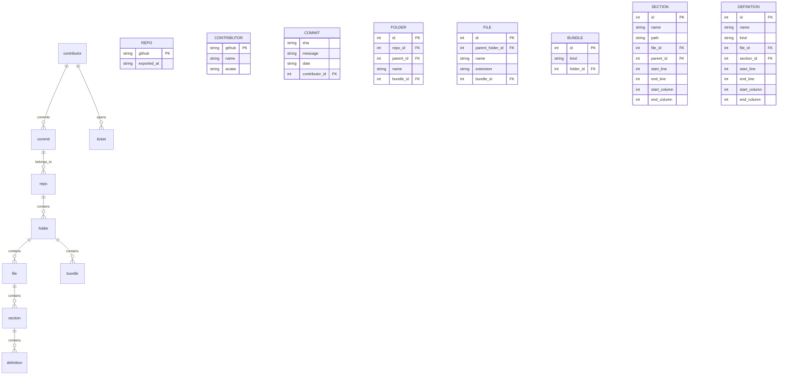

# Summary

SQLite schema definitions for repo exports.

# Docs

## 📐️schema.sql

SQLite schema with ticket UI storage alongside LLM and commit metadata.

# 💯️Requirements

```mermaid
erDiagram
    contributor ||--o{ commit : commits
    contributor ||--o{ ticket : opens
    commit ||--o{ repo : belongs_to
    repo ||--o{ folder : contains
    folder ||--o{ file : contains
    folder ||--o{ bundle : contains
    file ||--o{ section : contains
    section ||--o{ definition : contains
    REPO {
        string github PK
        string exported_at
    }
    CONTRIBUTOR {
        string github PK
        string name
        string avatar
    }
    COMMIT {
        string sha
        string message
        string date
        int contributor_id FK
    }
    FOLDER {
        int id PK
        int repo_id FK
        int parent_id FK
        string name
        int bundle_id FK
    }
    FILE {
        int id PK
        int parent_folder_id FK
        string name
        string extension
        int bundle_id FK
    }
    BUNDLE {
        int id PK
        string kind
        int folder_id FK
    }
    SECTION {
        int id PK
        string name
        string path
        int file_id FK
        int parent_id FK
        int start_line
        int end_line
        int start_column
        int end_column
    }
    DEFINITION {
        int id PK
        string name
        string kind
        int file_id FK
        int section_id FK
        int start_line
        int end_line
        int start_column
        int end_column
    }
```
