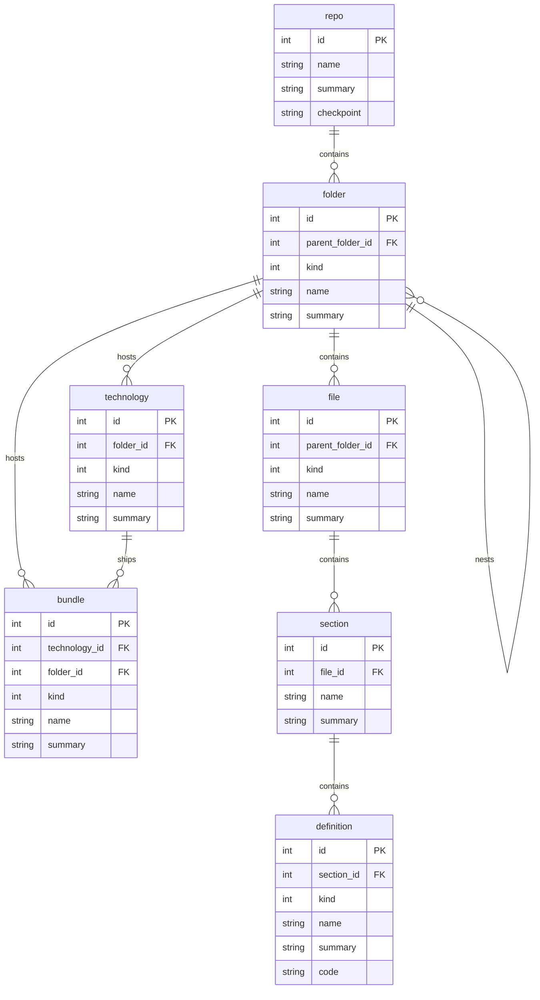

# Summary

SQLite schema of the repo client checkpoint export.

# Docs

## 🧬️schema

Scope `repo.client.sqlite` (`https://semio.tech/schema/repo/client/sqlite/schema.json`).

- `🧬️schema/🗄️.sql` — native SQLite implementation, seven tables.
- `🧬️schema/🔣️.json` — draft-07 contract, one `<Table>Row` export per table, each annotated
  `x-semio-persistence: local-only`.

Column names and nullability of both files are kept identical by
`📦️packages/🟦️typescript/🔬️schema.test.ts`.

The exported entity set is the one the client materializes in `ExportResult`
(`⌨️cli/📤️event_export.go`): technologies, bundles, folders, files, sections and definitions, rooted in
one repo checkpoint. Shared repo state lives in the repo server's PostgreSQL schema
(`🖥️server/🧬️schema/`), never here.

# 💯️Requirements

